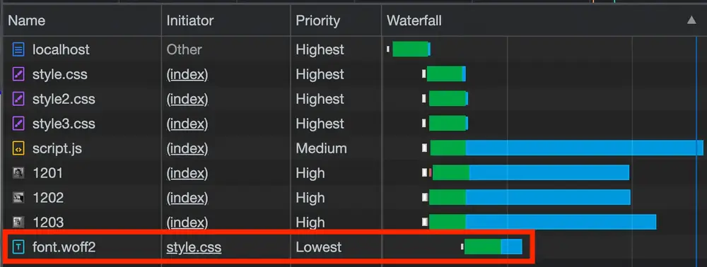
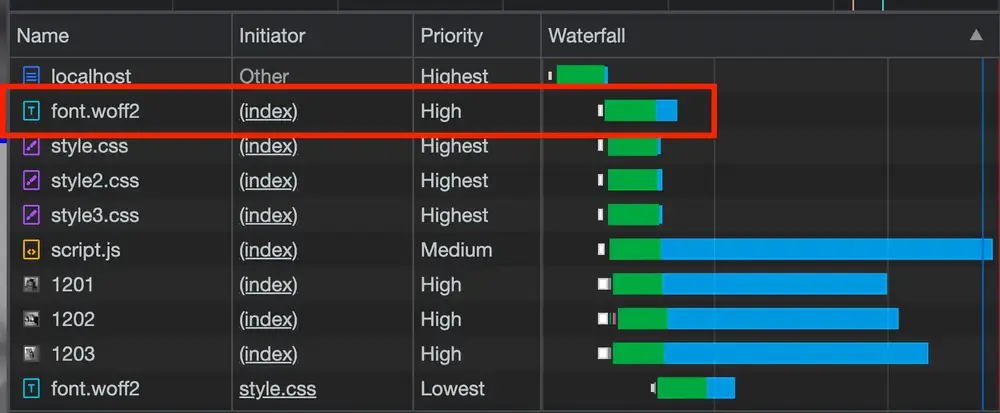
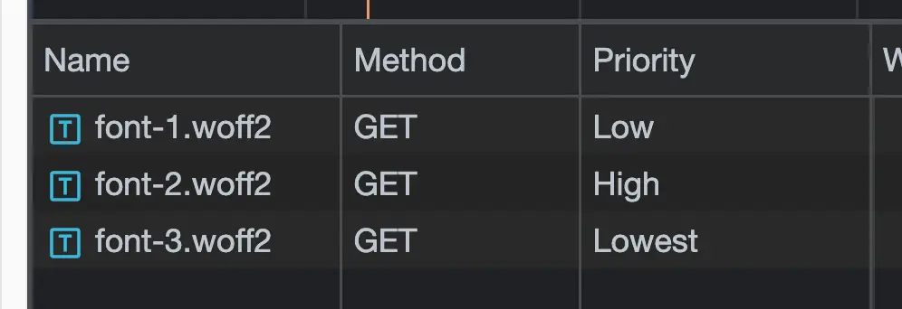
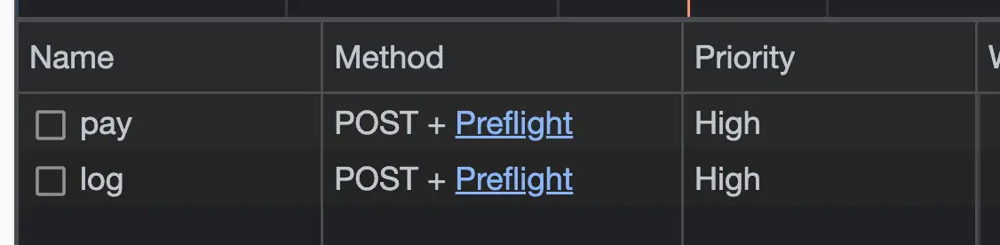
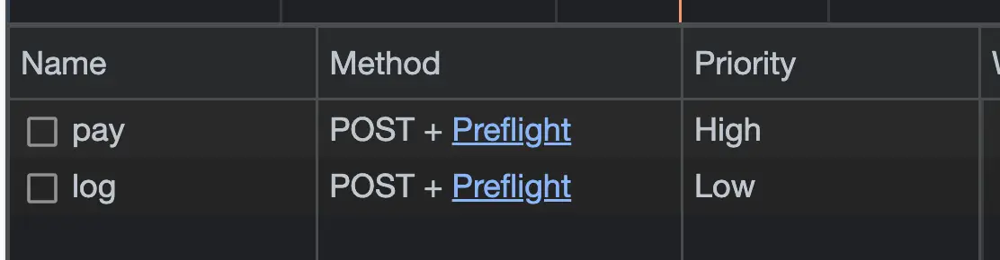
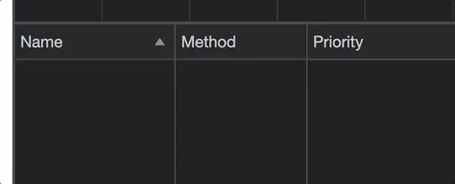
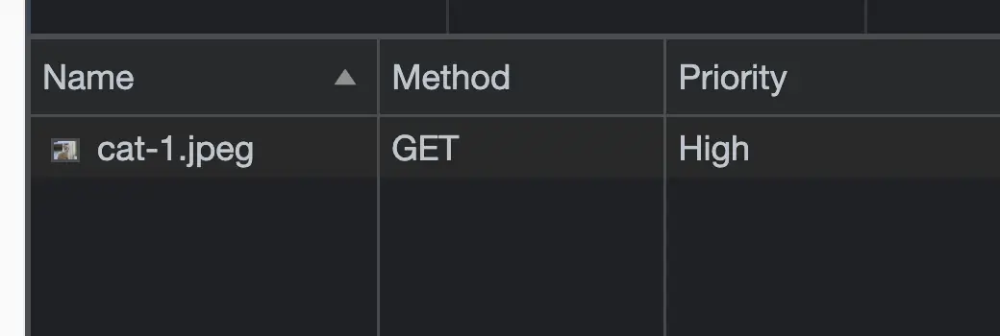
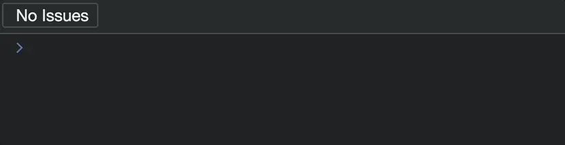
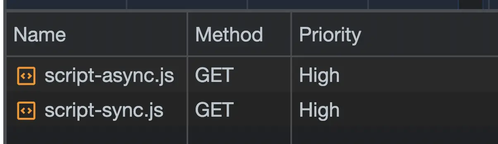
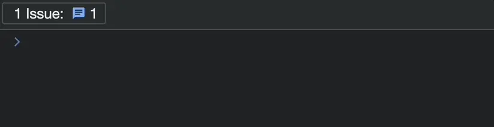

# Get All That Network Activity Under Control with Priority Hints

当我们打开浏览器的Network Tab，我们会看到大量的活动。资源正在被下载，信息正在被提交，事件正在被记录等等。

在如此繁忙的情况下，有效地管理这些流量的优先级顺序非常关键。带宽争用是真实存在的，当所有HTTP请求同时触发时，有些请求的重要性并不如其他请求。例如，如果必须选择，你可能更希望支付请求成功完成，而不仅仅是分析请求表明他们尝试了。而且，你可能更希望尽快显示重要的图片，而不是页脚的标志渲染。

幸运的是，浏览器提供了越来越多的工具，帮助优先处理所有这些网络活动。这些“优先级提示”帮助浏览器减少假设，并在资源有限时做出更明确的决策，决定支持哪些请求胜过其他请求。

这是一套有用的方法，当运用得当时，它们可以实质性地改善页面性能，包括那些非常重要的核心网络要素。现在让我们探索其中几个方法，以及它们在哪些场景下最有帮助。

## 使用 `<link rel="preload" ... />` 提前加载某些静态资源等

现代浏览器有一种被广泛支持的方法，可以告诉它与当前页面最终需要的资源：`<link rel="preload" ... />`。当放置在文档的`<head>`中时，浏览器会被告知要尽快以“高”优先级开始下载它。

预加载最适合用于在HTML直接加载的资源之外的后期发现的资产。比如：在某些CSS中加载的字体文件，或通过内联样式属性加载的背景图片。

```css
@font-face {
  font-family: "Inter Variable";
  src: url("./font.woff2") format("woff2");
}
```



```html
<head>
  <!-- Other stuff... -->
  <link rel="preload" href="/font.woff2" as="font">
</head>

 <!-- Or -->
<link rel="preload" href="./font-1.woff2" as="font" fetchpriority="low" />
<link rel="preload" href="./font-2.woff2" as="font" fetchpriority="high" />
```




通常情况下，在HTML直接加载的资源之外，有些对页面的体验至关重要（例如字体、CSS背景图片等）的静态资源等，可以使用预加载方法。当预加载多个相同类型的资源并且您清楚哪个最重要时，可以使用`fetchpriority`属性。

## 使用 `fetch() API` 中关于优先级的属性

在我看来，`Fetch API` 是现代 Web 中最便捷的功能之一。它具有一些 `XMLHttpRequest` 没有的不错特性，比如可以在发送请求时指定请求的优先级。

最常见的用例是我之前提到的：**分析请求**。当带宽有限且存在多个请求时，浏览器会自行做出优先级决策。但作为工程师，我们应该知道，典型的分析请求应该较其他对页面目的更为关键的请求处于次要地位。现代的 `fetch() API` 让这一点变得容易实现。

```js
fetch("http://localhost:8000/pay", {
  method: "POST",
  body: paymentBody,
});

fetch("http://localhost:8000/log", {
  method: "POST",
  body: loggingBody,
});
```



```js
fetch("http://localhost:8000/pay", {
  method: "POST",
  body: paymentBody,
  priority: "high"
});

fetch("http://localhost:8000/log", {
  method: "POST",
  body: loggingBody,
  priority: "low"
});
```



`fetch() API` 还有一个很有用的对应选项: `keepalive: true`。

我们经常会遇到一个问题，即“低”优先级的请求可能会被丢失 - 如果用户过早地离开页面，请求可能会被取消。这是一个合理的问题。根据几个因素，关闭选项卡或进入下一个页面可能会导致一个重要但优先级相对较低的请求被中止。

幸运的是，`fetch()`还接受一个`keepalive`选项。当设置为`true`时，即使页面被终止，浏览器也会将该请求完成。

当我们知道有多个请求同时执行，并且对我们来说很清楚哪个是最重要的（或者可以安全地降低优先级）时，可以去指定`fetch()`的优先级选项。

## 确定图片 `` 请求的优先级顺序

```html
 
 <div style="height: 5000px"></div>
 
 <div style="height: 5000px"></div>
 
```



```html
 
  <div style="height: 5000px"></div>
  
  <div style="height: 5000px"></div>
  
```



在我们知道图像对页面体验非常重要时，可以在图像上使用明确的`fetchpriority`属性。主要图片是一个很好的起点，它甚至可以对页面的核心 `Web Vitals`（特别是 LCP，即最大内容绘制时间）产生影响。

## 确定脚本 `<script />` 请求的优先级顺序

任何在页面上具有src属性的普通`<script />`都会以高优先级进行获取，但需要权衡的一个点在于：它可能会阻止解析页面的其余部分，直到它被加载和执行完为止。因此，`async`属性非常有帮助。它将以低优先级在后台请求脚本，并在准备就绪时立即执行。大多数情况下，这种行为是可以接受的。但有时候，我们可能希望一个脚本既以异步方式加载，又具有“高”优先级。

一个可能的情景是在一个着陆页的主要内容区域加载一个小型单页面应用（SPA）。为了保持页面的核心 Web 重要性指标，特别是最大内容绘制时间（LCP）和首次输入延迟（FID，即将被互动到下一个绘制替代），您需要将该脚本设定为高优先级（毕竟，它负责构建和驱动您的应用程序）。但与此同时，您又不希望它阻止页面的其余部分进行解析。

```html
<script src="/script-async.js" async onload="console.log('async')"></script>
<script src="/script-sync.js" onload="console.log('sync')"></script>
<script>console.log("inline");</script>
```




```html
<script src="/script-async.js" async onload="console.log('async')" fetchpriority="high"></script>
<script src="/script-sync.js" onload="console.log('sync')"></script>
<script>console.log("inline");</script>
```




在你已经知道脚本的优先级并且浏览器可能无法自行确定正确的优先级顺序时，我们可以给这些脚本设置`fetchpriority`，这对于希望以非阻塞、异步方式加载脚本的优先级设定特别有帮助。

## 总结

- `<link rel="preload" ... />`: 预加载资源，以便浏览器能够意识到多个后续发现的资源，其中一些对页面的重要性比其他资源更高。
- `fetch() API`: 使用 `fetch()` 请求时，要明确知道它们是用户体验的关键部分，或者可以安全地被降低优先级，以便为更重要的请求腾出空间。
- ``: 加载屏幕上更高优先级的图像，以便尽快加载并可见。
- `<script />`: 加载对页面功能至关重要但不希望阻止页面的其余部分（包括其他资源）被解析和下载的脚本。

浏览器非常聪明，可以智能地确定何时以及何时下载使我们的网页正常运行所必需的内容。但它并不总是表现得非常完美。它不知道一个页面存在的原因或其各个部分的意图。因此，偶尔需要一些额外的帮助。

这就是为什么存在这些优先级提示的原因：为了使指示清晰，并尽量减少浏览器在做出决策时出错的机会。在查看自己应用程序的网络活动时，在有合理的情况下使用这些方法，以帮助提高页面性能，使其更加智能化。

## 原文

[Get All That Network Activity Under Control with Priority Hints](https://www.macarthur.me/posts/priority-hints)