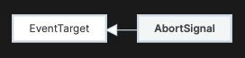

# AbortSignal

`AbortSignal` 接口表示一个信号对象（signal object），它允许你通过 `AbortController` 对象与 DOM 请求（如 Fetch）进行通信并在需要时将其中止。



```js
const controller = new AbortController();
const signal = controller.signal;

const url = "video.mp4";
const downloadBtn = document.querySelector(".download");
const abortBtn = document.querySelector(".abort");

downloadBtn.addEventListener("click", fetchVideo);

abortBtn.addEventListener("click", () => {
  controller.abort();
  console.log("Download aborted");
});

function fetchVideo() {
  fetch(url, { signal })
    .then((response) => {
      console.log("Download complete", response);
    })
    .catch((err) => {
      console.error(`Download error: ${err.message}`);
    });
}
```

## AbortSignal的实例属性

- `aborted`

`aborted` 是一个只读属性，它返回一个 Boolean 表示与之通信的请求是否被终止（`true`）或未终止（`false`）。

```js
const controller = new AbortController();
const signal = controller.signal;

// …

if (signal.aborted) {
  console.log("Request has been aborted");
} else {
  console.log("Request not aborted");
}
```

- `reason`

只读属性 `reason` 返回一个使用 JavaScript 值表示的中止原因。

```js
const controller = new AbortController();
const signal = controller.signal;

// …

if (signal.aborted) {
  if (signal.reason) {
    console.log(`Request aborted with reason: ${signal.reason}`);
  } else {
    console.log("Request aborted but no reason was given.");
  }
} else {
  console.log("Request not aborted");
}
```

## AbortSignal的静态方法

- `AbortSignal.abort()`

静态方法 `AbortSignal.abort()` 返回一个已经设置为中止的 `AbortSignal`（并且不会触发 abort 事件）。它是以下片段的简写：

```js
AbortSignal.abort(reason)

const controller = new AbortController();
controller.abort();
return controller.signal;
```

- `AbortSignal.any()`

```js
const cancelDownloadButton = document.getElementById("cancelDownloadButton");

const userCancelController = new AbortController();

cancelDownloadButton.addEventListener("click", () => {
  userCancelController.abort();
});

// Timeout after 5 minutes
const timeoutSignal = AbortSignal.timeout(1_000 * 60 * 5);

// This signal will abort when either the user clicks the cancel button or 5 minutes is up
// whichever is sooner
const combinedSignal = AbortSignal.any([
  userCancelController.signal,
  timeoutSignal,
]);

try {
  const res = await fetch(someUrlToDownload, {
    // Stop the fetch when any of the signals aborts
    signal: combinedSignal,
  });
  const body = await res.blob();
  // Do something with downloaded content:
  // ...
} catch (e) {
  if (e.name === "AbortError") {
    // Cancelled by the user
  } else if (e.name === "TimeoutError") {
    // Show user that download timed out
  } else {
    // Other error, e.g. network error
  }
}
```

- `AbortSignal.timeout()`

静态方法 `AbortSignal.timeout()` 返回一个指定时间后将自动中止的 `AbortSignal`。

```js
const url = "https://path_to_large_file.mp4";

try {
  const res = await fetch(url, { signal: AbortSignal.timeout(5000) });
  const result = await res.blob();
  // …
} catch (err) {
  if (err.name === "TimeoutError") {
    console.error("Timeout: It took more than 5 seconds to get the result!");
  } else if (err.name === "AbortError") {
    console.error(
      "Fetch aborted by user action (browser stop button, closing tab, etc.",
    );
  } else if (err.name === "TypeError") {
    console.error("AbortSignal.timeout() method is not supported");
  } else {
    // A network error, or some other problem.
    console.error(`Error: type: ${err.name}, message: ${err.message}`);
  }
}
```

## AbortSignal的实例方法

- `throwIfAborted()`

如果 `signal` 已经被中止，则 `throwIfAborted()` 方法抛出中止的 `reason`；否则它什么也不做。

```js
async function waitForCondition(func, targetValue, { signal } = {}) {
  while (true) {
    signal?.throwIfAborted();

    const result = await func();
    if (result === targetValue) {
      return;
    }
  }
}
```

## 参考资料

[AbortSignal](https://developer.mozilla.org/en-US/docs/Web/API/AbortSignal)
