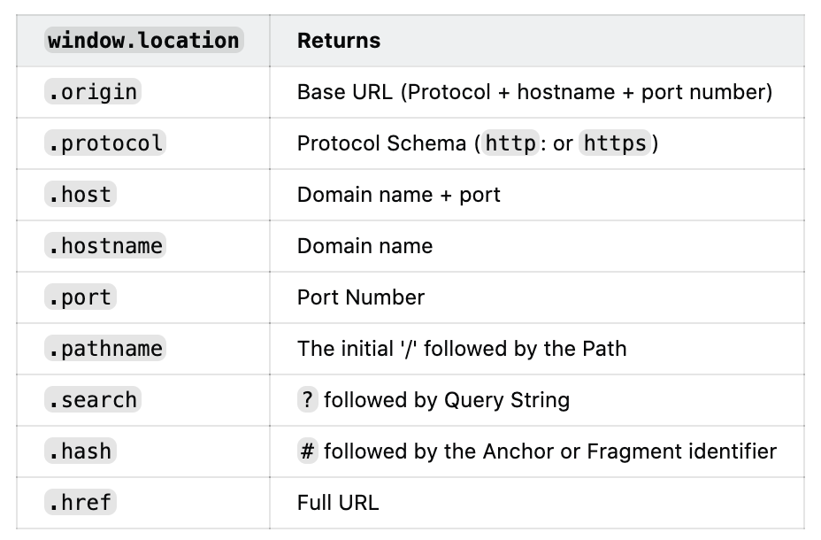

# BOM（浏览器对象模型）

BOM（浏览器对象模型）是浏览器本身的一些信息的设置和获取，例如获取浏览器的宽度、高度，设置让浏览器跳转到哪个地址等等。

- window
- navigator
- screen
- location
- history

### 获取浏览器特性（即俗称的 UA）然后识别客户端，例如判断是不是 Chrome 浏览器

```js
var ua = navigator.userAgent;
var isChrome = ua.indexOf("Chrome");
console.log(isChrome);
```

### 获取屏幕的宽度和高度

```js
console.log(screen.width);
console.log(screen.height);
```

### 获取网址、协议、path、参数、hash 等

```js
// https://www.samanthaming.com:8080/tidbits/?filter=JS#2
window.location.origin   → 'https://www.samanthaming.com'
               .protocol → 'https:'
               .host     → 'www.samanthaming.com:8080'
               .hostname → 'www.samanthaming.com'
               .port     → ''
               .pathname → '/tidbits/'
               .search   → '?filter=JS'
               .hash     → '#2'
               .href     → 'https://www.samanthaming.com/tidbits/?filter=JS#2'

window.location.assign('url')
               .replace('url')
               .reload()
               .toString()
```



```js
// 例如当前网址是 https://leetcode-cn.com/problemset/all/?difficulty=%E7%AE%80%E5%8D%95#some
console.log(location.href); // https://leetcode-cn.com/problemset/all/?difficulty=%E7%AE%80%E5%8D%95#some
console.log(location.protocol); // https:
console.log(location.pathname); // /problemset/all
console.log(location.search); // ?difficulty=%E7%AE%80%E5%8D%95
console.log(location.hash); // #some
```

### 调用浏览器的前进、后退功能等

```js
history.back();
history.forward();
```

[window.location Cheatsheet](https://dev.to/samanthaming/window-location-cheatsheet-4edl)
