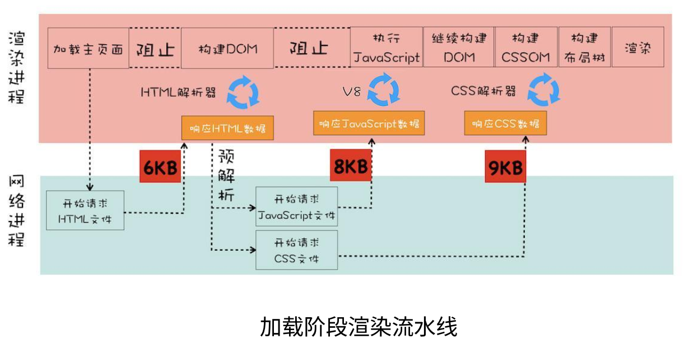
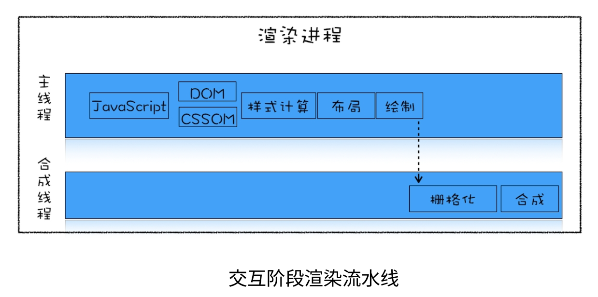

# 浏览器渲染过程和原理

浏览器的主要功能是向服务器请求您选择的网络资源，并在浏览器窗口中显示该资源，从而呈现该资源。 资源通常是 HTML 文档，但也可能是 PDF、图片或某种其他类型的内容。 资源的位置由用户使用 URI（统一资源标识符）指定。


## 网络请求和响应过程

当⽤户输⼊关键字并键⼊回⻋之后，这意味着当前⻚⾯即将要被替换成新的⻚⾯，浏览器进程会通过进程间通信（IPC）把URL请求发送⾄⽹络进程。

⾸先，⽹络进程会查找本地缓存是否缓存了该资源。如果有缓存资源，那么直接返回资源给浏览器进程；如果在缓存中没有查找到资源，那么直接进⼊⽹络请求流程。这请求前的第⼀步是要进⾏DNS解析，以获取请求域名的服务器IP地址。如果请求协议是HTTPS，那么还需要建⽴TLS连接。

接下来就是利⽤IP地址和服务器建⽴TCP连接。连接建⽴之后，浏览器端会构建请求⾏、请求头等信息，并把和该域名相关的Cookie等数据附加到请求头中，然后向服务器发送构建的请求信息。

服务器接收到请求信息后，会根据请求信息⽣成响应数据（包括响应⾏、响应头和响应体等信息），并发给⽹络进程。等⽹络进程接收了响应⾏和响应头之后，就开始解析响应头的内容了。

### 1. 构建请求

浏览器会构建请求报文:

```js
// 请求方法是 GET，路径为根路径，HTTP 协议版本为 1.1
GET / HTTP / 1.1;
```

### 2. 查找强缓存

先检查浏览器是否存在该资源的强缓存，如果命中直接使用，否则进入下一步。

### 3. DNS 解析

由于我们输入的是域名，而数据包是通过查找 `IP` 地址传给对方的。因此我们需要得到域名对应的 `IP` 地址。这个过程需要依赖一个服务系统，这个系统将域名和 `IP` 一一映射，我们将这个系统就叫做 `DNS`（域名系统）。得到具体 `IP` 的过程就是 **DNS 解析**。

当然，值得注意的是，浏览器提供了 **DNS 数据缓存**功能。即如果一个域名已经解析过，那会把解析的结果缓存下来，下次处理直接走缓存，不需要经过 `DNS` 解析。

另外，如果不指定端口的话，默认采用对应的 `IP` 的 80 端口。

### 4. 建立 TCP 连接

`Chrome` 在同一个域名下要求同时最多只能有 **6 个 TCP 连接**，超过 6 个的话剩下的请求就得等待。

`TCP`（Transmission Control Protocol，传输控制协议）是一种**面向连接的**、**可靠的**、**基于字节流的**传输层通信协议。

建立 `TCP` 连接经历了下面三个阶段:

- 通过**三次握手**(即总共发送 3 个数据包确认已经建立连接)建立客户端和服务器之间的连接。
- 进行数据传输。这里有一个重要的机制，就是接收方接收到数据包后必须要向发送方确认, 如果发送方没有接到这个确认的消息，就判定为数据包丢失，并重新发送该数据包。当然，发送的过程中还有一个优化策略，就是把大的数据包拆成一个个小包，依次传输到接收方，接收方按照这个小包的顺序把它们组装成完整数据包。
- 断开连接的阶段。数据传输完成，现在要断开连接了，通过**四次挥手**来断开连接。

### 5.发送 HTTP 请求

1. 请求报文

现在 `TCP` 连接建立完毕，浏览器可以和服务器开始通信，即开始发送 `HTTP` 请求。浏览器发 `HTTP` 请求要携带三样东西:**请求行**、**请求头**和**请求体**。

首先，浏览器会向服务器发送请求报文，关于请求报文， 我们在第一步就构建完了:

```js
// 请求方法是 GET，路径为根路径，HTTP 协议版本为 1.1
GET / HTTP / 1.1;
```

结构很简单，由**请求方法**、**请求 URI** 和 **HTTP 版本协议**组成。

同时也要带上请求头，比如我们之前说的 `Cache-Control`、`If-Modified-Since`、`If-None-Match` 都由可能被放入请求头中作为缓存的标识信息。当然了还有一些其他的属性，列举如下:

```js
Accept: text/html,application/xhtml+xml,application/xml;q=0.9,image/webp,image/apng,_/_;q=0.8,application/signed-exchange;v=b3
Accept-Encoding: gzip, deflate, br
Accept-Language: zh-CN,zh;q=0.9
Cache-Control: no-cache
Connection: keep-alive
Cookie: /_ 省略 cookie 信息 _/
Host: www.baidu.com
Pragma: no-cache
Upgrade-Insecure-Requests: 1
User-Agent: Mozilla/5.0 (iPhone; CPU iPhone OS 11_0 like Mac OS X) AppleWebKit/604.1.38 (KHTML, like Gecko) Version/11.0 Mobile/15A372 Safari/604.1
```

最后是请求体，请求体在 `POST` 方法下存在，常见的场景是表单提交。

2. 响应报文

`HTTP` 请求到达服务器，服务器进行对应的处理。最后要把数据传给浏览器，也就是返回网络响应。

跟请求部分类似，网络响应具有三个部分:**响应行**、**响应头**和**响应体**。响应行类似下面这样:

```js
HTTP/1.1 200 OK
```

由 **HTTP 协议版本**、**状态码**和**状态描述**组成。

响应头包含了服务器及其返回数据的一些信息, 服务器生成数据的时间、返回的数据类型以及对即将写入的 `Cookie` 信息。举例如下:

```js
Cache-Control: no-cache
Connection: keep-alive
Content-Encoding: gzip
Content-Type: text/html;charset=utf-8
Date: Wed, 04 Dec 2019 12:29:13 GMT
Server: apache
Set-Cookie: rsv_i=f9a0SIItKqzv7kqgAAgphbGyRts3RwTg%2FLyU3Y5Eh5LwyfOOrAsvdezbay0QqkDqFZ0DfQXby4wXKT8Au8O7ZT9UuMsBq2k; path=/; domain=.baidu.com
```

响应完成之后怎么办？`TCP` 连接就断开了吗？

不一定。这时候要判断 `Connection` 字段, 如果请求头或响应头中包含 `Connection: Keep-Alive`，表示建立了持久连接，这样 `TCP` 连接会一直保持，之后请求统一站点的资源会复用这个连接。否则断开 `TCP` 连接, 请求-响应流程结束。

## 浏览器解析资源过程

浏览器解析返回网络请求返回的 `html` 文件流程如下：

- 构建DOM树（DOM Tree）：Parsing HTML
- 样式计算（CSSOM Tree）：Style Calculation
- 生成布局树(Layout Tree)：Combine DOM Tree and CSSOM Tree
- 建立图层树(Layer Tree)：Create Layer Tree

1. 构建 `DOM` 树（DOM Tree）

由于浏览器无法直接理解 `HTML` 字符串，因此将这一系列的字节流转换为一种有意义并且方便操作的数据结构，这种数据结构就是 `DOM` 树。`DOM` 树本质上是一个以 `document` 为根节点的多叉树。在解析DOM的过程中，如果遇到了JavaScript脚本，那么需要先暂停DOM解析去执⾏JavaScript，因为JavaScript有可能会修改当前状态下的DOM。不过在执⾏JavaScript脚本之前，如果⻚⾯中包含了外部CSS⽂件的引⽤，或者通过style标签内置了CSS内容，那么渲染引擎还需要将这些内容转换为CSSOM，因为JavaScript有修改CSSOM的能⼒，所以在执⾏JavaScript之前，还需要依赖CSSOM。也就是说CSS在部分情况下也会阻塞DOM的⽣成。

- 解析算法

HTML5 规范详细地介绍了解析算法。这个算法分为两个阶段:

- 标记化。
- 建树。

对应的两个过程就是词法分析和语法分析。

- 标记化算法

这个算法输入为 `HTML` 文本，输出为 `HTML` 标记，也成为标记生成器。其中运用有限自动状态机来完成。即在当当前状态下，接收一个或多个字符，就会更新到下一个状态。

- 建树算法

之前提到过，`DOM` 树是一个以 `document` 为根节点的多叉树。因此解析器首先会创建一个 `document` 对象。标记生成器会把每个标记的信息发送给建树器。建树器接收到相应的标记时，会创建对应的 `DOM` 对象。创建这个 `DOM` 对象后会做两件事情:

(1) 将 `DOM` 对象加入 `DOM` 树中。

(2)将对应标记压入存放开放(与闭合标签意思对应)元素的栈中。

2. 样式计算（CSSOM Tree）

关于 `CSS` 样式，它的来源一般是三种:

   1. `link` 标签引用
   2. `style` 标签中的样式
   3. 元素的内嵌 `style` 属性

- 格式化样式表

首先，浏览器是无法直接识别 `CSS` 样式文本的，因此渲染引擎接收到 `CSS` 文本之后第一件事情就是将其转化为一个结构化的对象，即 `styleSheets`。这个格式化的过程过于复杂，而且对于不同的浏览器会有不同的优化策略。在浏览器控制台能够通过 `document.styleSheets` 来查看这个最终的结构。当然，这个结构包含了以上三种 `CSS` 来源，为后面的样式操作提供了基础。

- 标准化样式属性

有一些 `CSS` 样式的数值并不容易被渲染引擎所理解，因此需要在计算样式之前将它们**标准化**，如 `em->px`,`red->#ff0000`,`bold->700` 等等。

- 计算每个节点的具体样式

样式已经被格式化和标准化，接下来就可以计算每个节点的具体样式信息了。计算的方式也并不复杂，主要就是两个规则: **继承**和**层叠**。

每个子节点都会默认继承父节点的样式属性，如果父节点中没有找到，就会采用浏览器默认样式，也叫 `UserAgent` 样式。这就是**继承规则**。

然后是**层叠规则**，`CSS` 最大的特点在于它的层叠性，也就是最终的样式取决于各个属性共同作用的效果，甚至有很多诡异的层叠现象。

不过值得注意的是，在计算完样式之后，所有的样式值会被挂在到 `window.getComputedStyle` 当中，也就是可以通过 `JS` 来获取计算后的样式，非常方便。

3. 生成布局树（Layout Tree）

现在已经生成了 `DOM` 树和 `DOM` 样式，接下来要做的就是通过浏览器的布局系统确定元素的位置，也就是要生成一棵布局树(Layout Tree)。

布局树生成的大致工作如下:

- 遍历生成的 `DOM` 树节点，为对应的DOM元素选择对应的样式信息，并把他们添加到布局树中。
- 计算布局树节点的坐标位置。

值得注意的是，这棵布局树值包含可见元素，对于 `head` 标签和设置了 `display: none` 的元素，将不会被放入其中。

有人说首先会生成 Render Tree，也就是渲染树，其实这还是 16 年之前的事情，现在 Chrome 团队已经做了大量的重构，已经没有生成 Render Tree 的过程了。而布局树的信息已经非常完善，完全拥有 Render Tree 的功能。

4. 建图层树(Layer Tree)

如果你觉得现在 `DOM` 节点也有了，样式和位置信息也都有了，可以开始绘制页面了，那就错了。因为忽略了另外一些复杂的场景，比如 3D 动画如何呈现出变换效果，当元素含有层叠上下文时如何控制显示和隐藏等等。

为了解决如上所述的问题，浏览器在构建完布局树之后，还会对特定的节点进行**分层**，构建一棵图层树(Layer Tree)。那这棵图层树是根据什么来构建的呢？

一般情况下，节点的图层会默认属于父亲节点的图层(这些图层也称为合成层)。那什么时候会提升为一个单独的合成层呢？有两种情况需要分别讨论，一种是**显式合成**，一种是**隐式合成**。

- 显式合成

(1) 拥有层叠上下文的节点。

层叠上下文也基本上是有一些特定的 `CSS` 属性创建的，一般有以下情况:

1. `HTML` 根元素本身就具有层叠上下文。
2. 普通元素设置 `position` 不为 `static` 并且设置了 `z-index` 属性，会产生层叠上下文。
3. 元素的 opacity 值不是 1
4. 元素的 transform 值不是 none
5. 元素的 filter 值不是 none
6. 元素的 isolation 值是 isolate
7. will-change 指定的属性值为上面任意一个。

(2) 需要剪裁的地方。

比如一个 `div`，你只给他设置 100 * 100 像素的大小，而你在里面放了非常多的文字，那么超出的文字部分就需要被剪裁。当然如果出现了滚动条，那么滚动条会被单独提升为一个图层。

- 隐式合成

接下来是隐式合成，简单来说就是层叠等级低的节点被提升为单独的图层之后，那么所有层叠等级比它高的节点都会成为一个单独的图层。

这个隐式合成其实隐藏着巨大的风险，如果在一个大型应用中，当一个 `z-index` 比较低的元素被提升为单独图层之后，层叠在它上面的的元素统统都会被提升为单独的图层，可能会增加上千个图层，大大增加内存的压力，甚至直接让页面崩溃。这就是层爆炸的原理。值得注意的是，当需要 `repaint` 时，只需要 `repaint` 本身，而不会影响到其他的层。

## 浏览器渲染并展示的过程

浏览器渲染分为以下几个步骤:

- 生成绘制列表
- 生成图块并栅格化
- 显示器显示内容

1. 生成绘制列表

有了 DOM、样式和布局信息仍不足以呈现页面。比如某些元素设置了z-index，仅按照 HTML 元素的顺序会导致渲染的结果不正确，所以还需要知道绘制的顺序。主线程会遍历之前的布局树（Layout Tree）来生成一系列的**绘制指令**（paint records），从而得到了绘制的顺序，比如先画背景、再描绘边框等等…然后将这些指令按顺序组合成一个**待绘制列表**，相当于给后面的绘制操作做好了计划。

2. 生成图块并栅格化

经过上面的步骤，浏览器知道了文档结构、每个元素的样式、页面的几何形状和绘制顺序。浏览器就可以开始绘制页面。而将这些信息转化为显示器的像素的过程叫做**光栅化**。现在开始绘制操作，实际上在渲染进程中绘制操作是由专门的线程来完成的，这个线程叫**合成线程**。

绘制列表准备好了之后，渲染进程的主线程会给合成线程发送 `commit` 消息，把绘制列表提交给合成线程。接下来就是合成线程开始操作了。

首先，考虑到视口就这么大，当页面非常大的时候，要滑很长时间才能滑到底，如果要一口气全部绘制出来是相当浪费性能的。因此，合成线程要做的第一件事情就是将图层分块。这些块的大小一般不会特别大，通常是 256\*256 或者 512\*512 这个规格。这样可以大大加速页面的首屏展示。

因为后面图块数据要进入 `GPU` 内存，考虑到浏览器内存上传到 `GPU` 内存的操作比较慢，即使是绘制一部分图块，也可能会耗费大量时间。针对这个问题，`Chrome` 采用了一个策略: 在首次合成图块时只采用一个**低分辨率**的图片，这样首屏展示的时候只是展示出低分辨率的图片，这个时候继续进行合成操作，当正常的图块内容绘制完毕后，会将当前低分辨率的图块内容替换。这也是 `Chrome` 底层优化首屏加载速度的一个手段。

顺便提醒一点，渲染进程中专门维护了一个栅格化线程池，专门负责把图块转换为位图数据。然后合成线程会选择视口附近的图块，把它交给栅格化线程池生成位图。生成位图的过程实际上都会使用 `GPU` 进行加速，生成的位图最后发送给合成线程。

3. 显示器显示内容

栅格化操作完成后，**合成线程**会生成一个绘制命令，并发送给浏览器进程。

浏览器进程中的 viz 组件接收到这个命令，根据这个命令，把页面内容绘制到内存，也就是生成了页面，然后把这部分内存发送给显卡。

无论是 PC 显示器还是手机屏幕，都有一个固定的刷新频率，一般是 60 HZ，即 60 帧，也就是一秒更新 60 张图片，一张图片停留的时间约为 16.7 ms。而每次更新的图片都来自显卡的前缓冲区。而显卡接收到浏览器进程传来的页面后，会合成相应的图像，并将图像保存到后缓冲区，然后系统自动将前缓冲区和后缓冲区对换位置，如此循环更新。

看到这里就会明白，当某个动画大量占用内存的时候，浏览器生成图像的时候会变慢，图像传送给显卡就会不及时，而显示器还是以不变的频率刷新，因此会出现卡顿，也就是明显的掉帧现象。在写Web应⽤的时候，你可能经常需要对某个元素做⼏何形状变换、透明度变换或者⼀些缩放操作，如果使⽤JavaScript来写这些效果，会牵涉到整个渲染流⽔线，所以JavaScript的绘制效率会⾮常低下。这时你可以使⽤ will-change来告诉渲染引擎你会对该元素做⼀些特效变换。这时候渲染引擎会将该元素单独实现⼀帧，等这些变换发⽣
时，渲染引擎会通过合成线程直接去处理变换，这些变换并没有涉及到主线程，这样就⼤⼤提升了渲染的效率。

## 实践意义

通常⼀个⻚⾯有三个阶段：加载阶段、交互阶段和关闭阶段，在优化页面时通常关注加载和交互阶段：

- 加载阶段：是指从发出请求到渲染出完整⻚⾯的过程，影响到这个阶段的主要因素有⽹络和JavaScript脚本。
- 交互阶段：主要是从⻚⾯加载完成到⽤户交互的整合过程，影响到这个阶段的主要因素是JavaScript脚本。
- 关闭阶段：主要是⽤户发出关闭指令后⻚⾯所做的⼀些清理操作。



在加载阶段，这些能阻塞⽹⻚⾸次渲染的资源称为关键资源，`HTML`、`CSS`、`JavaScript`等文件都是网页构建的关键资源：

- 关键资源个数
- 关键资源⼤⼩
- 请求关键资源需要多少个`RTT`
   通常1个`HTTP`的数据包在14KB左右，所以1个0.1M的⻚⾯就需要拆分成8个包来传输了，也就是说需要8个`RTT`。`RTT`就是往返时延。它是⽹络中⼀个重要的性能指标，表⽰从发送端发送数据开始，到发送端收到来⾃接收端的确认，总共经历的时延。



在交互阶段，⼤部分情况下，⽣成⼀个新的帧都是由`JavaScript`通过修改`DOM`或者`CSSOM`来触发的，还有另外⼀部分帧是由`CSS`来触发的：

- 如果在计算样式阶段发现有布局信息的修改，那么就会触发**重排**操作，然后触发后续渲染流⽔线的⼀系列操作，这个代价是⾮常⼤的。
- 同样如果在计算样式阶段没有发现有布局信息的修改，只是修改了颜⾊⼀类的信息，那么就不会涉及到布局相关的调整，所以可以跳过布局阶段，直接进⼊绘制阶段，这个过程叫**重绘**。
- 还有另外⼀种情况，通过`CSS`实现⼀些变形、渐变、动画等特效，这是由`CSS`触发的，并且是在合成线程上执⾏的，这个过程称为**合成**。因为它不会触发重排或者重绘，⽽且合成操作本⾝的速度就⾮常快，所以执⾏合成是效率最⾼的⽅式。

一些平时开发中可以注意的点：

1. 避免频繁使用 `style`，而是采用修改 `class` 的方式；
2. 使用 `createDocumentFragment` 进行批量的 `DOM` 操作；
3. 对于 `resize`、`scroll` 等进行防抖/节流处理；
4. 添加 `will-change: transform` ，让渲染引擎为其单独实现一个图层，当这些变换发生时，仅仅只是利用合成线程去处理这些变换，而不牵扯到主线程，大大提高渲染效率。当然这个变化不限于 `transform`， 任何可以实现合成效果的 `CSS` 属性都能用 `will-change` 来声明；
5. 减少`JavaScript`脚本执⾏时间，将⼀次执⾏的函数分解为多个任务，使得每次的执⾏时间不要过久，采⽤`Web Workers`。可以把`Web Workers`当作主线程之外的⼀个线程，在`Web Workers`中是可以执⾏`JavaScript`脚本的，不过`WebWorkers`中没有`DOM`、`CSSOM`环境，这意味着在`Web Workers`中是⽆法通过`JavaScript`来访问`DOM`的，所以我们可以把⼀些和`DOM`操作⽆关且耗时的任务放到`Web Workers`中去执⾏；
6. 避免频繁的垃圾回收，尽可能优化储存结构，尽可能避免⼩颗粒对象的产⽣；

## 总结

- 浏览器的网络流程：构建请求、查找强缓存、DNS解析、发送HTTP请求、获取服务器响应内容等；
- 浏览器的渲染流程：HTML解析成DOM、样式计算、布局、图层、绘制、光栅化、合成和显⽰等；
- 浏览器的多进程架构：浏览器主进程、渲染进程、GPU进程、Plugin进程、网络进程等；

## 参考资料

[How browsers work](https://web.dev/articles/howbrowserswork?hl=zh-cn#The_browsers_we_will_talk_about)

[浏览器灵魂之问，请问你能接得住几个？](https://juejin.cn/post/6844904021308735502#heading-24)

[How the browser renders a web page? — DOM, CSSOM, and Rendering](https://medium.com/jspoint/how-the-browser-renders-a-web-page-dom-cssom-and-rendering-df10531c9969)

[Populating the page: how browsers work](https://developer.mozilla.org/en-US/docs/Web/Performance/How_browsers_work)

[Chrome 浏览器架构](https://xie.infoq.cn/article/5d36d123bfd1c56688e125ad3)
