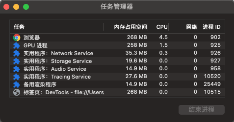

# 浏览器渲染过程和原理

浏览器的主要功能是向服务器请求您选择的网络资源，并在浏览器窗口中显示该资源，从而呈现该资源。 资源通常是 HTML 文档，但也可能是 PDF、图片或某种其他类型的内容。 资源的位置由用户使用 URI（统一资源标识符）指定。


## 网络请求和响应过程

### 1. 构建请求

浏览器会构建请求报文:

```js
// 请求方法是 GET，路径为根路径，HTTP 协议版本为 1.1
GET / HTTP / 1.1;
```

### 2. 查找强缓存

先检查浏览器是否存在该资源的强缓存，如果命中直接使用，否则进入下一步。

### 3. DNS 解析

由于我们输入的是域名，而数据包是通过查找 `IP` 地址传给对方的。因此我们需要得到域名对应的 `IP` 地址。这个过程需要依赖一个服务系统，这个系统将域名和 `IP` 一一映射，我们将这个系统就叫做 `DNS`（域名系统）。得到具体 `IP` 的过程就是 **DNS 解析**。

当然，值得注意的是，浏览器提供了 **DNS 数据缓存**功能。即如果一个域名已经解析过，那会把解析的结果缓存下来，下次处理直接走缓存，不需要经过 `DNS` 解析。

另外，如果不指定端口的话，默认采用对应的 `IP` 的 80 端口。

### 4. 建立 TCP 连接

`Chrome` 在同一个域名下要求同时最多只能有 **6 个 TCP 连接**，超过 6 个的话剩下的请求就得等待。

`TCP`（Transmission Control Protocol，传输控制协议）是一种**面向连接的**、**可靠的**、**基于字节流的**传输层通信协议。

建立 `TCP` 连接经历了下面三个阶段:

- 通过**三次握手**(即总共发送 3 个数据包确认已经建立连接)建立客户端和服务器之间的连接。
- 进行数据传输。这里有一个重要的机制，就是接收方接收到数据包后必须要向发送方确认, 如果发送方没有接到这个确认的消息，就判定为数据包丢失，并重新发送该数据包。当然，发送的过程中还有一个优化策略，就是把大的数据包拆成一个个小包，依次传输到接收方，接收方按照这个小包的顺序把它们组装成完整数据包。
- 断开连接的阶段。数据传输完成，现在要断开连接了，通过**四次挥手**来断开连接。

### 5.发送 HTTP 请求

1. 请求报文

现在 `TCP` 连接建立完毕，浏览器可以和服务器开始通信，即开始发送 `HTTP` 请求。浏览器发 `HTTP` 请求要携带三样东西:**请求行**、**请求头**和**请求体**。

首先，浏览器会向服务器发送请求报文，关于请求报文， 我们在第一步就构建完了:

```js
// 请求方法是 GET，路径为根路径，HTTP 协议版本为 1.1
GET / HTTP / 1.1;
```

结构很简单，由**请求方法**、**请求 URI** 和 **HTTP 版本协议**组成。

同时也要带上请求头，比如我们之前说的 `Cache-Control`、`If-Modified-Since`、`If-None-Match` 都由可能被放入请求头中作为缓存的标识信息。当然了还有一些其他的属性，列举如下:

```js
Accept: text/html,application/xhtml+xml,application/xml;q=0.9,image/webp,image/apng,_/_;q=0.8,application/signed-exchange;v=b3
Accept-Encoding: gzip, deflate, br
Accept-Language: zh-CN,zh;q=0.9
Cache-Control: no-cache
Connection: keep-alive
Cookie: /_ 省略 cookie 信息 _/
Host: www.baidu.com
Pragma: no-cache
Upgrade-Insecure-Requests: 1
User-Agent: Mozilla/5.0 (iPhone; CPU iPhone OS 11_0 like Mac OS X) AppleWebKit/604.1.38 (KHTML, like Gecko) Version/11.0 Mobile/15A372 Safari/604.1
```

最后是请求体，请求体在 `POST` 方法下存在，常见的场景是表单提交。

2. 响应报文

`HTTP` 请求到达服务器，服务器进行对应的处理。最后要把数据传给浏览器，也就是返回网络响应。

跟请求部分类似，网络响应具有三个部分:**响应行**、**响应头**和**响应体**。响应行类似下面这样:

```js
HTTP/1.1 200 OK
```

由 **HTTP 协议版本**、**状态码**和**状态描述**组成。

响应头包含了服务器及其返回数据的一些信息, 服务器生成数据的时间、返回的数据类型以及对即将写入的 `Cookie` 信息。举例如下:

```js
Cache-Control: no-cache
Connection: keep-alive
Content-Encoding: gzip
Content-Type: text/html;charset=utf-8
Date: Wed, 04 Dec 2019 12:29:13 GMT
Server: apache
Set-Cookie: rsv_i=f9a0SIItKqzv7kqgAAgphbGyRts3RwTg%2FLyU3Y5Eh5LwyfOOrAsvdezbay0QqkDqFZ0DfQXby4wXKT8Au8O7ZT9UuMsBq2k; path=/; domain=.baidu.com
```

响应完成之后怎么办？`TCP` 连接就断开了吗？

不一定。这时候要判断 `Connection` 字段, 如果请求头或响应头中包含 `Connection: Keep-Alive`，表示建立了持久连接，这样 `TCP` 连接会一直保持，之后请求统一站点的资源会复用这个连接。否则断开 `TCP` 连接, 请求-响应流程结束。

## 浏览器解析资源过程

浏览器解析返回网络请求返回的 `html` 文件流程如下：

- 构建DOM树（DOM Tree）：Parsing HTML
- 样式计算（CSSOM Tree）：Style Calculation
- 生成布局树(Layout Tree)：Combine DOM Tree and CSSOM Tree
- 建立图层树(Layer Tree)：Create Layer Tree

1. 构建 `DOM` 树（DOM Tree）

由于浏览器无法直接理解 `HTML` 字符串，因此将这一系列的字节流转换为一种有意义并且方便操作的数据结构，这种数据结构就是 `DOM` 树。`DOM` 树本质上是一个以 `document` 为根节点的多叉树。

- 解析算法

HTML5 规范详细地介绍了解析算法。这个算法分为两个阶段:

- 标记化。
- 建树。

对应的两个过程就是词法分析和语法分析。

- 标记化算法

这个算法输入为 `HTML` 文本，输出为 `HTML` 标记，也成为标记生成器。其中运用有限自动状态机来完成。即在当当前状态下，接收一个或多个字符，就会更新到下一个状态。

- 建树算法

之前提到过，`DOM` 树是一个以 `document` 为根节点的多叉树。因此解析器首先会创建一个 `document` 对象。标记生成器会把每个标记的信息发送给建树器。建树器接收到相应的标记时，会创建对应的 `DOM` 对象。创建这个 `DOM` 对象后会做两件事情:

(1) 将 `DOM` 对象加入 `DOM` 树中。

(2)将对应标记压入存放开放(与闭合标签意思对应)元素的栈中。

2. 样式计算（CSSOM Tree）

关于 `CSS` 样式，它的来源一般是三种:

   1. `link` 标签引用
   2. `style` 标签中的样式
   3. 元素的内嵌 `style` 属性

- 格式化样式表

首先，浏览器是无法直接识别 `CSS` 样式文本的，因此渲染引擎接收到 `CSS` 文本之后第一件事情就是将其转化为一个结构化的对象，即 `styleSheets`。这个格式化的过程过于复杂，而且对于不同的浏览器会有不同的优化策略。在浏览器控制台能够通过 `document.styleSheets` 来查看这个最终的结构。当然，这个结构包含了以上三种 `CSS` 来源，为后面的样式操作提供了基础。

- 标准化样式属性

有一些 `CSS` 样式的数值并不容易被渲染引擎所理解，因此需要在计算样式之前将它们**标准化**，如 `em->px`,`red->#ff0000`,`bold->700` 等等。

- 计算每个节点的具体样式

样式已经被格式化和标准化，接下来就可以计算每个节点的具体样式信息了。计算的方式也并不复杂，主要就是两个规则: **继承**和**层叠**。

每个子节点都会默认继承父节点的样式属性，如果父节点中没有找到，就会采用浏览器默认样式，也叫 `UserAgent` 样式。这就是**继承规则**。

然后是**层叠规则**，`CSS` 最大的特点在于它的层叠性，也就是最终的样式取决于各个属性共同作用的效果，甚至有很多诡异的层叠现象。

不过值得注意的是，在计算完样式之后，所有的样式值会被挂在到 `window.getComputedStyle` 当中，也就是可以通过 `JS` 来获取计算后的样式，非常方便。

3. 生成布局树（Layout Tree）

现在已经生成了 `DOM` 树和 `DOM` 样式，接下来要做的就是通过浏览器的布局系统确定元素的位置，也就是要生成一棵布局树(Layout Tree)。

布局树生成的大致工作如下:

- 遍历生成的 `DOM` 树节点，并把他们添加到布局树中。
- 计算布局树节点的坐标位置。

值得注意的是，这棵布局树值包含可见元素，对于 `head` 标签和设置了 `display: none` 的元素，将不会被放入其中。

有人说首先会生成 Render Tree，也就是渲染树，其实这还是 16 年之前的事情，现在 Chrome 团队已经做了大量的重构，已经没有生成 Render Tree 的过程了。而布局树的信息已经非常完善，完全拥有 Render Tree 的功能。

4. 建图层树(Layer Tree)

如果你觉得现在 `DOM` 节点也有了，样式和位置信息也都有了，可以开始绘制页面了，那你就错了。因为你考虑掉了另外一些复杂的场景，比如 3D 动画如何呈现出变换效果，当元素含有层叠上下文时如何控制显示和隐藏等等。

为了解决如上所述的问题，浏览器在构建完布局树之后，还会对特定的节点进行**分层**，构建一棵图层树(Layer Tree)。那这棵图层树是根据什么来构建的呢？

一般情况下，节点的图层会默认属于父亲节点的图层(这些图层也称为合成层)。那什么时候会提升为一个单独的合成层呢？有两种情况需要分别讨论，一种是**显式合成**，一种是**隐式合成**。

- 显式合成

一、 拥有层叠上下文的节点。

层叠上下文也基本上是有一些特定的 `CSS` 属性创建的，一般有以下情况:

1. `HTML` 根元素本身就具有层叠上下文。
2. 普通元素设置 `position` 不为 `static` 并且设置了 `z-index` 属性，会产生层叠上下文。
3. 元素的 opacity 值不是 1
4. 元素的 transform 值不是 none
5. 元素的 filter 值不是 none
6. 元素的 isolation 值是 isolate
7. will-change 指定的属性值为上面任意一个。

二、需要剪裁的地方。

比如一个 `div`，你只给他设置 100 * 100 像素的大小，而你在里面放了非常多的文字，那么超出的文字部分就需要被剪裁。当然如果出现了滚动条，那么滚动条会被单独提升为一个图层。

- 隐式合成

接下来是隐式合成，简单来说就是层叠等级低的节点被提升为单独的图层之后，那么所有层叠等级比它高的节点都会成为一个单独的图层。

这个隐式合成其实隐藏着巨大的风险，如果在一个大型应用中，当一个 `z-index` 比较低的元素被提升为单独图层之后，层叠在它上面的的元素统统都会被提升为单独的图层，可能会增加上千个图层，大大增加内存的压力，甚至直接让页面崩溃。这就是层爆炸的原理。值得注意的是，当需要 `repaint` 时，只需要 `repaint` 本身，而不会影响到其他的层。

## 浏览器渲染并展示的过程

浏览器渲染分为以下几个步骤:

- 生成绘制列表
- 生成图块并栅格化
- 显示器显示内容

1. 生成绘制列表

有了 DOM、样式和布局信息仍不足以呈现页面。比如某些元素设置了z-index，仅按照 HTML 元素的顺序会导致渲染的结果不正确，所以还需要知道绘制的顺序。主线程会遍历之前的布局树（Layout Tree）来生成一系列的**绘制指令**（paint records），从而得到了绘制的顺序，比如先画背景、再描绘边框等等…然后将这些指令按顺序组合成一个**待绘制列表**，相当于给后面的绘制操作做好了计划。

2. 生成图块并栅格化

经过上面的步骤，浏览器知道了文档结构、每个元素的样式、页面的几何形状和绘制顺序。浏览器就可以开始绘制页面。而将这些信息转化为显示器的像素的过程叫做**光栅化**。现在开始绘制操作，实际上在渲染进程中绘制操作是由专门的线程来完成的，这个线程叫**合成线程**。

绘制列表准备好了之后，渲染进程的主线程会给合成线程发送 `commit` 消息，把绘制列表提交给合成线程。接下来就是合成线程开始操作了。

首先，考虑到视口就这么大，当页面非常大的时候，要滑很长时间才能滑到底，如果要一口气全部绘制出来是相当浪费性能的。因此，合成线程要做的第一件事情就是将图层分块。这些块的大小一般不会特别大，通常是 256\*256 或者 512\*512 这个规格。这样可以大大加速页面的首屏展示。

因为后面图块数据要进入 `GPU` 内存，考虑到浏览器内存上传到 `GPU` 内存的操作比较慢，即使是绘制一部分图块，也可能会耗费大量时间。针对这个问题，`Chrome` 采用了一个策略: 在首次合成图块时只采用一个低分辨率的图片，这样首屏展示的时候只是展示出低分辨率的图片，这个时候继续进行合成操作，当正常的图块内容绘制完毕后，会将当前低分辨率的图块内容替换。这也是 `Chrome` 底层优化首屏加载速度的一个手段。

顺便提醒一点，渲染进程中专门维护了一个栅格化线程池，专门负责把图块转换为位图数据。

然后合成线程会选择视口附近的图块，把它交给栅格化线程池生成位图。

生成位图的过程实际上都会使用 `GPU` 进行加速，生成的位图最后发送给合成线程。

3. 显示器显示内容

栅格化操作完成后，合成线程会生成一个绘制命令，并发送给浏览器进程。

浏览器进程中的 viz 组件接收到这个命令，根据这个命令，把页面内容绘制到内存，也就是生成了页面，然后把这部分内存发送给显卡。

无论是 PC 显示器还是手机屏幕，都有一个固定的刷新频率，一般是 60 HZ，即 60 帧，也就是一秒更新 60 张图片，一张图片停留的时间约为 16.7 ms。而每次更新的图片都来自显卡的前缓冲区。而显卡接收到浏览器进程传来的页面后，会合成相应的图像，并将图像保存到后缓冲区，然后系统自动将前缓冲区和后缓冲区对换位置，如此循环更新。

看到这里你也就是明白，当某个动画大量占用内存的时候，浏览器生成图像的时候会变慢，图像传送给显卡就会不及时，而显示器还是以不变的频率刷新，因此会出现卡顿，也就是明显的掉帧现象。

## 浏览器多进程架构

进程：是操作系统（OS）进行资源（CPU、内存、磁盘、IO、带宽等）分配的最小单位。一个进程就是一个程序的运行实例。启动一个程序的时候，操作系统会为该程序创建一块内存，用来存放代码、运行中的数据和一个执行任务的主线程，我们把这样的一个运行环境叫进程。

线程: 是CPU调度和分配的基本单位。操作系统会根据进程的优先级和线程的优先级去调度CPU。进程将资源分配给线程，一个进程内线程之间共享进程的资源。

- 进程中的任意一线程执行出错，都会导致整个进程的崩溃
- 线程之间可以共享进程中的数据
- 当一个进程关闭之后，操作系统会回收进程所占用的内存
- 进程之间的内容是相互隔离的

浏览器**多进程架构**是一种设计模式，它将浏览器的不同功能模块分配到独立的进程中，以提高性能、稳定性和安全性。这种架构通常被称为多进程架构（Multiprocess Architecture）。浏览器进程主要负责界面显示、用户交互、子进程管理，同时提供存储等功能。拥有多进程架构的浏览器的一个主要优势是隔离性。如果一个标签页崩溃，通常只会影响到与之相关的渲染进程，而不会影响其他标签页或浏览器的运行。这提高了浏览器的稳定性和安全性。此外，多进程架构还有助于利用多核处理器，提高浏览器的整体性能。

Chrome 等浏览器会运行多个rendering engine实例：每个标签页对应一个实例，每个标签页都在单独的进程中运行。当我们访问一个站点时，渲染进程会负责运行站点的代码，渲染站点的页面，同时响应用户的交互动作，当我们在 Chrome 中打开三个页签同时访问三个站点时，如果其中一个没有响应，我们可以关闭它然后使用其他的页签，这是因为 Chrome 为每个站点创建一个独立的渲染进程，专门处理当前站点的渲染工作。如果所有的页面运行在同一个进程中，当有一个页面没有响应时，所有的页面就都卡住了。

- **浏览器主进程（Main Process）**。浏览器进程负责管理 Chrome 应用本身，包括地址栏、书签、前进和后退按钮。同时也负责可不见的功能，比如网络请求、文件按访问等，也负责其他进程的调度。
- **渲染进程（Renderer Process）**。核心任务是将 `HTML`、`CSS` 和 `JavaScript` 转换为用户可以与之交互的网页，排版引擎Blink和JavaScript引擎V8都是运行在该进程中，默认情况下，Chrome会为每个Tab标签创建一个渲染进程。出于安全考虑，渲染进程都是运行在沙箱模式下。
- **GPU进程（GPU Process）**。其实，Chrome刚开始发布的时候是没有GPU进程的。而GPU的使用初衷是为了实现3D CSS的效果，只是随后网页、Chrome的UI界面都选择采用GPU来绘制，这使得GPU成为浏览器普遍的需求。最后，Chrome在其多进程架构上也引入了GPU进程。
- **Plugin进程（Plugin Process）**。主要是负责插件的运行，因插件易崩溃，所以需要通过插件进程来隔离，以保证插件进程崩溃不会对浏览器和页面造成影响。
- **网络进程（Network Process）**。主要负责页面的网络资源加载，之前是作为一个模块运行在浏览器进程里面的，直至最近才独立出来，成为一个单独的进程。



## 浏览器渲染进程包含的线程

### GUI 渲染线程

- 负责渲染浏览器界面，解析 `HTML`，`CSS`，构建 `DOM` 树和 `Layer` 树，布局和绘制等

解析 `html` 代码(本质就是解析字符串)转化为浏览器认识的节点，生成 `DOM` 树，也就是 `DOM Tree`

解析 `CSS` 生成 `CSSOM Tree`

把 `DOM Tree` 和 `CSSOM Tree` 结合，生成 `Layer Tree`

- 当页面需要 `Repainting` 和 `Reflow` 时 `GUI` 线程执行，绘制页面
- `GUI` 渲染线程与 `JS` 引擎线程是互斥的

当 `JS` 引擎执行时 `GUI` 线程会被挂起，`GUI` 更新会被保存在一个队列中等到 `JS` 引擎空闲时立即被执行

### `JS` 引擎线程

- `JS` 引擎线程就是 `JS` 内核，负责处理 `Javascript` 脚本程序(例如 V8 引擎)
- `JS` 引擎线程负责解析 `Javascript` 脚本，运行代码
- `JS` 引擎一直等待着任务队列中任务的到来，然后加以处理

浏览器同时只能有一个 `JS` 引擎线程在运行 `JS` 程序，所以 `JS` 是单线程运行的

一个 `Tab` 页(renderer 进程)中无论什么时候都只有一个 `JS` 线程在运行 `JS` 程序

- `GUI` 渲染线程与 `JS` 引擎线程是互斥的，`JS` 引擎线程会阻塞 `GUI` 渲染线程

就是我们常遇到的 `JS` 执行时间过长，造成页面的渲染不连贯，导致页面渲染加载阻塞(就是加载慢)，例如浏览器渲染的时候遇到`<script>`标签，就会停止 `GUI` 的渲染，然后 `JS` 引擎线程开始工作，执行里面的 `JS` 代码，等 `JS` 执行完毕，`JS` 引擎线程停止工作，`GUI` 继续渲染下面的内容。所以如果 `JS` 执行时间太长就会造成页面卡顿的情况。

### 事件触发线程

- 属于浏览器而不是 `JS` 引擎，用来控制事件循环，并且管理着一个事件队列(task queue)
- 当 `JS` 执行碰到事件绑定和一些异步操作(如 `setTimeOut`，也可来自浏览器内核的其他线程，如鼠标点击、AJAX 异步请求等)，会走事件触发线程将对应的事件添加到对应的线程中(比如定时器操作，便把定时器事件添加到定时器线程)，等异步事件有了结果，便把他们的回调操作添加到事件队列，等待 `JS` 引擎线程空闲时来处理。
- 当对应的事件符合触发条件被触发时，该线程会把事件添加到待处理队列的队尾，等待 `JS` 引擎的处理
- 因为 `JS` 是单线程，所以这些待处理队列中的事件都得排队等待 `JS` 引擎处理

### 定时触发器线程

- `setInterval` 与 `setTimeout` 所在线程
- 浏览器定时计数器并不是由 `JavaScript` 引擎计数的(因为 `JavaScript` 引擎是单线程的，如果处于阻塞线程状态就会影响记计时的准确)
- 通过单独线程来计时并触发定时(计时完毕后，添加到事件触发线程的事件队列中，等待 `JS` 引擎空闲后执行)，这个线程就是定时触发器线程，也叫定时器线程
- W3C 在 `HTML` 标准中规定，规定要求 `setTimeout` 中低于 4ms 的时间间隔算为 4ms

### 异步 http 请求线程

- 在 `XMLHttpRequest` 在连接后是通过浏览器新开一个线程请求
- 将检测到状态变更时，如果设置有回调函数，异步线程就产生状态变更事件，将这个回调再放入事件队列中再由 `JavaScript` 引擎执行
- 简单说就是当执行到一个 `http` 异步请求时，就把异步请求事件添加到异步请求线程，等收到响应(准确来说应该是 `http` 状态变化)，再把回调函数添加到事件队列，等待 `JS` 引擎线程来执行

## 实践意义

`JavaScript` 本质上是一种解释型语言，与编译型语言不同的是它需要一遍执行一边解析，而编译型语言在执行时已经完成编译，可直接执行，有更快的执行速度。`JavaScript` 代码是在浏览器端解析和执行的，如果需要时间太长，会影响用户体验。那么提高浏览器对 `JavaScript` 的解析速度是很重要的。

1. 避免频繁使用 `style`，而是采用修改 `class` 的方式。
2. 使用 `createDocumentFragment` 进行批量的 `DOM` 操作。
3. 对于 `resize`、`scroll` 等进行防抖/节流处理。
4. 添加 `will-change: transform` ，让渲染引擎为其单独实现一个图层，当这些变换发生时，仅仅只是利用合成线程去处理这些变换，而不牵扯到主线程，大大提高渲染效率。当然这个变化不限于 `transform`, 任何可以实现合成效果的 `CSS` 属性都能用 `will-change` 来声明。

## 参考资料

[How browsers work](https://web.dev/articles/howbrowserswork?hl=zh-cn#The_browsers_we_will_talk_about)

[浏览器灵魂之问，请问你能接得住几个？](https://juejin.cn/post/6844904021308735502#heading-24)

[How the browser renders a web page? — DOM, CSSOM, and Rendering](https://medium.com/jspoint/how-the-browser-renders-a-web-page-dom-cssom-and-rendering-df10531c9969)

[Populating the page: how browsers work](https://developer.mozilla.org/en-US/docs/Web/Performance/How_browsers_work)

[Chrome 浏览器架构](https://xie.infoq.cn/article/5d36d123bfd1c56688e125ad3)
