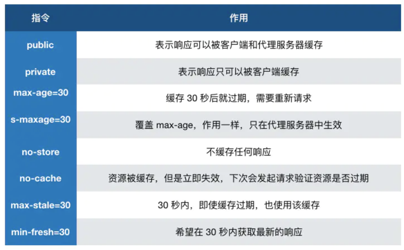

# 浏览器缓存

缓存可以说是性能优化中简单高效的一种优化方式了，它可以显著减少网络传输所带来的损耗。
对于一个数据请求来说，可以分为**发起网络请求**、**后端处理**、**浏览器响**应三个步骤。浏览器缓存可以帮助我们在第一和第三步骤中优化性能。比如说直接使用缓存而不发起请求，或者发起了请求但后端存储的数据和前端一致，那么就没有必要再将数据回传回来，这样就减少了响应数据。

## 缓存位置

从缓存位置上来说分为四种，并且各自有优先级，当依次查找缓存且都没有命中的时候，才会去请求网络

- Service Worker
- Memory Cache
- Disk Cache
- Push Cache

### Service Worker

Service Worker 借鉴了 Web Worker 的思路，即让 JS 运行在主线程之外，由于它脱离了浏览器的窗体，因此无法直接访问 DOM。虽然如此，但它仍然能帮助我们完成很多有用的功能，比如离线缓存、消息推送和网络代理等功能。其中的离线缓存就是 Service Worker Cache。Service Worker 同时也是 PWA 的重要实现机制。

### Memory Cache 和 Disk Cache

Memory Cache 指的是内存缓存，从效率上讲它是最快的。但是从存活时间来讲又是最短的，当渲染进程结束后，内存缓存也就不存在了。

Disk Cache 就是存储在磁盘中的缓存，从存取效率上讲是比内存缓存慢的，但是他的优势在于存储容量和存储时长。

好，现在问题来了，既然两者各有优劣，那浏览器如何决定将资源放进内存还是硬盘呢？主要策略如下：

比较大的 JS、CSS 文件会直接被丢进磁盘，反之丢进内存，内存使用率比较高的时候，文件优先进入磁盘

### Push Cache

即推送缓存，这是浏览器缓存的最后一道防线。它是 HTTP / 2 中的内容，虽然现在应用的并不广泛，但随着 HTTP / 2 的推广，它的应用越来越广泛。

## 缓存策略

通常浏览器缓存策略分为两种：**强缓存**和**协商缓存**，并且缓存策略都是通过设置 HTTP Header 来实现的。

### 强缓存

强缓存可以通过设置两种 HTTP Header 实现：**Expires** 和 **Cache - Control** 。强缓存表示在缓存期间不需要请求，state code 为 200。

- Expires
  Expires: Wed, 20 Nov 2020 08: 41: 00 GMT

Expires 是 HTTP / 1 的产物，表示资源会在 Wed, 20 Nov 2020 08: 41: 00 GMT 后过期，需要再次请求。Expires 即过期时间，存在于服务端返回的响应头中，告诉浏览器在这个过期时间之前可以直接从缓存里面获取数据，无需再次请求。并且 Expires 受限于本地时间，如果修改了本地时间，可能会造成缓存失效。

- Cache - control
  Cache - control: max - age=30

Cache - Control 出现于 HTTP / 1.1，优先级高于 Expires 。该属性值表示资源会在 30 秒后过期，需要再次请求。
Cache - Control 可以在请求头或者响应头中设置，并且可以组合使用多种指令。

从图中我们可以看到，我们可以将多个指令配合起来一起使用，达到多个目的。比如说我们希望资源能被缓存下来，并且是客户端和代理服务器都能缓存，还能设置缓存失效时间等等。

下面是一些常见指令：

### 协商缓存

如果缓存过期了，就需要发起请求验证资源是否有更新。协商缓存可以通过设置两种 HTTP Header 实现：**Last - Modified** 和 **ETag** 。

当浏览器发起请求验证资源时，如果资源没有做改变，那么服务端就会返回 **304 状态码**，并且更新浏览器缓存有效期。

- Last - Modified 和 If - Modified - Since
  Last - Modified 表示本地文件最后修改日期，在浏览器第一次给服务器发送请求后，服务器会在响应头中加上这个字段。浏览器接收到后，如果再次请求，会在请求头中携带 If - Modified - Since 字段，这个字段的值也就是服务器传来的最后修改时间。服务器拿到请求头中的 If - Modified - Since 的字段后，其实会和这个服务器中该资源的最后修改时间对比:
  1. 如果请求头中的这个值小于最后修改时间，说明是时候更新了。返回新的资源，跟常规的 HTTP 请求响应的流程一样。
  2. 否则返回 304，告诉浏览器直接用缓存。

但是 Last - Modified 存在一些弊端：

1. 如果本地打开缓存文件，即使没有对文件进行修改，但还是会造成 Last - Modified 被修改，服务端不能命中缓存导致发送相同的资源
2. 因为 Last - Modified 只能以秒计时，如果在不可感知的时间内修改完成文件，那么服务端会认为资源还是命中了，不会返回正确的资源。因为以上这些弊端，所以在 HTTP / 1.1 出现了 ETag 。

- ETag 和 If - None - Match
  ETag 类似于文件指纹，If - None - Match 会将当前 ETag 发送给服务器，询问该资源 ETag 是否变动，有变动的话就将新的资源发送回来。并且 ETag 优先级比 Last - Modified 高。

如果什么缓存策略都没设置，那么浏览器会怎么处理？
对于这种情况，浏览器会采用一个启发式的算法，通常会取响应头中的 Date 减去 Last - Modified 值的 10 % 作为缓存时间。

## 实际场景应用缓存策略

### 频繁变动的资源

对于频繁变动的资源，首先需要使用 Cache - Control: no - cache 使浏览器每次都请求服务器，然后配合 ETag 或者 Last - Modified 来验证资源是否有效。这样的做法虽然不能节省请求数量，但是能显著减少响应数据大小。

### 代码文件

这里特指除了 HTML 外的代码文件，因为 HTML 文件一般不缓存或者缓存时间很短。
一般来说，现在都会使用工具来打包代码，那么我们就可以对文件名进行哈希处理，只有当代码修改后才会生成新的文件名。基于此，我们就可以给代码文件设置缓存有效期一年 Cache - Control: max - age=31536000，这样只有当 HTML 文件中引入的文件名发生了改变才会去下载最新的代码文件，否则就一直使用缓存。

## 总结

浏览器的缓存机制总结如下:

- 首先通过 Cache - Control 验证强缓存是否可用
- 如果强缓存可用，直接使用
- 否则进入协商缓存，即发送 HTTP 请求，服务器通过请求头中的 If - Modified - Since 或者 If - None - Match 字段检查资源是否更新
  1. 若资源更新，返回资源和 200 状态码
  2. 否则，返回 304，告诉浏览器直接从缓存获取资源
