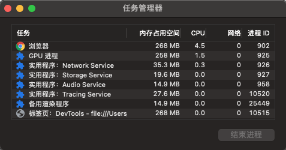

# Inside look at modern web browser

## 浏览器多进程架构

**进程（process）**：是操作系统（OS）进行资源（CPU、内存、磁盘、IO、带宽等）分配的最小单位。一个进程就是一个程序的运行实例。启动一个程序的时候，操作系统会为该程序创建一块内存，用来存放代码、运行中的数据和一个执行任务的主线程，我们把这样的一个运行环境叫进程。

**线程（thread）**: 是CPU调度和分配的基本单位。操作系统会根据进程的优先级和线程的优先级去调度CPU。进程将资源分配给线程，一个进程内线程之间共享进程的资源。

- 进程中的任意一线程执行出错，都会导致整个进程的崩溃
- 线程之间可以共享进程中的数据
- 当一个进程关闭之后，操作系统会回收这个进程所占用的内存
- 进程之间的内容是相互隔离的

浏览器**多进程架构**是一种设计模式，<u>它将浏览器的不同功能模块分配到独立的进程中</u>，以提高性能、稳定性和安全性。这种架构通常被称为多进程架构（Multiprocess Architecture）。浏览器进程主要负责界面显示、用户交互、子进程管理，同时提供存储等功能。拥有多进程架构的浏览器的一个主要优势是隔离性。如果一个标签页崩溃，通常只会影响到与之相关的渲染进程，而不会影响其他标签页或浏览器的运行。这提高了浏览器的稳定性和安全性。此外，多进程架构还有助于利用多核处理器，提高浏览器的整体性能。

Chrome 等浏览器会运行多个rendering engine实例：每个标签页对应一个实例，每个标签页都在单独的进程中运行。当我们访问一个站点时，渲染进程会负责运行站点的代码，渲染站点的页面，同时响应用户的交互动作，当我们在 Chrome 中打开三个页签同时访问三个站点时，如果其中一个没有响应，我们可以关闭它然后使用其他的页签，这是因为 Chrome 为每个站点创建一个独立的渲染进程，专门处理当前站点的渲染工作。如果所有的页面运行在同一个进程中，当有一个页面没有响应时，所有的页面就都卡住了。

- **浏览器主进程（Main Process）**。浏览器进程负责管理 Chrome 应用本身，包括地址栏、书签、前进和后退按钮。同时也负责不可见的功能，比如网络请求、文件访问等，也负责其他进程的调度。
- **渲染进程（Renderer Process）**。核心任务是将 `HTML`、`CSS` 和 `JavaScript` 转换为用户可以与之交互的网页，排版引擎Blink和JavaScript引擎V8都是运行在该进程中，默认情况下，Chrome会为每个Tab标签创建一个渲染进程。出于安全考虑，渲染进程都是运行在沙箱模式下。
- **GPU进程（GPU Process）**。其实，Chrome刚开始发布的时候是没有GPU进程的。而GPU的使用初衷是为了实现3D CSS的效果，只是随后网页、Chrome的UI界面都选择采用GPU来绘制，这使得GPU成为浏览器普遍的需求。最后，Chrome在其多进程架构上也引入了GPU进程。
- **Plugin进程（Plugin Process）**。主要是负责插件的运行，因插件易崩溃，所以需要通过插件进程来隔离，以保证插件进程崩溃不会对浏览器和页面造成影响。
- **网络进程（Network Process）**。主要负责页面的网络资源加载，之前是作为一个模块运行在浏览器进程里面的，直至最近才独立出来，成为一个单独的进程。

## 浏览器渲染进程包含的线程

浏览器的渲染进程的核心任务是将`HTML`, `CSS`, 和 `JavaScript`处理成一个用户可以交互的web页面。

- 主线程（`Main Thread`）：主线程负责处理用户输入、事件分发、`JavaScript` 解析和执行等任务。它负责管理渲染进程的整体调度和控制。
- 渲染线程（`Renderer Thread`）：渲染线程负责页面的渲染和绘制。它将 `HTML`、`CSS` 和 `JavaScript` 转换为可视化的页面。渲染线程负责构建 `DOM` 树、计算渲染树、执行 `JavaScript` 代码以及绘制页面元素。在多核 `CPU` 中，`Chrome` 可以为每个渲染线程创建一个独立的线程，以提高页面渲染的并发性能。
- 网络线程（`Network Thread`）：网络线程用于处理网络请求和响应。它负责向服务器请求页面资源，并接收服务器返回的数据。当网络线程接收到页面资源后，它会将数据传输给渲染线程进行处理。
- 合成线程（`Compositor Thread`）：合成线程负责将页面的绘制结果合成为最终的页面图像，并将图像发送给 `GPU` 进行渲染。它使用硬件加速技术来加快页面的绘制速度，提高用户的视觉体验。
- 事件线程（`Event Thread`）：事件线程负责处理用户的交互事件，比如鼠标点击、键盘输入等。它监听用户的输入，并将事件分发给对应的渲染线程进行处理。

Chrome浏览器为标签⻚分配渲染进程的策略：

1. 如果两个标签⻚都位于同⼀个浏览上下⽂组，且属于同⼀站点，那么这两个标签⻚会被浏览器分配到同⼀个渲染进程中。
2. 如果这两个条件不能同时满⾜，那么这两个标签⻚会分别使⽤不同的渲染进程来渲染。

## 浏览器显示页面过程

1. 当渲染进程接收到导航的提交消息并开始接收`HTML`数据时，渲染进程的**主线程**开始解析文本字符串（`HTML`）并将其转换为文档对象模型（`DOM`）。
2. 仅有DOM还不足以描述全部页面，因为我们可以用`CSS`来为页面元素添加样式。渲染进程的**主线程**解析`CSS`并确定每个`DOM`节点的计算样式。这是关于每个元素根据`CSS`选择器应用了什么样式的信息。在浏览器的`DevTools`的`computed`中可以看到这些信息。
3. 现在渲染进程知道了文档的结构和每个节点的样式，但这还不足以渲染页面。布局是一个找到元素几何形状的过程。渲染进程的**主线程**会遍历`DOM`和计算样式并创建布局树，其中包含诸如`x y`坐标和元素边界、框大小之类的信息。
4. 拥有DOM、样式和布局仍然不足以渲染页面。在这一绘制步骤中，渲染进程的**主线程**遍历布局树以创建绘制命令。绘制命令是绘制过程的说明，例如“先背景，然后文本，然后矩形”。
5. 浏览器在构建完布局树之后，还会对特定的节点进行**分层**，构建一棵图层树。如果你想要页面中的某些部分另开一个图层，可以使用`CSS`中的`will-change`属性。
6. 现在浏览器知道了文档的结构、每个元素的样式、页面的几何形状和绘制顺序，它如何绘制页面呢？需要通过**合成线程**将这些信息转换为屏幕上的像素称为光栅化。
7. 合成是一种将页面的各个部分分成图层，分别进行光栅化，并在称为**合成线程**的单独线程中将它们组合成页面的技术。合成线程会将每个图层分割为⼤⼩固定的图块，然后优先绘制靠近视⼝的图块，这样就可以⼤⼤加速⻚⾯的显⽰速度。合成的好处是它不涉及主线程。合成线程不需要等待样式计算或`JavaScript`执行。这就是为什么仅合成动画被认为是平滑性能的最佳选择。如果需要重新计算布局或绘制，则必须涉及主线程。
8. 整个渲染流程中最重要的是，在每个步骤中，都需要使用前一操作的结果来创建新数据。例如，如果布局树中的某些内容发生变化，则需要重新生成受影响部分文档的绘制顺序。这就涉及到重绘和回流。

如果正在对元素进行动画处理，则浏览器必须在每一帧之间运行这些操作。我们大多数的显示屏每秒刷新60次（60 fps）；当您在每一帧移动屏幕上的东西时，动画将会平滑地显示给人眼。然而，如果动画在每帧之间丢失了，那么页面将会出现“卡顿”。即使渲染操作跟得上屏幕的刷新，这些计算也是在主线程上运行的，这意味着当您的应用程序运行`JavaScript`时可能会被阻塞。可以将`JavaScript`操作分成小块，并使用`requestAnimationFrame()`调度在每一帧运行。您也可以在`Web Workers`中运行您的`JavaScript`，以避免阻塞主线程。

## 参考资料

[Inside look at modern web browser](https://developer.chrome.com/blog/inside-browser-part1)

[Page Lifecycle API](https://developer.chrome.com/docs/web-platform/page-lifecycle-api)

[How to Minimize Main Thread Work to Improve Core Web Vitals (8 Ways)](https://www.cloudways.com/blog/minimize-main-thread-work/)

[Minimize main thread work](https://developer.chrome.com/docs/lighthouse/performance/mainthread-work-breakdown)
