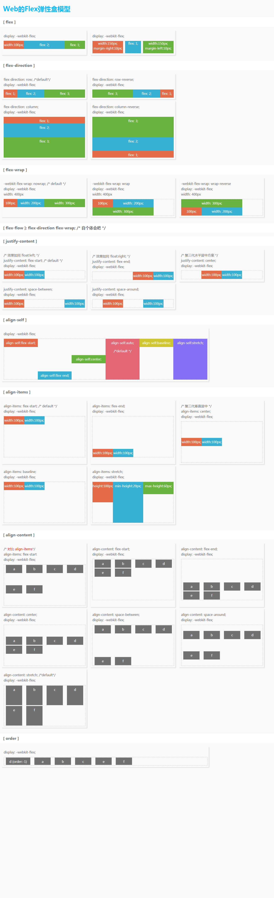
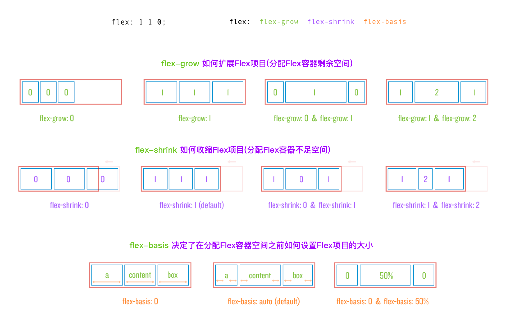

# Flex 布局

## Flex 所有属性

| 容器上的属性    | 项目上的属性 |
| --------------- | ------------ |
| display:flex    | flex-grow    |
| flex-direction  | flex-shrink  |
| flex-wrap       | flex-basis   |
| flex-flow       | order        |
| justify-content | align-self   |
| align-content   | flex         |
| align-items     |              |

- 容器上

flex-flow 是 flex-direction 和 flex-wrap 的缩写

- 项目上

flex 是 flex-grow, flex-shrink 和 flex-basis 的缩写

flex-basis 指定了 flex 元素在主轴方向上的初始大小。

## Flex 属性含义

## Flex 空间分布

[A Complete Guide to Flexbox](https://css-tricks.com/snippets/css/a-guide-to-flexbox/)
