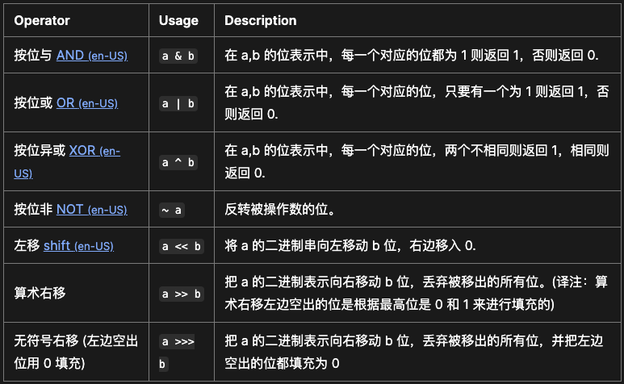

# 位运算

位运算符将它的操作数视为**32 位**的二进制串（0 和 1 组成）而非十进制八进制或十六进制数。例如：十进制数字 9 用二进制表示为 1001，位运算符就是在这个二进制表示上执行运算，但是返回结果是标准的 JavaScript 数值。

在JavaScript中，数字以**64位双精度浮点数**的形式存储，但是在进行位运算时，JavaScript会将这些数字转换为32位有符号整数进行操作。

需要注意的是，JavaScript位运算只适用于32位整数，所以会将操作数转换为32位带符号整数，执行位运算，然后将结果转回64位浮点数。这可能导致一些意外的行为，尤其是对于大于32位的整数或负数的情况。因此，在进行位运算时，需要谨慎考虑可能的溢出和符号问题。

例如，考虑表达式 `~1.1`。JavaScript 引擎不会对 `1.1` 的二进制表示直接应用按位取反运算符（在其他情况下是可以的），而是先将 `1.1` 转换为 `1`，然后将按位取反运算符应用于 `1` 这个 32 位整数，结果是 `-2`。

再举一个例子，考虑表达式 `~0xaa11223344`。`0xaa11223344` 超出了 `32` 位表示的最大值。在这种情况下，JavaScript 引擎会计算 `0xaa11223344` 取模 `2^32`，结果是 `0x11223344`，然后对它应用按位取反运算符。结果是 `-287454021`。事实上，我们可以验证 `~0x11223344`、`~0xa11223344`、`~0xaa11223344` 和 `~0xaaa11223344` 的结果都是相同的。

## 常见位运算

按位与（**&**）运算符在两个操作数对应的二进位都为 1 时，该位的结果值才为 1。

按位与赋值运算符（**&=**）使用两个操作数的二进制表示，对它们进行按位与运算并将结果赋值给变量。

按位或（**|**）运算符在其中一个或两个操作数对应的二进制位为 1 时，该位的结果值为 1。

按位或赋值(**|=**) 运算符使用两个操作数的二进制表示，对它们执行按位或运算并将结果分配给变量。

按位异或（**^**）运算符在两个操作数有且仅有一个对应的二进制位为 1 时，该位的结果值为 1。

按位异或赋值操作符 (**^=**) 使用二进制表示操作数，进行一次按位异或操作并赋值。

按位非运算符（**~**）将操作数的位反转。如同其他位运算符一样，它将操作数转化为 32 位的有符号整型。

---

左移操作符 (**<<**) 将第一个操作数向左移动指定位数，左边超出的位数将会被清除，右边将会补零。

左移赋值运算符（**<<=**）将变量向左移动指定的位数，并将结果赋值给变量。

右移运算符（**>>**）将一个操作数的二进制表示形式向右移动指定位数，该操作数可以是数值或者 BigInt 类型。右边移出位被丢弃，左边移出的空位补符号位（最左边那位）。该操作也称为“符号位传播右移”（sign-propagating right shift）或“算术右移”（arithmetic right shift），因为返回值的符号位与第一个操作数的符号位相同。

右移赋值运算符（**>>=**）将变量向右移动指定的位数，并将结果赋值给变量。

无符号右移运算符（**>>>**）（零填充右移）将左操作数计算为无符号数，并将该数字的二进制表示形式移位为右操作数指定的位数，取模 32。向右移动的多余位将被丢弃，零位从左移入。其符号位变为 0，因此结果始终为非负数。与其他按位运算符不同，零填充右移返回一个无符号 32 位整数。

无符号右移赋值（**>>>=**）运算符向右移动移动指定（二进制）位数，并将结果赋值给变量。

---



## tricks

- 取[a,b]中位数 `(a+b) >>> 1`，右移操作相当于除以2
- `n & (n−1)`每次都把最低位的1转化为0
- 一个数和 0 做 异或(^) 运算等于本身：`a^0 = a`
- 一个数和其本身做 异或(^) 运算等于 0：`a^a = 0`
- 异或(^) 运算满足交换律和结合律：`a^b^a = (a^a)^b = 0^b = b`

## 实践用例

```js
// 判断奇数偶数
const isEven = (num) => (num & 1) === 0;
const isOdd = (num) => (num & 1) === 1;

console.log(isEven(4)); // Outputs: true
console.log(isOdd(5)); // Outputs: true
```

```js
// 计算x2、/2
const multiplyByTwo = (num) => num << 1;
const divideByTwo = (num) => num >> 1;

console.log(multiplyByTwo(5)); // Outputs: 10
console.log(divideByTwo(10)); // Outputs: 5
```

```js
// 判断是否2的次方
const isPowerOfTwo = (num) => num > 0 && (num & (num - 1)) === 0;

console.log(isPowerOfTwo(16)); // Outputs: true
console.log(isPowerOfTwo(18)); // Outputs: false
```

## 参考资料

[位运算符](https://developer.mozilla.org/zh-CN/docs/Web/JavaScript/Guide/Expressions_and_operators#%E4%BD%8D%E8%BF%90%E7%AE%97%E7%AC%A6)

[Bitwise Operators in JavaScript and When to Use Them](https://8hob.io/posts/bitwise-operations-when-use-them/#what-are-bitwise-operators)

[Understanding Bitwise Shifts in JavaScript: << and >>](https://www.trevorlasn.com/blog/bitwise-shifts-in-javascript)
