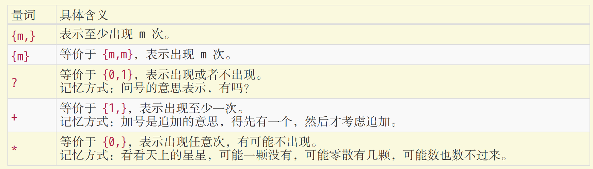
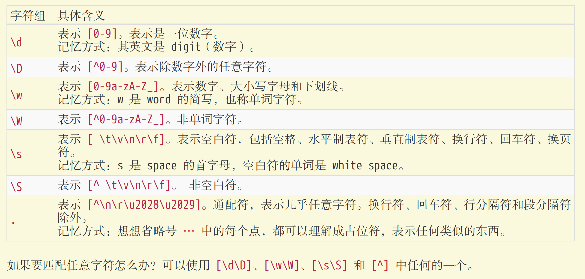
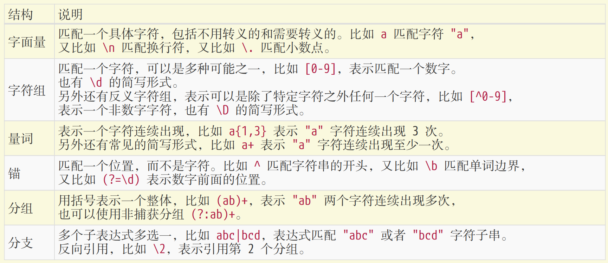

# Reg

## 横向模糊匹配

横向模糊指的是，一个正则可匹配的字符串的长度不是固定的，可以是多种情况的。使用量词。譬如 {m,n}，表示连续出现最少 m 次，最多 n 次。

使用量词。譬如 {m,n}，表示连续出现最少 m 次，最多 n 次。

## 纵向模糊匹配

纵向模糊指的是，一个正则匹配的字符串，具体到某一位字符时，它可以不是某个确定的字符，可以有多可能。

正则 **/a[123]b/** 可以匹配如下三种字符串： "a1b"、"a2b"、"a3b"。

某位字符可以是任何东西，但就不能是 "a"、"b"、"c"。此时就是排除字符组（反义字符组）的概念。例如正则 **[^abc]**，表示是一个除 "a"、"b"、"c"之外的任意一个字符。字符组的第一位放 ^（脱字符），表示求反的概念。

## 范围表示

[123456abcdefGHIJKLM]，可以写成 **[1-6a-fG-M]**。用连字符 - 来省略和简写。

因为连字符有特殊用途，那么要匹配 "a"、"-"、"z" 这三者中任意一个字符，该怎么做呢？不能写成 [a-z]，因为其表示小写字符中的任何一个字符。可以写成如下的方式：**[-az]** 或 **[az-]** 或 **[a\-z]**。

## 贪婪匹配与惰性匹配

通过在量词后面加个问号就能实现惰性匹配。

正则 **/\d{2,5}/**，表示数字连续出现 2 到 5 次。会匹配 2 位、3 位、4 位、5 位连续数字。

正则 **/\d{2,5}?/** 表示，虽然 2 到 5 次都行，当 2 个就够的时候，就不再往下尝试了。

## 多选分支

正则 **(p1|p2|p3)**，其中 p1、p2 和 p3 是子模式，用 |（管道符）分隔，表示其中任何之一。

分支结构也是惰性的，即当前面的匹配上了，后面的就不再尝试了。

## 位置匹配

位置关键词：^、$、\b、\B、(?=p)、(?!p)

- ^（脱字符）匹配开头，在多行匹配中匹配行开头。
- $（美元符号）匹配结尾，在多行匹配中匹配行结尾。
- \b 是单词边界，具体就是 \w 与 \W 之间的位置，也包括 \w 与 ^ 之间的位置，和 \w 与 $ 之间的位置。
- \B 就是 \b 的反面的意思，非单词边界。
- (?=p)，其中 p 是一个子模式，即 p 前面的位置，或者说，该位置后面的字符要匹配 p。
- (?!p) 就是 (?=p) 的反面意思。

## 修饰符

- g 全局匹配，即找到所有匹配的，单词是 global。
- i 忽略字母大小写，单词是 ingoreCase。
- m 多行匹配，只影响 ^ 和 $，二者变成行的概念，即行开头和行结尾。单词是 multiline。

## 操作方法

用于正则操作的方法，共有 6 个，字符串实例 4 个，正则实例 2 个：

- String#search
- String#split
- String#match
- String#replace
- RegExp#test
- RegExp#exec

[JavaScript 正则表达式迷你书]
