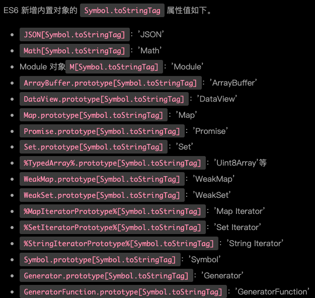

# Symbol

ES6 引入了一种新的原始数据类型`Symbol`，表示独一无二的值。它是 JavaScript 的第七种数据类型，前六种是：`undefined`、`null`、`Boolean`、`String`、`Number`、`Object`。

`Symbol` 值通过 `Symbol()` 函数生成。这就是说，对象的属性名现在可以有两种类型，一种是原来就有的字符串，另一种就是新增的 `Symbol` 类型。凡是属性名属于 `Symbol` 类型，就都是独一无二的，可以保证不会与其他属性名产生冲突。基本上，它是一种类似于字符串的数据类型。

`Symbol`函数可以接受一个字符串作为参数，表示对 `Symbol` 实例的描述，主要是为了在控制台显示，或者转为字符串时，比较容易区分。`Symbol`函数的参数只是表示对当前 `Symbol` 值的描述，因此相同参数的`Symbol`函数的返回值是不相等的。

`Symbol`函数前不能使用new命令，否则会报错。这是因为生成的 `Symbol` 是一个原始类型的值，不是对象。也就是说，由于 `Symbol` 值不是对象，所以不能添加属性。基本上，它是一种类似于字符串的数据类型。

```js
let s = Symbol();
typeof s
// "symbol"
```

## Symbol 静态的属性、方法

### Symbol.for()

- The Symbol.for() static method searches for existing symbols in a runtime-wide symbol registry with the given key and returns it if found. Otherwise a new symbol gets created in the global symbol registry with this key.

`Symbol.for(key)` 方法会根据给定的键 key，来从运行时的 `symbol` 注册表中找到对应的 `symbol`，如果找到了，则返回它，否则，新建一个与该键关联的 `symbol`，并放入全局 `symbol` 注册表中。

```js
Symbol.for("foo"); // 创建一个 symbol 并放入 symbol 注册表中，键为 "foo"
Symbol.for("foo"); // 从 symbol 注册表中读取键为"foo"的 symbol


Symbol.for("bar") === Symbol.for("bar"); // true，证明了上面说的
Symbol("bar") === Symbol("bar"); // false，Symbol() 函数每次都会返回新的一个 symbol


var sym = Symbol.for("mario");
sym.toString();
// "Symbol(mario)"，mario 既是该 symbol 在 symbol 注册表中的键名，又是该 symbol 自身的描述字符串

console.log(Symbol.for('bar') === Symbol.for('bar'));
// Expected output: true

console.log(Symbol('bar') === Symbol('bar'));
// Expected output: false

const symbol1 = Symbol.for('foo');

console.log(symbol1.toString());
// Expected output: "Symbol(foo)"
```

### Symbol.keyFor()

- The Symbol.keyFor() static method retrieves a shared symbol key from the global symbol registry for the given symbol.

`Symbol.keyFor()` 方法返回一个已登记的 `Symbol` 类型值的key。

```js
const globalSym = Symbol.for('foo'); // Global symbol

console.log(Symbol.keyFor(globalSym));
// Expected output: "foo"

const localSym = Symbol(); // Local symbol

console.log(Symbol.keyFor(localSym));
// Expected output: undefined

console.log(Symbol.keyFor(Symbol.iterator));
// Expected output: undefined
```

## ES6内置的 Symbol

除了定义自己使用的 Symbol 值以外，ES6 还提供了多个内置的 Symbol 值，指向语言内部使用的方法。

- Symbol.hasInstance

对象的`Symbol.hasInstance`属性，指向一个内部方法。当其他对象使用`instanceof`运算符，判断是否为该对象的实例时，会调用这个方法。比如，`foo instanceof Foo`在语言内部，实际调用的是`Foo[Symbol.hasInstance](foo)`。

- Symbol.isConcatSpreadable

对象的`Symbol.isConcatSpreadable`属性等于一个布尔值，表示该对象用于`Array.prototype.concat()`时，是否可以展开。

- Symbol.iterator

对象的`Symbol.iterator`属性，指向该对象的默认遍历器方法。

- Symbol.match

对象的`Symbol.match`属性，指向一个函数。当执行`str.match(myObject)`时，如果该属性存在，会调用它，返回该方法的返回值。

- Symbol.matchAll

对象的`Symbol.matchAll`属性，指向一个方法，当该对象被`String.prototype.matchAll`方法调用时，会返回该方法的返回值。

- Symbol.replace

对象的`Symbol.replace`属性，指向一个方法，当该对象被`String.prototype.replace`方法调用时，会返回该方法的返回值。

- Symbol.search

对象的`Symbol.search`属性，指向一个方法，当该对象被`String.prototype.search`方法调用时，会返回该方法的返回值。

- Symbol.species

对象的`Symbol.species`属性，指向一个构造函数。创建衍生对象时，会使用该属性。

- Symbol.split

对象的`Symbol.split`属性，指向一个方法，当该对象被`String.prototype.split`方法调用时，会返回该方法的返回值。

- Symbol.toPrimitive

对象的`Symbol.toPrimitive`属性，指向一个方法。该对象被转为原始类型的值时，会调用这个方法，返回该对象对应的原始类型值。

`Symbol.toPrimitive`被调用时，会接受一个字符串参数，表示当前运算的模式，一共有三种模式。

  - Number：该场合需要转成数值
  - String：该场合需要转成字符串
  - Default：该场合可以转成数值，也可以转成字符串

- Symbol.toStringTag

对象的`Symbol.toStringTag`属性，指向一个方法。在该对象上面调用`Object.prototype.toString`方法时，如果这个属性存在，它的返回值会出现在`toString`方法返回的字符串之中，表示对象的类型。也就是说，这个属性可以用来定制`[object Object]`或`[object Array]`中object后面的那个字符串。



- Symbol.unscopables

对象的`Symbol.unscopables`属性，指向一个对象。该对象指定了使用`with`关键字时，哪些属性会被`with`环境排除。

## 属性名遍历

`Symbol` 作为属性名，遍历对象的时候，该属性不会出现在`for...in`、`for...of`循环中，也不会被`Object.keys()`、`Object.getOwnPropertyNames()`、`JSON.stringify()`返回。

但是，它也不是私有属性，有一个`Object.getOwnPropertySymbols()`方法，可以获取指定对象的所有 `Symbol` 属性名。该方法返回一个数组，成员是当前对象的所有用作属性名的 `Symbol` 值。

由于以 `Symbol` 值作为键名，不会被常规方法遍历得到。我们可以利用这个特性，为对象定义一些非私有的、但又希望只用于内部的方法。

## symbol的使用场景

由于每一个 `Symbol` 值都是不相等的，这意味着 `Symbol` 值可以作为标识符，用于对象的属性名，就能保证不会出现同名的属性。这对于一个对象由多个模块构成的情况非常有用，能防止某一个键被不小心改写或覆盖。`Symbol` 类型还可以用于定义一组常量，保证这组常量的值都是不相等的。

### 应用一：防止XSS

在React的ReactElement对象中，有一个typeof属性，它是一个Symbol类型的变量：

```js
var REACT_ELEMENT_TYPE =
  (typeof Symbol === 'function' && Symbol.for && Symbol.for('react.element')) ||
  0xeac7;
```

ReactElement.isValidElement函数用来判断一个React组件是否是有效的，下面是它的具体实现。

```js
ReactElement.isValidElement = function (object) {
  return typeof object === 'object' && object !== null && object.?typeof === REACT_ELEMENT_TYPE;
};
```

可见React渲染时会把没有typeof标识，以及规则校验不通过的组件过滤掉。
如果你的服务器有一个漏洞，允许用户存储任意JSON对象， 而客户端代码需要一个字符串，这可能会成为一个问题：

```js
// JSON
let expectedTextButGotJSON = {
  type: 'div',
  props: {
    dangerouslySetInnerHTML: {
      __html: '/* put your exploit here */'
    },
  },
};
let message = { text: expectedTextButGotJSON };
<p>
  {message.text}
</p>
```

而JSON中不能存储Symbol类型的变量，这就是防止XSS的一种手段。

### 应用二：私有属性

借助`Symbol`类型的不可枚举，我们可以在类中模拟私有属性，控制变量读写：

```js
const privateField = Symbol();
class myClass {
  constructor(){
    this[privateField] = 'ConardLi';
  }
  getField(){
    return this[privateField];
  }
  setField(val){
    this[privateField] = val;
  }
}
```

### 应用三：防止属性污染

在某些情况下，我们可能要为对象添加一个属性，此时就有可能造成属性覆盖，用`Symbol`作为对象属性可以保证永远不会出现同名属性。

```js
  Function.prototype.myCall = function (context) {
    if (typeof this !== 'function') {
      return undefined; // 用于防止 Function.prototype.myCall() 直接调用
    }
    context = context || window;
    const fn = Symbol();
    context[fn] = this;
    const args = [...arguments].slice(1);
    const result = context[fn](...args);
    delete context[fn];
    return result;
  }
```

我们需要在某个对象上临时调用一个方法，又不能造成属性污染，`Symbol`是一个很好的选择。

## 参考资料

[Symbol-MDN](https://developer.mozilla.org/en-US/docs/Web/JavaScript/Reference/Global_Objects/Symbol)

[内置的 Symbol 值](https://www.bookstack.cn/read/es6-3rd/spilt.8.docs-symbol.md)
