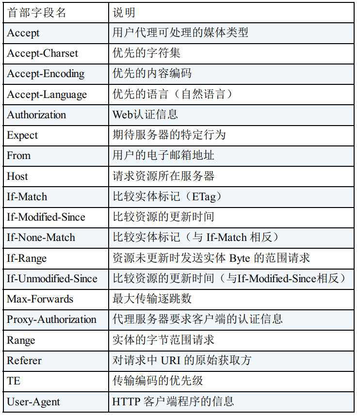
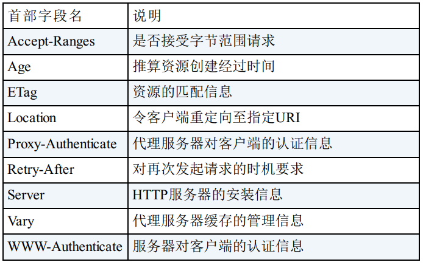

## HTTP 报文

## HTTP 报文基础

用于 HTTP 协议交互的信息被称为 HTTP 报文。 请求端（ 客户端） 的 HTTP 报文叫做**请求报文**， 响应端（ 服务器端） 的叫做**响应报文** HTTP。报文本身是由多行（ 用 CR+LF 作换行符） 数据构成的字符串文本。HTTP 报文大致可分为**报文首部**和**报文主体**两块。

HTTP 协议中也采纳了多部分对象集合（Multipart）， 发送的一份报文主体内可含有多类型实体。 通常是在图片或文本文件等上传时使用。

- multipart/form-data
- multipart/byteranges
- multipart/form-data
- multipart/byteranges

在 HTTP 报文中使用多部分对象集合（Multipart）时， 需要在首部字段里加上 Content-type。

从之前下载中断处恢复下载，实现该功能需要指定下载的实体范围。 像这样， 指定范围发送的请求叫做范围请求（ Range Request） 。
针对范围请求， 响应会返回状态码为 206 Partial Content 的响应报文。

内容协商机制是指客户端和服务器端就响应的资源内容进行交涉， 然后提供给客户端最为适合的资源。 内容协商会以响应资源的语言、 字符集、 编码方式等作为判断的基准。

- Accept
- Accept-Charset
- Accept-Encoding
- Accept-Language
- Content-Language

## HTTP 报文首部

- 请求行(请求报文)

包含用于请求的方法， 请求 URI 和 HTTP 版本。

- 状态行(响应报文)

包含表明响应结果的状态码， 原因短语和 HTTP 版本。

- 首部字段

包含表示请求和响应的各种条件和属性的各类首部。
一般有 4 种首部， 分别是： 通用首部、 请求首部、 响应首部和实体首部。

- 其他

可能包含 HTTP 的 RFC 里未定义的首部（ Cookie 等）

## HTTP 请求的首部字段

**首部字段**是为了给浏览器和服务器提供报文主体大小、 所使用的语言、 认证信息等内容。

<u>通用首部字段:</u>

通用首部字段是指， 请求报文和响应报文双方都会使用的首部。

<u>请求首部字段:</u>

请求首部字段是从客户端往服务器端发送请求报文中所使用的字段，用于补充请求的附加信息、 客户端信息、 对响应内容相关的优先级等内容。

<u>实体首部字段:</u>

实体首部字段是包含在请求报文和响应报文中的实体部分所使用的首部， 用于补充内容的更新时间等与实体相关的信息。

## HTTP 请求报文

在请求中， HTTP 报文由方法、 URI、 HTTP 版本、 HTTP 首部字段、实体等部分构成。

## HTTP 响应报文

在响应中， HTTP 报文由 HTTP 版本、 状态码（ 数字和原因短语） 、HTTP 首部字段、实体等部分构成。

