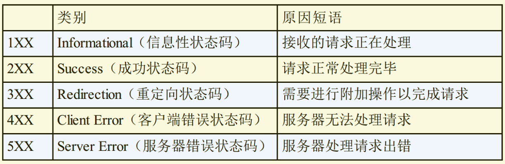

# HTTP 状态码

## HTTP 状态码基础

HTTP 状态码负责表示客户端 HTTP 请求的返回结果、 标记服务器端的处理是否正常、 通知出现的错误等工作。

### 2XX 状态码

表明请求被正常处理了。

- **200 OK** 从客户端发来的请求在服务器端被正常处理了。
- **204 No Content** 代表服务器接收的请求已成功处理， 但在返回的响应报文中不含实体的主体部分。 另外， 也不允许返回任何实体的主体。
- **206 Partial Content** 客户端进行了范围请求， 而服务器成功执行了这部分的 GET 请求。 使用场景为 HTTP 分块下载和断点续传，响应报文会带上相应的响应头字段 Content-Range。

### 3XX 状态码

浏览器需要执行某些特殊的处理以正确处理请求。

- **301 Moved Permanently** 永久性重定向。 该状态码表示请求的资源已被分配了新的 URI， 以后应使用资源现在所指的 URI。比如你的网站从 HTTP 升级到了 HTTPS 了，以前的站点再也不用了，应当返回 301，这个时候浏览器默认会做缓存优化，在第二次访问的时候自动访问重定向的那个地址。
- **302 Found** 临时性重定向。 该状态码表示请求的资源已被分配了新的 URI， 希望用户（ 本次） 能使用新的 URI 访问。而如果只是暂时不可用，那么直接返回 302 即可，和 301 不同的是，浏览器并不会做缓存优化。
- **303 See Other** 由于请求对应的资源存在着另一个 URI， 应使用 GET 方法定向获取请求的资源。
- **304 Not Modified** 该状态码表示客户端发送附带条件的请求时， 服务器端允许请求访问资源， 但未满足条件的情况。 304 状态码返回时， 不包含任何响应的主体部分。当浏览器发起请求验证资源时，如果资源没有做改变，那么服务端就会返回 **304 状态码**，并且更新浏览器缓存有效期。
- **307 Temporary Redirect** 临时重定向。 该状态码与 302 Found 有着相同的含义。 尽管 302 标准禁止 POST 变换成 GET， 但实际使用时大家并不遵守。307 会遵照浏览器标准， 不会从 POST 变成 GET。 但是， 对于处理响应时的行为， 每种浏览器有可能出现不同的情况。

当 301、 302、 303 响应状态码返回时， 几乎所有的浏览器都会把 POST 改成 GET， 并删除请求报文内的主体， 之后请求会自动再次发送。
附带条件的请求是指当协商缓存命中时会返回这个状态码，采用 GET 方法的请求报文中包含 If-Match， If-ModifiedSince， If-None-Match， If-Range， If-Unmodified-Since 中任一首部。

### 4XX 状态码

4XX 的响应结果表明客户端是发生错误的原因所在。

- **400 Bad Request** 该状态码表示请求报文中存在语法错误。 当错误发生时， 需修改请求的内容后再次发送请求。 另外， 浏览器会像 200 OK 一样对待该状态码。
- **401 Unauthorized** 发送的请求需要有通过 HTTP 认证（ BASIC 认证、DIGEST 认证） 的认证信息。 另外若之前已进行过 1 次请求， 则表示用户认证失败。
- **403 Forbidden** 该状态码表明对请求资源的访问被服务器拒绝了。
- **404 Not Found** 该状态码表明服务器上无法找到请求的资源。 除此之外， 也可以在服务器端拒绝请求且不想说明理由时使用。
- **408 Not Found** 该状态码表明服务器上无法找到请求的资源。

### 5XX 状态码

5XX 的响应结果表明服务器本身发生错误。

- **500 Internal Server Error** 该状态码表明服务器端在执行请求时发生了错误。 也有可能是 Web 应用存在的 bug 或某些临时的故障。
- **503 Service Unavailable** 表明服务器暂时处于超负载或正在进行停机维护， 现在无法处理请求。

[HTTP 响应代码](https://developer.mozilla.org/zh-CN/docs/Web/HTTP/Status)
