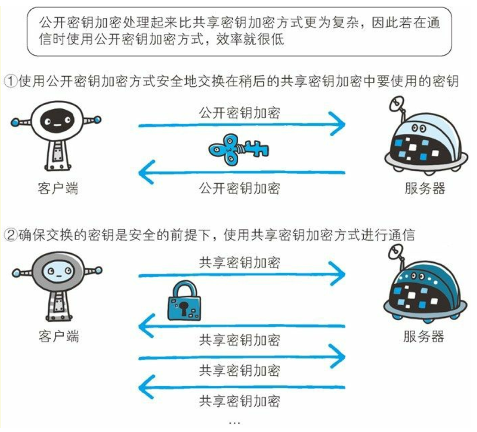

# HTTPS

## HTTPS 简介

在 HTTP 协议中有可能存在信息窃听或身份伪装等安全问题。 使用 HTTPS 通信机制可以有效地防止这些问题。
HTTP 主要有这些不足， 例举如下：

- 通信使用明文， 内容可能会被窃听
- 不验证通信方的身份， 因此有可能遭遇伪装
- 无法证明报文的完整性， 所以有可能已遭篡改

---

问题：

由于 HTTP 本身不具备加密的功能， 所以也无法做到对通信整体（ 使用 HTTP 协议通信的请求和响应的内容） 进行加密。 即， HTTP 报文使用明文（ 指未经过加密的报文） 方式发送。

对策：

一种方式就是将**通信加密**。 HTTP 协议中没有加密机制， 但可以通过和 **SSL**（ Secure Socket Layer， 安全套接层）或 **TLS**（ Transport Layer Security， 安全层传输协议）的组合使用，加密 HTTP 的通信内容。用 SSL 建立安全通信线路之后， 就可以在这条线路上进行 HTTP 通信了。 与 SSL 组合使用的 HTTP 被称为 HTTPS（ HTTPSecure， 超文本传输安全协议） 或 HTTP over SSL。

还有一种将参与通信的**内容本身加密**的方式。 由于 HTTP 协议中没有加密机制， 那么就对 HTTP 协议传输的内容本身加密。 即把 HTTP 报文里所含的内容进行加密处理。在这种情况下， 客户端需要对 HTTP 报文进行加密处理后再发送请求。

---

问题：

HTTP 协议中的请求和响应不会对通信方进行确认。 也就是说存在“服务器是否就是发送请求中 URI 真正指定的主机， 返回的响应是否真的返回到实际提出请求的客户端”等类似问题。

对策：

SSL 不仅提供加密处理， 而且还使用了一种被称为**证书**的手段，可用于确定方。

---

问题：

无法证明报文完整性， 可能已遭篡改所谓完整性是指信息的准确度。 若无法证明其完整性， 通常也就意味着无法判断信息是否准确。

对策：

MD5 和 SHA-1 等散列值校验的方法，以及用来确认文件的**数字签名**方法。

---

总结

为了有效防止这些弊端， 有必要使用 HTTPS。 SSL 提供认证和加密处理及摘要功能。

- HTTP 加上加密处理和认证以及完整性保护后即是 HTTPS。HTTPS = HTTP + SSL/TLS。
- HTTPS 并非是应用层的一种新协议。 只是 HTTP 通信接口部分用 SSL（ Secure Socket Layer） 和 TLS（ Transport Layer Security） 协议代替而已。
- HTTP 直接和 TCP 通信。 当使用 SSL 时， 则演变成先和 SSL 通信， 再由 SSL 和 TCP 通信了。 简言之，所谓 HTTPS， 其实就是身披 SSL 协议这层外壳的 HTTP。
- SSL 采用一种叫做公开密钥加密（ Public-key cryptography） 的加密处理方式。
- 加密和解密同用一个密钥的方式称为对称密钥加密（ Common keycrypto system）
- 非对称秘钥加密使用一对非对称的密钥。 一把叫做私有密钥（ private key） ， 另一把叫做公开密钥（ public key） 。使用非对称秘钥加密方式， 发送密文的一方使用对方的公开密钥进行加密处理， 对方收到被加密的信息后， 再使用自己的私有密钥进行解密。
- HTTPS 采用**对称密钥加密**和**非对称秘钥加密**两者并用的混合加密机制。在**交换密钥环节**使用非对称加密方式，之后的建立通信**交换报文环节**则使用对称加密方式。
- 非对称秘钥加密与对称密钥加密相比， 其处理速度要慢。

## HTTPS 通信过程

步骤 1： 客户端通过发送 Client Hello 报文开始 SSL 通信。 报文中包含客户端支持的 SSL 的指定版本、 加密组件（ Cipher Suite） 列表（ 所使用的加密算法及密钥长度等） 。

步骤 2： 服务器可进行 SSL 通信时， 会以 Server Hello 报文作为应答。 和客户端一样， 在报文中包含 SSL 版本以及加密组件。 服务器的加密组件内容是从接收到的客户端加密组件内筛选出来的。

步骤 3： 之后服务器发送 Certificate 报文。 报文中包含公开密钥证书。

步骤 4： 最后服务器发送 Server Hello Done 报文通知客户端， 最初阶段的 SSL 握手协商部分结束。

步骤 5： SSL 第一次握手结束之后， 客户端以 Client Key Exchange 报文作为回应。 报文中包含通信加密中使用的一种被称为 Pre-mastersecret 的随机密码串。 该报文已用步骤 3 中的公开密钥进行加密。

步骤 6： 接着客户端继续发送 Change Cipher Spec 报文。 该报文会提示服务器， 在此报文之后的通信会采用 Pre-master secret 密钥加密。

步骤 7： 客户端发送 Finished 报文。 该报文包含连接至今全部报文的整体校验值。 这次握手协商是否能够成功， 要以服务器是否能够正确解密该报文作为判定标准。

步骤 8： 服务器同样发送 Change Cipher Spec 报文。

步骤 9： 服务器同样发送 Finished 报文。

步骤 10： 服务器和客户端的 Finished 报文交换完毕之后， SSL 连接就算建立完成。 当然， 通信会受到 SSL 的保护。 从此处开始进行应用层协议的通信， 即发送 HTTP 请求。

步骤 11： 应用层协议通信， 即发送 HTTP 响应。

步骤 12： 最后由客户端断开连接。 断开连接时， 发送 close_notify 报文。 上图做了一些省略， 这步之后再发送 TCP FIN 报文来关闭与 TCP 的通信。
