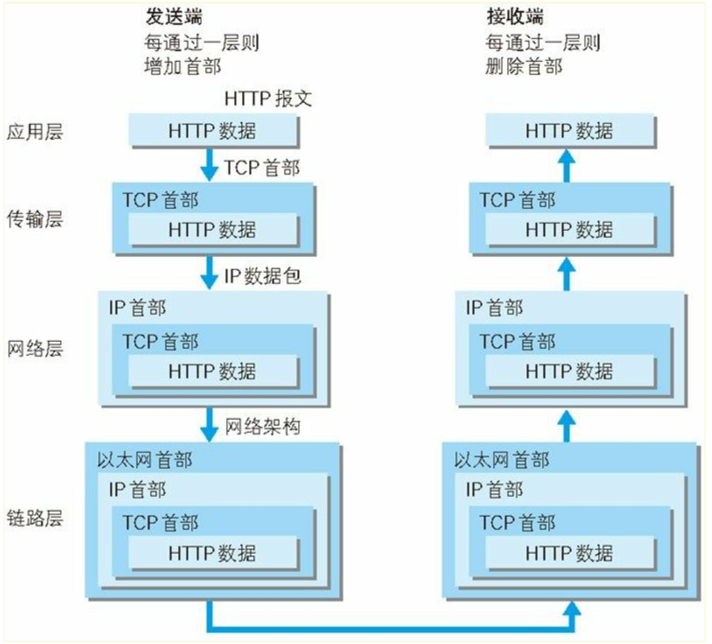
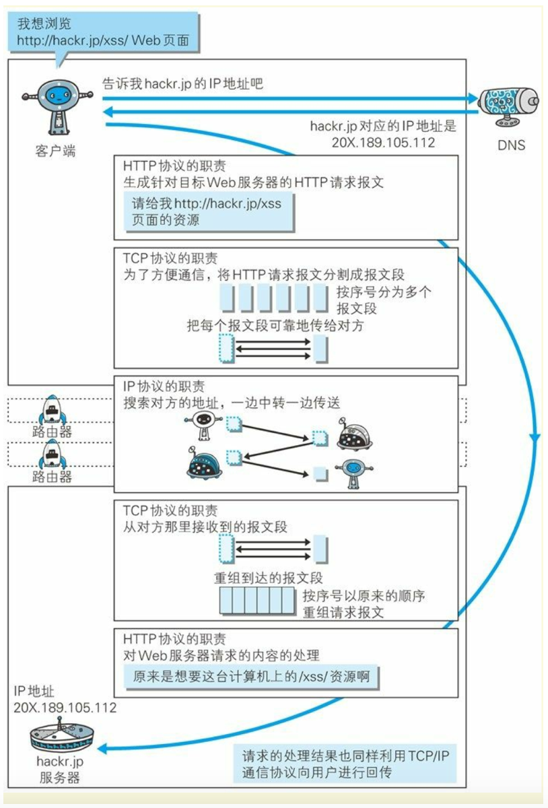

# Web 基础

Web 使用一种名为 **HTTP**（ HyperText Transfer Protocol， 超文本传输协议 ）的协议作为规范， 完成从客户端到服务器端等一系列运作流程。 而协议是指规则的约定。 可以说， Web 是建立在 HTTP 协议上通信的。

通常使用的网络（ 包括互联网） 是在 **TCP/IP 协议族**的基础上运作的。 而 HTTP 属于它内部的一个子集。

TCP/IP 协议族按层次分别分为以下 4 层： **应用层**、 **传输层**、 **网络层**和**数据链路层**。

- 应用层（DNS、FTP）

应用层决定了向用户提供应用服务时通信的活动。

TCP/IP 协议族内预存了各类通用的应用服务。 比如， FTP（ FileTransfer Protocol， 文件传输协议） 和 DNS（ Domain Name System， 域名系统） 服务就是其中两类。

HTTP 协议也处于该层。

- 传输层（TCP、UDP）

传输层对上层应用层， 提供处于网络连接中的两台计算机之间的数据传输。在传输层有两个性质不同的协议： TCP（ Transmission ControlProtocol， 传输控制协议） 和 UDP（ User Data Protocol， 用户数据报协议） 。

TCP 是一个**面向连接的**、**可靠的**、**基于字节流**的传输层协议。

UDP 是一个**面向无连接的**传输层协议。

- 网络层（IP）

网络层用来处理在网络上流动的数据包。 数据包是网络传输的最小数据单位。 该层规定了通过怎样的路径（ 所谓的传输路线） 到达对方计算机， 并把数据包传送给对方。与对方计算机之间通过多台计算机或网络设备进行传输时， 网络层所起的作用就是在众多的选项内选择一条传输路线。

- 数据链路层

用来处理连接网络的硬件部分。 包括控制操作系统、 硬件的设备驱动、 NIC（ Network Interface Card， 网络适配器， 即网卡） ， 及光纤等物理可见部分（ 还包括连接器等一切传输媒介） 。 硬件上的范畴均在链路层的作用范围之内。

DNS（ Domain Name System） 服务是和 HTTP 协议一样位于**应用层**的协议。 它提供域名到 IP 地址之间的解析服务。

TCP 位于**传输层**， 提供可靠的字节流服务。 TCP 协议采用了三次握手（ three-way handshaking） 策略。发送端首先发送一个带 SYN 标志的数据包给对方。 接收端收到后，回传一个带有 SYN/ACK 标志的数据包以示传达确认信息。 最后， 发送端再回传一个带 ACK 标志的数据包， 代表“握手”结束。

IP（ Internet Protocol） 网际协议位于**网络层**。IP 协议的作用是把各种数据包传送给对方。 而要保证确实传送到对方那里， 则需要满足各类条件。 其中两个重要的条件是 **IP 地址**和 **MAC 地址**（ Media Access Control Address） 。在进行中转时， 会利用下一站中转设备的 MAC 地址来搜索下一个中转目标。 这时， 会采用 ARP 协议（ AddressResolution Protocol） 。 ARP 是一种用以解析地址的协议， 根据通信方的 IP 地址就可以反查出对应的 MAC 地址。

URI 就是由某个协议方案表示的资源的定位标识符。 协议方案是指访问资源所使用的协议类型名称。采用 HTTP 协议时， 协议方案就是 http。 除此之外， 还有 ftp、mailto、 telnet、 file 等。URI 用字符串标识某一互联网资源， 而 URL 表示资源的地点（ 互联网上所处的位置） 。 可见 URL 是 URI 的子集。

- scheme 表示协议名，比如 http, https, file 等等。后面必须和://连在一起。
- user:passwd@ 表示登录主机时的用户信息，不过很不安全，不推荐使用，也不常用。
- host:port 表示主机名和端口。
- path 表示请求路径，标记资源所在位置。
- query 表示查询参数，为 key=val 这种形式，多个键值对之间用&隔开。
- fragment 表示 URI 所定位的资源内的一个锚点，浏览器可以根据这个锚点跳转到对应的位置。

