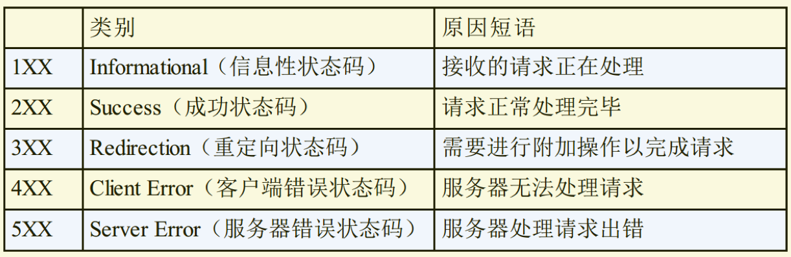

## HTTP 状态码基础

HTTP 状态码负责表示客户端 HTTP 请求的返回结果、 标记服务器端的处理是否正常、 通知出现的错误等工作。

1. 2XX 状态码

表明请求被正常处理了。

| 状态码              | 含义                                                                                                             |
| ------------------- | ---------------------------------------------------------------------------------------------------------------- |
| 200 OK              | 从客户端发来的请求在服务器端被正常处理了。                                                                       |
| 204 No Content      | 代表服务器接收的请求已成功处理， 但在返回的响应报文中不含实体的主体部分。也不允许返回任何实体的主体。            |
| 206 Partial Content | 客户端进行了范围请求， 而服务器成功执行了这部分的 GET 请求。 响应报文中包含由 Content-Range 指定范围的实体内容。 |

- 200 OK 从客户端发来的请求在服务器端被正常处理了。
- 204 No Content 代表服务器接收的请求已成功处理， 但在返回的响应报文中不含实体的主体部分。 另外， 也不允许返回任何实体的主体。
- 206 Partial Content 客户端进行了范围请求， 而服务器成功执行了这部分的 GET 请求。 响应报文中包含由 Content-Range 指定范围的实体内容。
