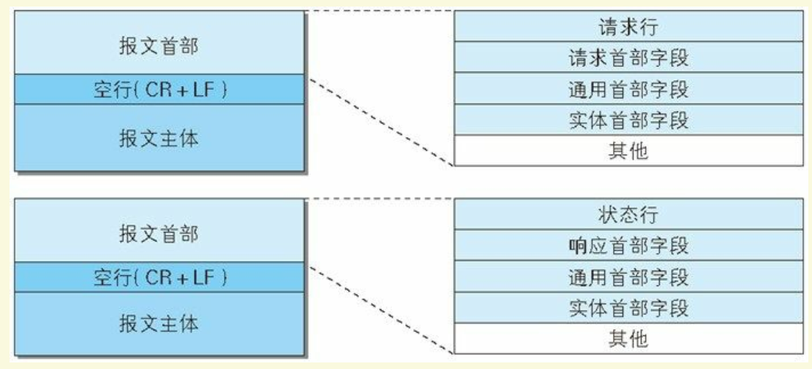
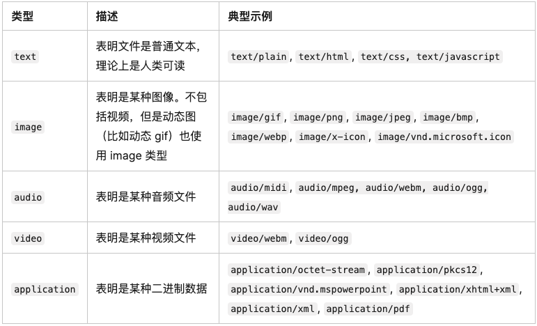

# HTTP 报文

## HTTP 报文基础

用于 `HTTP` 协议交互的信息被称为 `HTTP` 报文。 请求端（客户端）的 `HTTP` 报文叫做**请求报文**， 响应端（服务器端）的叫做**响应报文**。报文本身是由多行（ 用 CR+LF 作换行符） 数据构成的字符串文本。`HTTP` 报文大致可分为**报文首部**`Header` 和**报文主体**`Body` 两块。

## HTTP 请求报文 / HTTP 响应报文

`HTTP` 请求报文 和 `HTTP` 响应报文都由 `Header + Body` 组成：

- 在请求中， HTTP 报文由 **方法**、 **URI**、 **HTTP版本**、 **HTTP请求首部字段**、**空行**、**实体**等部分构成。
- 在响应中， HTTP 报文由 **HTTP版本**、 **状态码（ 数字和原因短语）** 、**HTTP响应首部字段**、**空行**、**实体**等部分构成。



## HTTP 报文首部组成

- 请求行(请求报文)

包含用于请求的方法， 请求 `URI` 和 `HTTP` 版本。

- 状态行(响应报文)

包含表明响应结果的状态码， 原因短语和 `HTTP` 版本。

- 首部字段

包含表示请求和响应的各种条件和属性的各类首部。
一般有4种首部，分别是： 通用首部、 请求首部、 响应首部 、实体首部。

- 其他

可能包含 `HTTP` 的 RFC 里未定义的首部（ `Cookie` 等）

**请求报文**例子如下：

```text
/* 请求行 */
Request URL: https://mcs.snssdk.com/list
Request Method: POST

/* 请求首部 */
:authority: mcs.snssdk.com
:method: POST
:path: /list
:scheme: https
accept: */*
accept-encoding: gzip, deflate, br
accept-language: zh-CN,zh;q=0.9,en;q=0.8,zh-TW;q=0.7
cache-control: no-cache
content-length: 1168
content-type: application/json; charset=UTF-8
origin: https://juejin.cn
pragma: no-cache
referer: https://juejin.cn/
sec-ch-ua: "Chromium";v="112", "Google Chrome";v="112", "Not:A-Brand";v="99"
sec-ch-ua-mobile: ?0
sec-ch-ua-platform: "macOS"
sec-fetch-dest: empty
sec-fetch-mode: cors
sec-fetch-site: cross-site
user-agent: Mozilla/5.0 (Macintosh; Intel Mac OS X 10_15_7) AppleWebKit/537.36 (KHTML, like Gecko) Chrome/112.0.0.0 Safari/537.36
```

**响应报文**例子如下：

```text
/* 状态行 */
Status Code: 200 
Remote Address: 59.81.65.33:443
Referrer Policy: strict-origin-when-cross-origin

/* 响应首部 */
access-control-allow-credentials: true
access-control-allow-methods: GET, OPTIONS, HEAD, PUT, POST
access-control-allow-origin: https://juejin.cn
access-control-max-age: 1800
cache-control: no-store, no-cache, must-revalidate
content-length: 7
content-type: application/json; charset=utf-8
date: Sat, 29 Apr 2023 11:47:19 GMT
expires: 0
pragma: no-cache
server: nginx
server-timing: cdn-cache;desc=MISS, edge;dur=1, origin;dur=48
server-timing: inner; dur=13
via: CHN-SH-CUCC3-CACHE19[49],CHN-SH-CUCC3-CACHE19[ovl,48]
```

## HTTP 报文首部字段

**首部字段**是为了给浏览器和服务器提供报文主体大小、 所使用的语言、 认证信息等内容。

- 通用首部字段

通用首部字段是指， 请求报文和响应报文双方都会使用的首部。


- 请求首部字段

请求首部字段是从客户端往服务器端发送请求报文中所使用的字段，用于补充请求的附加信息、 客户端信息、 对响应内容相关的优先级等内容。


- 响应首部字段

响应首部字段是由服务器端向客户端返回响应报文中所使用的字段，用于补充响应的附加信息、 服务器信息， 以及对客户端的附加要求等信息。


- 实体首部字段

实体首部字段是包含在请求报文和响应报文中的实体部分所使用的首部，用于补充内容的更新时间等与实体相关的信息，描述消息正文内容。


## HTTP请求方法

- `GET`: 通常用来获取资源
- `POST`: 提交数据，即上传数据
- `HEAD`: 获取资源的元信息
- `PUT`: 修改数据
- `DELETE`: 删除资源
- `CONNECT`: 建立连接隧道，用于代理服务器
- `OPTIONS`: 列出可对资源实行的请求方法，用来跨域请求，预检请求中会遇到
- `TRACE`: 追踪请求-响应的传输路径

`GET`和`POST`请求有什么区别：

从缓存的角度，`GET` 请求会被浏览器主动缓存下来，留下历史记录，而 `POST` 默认不会。
从编码的角度，`GET` 只能进行 `URL` 编码，只能接收 `ASCII` 字符，而 `POST` 没有限制。
从参数的角度，`GET` 一般放在 `URL` 中，因此不安全，`POST` 放在请求体中，更适合传输敏感信息。
从幂等性的角度，`GET`是幂等的，而`POST`不是。(幂等表示执行相同的操作，结果也是相同的)
从`TCP`的角度，`GET` 请求会把请求报文一次性发出去，而 `POST` 会分为两个 `TCP` 数据包，首先发 `header` 部分，如果服务器响应 100(continue)， 然后发 `body` 部分。(火狐浏览器除外，它的 `POST` 请求只发一个 TCP 包)

## 内容协商机制

内容协商机制是指客户端和服务器端就响应的资源内容进行交涉， 然后提供给客户端最为适合的资源。 内容协商会以响应资源的语言、 字符集、 编码方式等作为判断的基准。内容协商的分类有很多种，主要的几种类型是：

- `Accept`：希望接收的媒体资源的 MIME 类型
- `Accept-Charset`：用来告知（服务器）客户端可以处理的字符集类型
- `Accept-Encoding`：希望接收的内容编码形式（所支持的压缩算法）
- `Accept-Language`：希望接收的自然语言的优先顺序

在服务端驱动型内容协商或者主动内容协商中，浏览器（或者其他任何类型的用户代理）会随同 `URL` 发送一系列的 `HTTP` 标头。这些标头描述了用户倾向的选择。服务器则以此为线索，通过内部算法来选择最佳方案提供给客户端。如果它不能提供一个合适的资源，它可能使用 406（Not Acceptable）、415（Unsupported Media Type）进行响应并为其支持的媒体类型设置标头。

## 传输类型

`MIME`媒体类型（通常称为 `Multipurpose Internet Mail Extensions` 或 `MIME` 类型）是一种标准，用来表示文档、文件或字节流的性质和格式。

浏览器通常使用 `MIME` 类型（而不是文件扩展名）来确定如何处理 `URL`，因此 `Web` 服务器在响应头中添加正确的 `MIME` 类型非常重要。如果配置不正确，浏览器可能会曲解文件内容，网站将无法正常工作，并且下载的文件也会被错误处理。

```text
type/subtype
```

`MIME` 的组成结构非常简单；由类型与子类型两个字符串中间用`'/'`分隔而组成。不允许空格存在。`type` 表示可以被分多个子类的独立类别。`subtype` `表示细分后的每个类型。MIME` 类型对大小写不敏感，但是传统写法都是小写。



举例有如下常见类型：

- Type application:

```text
  application/java-archive
  application/EDI-X12   
  application/EDIFACT   
  application/javascript   
  application/octet-stream   
  application/ogg   
  application/pdf  
  application/xhtml+xml   
  application/x-shockwave-flash    
  application/json  
  application/ld+json  
  application/xml   
  application/zip  
  application/x-www-form-urlencoded  
```

- Type audio:

```text
  audio/mpeg   
  audio/x-ms-wma   
  audio/vnd.rn-realaudio   
  audio/x-wav   
```

- Type image:

```text
  image/gif   
  image/jpeg   
  image/png   
  image/tiff    
  image/vnd.microsoft.icon    
  image/x-icon   
  image/vnd.djvu   
  image/svg+xml    
```

- Type multipart:

```text
  multipart/mixed    
  multipart/alternative   
  multipart/related (using by MHTML (HTML mail).)  
  multipart/form-data  
```

- Type text:

```text
  text/css    
  text/csv    
  text/html    
  text/javascript (obsolete)    
  text/plain    
  text/xml   
```

- Type video:

```text
  video/mpeg    
  video/mp4    
  video/quicktime    
  video/x-ms-wmv    
  video/x-msvideo    
  video/x-flv   
  video/webm   
```

- Type vnd:

```text
  application/vnd.android.package-archive
  application/vnd.oasis.opendocument.text    
  application/vnd.oasis.opendocument.spreadsheet  
  application/vnd.oasis.opendocument.presentation   
  application/vnd.oasis.opendocument.graphics   
  application/vnd.ms-excel    
  application/vnd.openxmlformats-officedocument.spreadsheetml.sheet   
  application/vnd.ms-powerpoint    
  application/vnd.openxmlformats-officedocument.presentationml.presentation    
  application/msword   
  application/vnd.openxmlformats-officedocument.wordprocessingml.document   
  application/vnd.mozilla.xul+xml   
```

`application/x-www-form-urlencoded`：会在url上拼接字符串，如：k=123&c=12241，同时对于中文还会转码。
`application/json`：直接会在请求体中添加object对象，如： { a: 123, b: 456 }
`multipart/form-data`: 在network中可以看到添加带数据类型等各类标识的文件类型字符串请求体告诉服务器端接收对象是一个文件数据流

## 参考资料

《图解HTTP》

《Web性能权威指南》

[MIME 类型](https://developer.mozilla.org/zh-CN/docs/Web/HTTP/Basics_of_HTTP/MIME_Types)

[内容协商](https://developer.mozilla.org/zh-CN/docs/Web/HTTP/Content_negotiation)

[关于队头阻塞（Head-of-Line blocking），看这一篇就足够了](https://zhuanlan.zhihu.com/p/330300133)