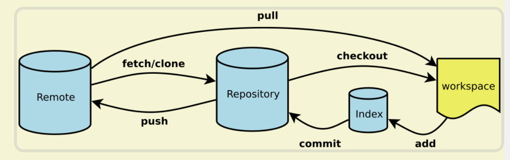

# Git常用命令

## Git 基本使用流程

### Git 提交的整个过程



- 工作区->`add`->暂存区->`commit`->当前分支->`push`->远程仓库

### 初始化 Git 仓库

```zsh
git init
```

### 添加文件到暂存区

```zsh
git add <file>
```

### 添加文件到本地 Git 仓库

```zsh
git commit -m <message>

# 修改最近提交的便捷方法。 它让您将暂存的变更与先前的提交合并，而不是创建一个全新的提交。 
git add <file_name>
git commit --amend

# 它还可以用于在不更改快照的情况下简单地编辑先前的提交消息。
git commit --amend -m "New commit message"

# 合并最新的提交与之前的提交
git commit --amend --no-edit
```

---

## Git 历史记录相关

### 查看提交历史

```zsh
git log
git log --all --graph
```

### 查看命令历史

```zsh
git reflog
```

### 查看修改某文件的用户和时间

```zsh
git blame <file>
```

### 查看之前的某次提交

```zsh
git checkout <commit-hash>
```

### 丢弃工作区的修改-回到本地修改以前

```zsh
git checkout -- <file>   # 丢弃单个文件的修改
git checkout -- .        # 丢弃当前目录下所有文件的修改
git checkout HEAD <file>
git checkout HEAD^
git checkout HEAD~<num>
```

### 丢弃暂存区的修改-回到 add 以前

```zsh
git reset <file>   # 将文件从暂存区移除
git reset .        # 将所有已暂存的文件移出暂存区
```

### 版本回退|把版本库的修改回退到暂存区-回到 commit 以前

```zsh
git reset --soft <commit-hash>  # 回退到指定提交，保留暂存区和工作区的修改
git reset --soft HEAD^          # 回退到上一个提交，保留暂存区和工作区的修改
git reset --soft HEAD^^
git reset --soft HEAD~100

# 不删除工作空间改动代码，撤销commit，不撤销git add .
git reset --soft HEAD^

# 不删除工作空间改动代码，撤销commit，并且撤销git add . 操作
git reset --mixed HEAD^
git reset HEAD^

# 删除工作空间改动代码，撤销commit，撤销git add .
git reset --hard HEAD^

# 消除某个commit提交的内容并形成一个新的commit，原commit并不会消失
git revert <commit-hash> 
```

### 恢复到之前的某次提交

```zsh
git checkout <commit-hash> <file>  #恢复指定提交中的单个文件到工作区，覆盖当前文件内容。
git checkout <commit-hash> .       #恢复指定提交中的所有文件到工作区，覆盖当前工作区中的所有文件内容。
```

---

## 远程仓库

远程分支有一个命名规范 —— 它们的格式是:

```zsh
<remote name>/<branch name>
```

### 查看远程仓库详情

```zsh
git remote -v
git remote show origin
```

## 拉取远程仓库内容

```zsh
git fetch
git pull
# git的fetch和pull区别是：git fetch是将远程主机的最新内容拉到本地，用户在检查了以后决定是否合并到工作本机分支中；而git pull 则是将远程主机的最新内容拉下来后直接合并，即：git pull = git fetch + git merge。
```

### 关联一个远程库

```zsh
git remote add origin git@server-name:path/repo-name.git
```

### 第一次推送 master 分支的所有内容

```zsh
git push -u origin
```

### 克隆一个远程仓库

```zsh
git clone
```

### 显示远程仓库的信息

```zsh
git remote -v
git remote show origin
git remote show <remote-name>
# <remote-name> 是远程仓库的名称，通常默认的是 origin，但你也可以为远程仓库指定其他名称
```

---

## 多人协作

### 创建分支并切换到该分支

```zsh
# 创建分支
git branch <branch-name>

# 切换分支
git checkout <branch-name>
git switch <branch-name>

# 创建分支并切换到该分支
git checkout -b <branch-name>
git switch -c <branch-name>
```

### 查看当前分支

```zsh
git branch
```

### 把 dev 分支的工作成果合并到 master 分支上

```zsh
# 回master分支
git checkout master
git switch master

# 把dev合并过来
git merge dev
```

### 删除本地 dev 分支

```zsh
git branch -d dev
```

### 丢弃一个没有被合并过的分支

```zsh
git branch -D <name>
```

### 查看所有分支

```zsh
git branch -a
```

### 新建分支切换到该分支并和远程分支关联起来

```zsh
git checkout -b 本地分支名 origin/远程分支名

git checkout -b dev origin/release/project1.0
```

该命令可以将远程 git 仓库里的指定分支拉取到本地，这样就在本地新建了一个 dev 分支，并和指定的远程分支 release/caigou_v1.0 关联了起来。

### 查看本地分支和远程分支的映射关系

```zsh
git branch -vv
```

### 查看本地各个分支目前最新的提交

```zsh
git branch -v
```

### 查看远程各个分支目前最新的提交

```zsh
git branch -r -v
```

### 合并分支

```zsh
# 形成一个新的提交，和主分支上的提交先合并再提交
# git merge 是将两个分支的历史合并在一起，它会创建一个新的合并提交（merge commit）。在执行 git merge 时，Git 会自动寻找两个分支的共同祖先（merge base），然后将两个分支的内容合并。 git merge 会保留所有的提交历史，包括分支的分叉点和合并点。也就是说，合并后的提交历史中会包含原来分支的所有提交。
git merge 

# 和主分支上的提交还是线性关系提交，顺序清晰
#  git rebase 是将一个分支的更改“转移”到另一个分支的顶部，它通过重新应用每一个提交（commit）来调整历史。Rebase 会将目标分支的提交应用到当前分支的上面，仿佛这些提交是从当前分支的最新提交之后产生的一样。 rebase 会修改提交历史（产生新的提交哈希），而不是创建合并提交，因此它的历史看起来像是一个线性的进展。
git rebase 
```

### 合并时禁用 Fast forward(--no-ff)

```zsh
git merge --no-ff -m "merge with no-ff" dev
```

### 把当前工作现场“储藏”起来，等以后恢复现场后继续工作

```zsh
git stash
```

### 恢复工作现场

```zsh
# 查看当前项目中存储的所有暂存内容
git stash list

# 恢复后，stash内容并不删除
git stash apply

# 恢复的同时把stash内容也删了
git stash pop
```

### 复制一个特定的提交(commit)到当前分支

```zsh
git cherry-pick <commit-hash>

# 如果在应用提交时发生冲突，Git 会暂停 cherry-pick 操作并提示你解决冲突。你需要手动解决冲突并提交解决后的更改
git status  # 查看冲突文件
# 解决冲突后：
git add <resolved-file>
git cherry-pick --continue

# 如果你决定不继续 cherry-pick 操作，可以使用
git cherry-pick --abort

# 如果你在 cherry-pick 的过程中遇到不可解决的冲突，想跳过当前提交，可以使用
git cherry-pick --skip
```

### 获取最新的一次完整 commit id

```zsh
git rev-parse HEAD
```

### 获取最新的一次 short commit id

```zsh
git rev-parse --short HEAD
```

### 多人协作准则

在实际开发中，我们应该按照几个基本原则进行分支管理：

- `master`分支应该是非常稳定的，也就是仅用来发布新版本，平时不能在上面干活；

- 干活都在`dev`分支上，也就是说，`dev`分支是不稳定的，到某个时候，比如1.0版本发布时，再把`dev`分支合并到`master`上，在`master`分支发布1.0版本；

- 你和你的小伙伴们每个人都在`dev`分支上干活，每个人都有自己的分支，时不时地往`dev`分支上合并就可以了；

多人协作的工作模式通常是这样：

首先，可以试图用 `git push origin <branch-name>`推送自己的修改；

如果推送失败，则因为远程分支比你的本地更新，需要先用 `git pull` 试图合并；

如果合并有冲突，则解决冲突，并在本地提交；

没有冲突或者解决掉冲突后，再用 `git push origin <branch-name>`推送就可以

如果 `git pull` 提示 no tracking information，则说明本地分支和远程分支的链接关系没有创建，用命令 `git branch --set-upstream-to <branch-name> origin/<branch-name>`。

## Git标签

Git 的 tag 可以（在某种程度上 —— 因为标签可以被删除后重新在另外一个位置创建同名的标签）永久地将某个特定的提交命名为里程碑，然后就可以像分支一样引用了。

更难得的是，它们并不会随着新的提交而移动。你也不能切换到某个标签上面进行修改提交，它就像是提交树上的一个锚点，标识了某个特定的位置。

### 打标签(HEAD)

```zsh
git tag v1.0
```

### 查看所有标签

```zsh
git tag
```

### 在某个具体 commit 打标签

```zsh
git tag v0.9 f52c633
```

### 查看标签信息

```zsh
git show <tagname>
```

### 创建带有说明的标签，用 -a 指定标签名，-m 指定说明文字

```zsh
git tag -a v0.1 -m "version 0.1 released" 1094adb
```

### 删除标签

```zsh
git tag -d v0.1
```

### 推送一个本地标签到远程

```zsh
git push origin <tagname>
```

### 推送全部未推送过的本地标签到远程

```zsh
git push origin --tags
```

### 删除一个远程标签

```zsh
git push origin :refs/tags/<tagname>
```

---

## 常用注释

- `feat`: 新特性，添加功能
- `fix`: 修改 bug
- `refactor`: 代码重构
- `docs`: 文档修改
- `style`: 代码格式修改，注意不是 css 修改
- `test`: 测试用例修改
- `chore`: 其他修改，比如构建流程，依赖管理

## cheatsheet


