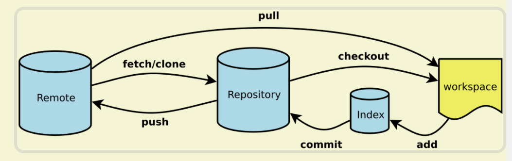

# Git常用命令

## Git 基本使用流程

### Git 提交的整个过程



- 工作区->`add`->暂存区->`commit`->当前分支->`push`->远程仓库

### 初始化 Git 仓库

```git
git init
```

### 添加文件到暂存区

```git
git add <file>
```

### 添加文件到本地 Git 仓库

```git
git commit -m <message>
```

---

## Git 历史记录相关

### 查看提交历史

```git
git log
git log --all --graph
```

### 查看命令历史

```git
git reflog
```

### 查看修改某文件的用户和时间

```git
git blame <file>
```

### 查看之前的某次提交

```git
git checkout <commit>
```

### 丢弃工作区的修改-回到本地修改以前

```git
git checkout -- <file>
git checkout HEAD <file>
git checkout -- .
```

### 丢弃暂存区的修改-回到 add 以前

```git
git reset <file>
git reset .
```

### 版本回退|把版本库的修改回退到暂存区-回到 commit 以前

```git
git reset --hard commit_id
git reset --hard HEAD^
git reset --hard HEAD^^
git reset --hard HEAD~100

<!-- 不删除工作空间改动代码，撤销commit，不撤销git add .  -->
git reset --soft HEAD^
<!-- 不删除工作空间改动代码，撤销commit，并且撤销git add . 操作 -->
git reset --mixed HEAD^
git reset HEAD^
<!-- 删除工作空间改动代码，撤销commit，撤销git add .  -->
git reset --hard HEAD^
```

### 恢复到之前的某次提交

```git
git checkout <commit> <file>
git checkout <commit> .
```

---

## 远程仓库

### 关联一个远程库

```git
git remote add origin git@server-name:path/repo-name.git
```

### 第一次推送 master 分支的所有内容

```git
git push -u origin
```

### 克隆一个远程仓库

```git
git clone
```

### 显示远程仓库的信息

```git
git remote show <remote>
```

---

## 多人协作

### 创建分支并切换到该分支

```git
<!--创建分支-->
git branch <name>

<!--切换分支-->
git checkout <name>  或者
git switch <name>

<!--创建分支并切换到该分支-->
git checkout -b <name>   或者
git switch -c <name>
```

### 查看当前分支

```git
git branch
```

---

### 把 dev 分支的工作成果合并到 master 分支上

```git
<!--回master分支-->
git checkout master  或者
git switch master

<!--把dev合并过来-->
git merge dev
```

### 删除本地 dev 分支

```git
git branch -d dev
```

### 合并时禁用 Fast forward(--no-ff)

```git
git merge --no-ff -m "merge with no-ff" dev
```

### 把当前工作现场“储藏”起来，等以后恢复现场后继续工作

```git
git stash
```

### 恢复工作现场

```git
git stash list
<!--恢复后，stash内容并不删除-->
git stash apply
<!--恢复的同时把stash内容也删了-->
git stash pop
```

### 复制一个特定的提交(commit)到当前分支

```git
git cherry-pick <commit>
```

### 丢弃一个没有被合并过的分支

```git
git branch -D <name>
```

多人协作的工作模式通常是这样：

首先，可以试图用 `git push origin <branch-name>`推送自己的修改；

如果推送失败，则因为远程分支比你的本地更新，需要先用 `git pull` 试图合并；

如果合并有冲突，则解决冲突，并在本地提交；

没有冲突或者解决掉冲突后，再用 `git push origin <branch-name>`推送就能成功！

如果 `git pull` 提示 no tracking information，则说明本地分支和远程分支的链接关系没有创建，用命令 `git branch --set-upstream-to <branch-name> origin/<branch-name>`。

### 获取最新的一次完整 commit id

```git
git rev-parse HEAD
```

### 获取最新的一次 short commit id

```git
git rev-parse --short HEAD
```

### 查看所有分支

```git
git branch -a
```

### 新建分支并切换到指定分支

```git
git checkout -b 本地分支名 origin/远程分支名
```

git checkout -b dev origin/release/project1.0

该命令可以将远程 git 仓库里的指定分支拉取到本地，这样就在本地新建了一个 dev 分支，并和指定的远程分支 release/caigou_v1.0 关联了起来。

### 查看本地分支和远程分支的映射关系

```git
git branch -vv
```

### 查看本地各个分支目前最新的提交

```git
git branch -v
```

### 查看远程各个分支目前最新的提交

```git
git branch -r -v
```

### 合并分支

```git
//形成一个新的提交，和主分支上的提交先合并再提交
git merge 

//和主分支上的提交还是线性关系提交，顺序清晰
git rebase 
```

### 多人协作准则

在实际开发中，我们应该按照几个基本原则进行分支管理：

- `master`分支应该是非常稳定的，也就是仅用来发布新版本，平时不能在上面干活；

- 干活都在`dev`分支上，也就是说，`dev`分支是不稳定的，到某个时候，比如1.0版本发布时，再把`dev`分支合并到`master`上，在`master`分支发布1.0版本；

- 你和你的小伙伴们每个人都在`dev`分支上干活，每个人都有自己的分支，时不时地往`dev`分支上合并就可以了；

## Git标签

### 打标签

```git
git tag v1.0
```

### 查看所有标签

```git
git tag
```

### 在某个具体 commit 打标签

```git
git tag v0.9 f52c633
```

### 查看标签信息

```git
git show <tagname>
```

### 创建带有说明的标签，用 -a 指定标签名，-m 指定说明文字

```git
git tag -a v0.1 -m "version 0.1 released" 1094adb
```

### 删除标签

```git
git tag -d v0.1
```

### 推送一个本地标签到远程

```git
git push origin <tagname>
```

### 推送全部未推送过的本地标签到远程

```git
git push origin --tags
```

### 删除一个远程标签

```git
git push origin :refs/tags/<tagname>
```

---

## 常用注释

- `feat`: 新特性，添加功能
- `fix`: 修改 bug
- `refactor`: 代码重构
- `docs`: 文档修改
- `style`: 代码格式修改，注意不是 css 修改
- `test`: 测试用例修改
- `chore`: 其他修改，比如构建流程，依赖管理

## cheatsheet


