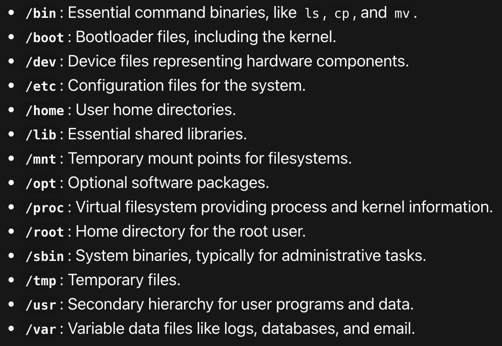

# Linux 常用命令

## 目录操作相关

### ls — List

ls 会列举出当前工作目录的内容（文件或文件夹）。

### cd — Change Directory

切换文件路径，cd 将给定的文件夹（或目录）设置成当前工作目录。

### pwd — Print Working Directory

显示当前工作目录

### mkdir — Make Directory

新建一个新目录

### rmdir — Remove Directory

删除给定的目录。

### mvdir - Move Directory

移动或重命名一个目录

## 文件操作相关

### rm — Remove

rm 会删除给定的文件或文件夹

### cp — Copy

cp 命令对文件或文件夹进行复制

### mv — Move

mv 命令对文件或文件夹进行移动，如果文件或文件夹存在于当前工作目录，还可以对文件或文件夹进行重命名。

### cat — concatenate and print files

cat 用于在标准输出（监控器或屏幕）上查看文件内容

### open

使用默认的程序打开文件

### grep

grep 在给定的文件中搜寻指定的字符串。grep -i “” 在搜寻时会忽略字符串的大小写，而 grep -r “” 则会在当前工作目录的文件中递归搜寻指定的字符串。

### find

这个命令会在给定位置搜寻与条件匹配的文件。你可以使用 find -name 的-name 选项来进行区分大小写的搜寻，find -iname 来进行不区分大小写的搜寻。

### tar

tar 命令能创建、查看和提取 tar 压缩文件。tar -cvf 是创建对应压缩文件，tar -tvf 来查看对应压缩文件，tar -xvf 来提取对应压缩文件。

### zip

gzip 命令创建和提取 gzip 压缩文件，还可以用 gzip -d 来提取压缩文件。

### unzip

unzip 对 gzip 文档进行解压。在解压之前，可以使用 unzip -l 命令查看文件内容。

## 网络操作相关

### ping

ping 通过发送数据包 ping 远程主机(服务器)，常用与检测网络连接和服务器状态。

### sudo killall -HUP mDNSResponder

清除 DNS 缓存

## 常见文件夹

