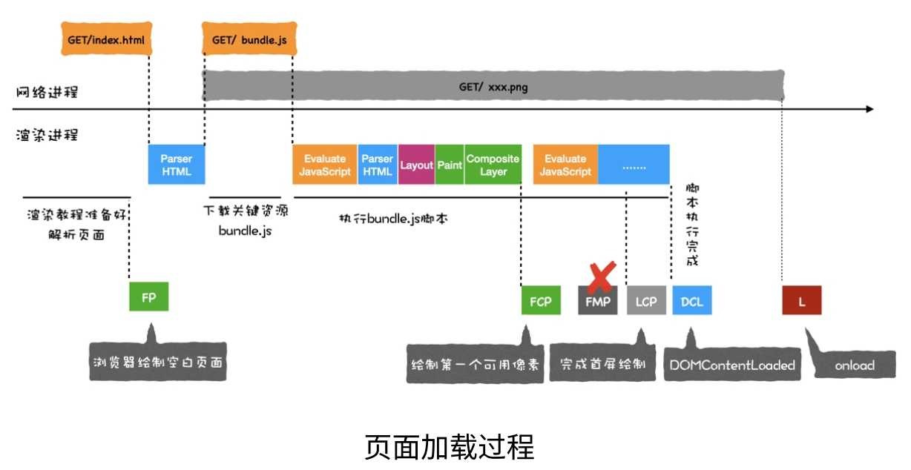
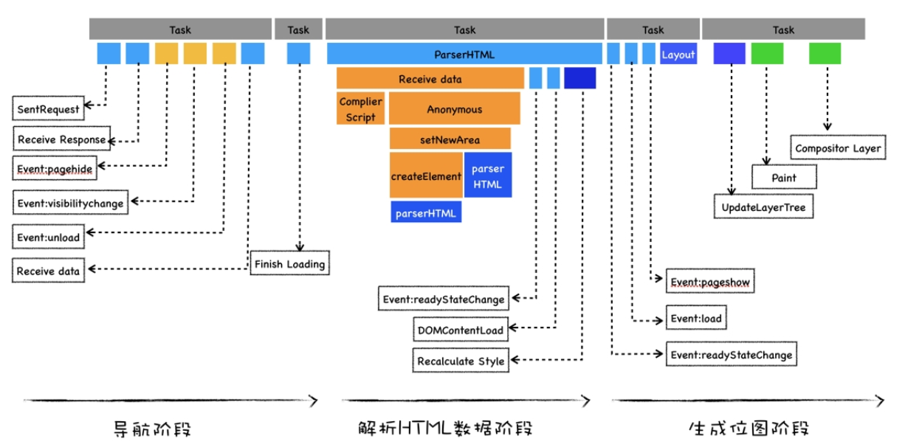
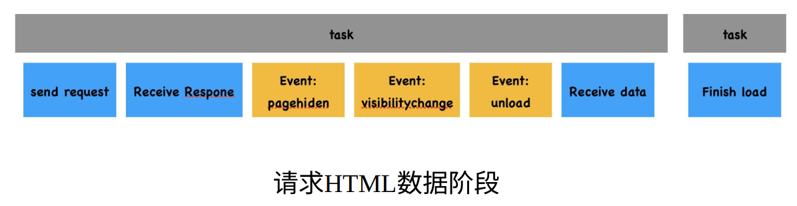
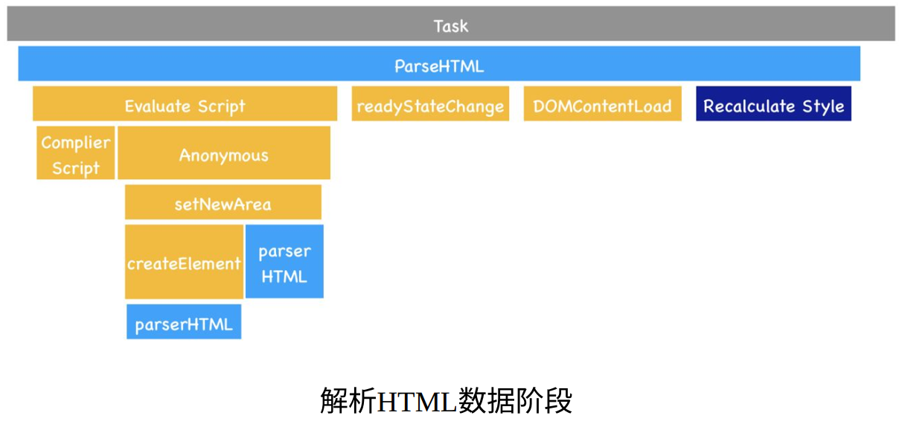
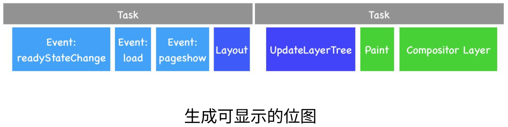
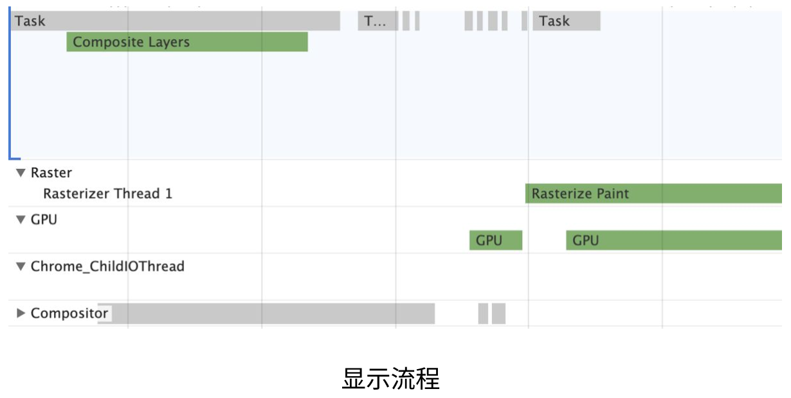
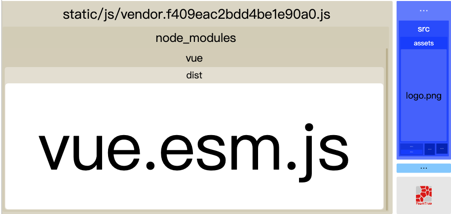

# 项目优化经验

## 性能指标

### `RAIL`

Chrome 团队提出了一个以用户为中心的性能模型被称为 RAIL，它为工程师提供一个目标，只要达到目标的网页，用户就会觉得很流畅；它将用户体验拆解为一些关键操作，例如：点击，加载等；并给这些操作规定一个目标，例如：点击一个按钮后，多长时间给反馈用户会觉得流畅。

`RAIL`将影响性能的行为划分为四个方面，分别是：`Response`（响应）、`Animation`（动画）、`Idle`（空闲） 与 `Load`（加载）。

| RAIL              | 关键指标   | 用户操作                                                     |
| ----------------- | ---------- | ------------------------------------------------------------ |
| 响应（Response）  | 小于 100ms | 点击按钮。                                                   |
| 动画（Animation） | 小于 16ms  | 滚动页面，拖动手指，播放动画等。                             |
| 空闲（Idle）      | 小于 50ms  | 用户没有与页面交互，但应该保证主线程足够处理下一个用户输入。 |
| 加载（Load）      | 1000ms     | 用户加载页面并看到内容。                                     |

### `Interaction to Next Paint (INP)`

良好的响应能力意味着网页对互动做出快速响应。当网页响应互动时，浏览器会在其绘制的下一帧中提供视觉反馈。例如，视觉反馈会告诉您是否确实添加了您添加到在线购物车中的商品、移动导航菜单是否打开、服务器是否正在对登录表单的内容进行身份验证等。因此，INP 的目的不是衡量互动的最终影响（例如网络提取和其他异步操作的界面更新），而是衡量下一次绘制被阻塞的时间。延迟视觉反馈可能会给用户造成网页响应速度不够快的印象，而 INP 旨在帮助开发者衡量这部分用户体验。

- INP 低于或等于 200 毫秒表示网页响应速度良好。
- 如果 INP 高于 200 毫秒或低于 500 毫秒，则表示网页的响应速度需要改进。
- INP 超过 500 毫秒表示网页响应缓慢。

### `Core Web Vitals`

Core Web Vitals are a set of specific factors that Google considers important in determining the user experience on a website. These metrics focus on the speed, responsiveness, and visual stability of web pages. Google introduced Core Web Vitals as part of its broader initiative called Web Vitals, which aims to provide unified guidance for quality signals that are essential to delivering a great user experience on the web.

- `Largest Contentful Paint (LCP)`: This metric measures the loading performance of a web page. Specifically, it looks at the time it takes for the largest content element (such as an image or text block) to become visible within the user's viewport.

- `First Input Delay (FID)`: FID measures the responsiveness of a web page by gauging the time it takes for a user to interact with the page for the first time (e.g., clicking a button) to when the browser is able to respond to that interaction.

- `Cumulative Layout Shift (CLS)`: CLS measures the visual stability of a web page. It quantifies how much the page layout shifts during its loading phase. An unexpected layout shift can be frustrating for users, especially if they accidentally click on the wrong element due to a sudden movement.

### 其他常见性能指标

还有一些其他观测指标如下：

1. `TTFB` 首个比特 (Time To First Byte)，是请求发送出去之后到接收到首个资源比特的间隔；
2. `FP` ⾸次绘制(First Paint)，是当⻚⾯中绘制了第⼀个像素时；
3. `FCP` ⾸次有效绘制(First Contentful Paint)，是当⾸屏内容完全绘制完成时；
4. `FCI` ⾸次 CPU 空闲时间(First CPU Idle)，是⻚⾯达到最⼩化可交互的时间；
5. `TTI` 完全可交互时间(Time to Interactive)，是⻚⾯中所有元素都达到了可交互的时⻓；
6. `MPFID` 最⼤估计输⼊延时(Max Potential First Input Delay)，是估计你的 Web ⻚⾯在加载最繁忙的阶段， 窗⼝中响应⽤户输⼊所需的时间；

## 性能监测

### 浏览器的 `Network` 选项

这里可以看到资源加载详情，初步评估影响页面性能的因素。查看瀑布流里的一些常见指标：

- `Queueing`: 浏览器将资源放入队列时间
- `Stalled`: 因放入队列时间而发生的停滞时间
- `DNS Lookup`: DNS 解析时间
- `Initial connection`: 建立 HTTP 连接的时间
- `SSL`: 浏览器与服务器建立安全性连接的时间
- `TTFB`: 等待服务端返回数据的时间
- `Content Download`: 浏览器下载资源的时间

### 浏览器的 `Lighthouse` 选项

分析网页性能的几个主要指标并给出建议。

- `First Contentful Paint`: 首屏渲染时间，1s 以内绿色
- `Speed Index`: 速度指数，4s 以内绿色
- `Time to Interactive`: 到页面可交互的时间

### 浏览器的 `Performance` 选项

通常我们会使用 JS 修改一些样式，随后浏览器会进行样式计算，然后进行布局，分层，绘制，最后将各个图层合并在一起完成整个渲染的流程，这期间的每一步都有可能导致页面卡顿。但是并不是所有的样式改动都需要经历这几个个步骤。举例来说：如果在 JS 中修改了元素的几何属性（宽度、高度等），那么浏览器需要需要将这几个步骤都走一遍。但如果只是修改了文字的颜色，则布局（Layout）是可以跳过去的。此处涉及我们常说的一个概念：重绘和回流。除了最后的合成，前面几个步骤在不同的场景下都可以被跳过。例如：CSS 动画就可以跳过 JS 运算，它不需要执行 JS。

浏览器的`Performance` 选项可以分析网页性能整个流程，各个环节指标性能分析，每一帧都可以进行具体的分析。`Main`指标记录渲染主线程的任务执⾏过程，`Compositor`指标记录了合成线程的任务执⾏过程，`GPU`指标记录了 GPU 进程主线程的任务执⾏过程。

- 蓝色 Loading：网络请求与解析。
  - Parse HTML
  - Send Request
  - Receive Response
  - Recive Data
- 黄色 Scripting: JS 执行时间。
- 紫色 Rendering: 重排，主要包含样式计算、更新布局树、布局、分层等。
  - Recalculate Style
  - Layout
  - Pre-Paint
  - Layerize
- 绿色 Painting：重绘，更新分层、光栅化分层、合成等。
  - Paint
  - Commit
- 深灰色 System: 系统占用时间。
- 灰色 Idle: 空闲时间。
- Total: 总计。
- Fire Idle Callback
  - Compile Module
  - XHR Ready State Change
  - Timer Fired
  - Function Call
  - Evaluate Script

主线程上某些事件由哪些事件引起，选中之后会有箭头指向：

- Style or layout invalidation -> Recalculate styles or Layout
- Request Animation Frame -> Animation Frame Fired
- Request Idle Callback -> Fire Idle Callback
- Install Timer -> Timer Fired
- Create WebSocket -> Send... and Receive WebSocket Handshake or Destroy WebSocket

观察`performance`的`main`渲染主线程的大致流程如下：

- 导航阶段：

1. 该任务的第⼀个⼦过程就是`Send request`，该过程表⽰⽹络请求已被发送。然后该任务进⼊了等待状态。
2. 接着由⽹络进程负责下载资源，当接收到响应头的时候，该任务便执⾏`Receive Respone`过程，该过程表⽰接收到 HTTP 的响应头了。
3. 接着执⾏ DOM 事件：`pagehide`、`visibilitychange`和`unload`等事件，如果你注册了这些事件的回调函数，那么这些回调函数会依次在该任务中被调⽤。
4. 这些事件被处理完成之后，那么接下来就接收`HTML`数据了，这体现在了`Recive Data`过程，`Recive Data`过程表⽰请求的数据已被接收，如果 HTML 数据过多，会存在多个`Receive Data`过程。

- HTML 解析阶段：

1. 在`ParserHTML`的过程中，如果解析到了`script`标签，那么便进⼊了脚本执⾏过程，也就是图中的`Evalute Script`。
2. 我们知道，要执⾏⼀段脚本我们需要⾸先编译该脚本，于是在`Evalute Script`过程中，先进⼊了脚本编译过程，也就是图中的`Complie Script`。脚本编译好之后，就进⼊程序执⾏过程，执⾏全局代码时，V8 会先构造⼀个 anonymous 过程，在执⾏ anonymous 过程中，会调⽤开发者写的具体逻辑。
3. DOM ⽣成完成之后，会触发相关的 DOM 事件，⽐如典型的`DOMContentLoaded`，还有`readyStateChanged`。
4. DOM ⽣成之后，`ParserHTML`过程继续计算样式表，也就是`Reculate Style`，这就是⽣成 CSSOM 的过程。

在⽣成完了 DOM 和 CSSOM 之后，渲染主线程⾸先执⾏了⼀些 DOM 事件，诸如`readyStateChange`、`load`、`pageshow`。具体地讲，如果你使⽤ JavaScript 监听了这些事件，那么这些监听的函数会被渲染主线程依次调⽤。

- ⽣成可显⽰位图阶段：

1. ⾸先执⾏布局，这个过程对应图中的`Layout`。
2. 然后更新层树(LayerTree)，这个过程对应图中的`UpdateLayerTree`。
3. 有了层树之后，就需要为层树中的每⼀层准备绘制列表了，这个过程就称为`Paint`。
4. 准备每层的绘制列表之后，就需要利⽤绘制列表来⽣成相应图层的位图了，这个过程对应图中的`Composite Layers`。

- 合成、光栅化、显示阶段：

1. ⾸先主线程执⾏到`Composite Layers`过程之后，便会将绘制列表等信息提交给合成线程，合成线程的执⾏记录你可以通过`Compositor`指标来查看。
2. 合成线程维护了⼀个`Raster`线程池，线程池中的每个线程称为`Rasterize`，⽤来执⾏光栅化操作，对应的任务就是`Rasterize Paint`。
3. 当然光栅化操作并不是在`Rasterize`线程中直接执⾏的，⽽是在 GPU 进程中执⾏的，因此`Rasterize`线程需要和 GPU 线程保持通信。
4. 然后 GPU ⽣成图像，最终这些图层会被提交给浏览器进程，浏览器进程将其合成并最终显⽰在⻚⾯上。

### `Webpack` 的 `webpack-bundle-analyzer` 插件

对于打包后各项资源大小的分析。

## Webpack 构建优化

1. 动态引入
2. 压缩
   - `Nginx`开启压缩
   - `Compression-webpack-plugin`插件
3. `optimization`中的`splitChunks`配置拆包
4. 生产环境删除多余内容`useless-files-w5-webpack-plugin`插件

## 网络请求优化

1. 压缩和优化图片： 使用适当的格式（如 JPEG、PNG、WebP），并选择合适的压缩率。还可以使用图片压缩工具，如 ImageMagick、TinyPNG 等。
2. 减少 HTTP 请求数量： 合并或内联 CSS 和 JavaScript 文件，以减少 HTTP 请求。还可以使用雪碧图（CSS Sprites）来将多个小图片合并为一个大图，从而减少请求。
3. 启用浏览器缓存： 使用适当的缓存策略，使得资源可以在用户首次访问后被缓存在本地，减少后续加载时间。

## 页面内容优化

根据浏览器运行的流程可以把优化从这几个方向进行考虑：

1. Script evaluation
   Optimize third-party JavaScript
   Debounce your input handlers
   Use web workers
2. Style and layout
   Reduce the scope and complexity of style calculations
   Avoid large, complex layouts and layout thrashing
3. Rendering
   Stick to compositor only properties and manage layer count
   Simplify paint complexity and reduce paint areas
4. Parsing HTML and CSS
   Extract critical CSS
   Minify CSS
   Defer non-critical CSS
5. Script parsing and compilation
   Reduce JavaScript payloads with code splitting
   Remove unused code
6. Garbage collection
   Monitor your web page's total memory usage with measureMemory()
7. Resources
   Source code for Minimize main thread work audit
   Main thread (MDN)
   Inside look at modern web browser (part 3)

细节上：

1. CSS
   - 避免出现超过三层的嵌套规则
   - 避免为 ID 选择器添加多余选择器
   - 避免使用标签选择器代替类选择器
   - 避免使用通配选择器，只对目标节点声明规则
   - 避免重复匹配重复定义，关注可继承属性
   - 合理开启 GPU 加速
   - 创建图层的最佳方式是使用 will-change，但某些不支持这个属性的浏览器可以使用 3D 变形（transform: translateZ(0)）来强制创建一个新层
   - 使用字体图标，使用字体图标代替图像图标，以减少文件大小和 HTTP 请求数量
   - 最小化重排和重绘，避免频繁的 DOM 操作，因为它们可能导致浏览器执行昂贵的重排和重绘操作。
2. JavaScript
   - JS 动画使用 requestAnimationFrame 触发动画
   - 异步加载： 将需要执行的 JavaScript 异步加载，以避免阻塞页面的渲染。将脚本放在`<script>`标签中，并将其放在页面底部，或使用 async 或 defer 属性。
3. DOM
   - 缓存 DOM 计算属性
   - 避免过多 DOM 操作，使用事件代理
   - 使用 DOMFragment 缓存批量化 DOM 操作
   - 使用类合并样式，避免逐条改变样式
   - 使用 display 控制 DOM 显隐，将 DOM 离线化
4. 骨架屏
5. 预加载&懒加载
6. 移除不必要的插件和库： 定期审查网页使用的插件和库，确保只保留必要的部分。

## 服务器端优化

1. 使用 CDN（内容分发网络）： 使用 CDN 来分发您的静态资源，使用户可以从距离他们更近的服务器加载内容，从而加快加载速度。
2. 使用现代网络技术： 使用 HTTP/2 协议以及支持 HTTP/2 的服务器，以充分利用其多路复用功能，从而加速页面加载。
3. 减少重定向： 避免多余的页面重定向，因为每次重定向都会增加加载时间。
4. 优化服务器响应时间： 优化后端代码和数据库查询，确保服务器能够快速响应请求。
5. Gzip 压缩： 配置服务器以使用 Gzip 或 Brotli 等压缩算法来压缩传输的内容，减少数据传输量。

## 参考资料

[Guide to Chrome's performance profiler](https://www.youtube.com/watch?v=KWM5wxlDuis)

[Essential JavaScript debugging tools for the modern detective by Rebecca Hill | JSConf Budapest 2019](https://www.youtube.com/watch?v=TtsvMRxmfGA)

[21+ Browser Dev Tools & Tips You Need To Know](https://www.youtube.com/watch?v=TcTSqhpm80Y)

[Analyze runtime performance](https://developer.chrome.com/docs/devtools/performance/)

[Comprehensive guide to JavaScript performance analysis using Chrome DevTools](https://blog.jiayihu.net/comprenhensive-guide-chrome-performance/)

[Web Performance Guide](https://www.speedcurve.com/web-performance-guide/)

[Lighthouse: Optimize website speed](https://developer.chrome.com/docs/devtools/lighthouse#prerequisites)

[Performance features reference](https://developer.chrome.com/docs/devtools/performance/reference)

[How to Optimize Interaction to Next Paint (INP)](https://web.dev/explore/how-to-optimize-inp)

[How To Improve INP: Yield Patterns](https://kurtextrem.de/posts/improve-inp)

[How To Improve INP: React⚛️](https://kurtextrem.de/posts/improve-inp-react)

[Initial load performance for React developers: investigative deep dive](https://www.developerway.com/posts/initial-load-performance)
