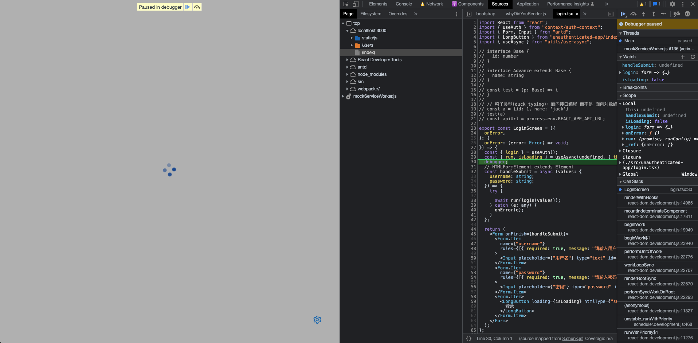
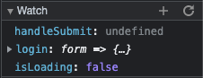
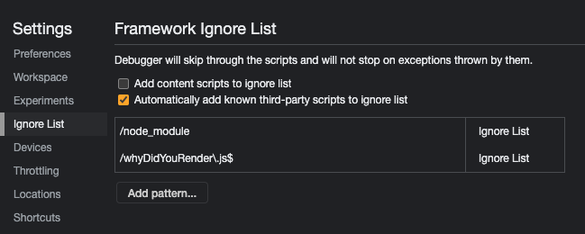
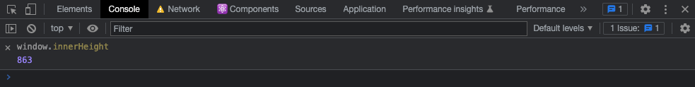
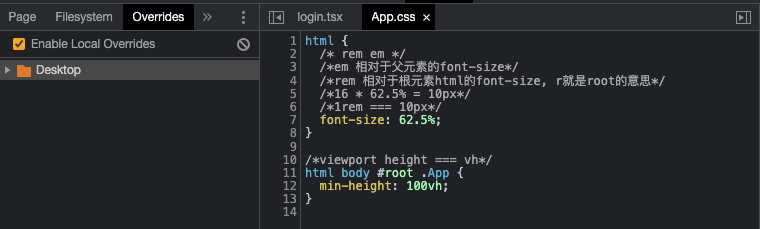
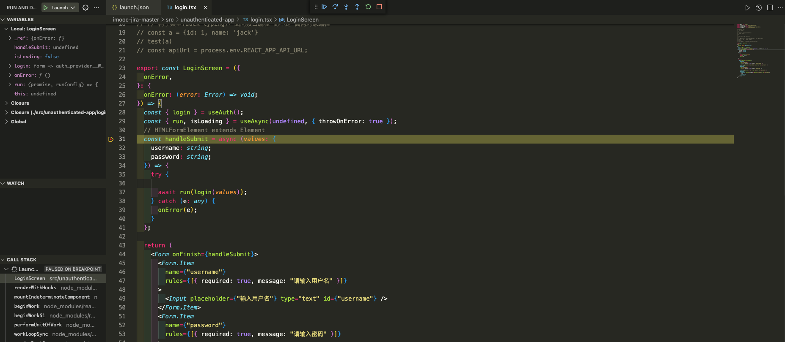

# Web常用调试工具和方法

## console.log

- 结合结构赋值打印对象

```js
const pin1 = 'dkldf';
const pin2 = 'eoire';
console.log({pin1,pin2});//better than console.log(pin1,pin2)
```

- `console.table`打印（对象）数组

```js
const mapPins = [
    {id: 1, name: 'Pdofk',lat: 34.3234324,lng: 22.394893},
    {id: 2, name: 'ewrtt',lat: 11.3234324,lng: 5.394893},
    {id: 3, name: 'lkrtr',lat: 45.3234324,lng: 13.394893}
]
console.table(mapPins)
```

- `console.group`/`console.groupEnd`打印一组log

```js
function pinData(obj){
    console.group('pinData');
    console.log('name',obj.name);
    console.log('lat',obj.lat);
    console.log('lng',obj.name);
    console.groupEnd();
}
pinData({id: 1, name: 'Pdofk',lat: 34.3234324,lng: 22.394893})
```

- `console.trace`打印调用栈

```js
function foo() {
  function bar() {
    console.trace();
  }
  bar();
}

foo();

// bar
// foo
// <anonymous>
```

- `console.dir`拆解DOM对象

```js
const btn = document.getElementById('pin');
console.dir(btn); //looks like an object 
console.log(btn);
```

---

## 浏览器Dev Tools

### 代码中插入debugger语句

```js
xxx
debugger
yyy
```



### 使用watch观察你想观察的参数或其他内容

在watch栏目自行添加想观察的参数



### blackboxing

屏蔽不想进行debug的文件



### live expressions

在console栏点击眼睛按钮对某些变量进行实时监控


### local overrides、fileSystem

可以快速在生产环境进行bug修复实验，无需打开源码。



在fileSystem可以直接打开本地代码文件夹，在dev tools里改写代码可以反映到本地代码中。

---

## Source-Map

测试环境：

```js
devtool: 'cheap-module-eval-source-map';
```

生产环境：

```js
devtool: 'souce-map';
```

---

## 性能监测

### audit、lighthouse、performance

借助Chrome浏览器的性能检测工具对网页进行性能检测

---

## vscode的debug工具

添加launch.json配置文件可以直接开始进行debug


