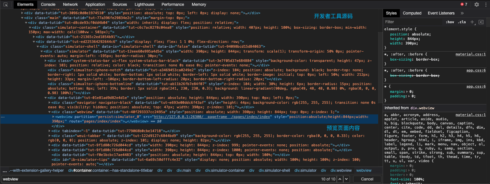
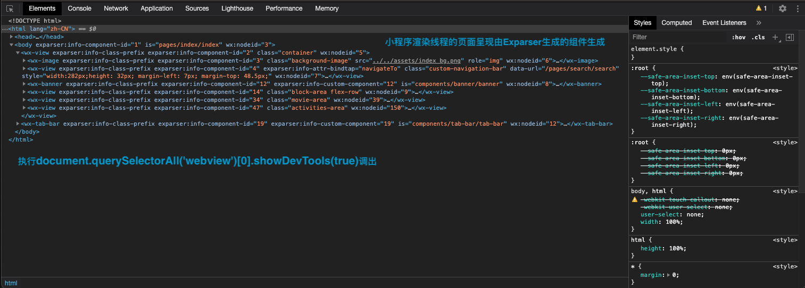
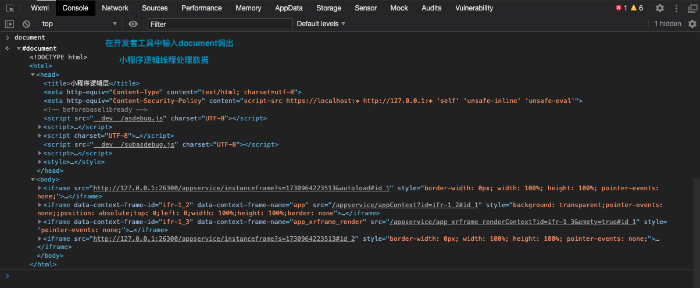

# 微信小程序开发

​小程序的主要开发语言是 `JavaScript` ，所以通常小程序的开发会被用来同普通的网页开发来做对比。两者有很大的相似性，对于前端开发者而言，从网页开发迁移到小程序的开发成本并不高，但是二者还是有些许区别的。

​网页开发渲染线程和脚本线程是互斥的，这也是为什么长时间的脚本运行可能会导致页面失去响应，而在小程序中，二者是分开的，分别运行在不同的线程中。网页开发者可以使用到各种浏览器暴露出来的 `DOM API`，进行 `DOM` 选中和操作。而如上文所述，小程序的逻辑层和渲染层是分开的，逻辑层运行在 `JSCore` 中，并没有一个完整浏览器对象，因而缺少相关的`DOM API`和`BOM API`。这一区别导致了前端开发非常熟悉的一些库，例如 `jQuery`、 `Zepto` 等，在小程序中是无法运行的。同时 `JSCore` 的环境同 `NodeJS` 环境也是不尽相同，所以一些 `NPM` 的包在小程序中也是无法运行的。

​网页开发者需要面对的环境是各式各样的浏览器，PC 端需要面对 IE、Chrome、QQ浏览器等，在移动端需要面对Safari、Chrome以及 iOS、Android 系统中的各式 WebView 。而小程序开发过程中需要面对的是两大操作系统 iOS 和 Android 的微信客户端，以及用于辅助开发的小程序开发者工具，小程序中三大运行环境也是有所区别的。

小程序的UI视图和逻辑处理是用多个`Webview`实现的，逻辑处理的JS代码全部加载到一个`Webview`里面，称之为`AppService`，整个小程序只有一个，并且整个生命周期常驻内存，而所有的视图（wxml和wxss）都是单独的`Webview`来承载，称之为`AppView`。

## 双线程模型

小程序的运行环境分成渲染层和逻辑层， `WXML` 模板和 `WXSS` 样式工作在渲染层，`JS` 脚本工作在逻辑层，小程序的渲染层和逻辑层分离是经过很多考虑得出来的模型。小程序的JS脚本是运行在`JsCore`的线程里，小程序的每个页面各自有一个`WebView`线程进行渲染，所以小程序切换页面时，小程序逻辑层的JS脚本运行上下文依旧在同一个`JsCore`线程中。因为所有页面的脚本逻辑都跑在同一个`JsCore`线程，页面使用`setTimeout`或者`setInterval`的定时器，然后跳转到其他页面时，这些定时器并没有被清除，需要开发者自己在页面离开的时候进行清理。

既然小程序是基于双线程模型，那就意味着任何数据传递都是线程间的通信，也就是都会有一定的延时。这不像传统Web那样，当界面需要更新时，通过调用更新接口UI就会同步地渲染出来。在小程序架构里，这一切都会变成异步。

1. 渲染层和数据相关-`WebView`。
2. 逻辑层负责产生、处理数据-`JsCore`。
3. 逻辑层通过 `Page` 实例的 `setData` 方法传递数据到渲染层。






## 安全与管控

为了解决管控与安全问题，我们必须阻止开发者使用一些浏览器提供的，诸如跳转页面、操作DOM、动态执行脚本的开放性接口。假设我们一个一个禁止，那势必会进入一个攻防战，这是因为 `JavaScript` 的灵活性以及浏览器接口的丰富性，我们很容易遗漏一些危险的接口，而且就算被我们找到所有危险的接口，也许在下一次浏览器内核更新而新增了一个可能会在这套体系下产生漏洞的接口，这样还是无法完全避免。

因此，要彻底解决这个问题，我们必须提供一个沙箱环境来运行开发者的 `JavaScript` 代码。这个沙箱环境不能有任何浏览器相关接口，只提供纯 `JavaScript` 的解释执行环境，那么像HTML5中的`ServiceWorker`、`WebWorker`特性就符合这样的条件，这两者都是启用另一线程来执行 `JavaScript`。但是考虑到小程序是一个多 `WebView` 的架构，每一个小程序页面都是不同的 `WebView` 渲染后显示的，在这个架构下我们不好去用某个`WebView`中的`ServiceWorker`去管理所有的小程序页面。

得益于客户端系统有 `JavaScript` 的解释引擎（在iOS下是用内置的 `JavaScriptCore` 框架，在安卓则是用腾讯x5内核提供的 `JsCore` 环境），我们可以创建一个单独的线程去执行 `JavaScript`，在这个环境下执行的都是有关小程序业务逻辑的代码，也就是我们前面一直提到的逻辑层。而界面渲染相关的任务全都在 `WebView` 线程里执行，通过逻辑层代码去控制渲染哪些界面，那么这一层当然就是所谓的渲染层。这就是小程序双线程模型的由来。

## 组件系统

`Exparser`，基于这个框架，内置了一套组件，以涵盖小程序的基础功能，便于开发者快速搭建出任何界面。同时也提供了自定义组件的能力，开发者可以自行扩展更多的组件，以实现代码复用。`Exparser`是微信小程序的组件组织框架，内置在小程序基础库中，为小程序的各种组件提供基础的支持。小程序内的所有组件，包括内置组件和自定义组件，都由`Exparser`组织管理。

`Exparser`的组件模型与`WebComponents`标准中的`ShadowDOM`高度相似。`Exparser`会维护整个页面的节点树相关信息，包括节点的属性、事件绑定等，相当于一个简化版的`Shadow DOM`实现。`Exparser`的主要特点包括以下几点：

1. 基于`Shadow DOM`模型：模型上与`WebComponents`的`ShadowDOM`高度相似，但不依赖浏览器的原生支持，也没有其他依赖库；实现时，还针对性地增加了其他API以支持小程序组件编程。
2. 可在纯JS环境中运行：这意味着逻辑层也具有一定的组件树组织能力。
3. 高效轻量：性能表现好，在组件实例极多的环境下表现尤其优异，同时代码尺寸也较小。

小程序中，所有节点树相关的操作都依赖于`Exparser`，包括WXML到页面最终节点树的构建、`createSelectorQuery`调用和自定义组件特性等。

在初始化页面时，`Exparser`会创建出页面根组件的一个实例，用到的其他组件也会响应创建组件实例（这是一个递归的过程）。组件创建的过程大致有以下几个要点：

1. 根据组件注册信息，从组件原型上创建出组件节点的JS对象，即组件的`this`；
2. 将组件注册信息中的 `data` 复制一份，作为组件数据，即`this.data`；
3. 将这份数据结合组件`WXML`，据此创建出`Shadow Tree`，由于`Shadow Tree`中可能引用有其他组件，因而这会递归触发其他组件创建过程；
4. 将`ShadowTree`拼接到`Composed Tree`上，并生成一些缓存数据用于优化组件更新性能；
5. 触发组件的`created`生命周期函数；
6. 如果不是页面根组件，需要根据组件节点上的属性定义，来设置组件的属性值；
7. 当组件实例被展示在页面上时，触发组件的 `attached` 生命周期函数，如果`Shadw Tree`中有其他组件，也逐个触发它们的生命周期函数。

不同组件实例间的通信有WXML属性值传递、事件系统、`selectComponent`和`relations`等方式。其中，WXML属性值传递是从父组件向子组件的基本通信方式，而事件系统是从子组件向父组件的基本通信方式。

在内置组件中，有一些组件较为特殊，它们并不完全在`Exparser`的渲染体系下，而是由客户端原生参与组件的渲染，这类组件我们称为“原生组件”,这也是小程序Hybrid技术的一个应用。原生组件在`WebView`这一层的渲染任务是很简单，只需要渲染一个占位元素，之后客户端在这块占位元素之上叠了一层原生界面。因此，原生组件的层级会比所有在`WebView`层渲染的普通组件要高。开发者最为常见的问题是，原生组件会浮于页面其他组件之上（相当于拥有正无穷大的z-index值）使其它组件不能覆盖在原生组件上展示。想要解决这个问题，可以考虑使用`cover-view`和`cover-image`组件。这两个组件也是原生组件，同样是脱离`WebView`的渲染流程外，而原生组件之间的层级就可以按照一定的规则控制。

## skyline

在 `Skyline` 环境下，我们尝试改变这一情况：`Skyline` 创建了一条渲染线程来负责 `Layout`, `Composite` 和 `Paint` 等渲染任务，并在 `AppService` 中划出一个**独立的上下文**，来运行之前 `WebView` 承担的 `JS` 逻辑、`DOM` 树创建等逻辑。这种新的架构相比原有的 `WebView` 架构，有以下特点：

- 界面更不容易被逻辑阻塞，进一步减少卡顿
- 无需为每个页面新建一个 JS 引擎实例（`WebView`），减少了内存、时间开销
- 框架可以在页面之间共享更多的资源，进一步减少运行时内存、时间开销
- 框架的代码之间无需再通过 `JSBridge` 进行数据交换，减少了大量通信时间开销

## Shadow DOM

`Shadow DOM` 和普通 `DOM` 的区别：

1. `DOM` 隔离：

- `Shadow DOM` 将组件内部的 `DOM` 树封装在 `Shadow Root` 中，使其与主 `DOM` 相互隔离，防止样式和 `JavaScript` 事件的意外影响。
- 普通 `DOM`（或主 `DOM`）则没有这种隔离机制，元素间可能会互相干扰。

2. 样式隔离：

- `Shadow DOM` 中的样式仅在组件内部生效，不会影响页面其他部分的样式。
- 普通 `DOM` 的样式是全局性的，所有子元素都会继承和影响样式，容易引发样式冲突。

3. 访问方式：

- `Shadow DOM` 有两种模式：`open` 和 `closed`。在 `open` 模式下，可以通过 `element.shadowRoot` 访问 `Shadow DOM`，而 `closed` 模式则不允许外部直接访问。
- 普通 `DOM` 的所有节点都可以直接访问，并且操作方式不受限制。

4. 插槽机制：

- `Shadow DOM` 支持插槽（`slot`），允许将外部内容插入到组件内部的指定位置。
- 普通 `DOM` 则没有插槽的概念，通常通过模板编写或 `JavaScript` 插入内容。

```html
<!DOCTYPE html>
<html lang="en">
<head>
  <meta charset="UTF-8">
  <title>Shadow DOM Example</title>
</head>
<body>
  <my-element>
    <p>这是主 DOM 的内容，将会被插入组件内</p>
  </my-element>

  <script>
    class MyElement extends HTMLElement {
      constructor() {
        super();
        
        // 创建开放的 Shadow Root
        const shadow = this.attachShadow({ mode: 'open' });
        
        // 定义组件的 HTML 和样式
        const wrapper = document.createElement('div');
        wrapper.innerHTML = `
          <style>
            p { color: red; } /* 仅影响 Shadow DOM 内部 */
          </style>
          <p>Shadow DOM 内部的内容</p>
          <slot></slot> <!-- 插槽：用于插入外部内容 -->
        `;
        
        // 将内容附加到 Shadow Root
        shadow.appendChild(wrapper);
      }
    }

    // 注册自定义元素
    customElements.define('my-element', MyElement);
  </script>
</body>
</html>
```

## 参考资料

[小程序开发指南](https://developers.weixin.qq.com/ebook?action=get_post_info&docid=0002c8979d0678bb00862b8595b00a)

[小程序同层渲染原理剖析](https://developers.weixin.qq.com/community/develop/article/doc/000c4e433707c072c1793e56f5c813)

[从微信小程序开发者工具源码看实现原理（一）- - 小程序架构设计](https://www.cnblogs.com/wonyun/p/11168698.html)

[Using shadow DOM](https://developer.mozilla.org/en-US/docs/Web/API/Web_components/Using_shadow_DOM)

[探索小程序底层架构原理](https://segmentfault.com/a/1190000043211224)

[万字长文讲透微信小程序的底层架构](https://xie.infoq.cn/article/49f4fcfb6b1c71c199fb5e2c7)
