# Debugging in DevTools

## Network

这里可以看到资源加载详情，初步评估影响页面性能的因素。

### waterfall

- `Queueing`: 浏览器将资源放入队列时间
- `Stalled`: 因放入队列时间而发生的停滞时间
- `DNS Lookup`: DNS 解析时间
- `Initial connection`: 建立 HTTP 连接的时间
- `SSL`: 浏览器与服务器建立安全性连接的时间
- `TTFB`: 等待服务端返回数据的时间
- `Content Download`: 浏览器下载资源的时间

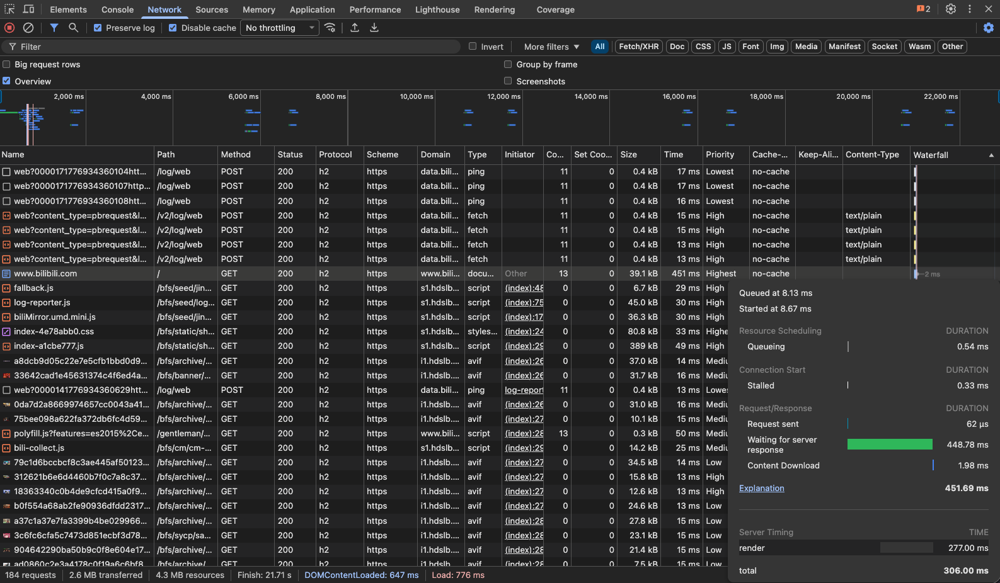
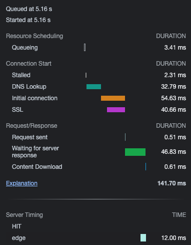

### Headers

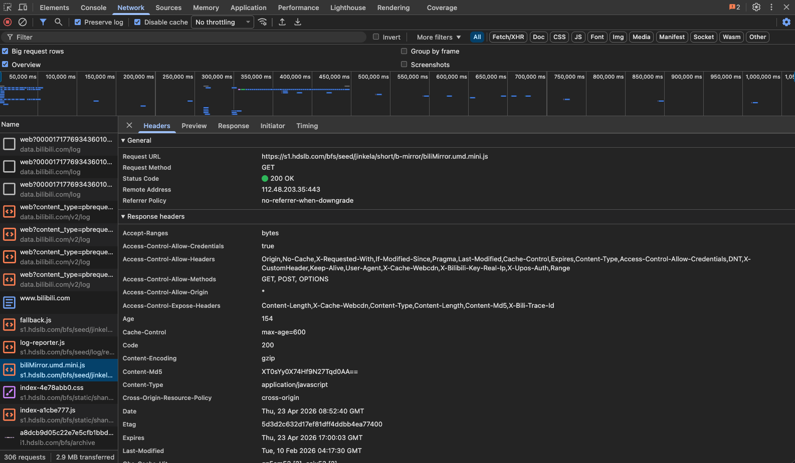

### Initiator

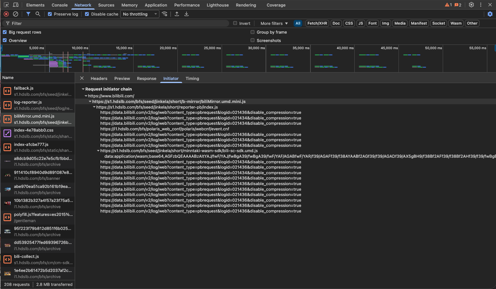

### load events

### Filter

You can use multiple properties simultaneously by separating each property with a space. For example, mime-type:image/gif larger-than:1K displays all GIFs that are larger than one kilobyte. These multi-property filters are equivalent to AND operations. OR operations aren't supported.

Next is a complete list of supported properties.

- `cookie-domain`. Show the resources that set a specific cookie domain.
- `cookie-name`. Show the resources that set a specific cookie name.
- `cookie-path`. Show the resources that set a specific cookie path.
- `cookie-value`. Show the resources that set a specific cookie value.
- `domain`. Only display resources from the specified domain. You can use a wildcard character (_) to include multiple domains. For example, _.com displays resources from all domain names ending in .com. DevTools shows a populates the autocomplete drop-down menu with all of the domains it has encountered.
- `has-overrides`. Show requests that have overridden content, headers, any overrides (yes), or no overrides (no). You can add the corresponding Has overrides column to the request table.
- `has-response-header`. Show the resources that contain the specified HTTP response header. DevTools populates the autocomplete drop-down with all of the response headers that it has encountered.
  is. Use is:running to find WebSocket resources.
- `larger-than`. Show resources that are larger than the specified size, in bytes. Setting a value of 1000 is equivalent to setting a value of 1k.
  method. Show resources that were retrieved over a specified HTTP method type. DevTools populates the autocomplete drop-down with all of the HTTP methods it has encountered.
- `mime-type`. Show resources of a specified MIME type. DevTools populates the autocomplete drop-down with all MIME types it has encountered.
  mixed-content. Show all mixed content resources (mixed-content:all) or just the ones that are displayed (mixed-content:displayed).
- `priority`. Show resources whose priority level matches the specified value.
- `resource-type`. Show resources of a resource type, for example, image. DevTools populates the autocomplete drop-down with all resource types it has encountered.
- `response-header-set-cookie`. Show raw Set-Cookie headers in the Issues tab. Malformed cookies with incorrect Set-Cookie headers will be flagged in the Network panel.
- `scheme`. Show resources retrieved over unprotected HTTP (scheme:http) or protected HTTPS (scheme:https).
- `set-cookie-domain`. Show the resources that have a Set-Cookie header with a Domain attribute that matches the specified value. DevTools populates the autocomplete with all of the cookie domains that it has encountered.
- `set-cookie-name`. Show the resources that have a Set-Cookie header with a name that matches the specified value. DevTools populates the autocomplete with all of the cookie names that it has encountered.
- `set-cookie-value`. Show the resources that have a Set-Cookie header with a value that matches the specified value. DevTools populates the autocomplete with all of the cookie values that it has encountered.
- `status-code`. Only show resources whose HTTP status code match the specified code. DevTools populates the autocomplete drop-down menu with all of the status codes it has encountered.
- `url`. Show the resources that have a url matching the specified value.

## Performance

Main（主线程） 轨道的一项重要可视化功能——关联箭头：

- 样式或布局失效 -> 重新计算样式 或 布局
- 请求动画帧 (Request Animation Frame) -> 动画帧已触发
- 请求空闲回调 (Request Idle Callback) -> 执行空闲回调
- 设置定时器 (Install Timer) -> 定时器触发
- 创建 WebSocket -> 发送/接收 WebSocket 握手 或 销毁 WebSocket
- 调度 postTask -> 执行 postTask 或 中止 postTask

### Timeline事件参考

时间线事件模式会显示录制过程中触发的所有事件。使用本时间线事件参考，可以深入了解每种时间线事件类型的含义。

| 属性                               | 显示时机                                                                          |
| ---------------------------------- | --------------------------------------------------------------------------------- |
| 聚合时间（`Aggregated time`）      | 对于含有嵌套事件的事件，显示每类事件所耗费的时间。                                |
| 调用栈（`Call Stack`）             | 对于含有子事件的事件，显示每类事件所耗费的时间。                                  |
| CPU 时间（`CPU time`）             | 录制的事件占用的 CPU 时间。                                                       |
| 详情（`Details`）                  | 事件的其他详细信息。                                                              |
| 持续时间（`Duration`）（及时间戳） | 该事件（含所有子事件）完成所需的时长；时间戳表示事件相对于录制开始的发生时间。    |
| 自身执行时间（`Self time`）        | 该事件本身（不含任何子事件）所耗费的时间。                                        |
| 已用堆大小（`Used Heap Size`）     | 录制事件时应用程序正在使用的内存量，以及与上次采样相比已用堆大小的变化量（+/-）。 |

#### Load事件

本节列出属于"加载"类别的事件及其属性。

| 事件                           | 描述                                                     |
| ------------------------------ | -------------------------------------------------------- |
| 解析 HTML（`Parse HTML`）      | Chrome 执行了 HTML 解析算法。                            |
| 完成加载（`Finish Loading`）   | 一个网络请求已完成。                                     |
| 接收数据（`Receive Data`）     | 收到了某个请求的数据。可能存在一个或多个"接收数据"事件。 |
| 接收响应（`Receive Response`） | 收到了某个请求的初始 HTTP 响应。                         |
| 发送请求（`Send Request`）     | 一个网络请求已被发送。                                   |

##### 加载事件属性

| 属性                                  | 描述                                     |
| ------------------------------------- | ---------------------------------------- |
| 资源（`Resource`）                    | 请求的资源 URL。                         |
| 预览（`Preview`）                     | 请求资源的预览（仅限图片）。             |
| 请求方法（`Request Method`）          | 请求使用的 HTTP 方法（如 GET 或 POST）。 |
| 状态码（`Status Code`）               | HTTP 响应状态码。                        |
| MIME 类型（`MIME Type`）              | 请求资源的 MIME 类型。                   |
| 编码数据长度（`Encoded Data Length`） | 请求资源的字节长度。                     |

#### Script事件

本节列出属于"脚本"类别的事件及其属性。

| 事件                                         | 描述                                                                                    |
| -------------------------------------------- | --------------------------------------------------------------------------------------- |
| 动画帧触发（`Animation Frame Fired`）        | 一个已调度的动画帧被触发，其回调处理函数被调用。                                        |
| 取消动画帧（`Cancel Animation Frame`）       | 一个已调度的动画帧被取消。                                                              |
| GC 事件（`GC Event`）                        | 发生了垃圾回收。                                                                        |
| `DOMContentLoaded`                           | 浏览器触发了 DOMContentLoaded 事件。当页面所有 DOM 内容均已加载并解析完毕时触发该事件。 |
| 执行脚本（`Evaluate Script`）                | 一段脚本被求值执行。                                                                    |
| 事件（`Event`）                              | 一个 JavaScript 事件（如 "mousedown" 或 "key"）。                                       |
| 函数调用（`Function Call`）                  | 发生了一次顶层 JavaScript 函数调用（仅在浏览器进入 JavaScript 引擎时出现）。            |
| 安装定时器（`Install Timer`）                | 使用 `setInterval()` 或 `setTimeout()` 创建了一个定时器。                               |
| 请求动画帧（`Request Animation Frame`）      | 一次 `requestAnimationFrame()` 调用调度了一个新帧。                                     |
| 移除定时器（`Remove Timer`）                 | 一个之前创建的定时器被清除。                                                            |
| 计时（`Time`）                               | 脚本调用了 `console.time()`                                                             |
| 计时结束（`Time End`）                       | 脚本调用了 `console.timeEnd()`                                                          |
| 定时器触发（`Timer Fired`）                  | 由 `setInterval()` 或 `setTimeout()` 调度的定时器被触发。                               |
| XHR 就绪状态变更（`XHR Ready State Change`） | XMLHTTPRequest 的就绪状态发生了变化。                                                   |
| XHR 加载（`XHR Load`）                       | 一个 `XMLHTTPRequest` 加载完成。                                                        |

##### 脚本事件属性

| 属性                        | 描述                               |
| --------------------------- | ---------------------------------- |
| 定时器 ID（`Timer ID`）     | 定时器的 ID。                      |
| 超时时间（`Timeout`）       | 定时器指定的超时时长。             |
| 是否重复（`Repeats`）       | 布尔值，指定该定时器是否重复执行。 |
| 函数调用（`Function Call`） | 被调用的函数。                     |

#### Render事件

本节列出属于"渲染"类别的事件及其属性。

| 事件                                | 描述                          |
| ----------------------------------- | ----------------------------- |
| 布局失效（`Invalidate layout`）     | 由于 DOM 变化，页面布局失效。 |
| 布局（`Layout`）                    | 执行了一次页面布局计算。      |
| 重新计算样式（`Recalculate style`） | Chrome 重新计算了元素样式。   |
| 滚动（`Scroll`）                    | 嵌套视图的内容发生了滚动。    |

##### 渲染事件属性

| 属性                                       | 描述                                                                                                                                           |
| ------------------------------------------ | ---------------------------------------------------------------------------------------------------------------------------------------------- |
| 布局失效原因（`Layout invalidated`）       | 对于布局记录，显示导致布局失效的代码调用栈。                                                                                                   |
| 需要布局的节点（`Nodes that need layout`） | 对于布局记录，显示在重新布局开始前被标记为需要布局的节点数量。通常包括被开发者代码使布局失效的节点，以及向上直至重新布局根节点的路径上的节点。 |
| 布局树大小（`Layout tree size`）           | 对于布局记录，显示重新布局根节点（Chrome 开始重新布局的节点）下的节点总数。                                                                    |
| 布局范围（`Layout scope`）                 | 可能的值为"局部"（Partial，重新布局边界为 DOM 的一部分）或"整个文档"（Whole document）。                                                       |
| 受影响的元素（`Elements affected`）        | 对于重新计算样式记录，显示受样式重新计算影响的元素数量。                                                                                       |
| 样式失效原因（`Styles invalidated`）       | 对于重新计算样式记录，提供导致样式失效的代码调用栈。                                                                                           |

#### Paint事件

本节列出属于"绘制"类别的事件及其属性。

| 事件                           | 描述                                                                                     |
| ------------------------------ | ---------------------------------------------------------------------------------------- |
| 合成图层（`Composite Layers`） | Chrome 的渲染引擎对图像图层进行了合成。                                                  |
| 图片解码（`Image Decode`）     | 一个图片资源被解码。                                                                     |
| 图片缩放（`Image Resize`）     | 一张图片从其原始尺寸被调整大小。                                                         |
| 绘制（`Paint`）                | 合成图层被绘制到显示区域的某个区域。将鼠标悬停在绘制记录上，会高亮显示被更新的显示区域。 |

##### 绘制事件属性

| 属性                 | 描述                                       |
| -------------------- | ------------------------------------------ |
| 位置（`Location`）   | 对于绘制事件，显示绘制矩形的 x 和 y 坐标。 |
| 尺寸（`Dimensions`） | 对于绘制事件，显示绘制区域的高度和宽度。   |

### 整体指标模块

### 火焰图总览

### 函数入口添加注释

### INP 分析

### LCP 分析

### Render blocking requests 分析

### 关键帧 分析

## Sources

### Javascript调试

### snippers

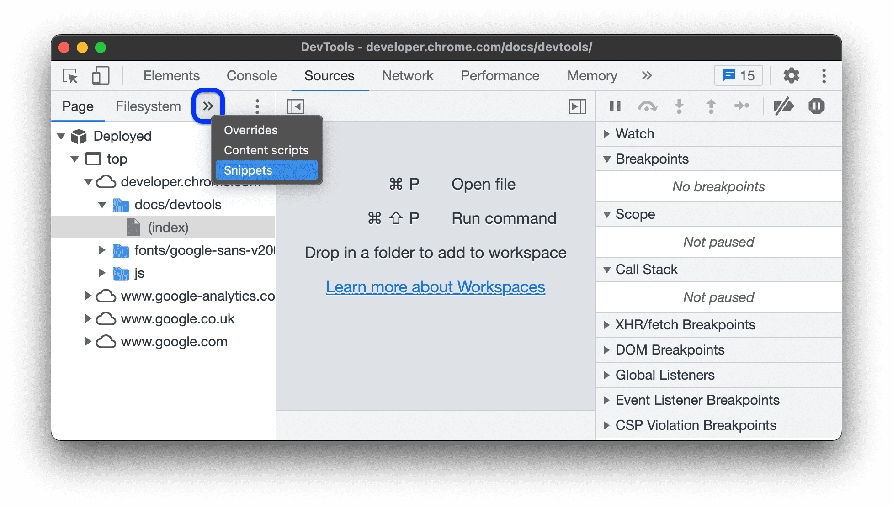
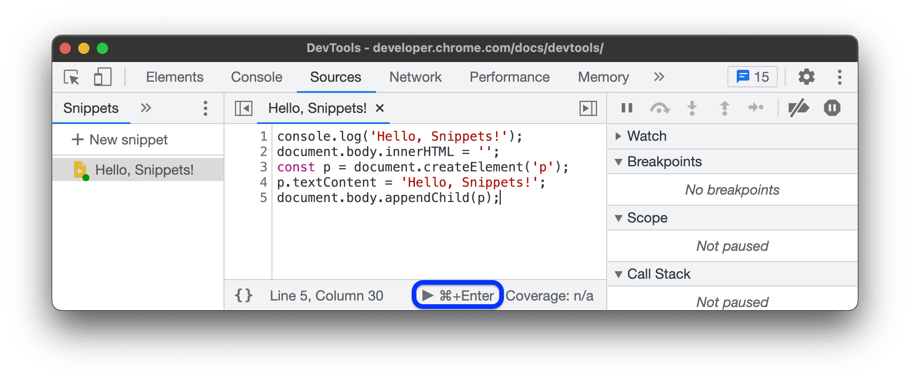

### sourcemaps

浏览器虽然执行的是压缩后的 `.js` 文件，但 `Sources` 面板可以通过 `Source Maps` 展示你编写的原始 `.ts` 或 `.jsx` 文件。所有的断点、报错堆栈（`Call Stack`）以及 `Console` 日志都会自动对应到源代码中的行号，而非压缩后的行号。编译器（如 `Webpack`, `Vite`）在处理代码时会生成一个 `.map` 文件。

要在 `Sources`（源代码） 面板中使用 `Source Maps`：

1. 仅使用能生成 `Source Maps` 的预处理器（构建工具）。
2. 确认你的 Web 服务器能够托管并提供 `Source Maps` 文件（即 `.map` 文件）。

使用支持的预处理器，常与 `Source Maps` 配合使用的预处理器包括（但不限于）：

- 转译器: `Babel`
- 编译器: `TypeScript` 和 `Dart`
- 压缩器: `terser`
- 打包器与开发服务器 (`Bundlers` & `Dev Servers`): `Webpack`, `Vite`, `esbuild`

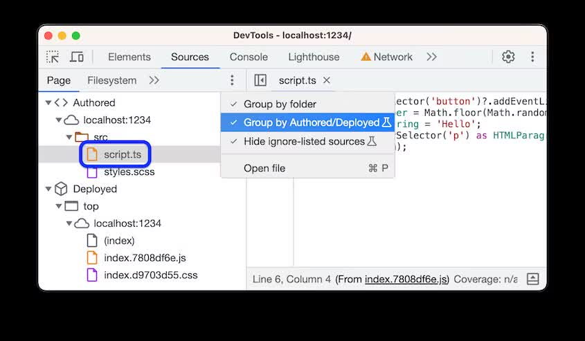
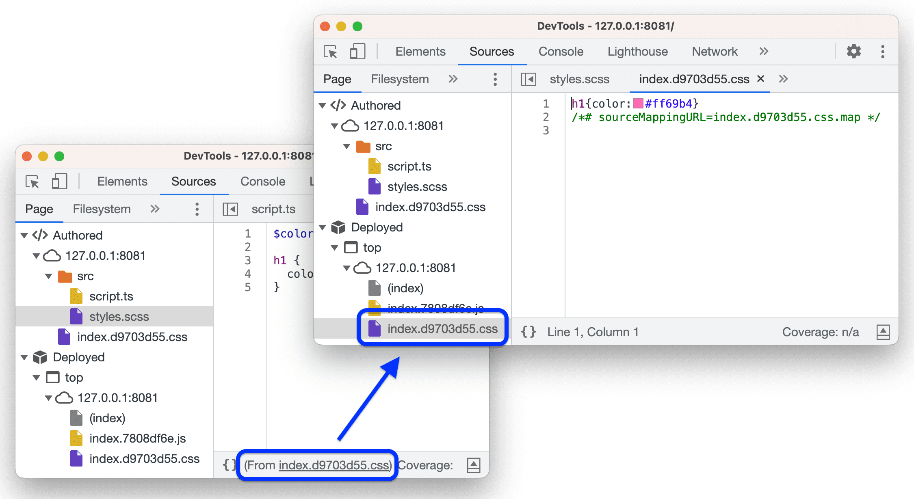

### workspaces

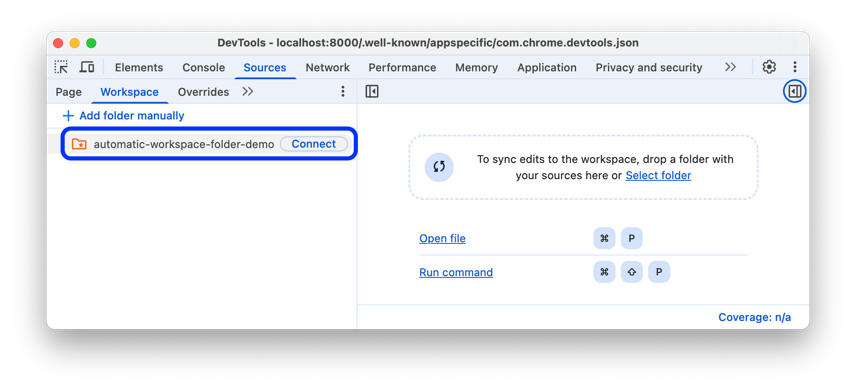
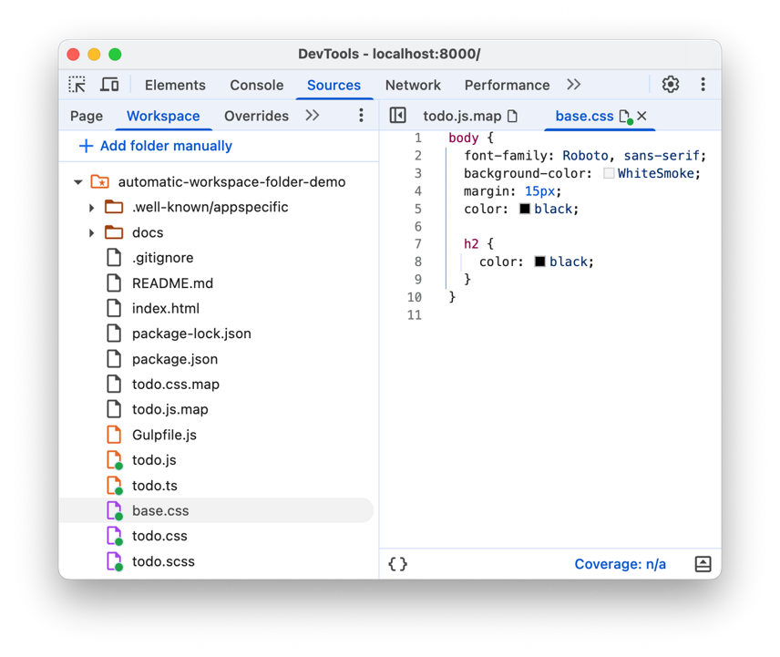

## Memory

1. 堆内存 (JavaScript Heap)

堆内存是 V8 引擎（JavaScript 的“大脑”）专门划出来的一块地盘。

- 谁在管： 垃圾回收器（Garbage Collector, GC）全权负责。
- 存什么： 存放你写的 JavaScript 代码里产生的所有东西，比如：
  - 你定义的 const obj = {}
  - 你创建的闭包函数。
  - 各种变量、数字和布尔值。
- 特点： 它是“自动化”的。如果一个对象在内存图中没有“根节点”能连到它，GC 就会把它自动清理掉。

2. 渲染器内存 (Renderer Memory)

渲染器内存是一个更广义的概念，它是指整个浏览器渲染进程（Render Process）所占用的所有内存。

- 包含关系： 渲染器内存 = JS 堆内存 + 原生内存 (Native Memory)。
- 存什么： 存放 JS 堆之外的所有东西，主要包括：
  - DOM 树和 CSSOM 树： 网页的 HTML 结构和样式（这些是用 C++ 写的原生对象）。
  - 解码后的图片数据。
  - 浏览器内核代码（如 Blink/WebKit）。
  - 外部存储： 比如很大的一段 JS 脚本源码，它可能先存在原生内存里，在 JS 堆里只放一个“小标签”（Wrapper）去指向它。

当你运行 `const div = document.createElement('div')` 时：

1. 在原生内存里： 浏览器创建了一个真实的 C++ DOM 对象。
2. 在 JS 堆内存里： 浏览器创建了一个很小的 Wrapper（包装器）。
3. 连接： JS 里的 div 变量指向这个包装器，包装器再跨界指向 C++ 里的真实对象。

### 浅层占用 (Shallow size)

这是**对象自身**所占用的内存大小。

JavaScript 对象通常会预留一部分内存用于自身的描述以及存储直接值（Immediate values）。通常情况下，只有数组和字符串会有明显的浅层占用。然而，字符串和外部数组的主存储空间通常位于渲染器内存（Renderer memory）中，在 JavaScript 堆上仅表现为一个很小的包装器对象（Wrapper object）。

渲染器内存是指被检查页面所在的渲染进程中的所有内存：原生内存 + 页面的 JS 堆内存 + 该页面启动的所有 Dedicated Worker 的 JS 堆内存。尽管如此，即使是一个很小的对象，也可能通过阻止垃圾回收过程（GC）自动释放其他对象，从而间接地持有大量内存。

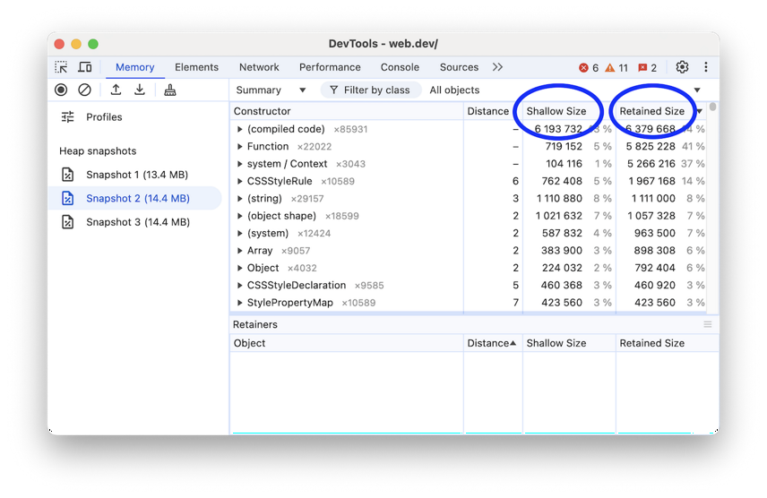

### 留存占用 (Retained size)

这是指一旦该对象被删除，连同那些因其删除而变得无法从 GC 根节点（GC roots） 到达的依赖对象，所能释放的内存总大小。

GC 根节点由“句柄（Handles）”组成。当从原生代码向 V8 引擎外部的 JavaScript 对象创建引用时，就会产生这些句柄（包括本地或全局句柄）。在堆快照（Heap snapshot）中，可以从 `GC roots > Handle scope` 和 `GC roots > Global handles` 目录下找到这些句柄。在不深入探讨浏览器实现细节的情况下，在此文档中解释句柄可能会令人费解。实际上，你不需要担心 GC 根节点和句柄的问题。

系统内部有很多 GC 根节点，从应用角度来看，主要有以下几种根节点：

- Window 全局对象（存在于每个 iframe 中）。堆快照中有一个“距离（Distance）”字段，表示从 window 对象出发，经过最短保留路径到达该对象的属性引用数量。
- 文档 DOM 树。由通过遍历文档可到达的所有原生 DOM 节点组成。并非所有节点都有 JS 包装器，但如果有，只要文档存在，这些包装器就会保持存活。
- 有时对象可能会被调试器上下文和 DevTools 控制台留存（例如在控制台执行求值操作后）。因此，请在清空控制台且没有激活断点的情况下创建堆快照。
- 内存图（Memory graph）始于一个根节点，它可能是浏览器的 window 对象，也可能是 Node.js 模块的 Global 对象。你无法控制这个根对象如何被垃圾回收。

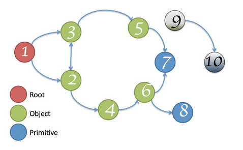

### Objects retaining tree

堆（`Heap`）是一个由互连对象构成的网络。在数学领域，这种结构被称为“图”（Graph）或“内存图”。图由通过“边”（Edges）相连的“节点”（Nodes）组成，两者都带有标签。

- 节点（对象）：使用构建它们的构造函数（Constructor）名称进行标记。
- 边：使用属性（Properties）的名称进行标记。

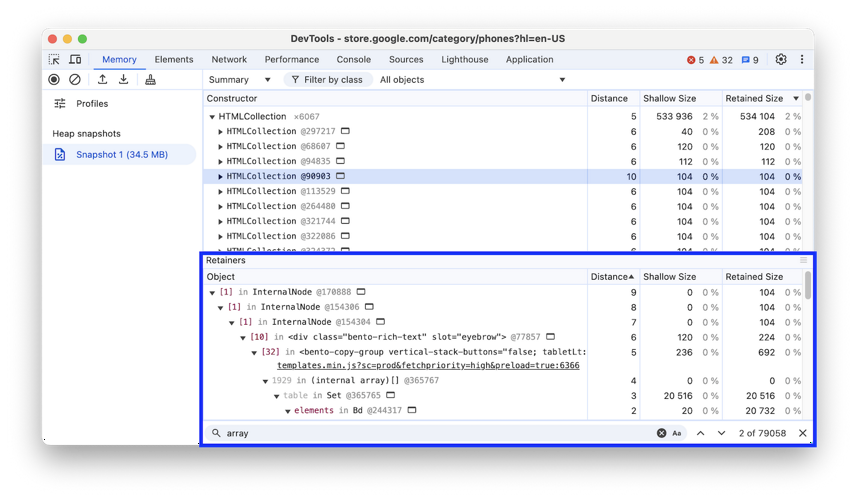

### 用Performance监测内存溢出

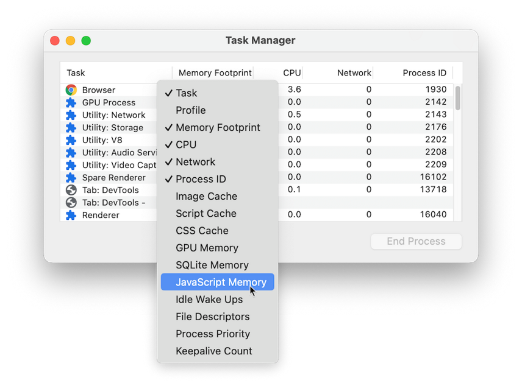
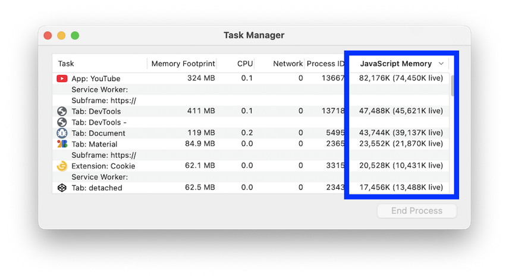
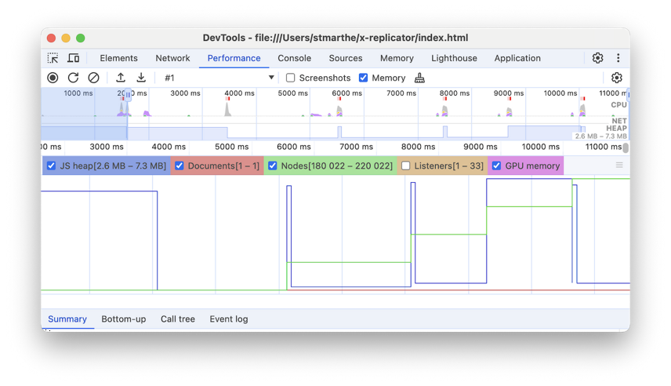

### 使用堆快照（Heap Snapshots）监测 DOM 内存泄漏

只有当页面 `DOM` 树和 `JavaScript` 代码中都不再存在对某个 `DOM` 节点的引用时，该节点才能被垃圾回收。当一个节点已从 `DOM` 树中移除，但仍有某些 `JavaScript` 代码引用它时，该节点被称为“脱离文档（`Detached`）”状态。脱离文档的 `DOM` 节点是导致内存泄漏的常见原因。使用 `DevTools` 的堆分析器（`Heap Profilers`）可以识别这些脱离文档的节点。

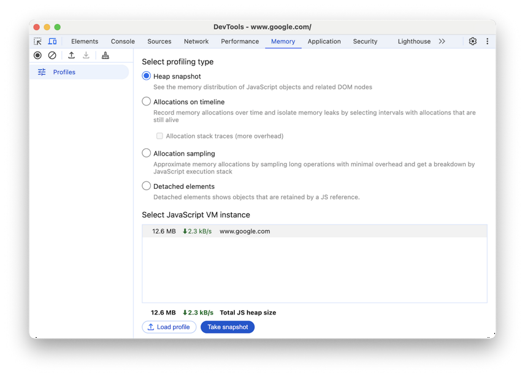
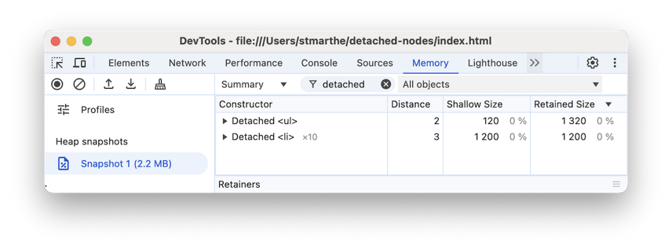
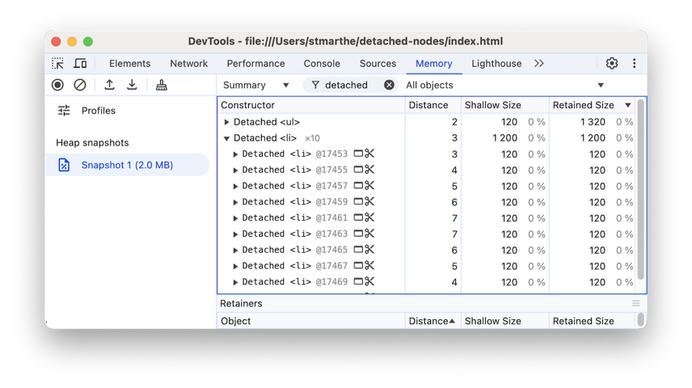
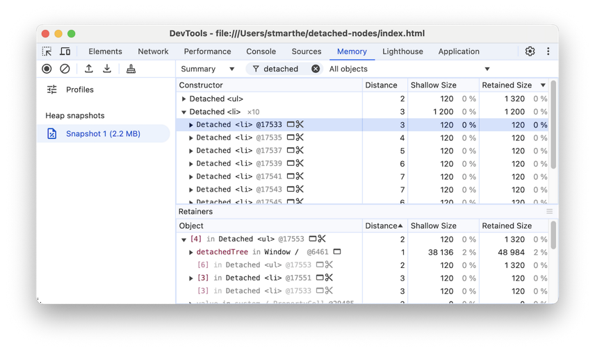

### 使用分配时间轴（Allocation Timelines）监测堆内存泄漏

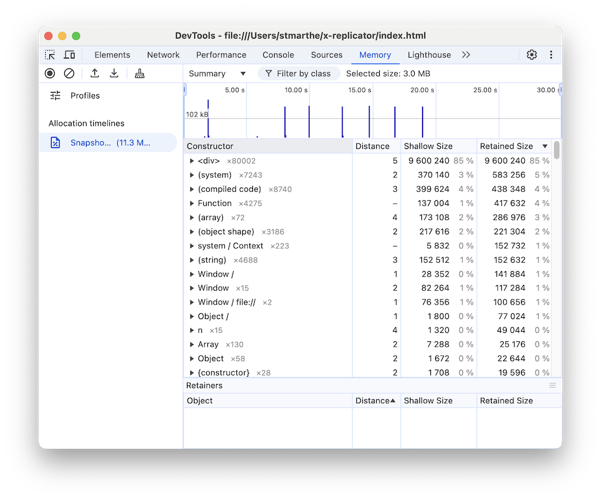
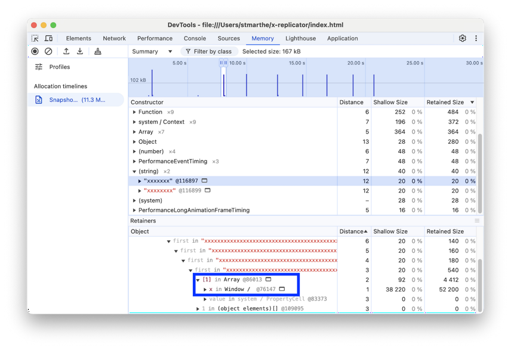

### 按函数监测内存分配情况

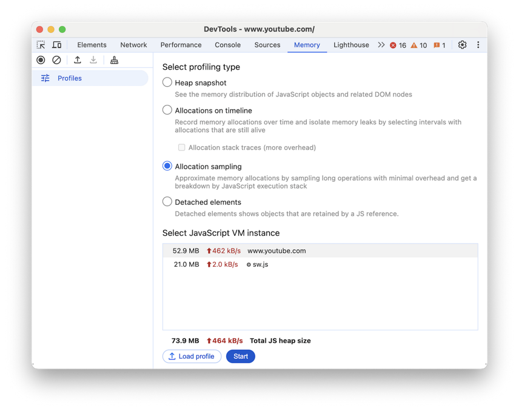
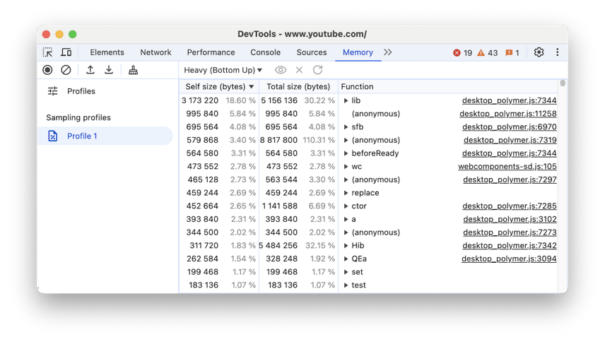

### 监测JavaScript引用所留存的对象

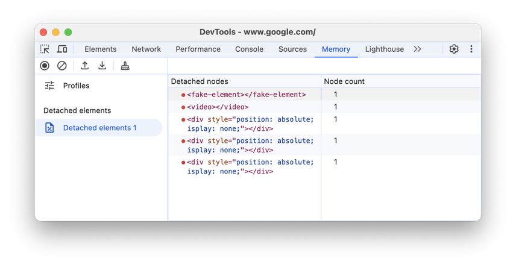

## Lighthouse

分析网页性能的几个主要指标并给出建议。

- `First Contentful Paint`: 首屏渲染时间，1s 以内绿色
- `Speed Index`: 速度指数，4s 以内绿色
- `Time to Interactive`: 到页面可交互的时间

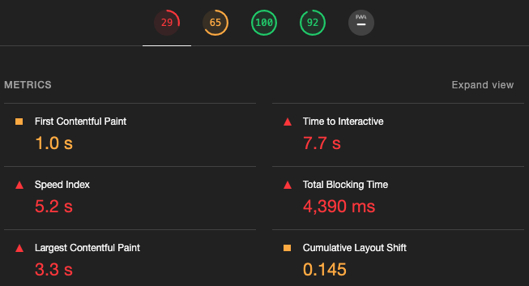

## `Webpack` 的 `webpack-bundle-analyzer` 插件

对于打包后各项资源大小的分析。

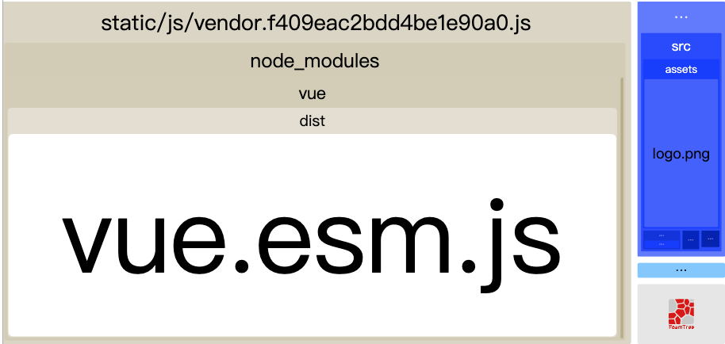

## 参考资料

[Network panel: Analyze network load and resources](https://developer.chrome.com/docs/devtools/network/overview)

[Performance panel: Analyze your website's performance](https://developer.chrome.com/docs/devtools/performance/overview)

[Sources panel overview](https://developer.chrome.com/docs/devtools/sources)

[Memory panel overview](https://developer.chrome.com/docs/devtools/memory)

[Lighthouse: Optimize your website](https://developer.chrome.com/docs/devtools/lighthouse)

[Comprehensive guide to JavaScript performance analysis using Chrome DevTools](https://blog.jiayihu.net/comprenhensive-guide-chrome-performance/)

[Web Performance Guide](https://www.speedcurve.com/web-performance-guide/)

[21+ Browser Dev Tools & Tips You Need To Know](https://www.youtube.com/watch?v=TcTSqhpm80Y)

[Guide to Chrome's performance profiler](https://www.youtube.com/watch?v=KWM5wxlDuis)

[Essential JavaScript debugging tools for the modern detective by Rebecca Hill | JSConf Budapest 2019](https://www.youtube.com/watch?v=TtsvMRxmfGA)

[Performance debugging in DevTools](https://www.youtube.com/watch?v=BHqxD9qr6Gw)
