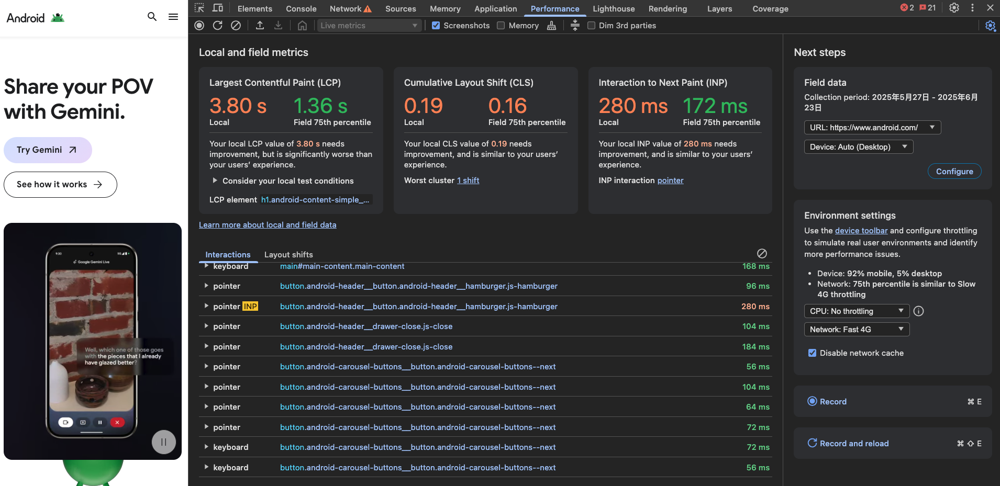
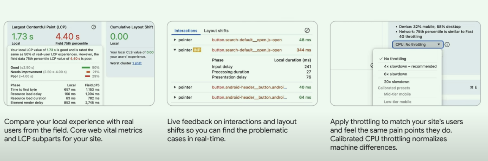
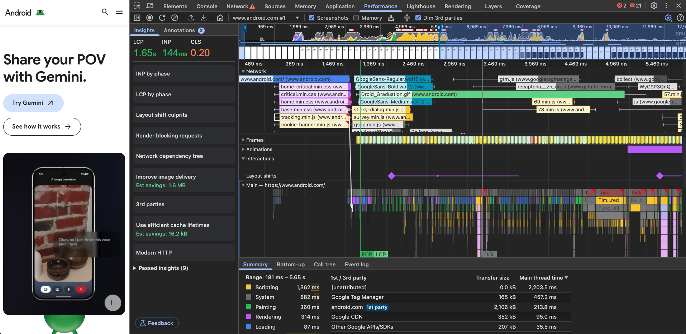
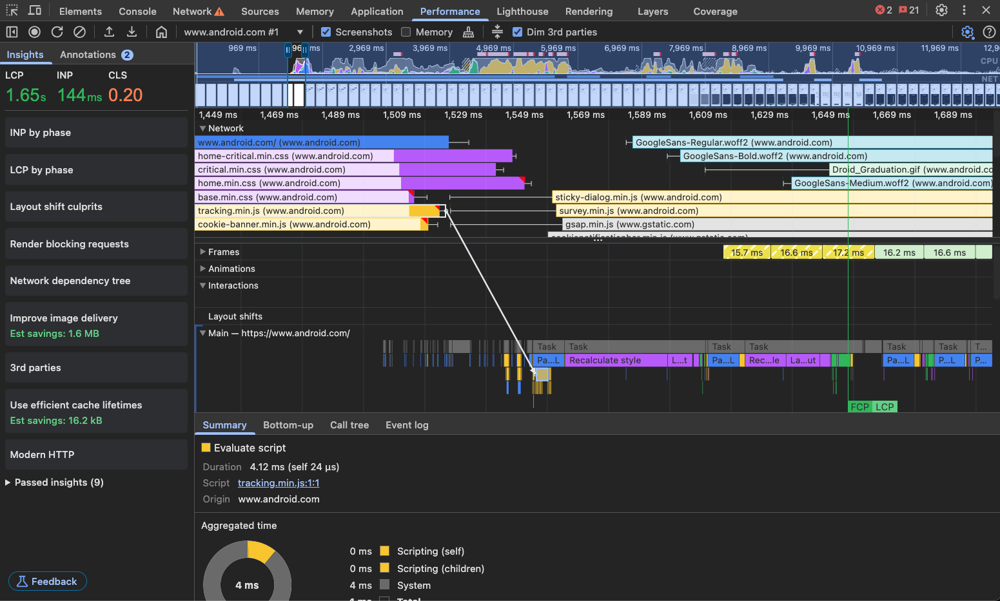
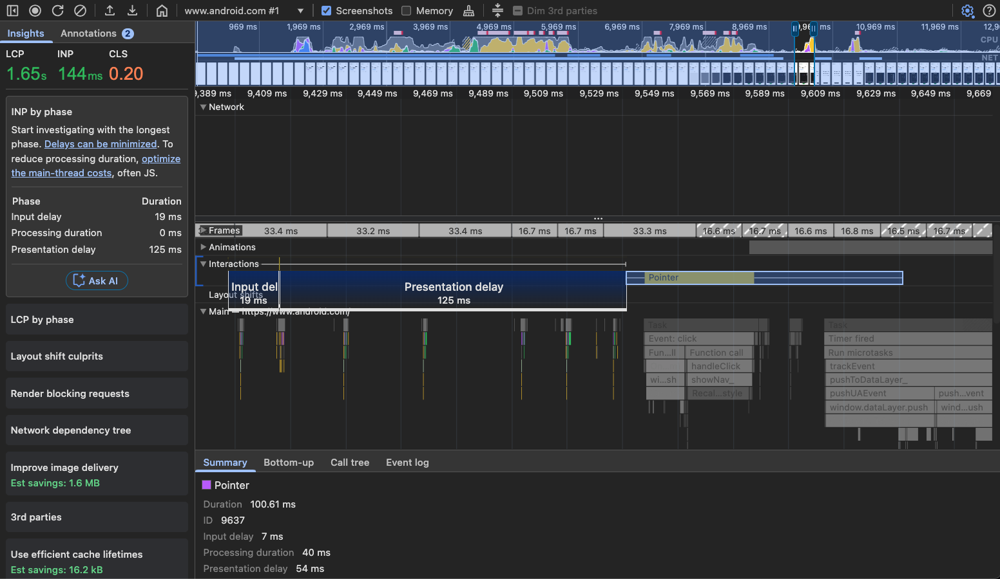
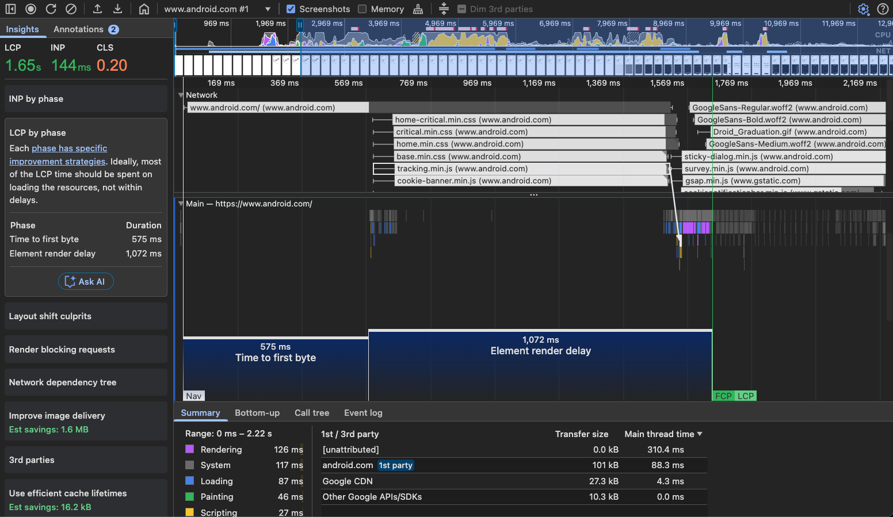
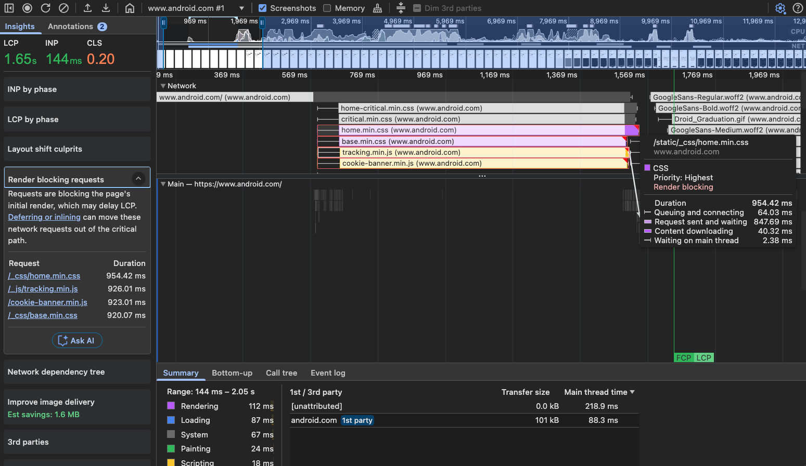
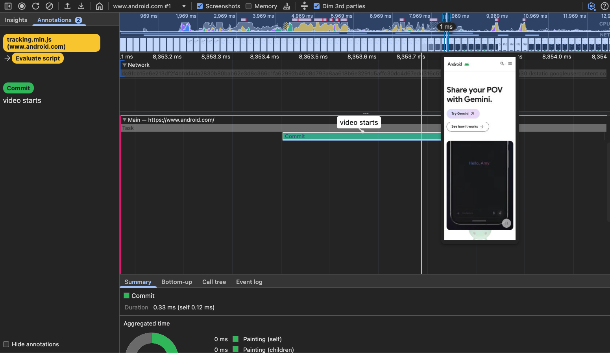

# Debugging in DevTools

## Network

## Performance

### 整体指标模块

### 火焰图模块

#### 火焰图总览

#### 函数入口添加注释

#### INP 分析

#### LCP 分析

#### Render blocking requests 分析

#### 关键帧 分析

## 参考资料

[Performance debugging in DevTools](https://www.youtube.com/watch?v=BHqxD9qr6Gw)
