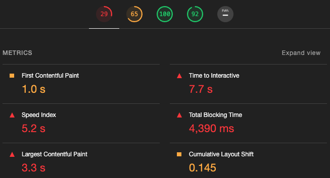
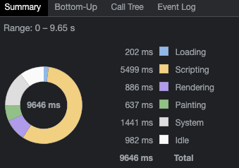

## 项目优化经验

### 性能监测
1. 浏览器的 `Network` 选项

这里可以看到资源加载详情，初步评估影响页面性能的因素。查看瀑布流里的一些常见指标：
   - `Queueing`: 浏览器将资源放入队列时间
   - `Stalled`: 因放入队列时间而发生的停滞时间
   - `DNS Lookup`: DNS解析时间
   - `Initial connection`:  建立HTTP连接的时间
   - `SSL`: 浏览器与服务器建立安全性连接的时间
   - `TTFB`: 等待服务端返回数据的时间
   - `Content Download`:  浏览器下载资源的时间

2. 浏览器的 `Lighthouse` 选项

分析网页性能的几个主要指标并给出建议。
   - `First Contentful Paint`: 首屏渲染时间，1s以内绿色
   - `Speed Index`: 速度指数，4s以内绿色
   - `Time to Interactive`: 到页面可交换的时间

3. 浏览器的 `Performance` 选项

分析网页性能整个流程，各个环节指标性能分析。

4. `Webpack`的 `webpack-bundle-analyzer` 插件

对于打包后各项资源大小的分析。

### Webpack构建优化
1. 动态引入
2. 压缩
   - `Nginx`开启压缩
   - `Compression-webpack-plugin`插件
3. `optimization`中的`splitChunks`配置拆包
4. 生产环境删除多余内容`useless-files-w5-webpack-plugin`插件

### 网络请求优化
1. 图片
2. 请求缓存

### 页面内容优化
1. CSS
   - 避免出现超过三层的嵌套规则
   - 避免为ID选择器添加多余选择器
   - 避免使用标签选择器代替类选择器
   - 避免使用通配选择器，只对目标节点声明规则
   - 避免重复匹配重复定义，关注可继承属性
   - 合理开启GPU加速
2. JavaScript
3. DOM
   - 缓存DOM计算属性
   - 避免过多DOM操作，使用事件代理
   - 使用DOMFragment缓存批量化DOM操作
   - 使用类合并样式，避免逐条改变样式
   - 使用display控制DOM显隐，将DOM离线化
4. 骨架屏
5. 预加载&懒加载

### 服务器优化
1. CDN
2. 使用HTTP2