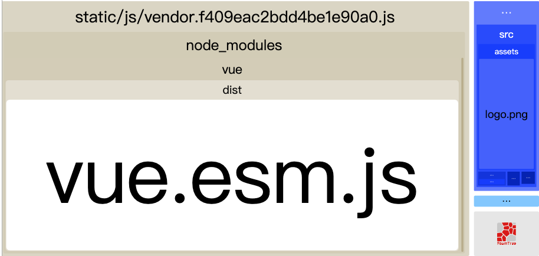

# 项目优化经验

## 性能指标

Chrome团队提出了一个以用户为中心的性能模型被称为RAIL，它为工程师提供一个目标，只要达到目标的网页，用户就会觉得很流畅；它将用户体验拆解为一些关键操作，例如：点击，加载等；并给这些操作规定一个目标，例如：点击一个按钮后，多长时间给反馈用户会觉得流畅。

RAIL将影响性能的行为划分为四个方面，分别是：`Response`（响应）、`Animation`（动画）、`Idle`（空闲） 与 `Load`（加载）。

RAIL | 关键指标 | 用户操作 |
---- | --------- | ------------- |
响应（Response） | 小于100ms | 点击按钮。 |
动画（Animation） | 小于16ms | 滚动页面，拖动手指，播放动画等。 |
空闲（Idle） | 小于50ms | 用户没有与页面交互，但应该保证主线程足够处理下一个用户输入。 |
加载（Load） | 1000ms | 用户加载页面并看到内容。|

Core Web Vitals

Core Web Vitals are a set of specific factors that Google considers important in determining the user experience on a website. These metrics focus on the speed, responsiveness, and visual stability of web pages. Google introduced Core Web Vitals as part of its broader initiative called Web Vitals, which aims to provide unified guidance for quality signals that are essential to delivering a great user experience on the web.

- Largest Contentful Paint (LCP): This metric measures the loading performance of a web page. Specifically, it looks at the time it takes for the largest content element (such as an image or text block) to become visible within the user's viewport.

- First Input Delay (FID): FID measures the responsiveness of a web page by gauging the time it takes for a user to interact with the page for the first time (e.g., clicking a button) to when the browser is able to respond to that interaction.

- Cumulative Layout Shift (CLS): CLS measures the visual stability of a web page. It quantifies how much the page layout shifts during its loading phase. An unexpected layout shift can be frustrating for users, especially if they accidentally click on the wrong element due to a sudden movement.

## 性能监测

### 浏览器的 `Network` 选项

这里可以看到资源加载详情，初步评估影响页面性能的因素。查看瀑布流里的一些常见指标：

- `Queueing`: 浏览器将资源放入队列时间
- `Stalled`: 因放入队列时间而发生的停滞时间
- `DNS Lookup`: DNS解析时间
- `Initial connection`:  建立HTTP连接的时间
- `SSL`: 浏览器与服务器建立安全性连接的时间
- `TTFB`: 等待服务端返回数据的时间
- `Content Download`:  浏览器下载资源的时间

### 浏览器的 `Lighthouse` 选项

分析网页性能的几个主要指标并给出建议。

- `First Contentful Paint`: 首屏渲染时间，1s以内绿色
- `Speed Index`: 速度指数，4s以内绿色
- `Time to Interactive`: 到页面可交换的时间

### 浏览器的 `Performance` 选项

通常我们会使用JS修改一些样式，随后浏览器会进行样式计算，然后进行布局，绘制，最后将各个图层合并在一起完成整个渲染的流程，这期间的每一步都有可能导致页面卡顿。

但是并不是所有的样式改动都需要经历这五个步骤。举例来说：如果在JS中修改了元素的几何属性（宽度、高度等），那么浏览器需要需要将这五个步骤都走一遍。但如果只是修改了文字的颜色，则布局（Layout）是可以跳过去的。此处涉及我们常说的一个概念：重绘和回流。

除了最后的合成，前面四个步骤在不同的场景下都可以被跳过。例如：CSS动画就可以跳过JS运算，它不需要执行JS。

浏览器的`Performance` 选项可以分析网页性能整个流程，各个环节指标性能分析，每一帧都可以进行具体的分析。

- 蓝色Loading：网络请求与解析。
  - Parse HTML
  - Send Request
  - Receive Response
- 黄色Scripting: JS 执行时间。
   - Fire Idle Callback
   - Compile Module
   - XHR Ready State Change
   - Timer Fired
   - Function Call
   - Evaluate Script
- 紫色Rendering: 重排，主要包含样式计算、更新布局树、布局、分层等。
  - Pre-Paint
  - Layerize
  - Recalculate Style
  - Layout
- 绿色Painting：重绘。更新分层、光栅化分层、合成等。
  - Commit
  - Paint
- 深灰色System: 系统占用时间。
- 灰色Idle: 空闲时间。
- Total: 总计。

### `Webpack` 的 `webpack-bundle-analyzer` 插件

对于打包后各项资源大小的分析。

## Webpack构建优化

1. 动态引入
2. 压缩
   - `Nginx`开启压缩
   - `Compression-webpack-plugin`插件
3. `optimization`中的`splitChunks`配置拆包
4. 生产环境删除多余内容`useless-files-w5-webpack-plugin`插件

## 网络请求优化

1. 压缩和优化图片： 使用适当的格式（如JPEG、PNG、WebP），并选择合适的压缩率。还可以使用图片压缩工具，如ImageMagick、TinyPNG等。
2. 减少HTTP请求数量： 合并或内联CSS和JavaScript文件，以减少HTTP请求。还可以使用雪碧图（CSS Sprites）来将多个小图片合并为一个大图，从而减少请求。
3. 启用浏览器缓存： 使用适当的缓存策略，使得资源可以在用户首次访问后被缓存在本地，减少后续加载时间。

## 页面内容优化

1. CSS
   - 避免出现超过三层的嵌套规则
   - 避免为ID选择器添加多余选择器
   - 避免使用标签选择器代替类选择器
   - 避免使用通配选择器，只对目标节点声明规则
   - 避免重复匹配重复定义，关注可继承属性
   - 合理开启GPU加速
   - 创建图层的最佳方式是使用will-change，但某些不支持这个属性的浏览器可以使用3D 变形（transform: translateZ(0)）来强制创建一个新层
   - 使用字体图标，使用字体图标代替图像图标，以减少文件大小和HTTP请求数量
   - 最小化重排和重绘，避免频繁的DOM操作，因为它们可能导致浏览器执行昂贵的重排和重绘操作。
2. JavaScript
   - JS动画使用requestAnimationFrame触发动画
   - 异步加载： 将需要执行的JavaScript异步加载，以避免阻塞页面的渲染。将脚本放在<script>标签中，并将其放在页面底部，或使用async或defer属性。
3. DOM
   - 缓存DOM计算属性
   - 避免过多DOM操作，使用事件代理
   - 使用DOMFragment缓存批量化DOM操作
   - 使用类合并样式，避免逐条改变样式
   - 使用display控制DOM显隐，将DOM离线化
4. 骨架屏
5. 预加载&懒加载
6. 移除不必要的插件和库： 定期审查网页使用的插件和库，确保只保留必要的部分。

## 服务器端优化

1. 使用CDN（内容分发网络）： 使用CDN来分发您的静态资源，使用户可以从距离他们更近的服务器加载内容，从而加快加载速度。
2. 使用现代网络技术： 使用HTTP/2协议以及支持HTTP/2的服务器，以充分利用其多路复用功能，从而加速页面加载。
3. 减少重定向： 避免多余的页面重定向，因为每次重定向都会增加加载时间。
4. 优化服务器响应时间： 优化后端代码和数据库查询，确保服务器能够快速响应请求。
5. Gzip压缩： 配置服务器以使用Gzip或Brotli等压缩算法来压缩传输的内容，减少数据传输量。

## 参考资料

[Guide to Chrome's performance profiler](https://www.youtube.com/watch?v=KWM5wxlDuis)

[Essential JavaScript debugging tools for the modern detective by Rebecca Hill | JSConf Budapest 2019](https://www.youtube.com/watch?v=TtsvMRxmfGA)

[21+ Browser Dev Tools & Tips You Need To Know](https://www.youtube.com/watch?v=TcTSqhpm80Y)

[Analyze runtime performance](https://developer.chrome.com/docs/devtools/performance/)