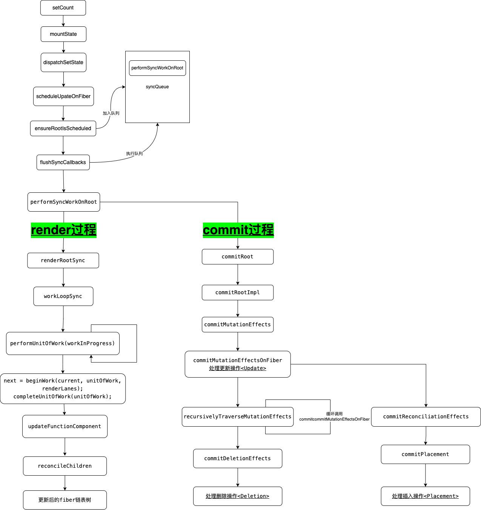

# React 的更新过程

## React 更新
在 `React` 中，有如下方法可以触发状态更新和渲染：
- `ReactDOM.render` —— HostRoot
- `this.setState` —— ClassComponent
- `this.forceUpdate` —— ClassComponent
- `useState` —— FunctionComponent
- `useReducer` —— FunctionComponent

我们用以下例子来调试 `React` 的更新过程：
```js
function App() {
  const [count, setCount] = React.useState(0)

  React.useEffect(() => {
    setTimeout(() => {
      setCount(count => {
        return count+1
      })
    }, 3000);
  })
  
  return (
    <div className="App">
      <p>hello world { count }</p>
    </div>
  );
}
```

## React 更新流程 - 入口
首先找到 `useState` 方法入口如下：
```ts
useState: function (initialState) {
    currentHookNameInDev = 'useState';
    mountHookTypesDev();
    var prevDispatcher = ReactCurrentDispatcher$1.current;
    ReactCurrentDispatcher$1.current = InvalidNestedHooksDispatcherOnMountInDEV;

    try {
        return mountState(initialState);
    } finally {
        ReactCurrentDispatcher$1.current = prevDispatcher;
    }
}
```

`mountState`：
```ts
function mountState(initialState) {
  var hook = mountWorkInProgressHook();

  if (typeof initialState === 'function') {
    // $FlowFixMe: Flow doesn't like mixed types
    initialState = initialState();
  }

  hook.memoizedState = hook.baseState = initialState;
  var queue = {
    pending: null,
    interleaved: null,
    lanes: NoLanes,
    dispatch: null,
    lastRenderedReducer: basicStateReducer,
    lastRenderedState: initialState
  };
  hook.queue = queue;
  var dispatch = queue.dispatch = dispatchSetState.bind(null, currentlyRenderingFiber$1, queue);
  return [hook.memoizedState, dispatch];
}
```

`dispatchSetState`：
```ts
function dispatchSetState(fiber, queue, action) {
  {
    if (typeof arguments[3] === 'function') {
      error("State updates from the useState() and useReducer() Hooks don't support the " + 'second callback argument. To execute a side effect after ' + 'rendering, declare it in the component body with useEffect().');
    }
  }

  var lane = requestUpdateLane(fiber);
  var update = {
    lane: lane,
    action: action,
    hasEagerState: false,
    eagerState: null,
    next: null
  };

  if (isRenderPhaseUpdate(fiber)) {
    enqueueRenderPhaseUpdate(queue, update);
  } else {
    var alternate = fiber.alternate;

    if (fiber.lanes === NoLanes && (alternate === null || alternate.lanes === NoLanes)) {
      // The queue is currently empty, which means we can eagerly compute the
      // next state before entering the render phase. If the new state is the
      // same as the current state, we may be able to bail out entirely.
      var lastRenderedReducer = queue.lastRenderedReducer;

      if (lastRenderedReducer !== null) {
        var prevDispatcher;

        {
          prevDispatcher = ReactCurrentDispatcher$1.current;
          ReactCurrentDispatcher$1.current = InvalidNestedHooksDispatcherOnUpdateInDEV;
        }

        try {
          var currentState = queue.lastRenderedState;
          var eagerState = lastRenderedReducer(currentState, action); // Stash the eagerly computed state, and the reducer used to compute
          // it, on the update object. If the reducer hasn't changed by the
          // time we enter the render phase, then the eager state can be used
          // without calling the reducer again.

          update.hasEagerState = true;
          update.eagerState = eagerState;

          if (objectIs(eagerState, currentState)) {
            // Fast path. We can bail out without scheduling React to re-render.
            // It's still possible that we'll need to rebase this update later,
            // if the component re-renders for a different reason and by that
            // time the reducer has changed.
            // TODO: Do we still need to entangle transitions in this case?
            enqueueConcurrentHookUpdateAndEagerlyBailout(fiber, queue, update, lane);
            return;
          }
        } catch (error) {// Suppress the error. It will throw again in the render phase.
        } finally {
          {
            ReactCurrentDispatcher$1.current = prevDispatcher;
          }
        }
      }
    }

    var root = enqueueConcurrentHookUpdate(fiber, queue, update, lane);

    if (root !== null) {
      var eventTime = requestEventTime();
      scheduleUpdateOnFiber(root, fiber, lane, eventTime);
      entangleTransitionUpdate(root, queue, lane);
    }
  }

  markUpdateInDevTools(fiber, lane);
}
```

## React 更新流程 - render
`scheduleUpdateOnFiber` => `ensureRootIsScheduled` => `flushSyncCallbacks` => `performSyncWorkOnRoot` => `renderRootSync`/ `commitRoot` => `workLoopSync` => `performUnitOfWork` => `beginWork`/ `completeWork`

### beginWork
`beginWork`根据tag类型进入不同的 `update` 方法，比如我们在调用 `useState` 的时候会触发组件更新，就会走到如下 `updateFunctionComponent` 方法：

1. `updateFunctionComponent`中关键的两个步骤 `renderWithHooks` 和 `reconcileChildren`
```ts
function updateFunctionComponent(
  current: null | Fiber,
  workInProgress: Fiber,
  Component: any,
  nextProps: any,
  renderLanes: Lanes,
) {
  // 【省略代码...】

  let context;
  if (!disableLegacyContext) {
    const unmaskedContext = getUnmaskedContext(workInProgress, Component, true);
    context = getMaskedContext(workInProgress, unmaskedContext);
  }

  let nextChildren;
  let hasId;
  prepareToReadContext(workInProgress, renderLanes);
  if (enableSchedulingProfiler) {
    markComponentRenderStarted(workInProgress);
  }
  // 【调用renderWithHooks获取nextChildren】
  // 【省略代码...】
    nextChildren = renderWithHooks(
      current,
      workInProgress,
      Component,
      nextProps,
      context,
      renderLanes,
    );
    hasId = checkDidRenderIdHook();
  
  if (enableSchedulingProfiler) {
    markComponentRenderStopped();
  }

  if (current !== null && !didReceiveUpdate) {
    bailoutHooks(current, workInProgress, renderLanes);
    return bailoutOnAlreadyFinishedWork(current, workInProgress, renderLanes);
  }

  if (getIsHydrating() && hasId) {
    pushMaterializedTreeId(workInProgress);
  }

  // React DevTools reads this flag.
  workInProgress.flags |= PerformedWork;
  reconcileChildren(current, workInProgress, nextChildren, renderLanes);
  return workInProgress.child;
}
```

  1-1. `renderWithHooks` 其实就是调用 `function component` 的 `function` 获取返回的JSX内容作为 `nextChildren` ，也就是接下来我们需要渲染的内容：
  ```ts
  export function renderWithHooks<Props, SecondArg>(
    current: Fiber | null,
    workInProgress: Fiber,
    Component: (p: Props, arg: SecondArg) => any,
    props: Props,
    secondArg: SecondArg,
    nextRenderLanes: Lanes,
  ): any {
    renderLanes = nextRenderLanes;
    currentlyRenderingFiber = workInProgress;

    // 【省略代码...】

    workInProgress.memoizedState = null;
    workInProgress.updateQueue = null;
    workInProgress.lanes = NoLanes;

    // The following should have already been reset
    // currentHook = null;
    // workInProgressHook = null;

    // didScheduleRenderPhaseUpdate = false;
    // localIdCounter = 0;
    // thenableIndexCounter = 0;
    // thenableState = null;

    // TODO Warn if no hooks are used at all during mount, then some are used during update.
    // Currently we will identify the update render as a mount because memoizedState === null.
    // This is tricky because it's valid for certain types of components (e.g. React.lazy)

    // Using memoizedState to differentiate between mount/update only works if at least one stateful hook is used.
    // Non-stateful hooks (e.g. context) don't get added to memoizedState,
    // so memoizedState would be null during updates and mounts.
    if (__DEV__) {
      // 【省略代码...】
    } else {
      ReactCurrentDispatcher.current =
        current === null || current.memoizedState === null
          ? HooksDispatcherOnMount
          : HooksDispatcherOnUpdate;
    }

    // In Strict Mode, during development, user functions are double invoked to
    // help detect side effects. The logic for how this is implemented for in
    // hook components is a bit complex so let's break it down.
    //
    // We will invoke the entire component function twice. However, during the
    // second invocation of the component, the hook state from the first
    // invocation will be reused. That means things like `useMemo` functions won't
    // run again, because the deps will match and the memoized result will
    // be reused.
    //
    // We want memoized functions to run twice, too, so account for this, user
    // functions are double invoked during the *first* invocation of the component
    // function, and are *not* double invoked during the second incovation:
    //
    // - First execution of component function: user functions are double invoked
    // - Second execution of component function (in Strict Mode, during
    //   development): user functions are not double invoked.
    //
    // This is intentional for a few reasons; most importantly, it's because of
    // how `use` works when something suspends: it reuses the promise that was
    // passed during the first attempt. This is itself a form of memoization.
    // We need to be able to memoize the reactive inputs to the `use` call using
    // a hook (i.e. `useMemo`), which means, the reactive inputs to `use` must
    // come from the same component invocation as the output.
    //
    // There are plenty of tests to ensure this behavior is correct.
    const shouldDoubleRenderDEV =
      __DEV__ &&
      debugRenderPhaseSideEffectsForStrictMode &&
      (workInProgress.mode & StrictLegacyMode) !== NoMode;

    shouldDoubleInvokeUserFnsInHooksDEV = shouldDoubleRenderDEV;
    // 【调用function component的function，返回对应的react-element】
    let children = Component(props, secondArg);
    shouldDoubleInvokeUserFnsInHooksDEV = false;

    // Check if there was a render phase update
    if (didScheduleRenderPhaseUpdateDuringThisPass) {
      // Keep rendering until the component stabilizes (there are no more render
      // phase updates).
      children = renderWithHooksAgain(
        workInProgress,
        Component,
        props,
        secondArg,
      );
    }

    if (shouldDoubleRenderDEV) {
      // In development, components are invoked twice to help detect side effects.
      setIsStrictModeForDevtools(true);
      try {
        children = renderWithHooksAgain(
          workInProgress,
          Component,
          props,
          secondArg,
        );
      } finally {
        setIsStrictModeForDevtools(false);
      }
    }

    finishRenderingHooks(current, workInProgress);

    return children;
  }
  ```

  1-2. `reconcileChildren` 构建新 `fiber` 链表树的过程：
  ```ts
  export function reconcileChildren(
    current: Fiber | null,
    workInProgress: Fiber,
    nextChildren: any,
    renderLanes: Lanes,
  ) {
    if (current === null) {
      // If this is a fresh new component that hasn't been rendered yet, we
      // won't update its child set by applying minimal side-effects. Instead,
      // we will add them all to the child before it gets rendered. That means
      // we can optimize this reconciliation pass by not tracking side-effects.
      // 【首次】
      workInProgress.child = mountChildFibers(
        workInProgress,
        null,
        nextChildren,
        renderLanes,
      );
    } else {
      // If the current child is the same as the work in progress, it means that
      // we haven't yet started any work on these children. Therefore, we use
      // the clone algorithm to create a copy of all the current children.

      // If we had any progressed work already, that is invalid at this point so
      // let's throw it out.
      // 【更新】
      workInProgress.child = reconcileChildFibers(
        workInProgress,
        current.child,
        nextChildren,
        renderLanes,
      );
    }
  }

  export const reconcileChildFibers: ChildReconciler =
  createChildReconciler(true);
  export const mountChildFibers: ChildReconciler = createChildReconciler(false);
  ```

2. `createChildReconciler`
如果是 `current` 存在也就是更新的情况下会调用 `reconcileChildFibers` 方法，继而调用 `createChildReconciler` 方法，此时的入参 `shouldTrackSideEffects` 为true。`createChildReconciler` 是一个闭包结构，最终返回 `reconcileChildFibers` 方法，它里面包含不同情况下的调用方法：
```ts
function createChildReconciler(
  shouldTrackSideEffects: boolean,
): ChildReconciler {
  // 很多functions...
  
  // 【newChild是单节点】
  function reconcileSingleElement(
    returnFiber: Fiber,
    currentFirstChild: Fiber | null,
    element: ReactElement,
    lanes: Lanes,
  ): Fiber {
    // 【省略代码...】
  }
  
  // 【给新节点做标记，并返回最后一个可复用节点的索引】
  function placeChild(
    newFiber: Fiber,
    lastPlacedIndex: number,
    newIndex: number,
  ): number {
    // 【省略代码...】
  }

  // 【根据是否能复用旧节点创建文本fiber】
  function updateTextNode(
    returnFiber: Fiber,
    current: Fiber | null,
    textContent: string,
    lanes: Lanes,
  ) {
    // 【省略代码...】
  }

  // 【判断能否复用旧节点】
  function updateSlot(
    returnFiber: Fiber,
    oldFiber: Fiber | null,
    newChild: any,
    lanes: Lanes,
  ): Fiber | null {
    // 【省略代码...】
  }

  // 【newChild是多节点】
  function reconcileChildrenArray(
    returnFiber: Fiber,//【上层节点】
    currentFirstChild: Fiber | null,//【旧节点序列的第一个节点】
    newChildren: Array<any>,//【新节点序列】
    lanes: Lanes,
  ): Fiber | null {
    // 【省略代码...】
  }
  
  // 【根据newChild类型调用不同处理方法】
  function reconcileChildFibersImpl(
    returnFiber: Fiber,
    currentFirstChild: Fiber | null,
    newChild: any,
    lanes: Lanes,
  ): Fiber | null {
    // 【省略代码...】
  }

  // 【实际调用reconcileChildFibersImpl】
  function reconcileChildFibers(
    returnFiber: Fiber,
    currentFirstChild: Fiber | null,
    newChild: any,
    lanes: Lanes,
  ): Fiber | null {
    // 【省略代码...】
  }

  return reconcileChildFibers;
}
```

`reconcileChildFibersImpl` 通过对 `newChild` 分类进行不同的处理，单独的文本节点，或者数组也就是多节点通过不同的方法进行处理：
```ts
// 【根据newChild类型调用不同处理方法】
function reconcileChildFibersImpl(
  returnFiber: Fiber,
  currentFirstChild: Fiber | null,
  newChild: any,
  lanes: Lanes,
): Fiber | null {
  // This function is not recursive.
  // If the top level item is an array, we treat it as a set of children,
  // not as a fragment. Nested arrays on the other hand will be treated as
  // fragment nodes. Recursion happens at the normal flow.

  // Handle top level unkeyed fragments as if they were arrays.
  // This leads to an ambiguity between <>{[...]}</> and <>...</>.
  // We treat the ambiguous cases above the same.
  // TODO: Let's use recursion like we do for Usable nodes?
  const isUnkeyedTopLevelFragment =
    typeof newChild === 'object' &&
    newChild !== null &&
    newChild.type === REACT_FRAGMENT_TYPE &&
    newChild.key === null;
  if (isUnkeyedTopLevelFragment) {
    newChild = newChild.props.children;
  }

  // Handle object types
  if (typeof newChild === 'object' && newChild !== null) {
    switch (newChild.$$typeof) {
      case REACT_ELEMENT_TYPE:
        // 【placeSingleChild给fiber添加flag】
        // 【reconcileSingleElement给单个元素构造成fiber】
        return placeSingleChild(
          reconcileSingleElement(
            returnFiber,
            currentFirstChild,
            newChild,
            lanes,
          ),
        );
      case REACT_PORTAL_TYPE:
        return placeSingleChild(
          reconcileSinglePortal(
            returnFiber,
            currentFirstChild,
            newChild,
            lanes,
          ),
        );
      case REACT_LAZY_TYPE:
        const payload = newChild._payload;
        const init = newChild._init;
        // TODO: This function is supposed to be non-recursive.
        return reconcileChildFibers(
          returnFiber,
          currentFirstChild,
          init(payload),
          lanes,
        );
    }

    // 【newChild是多个节点-diff入口】
    if (isArray(newChild)) {
      return reconcileChildrenArray(
        returnFiber,
        currentFirstChild,
        newChild,
        lanes,
      );
    }

    if (getIteratorFn(newChild)) {
      return reconcileChildrenIterator(
        returnFiber,
        currentFirstChild,
        newChild,
        lanes,
      );
    }

    // Usables are a valid React node type. When React encounters a Usable in
    // a child position, it unwraps it using the same algorithm as `use`. For
    // example, for promises, React will throw an exception to unwind the
    // stack, then replay the component once the promise resolves.
    //
    // A difference from `use` is that React will keep unwrapping the value
    // until it reaches a non-Usable type.
    //
    // e.g. Usable<Usable<Usable<T>>> should resolve to T
    //
    // The structure is a bit unfortunate. Ideally, we shouldn't need to
    // replay the entire begin phase of the parent fiber in order to reconcile
    // the children again. This would require a somewhat significant refactor,
    // because reconcilation happens deep within the begin phase, and
    // depending on the type of work, not always at the end. We should
    // consider as an future improvement.
    if (typeof newChild.then === 'function') {
      const thenable: Thenable<any> = (newChild: any);
      return reconcileChildFibersImpl(
        returnFiber,
        currentFirstChild,
        unwrapThenable(thenable),
        lanes,
      );
    }

    if (
      newChild.$$typeof === REACT_CONTEXT_TYPE ||
      newChild.$$typeof === REACT_SERVER_CONTEXT_TYPE
    ) {
      const context: ReactContext<mixed> = (newChild: any);
      return reconcileChildFibersImpl(
        returnFiber,
        currentFirstChild,
        readContextDuringReconcilation(returnFiber, context, lanes),
        lanes,
      );
    }

    throwOnInvalidObjectType(returnFiber, newChild);
  }
  
  // 【如果newChild是文本节点，调用reconcileSingleTextNode】
  if (
    (typeof newChild === 'string' && newChild !== '') ||
    typeof newChild === 'number'
  ) {
    return placeSingleChild(
      reconcileSingleTextNode(
        returnFiber,
        currentFirstChild,
        '' + newChild,
        lanes,
      ),
    );
  }

  // 【省略代码...】

  // Remaining cases are all treated as empty.
  return deleteRemainingChildren(returnFiber, currentFirstChild);
}
```

单个节点处理方法 `reconcileSingleElement` 如下：
```ts
// 【newChild是单节点】
function reconcileSingleElement(
  returnFiber: Fiber,
  currentFirstChild: Fiber | null,
  element: ReactElement,
  lanes: Lanes,
): Fiber {
  const key = element.key;
  let child = currentFirstChild;
  while (child !== null) {
    // TODO: If key === null and child.key === null, then this only applies to
    // the first item in the list.
    if (child.key === key) {
      // 【第一步：查看节点key是否相同】
      const elementType = element.type;
      if (elementType === REACT_FRAGMENT_TYPE) {

        if (child.tag === Fragment) {
          // 【复用当前节点，删除当前节点的兄弟节点】
          deleteRemainingChildren(returnFiber, child.sibling);
          const existing = useFiber(child, element.props.children);
          existing.return = returnFiber;
          if (__DEV__) {
            existing._debugSource = element._source;
            existing._debugOwner = element._owner;
          }
          return existing;
        }
      } else {
        // 【第二步：查看节点elementType是否相同】
        if (
          child.elementType === elementType ||
          // Keep this check inline so it only runs on the false path:
          (__DEV__
            ? isCompatibleFamilyForHotReloading(child, element)
            : false) ||
          // Lazy types should reconcile their resolved type.
          // We need to do this after the Hot Reloading check above,
          // because hot reloading has different semantics than prod because
          // it doesn't resuspend. So we can't let the call below suspend.
          (typeof elementType === 'object' &&
            elementType !== null &&
            elementType.$$typeof === REACT_LAZY_TYPE &&
            resolveLazy(elementType) === child.type)
        ) {
          // 【复用当前节点，删除当前节点的兄弟节点】
          deleteRemainingChildren(returnFiber, child.sibling);
          const existing = useFiber(child, element.props);
          existing.ref = coerceRef(returnFiber, child, element);
          existing.return = returnFiber;
          if (__DEV__) {
            existing._debugSource = element._source;
            existing._debugOwner = element._owner;
          }
          return existing;
        }
      }
      // Didn't match.
      deleteRemainingChildren(returnFiber, child);
      break;
    } else {
      // 【节点key不相同，无法复用旧节点，直接删除旧节点插入新节点】
      deleteChild(returnFiber, child);
    }
    child = child.sibling;
  }

  if (element.type === REACT_FRAGMENT_TYPE) {
    const created = createFiberFromFragment(
      element.props.children,
      returnFiber.mode,
      lanes,
      element.key,
    );
    created.return = returnFiber;
    return created;
  } else {
    const created = createFiberFromElement(element, returnFiber.mode, lanes);
    created.ref = coerceRef(returnFiber, currentFirstChild, element);
    created.return = returnFiber;
    return created;
  }
}
```

多节点处理方法 `reconcileChildrenArray` 如下：
```ts
// 【给新节点做标记，并返回最后一个可复用节点的索引】
function placeChild(
  newFiber: Fiber,
  lastPlacedIndex: number,
  newIndex: number,
): number {
  newFiber.index = newIndex;
  if (!shouldTrackSideEffects) {
    // During hydration, the useId algorithm needs to know which fibers are
    // part of a list of children (arrays, iterators).
    newFiber.flags |= Forked;
    return lastPlacedIndex;
  }
  const current = newFiber.alternate;
  if (current !== null) {
    const oldIndex = current.index;
    if (oldIndex < lastPlacedIndex) {
      // 【给newFiber标记placement】
      // This is a move.
      newFiber.flags |= Placement | PlacementDEV;
      return lastPlacedIndex;
    } else {
      // This item can stay in place.
      return oldIndex;
    }
  } else {
    // This is an insertion.
    newFiber.flags |= Placement | PlacementDEV;
    return lastPlacedIndex;
  }
}

// 【构造文本fiber】
function updateTextNode(
  returnFiber: Fiber,
  current: Fiber | null,
  textContent: string,
  lanes: Lanes,
) {
  if (current === null || current.tag !== HostText) {
    // Insert
    const created = createFiberFromText(textContent, returnFiber.mode, lanes);
    created.return = returnFiber;
    return created;
  } else {
    // Update
    const existing = useFiber(current, textContent);
    existing.return = returnFiber;
    return existing;
  }
}

// 【判断能否复用旧节点】
function updateSlot(
  returnFiber: Fiber,
  oldFiber: Fiber | null,
  newChild: any,
  lanes: Lanes,
): Fiber | null {
  // Update the fiber if the keys match, otherwise return null.
  const key = oldFiber !== null ? oldFiber.key : null;
  // 【新节点是string或number类型也就是文本的话，能复用就复用节点，否则就新建一个文本节点，并返回fiber】
  if (
    (typeof newChild === 'string' && newChild !== '') ||
    typeof newChild === 'number'
  ) {
    // Text nodes don't have keys. If the previous node is implicitly keyed
    // we can continue to replace it without aborting even if it is not a text
    // node.
    if (key !== null) {
      return null;
    }
    return updateTextNode(returnFiber, oldFiber, '' + newChild, lanes);
  }
  // 【判断新节点类型，进行同样的操作，判断能否复用旧节点】
  if (typeof newChild === 'object' && newChild !== null) {
    switch (newChild.$$typeof) {
      case REACT_ELEMENT_TYPE: {
        if (newChild.key === key) {
          return updateElement(returnFiber, oldFiber, newChild, lanes);
        } else {
          return null;
        }
      }
      case REACT_PORTAL_TYPE: {
        if (newChild.key === key) {
          return updatePortal(returnFiber, oldFiber, newChild, lanes);
        } else {
          return null;
        }
      }
      case REACT_LAZY_TYPE: {
        const payload = newChild._payload;
        const init = newChild._init;
        return updateSlot(returnFiber, oldFiber, init(payload), lanes);
      }
    }

    if (isArray(newChild) || getIteratorFn(newChild)) {
      if (key !== null) {
        return null;
      }

      return updateFragment(returnFiber, oldFiber, newChild, lanes, null);
    }

    // Usable node types
    //
    // Unwrap the inner value and recursively call this function again.
    if (typeof newChild.then === 'function') {
      const thenable: Thenable<any> = (newChild: any);
      return updateSlot(
        returnFiber,
        oldFiber,
        unwrapThenable(thenable),
        lanes,
      );
    }

    if (
      newChild.$$typeof === REACT_CONTEXT_TYPE ||
      newChild.$$typeof === REACT_SERVER_CONTEXT_TYPE
    ) {
      const context: ReactContext<mixed> = (newChild: any);
      return updateSlot(
        returnFiber,
        oldFiber,
        readContextDuringReconcilation(returnFiber, context, lanes),
        lanes,
      );
    }

    throwOnInvalidObjectType(returnFiber, newChild);
  }

  // 【省略代码...】

  return null;
}

// 【newChild是多节点】
function reconcileChildrenArray(
  returnFiber: Fiber,//【上层节点】
  currentFirstChild: Fiber | null,//【旧节点序列的第一个节点】
  newChildren: Array<any>,//【新节点序列】
  lanes: Lanes,
): Fiber | null {
  // This algorithm can't optimize by searching from both ends since we
  // don't have backpointers on fibers. I'm trying to see how far we can get
  // with that model. If it ends up not being worth the tradeoffs, we can
  // add it later.

  // Even with a two ended optimization, we'd want to optimize for the case
  // where there are few changes and brute force the comparison instead of
  // going for the Map. It'd like to explore hitting that path first in
  // forward-only mode and only go for the Map once we notice that we need
  // lots of look ahead. This doesn't handle reversal as well as two ended
  // search but that's unusual. Besides, for the two ended optimization to
  // work on Iterables, we'd need to copy the whole set.

  // In this first iteration, we'll just live with hitting the bad case
  // (adding everything to a Map) in for every insert/move.

  // If you change this code, also update reconcileChildrenIterator() which
  // uses the same algorithm.

  // 【省略代码...】

  let resultingFirstChild: Fiber | null = null;//【能复用的情况下，新节点中的第一个节点】
  let previousNewFiber: Fiber | null = null;//【上一个被遍历的新节点】

  let oldFiber = currentFirstChild;//【旧节点序列的第一个节点初始化oldFiber】
  let lastPlacedIndex = 0;//【能复用的旧节点中最后一个的索引】
  let newIdx = 0;
  let nextOldFiber = null;//【用于下一个监测是否能复用的旧节点】
  
  // 【第一遍遍历newChildren】
  for (; oldFiber !== null && newIdx < newChildren.length; newIdx++) {
    // 【旧节点索引大于当前这个新节点索引，那就继续寻找这个旧节点是不是能复用】
    if (oldFiber.index > newIdx) {
      nextOldFiber = oldFiber;
      oldFiber = null;
    } else {
      nextOldFiber = oldFiber.sibling;
    }
    // 【对比寻找旧节点是否可复用，可复用的节点就直接在旧节点基础上创建或更新fiber并返回】
    const newFiber = updateSlot(
      returnFiber,
      oldFiber,
      newChildren[newIdx],
      lanes,
    );
    // 【newFiber为null说明不能复用，先跳出第一轮遍历】
    if (newFiber === null) {
      // TODO: This breaks on empty slots like null children. That's
      // unfortunate because it triggers the slow path all the time. We need
      // a better way to communicate whether this was a miss or null,
      // boolean, undefined, etc.
      if (oldFiber === null) {
        oldFiber = nextOldFiber;
      }
      break;
    }
    if (shouldTrackSideEffects) {
      if (oldFiber && newFiber.alternate === null) {
        // We matched the slot, but we didn't reuse the existing fiber, so we
        // need to delete the existing child.
        deleteChild(returnFiber, oldFiber);
      }
    }
    // 【最后一个找到的可复用的旧节点的索引，并且给新节点打上标签】
    lastPlacedIndex = placeChild(newFiber, lastPlacedIndex, newIdx);
    // 【previousNewFiber为null说明是找到的第一个可复用节点，赋值给resultingFirstChild】
    // 【previousNewFiber不为null说明，已有可复用节点，所以把newFiber作为兄弟节点串上去】
    if (previousNewFiber === null) {
      // TODO: Move out of the loop. This only happens for the first run.
      resultingFirstChild = newFiber;
    } else {
      // TODO: Defer siblings if we're not at the right index for this slot.
      // I.e. if we had null values before, then we want to defer this
      // for each null value. However, we also don't want to call updateSlot
      // with the previous one.
      previousNewFiber.sibling = newFiber;
    }
    previousNewFiber = newFiber;
    // 【继续寻找下一个可复用节点】
    oldFiber = nextOldFiber;
  }

  // 【新节点newChildren遍历完，删除剩余的旧节点】
  if (newIdx === newChildren.length) {
    // We've reached the end of the new children. We can delete the rest.
    deleteRemainingChildren(returnFiber, oldFiber);
    if (getIsHydrating()) {
      const numberOfForks = newIdx;
      pushTreeFork(returnFiber, numberOfForks);
    }
    return resultingFirstChild;
  }

  // 【旧节点已经遍历结束，剩下的新节点作为新创建的插入进去】
  if (oldFiber === null) {
    // If we don't have any more existing children we can choose a fast path
    // since the rest will all be insertions.
    for (; newIdx < newChildren.length; newIdx++) {
      const newFiber = createChild(returnFiber, newChildren[newIdx], lanes);
      if (newFiber === null) {
        continue;
      }
      lastPlacedIndex = placeChild(newFiber, lastPlacedIndex, newIdx);
      if (previousNewFiber === null) {
        // TODO: Move out of the loop. This only happens for the first run.
        resultingFirstChild = newFiber;
      } else {
        previousNewFiber.sibling = newFiber;
      }
      previousNewFiber = newFiber;
    }
    if (getIsHydrating()) {
      const numberOfForks = newIdx;
      pushTreeFork(returnFiber, numberOfForks);
    }
    return resultingFirstChild;
  }

  // 【新旧节点都没遍历完】
  // 【建立一个Map，key为oldFiber的key，value为oldFiber】
  // Add all children to a key map for quick lookups.
  const existingChildren = mapRemainingChildren(returnFiber, oldFiber);
  // 【继续遍历newChildren里剩下的节点，在这个Map中寻找能复用的旧节点，并打上标记】
  // Keep scanning and use the map to restore deleted items as moves.
  for (; newIdx < newChildren.length; newIdx++) {
    const newFiber = updateFromMap(
      existingChildren,
      returnFiber,
      newIdx,
      newChildren[newIdx],
      lanes,
    );
    // 【newFiber存在说明在旧节点中找到了可复用节点】
    if (newFiber !== null) {
      if (shouldTrackSideEffects) {
        if (newFiber.alternate !== null) {
          // The new fiber is a work in progress, but if there exists a
          // current, that means that we reused the fiber. We need to delete
          // it from the child list so that we don't add it to the deletion
          // list.
          existingChildren.delete(
            newFiber.key === null ? newIdx : newFiber.key,
          );
        }
      }
      lastPlacedIndex = placeChild(newFiber, lastPlacedIndex, newIdx);
      if (previousNewFiber === null) {
        resultingFirstChild = newFiber;
      } else {
        previousNewFiber.sibling = newFiber;
      }
      previousNewFiber = newFiber;
    }
  }

  if (shouldTrackSideEffects) {
    // Any existing children that weren't consumed above were deleted. We need
    // to add them to the deletion list.
    existingChildren.forEach(child => deleteChild(returnFiber, child));
  }

  if (getIsHydrating()) {
    const numberOfForks = newIdx;
    pushTreeFork(returnFiber, numberOfForks);
  }
  return resultingFirstChild;
}
```

其中在遇到多节点更新时就会涉及到常说的 `diff` 算法就在 `reconcileChildFibers` 方法中。`diff` 流程结束后，会形成新的 `fiber` 链表树，链表树上的 `fiber` 通过 `flags` 字段做了副作用标记，主要有以下几种：
- `Deletion`：会在渲染阶段对对应的 `DOM` 做删除操作
- `Update`：在 `fiber.updateQueue` 上保存了要更新的属性，在渲染阶段会对 `DOM` 做更新操作
- `Placement`：`Placement` 可能是插入也可能是移动，实际上两种都是插入动作。`React` 在更新时会优先去寻找要插入的 `fiber` 的 `sibling`，如果找到了执行 `DOM` 的 `insertBefore` 方法，如果没有找到就执行 `DOM` 的 `appendChild` 方法，从而实现了新节点插入位置的准确性

### completeWork
`completeUnitOfWork`
```ts
function completeUnitOfWork(unitOfWork: Fiber): void {
  // Attempt to complete the current unit of work, then move to the next
  // sibling. If there are no more siblings, return to the parent fiber.
  // 【获取当前工作的fiber】
  let completedWork: Fiber = unitOfWork;
  do {
    // The current, flushed, state of this fiber is the alternate. Ideally
    // nothing should rely on this, but relying on it here means that we don't
    // need an additional field on the work in progress.
    // 【current：当前工作fiber对应的页面上渲染的fiber】
    // 【returnFiber：当前工作fiber对应的上一层fiber】
    const current = completedWork.alternate;
    const returnFiber = completedWork.return;

    // 【当前工作fiber已完成】
    // 【调用completeWork返回下一个需要处理的fiber】
    // Check if the work completed or if something threw.
    if ((completedWork.flags & Incomplete) === NoFlags) {
      setCurrentDebugFiberInDEV(completedWork);
      let next;
      if (
        !enableProfilerTimer ||
        (completedWork.mode & ProfileMode) === NoMode
      ) {
        next = completeWork(current, completedWork, renderLanes);
      } else {
        startProfilerTimer(completedWork);
        next = completeWork(current, completedWork, renderLanes);
        // Update render duration assuming we didn't error.
        stopProfilerTimerIfRunningAndRecordDelta(completedWork, false);
      }
      resetCurrentDebugFiberInDEV();

      // 【如果next存在就是下一个工作fiber】
      if (next !== null) {
        // Completing this fiber spawned new work. Work on that next.
        workInProgress = next;
        return;
      }
    } else {
      // 【当前工作fiber未完成】
      // This fiber did not complete because something threw. Pop values off
      // the stack without entering the complete phase. If this is a boundary,
      // capture values if possible.
      const next = unwindWork(current, completedWork, renderLanes);

      // Because this fiber did not complete, don't reset its lanes.

      if (next !== null) {
        // If completing this work spawned new work, do that next. We'll come
        // back here again.
        // Since we're restarting, remove anything that is not a host effect
        // from the effect tag.
        next.flags &= HostEffectMask;
        workInProgress = next;
        return;
      }

      if (
        enableProfilerTimer &&
        (completedWork.mode & ProfileMode) !== NoMode
      ) {
        // Record the render duration for the fiber that errored.
        stopProfilerTimerIfRunningAndRecordDelta(completedWork, false);

        // Include the time spent working on failed children before continuing.
        let actualDuration = completedWork.actualDuration;
        let child = completedWork.child;
        while (child !== null) {
          // $FlowFixMe[unsafe-addition] addition with possible null/undefined value
          actualDuration += child.actualDuration;
          child = child.sibling;
        }
        completedWork.actualDuration = actualDuration;
      }
      
      // 【对上层节点进行标记，并添加一个全局标记未完成】
      if (returnFiber !== null) {
        // Mark the parent fiber as incomplete and clear its subtree flags.
        returnFiber.flags |= Incomplete;
        returnFiber.subtreeFlags = NoFlags;
        returnFiber.deletions = null;
      } else {
        // We've unwound all the way to the root.
        workInProgressRootExitStatus = RootDidNotComplete;
        workInProgress = null;
        return;
      }
    }
    // 【如果有兄弟节点存在，继续complete兄弟节点】
    const siblingFiber = completedWork.sibling;
    if (siblingFiber !== null) {
      // If there is more work to do in this returnFiber, do that next.
      workInProgress = siblingFiber;
      return;
    }
    // 【否则返回上层节点继续进行complete工作】
    // Otherwise, return to the parent
    // $FlowFixMe[incompatible-type] we bail out when we get a null
    completedWork = returnFiber;
    // Update the next thing we're working on in case something throws.
    workInProgress = completedWork;
  } while (completedWork !== null);

  // 【整棵树遍历完成】
  // We've reached the root.
  if (workInProgressRootExitStatus === RootInProgress) {
    workInProgressRootExitStatus = RootCompleted;
  }
}
```

`completeWork`
```ts
function completeWork(
  current: Fiber | null,
  workInProgress: Fiber,
  renderLanes: Lanes,
): Fiber | null {
  const newProps = workInProgress.pendingProps;
  // Note: This intentionally doesn't check if we're hydrating because comparing
  // to the current tree provider fiber is just as fast and less error-prone.
  // Ideally we would have a special version of the work loop only
  // for hydration.
  popTreeContext(workInProgress);
  switch (workInProgress.tag) {
    case IndeterminateComponent:
    case LazyComponent:
    case SimpleMemoComponent:
    case FunctionComponent:
    case ForwardRef:
    case Fragment:
    case Mode:
    case Profiler:
    case ContextConsumer:
    case MemoComponent:
      bubbleProperties(workInProgress);
      return null;
    case ClassComponent: {
      // 【省略代码...】
    }
    case HostRoot: {
      const fiberRoot = (workInProgress.stateNode: FiberRoot);

      if (enableTransitionTracing) {
        const transitions = getWorkInProgressTransitions();
        // We set the Passive flag here because if there are new transitions,
        // we will need to schedule callbacks and process the transitions,
        // which we do in the passive phase
        if (transitions !== null) {
          workInProgress.flags |= Passive;
        }
      }

      if (enableCache) {
        let previousCache: Cache | null = null;
        if (current !== null) {
          previousCache = current.memoizedState.cache;
        }
        const cache: Cache = workInProgress.memoizedState.cache;
        if (cache !== previousCache) {
          // Run passive effects to retain/release the cache.
          workInProgress.flags |= Passive;
        }
        popCacheProvider(workInProgress, cache);
      }

      if (enableTransitionTracing) {
        popRootMarkerInstance(workInProgress);
      }

      popRootTransition(workInProgress, fiberRoot, renderLanes);
      popHostContainer(workInProgress);
      popTopLevelLegacyContextObject(workInProgress);
      resetMutableSourceWorkInProgressVersions();
      if (fiberRoot.pendingContext) {
        fiberRoot.context = fiberRoot.pendingContext;
        fiberRoot.pendingContext = null;
      }
      if (current === null || current.child === null) {
        // If we hydrated, pop so that we can delete any remaining children
        // that weren't hydrated.
        const wasHydrated = popHydrationState(workInProgress);
        if (wasHydrated) {
          // If we hydrated, then we'll need to schedule an update for
          // the commit side-effects on the root.
          markUpdate(workInProgress);
        } else {
          if (current !== null) {
            const prevState: RootState = current.memoizedState;
            if (
              // Check if this is a client root
              !prevState.isDehydrated ||
              // Check if we reverted to client rendering (e.g. due to an error)
              (workInProgress.flags & ForceClientRender) !== NoFlags
            ) {
              // Schedule an effect to clear this container at the start of the
              // next commit. This handles the case of React rendering into a
              // container with previous children. It's also safe to do for
              // updates too, because current.child would only be null if the
              // previous render was null (so the container would already
              // be empty).
              workInProgress.flags |= Snapshot;

              // If this was a forced client render, there may have been
              // recoverable errors during first hydration attempt. If so, add
              // them to a queue so we can log them in the commit phase.
              upgradeHydrationErrorsToRecoverable();
            }
          }
        }
      }
      updateHostContainer(current, workInProgress);
      bubbleProperties(workInProgress);
      if (enableTransitionTracing) {
        if ((workInProgress.subtreeFlags & Visibility) !== NoFlags) {
          // If any of our suspense children toggle visibility, this means that
          // the pending boundaries array needs to be updated, which we only
          // do in the passive phase.
          workInProgress.flags |= Passive;
        }
      }
      return null;
    }
    case HostHoistable: {
      // 【省略代码...】
    }
    // eslint-disable-next-line-no-fallthrough
    case HostSingleton: {
      // 【省略代码...】
    }
    // eslint-disable-next-line-no-fallthrough
    case HostComponent: {
      popHostContext(workInProgress);
      const type = workInProgress.type;
      if (current !== null && workInProgress.stateNode != null) {
        updateHostComponent(current, workInProgress, type, newProps);

        if (current.ref !== workInProgress.ref) {
          markRef(workInProgress);
        }
      } else {
        if (!newProps) {
          if (workInProgress.stateNode === null) {
            throw new Error(
              'We must have new props for new mounts. This error is likely ' +
                'caused by a bug in React. Please file an issue.',
            );
          }

          // This can happen when we abort work.
          bubbleProperties(workInProgress);
          return null;
        }

        const currentHostContext = getHostContext();
        // TODO: Move createInstance to beginWork and keep it on a context
        // "stack" as the parent. Then append children as we go in beginWork
        // or completeWork depending on whether we want to add them top->down or
        // bottom->up. Top->down is faster in IE11.
        const wasHydrated = popHydrationState(workInProgress);
        if (wasHydrated) {
          // TODO: Move this and createInstance step into the beginPhase
          // to consolidate.
          if (
            prepareToHydrateHostInstance(workInProgress, currentHostContext)
          ) {
            // If changes to the hydrated node need to be applied at the
            // commit-phase we mark this as such.
            markUpdate(workInProgress);
          }
        } else {
          const rootContainerInstance = getRootHostContainer();
          const instance = createInstance(
            type,
            newProps,
            rootContainerInstance,
            currentHostContext,
            workInProgress,
          );
          appendAllChildren(instance, workInProgress, false, false);
          workInProgress.stateNode = instance;

          // Certain renderers require commit-time effects for initial mount.
          // (eg DOM renderer supports auto-focus for certain elements).
          // Make sure such renderers get scheduled for later work.
          if (
            finalizeInitialChildren(
              instance,
              type,
              newProps,
              currentHostContext,
            )
          ) {
            markUpdate(workInProgress);
          }
        }

        if (workInProgress.ref !== null) {
          // If there is a ref on a host node we need to schedule a callback
          markRef(workInProgress);
        }
      }
      bubbleProperties(workInProgress);
      return null;
    }
    case HostText: {
      const newText = newProps;
      if (current && workInProgress.stateNode != null) {
        const oldText = current.memoizedProps;
        // If we have an alternate, that means this is an update and we need
        // to schedule a side-effect to do the updates.
        updateHostText(current, workInProgress, oldText, newText);
      } else {
        if (typeof newText !== 'string') {
          if (workInProgress.stateNode === null) {
            throw new Error(
              'We must have new props for new mounts. This error is likely ' +
                'caused by a bug in React. Please file an issue.',
            );
          }
          // This can happen when we abort work.
        }
        const rootContainerInstance = getRootHostContainer();
        const currentHostContext = getHostContext();
        const wasHydrated = popHydrationState(workInProgress);
        if (wasHydrated) {
          if (prepareToHydrateHostTextInstance(workInProgress)) {
            markUpdate(workInProgress);
          }
        } else {
          workInProgress.stateNode = createTextInstance(
            newText,
            rootContainerInstance,
            currentHostContext,
            workInProgress,
          );
        }
      }
      bubbleProperties(workInProgress);
      return null;
    }
    case SuspenseComponent: {
      // 【省略代码...】
    }
    case HostPortal:
      // 【省略代码...】
    case ContextProvider:
     // 【省略代码...】
    case IncompleteClassComponent: {
      // 【省略代码...】
    }
    case SuspenseListComponent: {
      // 【省略代码...】
    }
    case ScopeComponent: {
      // 【省略代码...】
    }
    case OffscreenComponent:
    case LegacyHiddenComponent: {
      // 【省略代码...】
    }
    case CacheComponent: {
      // 【省略代码...】
    }
    case TracingMarkerComponent: {
      // 【省略代码...】
    }
  }

  throw new Error(
    `Unknown unit of work tag (${workInProgress.tag}). This error is likely caused by a bug in ` +
      'React. Please file an issue.',
  );
}
```

## React 更新流程 - commit
`scheduleUpdateOnFiber` => `ensureRootIsScheduled` => `flushSyncCallbacks` => `performSyncWorkOnRoot` => `commitRoot` => `commitRootImpl` => `commitMutationEffects` => `commitMutationEffectsOnFiber`

### commit
`commitRoot` => `commitRootImpl` => `commitMutationEffects` => `commitMutationEffectsOnFiber`：

#### Update
`commitMutationEffectsOnFiber`，在这一步中会根据节点 `tag` 分类调用不同方法然后进入 `recursivelyTraverseMutationEffects` 和 `commitReconciliationEffects` 方法，实际的DOM操作（添加或者更新操作）就在这个方法中，我们来看其中文本节点和根节点的情况：
```ts
function commitMutationEffectsOnFiber(
  finishedWork: Fiber,
  root: FiberRoot,
  lanes: Lanes,
) {
  const current = finishedWork.alternate;
  const flags = finishedWork.flags;

  // The effect flag should be checked *after* we refine the type of fiber,
  // because the fiber tag is more specific. An exception is any flag related
  // to reconciliation, because those can be set on all fiber types.
  switch (finishedWork.tag) {
    case FunctionComponent:
    case ForwardRef:
    case MemoComponent:
    case SimpleMemoComponent: {
      // 【省略代码...】
    }
    case ClassComponent: {
      // 【省略代码...】
    }
    case HostHoistable: {
      // 【省略代码...】
    }
    // eslint-disable-next-line-no-fallthrough
    case HostSingleton: {
      // 【省略代码...】
    }
    // eslint-disable-next-line-no-fallthrough
    case HostComponent: {
      // 【省略代码...】
    }
    case HostText: {
      recursivelyTraverseMutationEffects(root, finishedWork, lanes);
      commitReconciliationEffects(finishedWork);

      // 【flags是否是update也就是更新】
      if (flags & Update) {
        if (supportsMutation) {
          if (finishedWork.stateNode === null) {
            throw new Error(
              'This should have a text node initialized. This error is likely ' +
                'caused by a bug in React. Please file an issue.',
            );
          }
          // 【获取DOM】
          const textInstance: TextInstance = finishedWork.stateNode;
          // 【获取最新的文本内容】
          const newText: string = finishedWork.memoizedProps;
          // For hydration we reuse the update path but we treat the oldProps
          // as the newProps. The updatePayload will contain the real change in
          // this case.
          // 【获取旧的文本内容】
          const oldText: string =
            current !== null ? current.memoizedProps : newText;

          try {
            // 【DOM操作，替换文本内容】
            commitTextUpdate(textInstance, oldText, newText);
          } catch (error) {
            captureCommitPhaseError(finishedWork, finishedWork.return, error);
          }
        }
      }
      return;
    }
    case HostRoot: {
      if (enableFloat && supportsResources) {
        prepareToCommitHoistables();

        const previousHoistableRoot = currentHoistableRoot;
        currentHoistableRoot = getHoistableRoot(root.containerInfo);
        // 【循环遍历调用commitMutationEffectsOnFiber】
        recursivelyTraverseMutationEffects(root, finishedWork, lanes);
        currentHoistableRoot = previousHoistableRoot;

        commitReconciliationEffects(finishedWork);
      } else {
        // 【循环遍历调用commitMutationEffectsOnFiber】
        recursivelyTraverseMutationEffects(root, finishedWork, lanes);
        commitReconciliationEffects(finishedWork);
      }
      // 【如果有更新的情况，判断然后替换新的根元素】
      if (flags & Update) {
        if (supportsMutation && supportsHydration) {
          if (current !== null) {
            const prevRootState: RootState = current.memoizedState;
            if (prevRootState.isDehydrated) {
              try {
                commitHydratedContainer(root.containerInfo);
              } catch (error) {
                captureCommitPhaseError(
                  finishedWork,
                  finishedWork.return,
                  error,
                );
              }
            }
          }
        }
        if (supportsPersistence) {
          const containerInfo = root.containerInfo;
          const pendingChildren = root.pendingChildren;
          try {
            replaceContainerChildren(containerInfo, pendingChildren);
          } catch (error) {
            captureCommitPhaseError(finishedWork, finishedWork.return, error);
          }
        }
      }
      return;
    }
    case HostPortal: {
      // 【省略代码...】
    }
    case SuspenseComponent: {
      // 【省略代码...】
    }
    case OffscreenComponent: {
      // 【省略代码...】
    }
    case SuspenseListComponent: {
      // 【省略代码...】
    }
    case ScopeComponent: {
      // 【省略代码...】
    }
    default: {
      recursivelyTraverseMutationEffects(root, finishedWork, lanes);
      commitReconciliationEffects(finishedWork);

      return;
    }
  }
}
```

#### Deletion
`recursivelyTraverseMutationEffects`这一步其实就是判断是否有子节点有就循环调用`commitMutationEffectsOnFiber`：
```ts
function recursivelyTraverseMutationEffects(root, parentFiber, lanes) {
  // Deletions effects can be scheduled on any fiber type. They need to happen
  // before the children effects hae fired.
  // 【DOM删除操作在这个步骤进行】
  var deletions = parentFiber.deletions;

  if (deletions !== null) {
    for (var i = 0; i < deletions.length; i++) {
      var childToDelete = deletions[i];

      try {
        commitDeletionEffects(root, parentFiber, childToDelete);
      } catch (error) {
        captureCommitPhaseError(childToDelete, parentFiber, error);
      }
    }
  }

  var prevDebugFiber = getCurrentFiber();

  if (parentFiber.subtreeFlags & MutationMask) {
    var child = parentFiber.child;
    // 【根据是否存在child决定是否继续循环调用commitMutationEffectsOnFiber】
    while (child !== null) {
      setCurrentFiber(child);
      commitMutationEffectsOnFiber(child, root);
      child = child.sibling;
    }
  }

  setCurrentFiber(prevDebugFiber);
}
```

`commitDeletionEffects`
```ts
function commitDeletionEffects(
  root: FiberRoot,
  returnFiber: Fiber,
  deletedFiber: Fiber,
) {
  if (supportsMutation) {
    // We only have the top Fiber that was deleted but we need to recurse down its
    // children to find all the terminal nodes.

    // Recursively delete all host nodes from the parent, detach refs, clean
    // up mounted layout effects, and call componentWillUnmount.

    // We only need to remove the topmost host child in each branch. But then we
    // still need to keep traversing to unmount effects, refs, and cWU. TODO: We
    // could split this into two separate traversals functions, where the second
    // one doesn't include any removeChild logic. This is maybe the same
    // function as "disappearLayoutEffects" (or whatever that turns into after
    // the layout phase is refactored to use recursion).

    // Before starting, find the nearest host parent on the stack so we know
    // which instance/container to remove the children from.
    // TODO: Instead of searching up the fiber return path on every deletion, we
    // can track the nearest host component on the JS stack as we traverse the
    // tree during the commit phase. This would make insertions faster, too.
    let parent: null | Fiber = returnFiber;
    findParent: while (parent !== null) {
      switch (parent.tag) {
        case HostSingleton:
        case HostComponent: {
          hostParent = parent.stateNode;
          hostParentIsContainer = false;
          break findParent;
        }
        case HostRoot: {
          hostParent = parent.stateNode.containerInfo;
          hostParentIsContainer = true;
          break findParent;
        }
        case HostPortal: {
          hostParent = parent.stateNode.containerInfo;
          hostParentIsContainer = true;
          break findParent;
        }
      }
      parent = parent.return;
    }
    if (hostParent === null) {
      throw new Error(
        'Expected to find a host parent. This error is likely caused by ' +
          'a bug in React. Please file an issue.',
      );
    }

    commitDeletionEffectsOnFiber(root, returnFiber, deletedFiber);
    hostParent = null;
    hostParentIsContainer = false;
  } else {
    // Detach refs and call componentWillUnmount() on the whole subtree.
    commitDeletionEffectsOnFiber(root, returnFiber, deletedFiber);
  }

  detachFiberMutation(deletedFiber);
}
```

#### Placement
`commitReconciliationEffects`，这一步根据节点的 `flags` 字段进行处理：
```ts
function commitReconciliationEffects(finishedWork: Fiber) {
  // Placement effects (insertions, reorders) can be scheduled on any fiber
  // type. They needs to happen after the children effects have fired, but
  // before the effects on this fiber have fired.
  const flags = finishedWork.flags;
  if (flags & Placement) {
    try {
      commitPlacement(finishedWork);
    } catch (error) {
      captureCommitPhaseError(finishedWork, finishedWork.return, error);
    }
    // Clear the "placement" from effect tag so that we know that this is
    // inserted, before any life-cycles like componentDidMount gets called.
    // TODO: findDOMNode doesn't rely on this any more but isMounted does
    // and isMounted is deprecated anyway so we should be able to kill this.
    finishedWork.flags &= ~Placement;
  }
  if (flags & Hydrating) {
    finishedWork.flags &= ~Hydrating;
  }
}
```

`commitPlacement`处理插入操作，同样也是根据 `tag` 分类进行不同处理：
```ts
function commitPlacement(finishedWork: Fiber): void {
if (!supportsMutation) {
  return;
}

if (enableHostSingletons && supportsSingletons) {
  if (finishedWork.tag === HostSingleton) {
    // Singletons are already in the Host and don't need to be placed
    // Since they operate somewhat like Portals though their children will
    // have Placement and will get placed inside them
    return;
  }
}
// Recursively insert all host nodes into the parent.
const parentFiber = getHostParentFiber(finishedWork);

switch (parentFiber.tag) {
  case HostSingleton: {
    if (enableHostSingletons && supportsSingletons) {
      const parent: Instance = parentFiber.stateNode;
      const before = getHostSibling(finishedWork);
      // We only have the top Fiber that was inserted but we need to recurse down its
      // children to find all the terminal nodes.
      insertOrAppendPlacementNode(finishedWork, before, parent);
      break;
    }
  }
  // eslint-disable-next-line no-fallthrough
  case HostComponent: {
    const parent: Instance = parentFiber.stateNode;
    if (parentFiber.flags & ContentReset) {
      // Reset the text content of the parent before doing any insertions
      resetTextContent(parent);
      // Clear ContentReset from the effect tag
      parentFiber.flags &= ~ContentReset;
    }

    const before = getHostSibling(finishedWork);
    // We only have the top Fiber that was inserted but we need to recurse down its
    // children to find all the terminal nodes.
    insertOrAppendPlacementNode(finishedWork, before, parent);
    break;
  }
  case HostRoot:
  case HostPortal: {
    const parent: Container = parentFiber.stateNode.containerInfo;
    const before = getHostSibling(finishedWork);
    insertOrAppendPlacementNodeIntoContainer(finishedWork, before, parent);
    break;
  }
  // eslint-disable-next-line-no-fallthrough
  default:
    throw new Error(
      'Invalid host parent fiber. This error is likely caused by a bug ' +
        'in React. Please file an issue.',
    );
}
}
```

`insertOrAppendPlacementNode`最终会调用 `insertBefore` 、 `appendChild`的DOM操作方法进行DOM操作：
```ts
function insertOrAppendPlacementNode(
  node: Fiber,
  before: ?Instance,
  parent: Instance,
): void {
  const {tag} = node;
  const isHost = tag === HostComponent || tag === HostText;
  if (isHost) {
    const stateNode = node.stateNode;
    if (before) {
      insertBefore(parent, stateNode, before);
    } else {
      appendChild(parent, stateNode);
    }
  } else if (
    tag === HostPortal ||
    (enableHostSingletons && supportsSingletons ? tag === HostSingleton : false)
  ) {
    // If the insertion itself is a portal, then we don't want to traverse
    // down its children. Instead, we'll get insertions from each child in
    // the portal directly.
    // If the insertion is a HostSingleton then it will be placed independently
  } else {
    const child = node.child;
    if (child !== null) {
      insertOrAppendPlacementNode(child, before, parent);
      let sibling = child.sibling;
      while (sibling !== null) {
        insertOrAppendPlacementNode(sibling, before, parent);
        sibling = sibling.sibling;
      }
    }
  }
}
```


## React更新流程图



