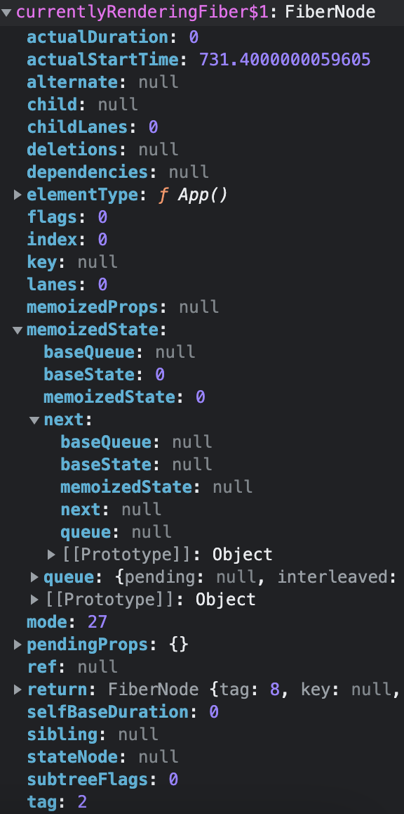

# useEffect

在`Function Component` 中调用 `useEffect`如下：
```js
function App() {
  const [count, setCount] = React.useState(0)

  React.useEffect(() => {
    setTimeout(() => {
      setCount(count+1)
    }, 2000);
  })
  

  return (
    <div className="App">
      hello world {count}
    </div>
  );
}
```

## useEffect 入口
`useEffect`方法入口，后续可能会调用方法有`mountEffect` | `updateEffect`：
```ts
// 【传入两个参数，第一个是回调函数，第二个是影响的变量】
// HooksDispatcherOnMountInDEV
// HooksDispatcherOnMountWithHookTypesInDEV
// InvalidNestedHooksDispatcherOnMountInDEV
useEffect(
    create: () => (() => void) | void,
    deps: Array<mixed> | void | null,
): void {
    currentHookNameInDev = 'useEffect';
    warnInvalidHookAccess();
    mountHookTypesDev();
    return mountEffect(create, deps);
}
// HooksDispatcherOnUpdateInDEV
// HooksDispatcherOnRerenderInDEV
// InvalidNestedHooksDispatcherOnUpdateInDEV
// InvalidNestedHooksDispatcherOnRerenderInDEV
useEffect(
    create: () => (() => void) | void,
    deps: Array<mixed> | void | null,
): void {
    currentHookNameInDev = 'useEffect';
    updateHookTypesDev();
    return updateEffect(create, deps);
}
```

## useEffect 原理
### `mountEffect` => `mountEffectImpl` => `mountWorkInProgressHook` / `pushEffect`
`mountEffect`方法其实是调用`mountEffectImpl`：
```ts
function mountEffect(
  create: () => (() => void) | void,
  deps: Array<mixed> | void | null,
): void {
  if (
    __DEV__ &&
    (currentlyRenderingFiber.mode & StrictEffectsMode) !== NoMode
  ) {
    mountEffectImpl(
      MountPassiveDevEffect | PassiveEffect | PassiveStaticEffect,
      HookPassive,
      create,
      deps,
    );
  } else {
    mountEffectImpl(
      PassiveEffect | PassiveStaticEffect,
      HookPassive,
      create,
      deps,
    );
  }
}
```

`mountEffectImpl`首先构造一个空 `Hook` 对象作为全局唯一的 `workInProgressHook`，然后构造一个 `effect` 对象并存入 `Hook` 对象的 `memoizedState` 属性：
```ts
let currentlyRenderingFiber: Fiber = (null: any);
// Hooks are stored as a linked list on the fiber's memoizedState field. The
// current hook list is the list that belongs to the current fiber. The
// work-in-progress hook list is a new list that will be added to the
// work-in-progress fiber.
let currentHook: Hook | null = null;
let workInProgressHook: Hook | null = null;

function mountEffectImpl(
  fiberFlags: Flags,//【PassiveEffect】
  hookFlags: HookFlags,//【HookPassive】
  create: () => (() => void) | void,
  deps: Array<mixed> | void | null,
): void {
  //【构造一个空hook对象，与全局唯一的workInProgressHook链接起来】
  const hook = mountWorkInProgressHook();
  // 【deps是用户传入的依赖参数】
  const nextDeps = deps === undefined ? null : deps;
  currentlyRenderingFiber.flags |= fiberFlags;
  // 【调用pushEffect构造一个effect对象并赋值给hook的memoizedState】
  hook.memoizedState = pushEffect(
    HookHasEffect | hookFlags,
    create,
    undefined,
    nextDeps,
  );
}
```

`mountWorkInProgressHook`创建一个空 `Hook` 对象然后确定全局唯一的 `workInProgressHook` 为新构建的这个 `Hook`，并把新构建的 `Hook` 链接到之前的 `Hooks` 链表上，这个 `Hook` 链表存储在 `fiber` 的 `memoizedState`：
```ts
function mountWorkInProgressHook(): Hook {
  // memoizedState： useState中 保存 state 信息 ｜ useEffect 中 保存着 effect 对象 ｜ useMemo 中 保存的是缓存的值和 deps ｜ useRef 中保存的是 ref 对象。
  // baseQueue : usestate和useReducer中 保存最新的更新队列。
  // baseState ： usestate和useReducer中,一次更新中 ，产生的最新state值。
  // queue ： 保存待更新队列 pendingQueue ，更新函数 dispatch 等信息。
  // next: 指向下一个 hooks对象。
  const hook: Hook = {
    memoizedState: null,

    baseState: null,
    baseQueue: null,
    queue: null,

    next: null,
  };
  // 【hook用next链接起来】
  if (workInProgressHook === null) {
    // This is the first hook in the list
    currentlyRenderingFiber.memoizedState = workInProgressHook = hook;
  } else {
    // Append to the end of the list
    workInProgressHook = workInProgressHook.next = hook;
  }
  return workInProgressHook;
}
```

`pushEffect`构造一个 `effect` 对象，并把它加入当前 `fiber`（只能在 `function component` 中定义 `useEffect`，所以会挂在 `function component` 的`updateQueue` 上） 上已有的 `updateQueue`（一个单向循环链表），然后把这个 `effect` 对象返回：
```ts
let createFunctionComponentUpdateQueue: () => FunctionComponentUpdateQueue;

function pushEffect(
  tag: HookFlags,
  create: () => (() => void) | void,
  destroy: (() => void) | void,
  deps: Array<mixed> | void | null,
): Effect {
  // 【构造一个effect对象】
  const effect: Effect = {
    tag,
    create,
    destroy,
    deps,
    // Circular
    next: (null: any),
  };

  // 【构造一个环状单向链effect的过程】
  // 【componentUpdateQueue是当前正在渲染过程中的fiber的updateQueue】
  let componentUpdateQueue: null | FunctionComponentUpdateQueue =
    (currentlyRenderingFiber.updateQueue: any);
  // 【当前updateQueue为空，创建一个，然后用构造的effect对象作为lastEffect加入updateQueue】
  if (componentUpdateQueue === null) {
    componentUpdateQueue = createFunctionComponentUpdateQueue();//【{"lastEffect": null,"stores": null}】
    currentlyRenderingFiber.updateQueue = (componentUpdateQueue: any);
    componentUpdateQueue.lastEffect = effect.next = effect;
  } else {
    // 【从updateQueue获取lastEffect】
    const lastEffect = componentUpdateQueue.lastEffect;
    if (lastEffect === null) {
      componentUpdateQueue.lastEffect = effect.next = effect;
    } else {
      const firstEffect = lastEffect.next;
      lastEffect.next = effect;
      effect.next = firstEffect;
      componentUpdateQueue.lastEffect = effect;
    }
  }
  return effect;
}
```

### `updateEffect` => `updateEffectImpl` => `updateWorkInProgressHook` / `pushEffect`
`updateEffect`方法其实是调用`updateEffectImpl`：
```ts
function updateEffect(
  create: () => (() => void) | void,
  deps: Array<mixed> | void | null,
): void {
  updateEffectImpl(PassiveEffect, HookPassive, create, deps);
}
```

`updateEffectImpl`做两件事，一个是更新当前 `hook`，另一个是更新当前 `hook` 的 `memorizedState`：
```ts
// The work-in-progress fiber. I've named it differently to distinguish it from
// the work-in-progress hook.
let currentlyRenderingFiber: Fiber = (null: any);
// Hooks are stored as a linked list on the fiber's memoizedState field. The
// current hook list is the list that belongs to the current fiber. The
// work-in-progress hook list is a new list that will be added to the
// work-in-progress fiber.
let currentHook: Hook | null = null;
let workInProgressHook: Hook | null = null;

function updateEffectImpl(
  fiberFlags: Flags,
  hookFlags: HookFlags,
  create: () => (() => void) | void,
  deps: Array<mixed> | void | null,
): void {
  const hook = updateWorkInProgressHook();
  const nextDeps = deps === undefined ? null : deps;
  let destroy = undefined;

  // currentHook is null when rerendering after a render phase state update.
  if (currentHook !== null) {
    const prevEffect = currentHook.memoizedState;
    destroy = prevEffect.destroy;
    if (nextDeps !== null) {
      const prevDeps = prevEffect.deps;
      // 【对比current树的依赖deps和要更新的树的依赖deps是否发生变化】
      if (areHookInputsEqual(nextDeps, prevDeps)) {
        hook.memoizedState = pushEffect(hookFlags, create, destroy, nextDeps);
        return;
      }
    }
  }

  currentlyRenderingFiber.flags |= fiberFlags;
  // 【更新memoizedState】
  hook.memoizedState = pushEffect(
    HookHasEffect | hookFlags,
    create,
    destroy,
    nextDeps,
  );
}
```

`updateWorkInProgressHook`其实就是要确定两个内容 `nextCurrentHook` 和 `nextWorkInProgressHook`，根据是否存在 `currentHook` 或者 `nextWorkInProgressHook` 来进行复用，`currentHook` 就是当前 `workInProgressFiber` 对应的 `currentFiber` 上的 `hook`，`nextWorkInProgressHook` 存在的话其实就是如果多次调用 `FunctionComponent` 的情况下上一次调用时的 `hook`。
```ts
// Hooks are stored as a linked list on the fiber's memoizedState field. The
// current hook list is the list that belongs to the current fiber. The
// work-in-progress hook list is a new list that will be added to the
// work-in-progress fiber.
let currentHook: Hook | null = null;
let workInProgressHook: Hook | null = null;
// The work-in-progress fiber. I've named it differently to distinguish it from
// the work-in-progress hook.
let currentlyRenderingFiber: Fiber = (null: any);

function updateWorkInProgressHook(): Hook {
  // This function is used both for updates and for re-renders triggered by a
  // render phase update. It assumes there is either a current hook we can
  // clone, or a work-in-progress hook from a previous render pass that we can
  // use as a base.
  // 【current hook list】
  // 【workInProgress hook list】

  // 【确定currentFiber上的下一个的hook，nextCurrentHook直接复用之】
  let nextCurrentHook: null | Hook;
  if (currentHook === null) {
    // 【第一个hook】
    // 【获取workInProgressFiber对应的currentFiber】
    const current = currentlyRenderingFiber.alternate;
    if (current !== null) {
      nextCurrentHook = current.memoizedState;
    } else {
      nextCurrentHook = null;
    }
  } else {
    nextCurrentHook = currentHook.next;
  }

  // 【确定下一个需要work的hook，一种复用多次执行函数组件时上一次执行的hook状态，另一种就是直接去当前workInProgressHook的next hook】
  let nextWorkInProgressHook: null | Hook;
  if (workInProgressHook === null) {
    nextWorkInProgressHook = currentlyRenderingFiber.memoizedState;
  } else {
    nextWorkInProgressHook = workInProgressHook.next;
  }

  // 【分支1：复用上一次执行函数组件的hook】
  if (nextWorkInProgressHook !== null) {
    // 【执行了多次函数组件的情况，nextWorkInProgressHook复用上一次执行的hook】
    // There's already a work-in-progress. Reuse it.
    workInProgressHook = nextWorkInProgressHook;
    nextWorkInProgressHook = workInProgressHook.next;

    currentHook = nextCurrentHook;
  } else {
  // 【分支2：复用对应currentFiber的hook】
    // Clone from the current hook.
    if (nextCurrentHook === null) {
      const currentFiber = currentlyRenderingFiber.alternate;
      if (currentFiber === null) {
        // This is the initial render. This branch is reached when the component
        // suspends, resumes, then renders an additional hook.
        // Should never be reached because we should switch to the mount dispatcher first.
        throw new Error(
          'Update hook called on initial render. This is likely a bug in React. Please file an issue.',
        );
      } else {
        // This is an update. We should always have a current hook.
        throw new Error('Rendered more hooks than during the previous render.');
      }
    }

    currentHook = nextCurrentHook;

    const newHook: Hook = {
      memoizedState: currentHook.memoizedState,

      baseState: currentHook.baseState,
      baseQueue: currentHook.baseQueue,
      queue: currentHook.queue,

      next: null,
    };

    if (workInProgressHook === null) {
      // This is the first hook in the list.
      currentlyRenderingFiber.memoizedState = workInProgressHook = newHook;
    } else {
      // Append to the end of the list.
      workInProgressHook = workInProgressHook.next = newHook;
    }
  }
  // 【返回当前需要处理的hook】
  return workInProgressHook;
}
```

## useEffect 实际例子
看一个实际例子如下：
```js
function App() {
  const [count, setCount] = React.useState(0)

  React.useEffect(() => {
      setCount(count+1)
  })
  
  return (
    <div className="App">
      hello world {count}
      <div onClick={()=>{setCount(1)}}>点我+1</div>
    </div>
  );
}
```
这个 `function component` 对应的 `fiber` 如下：



可以看到 `fiber` 的 `memoizedState` 存储了一个 `hook` 链表有两个 `hook` 用 `next` 链接，第一个是 `useState hook`，第二个是 `useEffect hook`。第一个 `hook` 对应的 `memoizedState` 是值，第二个 `hook` 对应的 `memoizedState` 是一个 `effect` 对象：
```json
{
    "memoizedState": 0,
    "baseState": 0,
    "baseQueue": null,
    "queue": {
        "pending": null,
        "interleaved": null,
        "lanes": 0,
        "lastRenderedState": 0
    },
    "next": {
        "memoizedState": {
          "tag": 9,
          "create": ()=>{...},
          "destroy": undefined,
          "deps": null,
          "next": {
            "tag": 9,
            "create": ()=>{...},
            "destroy": undefined,
            "deps": null,
            "next": {},
          },
        },
        "baseState": null,
        "baseQueue": null,
        "queue": null,
        "next": null
    }
}
```
