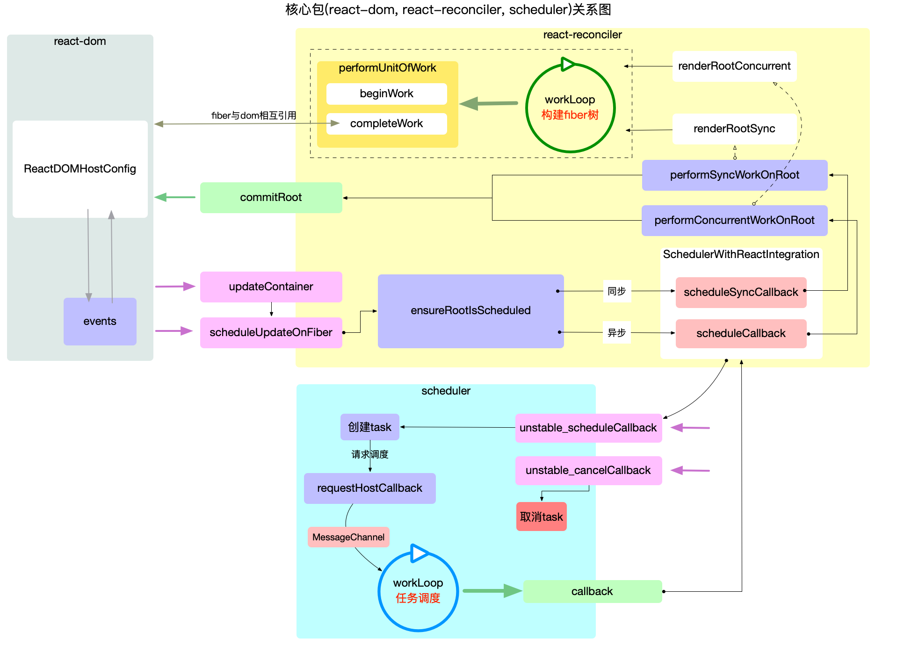

# React 项目结构

目前看的源码基于`18.2.0`版本：

```text
react-main
├── fixtures        # 测试项目
├── scripts         # 各种工具链的脚本，比如git、jest、eslint等
├── pacakages       # 核心代码
    ├── react                  # 核心API等，React Hooks等
    ├── react-dom              # DOM和服务器端SSR渲染方法入口
    ├── react-reconciler       # 协调器Reconciler的实现
    ├── scheduler              # 调度器Scheduler
    ├── shared                 # 公共方法等
```

## react

`React`的核心，包含所有全局 `React API`，如：

- `React.createElement`
- `React.Component`
- `React.Children`
- `Hooks`

这些 API 是全平台通用的，它不包含`ReactDOM`、`ReactNative`等平台特定的代码，在 `NPM` 上作为单独的一个包发布。

## react-dom

`DOM` 、 `SSR` 渲染等方法的入口：

- react-dom                 # 注意这同时是DOM和SSR的入口

## react-reconciler

协调器，实现了 `render` 、`commit` 两个过程

- react-reconciler          # 协调器的实现，你可以用它构建自己的Renderer

## scheduler

`Scheduler` 调度器的实现。

- scheduler                 # 调度器的实现

## shared

其他模块公用的方法和全局变量等，比如在`shared/ReactSymbols.js`中保存`React`不同组件类型的定义：

```js
// ...
export const REACT_ELEMENT_TYPE: symbol = Symbol.for('react.element');
export const REACT_PORTAL_TYPE: symbol = Symbol.for('react.portal');
export const REACT_FRAGMENT_TYPE: symbol = Symbol.for('react.fragment');
export const REACT_STRICT_MODE_TYPE: symbol = Symbol.for('react.strict_mode');
export const REACT_PROFILER_TYPE: symbol = Symbol.for('react.profiler');
export const REACT_PROVIDER_TYPE: symbol = Symbol.for('react.provider');
export const REACT_CONTEXT_TYPE: symbol = Symbol.for('react.context');
// ...
```

## 试验性包的文件夹

`React`将自己流程中的一部分抽离出来，形成可以独立使用的包，由于他们是试验性质的，所以不被建议在生产环境使用。包括如下内容等：

- react-server        # 创建自定义SSR流
- react-client        # 创建自定义的流
- react-fetch         # 用于数据请求
- react-interactions  # 用于测试交互相关的内部特性，比如React的事件模型

## 其他

- react-art                 # canvas、svg 等内容的渲染
- react-native-renderer     # native入口
- react-noop-renderer       # 用于debug fiber

## React 渲染流程概览

`React` 是通过 `jsx` 描述页面结构的，经过 `babel` 等的编译会变成 `render function`，`render function` 执行结果就是 `React Element` 的实例。`React` 会把 `React Element` 转换成 `fiber`，然后再渲染。

当前屏幕上显示内容对应的 `Fiber` 树称为 `current Fiber` 树，正在内存中构建的 `Fiber` 树称为 `workInProgress Fiber` 树。`React` 应用的根节点通过使 `current` 指针在不同 `Fiber` 树的 `rootFiber` 间切换来完成 `current Fiber` 树指向的切换。

首次执行`ReactDOM.render`会创建 `fiberRoot` 和 `rootFiber`。其中`fiberRoot`是整个应用的根节点，`rootFiber`是`<App/>`所在组件树的根节点。

整体渲染流程分成了两个大的阶段：

1. `render` 阶段：从 `React Element` 转换成 `fiber`，并且对需要操作的节点打上 `flags` 的标记，这个过程是可以打断的。

- 由 `scheduler` 调度器进行不同优先级任务排序。
- 从 `React Element` 转成 `fiber` 的过程叫做 `reconcile` 协调。

2. `commit` 阶段：对有 `flags` 标记的 `fiber` 节点进行 `DOM` 操作，并执行所有的 `effect` 副作用函数，这个过程是不能打断的。

```js
function createElement(type, props, ...children) {
  return {
    type,
    props: {
      ...props,
      children: children.map(child =>
        typeof child === "object"
          ? child
          : createTextElement(child)
      ),
    },
  }
}

function createTextElement(text) {
  return {
    type: "TEXT_ELEMENT",
    props: {
      nodeValue: text,
      children: [],
    },
  }
}

function createDom(fiber) {
  const dom =
    fiber.type == "TEXT_ELEMENT"
      ? document.createTextNode("")
      : document.createElement(fiber.type)

  updateDom(dom, {}, fiber.props)

  return dom
}

const isEvent = key => key.startsWith("on")
const isProperty = key =>
  key !== "children" && !isEvent(key)
const isNew = (prev, next) => key =>
  prev[key] !== next[key]
const isGone = (prev, next) => key => !(key in next)
function updateDom(dom, prevProps, nextProps) {
  //Remove old or changed event listeners
  Object.keys(prevProps)
    .filter(isEvent)
    .filter(
      key =>
        !(key in nextProps) ||
        isNew(prevProps, nextProps)(key)
    )
    .forEach(name => {
      const eventType = name
        .toLowerCase()
        .substring(2)
      dom.removeEventListener(
        eventType,
        prevProps[name]
      )
    })

  // Remove old properties
  Object.keys(prevProps)
    .filter(isProperty)
    .filter(isGone(prevProps, nextProps))
    .forEach(name => {
      dom[name] = ""
    })

  // Set new or changed properties
  Object.keys(nextProps)
    .filter(isProperty)
    .filter(isNew(prevProps, nextProps))
    .forEach(name => {
      dom[name] = nextProps[name]
    })

  // Add event listeners
  Object.keys(nextProps)
    .filter(isEvent)
    .filter(isNew(prevProps, nextProps))
    .forEach(name => {
      const eventType = name
        .toLowerCase()
        .substring(2)
      dom.addEventListener(
        eventType,
        nextProps[name]
      )
    })
}

function commitRoot() {
  deletions.forEach(commitWork)
  commitWork(wipRoot.child)
  currentRoot = wipRoot
  wipRoot = null
}

function commitWork(fiber) {
  if (!fiber) {
    return
  }

  let domParentFiber = fiber.parent
  while (!domParentFiber.dom) {
    domParentFiber = domParentFiber.parent
  }
  const domParent = domParentFiber.dom

  if (
    fiber.effectTag === "PLACEMENT" &&
    fiber.dom != null
  ) {
    domParent.appendChild(fiber.dom)
  } else if (
    fiber.effectTag === "UPDATE" &&
    fiber.dom != null
  ) {
    updateDom(
      fiber.dom,
      fiber.alternate.props,
      fiber.props
    )
  } else if (fiber.effectTag === "DELETION") {
    commitDeletion(fiber, domParent)
  }

  commitWork(fiber.child)
  commitWork(fiber.sibling)
}

function commitDeletion(fiber, domParent) {
  if (fiber.dom) {
    domParent.removeChild(fiber.dom)
  } else {
    commitDeletion(fiber.child, domParent)
  }
}

function render(element, container) {
  wipRoot = {
    dom: container,
    props: {
      children: [element],
    },
    alternate: currentRoot,
  }
  deletions = []
  nextUnitOfWork = wipRoot
}

let nextUnitOfWork = null
let currentRoot = null
let wipRoot = null
let deletions = null

function workLoop(deadline) {
  let shouldYield = false
  while (nextUnitOfWork && !shouldYield) {
    nextUnitOfWork = performUnitOfWork(
      nextUnitOfWork
    )
    shouldYield = deadline.timeRemaining() < 1
  }

  if (!nextUnitOfWork && wipRoot) {
    commitRoot()
  }

  requestIdleCallback(workLoop)
}

requestIdleCallback(workLoop)

function performUnitOfWork(fiber) {
  const isFunctionComponent =
    fiber.type instanceof Function
  if (isFunctionComponent) {
    updateFunctionComponent(fiber)
  } else {
    updateHostComponent(fiber)
  }
  if (fiber.child) {
    return fiber.child
  }
  let nextFiber = fiber
  while (nextFiber) {
    if (nextFiber.sibling) {
      return nextFiber.sibling
    }
    nextFiber = nextFiber.parent
  }
}

let wipFiber = null
let hookIndex = null

function updateFunctionComponent(fiber) {
  wipFiber = fiber
  hookIndex = 0
  wipFiber.hooks = []
  const children = [fiber.type(fiber.props)]
  reconcileChildren(fiber, children)
}

function useState(initial) {
  const oldHook =
    wipFiber.alternate &&
    wipFiber.alternate.hooks &&
    wipFiber.alternate.hooks[hookIndex]
  const hook = {
    state: oldHook ? oldHook.state : initial,
    queue: [],
  }

  const actions = oldHook ? oldHook.queue : []
  actions.forEach(action => {
    hook.state = action(hook.state)
  })

  const setState = action => {
    hook.queue.push(action)
    wipRoot = {
      dom: currentRoot.dom,
      props: currentRoot.props,
      alternate: currentRoot,
    }
    nextUnitOfWork = wipRoot
    deletions = []
  }

  wipFiber.hooks.push(hook)
  hookIndex++
  return [hook.state, setState]
}

function updateHostComponent(fiber) {
  if (!fiber.dom) {
    fiber.dom = createDom(fiber)
  }
  reconcileChildren(fiber, fiber.props.children)
}

function reconcileChildren(wipFiber, elements) {
  let index = 0
  let oldFiber =
    wipFiber.alternate && wipFiber.alternate.child
  let prevSibling = null

  while (
    index < elements.length ||
    oldFiber != null
  ) {
    const element = elements[index]
    let newFiber = null

    const sameType =
      oldFiber &&
      element &&
      element.type == oldFiber.type

    if (sameType) {
      newFiber = {
        type: oldFiber.type,
        props: element.props,
        dom: oldFiber.dom,
        parent: wipFiber,
        alternate: oldFiber,
        effectTag: "UPDATE",
      }
    }
    if (element && !sameType) {
      newFiber = {
        type: element.type,
        props: element.props,
        dom: null,
        parent: wipFiber,
        alternate: null,
        effectTag: "PLACEMENT",
      }
    }
    if (oldFiber && !sameType) {
      oldFiber.effectTag = "DELETION"
      deletions.push(oldFiber)
    }

    if (oldFiber) {
      oldFiber = oldFiber.sibling
    }

    if (index === 0) {
      wipFiber.child = newFiber
    } else if (element) {
      prevSibling.sibling = newFiber
    }

    prevSibling = newFiber
    index++
  }
}

const Didact = {
  createElement,
  render,
  useState,
}

/** @jsx Didact.createElement */
function Counter() {
  const [state, setState] = Didact.useState(1)
  return (
    <h1 onClick={() => setState(c => c + 1)}>
      Count: {state}
    </h1>
  )
}
const element = <Counter />
const container = document.getElementById("root")
Didact.render(element, container)
```

## 关键词

- `fiberRootNode`：全局唯一根节点
- `rootFiber`：`fiber`树的根节点
- `fiberNode`：用来表示`React-Element`的数据结构
- `Reconciler`：协调器，构建`fiber`数据结构相关，根据最新状态构建新的 `fiber` 树，与之前的 `fiber` 树进行 `diff` 对比，对 `fiber` 节点标记不同的副作用
- `Scheduler`：调度器，用来调度任务执行顺序，让浏览器的每一帧优先执行高优先级的任务
- `effect`：渲染、更新过程中的副作用

## 总结



## 参考资料

[build-your-own-react](https://pomb.us/build-your-own-react/)

[React技术揭秘](https://react.iamkasong.com/preparation/file.html#%E9%A1%B6%E5%B1%82%E7%9B%AE%E5%BD%95)

[React 应用的宏观包结构(web 开发)](https://7km.top/main/macro-structure#%E5%AE%8F%E8%A7%82%E6%80%BB%E8%A7%88)

[A look inside React Fiber](https://makersden.io/blog/look-inside-fiber)

[React-Fiber-Architecture](https://github.com/SaeedMalikx/React-Fiber-Architecture)
