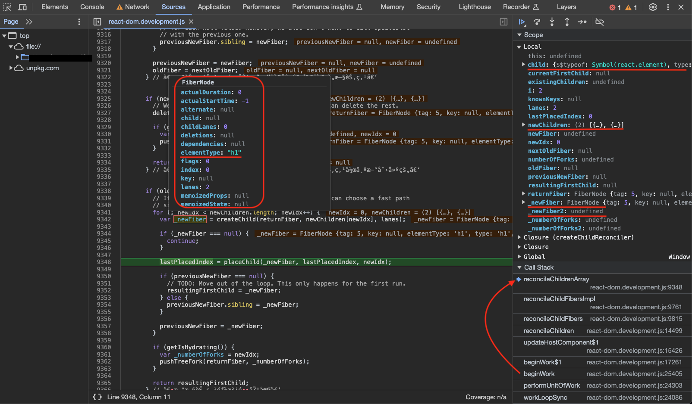

# React 的初始化过程和挂载过程

## React-Element

在开启`render`、`commit`过程之前，`React`会首先使用`babel`将`JSX`转化为`createElement`方法，从而得到的是`React-Element`对象。

- `$$typeof`: `React-Element`的类型例如`REACT_ELEMENT_TYPE`、`REACT_CONTEXT_TYPE`、`REACT_PROVIDER_TYPE`等；
- `type`: 可以是html节点类型等，取决于该元素本身；
- `key`: key，初始值为null；
- `props`: props包含子节点信息等；
- `_owner`: 父节点fiber；

```ts
const element = {
  // This tag allows us to uniquely identify this as a React Element
  $$typeof: REACT_ELEMENT_TYPE,

  // Built-in properties that belong on the element
  type: type,
  key: key,
  ref: ref,
  props: props,

  // Record the component responsible for creating this element.
  _owner: owner,
}
```

```ts
// 【packages/react/src/ReactElement.js】
/**
 * Create and return a new ReactElement of the given type.
 * See https://reactjs.org/docs/react-api.html#createelement
 */
export function createElement(type, config, children) {
  let propName;

  // Reserved names are extracted
  const props = {};

  let key = null;
  let ref = null;
  let self = null;
  let source = null;

  if (config != null) {
    if (hasValidRef(config)) {
      ref = config.ref;

      if (__DEV__) {
        warnIfStringRefCannotBeAutoConverted(config);
      }
    }
    if (hasValidKey(config)) {
      if (__DEV__) {
        checkKeyStringCoercion(config.key);
      }
      key = '' + config.key;
    }

    self = config.__self === undefined ? null : config.__self;
    source = config.__source === undefined ? null : config.__source;
    // Remaining properties are added to a new props object
    for (propName in config) {
      if (
        hasOwnProperty.call(config, propName) &&
        !RESERVED_PROPS.hasOwnProperty(propName)
      ) {
        props[propName] = config[propName];
      }
    }
  }

  // Children can be more than one argument, and those are transferred onto
  // the newly allocated props object.
  const childrenLength = arguments.length - 2;
  if (childrenLength === 1) {
    props.children = children;
  } else if (childrenLength > 1) {
    const childArray = Array(childrenLength);
    for (let i = 0; i < childrenLength; i++) {
      childArray[i] = arguments[i + 2];
    }
    if (__DEV__) {
      if (Object.freeze) {
        Object.freeze(childArray);
      }
    }
    props.children = childArray;
  }

  // Resolve default props
  if (type && type.defaultProps) {
    const defaultProps = type.defaultProps;
    for (propName in defaultProps) {
      if (props[propName] === undefined) {
        props[propName] = defaultProps[propName];
      }
    }
  }
  if (__DEV__) {
    if (key || ref) {
      const displayName =
        typeof type === 'function'
          ? type.displayName || type.name || 'Unknown'
          : type;
      if (key) {
        defineKeyPropWarningGetter(props, displayName);
      }
      if (ref) {
        defineRefPropWarningGetter(props, displayName);
      }
    }
  }
  return ReactElement(
    type,
    key,
    ref,
    self,
    source,
    ReactCurrentOwner.current,
    props,
  );
}
/**
 * Factory method to create a new React element. This no longer adheres to
 * the class pattern, so do not use new to call it. Also, instanceof check
 * will not work. Instead test $$typeof field against Symbol.for('react.element') to check
 * if something is a React Element.
 *
 * @param {*} type
 * @param {*} props
 * @param {*} key
 * @param {string|object} ref
 * @param {*} owner
 * @param {*} self A *temporary* helper to detect places where `this` is
 * different from the `owner` when React.createElement is called, so that we
 * can warn. We want to get rid of owner and replace string `ref`s with arrow
 * functions, and as long as `this` and owner are the same, there will be no
 * change in behavior.
 * @param {*} source An annotation object (added by a transpiler or otherwise)
 * indicating filename, line number, and/or other information.
 * @internal
 */
function ReactElement(type, key, ref, self, source, owner, props) {
  const element = {
    // This tag allows us to uniquely identify this as a React Element
    $$typeof: REACT_ELEMENT_TYPE,

    // Built-in properties that belong on the element
    type: type,
    key: key,
    ref: ref,
    props: props,

    // Record the component responsible for creating this element.
    _owner: owner,
  };

  if (__DEV__) {
    // The validation flag is currently mutative. We put it on
    // an external backing store so that we can freeze the whole object.
    // This can be replaced with a WeakMap once they are implemented in
    // commonly used development environments.
    element._store = {};

    // To make comparing ReactElements easier for testing purposes, we make
    // the validation flag non-enumerable (where possible, which should
    // include every environment we run tests in), so the test framework
    // ignores it.
    Object.defineProperty(element._store, 'validated', {
      configurable: false,
      enumerable: false,
      writable: true,
      value: false,
    });
    // self and source are DEV only properties.
    Object.defineProperty(element, '_self', {
      configurable: false,
      enumerable: false,
      writable: false,
      value: self,
    });
    // Two elements created in two different places should be considered
    // equal for testing purposes and therefore we hide it from enumeration.
    Object.defineProperty(element, '_source', {
      configurable: false,
      enumerable: false,
      writable: false,
      value: source,
    });
    if (Object.freeze) {
      Object.freeze(element.props);
      Object.freeze(element);
    }
  }

  return element;
}
```

## 旧 - render方法，创建FiberRootNode，进入updateContainer

我们初始化一个项目（旧版）如下，可以看到引入了 `react-dom` 模块，调用了 `render` 方法：

```js
import React from 'react';
import ReactDOM from 'react-dom';
import App from './App';

ReactDOM.render(
  <App />,
  document.getElementById('root')
);
```

首次挂载流程如下：

`render` => `legacyRenderSubtreeIntoContainer` => `legacyCreateRootFromDOMContainer` => `updateContainer`

更新流程如下：

`render` => `legacyRenderSubtreeIntoContainer` => `updateContainer`

其中比较关键的有两个步骤：

1. `legacyCreateRootFromDOMContainer`方法创建`FiberRootNode`，是全局唯一的节点，是所有内容的根节点，`FiberRootNode`的`containerInfo`属性存放的就是对应用户传入的希望作为这个应用根元素的DOM对象；
2. 关键方法`updateContainer`，由这个方法进入`scheduleUpdateOnFiber`调度过程，继而进入`render`/`commit`过程，继而进行DOM挂或更新；

```ts
// 【packages/react-dom/src/client/ReactDOMLegacy.js】
export function render(
  element: React$Element<any>,
  container: Container,
  callback: ?Function,
): React$Component<any, any> | PublicInstance | null {
  // 【省略代码...】

  if (!isValidContainerLegacy(container)) {
    throw new Error('Target container is not a DOM element.');
  }

  // 【省略代码...】

  return legacyRenderSubtreeIntoContainer(
    null,
    element,
    container,
    false,
    callback,
  );
}

function legacyRenderSubtreeIntoContainer(
  parentComponent: ?React$Component<any, any>,
  children: ReactNodeList,
  container: Container,
  forceHydrate: boolean,
  callback: ?Function,
): React$Component<any, any> | PublicInstance | null {
  // 【省略代码...】

  const maybeRoot = container._reactRootContainer;
  let root: FiberRoot;
  if (!maybeRoot) {
    // 【初次挂载】
    // Initial mount
    // 【构造FiberRootNode】
    root = legacyCreateRootFromDOMContainer(
      container,
      children,
      parentComponent,
      callback,
      forceHydrate,
    );
  } else {
    // 【更新挂载】
    root = maybeRoot;
    if (typeof callback === 'function') {
      const originalCallback = callback;
      callback = function () {
        const instance = getPublicRootInstance(root);
        originalCallback.call(instance);
      };
    }
    // Update
    updateContainer(children, root, parentComponent, callback);
  }
  return getPublicRootInstance(root);
}

// 【构造FiberRootNode】
function legacyCreateRootFromDOMContainer(
  container: Container,
  initialChildren: ReactNodeList,
  parentComponent: ?React$Component<any, any>,
  callback: ?Function,
  isHydrationContainer: boolean,
): FiberRoot {
  if (isHydrationContainer) {
    if (typeof callback === 'function') {
      const originalCallback = callback;
      callback = function () {
        const instance = getPublicRootInstance(root);
        originalCallback.call(instance);
      };
    }

    const root: FiberRoot = createHydrationContainer(
      initialChildren,
      callback,
      container,
      LegacyRoot,
      null, // hydrationCallbacks
      false, // isStrictMode
      false, // concurrentUpdatesByDefaultOverride,
      '', // identifierPrefix
      noopOnRecoverableError,
      // TODO(luna) Support hydration later
      null,
    );
    container._reactRootContainer = root;
    markContainerAsRoot(root.current, container);

    const rootContainerElement =
      container.nodeType === COMMENT_NODE ? container.parentNode : container;
    // $FlowFixMe[incompatible-call]
    listenToAllSupportedEvents(rootContainerElement);

    flushSync();
    return root;
  } else {
    // First clear any existing content.
    clearContainer(container);

    if (typeof callback === 'function') {
      const originalCallback = callback;
      callback = function () {
        const instance = getPublicRootInstance(root);
        originalCallback.call(instance);
      };
    }

    const root = createContainer(
      container,
      LegacyRoot,
      null, // hydrationCallbacks
      false, // isStrictMode
      false, // concurrentUpdatesByDefaultOverride,
      '', // identifierPrefix
      noopOnRecoverableError, // onRecoverableError
      null, // transitionCallbacks
    );
    container._reactRootContainer = root;
    markContainerAsRoot(root.current, container);

    const rootContainerElement =
      container.nodeType === COMMENT_NODE ? container.parentNode : container;
    // $FlowFixMe[incompatible-call]
    listenToAllSupportedEvents(rootContainerElement);

    // Initial mount should not be batched.
    flushSync(() => {
      updateContainer(initialChildren, root, parentComponent, callback);
    });

    return root;
  }
}
```

## 新 - createRoot方法，创建FiberRootNode，进入updateContainer

我们初始化一个项目（新版）如下，可以看到先调用 `createRoot` 方法创建根实例，然后同样调用了 `render` 方法：

```ts
// 【1.用户调用createRoot】
const root = ReactDOM.createRoot(rootElement);
// 【2.用户调用render】
root.render(<App />);
```

使用旧版`render`方法可以看到会有告警，提示用户使用最新的 `createRoot` 方法，那我们看一下`createRoot`其中关键的两个步骤如下：

1. 创建根容器的方法 `createContainer` 实际调用了 `createFiberRoot` 方法生成 `FiberRootNode` 全局唯一的节点；
2. 将 `FiberRootNode` 实例传入 `ReactDOMRoot` 构造函数最终生成并返回 `ReactDOMRoot` 实例，它包含一个 `_internalRoot` 属性，存储的就是 `FiberRootNode` 实例

`createRoot` => `createRootImpl` => `createContainer` => `createFiberRoot` => `return new ReactDOMRoot(root)`

```ts
// 【packages/react-dom/src/client/ReactDOM.js】
// 【createRoot】
function createRoot(
  container: Element | Document | DocumentFragment,
  options?: CreateRootOptions,
): RootType {
  // 【省略代码...】
  return createRootImpl(container, options);
}

// 【createRootImpl as createRoot】
export function createRoot(
  container: Element | Document | DocumentFragment,
  options?: CreateRootOptions,
): RootType {
  // 【省略代码...】

  warnIfReactDOMContainerInDEV(container);

  let isStrictMode = false;
  let concurrentUpdatesByDefaultOverride = false;
  let identifierPrefix = '';
  let onRecoverableError = defaultOnRecoverableError;
  let transitionCallbacks = null;

  if (options !== null && options !== undefined) {
    // 【省略代码...】
    if (options.unstable_strictMode === true) {
      isStrictMode = true;
    }
    if (
      allowConcurrentByDefault &&
      options.unstable_concurrentUpdatesByDefault === true
    ) {
      concurrentUpdatesByDefaultOverride = true;
    }
    if (options.identifierPrefix !== undefined) {
      identifierPrefix = options.identifierPrefix;
    }
    if (options.onRecoverableError !== undefined) {
      onRecoverableError = options.onRecoverableError;
    }
    if (options.unstable_transitionCallbacks !== undefined) {
      transitionCallbacks = options.unstable_transitionCallbacks;
    }
  }
  // 【生成一个FiberRootNode】
  const root = createContainer(
    container,
    ConcurrentRoot,
    null,
    isStrictMode,
    concurrentUpdatesByDefaultOverride,
    identifierPrefix,
    onRecoverableError,
    transitionCallbacks,
  );
  markContainerAsRoot(root.current, container);

  if (enableFloat) {
    // Set the default dispatcher to the client dispatcher
    Dispatcher.current = ReactDOMClientDispatcher;
  }
  const rootContainerElement: Document | Element | DocumentFragment =
    container.nodeType === COMMENT_NODE
      ? (container.parentNode: any)
      : container;
  // 【对原生事件进行监听】
  listenToAllSupportedEvents(rootContainerElement);
  
  // 【生成一个ReactDOMRoot实例】
  // $FlowFixMe[invalid-constructor] Flow no longer supports calling new on functions
  return new ReactDOMRoot(root);
}

function ReactDOMRoot(internalRoot: FiberRoot) {
  this._internalRoot = internalRoot;
}

export function createContainer(
  containerInfo: Container,
  tag: RootTag,
  hydrationCallbacks: null | SuspenseHydrationCallbacks,
  isStrictMode: boolean,
  concurrentUpdatesByDefaultOverride: null | boolean,
  identifierPrefix: string,
  onRecoverableError: (error: mixed) => void,
  transitionCallbacks: null | TransitionTracingCallbacks,
): OpaqueRoot {
  const hydrate = false;
  const initialChildren = null;
  //【生成FiberRootNode】
  return createFiberRoot(
    containerInfo,
    tag,
    hydrate,
    initialChildren,
    hydrationCallbacks,
    isStrictMode,
    concurrentUpdatesByDefaultOverride,
    identifierPrefix,
    onRecoverableError,
    transitionCallbacks,
  );
}
```

`createFiberRoot`首先调用 `new FiberRootNode` 创建一个全局根 `FiberRootNode` 实例，首次渲染所以需要调用 `createHostRootFiber` 创建一个 `FiberNode` 给 `FiberRootNode` 的 `current` 属性赋值，作为此次渲染树的根节点，它是一个`fiberNode`实例，tag为3表示`HostRoot`节点。

```ts
// 【packages/react-dom/src/client/ReactDOM.js】
export function createFiberRoot(
  containerInfo: Container,
  tag: RootTag,
  hydrate: boolean,
  initialChildren: ReactNodeList,
  hydrationCallbacks: null | SuspenseHydrationCallbacks,
  isStrictMode: boolean,
  concurrentUpdatesByDefaultOverride: null | boolean,
  // TODO: We have several of these arguments that are conceptually part of the
  // host config, but because they are passed in at runtime, we have to thread
  // them through the root constructor. Perhaps we should put them all into a
  // single type, like a DynamicHostConfig that is defined by the renderer.
  identifierPrefix: string,
  onRecoverableError: null | ((error: mixed) => void),
  transitionCallbacks: null | TransitionTracingCallbacks,
): FiberRoot {
  // 【生成FiberRootNode】
  // $FlowFixMe[invalid-constructor] Flow no longer supports calling new on functions
  const root: FiberRoot = (new FiberRootNode(
    containerInfo,
    tag,
    hydrate,
    identifierPrefix,
    onRecoverableError,
  ): any);
  if (enableSuspenseCallback) {
    root.hydrationCallbacks = hydrationCallbacks;
  }

  if (enableTransitionTracing) {
    root.transitionCallbacks = transitionCallbacks;
  }

  // Cyclic construction. This cheats the type system right now because
  // stateNode is any.
  // 【首次渲染fiberRootNode的current设置为一个虚拟的内容】
  const uninitializedFiber = createHostRootFiber(
    tag,
    isStrictMode,
    concurrentUpdatesByDefaultOverride,
  );
  root.current = uninitializedFiber;
  uninitializedFiber.stateNode = root;

  if (enableCache) {
    const initialCache = createCache();
    retainCache(initialCache);

    // The pooledCache is a fresh cache instance that is used temporarily
    // for newly mounted boundaries during a render. In general, the
    // pooledCache is always cleared from the root at the end of a render:
    // it is either released when render commits, or moved to an Offscreen
    // component if rendering suspends. Because the lifetime of the pooled
    // cache is distinct from the main memoizedState.cache, it must be
    // retained separately.
    root.pooledCache = initialCache;
    retainCache(initialCache);
    const initialState: RootState = {
      element: initialChildren,
      isDehydrated: hydrate,
      cache: initialCache,
    };
    uninitializedFiber.memoizedState = initialState;
  } else {
    const initialState: RootState = {
      element: initialChildren,
      isDehydrated: hydrate,
      cache: (null: any), // not enabled yet
    };
    uninitializedFiber.memoizedState = initialState;
  }

  initializeUpdateQueue(uninitializedFiber);

  return root;
}
```

`FiberRootNode` 构造函数如下：

```ts
function FiberRootNode(
  this: $FlowFixMe,
  containerInfo: any,
  // $FlowFixMe[missing-local-annot]
  tag,
  hydrate: any,
  identifierPrefix: any,
  onRecoverableError: any,
) {
  this.tag = tag;
  this.containerInfo = containerInfo;// 【全局根节点的DOM】
  this.pendingChildren = null;
  this.current = null;//【指向页面上显示的内容的fiber tree】
  this.pingCache = null;
  this.finishedWork = null;
  this.timeoutHandle = noTimeout;
  this.context = null;
  this.pendingContext = null;
  this.callbackNode = null;
  this.callbackPriority = NoLane;
  this.eventTimes = createLaneMap(NoLanes);
  this.expirationTimes = createLaneMap(NoTimestamp);

  this.pendingLanes = NoLanes;
  this.suspendedLanes = NoLanes;
  this.pingedLanes = NoLanes;
  this.expiredLanes = NoLanes;
  this.mutableReadLanes = NoLanes;
  this.finishedLanes = NoLanes;
  this.errorRecoveryDisabledLanes = NoLanes;

  this.entangledLanes = NoLanes;
  this.entanglements = createLaneMap(NoLanes);

  this.hiddenUpdates = createLaneMap(null);

  this.identifierPrefix = identifierPrefix;
  this.onRecoverableError = onRecoverableError;

  if (enableCache) {
    this.pooledCache = null;
    this.pooledCacheLanes = NoLanes;
  }

  if (supportsHydration) {
    this.mutableSourceEagerHydrationData = null;
  }

  if (enableSuspenseCallback) {
    this.hydrationCallbacks = null;
  }

  this.incompleteTransitions = new Map();
  if (enableTransitionTracing) {
    this.transitionCallbacks = null;
    const transitionLanesMap = (this.transitionLanes = []);
    for (let i = 0; i < TotalLanes; i++) {
      transitionLanesMap.push(null);
    }
  }

  if (enableProfilerTimer && enableProfilerCommitHooks) {
    this.effectDuration = 0;
    this.passiveEffectDuration = 0;
  }

  if (enableUpdaterTracking) {
    this.memoizedUpdaters = new Set();
    const pendingUpdatersLaneMap = (this.pendingUpdatersLaneMap = []);
    for (let i = 0; i < TotalLanes; i++) {
      pendingUpdatersLaneMap.push(new Set());
    }
  }

  // 【省略代码...】
}

export function createFiberRoot(
  containerInfo: Container,
  tag: RootTag,
  // ...
){}

export type RootTag = 0 | 1;

export const LegacyRoot = 0;
export const ConcurrentRoot = 1;
```

总结就是在用户调用 `createRoot` 方法之后，会生成一个全局唯一的根 `FiberRootNode` 实例，并将它放在 `ReactDOMRoot` 实例的 `_internalRoot` 属性上。

```ts
// 【1.用户调用createRoot，生成了FiberRootNode，返回一个】
const root = ReactDOM.createRoot(rootElement);
// 【2.用户调用render】
root.render(<App />);
```

可以看到第二步用户调用了 `render` 方法，这个 `render` 方法挂载在 `ReactDOMRoot` 原型对象上如下，随后和`legacy`模式一样进入`updateContainer`方法。`updateContainer`方法会进入`scheduleUpdateOnFiber`调度过程，继而进入`render`/`commit`过程，继而进行DOM挂或更新；

```ts
// $FlowFixMe[prop-missing] found when upgrading Flow
ReactDOMHydrationRoot.prototype.render = ReactDOMRoot.prototype.render =
  // $FlowFixMe[missing-this-annot]
  function (children: ReactNodeList): void {
    // 【获取根FiberRootNode对象】
    const root = this._internalRoot;
    if (root === null) {
      throw new Error('Cannot update an unmounted root.');
    }

    // 【省略代码...】
    // 【Children：react-element，root：FiberRootNode】
    updateContainer(children, root, null, null);
  };
```

## 初始化挂载过程

前文中可以知道无论是`ReactDOM.render`还是`ReactDOM.createRoot`以后再`render`，两者都会在创建完`FiberRootNode`对象后进入`updateContainer`方法如下：

1. 创建`lane`用于调制任务优先级；
2. 创建`update`任务，核心内容就是用户传入的需要渲染的组件(`<APP/>`)，后续`beginWork`/`completeWork`其实就是处理`update`任务形成`fiber`树的并挂载DOM的过程；
3. （旧版`ReactDOM.render`）为`current fiber`树装载任务，其实就是往`updateQueue`添加`update`任务，`updateQueue`始终是一个闭环，`update`任务之间用`next`链接，如果就一个`update`任务那么它的`next`指向自己；

```ts
// 【packages/react-reconciler/src/ReactFiberReconciler.js】
export function updateContainer(
  element: ReactNodeList,// 【用户传入的组件】
  container: OpaqueRoot,// 【全局根fiberRootNode】
  parentComponent: ?React$Component<any, any>,
  callback: ?Function,
): Lane {
  // 【省略代码...】

  const current = container.current;
  // 【1.创建lane（英文中是小巷，小路的意思），根据根FiberRootNode对象，用于后续安排任务优先级】
  const lane = requestUpdateLane(current);

  if (enableSchedulingProfiler) {
    markRenderScheduled(lane);
  }

  const context = getContextForSubtree(parentComponent);
  if (container.context === null) {
    container.context = context;
  } else {
    container.pendingContext = context;
  }

  // 【省略代码...】

  // 【2.创建一个update任务】
  const update = createUpdate(lane);
  // Caution: React DevTools currently depends on this property
  // being called "element".
  update.payload = {element};

  callback = callback === undefined ? null : callback;
  if (callback !== null) {
    // 【省略代码...】
    update.callback = callback;
  }

  // 【3. enqueueUpdate入参---fiber: Fiber,update: Update<State>,lane: Lane】
  const root = enqueueUpdate(current, update, lane);
  if (root !== null) {
    const eventTime = requestEventTime();
    scheduleUpdateOnFiber(root, current, lane, eventTime);
    entangleTransitions(root, current, lane);
  }

  return lane;
}

// 【packages/react-reconciler/src/ReactFiberClassUpdateQueue.js】
export function createUpdate(lane: Lane): Update<mixed> {
  const update: Update<mixed> = {
    lane,

    tag: UpdateState,
    payload: null,
    callback: null,

    next: null,
  };
  return update;
}

// 【packages/react-reconciler/src/ReactFiberClassUpdateQueue.js】
export function enqueueUpdate<State>(
  fiber: Fiber,
  update: Update<State>,
  lane: Lane,
): FiberRoot | null {
  const updateQueue = fiber.updateQueue;
  if (updateQueue === null) {
    // Only occurs if the fiber has been unmounted.
    return null;
  }

  const sharedQueue: SharedQueue<State> = (updateQueue: any).shared;

  // 【省略代码...】

  if (isUnsafeClassRenderPhaseUpdate(fiber)) {
    // This is an unsafe render phase update. Add directly to the update
    // queue so we can process it immediately during the current render.
    const pending = sharedQueue.pending;
    if (pending === null) {
      // 【sharedQueue.pending没有内容，说明当前update是第一个，将当前update的next设为自己，形成闭环】
      // This is the first update. Create a circular list.
      update.next = update;
    } else {
      // 【sharedQueue.pending有内容，将update插入其中，仍然形成闭环】
      update.next = pending.next;
      pending.next = update;
    }
    sharedQueue.pending = update;

    // Update the childLanes even though we're most likely already rendering
    // this fiber. This is for backwards compatibility in the case where you
    // update a different component during render phase than the one that is
    // currently renderings (a pattern that is accompanied by a warning).
    return unsafe_markUpdateLaneFromFiberToRoot(fiber, lane);
  } else {
    return enqueueConcurrentClassUpdate(fiber, sharedQueue, update, lane);
  }
}
```


### Scheduler - 第一步：update任务优先级等相关等准备工作

`updateContainer`方法最后会调用`scheduleUpdateOnFiber`，首先去处理一些优先级相关的内容并安排`update`任务。这里涉及到React设计运行的一个全新特性，新版的API`createRoot`就是使用`Concurrency`模式，官网对`Concurrency`的描述如下：

Concurrency is not a feature, per se. It’s a new behind-the-scenes mechanism that enables React to prepare multiple versions of your UI at the same time. React uses sophisticated techniques in its internal implementation, like priority queues and multiple buffering. But you won’t see those concepts anywhere in our public APIs.A key property of Concurrent React is that rendering is interruptible. When you first upgrade to React 18, before adding any concurrent features, updates are rendered the same as in previous versions of React — in a single, uninterrupted, synchronous transaction. With synchronous rendering, once an update starts rendering, nothing can interrupt it until the user can see the result on screen.

In a concurrent render, this is not always the case. React may start rendering an update, pause in the middle, then continue later. It may even abandon an in-progress render altogether. React guarantees that the UI will appear consistent even if a render is interrupted. To do this, it waits to perform DOM mutations until the end, once the entire tree has been evaluated. With this capability, React can prepare new screens in the background without blocking the main thread. This means the UI can respond immediately to user input even if it’s in the middle of a large rendering task, creating a fluid user experience.

[What is Concurrent React?](https://react.dev/blog/2022/03/29/react-v18#what-is-concurrent-react)

#### 任务调度阶段

`Concurrent`模式和原来的同步模式最大的不同点在于其是可打断的，有时间切片和优先级的概念，相当于渲染过程是可打断的，由框架去安排任务是否执行以及执行时机。

1. `scheduleUpdateOnFiber`调用`ensureRootIsScheduled`；
2. `ensureRootIsScheduled`根据一定的条件进入`scheduleSyncCallback`或者`scheduleCallback`，此处会确定任务的优先级；

```ts
// 【packages/react-reconciler/src/ReactFiberWorkLoop.js】
export function scheduleUpdateOnFiber(
  root: FiberRoot,
  fiber: Fiber,
  lane: Lane,
  eventTime: number,
) {
  // 【省略代码...】

  // Check if the work loop is currently suspended and waiting for data to
  // finish loading.
  if (
    workInProgressSuspendedReason === SuspendedOnData &&
    root === workInProgressRoot
  ) {
    // The incoming update might unblock the current render. Interrupt the
    // current attempt and restart from the top.
    prepareFreshStack(root, NoLanes);
    markRootSuspended(root, workInProgressRootRenderLanes);
  }

  // Mark that the root has a pending update.
  markRootUpdated(root, lane, eventTime);

  if (
    (executionContext & RenderContext) !== NoLanes &&
    root === workInProgressRoot
  ) {
    // This update was dispatched during the render phase. This is a mistake
    // if the update originates from user space (with the exception of local
    // hook updates, which are handled differently and don't reach this
    // function), but there are some internal React features that use this as
    // an implementation detail, like selective hydration.

    // 【省略代码...】
  } else {
    // This is a normal update, scheduled from outside the render phase. For
    // example, during an input event.
    // 【省略代码...】

    // 【进入后续任务安排】
    ensureRootIsScheduled(root, eventTime);
    
    // 【省略代码...】
  }
}

// 【给root创建一个唯一的task，并加入任务调度】
// Use this function to schedule a task for a root. There's only one task per
// root; if a task was already scheduled, we'll check to make sure the priority
// of the existing task is the same as the priority of the next level that the
// root has work on. This function is called on every update, and right before
// exiting a task.
function ensureRootIsScheduled(root: FiberRoot, currentTime: number) {
  const existingCallbackNode = root.callbackNode;

  // Check if any lanes are being starved by other work. If so, mark them as
  // expired so we know to work on those next.
  markStarvedLanesAsExpired(root, currentTime);

  // Determine the next lanes to work on, and their priority.
  const nextLanes = getNextLanes(
    root,
    root === workInProgressRoot ? workInProgressRootRenderLanes : NoLanes,
  );

  if (nextLanes === NoLanes) {
    // Special case: There's nothing to work on.
    if (existingCallbackNode !== null) {
      cancelCallback(existingCallbackNode);
    }
    root.callbackNode = null;
    root.callbackPriority = NoLane;
    return;
  }

  // If this root is currently suspended and waiting for data to resolve, don't
  // schedule a task to render it. We'll either wait for a ping, or wait to
  // receive an update.
  if (
    workInProgressSuspendedReason === SuspendedOnData &&
    workInProgressRoot === root
  ) {
    root.callbackPriority = NoLane;
    root.callbackNode = null;
    return;
  }

  // We use the highest priority lane to represent the priority of the callback.
  const newCallbackPriority = getHighestPriorityLane(nextLanes);

  // Check if there's an existing task. We may be able to reuse it.
  const existingCallbackPriority = root.callbackPriority;
  if (
    existingCallbackPriority === newCallbackPriority &&
    // Special case related to `act`. If the currently scheduled task is a
    // Scheduler task, rather than an `act` task, cancel it and re-scheduled
    // on the `act` queue.
    !(
      __DEV__ &&
      ReactCurrentActQueue.current !== null &&
      existingCallbackNode !== fakeActCallbackNode
    )
  ) {
    // 【省略代码...】
    // The priority hasn't changed. We can reuse the existing task. Exit.
    return;
  }

  if (existingCallbackNode != null) {
    // Cancel the existing callback. We'll schedule a new one below.
    cancelCallback(existingCallbackNode);
  }

  // Schedule a new callback.
  let newCallbackNode;
  if (includesSyncLane(newCallbackPriority)) {
    // Special case: Sync React callbacks are scheduled on a special
    // internal queue
    // 【sync版：-----安排performSyncWorkOnRoot任务-----】
    if (root.tag === LegacyRoot) {
      if (__DEV__ && ReactCurrentActQueue.isBatchingLegacy !== null) {
        ReactCurrentActQueue.didScheduleLegacyUpdate = true;
      }
      scheduleLegacySyncCallback(performSyncWorkOnRoot.bind(null, root));
    } else {
      scheduleSyncCallback(performSyncWorkOnRoot.bind(null, root));
    }
    if (supportsMicrotasks) {
      // Flush the queue in a microtask.
      if (__DEV__ && ReactCurrentActQueue.current !== null) {
        // Inside `act`, use our internal `act` queue so that these get flushed
        // at the end of the current scope even when using the sync version
        // of `act`.
        ReactCurrentActQueue.current.push(flushSyncCallbacks);
      } else {
        scheduleMicrotask(() => {
          // In Safari, appending an iframe forces microtasks to run.
          // https://github.com/facebook/react/issues/22459
          // We don't support running callbacks in the middle of render
          // or commit so we need to check against that.
          if (
            (executionContext & (RenderContext | CommitContext)) ===
            NoContext
          ) {
            // Note that this would still prematurely flush the callbacks
            // if this happens outside render or commit phase (e.g. in an event).
            flushSyncCallbacks();
          }
        });
      }
    } else {
      // Flush the queue in an Immediate task.
      scheduleCallback(ImmediateSchedulerPriority, flushSyncCallbacks);
    }
    newCallbackNode = null;
  } else {
    // 【确定优先级】
    let schedulerPriorityLevel;
    switch (lanesToEventPriority(nextLanes)) {
      case DiscreteEventPriority:
        schedulerPriorityLevel = ImmediateSchedulerPriority;
        break;
      case ContinuousEventPriority:
        schedulerPriorityLevel = UserBlockingSchedulerPriority;
        break;
      case DefaultEventPriority:
        schedulerPriorityLevel = NormalSchedulerPriority;
        break;
      case IdleEventPriority:
        schedulerPriorityLevel = IdleSchedulerPriority;
        break;
      default:
        schedulerPriorityLevel = NormalSchedulerPriority;
        break;
    }
    // 【Concurrency版：-----安排performConcurrentWorkOnRoot任务-----】
    newCallbackNode = scheduleCallback(
      schedulerPriorityLevel,
      performConcurrentWorkOnRoot.bind(null, root),
    );
  }

  root.callbackPriority = newCallbackPriority;
  root.callbackNode = newCallbackNode;
}
```

1. `scheduleSyncCallback`安排`Sync`任务`performSyncWorkOnRoot`，任务队列`syncQueue`；
2. `scheduleCallback`根据优先级安排`Concurrent`任务`performConcurrentWorkOnRoot`，任务队列`taskQueue`/`timerQueue`；

```ts
// 【packages/react-reconciler/src/ReactFiberSyncTaskQueue.js】
export function scheduleSyncCallback(callback: SchedulerCallback) {
  // Push this callback into an internal queue. We'll flush these either in
  // the next tick, or earlier if something calls `flushSyncCallbackQueue`.
  if (syncQueue === null) {
    syncQueue = [callback];
  } else {
    // Push onto existing queue. Don't need to schedule a callback because
    // we already scheduled one when we created the queue.
    syncQueue.push(callback);
  }
}

// 【packages/react-reconciler/src/ReactFiberWorkLoop.js】
function scheduleCallback(priorityLevel: any, callback) {
  if (__DEV__) {
    // If we're currently inside an `act` scope, bypass Scheduler and push to
    // the `act` queue instead.
    const actQueue = ReactCurrentActQueue.current;
    if (actQueue !== null) {
      actQueue.push(callback);
      return fakeActCallbackNode;
    } else {
      return Scheduler_scheduleCallback(priorityLevel, callback);
    }
  } else {
    // 【进入unstable_scheduleCallback方法】
    // In production, always call Scheduler. This function will be stripped out.
    return Scheduler_scheduleCallback(priorityLevel, callback);
  }
}
// 【packages/scheduler/src/forks/Scheduler.js】
function unstable_scheduleCallback(
  priorityLevel: PriorityLevel,
  callback: Callback,
  options?: {delay: number},
): Task {
  var currentTime = getCurrentTime();

  var startTime;
  if (typeof options === 'object' && options !== null) {
    var delay = options.delay;
    if (typeof delay === 'number' && delay > 0) {
      startTime = currentTime + delay;
    } else {
      startTime = currentTime;
    }
  } else {
    startTime = currentTime;
  }

  var timeout;
  // 【根据任务优先级安排可执行时间】
  switch (priorityLevel) {
    case ImmediatePriority:
      timeout = IMMEDIATE_PRIORITY_TIMEOUT;
      break;
    case UserBlockingPriority:
      timeout = USER_BLOCKING_PRIORITY_TIMEOUT;
      break;
    case IdlePriority:
      timeout = IDLE_PRIORITY_TIMEOUT;
      break;
    case LowPriority:
      timeout = LOW_PRIORITY_TIMEOUT;
      break;
    case NormalPriority:
    default:
      timeout = NORMAL_PRIORITY_TIMEOUT;
      break;
  }

  var expirationTime = startTime + timeout;

  var newTask: Task = {
    id: taskIdCounter++,
    callback,
    priorityLevel,
    startTime,
    expirationTime,
    sortIndex: -1,
  };
  if (enableProfiling) {
    newTask.isQueued = false;
  }

  // 【Scheduler有两个队列：】
  // 【timerQueue：保存未就绪任务】
  // 【taskQueue：保存已就绪任务】
  if (startTime > currentTime) {
    // 【开始时间超过当前时间，是一个未就绪的任务】
    // This is a delayed task.
    newTask.sortIndex = startTime;
    push(timerQueue, newTask);
    if (peek(taskQueue) === null && newTask === peek(timerQueue)) {
      // All tasks are delayed, and this is the task with the earliest delay.
      if (isHostTimeoutScheduled) {
        // Cancel an existing timeout.
        cancelHostTimeout();
      } else {
        isHostTimeoutScheduled = true;
      }
      // Schedule a timeout.
      requestHostTimeout(handleTimeout, startTime - currentTime);
    }
  } else {
    // 【加入已就绪任务队列】
    newTask.sortIndex = expirationTime;
    push(taskQueue, newTask);
    if (enableProfiling) {
      markTaskStart(newTask, currentTime);
      newTask.isQueued = true;
    }
    // Schedule a host callback, if needed. If we're already performing work,
    // wait until the next time we yield.
    if (!isHostCallbackScheduled && !isPerformingWork) {
      isHostCallbackScheduled = true;
      requestHostCallback(flushWork);
    }
  }

  return newTask;
}
```


---

#### performSyncWorkOnRoot任务

`scheduleUpdateOnFiber(root, current, lane, eventTime);` => `ensureRootIsScheduled(root, eventTime);` => `scheduleLegacySyncCallback` => `performSyncWorkOnRoot.bind(null, root)`入队

`performSyncWorkOnRoot.bind(null, root)`是非常关键的一步，它又分为两个步骤完成挂载过程，它其实是一个同步任务不受`Scheduler`安排：

1. `renderRootSync`方法进入**render过程**
2. **render过程**结束后`root.finishedWork = finishedWork;`表示`fiber`树构建完成并挂载在`finishedWork`属性上；
3. `commitRoot`方法进入**commit过程**

```ts
// 【packages/react-reconciler/src/ReactFiberWorkLoop.js】
// This is the entry point for synchronous tasks that don't go
// through Scheduler
function performSyncWorkOnRoot(root: FiberRoot) {
  // 【省略代码...】

  flushPassiveEffects();

  let lanes = getNextLanes(root, NoLanes);
  if (!includesSyncLane(lanes)) {
    // There's no remaining sync work left.
    ensureRootIsScheduled(root, now());
    return null;
  }
  // 【第一步：-----render过程-----】
  let exitStatus = renderRootSync(root, lanes);

  // 【省略代码...】

  if (exitStatus === RootFatalErrored) {
    const fatalError = workInProgressRootFatalError;
    prepareFreshStack(root, NoLanes);
    markRootSuspended(root, lanes);
    ensureRootIsScheduled(root, now());
    throw fatalError;
  }

  if (exitStatus === RootDidNotComplete) {
    // The render unwound without completing the tree. This happens in special
    // cases where need to exit the current render without producing a
    // consistent tree or committing.
    markRootSuspended(root, lanes);
    ensureRootIsScheduled(root, now());
    return null;
  }

  // We now have a consistent tree. Because this is a sync render, we
  // will commit it even if something suspended.
   // 【render过程完成，得到了构造好的预备去渲染的完整fiber树，赋值给finishedWork，接下来就是在finishedWork上进行commit过程】
  const finishedWork: Fiber = (root.current.alternate: any);
  root.finishedWork = finishedWork;
  root.finishedLanes = lanes;
  // 【第二步：-----commit过程-----】
  commitRoot(
    root,
    workInProgressRootRecoverableErrors,
    workInProgressTransitions,
  );

  // Before exiting, make sure there's a callback scheduled for the next
  // pending level.
  ensureRootIsScheduled(root, now());

  return null;
}
```


---

#### performConcurrentWorkOnRoot任务

`scheduleUpdateOnFiber(root, current, lane, eventTime);` => `ensureRootIsScheduled(root, eventTime);` => `scheduleCallback` => `performConcurrentWorkOnRoot.bind(null, root)`入队

`performConcurrentWorkOnRoot.bind(null, root)`是一个`concurrent`任务，同样分为两个步骤完成挂载过程，接受`Scheduler`安排：

1. `renderRootSync`或`renderRootConcurrent`方法进入**render过程**
2. **render过程**结束监测`exitStatus`状态如果已经完成fiber构建，那就`root.finishedWork = finishedWork;`表示`fiber`树构建完成并挂载在`finishedWork`属性上；
3. `finishConcurrentRender`进入`commitRoot`方法继而进入**commit过程**

```ts
// 【packages/react-reconciler/src/ReactFiberWorkLoop.js】
// This is the entry point for every concurrent task, i.e. anything that
// goes through Scheduler.
function performConcurrentWorkOnRoot(
  root: FiberRoot,
  didTimeout: boolean,
): $FlowFixMe {
  // 【省略代码...】

  // Determine the next lanes to work on, using the fields stored
  // on the root.
  let lanes = getNextLanes(
    root,
    root === workInProgressRoot ? workInProgressRootRenderLanes : NoLanes,
  );
  if (lanes === NoLanes) {
    // Defensive coding. This is never expected to happen.
    return null;
  }
  
  // We disable time-slicing in some cases: if the work has been CPU-bound
  // for too long ("expired" work, to prevent starvation), or we're in
  // sync-updates-by-default mode.
  // TODO: We only check `didTimeout` defensively, to account for a Scheduler
  // bug we're still investigating. Once the bug in Scheduler is fixed,
  // we can remove this, since we track expiration ourselves.
  // 【第一步：-----render过程入口-----】
  const shouldTimeSlice =
    !includesBlockingLane(root, lanes) &&
    !includesExpiredLane(root, lanes) &&
    (disableSchedulerTimeoutInWorkLoop || !didTimeout);
    // 【shouldTimeSlice是否要用上时间分片功能】
  let exitStatus = shouldTimeSlice
    ? renderRootConcurrent(root, lanes)
    : renderRootSync(root, lanes);

  if (exitStatus !== RootInProgress) {
    if (exitStatus === RootErrored) {
      // 【省略代码...】
    }
    if (exitStatus === RootFatalErrored) {
      // 【省略代码...】
    }

    if (exitStatus === RootDidNotComplete) {
      // 【省略代码...】
    } else {
      // The render completed.
      // 【render过程完成，得到了构造好的预备去渲染的完整fiber树，赋值给finishedWork，接下来就是在finishedWork上进行commit过程】
      const renderWasConcurrent = !includesBlockingLane(root, lanes);
      const finishedWork: Fiber = (root.current.alternate: any);

      // 【省略代码...】

      // We now have a consistent tree. The next step is either to commit it,
      // or, if something suspended, wait to commit it after a timeout.
      root.finishedWork = finishedWork;
      root.finishedLanes = lanes;
      // 【第二步：-----commit入口-----】
      // 【查看root的render过程是否完成后再进入commit过程】
      finishConcurrentRender(root, exitStatus, lanes);
    }
  }

  ensureRootIsScheduled(root, now());
  if (root.callbackNode === originalCallbackNode) {
    // The task node scheduled for this root is the same one that's
    // currently executed. Need to return a continuation.
    return performConcurrentWorkOnRoot.bind(null, root);
  }
  return null;
}

function finishConcurrentRender(
  root: FiberRoot,
  exitStatus: RootExitStatus,
  lanes: Lanes,
) {
  switch (exitStatus) {
    case RootInProgress:
    case RootFatalErrored: {
      throw new Error('Root did not complete. This is a bug in React.');
    }
    // Flow knows about invariant, so it complains if I add a break
    // statement, but eslint doesn't know about invariant, so it complains
    // if I do. eslint-disable-next-line no-fallthrough
    case RootErrored: {
      // We should have already attempted to retry this tree. If we reached
      // this point, it errored again. Commit it.
      commitRoot(
        root,
        workInProgressRootRecoverableErrors,
        workInProgressTransitions,
      );
      break;
    }
    case RootSuspended: {
      markRootSuspended(root, lanes);

      // We have an acceptable loading state. We need to figure out if we
      // should immediately commit it or wait a bit.

      if (
        includesOnlyRetries(lanes) &&
        // do not delay if we're inside an act() scope
        !shouldForceFlushFallbacksInDEV()
      ) {
        // This render only included retries, no updates. Throttle committing
        // retries so that we don't show too many loading states too quickly.
        const msUntilTimeout =
          globalMostRecentFallbackTime + FALLBACK_THROTTLE_MS - now();
        // Don't bother with a very short suspense time.
        if (msUntilTimeout > 10) {
          const nextLanes = getNextLanes(root, NoLanes);
          if (nextLanes !== NoLanes) {
            // There's additional work on this root.
            break;
          }

          // The render is suspended, it hasn't timed out, and there's no
          // lower priority work to do. Instead of committing the fallback
          // immediately, wait for more data to arrive.
          root.timeoutHandle = scheduleTimeout(
            commitRoot.bind(
              null,
              root,
              workInProgressRootRecoverableErrors,
              workInProgressTransitions,
            ),
            msUntilTimeout,
          );
          break;
        }
      }
      // The work expired. Commit immediately.
      commitRoot(
        root,
        workInProgressRootRecoverableErrors,
        workInProgressTransitions,
      );
      break;
    }
    case RootSuspendedWithDelay: {
      markRootSuspended(root, lanes);

      if (includesOnlyTransitions(lanes)) {
        // This is a transition, so we should exit without committing a
        // placeholder and without scheduling a timeout. Delay indefinitely
        // until we receive more data.
        break;
      }

      if (!shouldForceFlushFallbacksInDEV()) {
        // This is not a transition, but we did trigger an avoided state.
        // Schedule a placeholder to display after a short delay, using the Just
        // Noticeable Difference.
        // TODO: Is the JND optimization worth the added complexity? If this is
        // the only reason we track the event time, then probably not.
        // Consider removing.

        const mostRecentEventTime = getMostRecentEventTime(root, lanes);
        const eventTimeMs = mostRecentEventTime;
        const timeElapsedMs = now() - eventTimeMs;
        const msUntilTimeout = jnd(timeElapsedMs) - timeElapsedMs;

        // Don't bother with a very short suspense time.
        if (msUntilTimeout > 10) {
          // Instead of committing the fallback immediately, wait for more data
          // to arrive.
          root.timeoutHandle = scheduleTimeout(
            commitRoot.bind(
              null,
              root,
              workInProgressRootRecoverableErrors,
              workInProgressTransitions,
            ),
            msUntilTimeout,
          );
          break;
        }
      }

      // Commit the placeholder.
      commitRoot(
        root,
        workInProgressRootRecoverableErrors,
        workInProgressTransitions,
      );
      break;
    }
    case RootCompleted: {
      // The work completed. Ready to commit.
      commitRoot(
        root,
        workInProgressRootRecoverableErrors,
        workInProgressTransitions,
      );
      break;
    }
    default: {
      throw new Error('Unknown root exit status.');
    }
  }
}
```

到此为止，已经将`performSyncWorkOnRoot`或者`performConcurrentWorkOnRoot`安排进任务队列，那么什么时候执行呢？`performSyncWorkOnRoot`因为是同步任务所以会立即执行，而`performConcurrentWorkOnRoot`的触发要经过一系列判断，并且它的过程是可打断的。

---

#### 任务处理入口

现在`taskQueue`队列里的任务是什么时候触发呢？通过调用`requestHostCallback(flushWork)`方法，这个方法会去安排任务队列的逐个执行：

`scheduleCallback` => `unstable_scheduleCallback` => `performConcurrentWorkOnRoot`加入`TimerQueue` + `requestHostCallback(flushWork)` => `schedulePerformWorkUntilDeadline` => `messageChannel.postMessage()` => `performWorkUntilDeadline` => `flushWork` => `workLoop` => 遍历`taskQueue`执行任务 => 处理`performConcurrentWorkOnRoot`

```ts
// 【packages/scheduler/src/forks/Scheduler.js】
function requestHostCallback(
  callback: (hasTimeRemaining: boolean, initialTime: number) => boolean,
) {
  // 【scheduledHostCallback用于后续performWorkUntilDeadline方法中调用】
  scheduledHostCallback = callback;
  if (!isMessageLoopRunning) {
    isMessageLoopRunning = true;
    schedulePerformWorkUntilDeadline();
  }
}

const localSetImmediate =
  typeof setImmediate !== 'undefined' ? setImmediate : null; // IE and Node.js + jsdom
const localSetTimeout = typeof setTimeout === 'function' ? setTimeout : null;
const localClearTimeout =
  typeof clearTimeout === 'function' ? clearTimeout : null;
let schedulePerformWorkUntilDeadline;
// 【setImmediate  MessageChannel  setTimeout三种方案顺序】
if (typeof localSetImmediate === 'function') {
  // Node.js and old IE.
  // There's a few reasons for why we prefer setImmediate.
  //
  // Unlike MessageChannel, it doesn't prevent a Node.js process from exiting.
  // (Even though this is a DOM fork of the Scheduler, you could get here
  // with a mix of Node.js 15+, which has a MessageChannel, and jsdom.)
  // https://github.com/facebook/react/issues/20756
  //
  // But also, it runs earlier which is the semantic we want.
  // If other browsers ever implement it, it's better to use it.
  // Although both of these would be inferior to native scheduling.
  schedulePerformWorkUntilDeadline = () => {
    localSetImmediate(performWorkUntilDeadline);
  };
} else if (typeof MessageChannel !== 'undefined') {
  // DOM and Worker environments.
  // We prefer MessageChannel because of the 4ms setTimeout clamping.
  const channel = new MessageChannel();
  const port = channel.port2;
  channel.port1.onmessage = performWorkUntilDeadline;
  schedulePerformWorkUntilDeadline = () => {
    port.postMessage(null);
  };
} else {
  // We should only fallback here in non-browser environments.
  schedulePerformWorkUntilDeadline = () => {
    // $FlowFixMe[not-a-function] nullable value
    localSetTimeout(performWorkUntilDeadline, 0);
  };
}

const performWorkUntilDeadline = () => {
  if (scheduledHostCallback !== null) {
    const currentTime = getCurrentTime();
    // Keep track of the start time so we can measure how long the main thread
    // has been blocked.
    startTime = currentTime;
    const hasTimeRemaining = true;

    // If a scheduler task throws, exit the current browser task so the
    // error can be observed.
    //
    // Intentionally not using a try-catch, since that makes some debugging
    // techniques harder. Instead, if `scheduledHostCallback` errors, then
    // `hasMoreWork` will remain true, and we'll continue the work loop.
    let hasMoreWork = true;
    try {
      // $FlowFixMe[not-a-function] found when upgrading Flow
      // 【scheduledHostCallback就是在requestHostCallback(flushWork)这一步传入的flushWork方法】
      hasMoreWork = scheduledHostCallback(hasTimeRemaining, currentTime);
    } finally {
      if (hasMoreWork) {
        // If there's more work, schedule the next message event at the end
        // of the preceding one.
        schedulePerformWorkUntilDeadline();
      } else {
        isMessageLoopRunning = false;
        scheduledHostCallback = null;
      }
    }
  } else {
    isMessageLoopRunning = false;
  }
  // Yielding to the browser will give it a chance to paint, so we can
  // reset this.
  needsPaint = false;
};
```


### Render - 第二步：React-Element转化为fiber过程

`performSyncWorkOnRoot` => `renderRootSync` => `prepareFreshStack`+`workLoopSync`：

1. `prepareFreshStack`
  
   - `root.finishedWork`初始化为null，直到`render`过程结束`finishedWork`就得到一棵完整的`fiber`树；
   - 根据当前全局根`FiberRootNode`的`current`节点去调用`createWorkInProgress`创建`workInProgress`；

2. `workLoopSync`
  
   - 调用`workLoopSync`循环处理`workInProgress`生成完整的`fiber`树，这个方法是同步的不可打断的；
   - 调用`finishQueueingConcurrentUpdates`，为`current fiber`树装载任务；

```ts
// 【packages/react-reconciler/src/ReactFiberWorkLoop.js】
// This is the entry point for synchronous tasks that don't go
// through Scheduler
function performSyncWorkOnRoot(root: FiberRoot) {
  // 【省略代码...】

  // 【第一步：-----render过程-----】
  let exitStatus = renderRootSync(root, lanes);

  // 【省略代码...】

  // 【新的fiber树构造完成，挂在finishedWork上】
  // We now have a consistent tree. Because this is a sync render, we
  // will commit it even if something suspended.
  const finishedWork: Fiber = (root.current.alternate: any);
  root.finishedWork = finishedWork;
  root.finishedLanes = lanes;
  // 【第二步：-----commit过程-----】
  commitRoot(
    root,
    workInProgressRootRecoverableErrors,
    workInProgressTransitions,
  );

  
  return null;
}

// 【packages/react-reconciler/src/ReactFiberWorkLoop.js】
function renderRootSync(root: FiberRoot, lanes: Lanes) {
  const prevExecutionContext = executionContext;
  executionContext |= RenderContext;
  const prevDispatcher = pushDispatcher(root.containerInfo);
  const prevCacheDispatcher = pushCacheDispatcher();

  // If the root or lanes have changed, throw out the existing stack
  // and prepare a fresh one. Otherwise we'll continue where we left off.
  if (workInProgressRoot !== root || workInProgressRootRenderLanes !== lanes) {
    if (enableUpdaterTracking) {
      if (isDevToolsPresent) {
        const memoizedUpdaters = root.memoizedUpdaters;
        if (memoizedUpdaters.size > 0) {
          restorePendingUpdaters(root, workInProgressRootRenderLanes);
          memoizedUpdaters.clear();
        }

        // At this point, move Fibers that scheduled the upcoming work from the Map to the Set.
        // If we bailout on this work, we'll move them back (like above).
        // It's important to move them now in case the work spawns more work at the same priority with different updaters.
        // That way we can keep the current update and future updates separate.
        movePendingFibersToMemoized(root, lanes);
      }
    }

    workInProgressTransitions = getTransitionsForLanes(root, lanes);
    // 【1.准备工作，用全局根FiberRoot内容去创建workInProgressRoot、workInProgress等等】
    prepareFreshStack(root, lanes);
  }

  // 【省略代码...】

  // 【2.调用workLoopSync处理workInProgress】
  outer: do {
    try {
      if (
        workInProgressSuspendedReason !== NotSuspended &&
        workInProgress !== null
      ) {
        // The work loop is suspended. During a synchronous render, we don't
        // yield to the main thread. Immediately unwind the stack. This will
        // trigger either a fallback or an error boundary.
        // TODO: For discrete and "default" updates (anything that's not
        // flushSync), we want to wait for the microtasks the flush before
        // unwinding. Will probably implement this using renderRootConcurrent,
        // or merge renderRootSync and renderRootConcurrent into the same
        // function and fork the behavior some other way.
        const unitOfWork = workInProgress;
        const thrownValue = workInProgressThrownValue;
        switch (workInProgressSuspendedReason) {
          case SuspendedOnHydration: {
            // Selective hydration. An update flowed into a dehydrated tree.
            // Interrupt the current render so the work loop can switch to the
            // hydration lane.
            resetWorkInProgressStack();
            workInProgressRootExitStatus = RootDidNotComplete;
            break outer;
          }
          default: {
            // Continue with the normal work loop.
            workInProgressSuspendedReason = NotSuspended;
            workInProgressThrownValue = null;
            unwindSuspendedUnitOfWork(unitOfWork, thrownValue);
            break;
          }
        }
      }
      workLoopSync();
      break;
    } catch (thrownValue) {
      handleThrow(root, thrownValue);
    }
  } while (true);
  resetContextDependencies();

  executionContext = prevExecutionContext;
  popDispatcher(prevDispatcher);
  popCacheDispatcher(prevCacheDispatcher);

  // 【省略代码...】

  // Set this to null to indicate there's no in-progress render.
  workInProgressRoot = null;
  workInProgressRootRenderLanes = NoLanes;

  // It's safe to process the queue now that the render phase is complete.
  finishQueueingConcurrentUpdates();

  return workInProgressRootExitStatus;
}

function workLoopSync() {
  // Perform work without checking if we need to yield between fiber.
  while (workInProgress !== null) {
    performUnitOfWork(workInProgress);
  }
}
```

---

`performConcurrentWorkOnRoot` => `renderRootSync`/`renderRootConcurrent` => `prepareFreshStack` + `workLoopSync`/`workLoopConcurrent`：

如果是`performConcurrentWorkOnRoot`可能会走向`renderRootConcurrent`继而走向`workLoopConcurrent`方法，可以看到循环过程的判断条件多了一个`shouldYield`方法，这个方法控制当前的解析过程是否需要继续，也就是前文说的**可中断的**。

```ts
// 【packages/react-reconciler/src/ReactFiberWorkLoop.js】
// This is the entry point for every concurrent task, i.e. anything that
// goes through Scheduler.
function performConcurrentWorkOnRoot(
  root: FiberRoot,
  didTimeout: boolean,
): $FlowFixMe {
  // 【省略代码...】

  // We disable time-slicing in some cases: if the work has been CPU-bound
  // for too long ("expired" work, to prevent starvation), or we're in
  // sync-updates-by-default mode.
  // TODO: We only check `didTimeout` defensively, to account for a Scheduler
  // bug we're still investigating. Once the bug in Scheduler is fixed,
  // we can remove this, since we track expiration ourselves.
  // 【第一步：-----render过程入口-----】
  const shouldTimeSlice =
    !includesBlockingLane(root, lanes) &&
    !includesExpiredLane(root, lanes) &&
    (disableSchedulerTimeoutInWorkLoop || !didTimeout);
    // 【shouldTimeSlice是否要用上时间分片功能】
  let exitStatus = shouldTimeSlice
    ? renderRootConcurrent(root, lanes)
    : renderRootSync(root, lanes);

  if (exitStatus !== RootInProgress) {
    if (exitStatus === RootDidNotComplete) {
      // 【省略代码...】
    } else {
      // The render completed.

      // 【省略代码...】

      // 【新的fiber树构造完成，挂在finishedWork上】
      const finishedWork: Fiber = (root.current.alternate: any);
      // We now have a consistent tree. The next step is either to commit it,
      // or, if something suspended, wait to commit it after a timeout.
      root.finishedWork = finishedWork;
      root.finishedLanes = lanes;
      // 【第二步：-----commit入口-----】
      // 【查看root的render过程是否完成后再进入commit过程】
      finishConcurrentRender(root, exitStatus, lanes);
    }
  }
  return null;
}

// 【packages/react-reconciler/src/ReactFiberWorkLoop.js】
function renderRootConcurrent(root: FiberRoot, lanes: Lanes) {
  const prevExecutionContext = executionContext;
  executionContext |= RenderContext;
  const prevDispatcher = pushDispatcher(root.containerInfo);
  const prevCacheDispatcher = pushCacheDispatcher();

  // If the root or lanes have changed, throw out the existing stack
  // and prepare a fresh one. Otherwise we'll continue where we left off.
  if (workInProgressRoot !== root || workInProgressRootRenderLanes !== lanes) {
    // 【省略代码...】

    workInProgressTransitions = getTransitionsForLanes(root, lanes);
    resetRenderTimer();
    prepareFreshStack(root, lanes);
  }

  // 【省略代码...】

  outer: do {
    try {
      if (
        workInProgressSuspendedReason !== NotSuspended &&
        workInProgress !== null
      ) {
        // The work loop is suspended. We need to either unwind the stack or
        // replay the suspended component.
        const unitOfWork = workInProgress;
        const thrownValue = workInProgressThrownValue;
        switch (workInProgressSuspendedReason) {
          case SuspendedOnError: {
            // Unwind then continue with the normal work loop.
            workInProgressSuspendedReason = NotSuspended;
            workInProgressThrownValue = null;
            unwindSuspendedUnitOfWork(unitOfWork, thrownValue);
            break;
          }
          case SuspendedOnData: {
            const thenable: Thenable<mixed> = (thrownValue: any);
            if (isThenableResolved(thenable)) {
              // The data resolved. Try rendering the component again.
              workInProgressSuspendedReason = NotSuspended;
              workInProgressThrownValue = null;
              replaySuspendedUnitOfWork(unitOfWork);
              break;
            }
            // The work loop is suspended on data. We should wait for it to
            // resolve before continuing to render.
            // TODO: Handle the case where the promise resolves synchronously.
            // Usually this is handled when we instrument the promise to add a
            // `status` field, but if the promise already has a status, we won't
            // have added a listener until right here.
            const onResolution = () => {
              // Check if the root is still suspended on this promise.
              if (
                workInProgressSuspendedReason === SuspendedOnData &&
                workInProgressRoot === root
              ) {
                // Mark the root as ready to continue rendering.
                workInProgressSuspendedReason = SuspendedAndReadyToContinue;
              }
              // Ensure the root is scheduled. We should do this even if we're
              // currently working on a different root, so that we resume
              // rendering later.
              ensureRootIsScheduled(root, now());
            };
            thenable.then(onResolution, onResolution);
            break outer;
          }
          case SuspendedOnImmediate: {
            // If this fiber just suspended, it's possible the data is already
            // cached. Yield to the main thread to give it a chance to ping. If
            // it does, we can retry immediately without unwinding the stack.
            workInProgressSuspendedReason = SuspendedAndReadyToContinue;
            break outer;
          }
          case SuspendedAndReadyToContinue: {
            const thenable: Thenable<mixed> = (thrownValue: any);
            if (isThenableResolved(thenable)) {
              // The data resolved. Try rendering the component again.
              workInProgressSuspendedReason = NotSuspended;
              workInProgressThrownValue = null;
              replaySuspendedUnitOfWork(unitOfWork);
            } else {
              // Otherwise, unwind then continue with the normal work loop.
              workInProgressSuspendedReason = NotSuspended;
              workInProgressThrownValue = null;
              unwindSuspendedUnitOfWork(unitOfWork, thrownValue);
            }
            break;
          }
          case SuspendedOnDeprecatedThrowPromise: {
            // Suspended by an old implementation that uses the `throw promise`
            // pattern. The newer replaying behavior can cause subtle issues
            // like infinite ping loops. So we maintain the old behavior and
            // always unwind.
            workInProgressSuspendedReason = NotSuspended;
            workInProgressThrownValue = null;
            unwindSuspendedUnitOfWork(unitOfWork, thrownValue);
            break;
          }
          case SuspendedOnHydration: {
            // Selective hydration. An update flowed into a dehydrated tree.
            // Interrupt the current render so the work loop can switch to the
            // hydration lane.
            resetWorkInProgressStack();
            workInProgressRootExitStatus = RootDidNotComplete;
            break outer;
          }
          default: {
            throw new Error(
              'Unexpected SuspendedReason. This is a bug in React.',
            );
          }
        }
      }

      if (__DEV__ && ReactCurrentActQueue.current !== null) {
        // `act` special case: If we're inside an `act` scope, don't consult
        // `shouldYield`. Always keep working until the render is complete.
        // This is not just an optimization: in a unit test environment, we
        // can't trust the result of `shouldYield`, because the host I/O is
        // likely mocked.
        workLoopSync();
      } else {
        workLoopConcurrent();
      }
      break;
    } catch (thrownValue) {
      handleThrow(root, thrownValue);
    }
  } while (true);
  resetContextDependencies();

  popDispatcher(prevDispatcher);
  popCacheDispatcher(prevCacheDispatcher);
  executionContext = prevExecutionContext;

  // 【省略代码...】

  // Check if the tree has completed.
  if (workInProgress !== null) {
    // Still work remaining.
    if (enableSchedulingProfiler) {
      markRenderYielded();
    }
    return RootInProgress;
  } else {
    // Completed the tree.
    if (enableSchedulingProfiler) {
      markRenderStopped();
    }

    // Set this to null to indicate there's no in-progress render.
    workInProgressRoot = null;
    workInProgressRootRenderLanes = NoLanes;

    // It's safe to process the queue now that the render phase is complete.
    finishQueueingConcurrentUpdates();

    // Return the final exit status.
    return workInProgressRootExitStatus;
  }
}

function workLoopConcurrent() {
  // Perform work until Scheduler asks us to yield
  while (workInProgress !== null && !shouldYield()) {
    // $FlowFixMe[incompatible-call] found when upgrading Flow
    performUnitOfWork(workInProgress);
  }
}
```

#### `prepareFreshStack`

目前`fiber`树的形态是 **`root<FiberRootNode>` current=> `fiber<HostRoot>`**，经过`prepareFreshStack`处理后会给`fiber<HostRoot>`添加`alternate`节点，后续进行`fiber`树的构建就在`alternate`基础上搭建，`workInProgress`也指向这个正在构建的fiber树。

`prepareFreshStack`主要完成了两个任务：

1. 确定`workInProgressRoot`为全局唯一根节点`FiberRootNode`，调用`createWorkInProgress`方法为`FiberRootNode`的`current`创建`alternate`节点，并且`workInProgress`指向`alternate`节点。`createWorkInProgress`先判断`current.alternate`是否存在，不存在就以 `current` 的内容新建一个`fiber`实例作为`workInProgress`，如果存在就修改部分属性。此时`FiberRootNode`的`current`仅有一个`tag`为`HostRoot`的根节点，`workInProgress`指向这个新创建的`tag`为`HostRoot`的根节点，为后续`workInProgress`一步步向下构建成完整的fiber树做好准备；
2. 调用`finishQueueingConcurrentUpdates`方法，`Concurrent`模式下`render`过程中加入的`update`任务由`enqueueUpdate`方法暂存在`concurrentQueues`队列中，如果有`update`任务与已有的`update`任务串起来形成闭环，直到`render`过程完成或者被中断的时候再加入到对应`fiber`/`hook`的`queue`中；

```ts
// 【packages/react-reconciler/src/ReactFiberWorkLoop.js】
function prepareFreshStack(root: FiberRoot, lanes: Lanes): Fiber {
  // 【省略代码...】
  root.finishedWork = null;
  root.finishedLanes = NoLanes;
  // 【省略代码...】
  // 【确定workInProgressRoot指向】
  workInProgressRoot = root;
  const rootWorkInProgress = createWorkInProgress(root.current, null);
  // 【确定workInProgress指向】
  workInProgress = rootWorkInProgress;
  // 【省略代码...】
  finishQueueingConcurrentUpdates();
  return rootWorkInProgress;
}

// 【packages/react-reconciler/src/ReactFiber.js】
// This is used to create an alternate fiber to do work on.
// 【创建对应的alternate根节点】
export function createWorkInProgress(current: Fiber, pendingProps: any): Fiber {
  let workInProgress = current.alternate;
  if (workInProgress === null) {
    // We use a double buffering pooling technique because we know that we'll
    // only ever need at most two versions of a tree. We pool the "other" unused
    // node that we're free to reuse. This is lazily created to avoid allocating
    // extra objects for things that are never updated. It also allow us to
    // reclaim the extra memory if needed.
    workInProgress = createFiber(
      current.tag,
      pendingProps,
      current.key,
      current.mode,
    );
    workInProgress.elementType = current.elementType;
    workInProgress.type = current.type;
    workInProgress.stateNode = current.stateNode;

    if (__DEV__) {
      // DEV-only fields

      workInProgress._debugSource = current._debugSource;
      workInProgress._debugOwner = current._debugOwner;
      workInProgress._debugHookTypes = current._debugHookTypes;
    }

    workInProgress.alternate = current;
    current.alternate = workInProgress;
  } else {
    workInProgress.pendingProps = pendingProps;
    // Needed because Blocks store data on type.
    workInProgress.type = current.type;

    // We already have an alternate.
    // Reset the effect tag.
    workInProgress.flags = NoFlags;

    // The effects are no longer valid.
    workInProgress.subtreeFlags = NoFlags;
    workInProgress.deletions = null;

    if (enableProfilerTimer) {
      // We intentionally reset, rather than copy, actualDuration & actualStartTime.
      // This prevents time from endlessly accumulating in new commits.
      // This has the downside of resetting values for different priority renders,
      // But works for yielding (the common case) and should support resuming.
      workInProgress.actualDuration = 0;
      workInProgress.actualStartTime = -1;
    }
  }

  // Reset all effects except static ones.
  // Static effects are not specific to a render.
  workInProgress.flags = current.flags & StaticMask;
  workInProgress.childLanes = current.childLanes;
  workInProgress.lanes = current.lanes;

  workInProgress.child = current.child;
  workInProgress.memoizedProps = current.memoizedProps;
  workInProgress.memoizedState = current.memoizedState;
  workInProgress.updateQueue = current.updateQueue;

  // Clone the dependencies object. This is mutated during the render phase, so
  // it cannot be shared with the current fiber.
  const currentDependencies = current.dependencies;
  workInProgress.dependencies =
    currentDependencies === null
      ? null
      : {
          lanes: currentDependencies.lanes,
          firstContext: currentDependencies.firstContext,
        };

  // These will be overridden during the parent's reconciliation
  workInProgress.sibling = current.sibling;
  workInProgress.index = current.index;
  workInProgress.ref = current.ref;
  workInProgress.refCleanup = current.refCleanup;

  if (enableProfilerTimer) {
    workInProgress.selfBaseDuration = current.selfBaseDuration;
    workInProgress.treeBaseDuration = current.treeBaseDuration;
  }

  if (__DEV__) {
    workInProgress._debugNeedsRemount = current._debugNeedsRemount;
    switch (workInProgress.tag) {
      case IndeterminateComponent:
      case FunctionComponent:
      case SimpleMemoComponent:
        workInProgress.type = resolveFunctionForHotReloading(current.type);
        break;
      case ClassComponent:
        workInProgress.type = resolveClassForHotReloading(current.type);
        break;
      case ForwardRef:
        workInProgress.type = resolveForwardRefForHotReloading(current.type);
        break;
      default:
        break;
    }
  }

  return workInProgress;
}

// 【packages/react-reconciler/src/ReactFiberConcurrentUpdates.js】
export function finishQueueingConcurrentUpdates(): void {
  const endIndex = concurrentQueuesIndex;
  concurrentQueuesIndex = 0;

  concurrentlyUpdatedLanes = NoLanes;

  let i = 0;
  while (i < endIndex) {
    const fiber: Fiber = concurrentQueues[i];
    concurrentQueues[i++] = null;
    const queue: ConcurrentQueue = concurrentQueues[i];
    concurrentQueues[i++] = null;
    const update: ConcurrentUpdate = concurrentQueues[i];
    concurrentQueues[i++] = null;
    const lane: Lane = concurrentQueues[i];
    concurrentQueues[i++] = null;

    if (queue !== null && update !== null) {
      const pending = queue.pending;
      if (pending === null) {
        // This is the first update. Create a circular list.
        update.next = update;
      } else {
        update.next = pending.next;
        pending.next = update;
      }
      queue.pending = update;
    }

    if (lane !== NoLane) {
      markUpdateLaneFromFiberToRoot(fiber, update, lane);
    }
  }
}
```


- React中存在两个`fiber`树，当前屏幕上显示内容对应的`fiber`树称为`current fiber`树，正在构建的Fiber树称为`workInProgress fiber`树，构建完以后总是将`FiberRootNode`的`current`指向构建完的最新的`fiber`树；
- `workInProgress`指向当前工作节点`fiberNode`，完成一个节点就指向子节点，在最开始阶段`workInProgress`指向全局唯一根节点`FiberRootNode`的`current`对应的`alternate`节点上，因为`current`永远是屏幕上目前显示的`fiber`树，而对应的`alternate`是目前需要去构建的`fiber`树，初次挂载由于没有内容，所以`current`仅有一个`tag`为`HostRoot`的节点；
- 每一个`fiberNode`节点的`child`属性指向子节点，`return`属性指向父节点，`sibling`属性指向兄弟节点；
- 每一个`fiberNode`节点的`alternate`属性指向对应的同级旧`fiberNode`节点或者说对应的同级新`fiberNode`节点，两者互为指向；

#### `workLoopSync` / `workLoopConcurrent`

确定好`workInProgress`指向后，接下来我们进入一步步构建`fiber`树的过程。`workLoopSync` 只要 `workInProgress` 存在就循环调用 `performUnitOfWork` 处理 `workInProgress`：

`workLoopSync` => `performUnitOfWork`

```ts
// 【packages/react-reconciler/src/ReactFiberWorkLoop.js】
function workLoopSync() {
  // Perform work without checking if we need to yield between fiber.
  while (workInProgress !== null) {
    performUnitOfWork(workInProgress);
  }
}
```

`performUnitOfWork` => `beginWork` + `completeWork`

因为是深度优先遍历，所以会先一步步顺着子节点检查 `next` 节点是否存在，存在就调用 `beginWork`，直到最底部的节点调用完，此时调用 `completeUnitOfWork` 先处理当前节点然后去寻找是否存在 `sibling` 兄弟节点，若找到继续调用`beginWork`/`completeUnitOfWork`，若找不到就回到上一层节点，重复这样的过程，直到遍历完所有节点。

```ts
// 【packages/react-reconciler/src/ReactFiberWorkLoop.js】
function performUnitOfWork(unitOfWork: Fiber): void {
  // The current, flushed, state of this fiber is the alternate. Ideally
  // nothing should rely on this, but relying on it here means that we don't
  // need an additional field on the work in progress.
  const current = unitOfWork.alternate;
  setCurrentDebugFiberInDEV(unitOfWork);

  let next;
  if (enableProfilerTimer && (unitOfWork.mode & ProfileMode) !== NoMode) {
    startProfilerTimer(unitOfWork);
    // 【1.调用beginWork处理当前fiberNode并返回下一个需要处理的节点next，这里的下一个是当前fiberNode的子节点】
    next = beginWork(current, unitOfWork, renderLanes);
    stopProfilerTimerIfRunningAndRecordDelta(unitOfWork, true);
  } else {
    next = beginWork(current, unitOfWork, renderLanes);
  }

  resetCurrentDebugFiberInDEV();
  unitOfWork.memoizedProps = unitOfWork.pendingProps;
  if (next === null) {
    // 【2.next为null也就是到底部节点了，没有下一层了，去调用completeUnitOfWork】
    // If this doesn't spawn new work, complete the current work.
    completeUnitOfWork(unitOfWork);
  } else {
    // 【2.next有内容，workInProgress继续指向next然后继续beginWork】
    workInProgress = next;
  }

  ReactCurrentOwner.current = null;
}
```

测试用例如下，结构比较简单，就是一个`div`包裹了`h1`、`h2`两个元素：

```html
<html>
  <body>
    <script src="../../../build/oss-experimental/react/umd/react.development.js"></script>
    <script src="../../../build/oss-experimental/react-dom/umd/react-dom.development.js"></script>
    <script src="https://unpkg.com/babel-standalone@6/babel.js"></script>
    <div id="container"></div>
    <script type="text/babel">
      ReactDOM.render(
      <div>
        <h1>Hello World!</h1>
        <h2>HOBO</h2>
      </div>
      , document.getElementById('container') );
    </script>
  </body>
</html>
```

##### `beginWork`生成fiber节点过程

`beginWork`主要流程如下

1. 根据是否存在`current`节点，如果存在且符合一定的条件复用`current`节点，`current`节点不存在说明是首次挂载；
2. 根据 `tag` 类型进入不同的 `update` 方法，首次渲染会进入`updateHostRoot`方法处理根节点；
3. 进入`reconcileChildren`方法，首次挂载会创建`fiber`节点，是更新的话会进入常说的`diff`算法；
4. 从`tag`为`HostRoot`的`root fiber node`根节点开始，进入它的`beginWork`、`updateHostRoot`、`reconcileChildren`过程解析出来`ƒ App()`对应的`fiber node`，然后进入`ƒ App()`对应的`fiber node`的`beginWork`、`mountIndeterminateComponent`、`reconcileChildren`过程解析出来`div`对应的`fiber node`，直到解析完所有节点。首次挂载进入`mountIndeterminateComponent`才确定到底是`ClassComponent`还是`FunctionComponent`；
5. `ƒ App()`之后是`div`对应的`beginWork`、`updateHostComponent`、`reconcileChildren`，div有两个子节点会进入`reconcileChildrenArray`，这个方法会逐一生成该层节点的`fiber node`并用`sibling`属性串联起来，最后返回`first fiber node`；

`beginWork` => `updateHostRoot` => `reconcileChildren` => `mountChildFibers`/`reconcileChildFibers` => `createChildReconciler`

```ts
// 【packages/react-reconciler/src/ReactFiberBeginWork.js】
function beginWork(
  current: Fiber | null,
  workInProgress: Fiber,
  renderLanes: Lanes,
): Fiber | null {

  // 【省略代码...】

  if (current !== null) {
    // 【非首次渲染】
    const oldProps = current.memoizedProps;
    const newProps = workInProgress.pendingProps;

    if (
      oldProps !== newProps ||
      hasLegacyContextChanged() ||
      // Force a re-render if the implementation changed due to hot reload:
      (__DEV__ ? workInProgress.type !== current.type : false)
    ) {
      // If props or context changed, mark the fiber as having performed work.
      // This may be unset if the props are determined to be equal later (memo).
      didReceiveUpdate = true;
    } else {
      // Neither props nor legacy context changes. Check if there's a pending
      // update or context change.
      const hasScheduledUpdateOrContext = checkScheduledUpdateOrContext(
        current,
        renderLanes,
      );
      if (
        !hasScheduledUpdateOrContext &&
        // If this is the second pass of an error or suspense boundary, there
        // may not be work scheduled on `current`, so we check for this flag.
        (workInProgress.flags & DidCapture) === NoFlags
      ) {
        // No pending updates or context. Bail out now.
        didReceiveUpdate = false;
        // 【复用current节点的内容】
        return attemptEarlyBailoutIfNoScheduledUpdate(
          current,
          workInProgress,
          renderLanes,
        );
      }
      if ((current.flags & ForceUpdateForLegacySuspense) !== NoFlags) {
        // This is a special case that only exists for legacy mode.
        // See https://github.com/facebook/react/pull/19216.
        didReceiveUpdate = true;
      } else {
        // An update was scheduled on this fiber, but there are no new props
        // nor legacy context. Set this to false. If an update queue or context
        // consumer produces a changed value, it will set this to true. Otherwise,
        // the component will assume the children have not changed and bail out.
        didReceiveUpdate = false;
      }
    }
  } else {
    didReceiveUpdate = false;
    // 【首次渲染】
    // 【省略代码...】
  }

  // Before entering the begin phase, clear pending update priority.
  // TODO: This assumes that we're about to evaluate the component and process
  // the update queue. However, there's an exception: SimpleMemoComponent
  // sometimes bails out later in the begin phase. This indicates that we should
  // move this assignment out of the common path and into each branch.
  // 【清空这个节点上的lanes】
  workInProgress.lanes = NoLanes;

  switch (workInProgress.tag) {
    case IndeterminateComponent: {
      // 【还没确定类型的组件-class或者function】
      return mountIndeterminateComponent(
        current,
        workInProgress,
        workInProgress.type,
        renderLanes,
      );
    }
    case LazyComponent: {
      // 【省略代码...】
    }
    case FunctionComponent: {
      // 【function组件】
      const Component = workInProgress.type;
      const unresolvedProps = workInProgress.pendingProps;
      const resolvedProps =
        workInProgress.elementType === Component
          ? unresolvedProps
          : resolveDefaultProps(Component, unresolvedProps);
      return updateFunctionComponent(
        current,
        workInProgress,
        Component,
        resolvedProps,
        renderLanes,
      );
    }
    case ClassComponent: {
      // 【class组件】
      const Component = workInProgress.type;
      const unresolvedProps = workInProgress.pendingProps;
      const resolvedProps =
        workInProgress.elementType === Component
          ? unresolvedProps
          : resolveDefaultProps(Component, unresolvedProps);
      return updateClassComponent(
        current,
        workInProgress,
        Component,
        resolvedProps,
        renderLanes,
      );
    }
    case HostRoot:
      // 【fiber树根节点（并非全局唯一根节点，而是可能存在的两棵fiber树的根节点）】
      return updateHostRoot(current, workInProgress, renderLanes);
    case HostHoistable:
      // 【省略代码...】
    // eslint-disable-next-line no-fallthrough
    case HostSingleton:
      // 【省略代码...】
    // eslint-disable-next-line no-fallthrough
    case HostComponent:
      // 【HTML元素节点】
      return updateHostComponent(current, workInProgress, renderLanes);
    case HostText:
      // 【文本节点】
      return updateHostText(current, workInProgress);
    case SuspenseComponent:
      return updateSuspenseComponent(current, workInProgress, renderLanes);
    case HostPortal:
      return updatePortalComponent(current, workInProgress, renderLanes);
    case ForwardRef: {
      // 【省略代码...】
    }
    case Fragment:
      return updateFragment(current, workInProgress, renderLanes);
    case Mode:
      return updateMode(current, workInProgress, renderLanes);
    case Profiler:
      return updateProfiler(current, workInProgress, renderLanes);
    case ContextProvider:
      return updateContextProvider(current, workInProgress, renderLanes);
    case ContextConsumer:
      return updateContextConsumer(current, workInProgress, renderLanes);
    case MemoComponent: {
      // 【省略代码...】
    }
    case SimpleMemoComponent: {
      // 【省略代码...】
    }
    case IncompleteClassComponent: {
      // 【省略代码...】
    }
    case SuspenseListComponent: {
      return updateSuspenseListComponent(current, workInProgress, renderLanes);
    }
    case ScopeComponent: {
      // 【省略代码...】
    }
    case OffscreenComponent: {
      return updateOffscreenComponent(current, workInProgress, renderLanes);
    }
    case LegacyHiddenComponent: {
      // 【省略代码...】
    }
    case CacheComponent: {
      // 【省略代码...】
    }
    case TracingMarkerComponent: {
      // 【省略代码...】
    }
  }

  throw new Error(
    `Unknown unit of work tag (${workInProgress.tag}). This error is likely caused by a bug in ` +
      'React. Please file an issue.',
  );
}
```


首次渲染根据 `workInProgress.tag` 会进入 `updateHostRoot` 方法：

1. `cloneUpdateQueue(current, workInProgress)`将`current`上的`updateQueue`克隆给`workInProgress`；
2. 处理`workInProgress`上的`updateQueue`得到新的`memoizedState`；
3. `updateQueue`是处理`Hook`等相关内容的逻辑；
4. `beginWork`最终返回的`next`就是是`updateHostRoot`返回的`workInProgress.child`，然后就会继续去处理子节点；

```ts
// 【packages/react-reconciler/src/ReactFiberBeginWork.js】
function updateHostRoot(
  current: null | Fiber,
  workInProgress: Fiber,
  renderLanes: Lanes,
) {
  pushHostRootContext(workInProgress);

  if (current === null) {
    throw new Error('Should have a current fiber. This is a bug in React.');
  }

  const nextProps = workInProgress.pendingProps;
  const prevState = workInProgress.memoizedState;
  const prevChildren = prevState.element;
  // 【把current的updateQueue克隆一个给workInProgress的updateQueue】
  cloneUpdateQueue(current, workInProgress);
  // 【处理workInProgress的updateQueue，得到新的state】
  processUpdateQueue(workInProgress, nextProps, null, renderLanes);

  const nextState: RootState = workInProgress.memoizedState;
  const root: FiberRoot = workInProgress.stateNode;
  pushRootTransition(workInProgress, root, renderLanes);

  // 【省略代码...】

  // Caution: React DevTools currently depends on this property
  // being called "element".
  // 【----nextChildren传入reconcileChildren是处理后续内容的关键----】
  const nextChildren = nextState.element;
  if (supportsHydration && prevState.isDehydrated) {
    // 【省略代码...】
  } else {
    // Root is not dehydrated. Either this is a client-only root, or it
    // already hydrated.
    resetHydrationState();
    if (nextChildren === prevChildren) {
      return bailoutOnAlreadyFinishedWork(current, workInProgress, renderLanes);
    }
    reconcileChildren(current, workInProgress, nextChildren, renderLanes);
  }
  return workInProgress.child;
}
```


`updateHostRoot` 方法接下来进入`reconcileChildren`，根据 `current` 是否为 `null` 会进入 `mountChildFibers` 或 `reconcileChildFibers` 流程，得到的结果赋值给`workInProgress.child`：

```ts
// 【packages/react-reconciler/src/ReactFiberBeginWork.js】
export function reconcileChildren(
  current: Fiber | null,
  workInProgress: Fiber,
  nextChildren: any,
  renderLanes: Lanes,
) {
  if (current === null) {
    // If this is a fresh new component that hasn't been rendered yet, we
    // won't update its child set by applying minimal side-effects. Instead,
    // we will add them all to the child before it gets rendered. That means
    // we can optimize this reconciliation pass by not tracking side-effects.
    workInProgress.child = mountChildFibers(
      workInProgress,
      null,
      nextChildren,
      renderLanes,
    );
  } else {
    // If the current child is the same as the work in progress, it means that
    // we haven't yet started any work on these children. Therefore, we use
    // the clone algorithm to create a copy of all the current children.

    // If we had any progressed work already, that is invalid at this point so
    // let's throw it out.
    workInProgress.child = reconcileChildFibers(
      workInProgress,
      current.child,
      nextChildren,
      renderLanes,
    );
  }
}
```


`mountChildFibers`/`reconcileChildFibers` 其实就是调用 `createChildReconciler`，入参是不同的 `boolean` 值，最终都会调用 `reconcileChildFibers` 这个方法：

```ts
// 【packages/react-reconciler/src/ReactChildFiber.js】
export const reconcileChildFibers: ChildReconciler =
  createChildReconciler(true);
export const mountChildFibers: ChildReconciler = createChildReconciler(false);
```

`reconcileChildFibers` => `reconcileChildFibersImpl` => `reconcileSingleElement` => `createFiberFromElement`

- `reconcileChildFibers`是由`createChildReconciler`方法返回的函数；
- `reconcileChildFibersImpl`根据`newChild`是对象、数组、thenable的函数、字符串等等情况进行不同的处理，通常有两个步骤：1.`placeSingleChild`给节点打标记；2.进入具体类型的不同处理如：`reconcileSingleElement`/`reconcileChildrenArray`/`reconcileSingleTextNode`等；
- 本例中`ƒ App()`的`$$typeof`属性是`REACT_ELEMENT_TYPE`，所以进入`reconcileSingleElement`方法，根据旧节点是否存在，可能会复用旧节点，首次渲染直接调用`createFiberFromElement`为其创建一个`fiber node`；

```ts
// 【packages/react-reconciler/src/ReactChildFiber.js】
function createChildReconciler(
  shouldTrackSideEffects: boolean,
): ChildReconciler {
  // 【省略代码...】

  // 【-----newChild是单节点-----】
  function reconcileSingleElement(
    returnFiber: Fiber,
    currentFirstChild: Fiber | null,
    element: ReactElement,
    lanes: Lanes,
  ): Fiber {
    const key = element.key;
    let child = currentFirstChild;
    while (child !== null) {
      // TODO: If key === null and child.key === null, then this only applies to
      // the first item in the list.
      if (child.key === key) {
        // 【第一步：查看节点key是否相同】
        const elementType = element.type;
        if (elementType === REACT_FRAGMENT_TYPE) {

          if (child.tag === Fragment) {
            // 【复用当前节点，删除当前节点的兄弟节点】
            deleteRemainingChildren(returnFiber, child.sibling);
            const existing = useFiber(child, element.props.children);
            existing.return = returnFiber;
            if (__DEV__) {
              existing._debugSource = element._source;
              existing._debugOwner = element._owner;
            }
            return existing;
          }
        } else {
          // 【第二步：查看节点elementType是否相同】
          if (
            child.elementType === elementType ||
            // Keep this check inline so it only runs on the false path:
            (__DEV__
              ? isCompatibleFamilyForHotReloading(child, element)
              : false) ||
            // Lazy types should reconcile their resolved type.
            // We need to do this after the Hot Reloading check above,
            // because hot reloading has different semantics than prod because
            // it doesn't resuspend. So we can't let the call below suspend.
            (typeof elementType === 'object' &&
              elementType !== null &&
              elementType.$$typeof === REACT_LAZY_TYPE &&
              resolveLazy(elementType) === child.type)
          ) {
            // 【复用当前节点，删除当前节点的兄弟节点】
            deleteRemainingChildren(returnFiber, child.sibling);
            const existing = useFiber(child, element.props);
            existing.ref = coerceRef(returnFiber, child, element);
            existing.return = returnFiber;
            if (__DEV__) {
              existing._debugSource = element._source;
              existing._debugOwner = element._owner;
            }
            return existing;
          }
        }
        // Didn't match.
        deleteRemainingChildren(returnFiber, child);
        break;
      } else {
        // 【节点key不相同，无法复用旧节点，直接删除旧节点插入新节点】
        deleteChild(returnFiber, child);
      }
      child = child.sibling;
    }

    if (element.type === REACT_FRAGMENT_TYPE) {
      const created = createFiberFromFragment(
        element.props.children,
        returnFiber.mode,
        lanes,
        element.key,
      );
      created.return = returnFiber;
      return created;
    } else {
      // 【创建一个全新的fiber节点】
      const created = createFiberFromElement(element, returnFiber.mode, lanes);
      created.ref = coerceRef(returnFiber, currentFirstChild, element);
      // 【全新的fiber节点return指向returnFiber也就是current.child，这样就把父子节点关系串联起来了】
      created.return = returnFiber;
      return created;
    }
  }

  // 【-----newChild是多节点-----】
  function reconcileChildrenArray(
    returnFiber: Fiber,
    currentFirstChild: Fiber | null,
    newChildren: Array<any>,
    lanes: Lanes,
  ): Fiber | null {
    // This algorithm can't optimize by searching from both ends since we
    // don't have backpointers on fibers. I'm trying to see how far we can get
    // with that model. If it ends up not being worth the tradeoffs, we can
    // add it later.

    // Even with a two ended optimization, we'd want to optimize for the case
    // where there are few changes and brute force the comparison instead of
    // going for the Map. It'd like to explore hitting that path first in
    // forward-only mode and only go for the Map once we notice that we need
    // lots of look ahead. This doesn't handle reversal as well as two ended
    // search but that's unusual. Besides, for the two ended optimization to
    // work on Iterables, we'd need to copy the whole set.

    // In this first iteration, we'll just live with hitting the bad case
    // (adding everything to a Map) in for every insert/move.

    // If you change this code, also update reconcileChildrenIterator() which
    // uses the same algorithm.

    // 【省略代码...】

    let resultingFirstChild: Fiber | null = null;
    let previousNewFiber: Fiber | null = null;

    let oldFiber = currentFirstChild;
    let lastPlacedIndex = 0;
    let newIdx = 0;
    let nextOldFiber = null;
    
    // 【遍历newChildren】
    for (; oldFiber !== null && newIdx < newChildren.length; newIdx++) {
      // 【旧节点索引大于当前这个新节点索引，那就继续寻找这个旧节点是不是能复用】
      if (oldFiber.index > newIdx) {
        nextOldFiber = oldFiber;
        oldFiber = null;
      } else {
        nextOldFiber = oldFiber.sibling;
      }
      // 【对比寻找旧节点是否可复用，可复用的节点就直接在旧节点基础上创建fiber】
      const newFiber = updateSlot(
        returnFiber,
        oldFiber,
        newChildren[newIdx],
        lanes,
      );
      if (newFiber === null) {
        // TODO: This breaks on empty slots like null children. That's
        // unfortunate because it triggers the slow path all the time. We need
        // a better way to communicate whether this was a miss or null,
        // boolean, undefined, etc.
        if (oldFiber === null) {
          oldFiber = nextOldFiber;
        }
        break;
      }
      if (shouldTrackSideEffects) {
        if (oldFiber && newFiber.alternate === null) {
          // We matched the slot, but we didn't reuse the existing fiber, so we
          // need to delete the existing child.
          deleteChild(returnFiber, oldFiber);
        }
      }
      // 【最后一个找到的可复用的旧节点的索引】
      lastPlacedIndex = placeChild(newFiber, lastPlacedIndex, newIdx);
      if (previousNewFiber === null) {
        // TODO: Move out of the loop. This only happens for the first run.
        resultingFirstChild = newFiber;
      } else {
        // TODO: Defer siblings if we're not at the right index for this slot.
        // I.e. if we had null values before, then we want to defer this
        // for each null value. However, we also don't want to call updateSlot
        // with the previous one.
        previousNewFiber.sibling = newFiber;
      }
      previousNewFiber = newFiber;
      oldFiber = nextOldFiber;
    }

    // 【刚好把newChildren遍历完，删除剩余的旧节点】
    if (newIdx === newChildren.length) {
      // We've reached the end of the new children. We can delete the rest.
      deleteRemainingChildren(returnFiber, oldFiber);
      if (getIsHydrating()) {
        const numberOfForks = newIdx;
        pushTreeFork(returnFiber, numberOfForks);
      }
      return resultingFirstChild;
    }

    // 【旧节点已经遍历结束，剩下的新节点作为新创建的】
    if (oldFiber === null) {
      // If we don't have any more existing children we can choose a fast path
      // since the rest will all be insertions.
      for (; newIdx < newChildren.length; newIdx++) {
        const newFiber = createChild(returnFiber, newChildren[newIdx], lanes);
        if (newFiber === null) {
          continue;
        }
        lastPlacedIndex = placeChild(newFiber, lastPlacedIndex, newIdx);
        if (previousNewFiber === null) {
          // TODO: Move out of the loop. This only happens for the first run.
          resultingFirstChild = newFiber;
        } else {
          previousNewFiber.sibling = newFiber;
        }
        previousNewFiber = newFiber;
      }
      if (getIsHydrating()) {
        const numberOfForks = newIdx;
        pushTreeFork(returnFiber, numberOfForks);
      }
      return resultingFirstChild;
    }

    // 【新旧节点都没遍历完】
    // 【建立一个Map，key为oldFiber的key，value为oldFiber】
    // Add all children to a key map for quick lookups.
    const existingChildren = mapRemainingChildren(returnFiber, oldFiber);
    // 【遍历newChildren里剩下的节点，在这个Map中寻找能复用的旧节点，并打上标记】
    // Keep scanning and use the map to restore deleted items as moves.
    for (; newIdx < newChildren.length; newIdx++) {
      const newFiber = updateFromMap(
        existingChildren,
        returnFiber,
        newIdx,
        newChildren[newIdx],
        lanes,
      );
      if (newFiber !== null) {
        if (shouldTrackSideEffects) {
          if (newFiber.alternate !== null) {
            // The new fiber is a work in progress, but if there exists a
            // current, that means that we reused the fiber. We need to delete
            // it from the child list so that we don't add it to the deletion
            // list.
            existingChildren.delete(
              newFiber.key === null ? newIdx : newFiber.key,
            );
          }
        }
        lastPlacedIndex = placeChild(newFiber, lastPlacedIndex, newIdx);
        if (previousNewFiber === null) {
          resultingFirstChild = newFiber;
        } else {
          previousNewFiber.sibling = newFiber;
        }
        previousNewFiber = newFiber;
      }
    }

    if (shouldTrackSideEffects) {
      // Any existing children that weren't consumed above were deleted. We need
      // to add them to the deletion list.
      existingChildren.forEach(child => deleteChild(returnFiber, child));
    }

    if (getIsHydrating()) {
      const numberOfForks = newIdx;
      pushTreeFork(returnFiber, numberOfForks);
    }
    return resultingFirstChild;
  }
  
  // 【-----根据newChild类型调用不同处理方法-----】
  function reconcileChildFibersImpl(
    returnFiber: Fiber,
    currentFirstChild: Fiber | null,
    newChild: any,
    lanes: Lanes,
  ): Fiber | null {
    // This function is not recursive.
    // If the top level item is an array, we treat it as a set of children,
    // not as a fragment. Nested arrays on the other hand will be treated as
    // fragment nodes. Recursion happens at the normal flow.

    // Handle top level unkeyed fragments as if they were arrays.
    // This leads to an ambiguity between <>{[...]}</> and <>...</>.
    // We treat the ambiguous cases above the same.
    // TODO: Let's use recursion like we do for Usable nodes?
    const isUnkeyedTopLevelFragment =
      typeof newChild === 'object' &&
      newChild !== null &&
      newChild.type === REACT_FRAGMENT_TYPE &&
      newChild.key === null;
    if (isUnkeyedTopLevelFragment) {
      newChild = newChild.props.children;
    }

    // Handle object types
    if (typeof newChild === 'object' && newChild !== null) {
      switch (newChild.$$typeof) {
        case REACT_ELEMENT_TYPE:
          // 【newChild是单个节点】
          // 【placeSingleChild给fiber添加flag】
          return placeSingleChild(
            reconcileSingleElement(
              returnFiber,
              currentFirstChild,
              newChild,
              lanes,
            ),
          );
        case REACT_PORTAL_TYPE:
          return placeSingleChild(
            reconcileSinglePortal(
              returnFiber,
              currentFirstChild,
              newChild,
              lanes,
            ),
          );
        case REACT_LAZY_TYPE:
          const payload = newChild._payload;
          const init = newChild._init;
          // TODO: This function is supposed to be non-recursive.
          return reconcileChildFibers(
            returnFiber,
            currentFirstChild,
            init(payload),
            lanes,
          );
      }

      // 【newChild是多个节点-diff入口】
      if (isArray(newChild)) {
        return reconcileChildrenArray(
          returnFiber,
          currentFirstChild,
          newChild,
          lanes,
        );
      }

      if (getIteratorFn(newChild)) {
        return reconcileChildrenIterator(
          returnFiber,
          currentFirstChild,
          newChild,
          lanes,
        );
      }

      // Usables are a valid React node type. When React encounters a Usable in
      // a child position, it unwraps it using the same algorithm as `use`. For
      // example, for promises, React will throw an exception to unwind the
      // stack, then replay the component once the promise resolves.
      //
      // A difference from `use` is that React will keep unwrapping the value
      // until it reaches a non-Usable type.
      //
      // e.g. Usable<Usable<Usable<T>>> should resolve to T
      //
      // The structure is a bit unfortunate. Ideally, we shouldn't need to
      // replay the entire begin phase of the parent fiber in order to reconcile
      // the children again. This would require a somewhat significant refactor,
      // because reconcilation happens deep within the begin phase, and
      // depending on the type of work, not always at the end. We should
      // consider as an future improvement.
      if (typeof newChild.then === 'function') {
        const thenable: Thenable<any> = (newChild: any);
        return reconcileChildFibersImpl(
          returnFiber,
          currentFirstChild,
          unwrapThenable(thenable),
          lanes,
        );
      }

      if (
        newChild.$$typeof === REACT_CONTEXT_TYPE ||
        newChild.$$typeof === REACT_SERVER_CONTEXT_TYPE
      ) {
        const context: ReactContext<mixed> = (newChild: any);
        return reconcileChildFibersImpl(
          returnFiber,
          currentFirstChild,
          readContextDuringReconcilation(returnFiber, context, lanes),
          lanes,
        );
      }

      throwOnInvalidObjectType(returnFiber, newChild);
    }

    // 【newChild是文本节点】
    if (
      (typeof newChild === 'string' && newChild !== '') ||
      typeof newChild === 'number'
    ) {
      return placeSingleChild(
        reconcileSingleTextNode(
          returnFiber,
          currentFirstChild,
          '' + newChild,
          lanes,
        ),
      );
    }

    if (__DEV__) {
      if (typeof newChild === 'function') {
        warnOnFunctionType(returnFiber);
      }
    }

    // Remaining cases are all treated as empty.
    return deleteRemainingChildren(returnFiber, currentFirstChild);
  }

  // 【reconcileChildren()方法真正的入口】
  // 【reconcileChildren调用reconcileChildFibers入参如下,reconcileChildFibers由createChildReconciler返回】
  //  workInProgress.child = reconcileChildFibers(
  //     workInProgress,
  //     current.child,
  //     nextChildren,
  //     renderLanes,
  //   );
  function reconcileChildFibers(
    returnFiber: Fiber,
    currentFirstChild: Fiber | null,
    newChild: any,
    lanes: Lanes,
  ): Fiber | null {
    // This indirection only exists so we can reset `thenableState` at the end.
    // It should get inlined by Closure.
    thenableIndexCounter = 0;
    const firstChildFiber = reconcileChildFibersImpl(
      returnFiber,
      currentFirstChild,
      newChild,
      lanes,
    );
    thenableState = null;
    // Don't bother to reset `thenableIndexCounter` to 0 because it always gets
    // set at the beginning.
    return firstChildFiber;
  }

  return reconcileChildFibers;
}
```

```ts
// 【给新节点做标记，并返回最后一个可复用节点的索引】
function placeChild(
  newFiber: Fiber,
  lastPlacedIndex: number,
  newIndex: number,
): number {
  newFiber.index = newIndex;
  if (!shouldTrackSideEffects) {
    // During hydration, the useId algorithm needs to know which fibers are
    // part of a list of children (arrays, iterators).
    newFiber.flags |= Forked;
    return lastPlacedIndex;
  }
  const current = newFiber.alternate;
  if (current !== null) {
    const oldIndex = current.index;
    if (oldIndex < lastPlacedIndex) {
      // 【给newFiber标记placement】
      // This is a move.
      newFiber.flags |= Placement | PlacementDEV;
      return lastPlacedIndex;
    } else {
      // This item can stay in place.
      return oldIndex;
    }
  } else {
    // This is an insertion.
    newFiber.flags |= Placement | PlacementDEV;
    return lastPlacedIndex;
  }
}

// 【构造文本fiber】
function updateTextNode(
  returnFiber: Fiber,
  current: Fiber | null,
  textContent: string,
  lanes: Lanes,
) {
  if (current === null || current.tag !== HostText) {
    // Insert
    const created = createFiberFromText(textContent, returnFiber.mode, lanes);
    created.return = returnFiber;
    return created;
  } else {
    // Update
    const existing = useFiber(current, textContent);
    existing.return = returnFiber;
    return existing;
  }
}

// 【判断能否复用旧节点】
function updateSlot(
  returnFiber: Fiber,
  oldFiber: Fiber | null,
  newChild: any,
  lanes: Lanes,
): Fiber | null {
  // Update the fiber if the keys match, otherwise return null.
  const key = oldFiber !== null ? oldFiber.key : null;
  // 【新节点是string或number类型也就是文本的话，能复用就复用节点，否则就新建一个文本节点，并返回fiber】
  if (
    (typeof newChild === 'string' && newChild !== '') ||
    typeof newChild === 'number'
  ) {
    // Text nodes don't have keys. If the previous node is implicitly keyed
    // we can continue to replace it without aborting even if it is not a text
    // node.
    if (key !== null) {
      return null;
    }
    return updateTextNode(returnFiber, oldFiber, '' + newChild, lanes);
  }
  // 【判断新节点类型，进行同样的操作，判断能否复用旧节点】
  if (typeof newChild === 'object' && newChild !== null) {
    switch (newChild.$$typeof) {
      case REACT_ELEMENT_TYPE: {
        if (newChild.key === key) {
          return updateElement(returnFiber, oldFiber, newChild, lanes);
        } else {
          return null;
        }
      }
      case REACT_PORTAL_TYPE: {
        if (newChild.key === key) {
          return updatePortal(returnFiber, oldFiber, newChild, lanes);
        } else {
          return null;
        }
      }
      case REACT_LAZY_TYPE: {
        const payload = newChild._payload;
        const init = newChild._init;
        return updateSlot(returnFiber, oldFiber, init(payload), lanes);
      }
    }

    if (isArray(newChild) || getIteratorFn(newChild)) {
      if (key !== null) {
        return null;
      }

      return updateFragment(returnFiber, oldFiber, newChild, lanes, null);
    }

    // Usable node types
    //
    // Unwrap the inner value and recursively call this function again.
    if (typeof newChild.then === 'function') {
      const thenable: Thenable<any> = (newChild: any);
      return updateSlot(
        returnFiber,
        oldFiber,
        unwrapThenable(thenable),
        lanes,
      );
    }

    if (
      newChild.$$typeof === REACT_CONTEXT_TYPE ||
      newChild.$$typeof === REACT_SERVER_CONTEXT_TYPE
    ) {
      const context: ReactContext<mixed> = (newChild: any);
      return updateSlot(
        returnFiber,
        oldFiber,
        readContextDuringReconcilation(returnFiber, context, lanes),
        lanes,
      );
    }

    throwOnInvalidObjectType(returnFiber, newChild);
  }

  // 【省略代码...】

  return null;
}
```


`createFiberFromElement`是其中一个针对 `React-Element` 处理并返回 `fiber` 的方法，可以看到`fiberTag`由于还不确定类型所以暂定为`IndeterminateComponent`：

```ts
// 【packages/react-reconciler/src/ReactFiber.js】
export function createFiberFromElement(
  element: ReactElement,
  mode: TypeOfMode,
  lanes: Lanes,
): Fiber {
  let owner = null;
  // 【省略代码...】
  const type = element.type;
  const key = element.key;
  const pendingProps = element.props;
  const fiber = createFiberFromTypeAndProps(
    type,
    key,
    pendingProps,
    owner,
    mode,
    lanes,
  );
  // 【省略代码...】
  return fiber;
}

export function createFiberFromTypeAndProps(
  type: any, // React$ElementType
  key: null | string,
  pendingProps: any,
  owner: null | Fiber,
  mode: TypeOfMode,
  lanes: Lanes,
): Fiber {
  // 【IndeterminateComponent，表明此时还不知道这个组件类型】
  let fiberTag = IndeterminateComponent;
  // The resolved type is set if we know what the final type will be. I.e. it's not lazy.
  let resolvedType = type;
  // 【省略代码...】
  const fiber = createFiber(fiberTag, pendingProps, key, mode);
  fiber.elementType = type;
  fiber.type = resolvedType;
  fiber.lanes = lanes;
  return fiber;
}

function createFiber(
  tag: WorkTag,
  pendingProps: mixed,
  key: null | string,
  mode: TypeOfMode,
): Fiber {
  // $FlowFixMe: the shapes are exact here but Flow doesn't like constructors
  return new FiberNode(tag, pendingProps, key, mode);
}
```





`fiber node`节点的`tag`有以下类型值，通常3代表`HostRoot`，也就是fiber树的根节点，在后续调试过程中可以看到几次类型判断中从3开始又到3结束：

```ts
export const FunctionComponent = 0;
export const ClassComponent = 1;
export const IndeterminateComponent = 2; // Before we know whether it is function or class
export const HostRoot = 3; // Root of a host tree. Could be nested inside another node.
export const HostPortal = 4; // A subtree. Could be an entry point to a different renderer.
export const HostComponent = 5;
export const HostText = 6;
export const Fragment = 7;
export const Mode = 8;
export const ContextConsumer = 9;
export const ContextProvider = 10;
export const ForwardRef = 11;
export const Profiler = 12;
export const SuspenseComponent = 13;
export const MemoComponent = 14;
export const SimpleMemoComponent = 15;
export const LazyComponent = 16;
export const IncompleteClassComponent = 17;
export const DehydratedFragment = 18;
export const SuspenseListComponent = 19;
export const ScopeComponent = 21;
export const OffscreenComponent = 22;
export const LegacyHiddenComponent = 23;
export const CacheComponent = 24;
export const TracingMarkerComponent = 25;
export const HostHoistable = 26;
export const HostSingleton = 27;
```

##### `completeWork`通过fiber节点生成对应DOM并进行flag标记

`beginWork`深入执行直到树底，此时再没有子节点，就会调用树底这个节点的`completeUnitOfWork`方法。然后`completeUnitOfWork`方法执行完成若有兄弟节点，就让`workInProgress`指向兄弟节点，继续去调用兄弟节点的`beginWork`，若无兄弟节点就回到上一层，直到回到树顶。

`completeUnitOfWork`根据`completeWork`方法返回是否存在需要处理的`next`节点（是否存在sibling），若有继续处理，若无就回溯到上一层。

```ts
// 【packages/react-reconciler/src/ReactFiberWorkLoop.js】
function completeUnitOfWork(unitOfWork: Fiber): void {
  // Attempt to complete the current unit of work, then move to the next
  // sibling. If there are no more siblings, return to the parent fiber.
  let completedWork: Fiber = unitOfWork;
  do {
    // The current, flushed, state of this fiber is the alternate. Ideally
    // nothing should rely on this, but relying on it here means that we don't
    // need an additional field on the work in progress.
    const current = completedWork.alternate;
    const returnFiber = completedWork.return;

    // Check if the work completed or if something threw.
    if ((completedWork.flags & Incomplete) === NoFlags) {
      setCurrentDebugFiberInDEV(completedWork);
      let next;
      if (
        !enableProfilerTimer ||
        (completedWork.mode & ProfileMode) === NoMode
      ) {
        // 【completeWork处理当前节点】
        next = completeWork(current, completedWork, renderLanes);
      } else {
        startProfilerTimer(completedWork);
        // 【completeWork处理当前节点】
        next = completeWork(current, completedWork, renderLanes);
        // Update render duration assuming we didn't error.
        stopProfilerTimerIfRunningAndRecordDelta(completedWork, false);
      }
      resetCurrentDebugFiberInDEV();

      if (next !== null) {
        // Completing this fiber spawned new work. Work on that next.
        workInProgress = next;
        return;
      }
    } else {
      // This fiber did not complete because something threw. Pop values off
      // the stack without entering the complete phase. If this is a boundary,
      // capture values if possible.
      const next = unwindWork(current, completedWork, renderLanes);

      // Because this fiber did not complete, don't reset its lanes.

      if (next !== null) {
        // If completing this work spawned new work, do that next. We'll come
        // back here again.
        // Since we're restarting, remove anything that is not a host effect
        // from the effect tag.
        next.flags &= HostEffectMask;
        workInProgress = next;
        return;
      }

      if (
        enableProfilerTimer &&
        (completedWork.mode & ProfileMode) !== NoMode
      ) {
        // Record the render duration for the fiber that errored.
        stopProfilerTimerIfRunningAndRecordDelta(completedWork, false);

        // Include the time spent working on failed children before continuing.
        let actualDuration = completedWork.actualDuration;
        let child = completedWork.child;
        while (child !== null) {
          // $FlowFixMe[unsafe-addition] addition with possible null/undefined value
          actualDuration += child.actualDuration;
          child = child.sibling;
        }
        completedWork.actualDuration = actualDuration;
      }

      if (returnFiber !== null) {
        // Mark the parent fiber as incomplete and clear its subtree flags.
        returnFiber.flags |= Incomplete;
        returnFiber.subtreeFlags = NoFlags;
        returnFiber.deletions = null;
      } else {
        // We've unwound all the way to the root.
        workInProgressRootExitStatus = RootDidNotComplete;
        workInProgress = null;
        return;
      }
    }

    // 【有兄弟节点继续处理兄弟节点】
    const siblingFiber = completedWork.sibling;
    if (siblingFiber !== null) {
      // If there is more work to do in this returnFiber, do that next.
      workInProgress = siblingFiber;
      return;
    }
    // 【没有兄弟节点就回溯到上一层】
    // Otherwise, return to the parent
    // $FlowFixMe[incompatible-type] we bail out when we get a null
    completedWork = returnFiber;
    // Update the next thing we're working on in case something throws.
    workInProgress = completedWork;
  } while (completedWork !== null);

  // We've reached the root.
  if (workInProgressRootExitStatus === RootInProgress) {
    workInProgressRootExitStatus = RootCompleted;
  }
}
```


`completeWork`里根据`tag`分类进入不同方法

1. 进入 `HostComponent` 分支的 `updateHostComponent` 方法(和`beginWork`中的`updateHostComponent`并非同一个)，然后会调用 `createInstance` 创建对应的真实 `DOM` 并赋值给 `workInProgress.stateNode` 属性；
2. 然后每次调用 `appendAllChildren` 时都会将已生成的子孙 `DOM` 节点插入当前生成的 `DOM` 节点下；
3. 当回到到 `root fiber node` 时，我们已经有一个构建好的 `fiber` 树和 `DOM` 树，对应的 `DOM` 也已创建，应当的操作 `flag` 也已经标；

```ts
// 【packages/react-reconciler/src/ReactFiberCompleteWork.js】
function completeWork(
  current: Fiber | null,
  workInProgress: Fiber,
  renderLanes: Lanes,
): Fiber | null {
  const newProps = workInProgress.pendingProps;
  // Note: This intentionally doesn't check if we're hydrating because comparing
  // to the current tree provider fiber is just as fast and less error-prone.
  // Ideally we would have a special version of the work loop only
  // for hydration.
  popTreeContext(workInProgress);
  switch (workInProgress.tag) {
    case IndeterminateComponent:
    case LazyComponent:
    case SimpleMemoComponent:
    case FunctionComponent:
    case ForwardRef:
    case Fragment:
    case Mode:
    case Profiler:
    case ContextConsumer:
    case MemoComponent:
      bubbleProperties(workInProgress);
      return null;
    case ClassComponent: {
      const Component = workInProgress.type;
      if (isLegacyContextProvider(Component)) {
        popLegacyContext(workInProgress);
      }
      bubbleProperties(workInProgress);
      return null;
    }
    case HostRoot: {
      // 【省略代码...】
      return null;
    }
    case HostHoistable: {
      // 【省略代码...】
    }
    // eslint-disable-next-line-no-fallthrough
    case HostSingleton: {
      // 【省略代码...】
    }
    // eslint-disable-next-line-no-fallthrough
    case HostComponent: {
      popHostContext(workInProgress);
      const type = workInProgress.type;
      if (current !== null && workInProgress.stateNode != null) {
        // 【更新组件】
        updateHostComponent(current, workInProgress, type, newProps);

        if (current.ref !== workInProgress.ref) {
          markRef(workInProgress);
        }
      } else {
        // 【首次挂载组件】
        if (!newProps) {
          if (workInProgress.stateNode === null) {
            throw new Error(
              'We must have new props for new mounts. This error is likely ' +
                'caused by a bug in React. Please file an issue.',
            );
          }

          // This can happen when we abort work.
          bubbleProperties(workInProgress);
          return null;
        }

        const currentHostContext = getHostContext();
        // TODO: Move createInstance to beginWork and keep it on a context
        // "stack" as the parent. Then append children as we go in beginWork
        // or completeWork depending on whether we want to add them top->down or
        // bottom->up. Top->down is faster in IE11.
        const wasHydrated = popHydrationState(workInProgress);
        if (wasHydrated) {
          // TODO: Move this and createInstance step into the beginPhase
          // to consolidate.
          if (
            prepareToHydrateHostInstance(workInProgress, currentHostContext)
          ) {
            // If changes to the hydrated node need to be applied at the
            // commit-phase we mark this as such.
            markUpdate(workInProgress);
          }
        } else {
          const rootContainerInstance = getRootHostContainer();
          // 【创建对应DOM，然后把子节点的DOM插入到当前节点中，形成DOM树】
          const instance = createInstance(
            type,
            newProps,
            rootContainerInstance,
            currentHostContext,
            workInProgress,
          );
          appendAllChildren(instance, workInProgress, false, false);
          workInProgress.stateNode = instance;

          // Certain renderers require commit-time effects for initial mount.
          // (eg DOM renderer supports auto-focus for certain elements).
          // Make sure such renderers get scheduled for later work.
          if (
            finalizeInitialChildren(
              instance,
              type,
              newProps,
              currentHostContext,
            )
          ) {
            markUpdate(workInProgress);
          }
        }

        if (workInProgress.ref !== null) {
          // If there is a ref on a host node we need to schedule a callback
          markRef(workInProgress);
        }
      }
      bubbleProperties(workInProgress);
      return null;
    }
    case HostText: {
      const newText = newProps;
      if (current && workInProgress.stateNode != null) {
        const oldText = current.memoizedProps;
        // If we have an alternate, that means this is an update and we need
        // to schedule a side-effect to do the updates.
        updateHostText(current, workInProgress, oldText, newText);
      } else {
        if (typeof newText !== 'string') {
          if (workInProgress.stateNode === null) {
            throw new Error(
              'We must have new props for new mounts. This error is likely ' +
                'caused by a bug in React. Please file an issue.',
            );
          }
          // This can happen when we abort work.
        }
        const rootContainerInstance = getRootHostContainer();
        const currentHostContext = getHostContext();
        const wasHydrated = popHydrationState(workInProgress);
        if (wasHydrated) {
          if (prepareToHydrateHostTextInstance(workInProgress)) {
            markUpdate(workInProgress);
          }
        } else {
          workInProgress.stateNode = createTextInstance(
            newText,
            rootContainerInstance,
            currentHostContext,
            workInProgress,
          );
        }
      }
      bubbleProperties(workInProgress);
      return null;
    }
    case SuspenseComponent: {
      // 【省略代码...】
      return null;
    }
    case HostPortal:
    // 【省略代码...】
      return null;
    case ContextProvider:
    // 【省略代码...】
      return null;
    case IncompleteClassComponent: {
      // 【省略代码...】
      return null;
    }
    case SuspenseListComponent: {
      // 【省略代码...】
      return null;
    }
    case ScopeComponent: {
      // 【省略代码...】
      break;
    }
    case OffscreenComponent:
    case LegacyHiddenComponent: {
      // 【省略代码...】
    }
    case CacheComponent: {
      // 【省略代码...】
      return null;
    }
    case TracingMarkerComponent: {
      // 【省略代码...】
      return null;
    }
  }

  // 【省略代码...】
}
```


最终遍历生成一个个的 `FiberNode` 对象和对应DOM，然后通过`return`、`child`、`sibling`链接起来，变成一个完整的`fiber`树和`DOM`树。

```ts
function FiberNode(
  this: $FlowFixMe,
  tag: WorkTag,
  pendingProps: mixed,
  key: null | string,
  mode: TypeOfMode,
) {
  // Instance
  this.tag = tag;//【节点类型】
  this.key = key;//【节点key，diff过程会使用】
  this.elementType = null;// 【节点的元素类型】
  this.type = null;// 【对于组件，它指向构造函数；对于DOM元素，它指定HTML tag】
  this.stateNode = null;//【DOM节点】

  // Fiber
  this.return = null;//【父fiber】
  this.child = null;//【子fiber】
  this.sibling = null;//【右边第一个兄弟fiber】
  this.index = 0;//【兄弟节点中第几个】

  this.ref = null;
  this.refCleanup = null;

  this.pendingProps = pendingProps;// 【本次渲染需要使用的 props，从`ReactElement`对象传入的 props，用于和`fiber.memoizedProps`比较可以得出属性是否变动】
  this.memoizedProps = null;// 【上次渲染使用的 props】
  this.updateQueue = null;// 【用于状态更新、回调函数、DOM更新的队列】
  this.memoizedState = null;// 【上次渲染后的 state 状态，单向循环effect链表】
  this.dependencies = null;// 【本节点依赖的context等】

  this.mode = mode;

  // Effects
  this.flags = NoFlags;//【需要去如何更新当前节点，当前 fiber 的副作用(删除、更新、替换等)】
  this.subtreeFlags = NoFlags; // 【当前子树的副作用】
  this.deletions = null;// 【要删除的子 fiber】

  this.lanes = NoLanes;//【本节点更新优先级】
  this.childLanes = NoLanes;//【子节点更新优先级，决定是否要提前退出更新流程】

  this.alternate = null;【// 【指向 workInProgress fiber/current fiber 树中对应的节点，是双向的】

  if (enableProfilerTimer) {
    // Note: The following is done to avoid a v8 performance cliff.
    //
    // Initializing the fields below to smis and later updating them with
    // double values will cause Fibers to end up having separate shapes.
    // This behavior/bug has something to do with Object.preventExtension().
    // Fortunately this only impacts DEV builds.
    // Unfortunately it makes React unusably slow for some applications.
    // To work around this, initialize the fields below with doubles.
    //
    // Learn more about this here:
    // https://github.com/facebook/react/issues/14365
    // https://bugs.chromium.org/p/v8/issues/detail?id=8538
    this.actualDuration = Number.NaN;
    this.actualStartTime = Number.NaN;
    this.selfBaseDuration = Number.NaN;
    this.treeBaseDuration = Number.NaN;

    // It's okay to replace the initial doubles with smis after initialization.
    // This won't trigger the performance cliff mentioned above,
    // and it simplifies other profiler code (including DevTools).
    this.actualDuration = 0;
    this.actualStartTime = -1;
    this.selfBaseDuration = 0;
    this.treeBaseDuration = 0;
  }

  if (__DEV__) {
    // This isn't directly used but is handy for debugging internals:

    this._debugSource = null;
    this._debugOwner = null;
    this._debugNeedsRemount = false;
    this._debugHookTypes = null;
    if (!hasBadMapPolyfill && typeof Object.preventExtensions === 'function') {
      Object.preventExtensions(this);
    }
  }
}

export const FunctionComponent = 0;
export const ClassComponent = 1;
export const IndeterminateComponent = 2; // Before we know whether it is function or class
export const HostRoot = 3; // Root of a host tree. Could be nested inside another node.
export const HostPortal = 4; // A subtree. Could be an entry point to a different renderer.
export const HostComponent = 5;
export const HostText = 6;
export const Fragment = 7;
export const Mode = 8;
export const ContextConsumer = 9;
export const ContextProvider = 10;
export const ForwardRef = 11;
export const Profiler = 12;
export const SuspenseComponent = 13;
export const MemoComponent = 14;
export const SimpleMemoComponent = 15;
export const LazyComponent = 16;
export const IncompleteClassComponent = 17;
export const DehydratedFragment = 18;
export const SuspenseListComponent = 19;
export const ScopeComponent = 21;
export const OffscreenComponent = 22;
export const LegacyHiddenComponent = 23;
export const CacheComponent = 24;
export const TracingMarkerComponent = 25;
export const HostHoistable = 26;
export const HostSingleton = 27;
```

### Commit - 第三步：根据fiber进行DOM操作和处理副作用过程

`performSyncWorkOnRoot` => `renderRootSync` + `commitRoot`

`performConcurrentWorkOnRoot`  => `renderRootSync`/`renderRootConcurrent` + `finishConcurrentRender` => `commitRoot`

经历过`render`过程，我们此时已经有了一个完整的`fiber`树，树上的节点都会有`flags`属性表明后续`commit`需要进行的不同类型的操作，`workInProgress`就指向这棵树，然后进入`commitRoot`过程去把这棵树渲染到页面上：

```ts
// 【packages/react-reconciler/src/ReactFiberWorkLoop.js】
function commitRoot(
  root: FiberRoot,
  recoverableErrors: null | Array<CapturedValue<mixed>>,
  transitions: Array<Transition> | null,
) {
  // TODO: This no longer makes any sense. We already wrap the mutation and
  // layout phases. Should be able to remove.
  const previousUpdateLanePriority = getCurrentUpdatePriority();
  const prevTransition = ReactCurrentBatchConfig.transition;

  try {
    ReactCurrentBatchConfig.transition = null;
    setCurrentUpdatePriority(DiscreteEventPriority);
    commitRootImpl(
      root,
      recoverableErrors,
      transitions,
      previousUpdateLanePriority,
    );
  } finally {
    ReactCurrentBatchConfig.transition = prevTransition;
    setCurrentUpdatePriority(previousUpdateLanePriority);
  }

  return null;
}
```


`commitRootImpl`首先会执行 `flushPassiveEffects` 方法，然后是如下三个方法：

1. `commitBeforeMutationEffects`：`subtreeFlags` & `BeforeMutationMask`
2. `commitMutationEffects`：`subtreeFlags` & `MutationMask`
3. `commitLayoutEffects`：`subtreeFlags` & `LayoutMask`

```ts
// 【packages/react-reconciler/src/ReactFiberFlags.js】
export const BeforeMutationMask: number =
  // TODO: Remove Update flag from before mutation phase by re-landing Visibility
  // flag logic (see #20043)
  Update |
  Snapshot |
  (enableCreateEventHandleAPI
    ? // createEventHandle needs to visit deleted and hidden trees to
      // fire beforeblur
      // TODO: Only need to visit Deletions during BeforeMutation phase if an
      // element is focused.
      ChildDeletion | Visibility
    : 0);

export const MutationMask =
  Placement |
  Update |
  ChildDeletion |
  ContentReset |
  Ref |
  Hydrating |
  Visibility;
export const LayoutMask = Update | Callback | Ref | Visibility;

// TODO: Split into PassiveMountMask and PassiveUnmountMask
export const PassiveMask = Passive | Visibility | ChildDeletion;

// Union of tags that don't get reset on clones.
// This allows certain concepts to persist without recalculating them,
// e.g. whether a subtree contains passive effects or portals.
export const StaticMask = LayoutStatic | PassiveStatic | RefStatic;

// 【packages/react-reconciler/src/ReactFiberWorkLoop.js】
function commitRootImpl(
  root: FiberRoot,
  recoverableErrors: null | Array<CapturedValue<mixed>>,
  transitions: Array<Transition> | null,
  renderPriorityLevel: EventPriority,
) {
  do {
    // `flushPassiveEffects` will call `flushSyncUpdateQueue` at the end, which
    // means `flushPassiveEffects` will sometimes result in additional
    // passive effects. So we need to keep flushing in a loop until there are
    // no more pending effects.
    // TODO: Might be better if `flushPassiveEffects` did not automatically
    // flush synchronous work at the end, to avoid factoring hazards like this.
    // 【rootWithPendingPassiveEffects不为空时，执行所有副作用】
    flushPassiveEffects();
  } while (rootWithPendingPassiveEffects !== null);
  flushRenderPhaseStrictModeWarningsInDEV();

  // 【省略代码...】

  // 【finishedWork就是之前render过程构造好的预备去渲染的完整fiber树】
  const finishedWork = root.finishedWork;
  const lanes = root.finishedLanes;

  // 【省略代码...】

  root.finishedWork = null;
  root.finishedLanes = NoLanes;

  // 【省略代码...】

  // commitRoot never returns a continuation; it always finishes synchronously.
  // So we can clear these now to allow a new callback to be scheduled.
  root.callbackNode = null;
  root.callbackPriority = NoLane;

  // Check which lanes no longer have any work scheduled on them, and mark
  // those as finished.
  let remainingLanes = mergeLanes(finishedWork.lanes, finishedWork.childLanes);

  // Make sure to account for lanes that were updated by a concurrent event
  // during the render phase; don't mark them as finished.
  const concurrentlyUpdatedLanes = getConcurrentlyUpdatedLanes();
  remainingLanes = mergeLanes(remainingLanes, concurrentlyUpdatedLanes);

  markRootFinished(root, remainingLanes);

  if (root === workInProgressRoot) {
    // We can reset these now that they are finished.
    workInProgressRoot = null;
    workInProgress = null;
    workInProgressRootRenderLanes = NoLanes;
  } else {
    // This indicates that the last root we worked on is not the same one that
    // we're committing now. This most commonly happens when a suspended root
    // times out.
  }

  // If there are pending passive effects, schedule a callback to process them.
  // Do this as early as possible, so it is queued before anything else that
  // might get scheduled in the commit phase. (See #16714.)
  // TODO: Delete all other places that schedule the passive effect callback
  // They're redundant.
  if (
    (finishedWork.subtreeFlags & PassiveMask) !== NoFlags ||
    (finishedWork.flags & PassiveMask) !== NoFlags
  ) {
    if (!rootDoesHavePassiveEffects) {
      rootDoesHavePassiveEffects = true;
      pendingPassiveEffectsRemainingLanes = remainingLanes;
      // workInProgressTransitions might be overwritten, so we want
      // to store it in pendingPassiveTransitions until they get processed
      // We need to pass this through as an argument to commitRoot
      // because workInProgressTransitions might have changed between
      // the previous render and commit if we throttle the commit
      // with setTimeout
      pendingPassiveTransitions = transitions;
      scheduleCallback(NormalSchedulerPriority, () => {
        flushPassiveEffects();
        // This render triggered passive effects: release the root cache pool
        // *after* passive effects fire to avoid freeing a cache pool that may
        // be referenced by a node in the tree (HostRoot, Cache boundary etc)
        return null;
      });
    }
  }

  // Check if there are any effects in the whole tree.
  // TODO: This is left over from the effect list implementation, where we had
  // to check for the existence of `firstEffect` to satisfy Flow. I think the
  // only other reason this optimization exists is because it affects profiling.
  // Reconsider whether this is necessary.
  const subtreeHasEffects =
    (finishedWork.subtreeFlags &
      (BeforeMutationMask | MutationMask | LayoutMask | PassiveMask)) !==
    NoFlags;
  const rootHasEffect =
    (finishedWork.flags &
      (BeforeMutationMask | MutationMask | LayoutMask | PassiveMask)) !==
    NoFlags;

  // 【fiber树上有effect就会进行commit三部曲】
  if (subtreeHasEffects || rootHasEffect) {
    const prevTransition = ReactCurrentBatchConfig.transition;
    ReactCurrentBatchConfig.transition = null;
    const previousPriority = getCurrentUpdatePriority();
    setCurrentUpdatePriority(DiscreteEventPriority);

    const prevExecutionContext = executionContext;
    executionContext |= CommitContext;

    // Reset this to null before calling lifecycles
    ReactCurrentOwner.current = null;

    // The commit phase is broken into several sub-phases. We do a separate pass
    // of the effect list for each phase: all mutation effects come before all
    // layout effects, and so on.

    // The first phase a "before mutation" phase. We use this phase to read the
    // state of the host tree right before we mutate it. This is where
    // getSnapshotBeforeUpdate is called.
    // 【第一步.-----调用前序effects，做mutation前的准备工作-----】
    const shouldFireAfterActiveInstanceBlur = commitBeforeMutationEffects(
      root,
      finishedWork,
    );

    if (enableProfilerTimer) {
      // Mark the current commit time to be shared by all Profilers in this
      // batch. This enables them to be grouped later.
      recordCommitTime();
    }

    if (enableProfilerTimer && enableProfilerNestedUpdateScheduledHook) {
      // Track the root here, rather than in commitLayoutEffects(), because of ref setters.
      // Updates scheduled during ref detachment should also be flagged.
      rootCommittingMutationOrLayoutEffects = root;
    }

    // 【第二步.-----调用中序effects，完成mutation过程，也就是DOM操作完成的过程-----】
    // The next phase is the mutation phase, where we mutate the host tree.
    commitMutationEffects(root, finishedWork, lanes);

    if (enableCreateEventHandleAPI) {
      if (shouldFireAfterActiveInstanceBlur) {
        afterActiveInstanceBlur();
      }
    }
    resetAfterCommit(root.containerInfo);

    // The work-in-progress tree is now the current tree. This must come after
    // the mutation phase, so that the previous tree is still current during
    // componentWillUnmount, but before the layout phase, so that the finished
    // work is current during componentDidMount/Update.
    
    // 【workInProgress Fiber树在commit阶段完成渲染后会变为current Fiber树】
    // 【const current = finishedWork.alternate;】
    // 【-----切换fiberRootNode指向的current Fiber树-----】
    // 【finishedWork已经完成DOM操作，所以current指向变为当前finishedWork，current永远指向屏幕上显示的fiber树】
    root.current = finishedWork;

    // The next phase is the layout phase, where we call effects that read
    // the host tree after it's been mutated. The idiomatic use case for this is
    // layout, but class component lifecycles also fire here for legacy reasons.

    // 【省略代码...】

    // 【第三步.-----调用后序effects，进行mutation完成后的收尾工作-----】
    commitLayoutEffects(finishedWork, root, lanes);

    // 【省略代码...】

    if (enableSchedulingProfiler) {
      markLayoutEffectsStopped();
    }

    if (enableProfilerTimer && enableProfilerNestedUpdateScheduledHook) {
      rootCommittingMutationOrLayoutEffects = null;
    }

    // Tell Scheduler to yield at the end of the frame, so the browser has an
    // opportunity to paint.
    // 【渲染！！！】
    requestPaint();

    executionContext = prevExecutionContext;

    // Reset the priority to the previous non-sync value.
    setCurrentUpdatePriority(previousPriority);
    ReactCurrentBatchConfig.transition = prevTransition;
  } else {
    // No effects.
    root.current = finishedWork;
    // Measure these anyway so the flamegraph explicitly shows that there were
    // no effects.
    // TODO: Maybe there's a better way to report this.
    if (enableProfilerTimer) {
      recordCommitTime();
    }
  }

  const rootDidHavePassiveEffects = rootDoesHavePassiveEffects;

  if (rootDoesHavePassiveEffects) {
    // This commit has passive effects. Stash a reference to them. But don't
    // schedule a callback until after flushing layout work.
    rootDoesHavePassiveEffects = false;
    rootWithPendingPassiveEffects = root;
    pendingPassiveEffectsLanes = lanes;
  } else {
    // There were no passive effects, so we can immediately release the cache
    // pool for this render.
    releaseRootPooledCache(root, remainingLanes);
    if (__DEV__) {
      nestedPassiveUpdateCount = 0;
      rootWithPassiveNestedUpdates = null;
    }
  }

  // Read this again, since an effect might have updated it
  remainingLanes = root.pendingLanes;

  // Check if there's remaining work on this root
  // TODO: This is part of the `componentDidCatch` implementation. Its purpose
  // is to detect whether something might have called setState inside
  // `componentDidCatch`. The mechanism is known to be flawed because `setState`
  // inside `componentDidCatch` is itself flawed — that's why we recommend
  // `getDerivedStateFromError` instead. However, it could be improved by
  // checking if remainingLanes includes Sync work, instead of whether there's
  // any work remaining at all (which would also include stuff like Suspense
  // retries or transitions). It's been like this for a while, though, so fixing
  // it probably isn't that urgent.
  if (remainingLanes === NoLanes) {
    // If there's no remaining work, we can clear the set of already failed
    // error boundaries.
    legacyErrorBoundariesThatAlreadyFailed = null;
  }

  // 【省略代码...】

  // Always call this before exiting `commitRoot`, to ensure that any
  // additional work on this root is scheduled.
  ensureRootIsScheduled(root, now());

  if (recoverableErrors !== null) {
    // There were errors during this render, but recovered from them without
    // needing to surface it to the UI. We log them here.
    const onRecoverableError = root.onRecoverableError;
    for (let i = 0; i < recoverableErrors.length; i++) {
      const recoverableError = recoverableErrors[i];
      const errorInfo = makeErrorInfo(
        recoverableError.digest,
        recoverableError.stack,
      );
      onRecoverableError(recoverableError.value, errorInfo);
    }
  }

  if (hasUncaughtError) {
    hasUncaughtError = false;
    const error = firstUncaughtError;
    firstUncaughtError = null;
    throw error;
  }

  // If the passive effects are the result of a discrete render, flush them
  // synchronously at the end of the current task so that the result is
  // immediately observable. Otherwise, we assume that they are not
  // order-dependent and do not need to be observed by external systems, so we
  // can wait until after paint.
  // TODO: We can optimize this by not scheduling the callback earlier. Since we
  // currently schedule the callback in multiple places, will wait until those
  // are consolidated.
  if (includesSyncLane(pendingPassiveEffectsLanes) && root.tag !== LegacyRoot) {
    flushPassiveEffects();
  }

  // Read this again, since a passive effect might have updated it
  remainingLanes = root.pendingLanes;
  if (includesSyncLane(remainingLanes)) {
    if (enableProfilerTimer && enableProfilerNestedUpdatePhase) {
      markNestedUpdateScheduled();
    }

    // Count the number of times the root synchronously re-renders without
    // finishing. If there are too many, it indicates an infinite update loop.
    if (root === rootWithNestedUpdates) {
      nestedUpdateCount++;
    } else {
      nestedUpdateCount = 0;
      rootWithNestedUpdates = root;
    }
  } else {
    nestedUpdateCount = 0;
  }

  // If layout work was scheduled, flush it now.
  flushSyncCallbacks();

  // 【省略代码...】

  if (enableTransitionTracing) {
    // We process transitions during passive effects. However, passive effects can be
    // processed synchronously during the commit phase as well as asynchronously after
    // paint. At the end of the commit phase, we schedule a callback that will be called
    // after the next paint. If the transitions have already been processed (passive
    // effect phase happened synchronously), we will schedule a callback to process
    // the transitions. However, if we don't have any pending transition callbacks, this
    // means that the transitions have yet to be processed (passive effects processed after paint)
    // so we will store the end time of paint so that we can process the transitions
    // and then call the callback via the correct end time.
    const prevRootTransitionCallbacks = root.transitionCallbacks;
    if (prevRootTransitionCallbacks !== null) {
      schedulePostPaintCallback(endTime => {
        const prevPendingTransitionCallbacks =
          currentPendingTransitionCallbacks;
        if (prevPendingTransitionCallbacks !== null) {
          currentPendingTransitionCallbacks = null;
          scheduleCallback(IdleSchedulerPriority, () => {
            processTransitionCallbacks(
              prevPendingTransitionCallbacks,
              endTime,
              prevRootTransitionCallbacks,
            );
          });
        } else {
          currentEndTime = endTime;
        }
      });
    }
  }

  return null;
}
```


1. 前序`commitBeforeMutationEffects`期间会执行执行`getSnapshotBeforeUpdate`生命周期函数，这期间主要是做`mutation`前的准备工作，比如给`container`清空内容等等；

关键：`commitBeforeMutationEffects` => `commitBeforeMutationEffects_begin` => `commitBeforeMutationEffectsDeletion` + `commitBeforeMutationEffects_complete` => `commitBeforeMutationEffectsOnFiber`

```ts
// 【packages/react-reconciler/src/ReactFiberCommitWork.js】
export function commitBeforeMutationEffects(
  root: FiberRoot,
  firstChild: Fiber,
): boolean {
  focusedInstanceHandle = prepareForCommit(root.containerInfo);

  nextEffect = firstChild;
  commitBeforeMutationEffects_begin();

  // We no longer need to track the active instance fiber
  const shouldFire = shouldFireAfterActiveInstanceBlur;
  shouldFireAfterActiveInstanceBlur = false;
  focusedInstanceHandle = null;

  return shouldFire;
}

function commitBeforeMutationEffects_begin() {
  while (nextEffect !== null) {
    const fiber = nextEffect;

    // This phase is only used for beforeActiveInstanceBlur.
    // Let's skip the whole loop if it's off.
    if (enableCreateEventHandleAPI) {
      // TODO: Should wrap this in flags check, too, as optimization
      const deletions = fiber.deletions;
      if (deletions !== null) {
        for (let i = 0; i < deletions.length; i++) {
          const deletion = deletions[i];
          commitBeforeMutationEffectsDeletion(deletion);
        }
      }
    }
    // 【subtreeFlags判断是否有前置任务需要处理】
    const child = fiber.child;
    if (
      (fiber.subtreeFlags & BeforeMutationMask) !== NoFlags &&
      child !== null
    ) {
      child.return = fiber;
      nextEffect = child;
    } else {
      commitBeforeMutationEffects_complete();
    }
  }
}

function commitBeforeMutationEffects_complete() {
  while (nextEffect !== null) {
    const fiber = nextEffect;
    setCurrentDebugFiberInDEV(fiber);
    try {
      commitBeforeMutationEffectsOnFiber(fiber);
    } catch (error) {
      captureCommitPhaseError(fiber, fiber.return, error);
    }
    resetCurrentDebugFiberInDEV();

    const sibling = fiber.sibling;
    if (sibling !== null) {
      sibling.return = fiber.return;
      nextEffect = sibling;
      return;
    }

    nextEffect = fiber.return;
  }
}
// 【根据fiber的tag类型进行预处理，比如HostRoot就清除container里的内容】
function commitBeforeMutationEffectsOnFiber(finishedWork: Fiber) {
  const current = finishedWork.alternate;
  const flags = finishedWork.flags;

  if (enableCreateEventHandleAPI) {
    if (!shouldFireAfterActiveInstanceBlur && focusedInstanceHandle !== null) {
      // Check to see if the focused element was inside of a hidden (Suspense) subtree.
      // TODO: Move this out of the hot path using a dedicated effect tag.
      if (
        finishedWork.tag === SuspenseComponent &&
        isSuspenseBoundaryBeingHidden(current, finishedWork) &&
        // $FlowFixMe[incompatible-call] found when upgrading Flow
        doesFiberContain(finishedWork, focusedInstanceHandle)
      ) {
        shouldFireAfterActiveInstanceBlur = true;
        beforeActiveInstanceBlur(finishedWork);
      }
    }
  }

  if ((flags & Snapshot) !== NoFlags) {
    setCurrentDebugFiberInDEV(finishedWork);
  }

  switch (finishedWork.tag) {
    case FunctionComponent: {
      if (enableUseEffectEventHook) {
        if ((flags & Update) !== NoFlags) {
          commitUseEffectEventMount(finishedWork);
        }
      }
      break;
    }
    case ForwardRef:
    case SimpleMemoComponent: {
      break;
    }
    case ClassComponent: {
      if ((flags & Snapshot) !== NoFlags) {
        if (current !== null) {
          const prevProps = current.memoizedProps;
          const prevState = current.memoizedState;
          const instance = finishedWork.stateNode;
          // We could update instance props and state here,
          // but instead we rely on them being set during last render.
          // TODO: revisit this when we implement resuming.
          // 【省略代码...】
          const snapshot = instance.getSnapshotBeforeUpdate(
            finishedWork.elementType === finishedWork.type
              ? prevProps
              : resolveDefaultProps(finishedWork.type, prevProps),
            prevState,
          );
          // 【省略代码...】
          instance.__reactInternalSnapshotBeforeUpdate = snapshot;
        }
      }
      break;
    }
    case HostRoot: {
      if ((flags & Snapshot) !== NoFlags) {
        if (supportsMutation) {
          const root = finishedWork.stateNode;
          clearContainer(root.containerInfo);
        }
      }
      break;
    }
    case HostComponent:
    case HostHoistable:
    case HostSingleton:
    case HostText:
    case HostPortal:
    case IncompleteClassComponent:
      // Nothing to do for these component types
      break;
    default: {
      if ((flags & Snapshot) !== NoFlags) {
        throw new Error(
          'This unit of work tag should not have side-effects. This error is ' +
            'likely caused by a bug in React. Please file an issue.',
        );
      }
    }
  }

  if ((flags & Snapshot) !== NoFlags) {
    resetCurrentDebugFiberInDEV();
  }
}
```


2. 中序`commitMutationEffects(root, finishedWork, lanes)`此方法调用完成时也就是 `DOM` 更新完成的过程，首先进入`commitMutationEffectsOnFiber`方法，然后根据tag类型进入不同的处理方法，比如`HostRoot`/`HostComponent`类型的节点会先调用`recursivelyTraverseMutationEffects`遍历。`subtreeFlags`是`MutationMask`的节点就是需要`mutation`的节点然后深入调用`commitMutationEffectsOnFiber`，继而调用`commitReconciliationEffects`，在`commitReconciliationEffects`方法中会根据`fiber node`的`flags`类型进行合适的DOM操作。这个阶段完成了DOM更新，`root.current = finishedWork;`current指向最新的fiber树；

关键：`commitMutationEffects` => `commitMutationEffectsOnFiber` => `recursivelyTraverseMutationEffects` + `commitReconciliationEffects`

```ts
// 【packages/react-reconciler/src/ReactFiberCommitWork.js】
export function commitMutationEffects(
  root: FiberRoot,
  finishedWork: Fiber,
  committedLanes: Lanes,
) {
  inProgressLanes = committedLanes;
  inProgressRoot = root;

  setCurrentDebugFiberInDEV(finishedWork);
  commitMutationEffectsOnFiber(finishedWork, root, committedLanes);
  setCurrentDebugFiberInDEV(finishedWork);

  inProgressLanes = null;
  inProgressRoot = null;
}

// 【根据tag分类进行处理】
function commitMutationEffectsOnFiber(
  finishedWork: Fiber,
  root: FiberRoot,
  lanes: Lanes,
) {
  const current = finishedWork.alternate;
  const flags = finishedWork.flags;

  // The effect flag should be checked *after* we refine the type of fiber,
  // because the fiber tag is more specific. An exception is any flag related
  // to reconciliation, because those can be set on all fiber types.
  switch (finishedWork.tag) {
    case FunctionComponent:
    case ForwardRef:
    case MemoComponent:
    case SimpleMemoComponent: {
      // 【省略代码...】
    }
    case ClassComponent: {
      // 【省略代码...】
    }
    case HostHoistable: {
        // 【省略代码...】
    }
    // eslint-disable-next-line-no-fallthrough
    case HostSingleton: {
      // 【省略代码...】
    }
    // eslint-disable-next-line-no-fallthrough
    case HostComponent: {
      recursivelyTraverseMutationEffects(root, finishedWork, lanes);
      commitReconciliationEffects(finishedWork);

      if (flags & Ref) {
        if (current !== null) {
          safelyDetachRef(current, current.return);
        }
      }
      if (supportsMutation) {
        // TODO: ContentReset gets cleared by the children during the commit
        // phase. This is a refactor hazard because it means we must read
        // flags the flags after `commitReconciliationEffects` has already run;
        // the order matters. We should refactor so that ContentReset does not
        // rely on mutating the flag during commit. Like by setting a flag
        // during the render phase instead.
        if (finishedWork.flags & ContentReset) {
          const instance: Instance = finishedWork.stateNode;
          try {
            resetTextContent(instance);
          } catch (error) {
            captureCommitPhaseError(finishedWork, finishedWork.return, error);
          }
        }

        if (flags & Update) {
          const instance: Instance = finishedWork.stateNode;
          if (instance != null) {
            // Commit the work prepared earlier.
            const newProps = finishedWork.memoizedProps;
            // For hydration we reuse the update path but we treat the oldProps
            // as the newProps. The updatePayload will contain the real change in
            // this case.
            const oldProps =
              current !== null ? current.memoizedProps : newProps;
            const type = finishedWork.type;
            // TODO: Type the updateQueue to be specific to host components.
            const updatePayload: null | UpdatePayload =
              (finishedWork.updateQueue: any);
            finishedWork.updateQueue = null;
            if (updatePayload !== null) {
              try {
                commitUpdate(
                  instance,
                  updatePayload,
                  type,
                  oldProps,
                  newProps,
                  finishedWork,
                );
              } catch (error) {
                captureCommitPhaseError(
                  finishedWork,
                  finishedWork.return,
                  error,
                );
              }
            }
          }
        }
      }
      return;
    }
    case HostText: {
      // 【省略代码...】
    }
    case HostRoot: {
      if (enableFloat && supportsResources) {
        prepareToCommitHoistables();

        const previousHoistableRoot = currentHoistableRoot;
        currentHoistableRoot = getHoistableRoot(root.containerInfo);

        recursivelyTraverseMutationEffects(root, finishedWork, lanes);
        currentHoistableRoot = previousHoistableRoot;

        commitReconciliationEffects(finishedWork);
      } else {
        recursivelyTraverseMutationEffects(root, finishedWork, lanes);
        commitReconciliationEffects(finishedWork);
      }

      if (flags & Update) {
        if (supportsMutation && supportsHydration) {
          if (current !== null) {
            const prevRootState: RootState = current.memoizedState;
            if (prevRootState.isDehydrated) {
              try {
                commitHydratedContainer(root.containerInfo);
              } catch (error) {
                captureCommitPhaseError(
                  finishedWork,
                  finishedWork.return,
                  error,
                );
              }
            }
          }
        }
        if (supportsPersistence) {
          const containerInfo = root.containerInfo;
          const pendingChildren = root.pendingChildren;
          try {
            replaceContainerChildren(containerInfo, pendingChildren);
          } catch (error) {
            captureCommitPhaseError(finishedWork, finishedWork.return, error);
          }
        }
      }
      return;
    }
    case HostPortal: {
      // 【省略代码...】
    }
    case SuspenseComponent: {
      // 【省略代码...】
    }
    case OffscreenComponent: {
      // 【省略代码...】
    }
    case SuspenseListComponent: {
      // 【省略代码...】
    }
    case ScopeComponent: {
      // 【省略代码...】
    }
    default: {
      recursivelyTraverseMutationEffects(root, finishedWork, lanes);
      commitReconciliationEffects(finishedWork);

      return;
    }
  }
}

function recursivelyTraverseMutationEffects(
  root: FiberRoot,
  parentFiber: Fiber,
  lanes: Lanes,
) {
  // Deletions effects can be scheduled on any fiber type. They need to happen
  // before the children effects hae fired.
  const deletions = parentFiber.deletions;
  if (deletions !== null) {
    for (let i = 0; i < deletions.length; i++) {
      const childToDelete = deletions[i];
      try {
        commitDeletionEffects(root, parentFiber, childToDelete);
      } catch (error) {
        captureCommitPhaseError(childToDelete, parentFiber, error);
      }
    }
  }

  const prevDebugFiber = getCurrentDebugFiberInDEV();
  if (parentFiber.subtreeFlags & MutationMask) {
    let child = parentFiber.child;
    while (child !== null) {
      setCurrentDebugFiberInDEV(child);
      commitMutationEffectsOnFiber(child, root, lanes);
      child = child.sibling;
    }
  }
  setCurrentDebugFiberInDEV(prevDebugFiber);
}

function commitReconciliationEffects(finishedWork: Fiber) {
  // Placement effects (insertions, reorders) can be scheduled on any fiber
  // type. They needs to happen after the children effects have fired, but
  // before the effects on this fiber have fired.
  const flags = finishedWork.flags;
  if (flags & Placement) {
    try {
      commitPlacement(finishedWork);
    } catch (error) {
      captureCommitPhaseError(finishedWork, finishedWork.return, error);
    }
    // Clear the "placement" from effect tag so that we know that this is
    // inserted, before any life-cycles like componentDidMount gets called.
    // TODO: findDOMNode doesn't rely on this any more but isMounted does
    // and isMounted is deprecated anyway so we should be able to kill this.
    // 【完成DOM操作后，清除flags的Placement操作】
    finishedWork.flags &= ~Placement;
  }
  if (flags & Hydrating) {
    finishedWork.flags &= ~Hydrating;
  }
}

// 【执行DOM操作】
function commitPlacement(finishedWork: Fiber): void {
  if (!supportsMutation) {
    return;
  }

  if (enableHostSingletons && supportsSingletons) {
    if (finishedWork.tag === HostSingleton) {
      // Singletons are already in the Host and don't need to be placed
      // Since they operate somewhat like Portals though their children will
      // have Placement and will get placed inside them
      return;
    }
  }
  // Recursively insert all host nodes into the parent.
  const parentFiber = getHostParentFiber(finishedWork);

  switch (parentFiber.tag) {
    case HostSingleton: {
      if (enableHostSingletons && supportsSingletons) {
        const parent: Instance = parentFiber.stateNode;
        const before = getHostSibling(finishedWork);
        // We only have the top Fiber that was inserted but we need to recurse down its
        // children to find all the terminal nodes.
        insertOrAppendPlacementNode(finishedWork, before, parent);
        break;
      }
    }
    // eslint-disable-next-line no-fallthrough
    case HostComponent: {
      const parent: Instance = parentFiber.stateNode;
      if (parentFiber.flags & ContentReset) {
        // Reset the text content of the parent before doing any insertions
        resetTextContent(parent);
        // Clear ContentReset from the effect tag
        parentFiber.flags &= ~ContentReset;
      }

      const before = getHostSibling(finishedWork);
      // We only have the top Fiber that was inserted but we need to recurse down its
      // children to find all the terminal nodes.
      insertOrAppendPlacementNode(finishedWork, before, parent);
      break;
    }
    case HostRoot:
    case HostPortal: {
      const parent: Container = parentFiber.stateNode.containerInfo;
      const before = getHostSibling(finishedWork);
      insertOrAppendPlacementNodeIntoContainer(finishedWork, before, parent);
      break;
    }
    // eslint-disable-next-line-no-fallthrough
    default:
      throw new Error(
        'Invalid host parent fiber. This error is likely caused by a bug ' +
          'in React. Please file an issue.',
      );
  }
}

function insertOrAppendPlacementNodeIntoContainer(
  node: Fiber,
  before: ?Instance,
  parent: Container,
): void {
  const {tag} = node;
  const isHost = tag === HostComponent || tag === HostText;
  if (isHost) {
    const stateNode = node.stateNode;
    if (before) {
      insertInContainerBefore(parent, stateNode, before);
    } else {
      appendChildToContainer(parent, stateNode);
    }
  } else if (
    tag === HostPortal ||
    (enableHostSingletons && supportsSingletons ? tag === HostSingleton : false)
  ) {
    // If the insertion itself is a portal, then we don't want to traverse
    // down its children. Instead, we'll get insertions from each child in
    // the portal directly.
    // If the insertion is a HostSingleton then it will be placed independently
  } else {
    const child = node.child;
    if (child !== null) {
      insertOrAppendPlacementNodeIntoContainer(child, before, parent);
      let sibling = child.sibling;
      while (sibling !== null) {
        insertOrAppendPlacementNodeIntoContainer(sibling, before, parent);
        sibling = sibling.sibling;
      }
    }
  }
}
```


3. 后序`commitLayoutEffects`同样也是进入`commitLayoutEffectOnFiber`方法，先判断tag类型进入不同的处理方法，如果是`HostRoot`进行遍历，调用`commitLayoutEffectOnFiber`完成所有剩余任务；

关键：`commitLayoutEffects` => `commitLayoutEffectOnFiber` => `recursivelyTraverseLayoutEffects` + `commitHookLayoutEffects`

```ts
// 【packages/react-reconciler/src/ReactFiberCommitWork.js】
export function commitLayoutEffects(
  finishedWork: Fiber,
  root: FiberRoot,
  committedLanes: Lanes,
): void {
  inProgressLanes = committedLanes;
  inProgressRoot = root;

  const current = finishedWork.alternate;
  commitLayoutEffectOnFiber(root, current, finishedWork, committedLanes);

  inProgressLanes = null;
  inProgressRoot = null;
}

function commitLayoutEffectOnFiber(
  finishedRoot: FiberRoot,
  current: Fiber | null,
  finishedWork: Fiber,
  committedLanes: Lanes,
): void {
  // When updating this function, also update reappearLayoutEffects, which does
  // most of the same things when an offscreen tree goes from hidden -> visible.
  const flags = finishedWork.flags;
  switch (finishedWork.tag) {
    case FunctionComponent:
    case ForwardRef:
    case SimpleMemoComponent: {
      recursivelyTraverseLayoutEffects(
        finishedRoot,
        finishedWork,
        committedLanes,
      );
      if (flags & Update) {
        // 【处理useLayoutEffect的回调】
        commitHookLayoutEffects(finishedWork, HookLayout | HookHasEffect);
      }
      break;
    }
    case ClassComponent: {
      recursivelyTraverseLayoutEffects(
        finishedRoot,
        finishedWork,
        committedLanes,
      );
      if (flags & Update) {
        commitClassLayoutLifecycles(finishedWork, current);
      }

      if (flags & Callback) {
        commitClassCallbacks(finishedWork);
      }

      if (flags & Ref) {
        safelyAttachRef(finishedWork, finishedWork.return);
      }
      break;
    }
    case HostRoot: {
      recursivelyTraverseLayoutEffects(
        finishedRoot,
        finishedWork,
        committedLanes,
      );
      if (flags & Callback) {
        // TODO: I think this is now always non-null by the time it reaches the
        // commit phase. Consider removing the type check.
        const updateQueue: UpdateQueue<mixed> | null =
          (finishedWork.updateQueue: any);
        if (updateQueue !== null) {
          let instance = null;
          if (finishedWork.child !== null) {
            switch (finishedWork.child.tag) {
              case HostSingleton:
              case HostComponent:
                instance = getPublicInstance(finishedWork.child.stateNode);
                break;
              case ClassComponent:
                instance = finishedWork.child.stateNode;
                break;
            }
          }
          try {
            commitCallbacks(updateQueue, instance);
          } catch (error) {
            captureCommitPhaseError(finishedWork, finishedWork.return, error);
          }
        }
      }
      break;
    }
    case HostHoistable: {
      if (enableFloat && supportsResources) {
        recursivelyTraverseLayoutEffects(
          finishedRoot,
          finishedWork,
          committedLanes,
        );

        if (flags & Ref) {
          safelyAttachRef(finishedWork, finishedWork.return);
        }
        break;
      }
    }
    // eslint-disable-next-line-no-fallthrough
    case HostSingleton:
    case HostComponent: {
      recursivelyTraverseLayoutEffects(
        finishedRoot,
        finishedWork,
        committedLanes,
      );

      // Renderers may schedule work to be done after host components are mounted
      // (eg DOM renderer may schedule auto-focus for inputs and form controls).
      // These effects should only be committed when components are first mounted,
      // aka when there is no current/alternate.
      if (current === null && flags & Update) {
        commitHostComponentMount(finishedWork);
      }

      if (flags & Ref) {
        safelyAttachRef(finishedWork, finishedWork.return);
      }
      break;
    }
    case Profiler: {
      recursivelyTraverseLayoutEffects(
        finishedRoot,
        finishedWork,
        committedLanes,
      );
      // TODO: Should this fire inside an offscreen tree? Or should it wait to
      // fire when the tree becomes visible again.
      if (flags & Update) {
        commitProfilerUpdate(finishedWork, current);
      }
      break;
    }
    case SuspenseComponent: {
      recursivelyTraverseLayoutEffects(
        finishedRoot,
        finishedWork,
        committedLanes,
      );
      if (flags & Update) {
        commitSuspenseHydrationCallbacks(finishedRoot, finishedWork);
      }
      break;
    }
    case OffscreenComponent: {
      const isModernRoot = (finishedWork.mode & ConcurrentMode) !== NoMode;
      if (isModernRoot) {
        const isHidden = finishedWork.memoizedState !== null;
        const newOffscreenSubtreeIsHidden =
          isHidden || offscreenSubtreeIsHidden;
        if (newOffscreenSubtreeIsHidden) {
          // The Offscreen tree is hidden. Skip over its layout effects.
        } else {
          // The Offscreen tree is visible.

          const wasHidden = current !== null && current.memoizedState !== null;
          const newOffscreenSubtreeWasHidden =
            wasHidden || offscreenSubtreeWasHidden;
          const prevOffscreenSubtreeIsHidden = offscreenSubtreeIsHidden;
          const prevOffscreenSubtreeWasHidden = offscreenSubtreeWasHidden;
          offscreenSubtreeIsHidden = newOffscreenSubtreeIsHidden;
          offscreenSubtreeWasHidden = newOffscreenSubtreeWasHidden;

          if (offscreenSubtreeWasHidden && !prevOffscreenSubtreeWasHidden) {
            // This is the root of a reappearing boundary. As we continue
            // traversing the layout effects, we must also re-mount layout
            // effects that were unmounted when the Offscreen subtree was
            // hidden. So this is a superset of the normal commitLayoutEffects.
            const includeWorkInProgressEffects =
              (finishedWork.subtreeFlags & LayoutMask) !== NoFlags;
            recursivelyTraverseReappearLayoutEffects(
              finishedRoot,
              finishedWork,
              includeWorkInProgressEffects,
            );
          } else {
            recursivelyTraverseLayoutEffects(
              finishedRoot,
              finishedWork,
              committedLanes,
            );
          }
          offscreenSubtreeIsHidden = prevOffscreenSubtreeIsHidden;
          offscreenSubtreeWasHidden = prevOffscreenSubtreeWasHidden;
        }
      } else {
        recursivelyTraverseLayoutEffects(
          finishedRoot,
          finishedWork,
          committedLanes,
        );
      }
      if (flags & Ref) {
        const props: OffscreenProps = finishedWork.memoizedProps;
        if (props.mode === 'manual') {
          safelyAttachRef(finishedWork, finishedWork.return);
        } else {
          safelyDetachRef(finishedWork, finishedWork.return);
        }
      }
      break;
    }
    default: {
      recursivelyTraverseLayoutEffects(
        finishedRoot,
        finishedWork,
        committedLanes,
      );
      break;
    }
  }
}

function recursivelyTraverseLayoutEffects(
  root: FiberRoot,
  parentFiber: Fiber,
  lanes: Lanes,
) {
  const prevDebugFiber = getCurrentDebugFiberInDEV();
  if (parentFiber.subtreeFlags & LayoutMask) {
    let child = parentFiber.child;
    while (child !== null) {
      setCurrentDebugFiberInDEV(child);
      const current = child.alternate;
      commitLayoutEffectOnFiber(root, current, child, lanes);
      child = child.sibling;
    }
  }
  setCurrentDebugFiberInDEV(prevDebugFiber);
}
```


1. `commitBeforeMutationEffects`

   - `DOM` 变化之前。主要处理节点标记（`flags`）为`Snapshot`, `Deletion`等的`fiber`节点。

2. `commitMutationEffects`
  
   - `DOM` 变化阶段。 主要处理节点标记（`flags`）为`Placement`, `Update`, `Deletion`, `Hydrating`, `Ref`等的`fiber`节点。这个阶段会调用`useLayoutEffect`这个`hook`对应的`effect`实例的`destroy`。

3. `commitLayoutEffects`
  
   - `DOM` 变化后。主要处理节点标记（`flags`）为`Update` , `Callback`, `Ref`等的`fiber`节点。这个阶段会调用`useLayoutEffect`这个`hook`对应的`effect`实例的`create`。

## 总结

1. 新版、旧版初始化过程首先都会创建`fiberRootNode`作为一个**全局唯一**的根节点，`tag`根据是`Concurrent`模式或`legacy`模式为`1`或者`0`，它的`current`属性永远指向屏幕上渲染的`fiber`树，首次渲染的话它仅包含一个空的`fiber node`，`tag`为`3`表示`HostRoot`类型，更新的话就是上一次构建的`fiber`树，无论是`current tree`还是`workInProgress tree`都有这样一个`tag`为3的`HostRoot`根节点`fiber node`；
2. 创建完`fiberRootNode<FiberRoot>`和`fiber node<Fiber:HostRoot>`之后都会进入`updateContainer`方法，旧版在此时安排`update`任务到`current`树的`updateQueue`中，首次渲染`update`任务中包含的就是用户传入的例如`<App />`；
3. `updateContainer`进入`scheduleUpdateOnFiber`进行任务以及优先级等安排工作，进入`scheduleSyncCallback`同步任务安排或者`scheduleCallback`的`Concurrency`任务安排，旧版最终会调用`performSyncWorkOnRoot.bind(null, root)`，新版会调用`performConcurrentWorkOnRoot.bind(null, root)`；
4. `performSyncWorkOnRoot.bind(null, root)`/`performConcurrentWorkOnRoot.bind(null, root)`都会进入两个关键步骤，一个是**render过程**`renderRootSync`，一个是**commit过程**`commitRoot`；
5. `render`过程（`renderRootSync`/`renderRootConcurrent`）主要是深度遍历节点调用`beginWork`生成`fiber node`并且标识合适的`flags`，当到达底部节点时会去调用`completeUnitOfWork`生成`DOM`，然后检查是否存在`sibling`，存在就继续调用`beginWork`/`completeUnitOfWork`，不存在就回到上层节点继续调用`completeUnitOfWork`，重复此过程，直到完成`fiber`树构建，此时`DOM`也已构建并标记了合适的`flags`；
6. `commit`过程（`commitRoot`）主要有三个过程`commitBeforeMutationEffects`、`commitMutationEffects`、`commitLayoutEffects`，`commitMutationEffects`是`mutation`过程也就是将`fiber`树反映到`DOM`渲染的过程，另外两个方法分别是前置和后置的处理工作；


## 参考资料

[How React Scheduler works? - React Source Code Walkthrough 20](https://jser.dev/react/2022/03/16/how-react-scheduler-works.html)
