# React 的更新过程

## React 更新

在 `React` 中，有如下方法可以触发状态更新和渲染：

- `ReactDOM.render` —— HostRoot
- `this.setState` —— ClassComponent
- `this.forceUpdate` —— ClassComponent
- `useState` —— FunctionComponent
- `useReducer` —— FunctionComponent

我们用以下例子来调试`React`的更新过程：

```html
<html>
  <body>
    <script src="../../../build/oss-experimental/react/umd/react.development.js"></script>
    <script src="../../../build/oss-experimental/react-dom/umd/react-dom.development.js"></script>
    <script src="https://unpkg.com/babel-standalone@6/babel.js"></script>
    <div id="container"></div>
    <script type="text/babel">
      function App() {
        const [count,setCount] = React.useState(1)
        React.useEffect(()=>{
          setTimeout(() => {
            setCount(count=>{
              return count+100
            })
          }, 3000);
        },[])

        return <div>
                  <h1>Hello World!</h1>
                  <h2>HOBO~{count}</h2>
                </div>
      }

      const root = ReactDOM.createRoot(document.getElementById('container'))
      root.render(<App />);
    </script>
  </body>
</html>

```

## React 更新流程入口

用例中调用`setCount`方法会进入`dispatchSetState`方法：

1. 构建`update`任务；
2. 计算最新值存储在`update.eagerState`和旧值`currentState`比较，根据是否变化决定是否进入更新流程；
3. 调用`enqueueConcurrentHookUpdate`将`update`相关内容加入`concurrentQueues`；
4. 进入`scheduleUpdateOnFiber`继而进入`performConcurrentWorkOnRoot.bind(null, root)`；

```ts
// 【packages/react-reconciler/src/ReactFiberHooks.js】
function dispatchSetState<S, A>(
  fiber: Fiber,
  queue: UpdateQueue<S, A>,
  action: A,
): void {
  // 【省略代码...】

  const lane = requestUpdateLane(fiber);

  const update: Update<S, A> = {
    lane,
    action,
    hasEagerState: false,
    eagerState: null,
    next: (null: any),
  };

  if (isRenderPhaseUpdate(fiber)) {
    enqueueRenderPhaseUpdate(queue, update);
  } else {
    const alternate = fiber.alternate;
    if (
      fiber.lanes === NoLanes &&
      (alternate === null || alternate.lanes === NoLanes)
    ) {
      // The queue is currently empty, which means we can eagerly compute the
      // next state before entering the render phase. If the new state is the
      // same as the current state, we may be able to bail out entirely.
      const lastRenderedReducer = queue.lastRenderedReducer;
      if (lastRenderedReducer !== null) {
        let prevDispatcher;

        // 【省略代码...】

        try {
          // 【初始值】
          const currentState: S = (queue.lastRenderedState: any);
          // 【最新值】
          const eagerState = lastRenderedReducer(currentState, action);
          // Stash the eagerly computed state, and the reducer used to compute
          // it, on the update object. If the reducer hasn't changed by the
          // time we enter the render phase, then the eager state can be used
          // without calling the reducer again.
          update.hasEagerState = true;
          update.eagerState = eagerState;
          // 【用Object.is判断新旧值是否变化】
          if (is(eagerState, currentState)) {
            // Fast path. We can bail out without scheduling React to re-render.
            // It's still possible that we'll need to rebase this update later,
            // if the component re-renders for a different reason and by that
            // time the reducer has changed.
            // TODO: Do we still need to entangle transitions in this case?
            enqueueConcurrentHookUpdateAndEagerlyBailout(fiber, queue, update);
            return;
          }
        } catch (error) {
          // Suppress the error. It will throw again in the render phase.
        } finally {
          // 【省略代码...】
        }
      }
    }
    // 【update相关内容加入concurrentQueues】
    const root = enqueueConcurrentHookUpdate(fiber, queue, update, lane);
    if (root !== null) {
      const eventTime = requestEventTime();
      // 【进入更新流程】
      scheduleUpdateOnFiber(root, fiber, lane, eventTime);
      entangleTransitionUpdate(root, queue, lane);
    }
  }

  markUpdateInDevTools(fiber, lane, action);
}
```

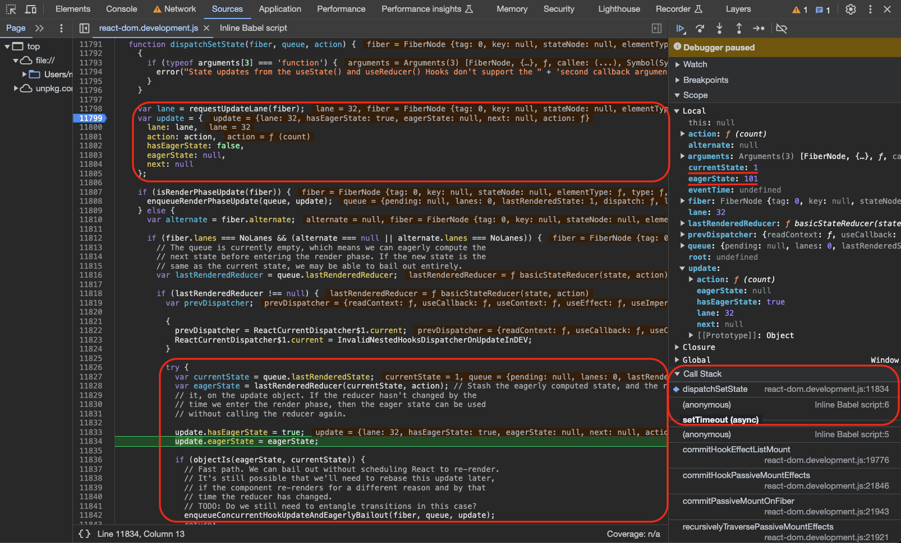

## render流程

`scheduleUpdateOnFiber` => `ensureRootIsScheduled` => ... => `performConcurrentWorkOnRoot` => `renderRootSync`/`renderRootConcurrent` + `commitRoot`

前一篇中可知`performConcurrentWorkOnRoot`有两个重要的流程**render流程**（`renderRootSync`/`renderRootConcurrent`）和**commit流程**（`commitRoot`），更新过程中同样要经历这两个流程，首先来看`render`流程，和首次挂载时一样，`prepareFreshStack`由`FiberRootNode`的`current`创建`workInProgress`，此时`FiberRootNode`的`current`就是目前渲染的内容的`fiber`树，然后`prepareFreshStack`中会去调用`finishQueueingConcurrentUpdates`为`current fiber`树装载之前创建好的`update`任务，然后进入`workLoopSync`/`workLoopConcurrent`过程：

`renderRootSync` => `prepareFreshStack` + `workLoopSync` => `finishQueueingConcurrentUpdates`

`renderRootConcurrent` => `prepareFreshStack` + `workLoopSync`/`workLoopConcurrent` => `finishQueueingConcurrentUpdates`

```ts
// 【packages/react-reconciler/src/ReactFiberWorkLoop.js】
function renderRootSync(root: FiberRoot, lanes: Lanes) {
  // If the root or lanes have changed, throw out the existing stack
  // and prepare a fresh one. Otherwise we'll continue where we left off.
  if (workInProgressRoot !== root || workInProgressRootRenderLanes !== lanes) {
    // 【省略代码...】
    // 【1.准备工作，用全局根FiberRoot内容去创建workInProgressRoot、workInProgress等等】
    prepareFreshStack(root, lanes);
  }

  // 【省略代码...】
  // 【2.调用workLoopSync处理workInProgress】
  outer: do {
    try {
      // 【省略代码...】
      workLoopSync();
      break;
    } catch (thrownValue) {
      handleThrow(root, thrownValue);
    }
  } while (true);
  // 【省略代码...】

  // Set this to null to indicate there's no in-progress render.
  workInProgressRoot = null;
  workInProgressRootRenderLanes = NoLanes;

  // It's safe to process the queue now that the render phase is complete.
  // 【3.处理concurrentQueues，调用markUpdateLaneFromFiberToRoot打标记】
  finishQueueingConcurrentUpdates();

  return workInProgressRootExitStatus;
}

function workLoopSync() {
  // Perform work without checking if we need to yield between fiber.
  while (workInProgress !== null) {
    performUnitOfWork(workInProgress);
  }
}

// 【packages/react-reconciler/src/ReactFiberWorkLoop.js】
function renderRootConcurrent(root: FiberRoot, lanes: Lanes) {
  // 【省略代码...】
  // If the root or lanes have changed, throw out the existing stack
  // and prepare a fresh one. Otherwise we'll continue where we left off.
  if (workInProgressRoot !== root || workInProgressRootRenderLanes !== lanes) {
    // 【省略代码...】
     // 【1.准备工作，用全局根FiberRoot内容去创建workInProgressRoot、workInProgress等等】
    prepareFreshStack(root, lanes);
  }

  // 【省略代码...】
   // 【2.调用workLoopSync或workLoopConcurrent处理workInProgress】
  outer: do {
    try {
      // 【省略代码...】

      if (__DEV__ && ReactCurrentActQueue.current !== null) {
        // `act` special case: If we're inside an `act` scope, don't consult
        // `shouldYield`. Always keep working until the render is complete.
        // This is not just an optimization: in a unit test environment, we
        // can't trust the result of `shouldYield`, because the host I/O is
        // likely mocked.
        workLoopSync();
      } else {
        workLoopConcurrent();
      }
      break;
    } catch (thrownValue) {
      handleThrow(root, thrownValue);
    }
  } while (true);
  // 【省略代码...】

  // Check if the tree has completed.
  if (workInProgress !== null) {
    // Still work remaining.
    // 【省略代码...】
  } else {
    // Completed the tree.
    // 【省略代码...】

    // Set this to null to indicate there's no in-progress render.
    workInProgressRoot = null;
    workInProgressRootRenderLanes = NoLanes;

    // It's safe to process the queue now that the render phase is complete.
    // 【3.处理concurrentQueues，调用markUpdateLaneFromFiberToRoot打标记】
    finishQueueingConcurrentUpdates();

    // Return the final exit status.
    return workInProgressRootExitStatus;
  }
}

function workLoopConcurrent() {
  // Perform work until Scheduler asks us to yield
  while (workInProgress !== null && !shouldYield()) {
    // $FlowFixMe[incompatible-call] found when upgrading Flow
    performUnitOfWork(workInProgress);
  }
}
```

`workLoopSync`/`workLoopConcurrent`方法都是循环遍历调用`performUnitOfWork`依次处理`fiber`节点形成fiber树，最大的区别就是是否可暂停的，`workLoopConcurrent`方法可以看到循环过程的判断条件多了一个`shouldYield`方法，这个方法控制当前的解析过程是否需要继续，也就是前文说的**可中断的**。

```ts
// 【packages/react-reconciler/src/ReactFiberWorkLoop.js】
function performUnitOfWork(unitOfWork: Fiber): void {
  // The current, flushed, state of this fiber is the alternate. Ideally
  // nothing should rely on this, but relying on it here means that we don't
  // need an additional field on the work in progress.
  const current = unitOfWork.alternate;
  setCurrentDebugFiberInDEV(unitOfWork);

  let next;
  if (enableProfilerTimer && (unitOfWork.mode & ProfileMode) !== NoMode) {
    startProfilerTimer(unitOfWork);
    // 【1.调用beginWork处理当前fiberNode并返回下一个需要处理的节点next，这里的下一个是当前fiberNode的子节点】
    next = beginWork(current, unitOfWork, renderLanes);
    stopProfilerTimerIfRunningAndRecordDelta(unitOfWork, true);
  } else {
    next = beginWork(current, unitOfWork, renderLanes);
  }

  resetCurrentDebugFiberInDEV();
  unitOfWork.memoizedProps = unitOfWork.pendingProps;
  if (next === null) {
    // 【2.next为null也就是到底部节点了，没有下一层了，去调用completeUnitOfWork】
    // If this doesn't spawn new work, complete the current work.
    completeUnitOfWork(unitOfWork);
  } else {
    // 【2.next有内容，workInProgress继续指向next然后继续beginWork】
    workInProgress = next;
  }

  ReactCurrentOwner.current = null;
}
```

### prepareFreshStack / finishQueueingConcurrentUpdates

此处`prepareFreshStack`属于准备和`finishQueueingConcurrentUpdates`属于收尾工作阶段：

1. 确定`workInProgressRoot`为全局唯一根节点`FiberRootNode`，调用`createWorkInProgress`方法为`FiberRootNode`的`current`创建`alternate`节点，并且`workInProgress`指向`alternate`节点；
2. 调用`finishQueueingConcurrentUpdates`方法，`Concurrent`模式下`render`过程中加入的`update`任务由`enqueueUpdate`方法暂存在`concurrentQueues`队列中，如果有`update`任务与已有的`update`任务串起来形成闭环，直到`render`过程完成或者被中断的时候再加入到对应`fiber`/`hook`的`queue`中；
3. `finishQueueingConcurrentUpdates`方法中还会调用`markUpdateLaneFromFiberToRoot`方法，这个方法从当前节点开始标记`lanes`和`childLanes`往祖先节点标记直到根节点，这样后续我们判断这棵树里面是不是有需要更新内容的时候就可以通过`childLanes`知道是不是还要继续往下，`lanes`则是表面当前节点是否需要更新内容，这个是后续判断是否要提前`bailout`的重要依据；

```ts
// 【packages/react-reconciler/src/ReactFiberWorkLoop.js】
function prepareFreshStack(root: FiberRoot, lanes: Lanes): Fiber {
  // 【省略代码...】
  root.finishedWork = null;
  root.finishedLanes = NoLanes;
  // 【省略代码...】
  workInProgressRoot = root;
  const rootWorkInProgress = createWorkInProgress(root.current, null);
  workInProgress = rootWorkInProgress;
  // 【省略代码...】
  finishQueueingConcurrentUpdates();
  return rootWorkInProgress;
}

// If a render is in progress, and we receive an update from a concurrent event,
// we wait until the current render is over (either finished or interrupted)
// before adding it to the fiber/hook queue. Push to this array so we can
// access the queue, fiber, update, et al later.
const concurrentQueues: Array<any> = [];
let concurrentQueuesIndex = 0;
// 【packages/react-reconciler/src/ReactFiberConcurrentUpdates.js】
export function finishQueueingConcurrentUpdates(): void {
  const endIndex = concurrentQueuesIndex;
  concurrentQueuesIndex = 0;

  concurrentlyUpdatedLanes = NoLanes;

  let i = 0;
  while (i < endIndex) {
    const fiber: Fiber = concurrentQueues[i];
    concurrentQueues[i++] = null;
    const queue: ConcurrentQueue = concurrentQueues[i];
    concurrentQueues[i++] = null;
    const update: ConcurrentUpdate = concurrentQueues[i];
    concurrentQueues[i++] = null;
    const lane: Lane = concurrentQueues[i];
    concurrentQueues[i++] = null;

    if (queue !== null && update !== null) {
      const pending = queue.pending;
      if (pending === null) {
        // This is the first update. Create a circular list.
        update.next = update;
      } else {
        update.next = pending.next;
        pending.next = update;
      }
      queue.pending = update;
    }
    // 【-----markUpdateLaneFromFiberToRoot标记更新-----】
    if (lane !== NoLane) {
      markUpdateLaneFromFiberToRoot(fiber, update, lane);
    }
  }
}
```

### beginWork

```ts
// 【packages/react-reconciler/src/ReactFiberBeginWork.js】
function beginWork(
  current: Fiber | null,
  workInProgress: Fiber,
  renderLanes: Lanes,
): Fiber | null {

  // 【省略代码...】

  if (current !== null) {
    // 【----更新分支-----】
    const oldProps = current.memoizedProps;
    const newProps = workInProgress.pendingProps;

    if (
      oldProps !== newProps ||
      hasLegacyContextChanged() ||
      // Force a re-render if the implementation changed due to hot reload:
      (__DEV__ ? workInProgress.type !== current.type : false)
    ) {
      // If props or context changed, mark the fiber as having performed work.
      // This may be unset if the props are determined to be equal later (memo).
      didReceiveUpdate = true;
    } else {
      // Neither props nor legacy context changes. Check if there's a pending
      // update or context change.
      // 【通过lane判断当前节点是否有update任务】
      const hasScheduledUpdateOrContext = checkScheduledUpdateOrContext(
        current,
        renderLanes,
      );
      if (
        !hasScheduledUpdateOrContext &&
        // If this is the second pass of an error or suspense boundary, there
        // may not be work scheduled on `current`, so we check for this flag.
        (workInProgress.flags & DidCapture) === NoFlags
      ) {
        // No pending updates or context. Bail out now.
        didReceiveUpdate = false;
        // 【hasScheduledUpdateOrContext为false，表明节点上没有update任务，尝试复用current节点的内容，得到复用的节点直接返回】
        return attemptEarlyBailoutIfNoScheduledUpdate(
          current,
          workInProgress,
          renderLanes,
        );
      }
      if ((current.flags & ForceUpdateForLegacySuspense) !== NoFlags) {
        // This is a special case that only exists for legacy mode.
        // See https://github.com/facebook/react/pull/19216.
        didReceiveUpdate = true;
      } else {
        // An update was scheduled on this fiber, but there are no new props
        // nor legacy context. Set this to false. If an update queue or context
        // consumer produces a changed value, it will set this to true. Otherwise,
        // the component will assume the children have not changed and bail out.
        didReceiveUpdate = false;
      }
    }
  } else {
    // 【----首次挂载分支-----】
    didReceiveUpdate = false;

    if (getIsHydrating() && isForkedChild(workInProgress)) {
      // Check if this child belongs to a list of muliple children in
      // its parent.
      //
      // In a true multi-threaded implementation, we would render children on
      // parallel threads. This would represent the beginning of a new render
      // thread for this subtree.
      //
      // We only use this for id generation during hydration, which is why the
      // logic is located in this special branch.
      const slotIndex = workInProgress.index;
      const numberOfForks = getForksAtLevel(workInProgress);
      pushTreeId(workInProgress, numberOfForks, slotIndex);
    }
  }

  // Before entering the begin phase, clear pending update priority.
  // TODO: This assumes that we're about to evaluate the component and process
  // the update queue. However, there's an exception: SimpleMemoComponent
  // sometimes bails out later in the begin phase. This indicates that we should
  // move this assignment out of the common path and into each branch.
  // 【清空这个节点上的lanes】
  workInProgress.lanes = NoLanes;

  switch (workInProgress.tag) {
    case IndeterminateComponent: {
      // 【省略代码...】
    }
    case LazyComponent: {
      // 【省略代码...】
    }
    case FunctionComponent: {
      const Component = workInProgress.type;
      const unresolvedProps = workInProgress.pendingProps;
      const resolvedProps =
        workInProgress.elementType === Component
          ? unresolvedProps
          : resolveDefaultProps(Component, unresolvedProps);
      return updateFunctionComponent(
        current,
        workInProgress,
        Component,
        resolvedProps,
        renderLanes,
      );
    }
    case ClassComponent: {
      const Component = workInProgress.type;
      const unresolvedProps = workInProgress.pendingProps;
      const resolvedProps =
        workInProgress.elementType === Component
          ? unresolvedProps
          : resolveDefaultProps(Component, unresolvedProps);
      return updateClassComponent(
        current,
        workInProgress,
        Component,
        resolvedProps,
        renderLanes,
      );
    }
    case HostRoot:
      return updateHostRoot(current, workInProgress, renderLanes);
    case HostHoistable:
      // 【省略代码...】
    // eslint-disable-next-line no-fallthrough
    case HostSingleton:
      // 【省略代码...】
    // eslint-disable-next-line no-fallthrough
    case HostComponent:
      return updateHostComponent(current, workInProgress, renderLanes);
    case HostText:
      return updateHostText(current, workInProgress);
    case SuspenseComponent:
      return updateSuspenseComponent(current, workInProgress, renderLanes);
    case HostPortal:
      return updatePortalComponent(current, workInProgress, renderLanes);
    case ForwardRef: {
      // 【省略代码...】
    }
    case Fragment:
      return updateFragment(current, workInProgress, renderLanes);
    case Mode:
      return updateMode(current, workInProgress, renderLanes);
    case Profiler:
      return updateProfiler(current, workInProgress, renderLanes);
    case ContextProvider:
      return updateContextProvider(current, workInProgress, renderLanes);
    case ContextConsumer:
      return updateContextConsumer(current, workInProgress, renderLanes);
    case MemoComponent: {
      const type = workInProgress.type;
      const unresolvedProps = workInProgress.pendingProps;
      // Resolve outer props first, then resolve inner props.
      let resolvedProps = resolveDefaultProps(type, unresolvedProps);
      if (__DEV__) {
        if (workInProgress.type !== workInProgress.elementType) {
          const outerPropTypes = type.propTypes;
          if (outerPropTypes) {
            checkPropTypes(
              outerPropTypes,
              resolvedProps, // Resolved for outer only
              'prop',
              getComponentNameFromType(type),
            );
          }
        }
      }
      resolvedProps = resolveDefaultProps(type.type, resolvedProps);
      return updateMemoComponent(
        current,
        workInProgress,
        type,
        resolvedProps,
        renderLanes,
      );
    }
    case SimpleMemoComponent: {
      return updateSimpleMemoComponent(
        current,
        workInProgress,
        workInProgress.type,
        workInProgress.pendingProps,
        renderLanes,
      );
    }
    case IncompleteClassComponent: {
      // 【省略代码...】
    }
    case SuspenseListComponent: {
      return updateSuspenseListComponent(current, workInProgress, renderLanes);
    }
    case ScopeComponent: {
      // 【省略代码...】
    }
    case OffscreenComponent: {
      return updateOffscreenComponent(current, workInProgress, renderLanes);
    }
    case LegacyHiddenComponent: {
      // 【省略代码...】
    }
    case CacheComponent: {
      // 【省略代码...】
    }
    case TracingMarkerComponent: {
      // 【省略代码...】
    }
  }

  throw new Error(
    `Unknown unit of work tag (${workInProgress.tag}). This error is likely caused by a bug in ` +
      'React. Please file an issue.',
  );
}
```

进入更新阶段的`beginWork`和首次挂载不同的是，首先会看当前节点是否能复用之前的，判断条件依次是：1.`current`存在；2.`oldProps !== newProps`新旧`props`不同；3.是否有`update`任务的安排通过`lane`判断；4.还有一些`flag`判断等；(`didReceiveUpdate`表示`props`、`context`是否有变化)。和首次挂载一样会从根节点开始遍历所有节点，但是如果有的节点`props`/`context`没有变化、`lanes`和`childLanes`都是0表明没有更新任务，直接复用旧节点。子组件如果直接写在JSX中，每次祖先组件重新渲染重新执行祖先组件的函数会重新生调用子组件的函数，然后作为pendingProps存在，所以新旧props虽然可能是“值”相同但并不是同一个对象，所以子组件也会重新渲染。

根节点`root`是没有变化的所以直接复用，从而进入`attemptEarlyBailoutIfNoScheduledUpdate`=>`bailoutOnAlreadyFinishedWork`=>`cloneChildFibers`方法：

```ts
// 【packages/react-reconciler/src/ReactFiberBeginWork.js】
function attemptEarlyBailoutIfNoScheduledUpdate(
  current: Fiber,
  workInProgress: Fiber,
  renderLanes: Lanes,
) {
  // This fiber does not have any pending work. Bailout without entering
  // the begin phase. There's still some bookkeeping we that needs to be done
  // in this optimized path, mostly pushing stuff onto the stack.
  switch (workInProgress.tag) {
    case HostRoot:
      pushHostRootContext(workInProgress);
      const root: FiberRoot = workInProgress.stateNode;
      pushRootTransition(workInProgress, root, renderLanes);

      if (enableTransitionTracing) {
        pushRootMarkerInstance(workInProgress);
      }

      if (enableCache) {
        const cache: Cache = current.memoizedState.cache;
        pushCacheProvider(workInProgress, cache);
      }
      resetHydrationState();
      break;
    case HostSingleton:
    case HostComponent:
      pushHostContext(workInProgress);
      break;
    case ClassComponent: {
      const Component = workInProgress.type;
      if (isLegacyContextProvider(Component)) {
        pushLegacyContextProvider(workInProgress);
      }
      break;
    }
    case HostPortal:
      pushHostContainer(workInProgress, workInProgress.stateNode.containerInfo);
      break;
    case ContextProvider: {
      const newValue = workInProgress.memoizedProps.value;
      const context: ReactContext<any> = workInProgress.type._context;
      pushProvider(workInProgress, context, newValue);
      break;
    }
    case Profiler:
      // 【省略代码...】
      break;
    case SuspenseComponent: {
      // 【省略代码...】
      break;
    }
    case SuspenseListComponent: {
      // 【省略代码...】
    }
    case OffscreenComponent:
    case LegacyHiddenComponent: {
      // 【省略代码...】
    }
    case CacheComponent: {
      // 【省略代码...】
    }
    case TracingMarkerComponent: {
      // 【省略代码...】
    }
  }
  return bailoutOnAlreadyFinishedWork(current, workInProgress, renderLanes);
}

function bailoutOnAlreadyFinishedWork(
  current: Fiber | null,
  workInProgress: Fiber,
  renderLanes: Lanes,
): Fiber | null {
  // 【省略代码...】

  // This fiber doesn't have work, but its subtree does. Clone the child
  // fibers and continue.
  cloneChildFibers(current, workInProgress);
  return workInProgress.child;
}

// 【packages/react-reconciler/src/ReactChildFiber.js】
export function cloneChildFibers(
  current: Fiber | null,
  workInProgress: Fiber,
): void {
  if (current !== null && workInProgress.child !== current.child) {
    throw new Error('Resuming work not yet implemented.');
  }

  if (workInProgress.child === null) {
    return;
  }

  let currentChild = workInProgress.child;
  let newChild = createWorkInProgress(currentChild, currentChild.pendingProps);
  workInProgress.child = newChild;

  newChild.return = workInProgress;
  while (currentChild.sibling !== null) {
    currentChild = currentChild.sibling;
    newChild = newChild.sibling = createWorkInProgress(
      currentChild,
      currentChild.pendingProps,
    );
    newChild.return = workInProgress;
  }
  newChild.sibling = null;
}

// 【packages/react-reconciler/src/ReactFiber.js】
// This is used to create an alternate fiber to do work on.
export function createWorkInProgress(current: Fiber, pendingProps: any): Fiber {
  let workInProgress = current.alternate;
  if (workInProgress === null) {
    // We use a double buffering pooling technique because we know that we'll
    // only ever need at most two versions of a tree. We pool the "other" unused
    // node that we're free to reuse. This is lazily created to avoid allocating
    // extra objects for things that are never updated. It also allow us to
    // reclaim the extra memory if needed.
    workInProgress = createFiber(
      current.tag,
      pendingProps,
      current.key,
      current.mode,
    );
    workInProgress.elementType = current.elementType;
    workInProgress.type = current.type;
    workInProgress.stateNode = current.stateNode;

    if (__DEV__) {
      // DEV-only fields

      workInProgress._debugSource = current._debugSource;
      workInProgress._debugOwner = current._debugOwner;
      workInProgress._debugHookTypes = current._debugHookTypes;
    }

    workInProgress.alternate = current;
    current.alternate = workInProgress;
  } else {
    workInProgress.pendingProps = pendingProps;
    // Needed because Blocks store data on type.
    workInProgress.type = current.type;

    // We already have an alternate.
    // Reset the effect tag.
    workInProgress.flags = NoFlags;

    // The effects are no longer valid.
    workInProgress.subtreeFlags = NoFlags;
    workInProgress.deletions = null;

    if (enableProfilerTimer) {
      // We intentionally reset, rather than copy, actualDuration & actualStartTime.
      // This prevents time from endlessly accumulating in new commits.
      // This has the downside of resetting values for different priority renders,
      // But works for yielding (the common case) and should support resuming.
      workInProgress.actualDuration = 0;
      workInProgress.actualStartTime = -1;
    }
  }

  // Reset all effects except static ones.
  // Static effects are not specific to a render.
  workInProgress.flags = current.flags & StaticMask;
  workInProgress.childLanes = current.childLanes;
  workInProgress.lanes = current.lanes;

  workInProgress.child = current.child;
  workInProgress.memoizedProps = current.memoizedProps;
  workInProgress.memoizedState = current.memoizedState;
  workInProgress.updateQueue = current.updateQueue;

  // Clone the dependencies object. This is mutated during the render phase, so
  // it cannot be shared with the current fiber.
  const currentDependencies = current.dependencies;
  workInProgress.dependencies =
    currentDependencies === null
      ? null
      : {
          lanes: currentDependencies.lanes,
          firstContext: currentDependencies.firstContext,
        };

  // These will be overridden during the parent's reconciliation
  workInProgress.sibling = current.sibling;
  workInProgress.index = current.index;
  workInProgress.ref = current.ref;
  workInProgress.refCleanup = current.refCleanup;

  if (enableProfilerTimer) {
    workInProgress.selfBaseDuration = current.selfBaseDuration;
    workInProgress.treeBaseDuration = current.treeBaseDuration;
  }

  if (__DEV__) {
    workInProgress._debugNeedsRemount = current._debugNeedsRemount;
    switch (workInProgress.tag) {
      case IndeterminateComponent:
      case FunctionComponent:
      case SimpleMemoComponent:
        workInProgress.type = resolveFunctionForHotReloading(current.type);
        break;
      case ClassComponent:
        workInProgress.type = resolveClassForHotReloading(current.type);
        break;
      case ForwardRef:
        workInProgress.type = resolveForwardRefForHotReloading(current.type);
        break;
      default:
        break;
    }
  }

  return workInProgress;
}
```


接下来`beginWork`会根据`tag`类型进入不同的 `update` 方法，在`ƒ App()`节点的`beginWork`阶段会走进`updateFunctionComponent`方法：

1. 调用`renderWithHooks`方法调用函数组件本身生成`nextChildren`，就是这个函数组件的内容对应的`React-Element`，本例中就是`div`对应的`React-Element`；
2. 进入`reconcileChildren(current, workInProgress, nextChildren, renderLanes)`方法；

这一步完成之后`div`节点里面变化的内容加入了`div`对应的`workInProgress fiber`的`pendingprops`属性中，用于后续的处理。

```ts
// 【packages/react-reconciler/src/ReactFiberBeginWork.js】
function updateFunctionComponent(
  current: null | Fiber,
  workInProgress: Fiber,
  Component: any,
  nextProps: any,
  renderLanes: Lanes,
) {
  // 【省略代码...】

  let context;
  if (!disableLegacyContext) {
    const unmaskedContext = getUnmaskedContext(workInProgress, Component, true);
    context = getMaskedContext(workInProgress, unmaskedContext);
  }

  let nextChildren;
  let hasId;
  prepareToReadContext(workInProgress, renderLanes);
  if (enableSchedulingProfiler) {
    markComponentRenderStarted(workInProgress);
  }
  if (__DEV__) {
    ReactCurrentOwner.current = workInProgress;
    setIsRendering(true);
    nextChildren = renderWithHooks(
      current,
      workInProgress,
      Component,
      nextProps,
      context,
      renderLanes,
    );
    hasId = checkDidRenderIdHook();
    setIsRendering(false);
  } else {
    // 【renderWithHooks调用函数组件本身生成nextChildren，JSX编译生成的React-Element】
    nextChildren = renderWithHooks(
      current,
      workInProgress,
      Component,
      nextProps,
      context,
      renderLanes,
    );
    hasId = checkDidRenderIdHook();
  }
  if (enableSchedulingProfiler) {
    markComponentRenderStopped();
  }

  if (current !== null && !didReceiveUpdate) {
    bailoutHooks(current, workInProgress, renderLanes);
    return bailoutOnAlreadyFinishedWork(current, workInProgress, renderLanes);
  }

  if (getIsHydrating() && hasId) {
    pushMaterializedTreeId(workInProgress);
  }

  // React DevTools reads this flag.
  workInProgress.flags |= PerformedWork;
  // 【进入reconcileChildren方法】
  reconcileChildren(current, workInProgress, nextChildren, renderLanes);
  return workInProgress.child;
}

export function renderWithHooks<Props, SecondArg>(
  current: Fiber | null,
  workInProgress: Fiber,
  Component: (p: Props, arg: SecondArg) => any,
  props: Props,
  secondArg: SecondArg,
  nextRenderLanes: Lanes,
): any {
  renderLanes = nextRenderLanes;
  currentlyRenderingFiber = workInProgress;

  // 【省略代码...】

  workInProgress.memoizedState = null;
  workInProgress.updateQueue = null;
  workInProgress.lanes = NoLanes;

  // The following should have already been reset
  // currentHook = null;
  // workInProgressHook = null;

  // didScheduleRenderPhaseUpdate = false;
  // localIdCounter = 0;
  // thenableIndexCounter = 0;
  // thenableState = null;

  // TODO Warn if no hooks are used at all during mount, then some are used during update.
  // Currently we will identify the update render as a mount because memoizedState === null.
  // This is tricky because it's valid for certain types of components (e.g. React.lazy)

  // Using memoizedState to differentiate between mount/update only works if at least one stateful hook is used.
  // Non-stateful hooks (e.g. context) don't get added to memoizedState,
  // so memoizedState would be null during updates and mounts.
  // 【省略代码...】

  // In Strict Mode, during development, user functions are double invoked to
  // help detect side effects. The logic for how this is implemented for in
  // hook components is a bit complex so let's break it down.
  //
  // We will invoke the entire component function twice. However, during the
  // second invocation of the component, the hook state from the first
  // invocation will be reused. That means things like `useMemo` functions won't
  // run again, because the deps will match and the memoized result will
  // be reused.
  //
  // We want memoized functions to run twice, too, so account for this, user
  // functions are double invoked during the *first* invocation of the component
  // function, and are *not* double invoked during the second incovation:
  //
  // - First execution of component function: user functions are double invoked
  // - Second execution of component function (in Strict Mode, during
  //   development): user functions are not double invoked.
  //
  // This is intentional for a few reasons; most importantly, it's because of
  // how `use` works when something suspends: it reuses the promise that was
  // passed during the first attempt. This is itself a form of memoization.
  // We need to be able to memoize the reactive inputs to the `use` call using
  // a hook (i.e. `useMemo`), which means, the reactive inputs to `use` must
  // come from the same component invocation as the output.
  //
  // There are plenty of tests to ensure this behavior is correct.
  const shouldDoubleRenderDEV =
    __DEV__ &&
    debugRenderPhaseSideEffectsForStrictMode &&
    (workInProgress.mode & StrictLegacyMode) !== NoMode;

  shouldDoubleInvokeUserFnsInHooksDEV = shouldDoubleRenderDEV;
  // 【-----调用函数组件的函数本身-----】
  let children = Component(props, secondArg);
  shouldDoubleInvokeUserFnsInHooksDEV = false;

  // Check if there was a render phase update
  if (didScheduleRenderPhaseUpdateDuringThisPass) {
    // Keep rendering until the component stabilizes (there are no more render
    // phase updates).
    children = renderWithHooksAgain(
      workInProgress,
      Component,
      props,
      secondArg,
    );
  }

  if (shouldDoubleRenderDEV) {
    // In development, components are invoked twice to help detect side effects.
    setIsStrictModeForDevtools(true);
    try {
      children = renderWithHooksAgain(
        workInProgress,
        Component,
        props,
        secondArg,
      );
    } finally {
      setIsStrictModeForDevtools(false);
    }
  }

  finishRenderingHooks(current, workInProgress);

  return children;
}
```

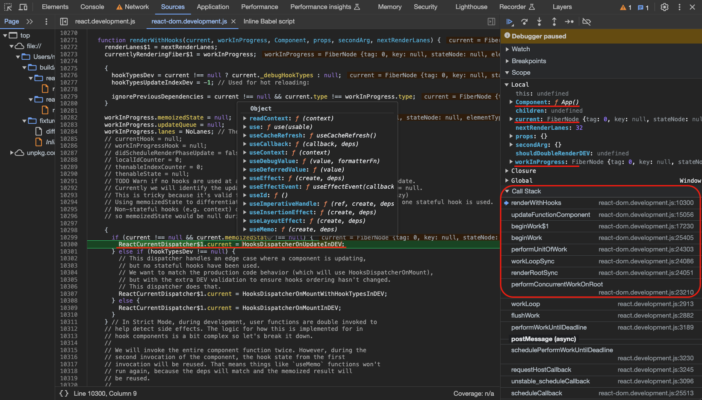
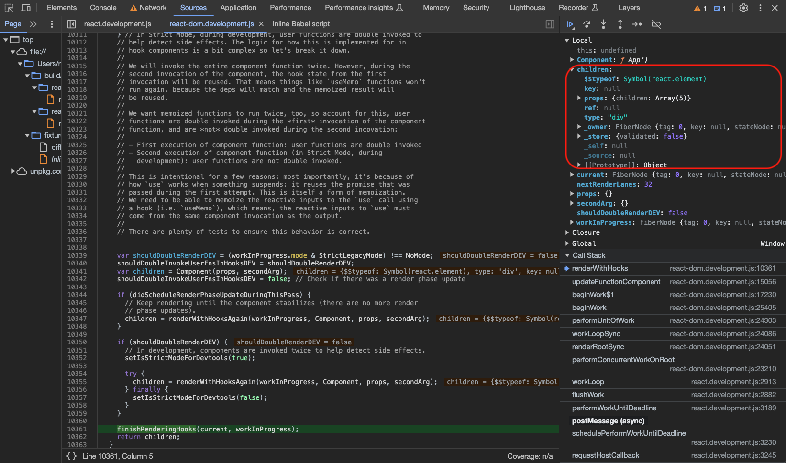
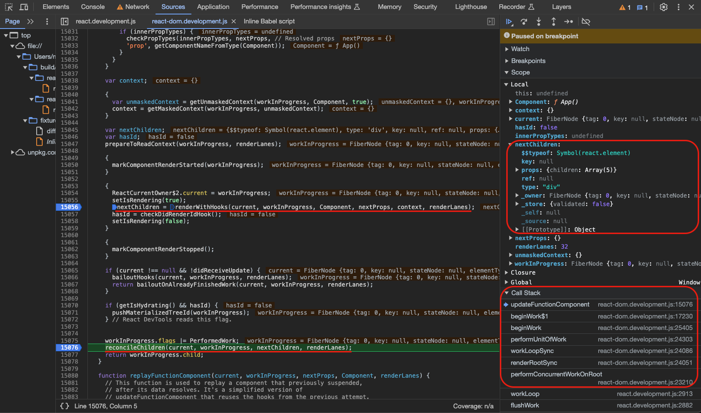

完成`ƒ App()`节点的`beginWork`，进入`div`节点的`beginWork`阶段会走到如下`updateHostComponent`方法：

1. 从`workInProgress`的`pendingProps`从获取`nextChildren`，这个`pendingProps`是上一步生成的；
2. 进入`reconcileChildren(current, workInProgress, nextChildren, renderLanes);`方法；

```ts
// 【packages/react-reconciler/src/ReactFiberBeginWork.js】
function updateHostComponent(
  current: Fiber | null,
  workInProgress: Fiber,
  renderLanes: Lanes,
) {
  pushHostContext(workInProgress);

  if (current === null) {
    tryToClaimNextHydratableInstance(workInProgress);
  }

  const type = workInProgress.type;
  const nextProps = workInProgress.pendingProps;
  const prevProps = current !== null ? current.memoizedProps : null;
  // 【获取子节点】
  let nextChildren = nextProps.children;
  const isDirectTextChild = shouldSetTextContent(type, nextProps);

  if (isDirectTextChild) {
    // We special case a direct text child of a host node. This is a common
    // case. We won't handle it as a reified child. We will instead handle
    // this in the host environment that also has access to this prop. That
    // avoids allocating another HostText fiber and traversing it.
    nextChildren = null;
  } else if (prevProps !== null && shouldSetTextContent(type, prevProps)) {
    // If we're switching from a direct text child to a normal child, or to
    // empty, we need to schedule the text content to be reset.
    workInProgress.flags |= ContentReset;
  }

  markRef(current, workInProgress);
  reconcileChildren(current, workInProgress, nextChildren, renderLanes);
  return workInProgress.child;
}
```

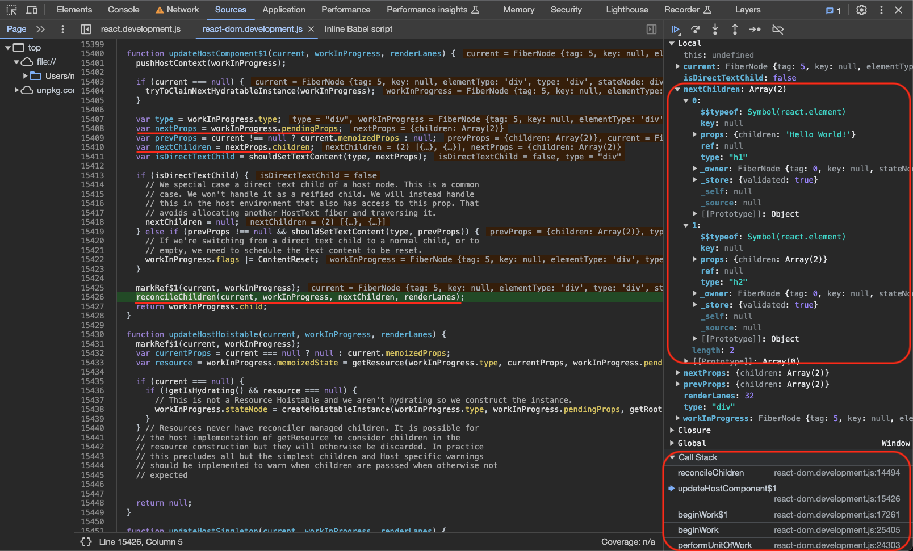

`updateFunctionComponent`、`updateHostComponent`等方法都会进入`reconcileChildren`，根据 `current` 是否为 `null` 会进入 `mountChildFibers` 或 `reconcileChildFibers` 流程，这一次我们是更新流程所以进入`reconcileChildFibers`，`mountChildFibers` 和 `reconcileChildFibers`是由`createChildReconciler`返回的内部的方法：

- 初次创建时`fiber`节点没有比较对象, 所以在向下生成子节点的时候没有任何多余的逻辑, 只管创建就行
- 对比更新时需要把`ReactElement`对象与旧`fiber`节点进行比较, 来判断是否需要复用旧`fiber`对象

```ts
// 【packages/react-reconciler/src/ReactFiberBeginWork.js】
export function reconcileChildren(
  current: Fiber | null,
  workInProgress: Fiber,
  nextChildren: any,
  renderLanes: Lanes,
) {
  if (current === null) {
    // 【首次挂载】
    // If this is a fresh new component that hasn't been rendered yet, we
    // won't update its child set by applying minimal side-effects. Instead,
    // we will add them all to the child before it gets rendered. That means
    // we can optimize this reconciliation pass by not tracking side-effects.
    workInProgress.child = mountChildFibers(
      workInProgress,
      null,
      nextChildren,
      renderLanes,
    );
  } else {
    // 【更新】
    // If the current child is the same as the work in progress, it means that
    // we haven't yet started any work on these children. Therefore, we use
    // the clone algorithm to create a copy of all the current children.

    // If we had any progressed work already, that is invalid at this point so
    // let's throw it out.
    workInProgress.child = reconcileChildFibers(
      workInProgress,
      current.child,
      nextChildren,
      renderLanes,
    );
  }
}

// 【packages/react-reconciler/src/ReactChildFiber.js】
export const reconcileChildFibers: ChildReconciler =
  createChildReconciler(true);
export const mountChildFibers: ChildReconciler = createChildReconciler(false);

// This wrapper function exists because I expect to clone the code in each path
// to be able to optimize each path individually by branching early. This needs
// a compiler or we can do it manually. Helpers that don't need this branching
// live outside of this function.
function createChildReconciler(
  shouldTrackSideEffects: boolean,
): ChildReconciler {

  // 【省略代码...】
  function reconcileChildrenArray(
    returnFiber: Fiber,
    currentFirstChild: Fiber | null,
    newChildren: Array<any>,
    lanes: Lanes,
  ): Fiber | null {
    // 【省略代码...】
  }
  function reconcileSingleElement(
    returnFiber: Fiber,
    currentFirstChild: Fiber | null,
    element: ReactElement,
    lanes: Lanes,
  ): Fiber {
    // 【省略代码...】
  }
  function reconcileChildFibersImpl(
    returnFiber: Fiber,
    currentFirstChild: Fiber | null,
    newChild: any,
    lanes: Lanes,
  ): Fiber | null {
    // 【省略代码...】
  }

  function reconcileChildFibers(
    returnFiber: Fiber,
    currentFirstChild: Fiber | null,
    newChild: any,
    lanes: Lanes,
  ): Fiber | null {
    // This indirection only exists so we can reset `thenableState` at the end.
    // It should get inlined by Closure.
    thenableIndexCounter = 0;
    const firstChildFiber = reconcileChildFibersImpl(
      returnFiber,
      currentFirstChild,
      newChild,
      lanes,
    );
    thenableState = null;
    // Don't bother to reset `thenableIndexCounter` to 0 because it always gets
    // set at the beginning.
    return firstChildFiber;
  }
  return reconcileChildFibers;
}
```

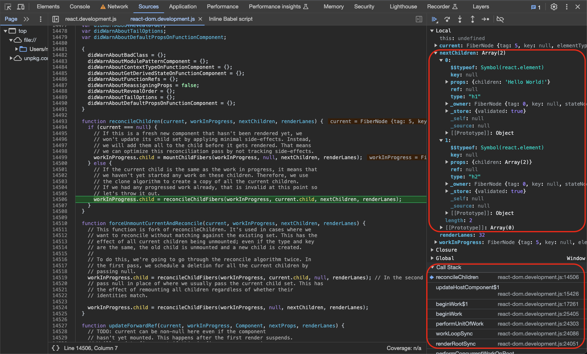
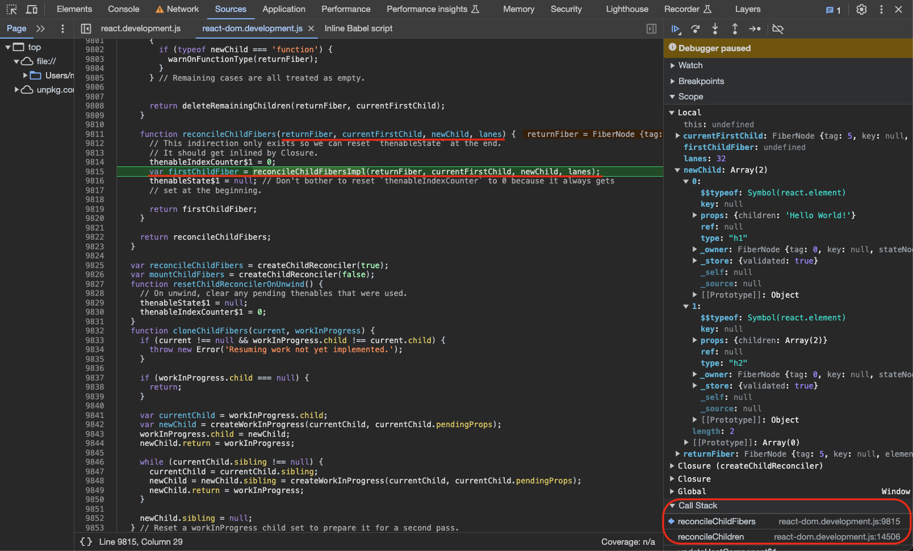
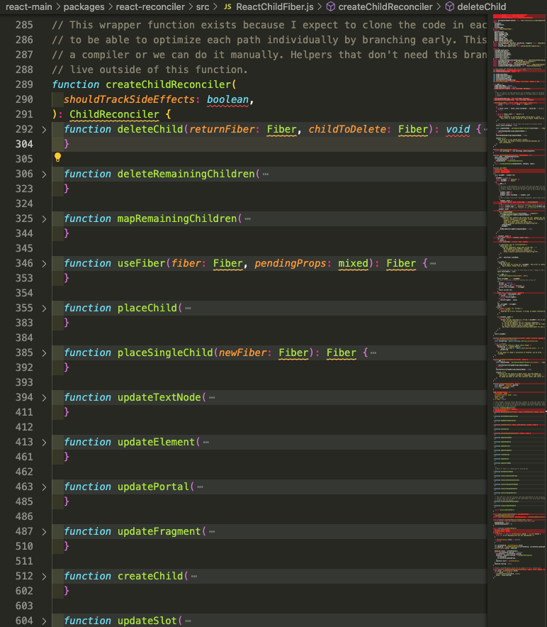

下一步进入`reconcileChildFibersImpl`也是`createChildReconciler`内部的方法，通过对 `newChild` 分类进行不同的处理，单独的节点，或者数组也就是多节点通过不同的方法进行处理：

```ts
// 【packages/react-reconciler/src/ReactChildFiber.js】
// 【根据newChild类型调用不同处理方法】
function reconcileChildFibersImpl(
  returnFiber: Fiber,
  currentFirstChild: Fiber | null,
  newChild: any,
  lanes: Lanes,
): Fiber | null {
  // This function is not recursive.
  // If the top level item is an array, we treat it as a set of children,
  // not as a fragment. Nested arrays on the other hand will be treated as
  // fragment nodes. Recursion happens at the normal flow.

  // Handle top level unkeyed fragments as if they were arrays.
  // This leads to an ambiguity between <>{[...]}</> and <>...</>.
  // We treat the ambiguous cases above the same.
  // TODO: Let's use recursion like we do for Usable nodes?
  const isUnkeyedTopLevelFragment =
    typeof newChild === 'object' &&
    newChild !== null &&
    newChild.type === REACT_FRAGMENT_TYPE &&
    newChild.key === null;
  if (isUnkeyedTopLevelFragment) {
    newChild = newChild.props.children;
  }

  // Handle object types
  if (typeof newChild === 'object' && newChild !== null) {
    switch (newChild.$$typeof) {
      // 【单个节点】
      case REACT_ELEMENT_TYPE:
        // 【placeSingleChild给fiber添加flag】
        // 【reconcileSingleElement给单个元素构造成fiber】
        return placeSingleChild(
          reconcileSingleElement(
            returnFiber,
            currentFirstChild,
            newChild,
            lanes,
          ),
        );
      case REACT_PORTAL_TYPE:
        return placeSingleChild(
          reconcileSinglePortal(
            returnFiber,
            currentFirstChild,
            newChild,
            lanes,
          ),
        );
      case REACT_LAZY_TYPE:
        const payload = newChild._payload;
        const init = newChild._init;
        // TODO: This function is supposed to be non-recursive.
        return reconcileChildFibers(
          returnFiber,
          currentFirstChild,
          init(payload),
          lanes,
        );
    }

    // 【newChild是多个节点-diff入口】
    if (isArray(newChild)) {
      return reconcileChildrenArray(
        returnFiber,
        currentFirstChild,
        newChild,
        lanes,
      );
    }

    if (getIteratorFn(newChild)) {
      return reconcileChildrenIterator(
        returnFiber,
        currentFirstChild,
        newChild,
        lanes,
      );
    }

    // Usables are a valid React node type. When React encounters a Usable in
    // a child position, it unwraps it using the same algorithm as `use`. For
    // example, for promises, React will throw an exception to unwind the
    // stack, then replay the component once the promise resolves.
    //
    // A difference from `use` is that React will keep unwrapping the value
    // until it reaches a non-Usable type.
    //
    // e.g. Usable<Usable<Usable<T>>> should resolve to T
    //
    // The structure is a bit unfortunate. Ideally, we shouldn't need to
    // replay the entire begin phase of the parent fiber in order to reconcile
    // the children again. This would require a somewhat significant refactor,
    // because reconcilation happens deep within the begin phase, and
    // depending on the type of work, not always at the end. We should
    // consider as an future improvement.
    if (typeof newChild.then === 'function') {
      const thenable: Thenable<any> = (newChild: any);
      return reconcileChildFibersImpl(
        returnFiber,
        currentFirstChild,
        unwrapThenable(thenable),
        lanes,
      );
    }

    if (
      newChild.$$typeof === REACT_CONTEXT_TYPE ||
      newChild.$$typeof === REACT_SERVER_CONTEXT_TYPE
    ) {
      const context: ReactContext<mixed> = (newChild: any);
      return reconcileChildFibersImpl(
        returnFiber,
        currentFirstChild,
        readContextDuringReconcilation(returnFiber, context, lanes),
        lanes,
      );
    }

    throwOnInvalidObjectType(returnFiber, newChild);
  }
  
  // 【如果newChild是文本节点，调用reconcileSingleTextNode】
  if (
    (typeof newChild === 'string' && newChild !== '') ||
    typeof newChild === 'number'
  ) {
    return placeSingleChild(
      reconcileSingleTextNode(
        returnFiber,
        currentFirstChild,
        '' + newChild,
        lanes,
      ),
    );
  }

  // 【省略代码...】

  // Remaining cases are all treated as empty.
  return deleteRemainingChildren(returnFiber, currentFirstChild);
}
```

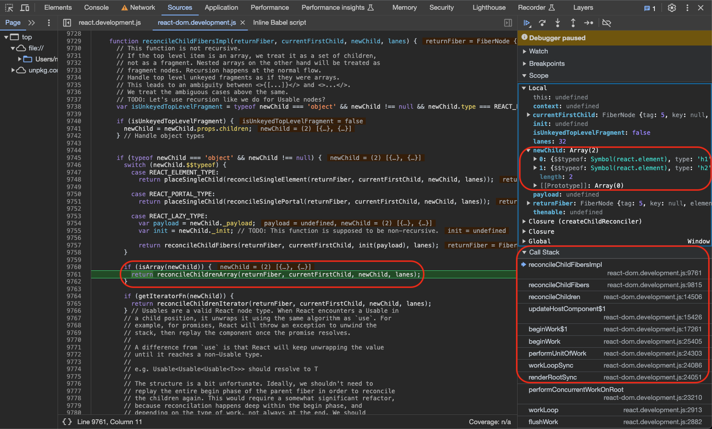

**多节点**处理方法 `reconcileChildrenArray` ，为了更好的调试diff过程，此方法用例如下，将节点abc变成了aceb，key同显示内容：

```html
<html>
  <body>
    <script src="../../../build/oss-experimental/react/umd/react.development.js"></script>
    <script src="../../../build/oss-experimental/react-dom/umd/react-dom.development.js"></script>
    <script src="https://unpkg.com/babel-standalone@6/babel.js"></script>
    <div id="container"></div>
    <script type="text/babel">
      function App() {
        const [list,setList] = React.useState(['a','b','c'])
        React.useEffect(()=>{
          setTimeout(() => {
            setList(list=>{
              return ['a','c','e','b']
            })
          }, 3000);
        },[])

        return <div>
                  {list.map(item => (
                    <h2 key={item}>{item}</h2>
                  ))}
                </div>
      }

      const root = ReactDOM.createRoot(document.getElementById('container'))
      root.render(<App />);
    </script>
  </body>
</html>
```

1. 第一遍遍历新节点`newChildren`，旧节点是通过`sibling`访问下一个，把所有能复用旧节点的复用了，不能复用了就跳出循环；
2. 第一遍循环结束后如果旧节点还有剩余而新节点已经遍历完，删除；
3. 第一遍循环结束后如果新节点还有剩余而旧节点已经遍历完，插入；
4. 第一遍循环结束后新旧节点皆有剩余进入下一个循环，构造一个`existingChildren`存储所有未遍历的旧节点，开始重新遍历新节点，每一个新节点都在`existingChildren`中寻找是否有可复用的旧节点，如若有则复用然后从`existingChildren`删除掉已复用的旧节点；

其中能复用的节点可能会进入`updateSlot`、`updateElement`等方法，然后调用`useFiber`=>`createWorkInProgress`以已有的`fiber node`去构建新的`fiber node`，不同的内容会存储在`pendingProps`中供后续更新使用。新加入的节点会调用`placeChild`方法给这个节点`flags`标记`Placement`用于后续`commit`过程。

```ts
// 【packages/react-reconciler/src/ReactChildFiber.js】
// 【newChild是多节点】
function reconcileChildrenArray(
  returnFiber: Fiber,//【上层节点】
  currentFirstChild: Fiber | null,//【旧节点序列的第一个节点】
  newChildren: Array<any>,//【新节点序列】
  lanes: Lanes,
): Fiber | null {
  // This algorithm can't optimize by searching from both ends since we
  // don't have backpointers on fibers. I'm trying to see how far we can get
  // with that model. If it ends up not being worth the tradeoffs, we can
  // add it later.

  // Even with a two ended optimization, we'd want to optimize for the case
  // where there are few changes and brute force the comparison instead of
  // going for the Map. It'd like to explore hitting that path first in
  // forward-only mode and only go for the Map once we notice that we need
  // lots of look ahead. This doesn't handle reversal as well as two ended
  // search but that's unusual. Besides, for the two ended optimization to
  // work on Iterables, we'd need to copy the whole set.

  // In this first iteration, we'll just live with hitting the bad case
  // (adding everything to a Map) in for every insert/move.

  // If you change this code, also update reconcileChildrenIterator() which
  // uses the same algorithm.

  // 【省略代码...】

  let resultingFirstChild: Fiber | null = null;//【能复用的情况下，新节点中的第一个节点】
  let previousNewFiber: Fiber | null = null;//【上一个被遍历的新节点】

  let oldFiber = currentFirstChild;//【旧节点序列的第一个节点初始化oldFiber】
  let lastPlacedIndex = 0;//【能复用的旧节点中最后一个的索引】
  let newIdx = 0;
  let nextOldFiber = null;//【用于下一个监测是否能复用的旧节点】
  
  // 【第一遍遍历newChildren】
  for (; oldFiber !== null && newIdx < newChildren.length; newIdx++) {
    // 【旧节点索引大于当前这个新节点索引，那就继续寻找这个旧节点是不是能复用】
    if (oldFiber.index > newIdx) {
      nextOldFiber = oldFiber;
      oldFiber = null;
    } else {
      nextOldFiber = oldFiber.sibling;
    }
    // 【对比寻找旧节点是否可复用，可复用的节点就直接在旧节点基础上复用并返回】
    const newFiber = updateSlot(
      returnFiber,
      oldFiber,
      newChildren[newIdx],
      lanes,
    );
    // 【newFiber为null说明不能复用，跳出循环】
    if (newFiber === null) {
      // TODO: This breaks on empty slots like null children. That's
      // unfortunate because it triggers the slow path all the time. We need
      // a better way to communicate whether this was a miss or null,
      // boolean, undefined, etc.
      if (oldFiber === null) {
        oldFiber = nextOldFiber;
      }
      break;
    }
    if (shouldTrackSideEffects) {
      if (oldFiber && newFiber.alternate === null) {
        // We matched the slot, but we didn't reuse the existing fiber, so we
        // need to delete the existing child.
        deleteChild(returnFiber, oldFiber);
      }
    }
    // 【最后一个找到的可复用的旧节点的索引，并且给新节点打上标签】
    lastPlacedIndex = placeChild(newFiber, lastPlacedIndex, newIdx);
    // 【previousNewFiber为null说明是找到的第一个可复用节点，赋值给resultingFirstChild】
    // 【previousNewFiber不为null说明，已有可复用节点，所以把newFiber作为兄弟节点串上去】
    if (previousNewFiber === null) {
      // TODO: Move out of the loop. This only happens for the first run.
      resultingFirstChild = newFiber;
    } else {
      // TODO: Defer siblings if we're not at the right index for this slot.
      // I.e. if we had null values before, then we want to defer this
      // for each null value. However, we also don't want to call updateSlot
      // with the previous one.
      previousNewFiber.sibling = newFiber;
    }
    previousNewFiber = newFiber;
    // 【继续寻找下一个可复用节点】
    oldFiber = nextOldFiber;
  }

  // 【新节点newChildren遍历完，删除剩余的旧节点】
  if (newIdx === newChildren.length) {
    // We've reached the end of the new children. We can delete the rest.
    deleteRemainingChildren(returnFiber, oldFiber);
    if (getIsHydrating()) {
      const numberOfForks = newIdx;
      pushTreeFork(returnFiber, numberOfForks);
    }
    return resultingFirstChild;
  }

  // 【旧节点已经遍历结束，剩下的新节点作为新创建的插入进去】
  if (oldFiber === null) {
    // If we don't have any more existing children we can choose a fast path
    // since the rest will all be insertions.
    for (; newIdx < newChildren.length; newIdx++) {
      const newFiber = createChild(returnFiber, newChildren[newIdx], lanes);
      if (newFiber === null) {
        continue;
      }
      lastPlacedIndex = placeChild(newFiber, lastPlacedIndex, newIdx);
      if (previousNewFiber === null) {
        // TODO: Move out of the loop. This only happens for the first run.
        resultingFirstChild = newFiber;
      } else {
        previousNewFiber.sibling = newFiber;
      }
      previousNewFiber = newFiber;
    }
    if (getIsHydrating()) {
      const numberOfForks = newIdx;
      pushTreeFork(returnFiber, numberOfForks);
    }
    return resultingFirstChild;
  }

  // 【新旧节点都没遍历完】
  // 【建立一个Map，key为oldFiber的key，value为oldFiber，将没有遍历完的旧节点放入】
  // Add all children to a key map for quick lookups.
  const existingChildren = mapRemainingChildren(returnFiber, oldFiber);
  // 【继续遍历newChildren里剩下的节点，在这个Map中寻找能复用的旧节点，并打上标记】
  // Keep scanning and use the map to restore deleted items as moves.
  for (; newIdx < newChildren.length; newIdx++) {
    // 【在existingChildren中寻找是否有可复用节点】
    const newFiber = updateFromMap(
      existingChildren,
      returnFiber,
      newIdx,
      newChildren[newIdx],
      lanes,
    );
    
    if (newFiber !== null) {
      if (shouldTrackSideEffects) {
        if (newFiber.alternate !== null) {
          // The new fiber is a work in progress, but if there exists a
          // current, that means that we reused the fiber. We need to delete
          // it from the child list so that we don't add it to the deletion
          // list.
          // 【newFiber存在说明在旧节点中找到了可复用节点，复用完从existingChildren删除】
          existingChildren.delete(
            newFiber.key === null ? newIdx : newFiber.key,
          );
        }
      }
      lastPlacedIndex = placeChild(newFiber, lastPlacedIndex, newIdx);
      if (previousNewFiber === null) {
        resultingFirstChild = newFiber;
      } else {
        previousNewFiber.sibling = newFiber;
      }
      previousNewFiber = newFiber;
    }
  }

  if (shouldTrackSideEffects) {
    // Any existing children that weren't consumed above were deleted. We need
    // to add them to the deletion list.
    existingChildren.forEach(child => deleteChild(returnFiber, child));
  }

  if (getIsHydrating()) {
    const numberOfForks = newIdx;
    pushTreeFork(returnFiber, numberOfForks);
  }
  return resultingFirstChild;
}

function updateSlot(
  returnFiber: Fiber,
  oldFiber: Fiber | null,
  newChild: any,
  lanes: Lanes,
): Fiber | null {
  // Update the fiber if the keys match, otherwise return null.
  const key = oldFiber !== null ? oldFiber.key : null;

  if (
    (typeof newChild === 'string' && newChild !== '') ||
    typeof newChild === 'number'
  ) {
    // Text nodes don't have keys. If the previous node is implicitly keyed
    // we can continue to replace it without aborting even if it is not a text
    // node.
    if (key !== null) {
      return null;
    }
    return updateTextNode(returnFiber, oldFiber, '' + newChild, lanes);
  }

  if (typeof newChild === 'object' && newChild !== null) {
    switch (newChild.$$typeof) {
      case REACT_ELEMENT_TYPE: {
        if (newChild.key === key) {
          return updateElement(returnFiber, oldFiber, newChild, lanes);
        } else {
          return null;
        }
      }
      case REACT_PORTAL_TYPE: {
        if (newChild.key === key) {
          return updatePortal(returnFiber, oldFiber, newChild, lanes);
        } else {
          return null;
        }
      }
      case REACT_LAZY_TYPE: {
        const payload = newChild._payload;
        const init = newChild._init;
        return updateSlot(returnFiber, oldFiber, init(payload), lanes);
      }
    }

    if (isArray(newChild) || getIteratorFn(newChild)) {
      if (key !== null) {
        return null;
      }

      return updateFragment(returnFiber, oldFiber, newChild, lanes, null);
    }

    // Usable node types
    //
    // Unwrap the inner value and recursively call this function again.
    if (typeof newChild.then === 'function') {
      const thenable: Thenable<any> = (newChild: any);
      return updateSlot(
        returnFiber,
        oldFiber,
        unwrapThenable(thenable),
        lanes,
      );
    }

    if (
      newChild.$$typeof === REACT_CONTEXT_TYPE ||
      newChild.$$typeof === REACT_SERVER_CONTEXT_TYPE
    ) {
      const context: ReactContext<mixed> = (newChild: any);
      return updateSlot(
        returnFiber,
        oldFiber,
        readContextDuringReconcilation(returnFiber, context, lanes),
        lanes,
      );
    }

    throwOnInvalidObjectType(returnFiber, newChild);
  }

  if (__DEV__) {
    if (typeof newChild === 'function') {
      warnOnFunctionType(returnFiber);
    }
  }

  return null;
}

function updateElement(
  returnFiber: Fiber,
  current: Fiber | null,
  element: ReactElement,
  lanes: Lanes,
): Fiber {
  const elementType = element.type;
  if (elementType === REACT_FRAGMENT_TYPE) {
    return updateFragment(
      returnFiber,
      current,
      element.props.children,
      lanes,
      element.key,
    );
  }
  if (current !== null) {
    if (
      current.elementType === elementType ||
      // Keep this check inline so it only runs on the false path:
      (__DEV__
        ? isCompatibleFamilyForHotReloading(current, element)
        : false) ||
      // Lazy types should reconcile their resolved type.
      // We need to do this after the Hot Reloading check above,
      // because hot reloading has different semantics than prod because
      // it doesn't resuspend. So we can't let the call below suspend.
      (typeof elementType === 'object' &&
        elementType !== null &&
        elementType.$$typeof === REACT_LAZY_TYPE &&
        resolveLazy(elementType) === current.type)
    ) {
      // Move based on index
      const existing = useFiber(current, element.props);
      existing.ref = coerceRef(returnFiber, current, element);
      existing.return = returnFiber;
      if (__DEV__) {
        existing._debugSource = element._source;
        existing._debugOwner = element._owner;
      }
      return existing;
    }
  }
  // Insert
  const created = createFiberFromElement(element, returnFiber.mode, lanes);
  created.ref = coerceRef(returnFiber, current, element);
  created.return = returnFiber;
  return created;
}

// 【packages/react-reconciler/src/ReactFiber.js】
// This is used to create an alternate fiber to do work on.
export function createWorkInProgress(current: Fiber, pendingProps: any): Fiber {
  let workInProgress = current.alternate;
  if (workInProgress === null) {
    // We use a double buffering pooling technique because we know that we'll
    // only ever need at most two versions of a tree. We pool the "other" unused
    // node that we're free to reuse. This is lazily created to avoid allocating
    // extra objects for things that are never updated. It also allow us to
    // reclaim the extra memory if needed.
    workInProgress = createFiber(
      current.tag,
      pendingProps,
      current.key,
      current.mode,
    );
    workInProgress.elementType = current.elementType;
    workInProgress.type = current.type;
    workInProgress.stateNode = current.stateNode;

    // 【省略代码...】

    workInProgress.alternate = current;
    current.alternate = workInProgress;
  } else {
    workInProgress.pendingProps = pendingProps;
    // Needed because Blocks store data on type.
    workInProgress.type = current.type;

    // We already have an alternate.
    // Reset the effect tag.
    workInProgress.flags = NoFlags;

    // The effects are no longer valid.
    workInProgress.subtreeFlags = NoFlags;
    workInProgress.deletions = null;

    if (enableProfilerTimer) {
      // We intentionally reset, rather than copy, actualDuration & actualStartTime.
      // This prevents time from endlessly accumulating in new commits.
      // This has the downside of resetting values for different priority renders,
      // But works for yielding (the common case) and should support resuming.
      workInProgress.actualDuration = 0;
      workInProgress.actualStartTime = -1;
    }
  }

  // Reset all effects except static ones.
  // Static effects are not specific to a render.
  workInProgress.flags = current.flags & StaticMask;
  workInProgress.childLanes = current.childLanes;
  workInProgress.lanes = current.lanes;

  workInProgress.child = current.child;
  workInProgress.memoizedProps = current.memoizedProps;
  workInProgress.memoizedState = current.memoizedState;
  workInProgress.updateQueue = current.updateQueue;

  // Clone the dependencies object. This is mutated during the render phase, so
  // it cannot be shared with the current fiber.
  const currentDependencies = current.dependencies;
  workInProgress.dependencies =
    currentDependencies === null
      ? null
      : {
          lanes: currentDependencies.lanes,
          firstContext: currentDependencies.firstContext,
        };

  // These will be overridden during the parent's reconciliation
  workInProgress.sibling = current.sibling;
  workInProgress.index = current.index;
  workInProgress.ref = current.ref;
  workInProgress.refCleanup = current.refCleanup;

  // 【省略代码...】

  return workInProgress;
}
```

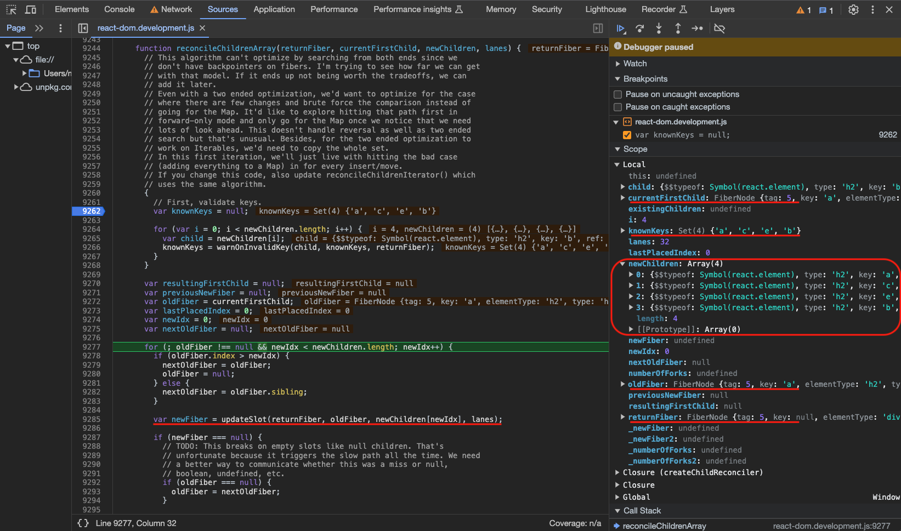
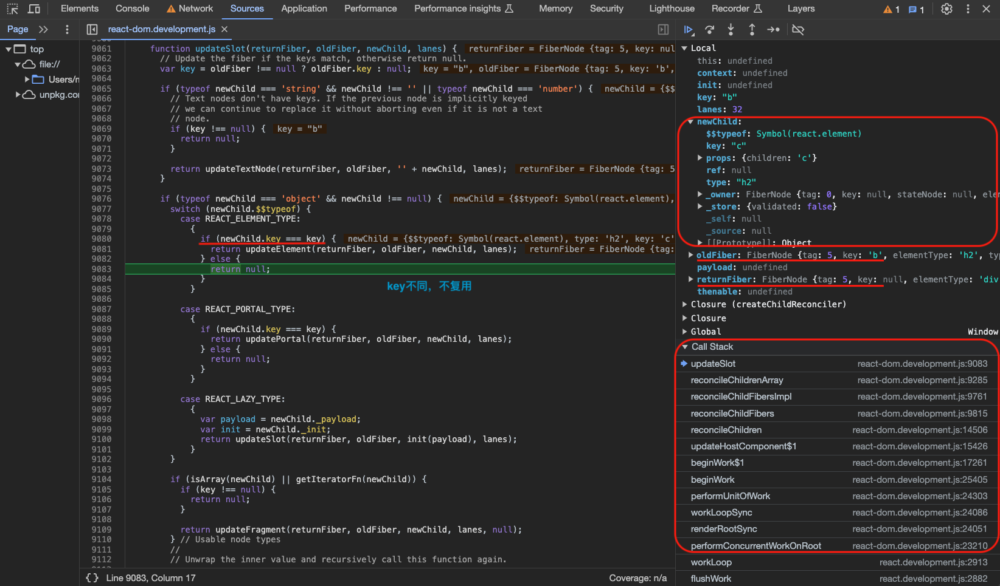
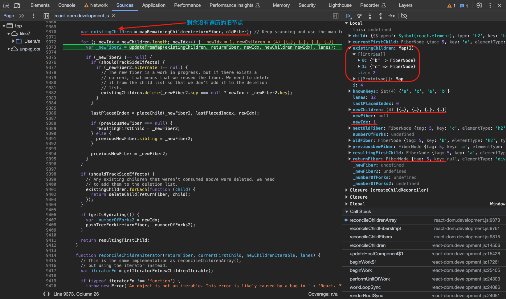
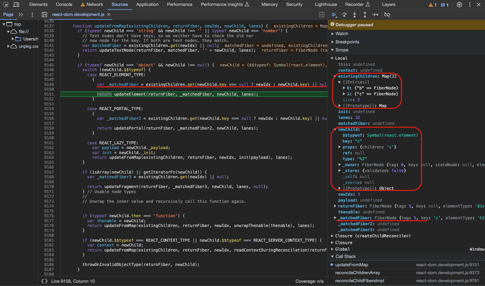

**单节点**处理方法 `reconcileSingleElement` 如下：

```ts
// 【newChild是单节点】
function reconcileSingleElement(
  returnFiber: Fiber,
  currentFirstChild: Fiber | null,
  element: ReactElement,
  lanes: Lanes,
): Fiber {
  const key = element.key;
  let child = currentFirstChild;
  while (child !== null) {
    // TODO: If key === null and child.key === null, then this only applies to
    // the first item in the list.
    if (child.key === key) {
      // 【第一步：查看节点key是否相同】
      const elementType = element.type;
      if (elementType === REACT_FRAGMENT_TYPE) {

        if (child.tag === Fragment) {
          // 【复用当前节点，删除当前节点的兄弟节点】
          deleteRemainingChildren(returnFiber, child.sibling);
          const existing = useFiber(child, element.props.children);
          existing.return = returnFiber;
          if (__DEV__) {
            existing._debugSource = element._source;
            existing._debugOwner = element._owner;
          }
          return existing;
        }
      } else {
        // 【第二步：查看节点elementType是否相同】
        if (
          child.elementType === elementType ||
          // Keep this check inline so it only runs on the false path:
          (__DEV__
            ? isCompatibleFamilyForHotReloading(child, element)
            : false) ||
          // Lazy types should reconcile their resolved type.
          // We need to do this after the Hot Reloading check above,
          // because hot reloading has different semantics than prod because
          // it doesn't resuspend. So we can't let the call below suspend.
          (typeof elementType === 'object' &&
            elementType !== null &&
            elementType.$$typeof === REACT_LAZY_TYPE &&
            resolveLazy(elementType) === child.type)
        ) {
          // 【复用当前节点，删除当前节点的兄弟节点】
          deleteRemainingChildren(returnFiber, child.sibling);
          const existing = useFiber(child, element.props);
          existing.ref = coerceRef(returnFiber, child, element);
          existing.return = returnFiber;
          if (__DEV__) {
            existing._debugSource = element._source;
            existing._debugOwner = element._owner;
          }
          return existing;
        }
      }
      // Didn't match.
      deleteRemainingChildren(returnFiber, child);
      break;
    } else {
      // 【节点key不相同，无法复用旧节点，直接删除旧节点插入新节点】
      deleteChild(returnFiber, child);
    }
    child = child.sibling;
  }

  if (element.type === REACT_FRAGMENT_TYPE) {
    const created = createFiberFromFragment(
      element.props.children,
      returnFiber.mode,
      lanes,
      element.key,
    );
    created.return = returnFiber;
    return created;
  } else {
    const created = createFiberFromElement(element, returnFiber.mode, lanes);
    created.ref = coerceRef(returnFiber, currentFirstChild, element);
    created.return = returnFiber;
    return created;
  }
}
```

`diff` 流程结束后，会形成新的 `fiber` 树，树上的 `fiber` 节点通过 `flags` 字段做了副作用标记：

- `Deletion`：会在`commit`阶段对对应的`DOM`做删除操作
- `Placement`：`Placement` 可能是插入也可能是移动，实际上两种都是插入动作。`React` 在更新时会优先去寻找要插入的 `fiber` 的 `sibling`，如果找到了执行 `DOM` 的 `insertBefore` 方法，如果没有找到就执行 `DOM` 的 `appendChild` 方法，从而实现了新节点插入位置的准确性

### completeWork

`completeUnitOfWork`还是用h1和h2节点的用例来调试

```ts
// 【packages/react-reconciler/src/ReactFiberWorkLoop.js】
function completeUnitOfWork(unitOfWork: Fiber): void {
  // Attempt to complete the current unit of work, then move to the next
  // sibling. If there are no more siblings, return to the parent fiber.
  let completedWork: Fiber = unitOfWork;
  do {
    // The current, flushed, state of this fiber is the alternate. Ideally
    // nothing should rely on this, but relying on it here means that we don't
    // need an additional field on the work in progress.
    const current = completedWork.alternate;
    const returnFiber = completedWork.return;

    // Check if the work completed or if something threw.
    if ((completedWork.flags & Incomplete) === NoFlags) {
      setCurrentDebugFiberInDEV(completedWork);
      let next;
      if (
        !enableProfilerTimer ||
        (completedWork.mode & ProfileMode) === NoMode
      ) {
        // 【completeWork处理当前节点】
        next = completeWork(current, completedWork, renderLanes);
      } else {
        startProfilerTimer(completedWork);
        // 【completeWork处理当前节点】
        next = completeWork(current, completedWork, renderLanes);
        // Update render duration assuming we didn't error.
        stopProfilerTimerIfRunningAndRecordDelta(completedWork, false);
      }
      resetCurrentDebugFiberInDEV();

      if (next !== null) {
        // Completing this fiber spawned new work. Work on that next.
        workInProgress = next;
        return;
      }
    } else {
      // This fiber did not complete because something threw. Pop values off
      // the stack without entering the complete phase. If this is a boundary,
      // capture values if possible.
      const next = unwindWork(current, completedWork, renderLanes);

      // Because this fiber did not complete, don't reset its lanes.

      if (next !== null) {
        // If completing this work spawned new work, do that next. We'll come
        // back here again.
        // Since we're restarting, remove anything that is not a host effect
        // from the effect tag.
        next.flags &= HostEffectMask;
        workInProgress = next;
        return;
      }

      if (
        enableProfilerTimer &&
        (completedWork.mode & ProfileMode) !== NoMode
      ) {
        // Record the render duration for the fiber that errored.
        stopProfilerTimerIfRunningAndRecordDelta(completedWork, false);

        // Include the time spent working on failed children before continuing.
        let actualDuration = completedWork.actualDuration;
        let child = completedWork.child;
        while (child !== null) {
          // $FlowFixMe[unsafe-addition] addition with possible null/undefined value
          actualDuration += child.actualDuration;
          child = child.sibling;
        }
        completedWork.actualDuration = actualDuration;
      }

      if (returnFiber !== null) {
        // Mark the parent fiber as incomplete and clear its subtree flags.
        returnFiber.flags |= Incomplete;
        returnFiber.subtreeFlags = NoFlags;
        returnFiber.deletions = null;
      } else {
        // We've unwound all the way to the root.
        workInProgressRootExitStatus = RootDidNotComplete;
        workInProgress = null;
        return;
      }
    }

    // 【有兄弟节点继续处理兄弟节点】
    const siblingFiber = completedWork.sibling;
    if (siblingFiber !== null) {
      // If there is more work to do in this returnFiber, do that next.
      workInProgress = siblingFiber;
      return;
    }
    // 【没有兄弟节点就回溯到上一层】
    // Otherwise, return to the parent
    // $FlowFixMe[incompatible-type] we bail out when we get a null
    completedWork = returnFiber;
    // Update the next thing we're working on in case something throws.
    workInProgress = completedWork;
  } while (completedWork !== null);

  // We've reached the root.
  if (workInProgressRootExitStatus === RootInProgress) {
    workInProgressRootExitStatus = RootCompleted;
  }
}
```

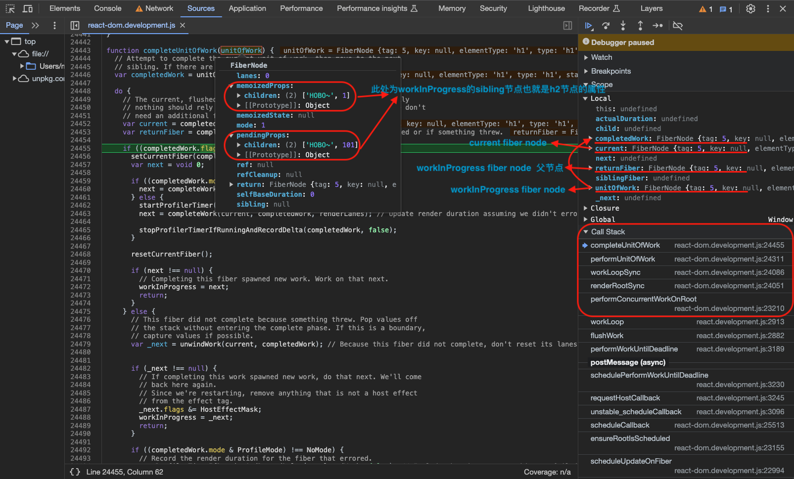

`completeWork`里根据`tag`分类进入不同方法

1. 进入`HostComponent`分支，如果是首次挂载会调用 `createInstance` 创建对应的真实 `DOM` 并赋值给 `workInProgress.stateNode` 属性，但这一次是更新会进入`updateHostComponent`方法；
2. `updateHostComponent`方法会调用`prepareUpdate`继而调用`diffProperties`去对比新旧DOM节点的属性；
     - `onClick`、`onChange`等回调函数的注册
     - 处理`style prop`
     - 处理`children prop`
3. 如果DOM属性有更新那就构造`updatePayload`任务并赋给当前工作节点`workInProgress`的`updateQueue`属性，调用`markUpdate`给当前`fiber`节点`flags`属性标识`Update`；
4. 用例中变化的是显示`count`的部分，这个`fiber`节点在`completeWork`方法中根据`tag`会进入`HostText`分支；

```ts
// 【packages/react-reconciler/src/ReactFiberCompleteWork.js】
function completeWork(
  current: Fiber | null,
  workInProgress: Fiber,
  renderLanes: Lanes,
): Fiber | null {
  const newProps = workInProgress.pendingProps;
  // Note: This intentionally doesn't check if we're hydrating because comparing
  // to the current tree provider fiber is just as fast and less error-prone.
  // Ideally we would have a special version of the work loop only
  // for hydration.
  popTreeContext(workInProgress);
  switch (workInProgress.tag) {
    case IndeterminateComponent:
    case LazyComponent:
    case SimpleMemoComponent:
    case FunctionComponent:
    case ForwardRef:
    case Fragment:
    case Mode:
    case Profiler:
    case ContextConsumer:
    case MemoComponent:
      bubbleProperties(workInProgress);
      return null;
    case ClassComponent: {
      const Component = workInProgress.type;
      if (isLegacyContextProvider(Component)) {
        popLegacyContext(workInProgress);
      }
      bubbleProperties(workInProgress);
      return null;
    }
    case HostRoot: {
      // 【省略代码...】
      return null;
    }
    case HostHoistable: {
      // 【省略代码...】
    }
    // eslint-disable-next-line-no-fallthrough
    case HostSingleton: {
      // 【省略代码...】
    }
    // eslint-disable-next-line-no-fallthrough
    case HostComponent: {
      popHostContext(workInProgress);
      const type = workInProgress.type;
      if (current !== null && workInProgress.stateNode != null) {
        // 【更新组件】
        updateHostComponent(current, workInProgress, type, newProps);

        if (current.ref !== workInProgress.ref) {
          markRef(workInProgress);
        }
      } else {
        // 【首次挂载组件】
        if (!newProps) {
          // 【省略代码...】
        }

        const currentHostContext = getHostContext();
        // TODO: Move createInstance to beginWork and keep it on a context
        // "stack" as the parent. Then append children as we go in beginWork
        // or completeWork depending on whether we want to add them top->down or
        // bottom->up. Top->down is faster in IE11.
        const wasHydrated = popHydrationState(workInProgress);
        if (wasHydrated) {
          // 【省略代码...】
        } else {
          const rootContainerInstance = getRootHostContainer();
          // 【创建对应DOM】
          const instance = createInstance(
            type,
            newProps,
            rootContainerInstance,
            currentHostContext,
            workInProgress,
          );
          appendAllChildren(instance, workInProgress, false, false);
          workInProgress.stateNode = instance;

          // Certain renderers require commit-time effects for initial mount.
          // (eg DOM renderer supports auto-focus for certain elements).
          // Make sure such renderers get scheduled for later work.
          if (
            finalizeInitialChildren(
              instance,
              type,
              newProps,
              currentHostContext,
            )
          ) {
            markUpdate(workInProgress);
          }
        }

        // 【省略代码...】
      }
      // 【省略代码...】
      return null;
    }
    case HostText: {
      // 【省略代码...】
      return null;
    }
    case SuspenseComponent: {
      // 【省略代码...】
      return null;
    }
    case HostPortal:
    // 【省略代码...】
      return null;
    case ContextProvider:
    // 【省略代码...】
      return null;
    case IncompleteClassComponent: {
      // 【省略代码...】
      return null;
    }
    case SuspenseListComponent: {
      // 【省略代码...】
      return null;
    }
    case ScopeComponent: {
      // 【省略代码...】
      break;
    }
    case OffscreenComponent:
    case LegacyHiddenComponent: {
      // 【省略代码...】
    }
    case CacheComponent: {
      // 【省略代码...】
      return null;
    }
    case TracingMarkerComponent: {
      // 【省略代码...】
      return null;
    }
  }

  // 【省略代码...】
}

// 【packages/react-reconciler/src/ReactFiberCompleteWork.js】
function updateHostComponent(
  current: Fiber,
  workInProgress: Fiber,
  type: Type,
  newProps: Props,
) {
  if (supportsMutation) {
    // If we have an alternate, that means this is an update and we need to
    // schedule a side-effect to do the updates.
    const oldProps = current.memoizedProps;
    if (oldProps === newProps) {
      // In mutation mode, this is sufficient for a bailout because
      // we won't touch this node even if children changed.
      return;
    }

    // If we get updated because one of our children updated, we don't
    // have newProps so we'll have to reuse them.
    // TODO: Split the update API as separate for the props vs. children.
    // Even better would be if children weren't special cased at all tho.
    const instance: Instance = workInProgress.stateNode;
    const currentHostContext = getHostContext();
    // TODO: Experiencing an error where oldProps is null. Suggests a host
    // component is hitting the resume path. Figure out why. Possibly
    // related to `hidden`.
    const updatePayload = prepareUpdate(
      instance,
      type,
      oldProps,
      newProps,
      currentHostContext,
    );
    // TODO: Type this specific to this type of component.
    workInProgress.updateQueue = (updatePayload: any);
    // If the update payload indicates that there is a change or if there
    // is a new ref we mark this as an update. All the work is done in commitWork.
    if (updatePayload) {
      markUpdate(workInProgress);
    }
  } else if (supportsPersistence) {
    const currentInstance = current.stateNode;
    const oldProps = current.memoizedProps;
    // If there are no effects associated with this node, then none of our children had any updates.
    // This guarantees that we can reuse all of them.
    const childrenUnchanged = hadNoMutationsEffects(current, workInProgress);
    if (childrenUnchanged && oldProps === newProps) {
      // No changes, just reuse the existing instance.
      // Note that this might release a previous clone.
      workInProgress.stateNode = currentInstance;
      return;
    }
    const recyclableInstance: Instance = workInProgress.stateNode;
    const currentHostContext = getHostContext();
    let updatePayload = null;
    if (oldProps !== newProps) {
      updatePayload = prepareUpdate(
        recyclableInstance,
        type,
        oldProps,
        newProps,
        currentHostContext,
      );
    }
    if (childrenUnchanged && updatePayload === null) {
      // No changes, just reuse the existing instance.
      // Note that this might release a previous clone.
      workInProgress.stateNode = currentInstance;
      return;
    }
    const newInstance = cloneInstance(
      currentInstance,
      updatePayload,
      type,
      oldProps,
      newProps,
      workInProgress,
      childrenUnchanged,
      recyclableInstance,
    );
    if (
      finalizeInitialChildren(newInstance, type, newProps, currentHostContext)
    ) {
      markUpdate(workInProgress);
    }
    workInProgress.stateNode = newInstance;
    if (childrenUnchanged) {
      // If there are no other effects in this tree, we need to flag this node as having one.
      // Even though we're not going to use it for anything.
      // Otherwise parents won't know that there are new children to propagate upwards.
      markUpdate(workInProgress);
    } else {
      // If children might have changed, we have to add them all to the set.
      appendAllChildren(newInstance, workInProgress, false, false);
    }
  }
}

// 【packages/react-dom-bindings/src/client/ReactDOMHostConfig.js】
export function prepareUpdate(
  domElement: Instance,
  type: string,
  oldProps: Props,
  newProps: Props,
  hostContext: HostContext,
): null | Array<mixed> {

  // 【省略代码...】

  return diffProperties(domElement, type, oldProps, newProps);
}

// 【packages/react-dom-bindings/src/client/ReactDOMComponent.js】
// Calculate the diff between the two objects.
export function diffProperties(
  domElement: Element,
  tag: string,
  lastRawProps: Object,
  nextRawProps: Object,
): null | Array<mixed> {
  // 【省略代码...】

  let updatePayload: null | Array<any> = null;

  let lastProps: Object;
  let nextProps: Object;
  switch (tag) {
    case 'input':
      lastProps = ReactDOMInputGetHostProps(domElement, lastRawProps);
      nextProps = ReactDOMInputGetHostProps(domElement, nextRawProps);
      updatePayload = [];
      break;
    case 'select':
      lastProps = ReactDOMSelectGetHostProps(domElement, lastRawProps);
      nextProps = ReactDOMSelectGetHostProps(domElement, nextRawProps);
      updatePayload = [];
      break;
    case 'textarea':
      lastProps = ReactDOMTextareaGetHostProps(domElement, lastRawProps);
      nextProps = ReactDOMTextareaGetHostProps(domElement, nextRawProps);
      updatePayload = [];
      break;
    default:
      lastProps = lastRawProps;
      nextProps = nextRawProps;
      if (
        typeof lastProps.onClick !== 'function' &&
        typeof nextProps.onClick === 'function'
      ) {
        // TODO: This cast may not be sound for SVG, MathML or custom elements.
        trapClickOnNonInteractiveElement(((domElement: any): HTMLElement));
      }
      break;
  }

  assertValidProps(tag, nextProps);

  let propKey;
  let styleName;
  let styleUpdates = null;
  // 【遍历旧属性】
  for (propKey in lastProps) {
    if (
      nextProps.hasOwnProperty(propKey) ||
      !lastProps.hasOwnProperty(propKey) ||
      lastProps[propKey] == null
    ) {
      continue;
    }
    if (propKey === STYLE) {
      const lastStyle = lastProps[propKey];
      for (styleName in lastStyle) {
        if (lastStyle.hasOwnProperty(styleName)) {
          if (!styleUpdates) {
            styleUpdates = ({}: {[string]: $FlowFixMe});
          }
          styleUpdates[styleName] = '';
        }
      }
    } else if (propKey === DANGEROUSLY_SET_INNER_HTML || propKey === CHILDREN) {
      // Noop. This is handled by the clear text mechanism.
    } else if (
      propKey === SUPPRESS_CONTENT_EDITABLE_WARNING ||
      propKey === SUPPRESS_HYDRATION_WARNING
    ) {
      // Noop
    } else if (propKey === AUTOFOCUS) {
      // Noop. It doesn't work on updates anyway.
    } else if (registrationNameDependencies.hasOwnProperty(propKey)) {
      // This is a special case. If any listener updates we need to ensure
      // that the "current" fiber pointer gets updated so we need a commit
      // to update this element.
      if (!updatePayload) {
        updatePayload = [];
      }
    } else {
      // For all other deleted properties we add it to the queue. We use
      // the allowed property list in the commit phase instead.
      (updatePayload = updatePayload || []).push(propKey, null);
    }
  }
  // 【遍历新属性】
  for (propKey in nextProps) {
    const nextProp = nextProps[propKey];
    const lastProp = lastProps != null ? lastProps[propKey] : undefined;
    if (
      !nextProps.hasOwnProperty(propKey) ||
      nextProp === lastProp ||
      (nextProp == null && lastProp == null)
    ) {
      continue;
    }
    if (propKey === STYLE) {
      if (__DEV__) {
        if (nextProp) {
          // Freeze the next style object so that we can assume it won't be
          // mutated. We have already warned for this in the past.
          Object.freeze(nextProp);
        }
      }
      if (lastProp) {
        // Unset styles on `lastProp` but not on `nextProp`.
        for (styleName in lastProp) {
          if (
            lastProp.hasOwnProperty(styleName) &&
            (!nextProp || !nextProp.hasOwnProperty(styleName))
          ) {
            if (!styleUpdates) {
              styleUpdates = ({}: {[string]: string});
            }
            styleUpdates[styleName] = '';
          }
        }
        // Update styles that changed since `lastProp`.
        for (styleName in nextProp) {
          if (
            nextProp.hasOwnProperty(styleName) &&
            lastProp[styleName] !== nextProp[styleName]
          ) {
            if (!styleUpdates) {
              styleUpdates = ({}: {[string]: $FlowFixMe});
            }
            styleUpdates[styleName] = nextProp[styleName];
          }
        }
      } else {
        // Relies on `updateStylesByID` not mutating `styleUpdates`.
        if (!styleUpdates) {
          if (!updatePayload) {
            updatePayload = [];
          }
          updatePayload.push(propKey, styleUpdates);
        }
        styleUpdates = nextProp;
      }
    } else if (propKey === DANGEROUSLY_SET_INNER_HTML) {
      const nextHtml = nextProp ? nextProp[HTML] : undefined;
      const lastHtml = lastProp ? lastProp[HTML] : undefined;
      if (nextHtml != null) {
        if (lastHtml !== nextHtml) {
          (updatePayload = updatePayload || []).push(propKey, nextHtml);
        }
      } else {
        // TODO: It might be too late to clear this if we have children
        // inserted already.
      }
    } else if (propKey === CHILDREN) {
      if (typeof nextProp === 'string' || typeof nextProp === 'number') {
        (updatePayload = updatePayload || []).push(propKey, '' + nextProp);
      }
    } else if (
      propKey === SUPPRESS_CONTENT_EDITABLE_WARNING ||
      propKey === SUPPRESS_HYDRATION_WARNING
    ) {
      // Noop
    } else if (registrationNameDependencies.hasOwnProperty(propKey)) {
      if (nextProp != null) {
        // We eagerly listen to this even though we haven't committed yet.
        if (__DEV__ && typeof nextProp !== 'function') {
          warnForInvalidEventListener(propKey, nextProp);
        }
        if (propKey === 'onScroll') {
          listenToNonDelegatedEvent('scroll', domElement);
        }
      }
      if (!updatePayload && lastProp !== nextProp) {
        // This is a special case. If any listener updates we need to ensure
        // that the "current" props pointer gets updated so we need a commit
        // to update this element.
        updatePayload = [];
      }
    } else {
      // For any other property we always add it to the queue and then we
      // filter it out using the allowed property list during the commit.
      (updatePayload = updatePayload || []).push(propKey, nextProp);
    }
  }
  if (styleUpdates) {
    if (__DEV__) {
      validateShorthandPropertyCollisionInDev(styleUpdates, nextProps[STYLE]);
    }
    (updatePayload = updatePayload || []).push(STYLE, styleUpdates);
  }
  return updatePayload;
}

function markUpdate(workInProgress: Fiber) {
  // Tag the fiber with an update effect. This turns a Placement into
  // a PlacementAndUpdate.
  workInProgress.flags |= Update;
}
```

最后一步步往上回溯形成一颗完整的`fiber`树结构。

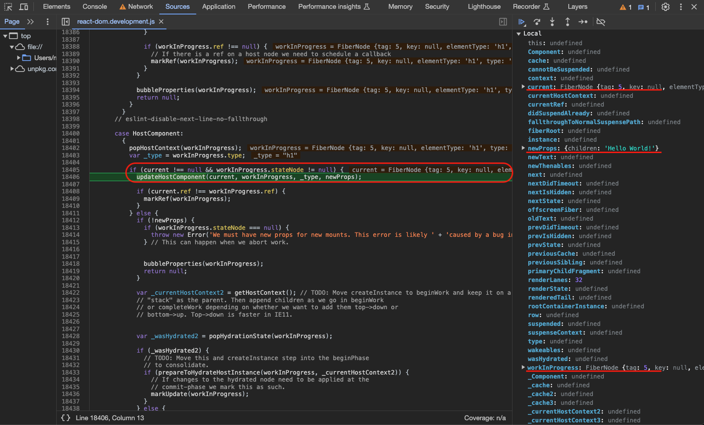

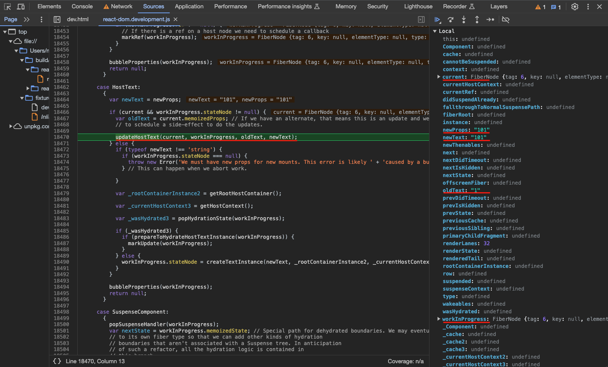

### updateHostComponent

已知在`beginWork`和`completeWork`过程中都会根据不同的`fiber.tag`进入不同的处理方法直到处理完所有的节点，那就来看一下这两个阶段对于组件的处理方法都叫做`updateHostComponent`：

```ts
// 【packages/react-reconciler/src/ReactFiberBeginWork.js】
function updateHostComponent(
  current: Fiber | null,
  workInProgress: Fiber,
  renderLanes: Lanes,
) {
  pushHostContext(workInProgress);

  if (current === null) {
    tryToClaimNextHydratableInstance(workInProgress);
  }

  const type = workInProgress.type;
  const nextProps = workInProgress.pendingProps;
  const prevProps = current !== null ? current.memoizedProps : null;

  let nextChildren = nextProps.children;
  const isDirectTextChild = shouldSetTextContent(type, nextProps);

  if (isDirectTextChild) {
    // We special case a direct text child of a host node. This is a common
    // case. We won't handle it as a reified child. We will instead handle
    // this in the host environment that also has access to this prop. That
    // avoids allocating another HostText fiber and traversing it.
    nextChildren = null;
  } else if (prevProps !== null && shouldSetTextContent(type, prevProps)) {
    // If we're switching from a direct text child to a normal child, or to
    // empty, we need to schedule the text content to be reset.
    workInProgress.flags |= ContentReset;
  }

  markRef(current, workInProgress);
  reconcileChildren(current, workInProgress, nextChildren, renderLanes);
  return workInProgress.child;
}
```

```ts
// 【packages/react-reconciler/src/ReactFiberCompleteWork.js】
function updateHostComponent(
  current: Fiber,
  workInProgress: Fiber,
  type: Type,
  newProps: Props,
) {
  if (supportsMutation) {
    // If we have an alternate, that means this is an update and we need to
    // schedule a side-effect to do the updates.
    const oldProps = current.memoizedProps;
    if (oldProps === newProps) {
      // In mutation mode, this is sufficient for a bailout because
      // we won't touch this node even if children changed.
      return;
    }

    // If we get updated because one of our children updated, we don't
    // have newProps so we'll have to reuse them.
    // TODO: Split the update API as separate for the props vs. children.
    // Even better would be if children weren't special cased at all tho.
    const instance: Instance = workInProgress.stateNode;
    const currentHostContext = getHostContext();
    // TODO: Experiencing an error where oldProps is null. Suggests a host
    // component is hitting the resume path. Figure out why. Possibly
    // related to `hidden`.
    const updatePayload = prepareUpdate(
      instance,
      type,
      oldProps,
      newProps,
      currentHostContext,
    );
    // TODO: Type this specific to this type of component.
    workInProgress.updateQueue = (updatePayload: any);
    // If the update payload indicates that there is a change or if there
    // is a new ref we mark this as an update. All the work is done in commitWork.
    if (updatePayload) {
      markUpdate(workInProgress);
    }
  } else if (supportsPersistence) {
    const currentInstance = current.stateNode;
    const oldProps = current.memoizedProps;
    // If there are no effects associated with this node, then none of our children had any updates.
    // This guarantees that we can reuse all of them.
    const childrenUnchanged = hadNoMutationsEffects(current, workInProgress);
    if (childrenUnchanged && oldProps === newProps) {
      // No changes, just reuse the existing instance.
      // Note that this might release a previous clone.
      workInProgress.stateNode = currentInstance;
      return;
    }
    const recyclableInstance: Instance = workInProgress.stateNode;
    const currentHostContext = getHostContext();
    let updatePayload = null;
    if (oldProps !== newProps) {
      updatePayload = prepareUpdate(
        recyclableInstance,
        type,
        oldProps,
        newProps,
        currentHostContext,
      );
    }
    if (childrenUnchanged && updatePayload === null) {
      // No changes, just reuse the existing instance.
      // Note that this might release a previous clone.
      workInProgress.stateNode = currentInstance;
      return;
    }
    const newInstance = cloneInstance(
      currentInstance,
      updatePayload,
      type,
      oldProps,
      newProps,
      workInProgress,
      childrenUnchanged,
      recyclableInstance,
    );
    if (
      finalizeInitialChildren(newInstance, type, newProps, currentHostContext)
    ) {
      markUpdate(workInProgress);
    }
    workInProgress.stateNode = newInstance;
    if (childrenUnchanged) {
      // If there are no other effects in this tree, we need to flag this node as having one.
      // Even though we're not going to use it for anything.
      // Otherwise parents won't know that there are new children to propagate upwards.
      markUpdate(workInProgress);
    } else {
      // If children might have changed, we have to add them all to the set.
      appendAllChildren(newInstance, workInProgress, false, false);
    }
  }
}
```

## commit流程

`scheduleUpdateOnFiber` => `ensureRootIsScheduled` => ... => `performConcurrentWorkOnRoot` => `renderRootConcurrent`/`renderRootSync` + `commitRoot`

`commitRoot` => `commitRootImpl` => `scheduleCallback(flushPassiveEffects)` => `commitBeforeMutationEffects` + `commitMutationEffects` + `commitLayoutEffects`

```ts
// 【packages/react-reconciler/src/ReactFiberWorkLoop.js】
function commitRootImpl(
  root: FiberRoot,
  recoverableErrors: null | Array<CapturedValue<mixed>>,
  transitions: Array<Transition> | null,
  renderPriorityLevel: EventPriority,
) {
  do {
    // `flushPassiveEffects` will call `flushSyncUpdateQueue` at the end, which
    // means `flushPassiveEffects` will sometimes result in additional
    // passive effects. So we need to keep flushing in a loop until there are
    // no more pending effects.
    // TODO: Might be better if `flushPassiveEffects` did not automatically
    // flush synchronous work at the end, to avoid factoring hazards like this.
    flushPassiveEffects();
  } while (rootWithPendingPassiveEffects !== null);

  // 【省略代码...】

  const finishedWork = root.finishedWork;
  const lanes = root.finishedLanes;

  // 【省略代码...】


  root.finishedWork = null;
  root.finishedLanes = NoLanes;

  // commitRoot never returns a continuation; it always finishes synchronously.
  // So we can clear these now to allow a new callback to be scheduled.
  root.callbackNode = null;
  root.callbackPriority = NoLane;

  if (root === workInProgressRoot) {
    // We can reset these now that they are finished.
    workInProgressRoot = null;
    workInProgress = null;
    workInProgressRootRenderLanes = NoLanes;
  } else {
    // This indicates that the last root we worked on is not the same one that
    // we're committing now. This most commonly happens when a suspended root
    // times out.
  }

  // 【省略代码...】

  // Check if there are any effects in the whole tree.
  // TODO: This is left over from the effect list implementation, where we had
  // to check for the existence of `firstEffect` to satisfy Flow. I think the
  // only other reason this optimization exists is because it affects profiling.
  // Reconsider whether this is necessary.
  const subtreeHasEffects =
    (finishedWork.subtreeFlags &
      (BeforeMutationMask | MutationMask | LayoutMask | PassiveMask)) !==
    NoFlags;
  const rootHasEffect =
    (finishedWork.flags &
      (BeforeMutationMask | MutationMask | LayoutMask | PassiveMask)) !==
    NoFlags;

  if (subtreeHasEffects || rootHasEffect) {
    // 【省略代码...】

    // The commit phase is broken into several sub-phases. We do a separate pass
    // of the effect list for each phase: all mutation effects come before all
    // layout effects, and so on.

    // The first phase a "before mutation" phase. We use this phase to read the
    // state of the host tree right before we mutate it. This is where
    // getSnapshotBeforeUpdate is called.
    // 【-----第一步 commitBeforeMutationEffects-----】
    const shouldFireAfterActiveInstanceBlur = commitBeforeMutationEffects(
      root,
      finishedWork,
    );

    // 【省略代码...】

    // 【-----第二步 commitMutationEffects-----】
    // The next phase is the mutation phase, where we mutate the host tree.
    commitMutationEffects(root, finishedWork, lanes);

    // 【省略代码...】

    // The work-in-progress tree is now the current tree. This must come after
    // the mutation phase, so that the previous tree is still current during
    // componentWillUnmount, but before the layout phase, so that the finished
    // work is current during componentDidMount/Update.
    root.current = finishedWork;

    // The next phase is the layout phase, where we call effects that read
    // the host tree after it's been mutated. The idiomatic use case for this is
    // layout, but class component lifecycles also fire here for legacy reasons.

    // 【省略代码...】

    // 【-----第三步 commitLayoutEffects-----】
    commitLayoutEffects(finishedWork, root, lanes);
    
    // 【省略代码...】

    // Tell Scheduler to yield at the end of the frame, so the browser has an
    // opportunity to paint.
    requestPaint();

    // 【省略代码...】
  } else {
    // No effects.
    root.current = finishedWork;
    // Measure these anyway so the flamegraph explicitly shows that there were
    // no effects.
    // TODO: Maybe there's a better way to report this.
    if (enableProfilerTimer) {
      recordCommitTime();
    }
  }
  // 【省略代码...】

  // If layout work was scheduled, flush it now.
  flushSyncCallbacks();

  // 【省略代码...】

  return null;
}

// 【packages/react-reconciler/src/ReactFiberCommitWork.js】
export function commitMutationEffects(
  root: FiberRoot,
  finishedWork: Fiber,
  committedLanes: Lanes,
) {
  inProgressLanes = committedLanes;
  inProgressRoot = root;

  setCurrentDebugFiberInDEV(finishedWork);
  commitMutationEffectsOnFiber(finishedWork, root, committedLanes);
  setCurrentDebugFiberInDEV(finishedWork);

  inProgressLanes = null;
  inProgressRoot = null;
}
```

1. `commitBeforeMutationEffects`

   - `DOM` 变化之前。主要处理节点标记（`flags`）为`Snapshot`, `Deletion`等的`fiber`节点。

2. `commitMutationEffects`
  
   - `DOM` 变化阶段。 主要处理节点标记（`flags`）为`Placement`, `Update`, `Deletion`, `Hydrating`, `Ref`等的`fiber`节点。这个阶段会调用`useLayoutEffect`这个`hook`对应的`effect`实例的`destroy`。处理的顺序是`Deletion`、`Placement`、`Update`。

3. `commitLayoutEffects`
  
   - `DOM` 变化后。主要处理节点标记（`flags`）为`Update` , `Callback`, `Ref`等的`fiber`节点。这个阶段会调用`useLayoutEffect`这个`hook`对应的`effect`实例的`create`。

### commitBeforeMutationEffects

`commitBeforeMutationEffects` 阶段发生在 `DOM` 变更之前。这个阶段主要是为了执行一些副作用操作，这些副作用需要在 DOM 发生实际变更之前执行。这个阶段可以处理所有和 DOM 更新无关的副作用，比如更新 ref、清理操作或将数据同步到外部系统等。

```ts
// 【packages/react-reconciler/src/ReactFiberCommitWork.js】
export function commitBeforeMutationEffects(
  root: FiberRoot,
  firstChild: Fiber,
): boolean {
  focusedInstanceHandle = prepareForCommit(root.containerInfo);

  nextEffect = firstChild;
  commitBeforeMutationEffects_begin();

  // We no longer need to track the active instance fiber
  const shouldFire = shouldFireAfterActiveInstanceBlur;
  shouldFireAfterActiveInstanceBlur = false;
  focusedInstanceHandle = null;

  return shouldFire;
}

function commitBeforeMutationEffects_begin() {
  while (nextEffect !== null) {
    const fiber = nextEffect;

    // This phase is only used for beforeActiveInstanceBlur.
    // Let's skip the whole loop if it's off.
    if (enableCreateEventHandleAPI) {
      // TODO: Should wrap this in flags check, too, as optimization
      const deletions = fiber.deletions;
      if (deletions !== null) {
        for (let i = 0; i < deletions.length; i++) {
          const deletion = deletions[i];
          commitBeforeMutationEffectsDeletion(deletion);
        }
      }
    }

    const child = fiber.child;
    if (
      (fiber.subtreeFlags & BeforeMutationMask) !== NoFlags &&
      child !== null
    ) {
      child.return = fiber;
      nextEffect = child;
    } else {
      commitBeforeMutationEffects_complete();
    }
  }
}

function commitBeforeMutationEffects_complete() {
  while (nextEffect !== null) {
    const fiber = nextEffect;
    setCurrentDebugFiberInDEV(fiber);
    try {
      commitBeforeMutationEffectsOnFiber(fiber);
    } catch (error) {
      captureCommitPhaseError(fiber, fiber.return, error);
    }
    resetCurrentDebugFiberInDEV();

    const sibling = fiber.sibling;
    if (sibling !== null) {
      sibling.return = fiber.return;
      nextEffect = sibling;
      return;
    }

    nextEffect = fiber.return;
  }
}

function commitBeforeMutationEffectsOnFiber(finishedWork: Fiber) {
  const current = finishedWork.alternate;
  const flags = finishedWork.flags;

  if (enableCreateEventHandleAPI) {
    if (!shouldFireAfterActiveInstanceBlur && focusedInstanceHandle !== null) {
      // Check to see if the focused element was inside of a hidden (Suspense) subtree.
      // TODO: Move this out of the hot path using a dedicated effect tag.
      if (
        finishedWork.tag === SuspenseComponent &&
        isSuspenseBoundaryBeingHidden(current, finishedWork) &&
        // $FlowFixMe[incompatible-call] found when upgrading Flow
        doesFiberContain(finishedWork, focusedInstanceHandle)
      ) {
        shouldFireAfterActiveInstanceBlur = true;
        beforeActiveInstanceBlur(finishedWork);
      }
    }
  }

  if ((flags & Snapshot) !== NoFlags) {
    setCurrentDebugFiberInDEV(finishedWork);
  }

  switch (finishedWork.tag) {
    case FunctionComponent: {
      if (enableUseEffectEventHook) {
        if ((flags & Update) !== NoFlags) {
          commitUseEffectEventMount(finishedWork);
        }
      }
      break;
    }
    case ForwardRef:
    case SimpleMemoComponent: {
      break;
    }
    case ClassComponent: {
      if ((flags & Snapshot) !== NoFlags) {
        if (current !== null) {
          const prevProps = current.memoizedProps;
          const prevState = current.memoizedState;
          const instance = finishedWork.stateNode;
          // We could update instance props and state here,
          // but instead we rely on them being set during last render.
          // TODO: revisit this when we implement resuming.
          if (__DEV__) {
            if (
              finishedWork.type === finishedWork.elementType &&
              !didWarnAboutReassigningProps
            ) {
              if (instance.props !== finishedWork.memoizedProps) {
                console.error(
                  'Expected %s props to match memoized props before ' +
                    'getSnapshotBeforeUpdate. ' +
                    'This might either be because of a bug in React, or because ' +
                    'a component reassigns its own `this.props`. ' +
                    'Please file an issue.',
                  getComponentNameFromFiber(finishedWork) || 'instance',
                );
              }
              if (instance.state !== finishedWork.memoizedState) {
                console.error(
                  'Expected %s state to match memoized state before ' +
                    'getSnapshotBeforeUpdate. ' +
                    'This might either be because of a bug in React, or because ' +
                    'a component reassigns its own `this.state`. ' +
                    'Please file an issue.',
                  getComponentNameFromFiber(finishedWork) || 'instance',
                );
              }
            }
          }
          const snapshot = instance.getSnapshotBeforeUpdate(
            finishedWork.elementType === finishedWork.type
              ? prevProps
              : resolveDefaultProps(finishedWork.type, prevProps),
            prevState,
          );
          if (__DEV__) {
            const didWarnSet =
              ((didWarnAboutUndefinedSnapshotBeforeUpdate: any): Set<mixed>);
            if (snapshot === undefined && !didWarnSet.has(finishedWork.type)) {
              didWarnSet.add(finishedWork.type);
              console.error(
                '%s.getSnapshotBeforeUpdate(): A snapshot value (or null) ' +
                  'must be returned. You have returned undefined.',
                getComponentNameFromFiber(finishedWork),
              );
            }
          }
          instance.__reactInternalSnapshotBeforeUpdate = snapshot;
        }
      }
      break;
    }
    case HostRoot: {
      if ((flags & Snapshot) !== NoFlags) {
        if (supportsMutation) {
          const root = finishedWork.stateNode;
          clearContainer(root.containerInfo);
        }
      }
      break;
    }
    case HostComponent:
    case HostHoistable:
    case HostSingleton:
    case HostText:
    case HostPortal:
    case IncompleteClassComponent:
      // Nothing to do for these component types
      break;
    default: {
      if ((flags & Snapshot) !== NoFlags) {
        throw new Error(
          'This unit of work tag should not have side-effects. This error is ' +
            'likely caused by a bug in React. Please file an issue.',
        );
      }
    }
  }

  if ((flags & Snapshot) !== NoFlags) {
    resetCurrentDebugFiberInDEV();
  }
}

function commitBeforeMutationEffectsDeletion(deletion: Fiber) {
  if (enableCreateEventHandleAPI) {
    // TODO (effects) It would be nice to avoid calling doesFiberContain()
    // Maybe we can repurpose one of the subtreeFlags positions for this instead?
    // Use it to store which part of the tree the focused instance is in?
    // This assumes we can safely determine that instance during the "render" phase.
    if (doesFiberContain(deletion, ((focusedInstanceHandle: any): Fiber))) {
      shouldFireAfterActiveInstanceBlur = true;
      beforeActiveInstanceBlur(deletion);
    }
  }
}
```

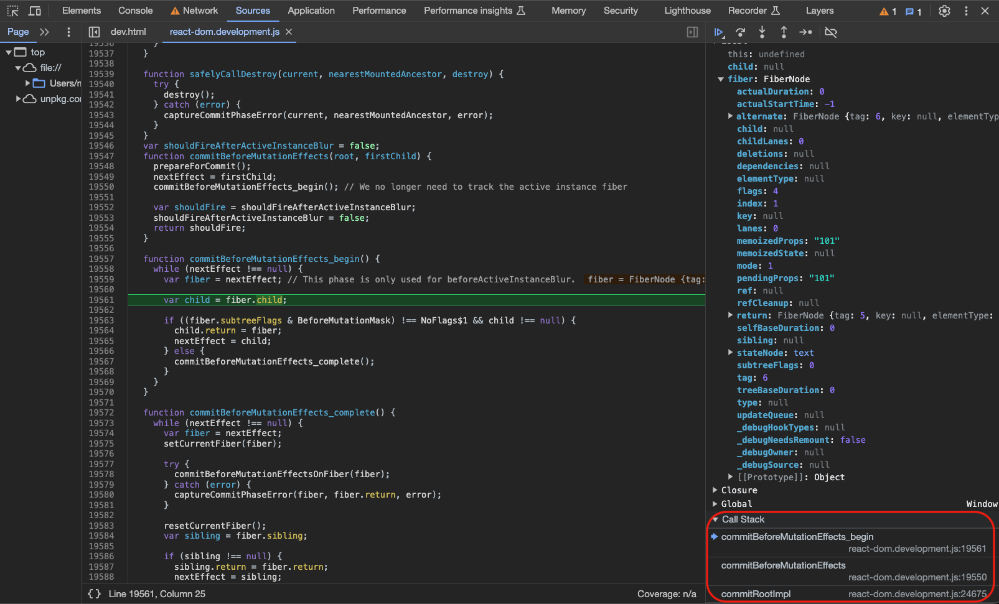

### commitMutationEffects

`commitMutationEffects` 阶段是主要是处理 DOM 节点的实际更新，应用组件树中需要修改的 DOM 元素。

`commitRoot` => `commitRootImpl` => `commitMutationEffects` => `commitMutationEffectsOnFiber` => `recursivelyTraverseMutationEffects` + `commitReconciliationEffects`

```ts
// 【packages/react-reconciler/src/ReactFiberCommitWork.js】
export function commitMutationEffects(
  root: FiberRoot,
  finishedWork: Fiber,
  committedLanes: Lanes,
) {
  inProgressLanes = committedLanes;
  inProgressRoot = root;

  setCurrentDebugFiberInDEV(finishedWork);
  commitMutationEffectsOnFiber(finishedWork, root, committedLanes);
  setCurrentDebugFiberInDEV(finishedWork);

  inProgressLanes = null;
  inProgressRoot = null;
}
```

1. `commitMutationEffectsOnFiber`：主要是根据`fiber node`的`tag`类型进入不同处理方法，通常会进入`recursivelyTraverseMutationEffects`和`commitReconciliationEffects`方法，这两步走完之后处理`flags`是`Update`的情况；
2. `recursivelyTraverseMutationEffects`：主要先将需要删除的节点`flags`是`Deletion`删除，然后确定下一步是否有需要`mutation`的子节点，然后继续去调用`commitMutationEffectsOnFiber`；
3. `commitReconciliationEffects`：主要是处理`flags`是`Placement`的节点，也就是新增、插入的节点；

基于我们的用例，它进入`commitMutationEffects`的整个过程是这样的：

1. `HostRoot`节点在`commitMutationEffectsOnFiber`方法中进入`HostRoot`分支，然后进入`recursivelyTraverseMutationEffects`方法，找到下一个需要操作的节点ƒ App()对应节点；
2. `ƒ App()`对应节点在`commitMutationEffectsOnFiber`方法中进入`SimpleMemoComponent`分支，然后进入`recursivelyTraverseMutationEffects`方法找到下一个需要操作的节点`div`对应节点；
3. `div`对应节点在`commitMutationEffectsOnFiber`方法中进入`HostComponent`分支，然后进入`recursivelyTraverseMutationEffects`方法找到下一个需要操作的节点`h1`对应节点；
4. `h1`对应节点在`commitMutationEffectsOnFiber`方法中进入`HostComponent`分支，然后进入`recursivelyTraverseMutationEffects`方法发现`h1`对应节点已经没有需要作用的子节点，那就进入`h1`对应节点的`commitReconciliationEffects`方法，这个方法主要处理`flags`为`Placement`的情况，`h1`对应节点并没有`Placement`，所以退出该方法，此时回到了`div`对应节点的`recursivelyTraverseMutationEffects`方法；
5. `div`对应节点的`recursivelyTraverseMutationEffects`方法此时去寻找子节点是否有`sibling`节点，发现子节点`h1`存在`sibling`节点`h2`，所以进入`h2`对应节点的`commitMutationEffectsOnFiber`方法；
6. `h2`对应节点在`commitMutationEffectsOnFiber`方法中进入`HostComponent`分支，然后进入`recursivelyTraverseMutationEffects`方法找到下一个需要操作的节点`HOBO~`对应文本节点；
7. `HOBO~`对应文本节点在`commitMutationEffectsOnFiber`方法中进入`HostText`分支，然后进入`recursivelyTraverseMutationEffects`方法发现已经没有需要操作的子节点，那就进入`HOBO~`对应文本节点的`commitReconciliationEffects`方法，`HOBO~`对应文本节点没有`Placement`，所以退出该方法，此时回到`h2`对应节点的`recursivelyTraverseMutationEffects`方法；
8. `h2`对应节点的`recursivelyTraverseMutationEffects`方法此时去寻找子节点是否有`sibling`节点，发现子节点`HOBO~`对应文本节点存在`sibling`节点`{count}`，所以进入`{count}`对应节点的`commitMutationEffectsOnFiber`方法；
9. `{count}`对应文本节点在`commitMutationEffectsOnFiber`方法中进入`HostText`分支，然后进入`recursivelyTraverseMutationEffects`方法发现已经没有需要操作的子节点，那就进入`{count}`对应文本节点的`commitReconciliationEffects`方法，`{count}`对应文本节点没有`Placement`，所以退出该方法，回到`HostText`分支监测`flags`是否有`Update`标志，发现存在`Update`标志，所以去更新文本把`1`变成了`101`；
10. 然后一步步回到根节点，完成遍历；

```ts
// 【packages/react-reconciler/src/ReactFiberCommitWork.js】
function commitMutationEffectsOnFiber(
  finishedWork: Fiber,
  root: FiberRoot,
  lanes: Lanes,
) {
  const current = finishedWork.alternate;
  const flags = finishedWork.flags;

  // The effect flag should be checked *after* we refine the type of fiber,
  // because the fiber tag is more specific. An exception is any flag related
  // to reconciliation, because those can be set on all fiber types.
  switch (finishedWork.tag) {
    case FunctionComponent:
    case ForwardRef:
    case MemoComponent:
    case SimpleMemoComponent: {
      recursivelyTraverseMutationEffects(root, finishedWork, lanes);
      commitReconciliationEffects(finishedWork);

      if (flags & Update) {
        // 【省略代码...】
      }
      return;
    }
    case ClassComponent: {
      recursivelyTraverseMutationEffects(root, finishedWork, lanes);
      commitReconciliationEffects(finishedWork);

      // 【省略代码...】

      return;
    }
    case HostHoistable: {
      // 【省略代码...】
    }
    // eslint-disable-next-line-no-fallthrough
    case HostSingleton: {
      // 【省略代码...】
    }
    // eslint-disable-next-line-no-fallthrough
    case HostComponent: {
      recursivelyTraverseMutationEffects(root, finishedWork, lanes);
      commitReconciliationEffects(finishedWork);

      if (flags & Ref) {
        if (current !== null) {
          safelyDetachRef(current, current.return);
        }
      }
      if (supportsMutation) {
        // TODO: ContentReset gets cleared by the children during the commit
        // phase. This is a refactor hazard because it means we must read
        // flags the flags after `commitReconciliationEffects` has already run;
        // the order matters. We should refactor so that ContentReset does not
        // rely on mutating the flag during commit. Like by setting a flag
        // during the render phase instead.
        if (finishedWork.flags & ContentReset) {
          const instance: Instance = finishedWork.stateNode;
          try {
            resetTextContent(instance);
          } catch (error) {
            captureCommitPhaseError(finishedWork, finishedWork.return, error);
          }
        }

        if (flags & Update) {
          const instance: Instance = finishedWork.stateNode;
          if (instance != null) {
            // Commit the work prepared earlier.
            const newProps = finishedWork.memoizedProps;
            // For hydration we reuse the update path but we treat the oldProps
            // as the newProps. The updatePayload will contain the real change in
            // this case.
            const oldProps =
              current !== null ? current.memoizedProps : newProps;
            const type = finishedWork.type;
            // TODO: Type the updateQueue to be specific to host components.
            const updatePayload: null | UpdatePayload =
              (finishedWork.updateQueue: any);
            finishedWork.updateQueue = null;
            if (updatePayload !== null) {
              try {
                commitUpdate(
                  instance,
                  updatePayload,
                  type,
                  oldProps,
                  newProps,
                  finishedWork,
                );
              } catch (error) {
                captureCommitPhaseError(
                  finishedWork,
                  finishedWork.return,
                  error,
                );
              }
            }
          }
        }
      }
      return;
    }
    case HostText: {
      recursivelyTraverseMutationEffects(root, finishedWork, lanes);
      commitReconciliationEffects(finishedWork);

      if (flags & Update) {
        if (supportsMutation) {
          if (finishedWork.stateNode === null) {
            throw new Error(
              'This should have a text node initialized. This error is likely ' +
                'caused by a bug in React. Please file an issue.',
            );
          }

          const textInstance: TextInstance = finishedWork.stateNode;
          const newText: string = finishedWork.memoizedProps;
          // For hydration we reuse the update path but we treat the oldProps
          // as the newProps. The updatePayload will contain the real change in
          // this case.
          const oldText: string =
            current !== null ? current.memoizedProps : newText;

          try {
            commitTextUpdate(textInstance, oldText, newText);
          } catch (error) {
            captureCommitPhaseError(finishedWork, finishedWork.return, error);
          }
        }
      }
      return;
    }
    case HostRoot: {
      if (enableFloat && supportsResources) {
        prepareToCommitHoistables();

        const previousHoistableRoot = currentHoistableRoot;
        currentHoistableRoot = getHoistableRoot(root.containerInfo);

        recursivelyTraverseMutationEffects(root, finishedWork, lanes);
        currentHoistableRoot = previousHoistableRoot;

        commitReconciliationEffects(finishedWork);
      } else {
        recursivelyTraverseMutationEffects(root, finishedWork, lanes);
        commitReconciliationEffects(finishedWork);
      }

      if (flags & Update) {
        if (supportsMutation && supportsHydration) {
          if (current !== null) {
            const prevRootState: RootState = current.memoizedState;
            if (prevRootState.isDehydrated) {
              try {
                commitHydratedContainer(root.containerInfo);
              } catch (error) {
                captureCommitPhaseError(
                  finishedWork,
                  finishedWork.return,
                  error,
                );
              }
            }
          }
        }
        if (supportsPersistence) {
          const containerInfo = root.containerInfo;
          const pendingChildren = root.pendingChildren;
          try {
            replaceContainerChildren(containerInfo, pendingChildren);
          } catch (error) {
            captureCommitPhaseError(finishedWork, finishedWork.return, error);
          }
        }
      }
      return;
    }
    case HostPortal: {
      // 【省略代码...】
      return;
    }
    case SuspenseComponent: {
      recursivelyTraverseMutationEffects(root, finishedWork, lanes);
      commitReconciliationEffects(finishedWork);

      // 【省略代码...】

      if (flags & Update) {
        // 【省略代码...】
      }
      return;
    }
    case OffscreenComponent: {
      // 【省略代码...】
      return;
    }
    case SuspenseListComponent: {
      // 【省略代码...】
      return;
    }
    case ScopeComponent: {
      // 【省略代码...】
      return;
    }
    default: {
      recursivelyTraverseMutationEffects(root, finishedWork, lanes);
      commitReconciliationEffects(finishedWork);

      return;
    }
  }
}

// 【packages/react-reconciler/src/ReactFiberCommitWork.js】
function recursivelyTraverseMutationEffects(
  root: FiberRoot,
  parentFiber: Fiber,
  lanes: Lanes,
) {
  // Deletions effects can be scheduled on any fiber type. They need to happen
  // before the children effects hae fired.
  const deletions = parentFiber.deletions;
  if (deletions !== null) {
    for (let i = 0; i < deletions.length; i++) {
      const childToDelete = deletions[i];
      try {
        commitDeletionEffects(root, parentFiber, childToDelete);
      } catch (error) {
        captureCommitPhaseError(childToDelete, parentFiber, error);
      }
    }
  }

  const prevDebugFiber = getCurrentDebugFiberInDEV();
  if (parentFiber.subtreeFlags & MutationMask) {
    // 【找到下一个需要作用的节点，进入下一个节点的commitMutationEffectsOnFiber过程】
    let child = parentFiber.child;
    while (child !== null) {
      setCurrentDebugFiberInDEV(child);
      commitMutationEffectsOnFiber(child, root, lanes);
      // 【没有需要作用的子节点，查看是否有需要作用的兄弟节点】
      child = child.sibling;
    }
  }
  setCurrentDebugFiberInDEV(prevDebugFiber);
}

// 【packages/react-reconciler/src/ReactFiberCommitWork.js】
function commitReconciliationEffects(finishedWork: Fiber) {
  // Placement effects (insertions, reorders) can be scheduled on any fiber
  // type. They needs to happen after the children effects have fired, but
  // before the effects on this fiber have fired.
  const flags = finishedWork.flags;
  if (flags & Placement) {
    try {
      commitPlacement(finishedWork);
    } catch (error) {
      captureCommitPhaseError(finishedWork, finishedWork.return, error);
    }
    // Clear the "placement" from effect tag so that we know that this is
    // inserted, before any life-cycles like componentDidMount gets called.
    // TODO: findDOMNode doesn't rely on this any more but isMounted does
    // and isMounted is deprecated anyway so we should be able to kill this.
    finishedWork.flags &= ~Placement;
  }
  if (flags & Hydrating) {
    finishedWork.flags &= ~Hydrating;
  }
}
```

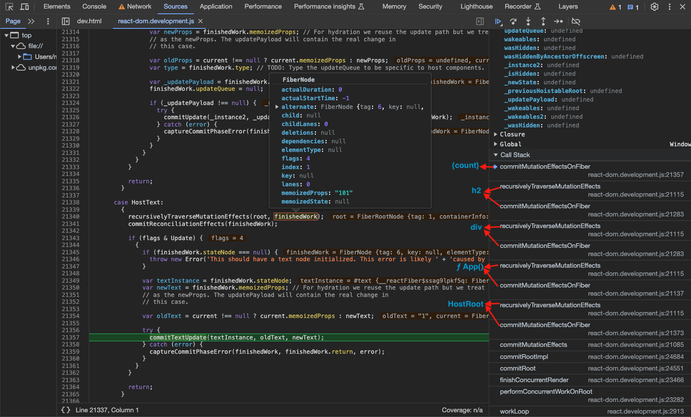

`mutation`阶段主要进行的操作类型有如下：

- 删除: `commitDeletionEffects` => `commitDeletion` => `removeChild`
- 新增: `commitPlacement` => `insertOrAppendPlacementNode` => `appendChild`
- 更新: `commitUpdate` => `updateProperties` => `updateDOMProperties`

按照删除（下一层）、新增（下一层）、更新（本层）的顺序进行。

#### Deletion

`recursivelyTraverseMutationEffects` => `commitDeletionEffects` => `commitDeletionEffectsOnFiber` => `recursivelyTraverseDeletionEffects` + `removeChild`

```ts
// 【packages/react-reconciler/src/ReactFiberCommitWork.js】
function commitDeletionEffects(
  root: FiberRoot,
  returnFiber: Fiber,
  deletedFiber: Fiber,
) {
  if (supportsMutation) {
    // We only have the top Fiber that was deleted but we need to recurse down its
    // children to find all the terminal nodes.

    // Recursively delete all host nodes from the parent, detach refs, clean
    // up mounted layout effects, and call componentWillUnmount.

    // We only need to remove the topmost host child in each branch. But then we
    // still need to keep traversing to unmount effects, refs, and cWU. TODO: We
    // could split this into two separate traversals functions, where the second
    // one doesn't include any removeChild logic. This is maybe the same
    // function as "disappearLayoutEffects" (or whatever that turns into after
    // the layout phase is refactored to use recursion).

    // Before starting, find the nearest host parent on the stack so we know
    // which instance/container to remove the children from.
    // TODO: Instead of searching up the fiber return path on every deletion, we
    // can track the nearest host component on the JS stack as we traverse the
    // tree during the commit phase. This would make insertions faster, too.
    let parent: null | Fiber = returnFiber;
    findParent: while (parent !== null) {
      switch (parent.tag) {
        case HostSingleton:
        case HostComponent: {
          hostParent = parent.stateNode;
          hostParentIsContainer = false;
          break findParent;
        }
        case HostRoot: {
          hostParent = parent.stateNode.containerInfo;
          hostParentIsContainer = true;
          break findParent;
        }
        case HostPortal: {
          hostParent = parent.stateNode.containerInfo;
          hostParentIsContainer = true;
          break findParent;
        }
      }
      parent = parent.return;
    }
    if (hostParent === null) {
      throw new Error(
        'Expected to find a host parent. This error is likely caused by ' +
          'a bug in React. Please file an issue.',
      );
    }

    commitDeletionEffectsOnFiber(root, returnFiber, deletedFiber);
    hostParent = null;
    hostParentIsContainer = false;
  } else {
    // Detach refs and call componentWillUnmount() on the whole subtree.
    commitDeletionEffectsOnFiber(root, returnFiber, deletedFiber);
  }

  detachFiberMutation(deletedFiber);
}

function commitDeletionEffectsOnFiber(
  finishedRoot: FiberRoot,
  nearestMountedAncestor: Fiber,
  deletedFiber: Fiber,
) {
  onCommitUnmount(deletedFiber);

  // The cases in this outer switch modify the stack before they traverse
  // into their subtree. There are simpler cases in the inner switch
  // that don't modify the stack.
  switch (deletedFiber.tag) {
    case HostHoistable: {
      if (enableFloat && supportsResources) {
        if (!offscreenSubtreeWasHidden) {
          safelyDetachRef(deletedFiber, nearestMountedAncestor);
        }
        recursivelyTraverseDeletionEffects(
          finishedRoot,
          nearestMountedAncestor,
          deletedFiber,
        );
        if (deletedFiber.memoizedState) {
          releaseResource(deletedFiber.memoizedState);
        } else if (deletedFiber.stateNode) {
          unmountHoistable(deletedFiber.stateNode);
        }
        return;
      }
    }
    // eslint-disable-next-line no-fallthrough
    case HostSingleton: {
      if (enableHostSingletons && supportsSingletons) {
        if (!offscreenSubtreeWasHidden) {
          safelyDetachRef(deletedFiber, nearestMountedAncestor);
        }

        const prevHostParent = hostParent;
        const prevHostParentIsContainer = hostParentIsContainer;
        hostParent = deletedFiber.stateNode;
        recursivelyTraverseDeletionEffects(
          finishedRoot,
          nearestMountedAncestor,
          deletedFiber,
        );

        // Normally this is called in passive unmount effect phase however with
        // HostSingleton we warn if you acquire one that is already associated to
        // a different fiber. To increase our chances of avoiding this, specifically
        // if you keyed a HostSingleton so there will be a delete followed by a Placement
        // we treat detach eagerly here
        releaseSingletonInstance(deletedFiber.stateNode);

        hostParent = prevHostParent;
        hostParentIsContainer = prevHostParentIsContainer;

        return;
      }
    }
    // eslint-disable-next-line no-fallthrough
    case HostComponent: {
      if (!offscreenSubtreeWasHidden) {
        safelyDetachRef(deletedFiber, nearestMountedAncestor);
      }
      // Intentional fallthrough to next branch
    }
    // eslint-disable-next-line-no-fallthrough
    case HostText: {
      // We only need to remove the nearest host child. Set the host parent
      // to `null` on the stack to indicate that nested children don't
      // need to be removed.
      if (supportsMutation) {
        const prevHostParent = hostParent;
        const prevHostParentIsContainer = hostParentIsContainer;
        hostParent = null;
        recursivelyTraverseDeletionEffects(
          finishedRoot,
          nearestMountedAncestor,
          deletedFiber,
        );
        hostParent = prevHostParent;
        hostParentIsContainer = prevHostParentIsContainer;

        if (hostParent !== null) {
          // Now that all the child effects have unmounted, we can remove the
          // node from the tree.
          if (hostParentIsContainer) {
            removeChildFromContainer(
              ((hostParent: any): Container),
              (deletedFiber.stateNode: Instance | TextInstance),
            );
          } else {
            removeChild(
              ((hostParent: any): Instance),
              (deletedFiber.stateNode: Instance | TextInstance),
            );
          }
        }
      } else {
        recursivelyTraverseDeletionEffects(
          finishedRoot,
          nearestMountedAncestor,
          deletedFiber,
        );
      }
      return;
    }
    case DehydratedFragment: {
      if (enableSuspenseCallback) {
        const hydrationCallbacks = finishedRoot.hydrationCallbacks;
        if (hydrationCallbacks !== null) {
          const onDeleted = hydrationCallbacks.onDeleted;
          if (onDeleted) {
            onDeleted((deletedFiber.stateNode: SuspenseInstance));
          }
        }
      }

      // Dehydrated fragments don't have any children

      // Delete the dehydrated suspense boundary and all of its content.
      if (supportsMutation) {
        if (hostParent !== null) {
          if (hostParentIsContainer) {
            clearSuspenseBoundaryFromContainer(
              ((hostParent: any): Container),
              (deletedFiber.stateNode: SuspenseInstance),
            );
          } else {
            clearSuspenseBoundary(
              ((hostParent: any): Instance),
              (deletedFiber.stateNode: SuspenseInstance),
            );
          }
        }
      }
      return;
    }
    case HostPortal: {
      if (supportsMutation) {
        // When we go into a portal, it becomes the parent to remove from.
        const prevHostParent = hostParent;
        const prevHostParentIsContainer = hostParentIsContainer;
        hostParent = deletedFiber.stateNode.containerInfo;
        hostParentIsContainer = true;
        recursivelyTraverseDeletionEffects(
          finishedRoot,
          nearestMountedAncestor,
          deletedFiber,
        );
        hostParent = prevHostParent;
        hostParentIsContainer = prevHostParentIsContainer;
      } else {
        emptyPortalContainer(deletedFiber);

        recursivelyTraverseDeletionEffects(
          finishedRoot,
          nearestMountedAncestor,
          deletedFiber,
        );
      }
      return;
    }
    case FunctionComponent:
    case ForwardRef:
    case MemoComponent:
    case SimpleMemoComponent: {
      if (!offscreenSubtreeWasHidden) {
        const updateQueue: FunctionComponentUpdateQueue | null =
          (deletedFiber.updateQueue: any);
        if (updateQueue !== null) {
          const lastEffect = updateQueue.lastEffect;
          if (lastEffect !== null) {
            const firstEffect = lastEffect.next;

            let effect = firstEffect;
            do {
              const {destroy, tag} = effect;
              if (destroy !== undefined) {
                if ((tag & HookInsertion) !== NoHookEffect) {
                  safelyCallDestroy(
                    deletedFiber,
                    nearestMountedAncestor,
                    destroy,
                  );
                } else if ((tag & HookLayout) !== NoHookEffect) {
                  if (enableSchedulingProfiler) {
                    markComponentLayoutEffectUnmountStarted(deletedFiber);
                  }

                  if (shouldProfile(deletedFiber)) {
                    startLayoutEffectTimer();
                    safelyCallDestroy(
                      deletedFiber,
                      nearestMountedAncestor,
                      destroy,
                    );
                    recordLayoutEffectDuration(deletedFiber);
                  } else {
                    safelyCallDestroy(
                      deletedFiber,
                      nearestMountedAncestor,
                      destroy,
                    );
                  }

                  if (enableSchedulingProfiler) {
                    markComponentLayoutEffectUnmountStopped();
                  }
                }
              }
              effect = effect.next;
            } while (effect !== firstEffect);
          }
        }
      }

      recursivelyTraverseDeletionEffects(
        finishedRoot,
        nearestMountedAncestor,
        deletedFiber,
      );
      return;
    }
    case ClassComponent: {
      if (!offscreenSubtreeWasHidden) {
        safelyDetachRef(deletedFiber, nearestMountedAncestor);
        const instance = deletedFiber.stateNode;
        if (typeof instance.componentWillUnmount === 'function') {
          safelyCallComponentWillUnmount(
            deletedFiber,
            nearestMountedAncestor,
            instance,
          );
        }
      }
      recursivelyTraverseDeletionEffects(
        finishedRoot,
        nearestMountedAncestor,
        deletedFiber,
      );
      return;
    }
    case ScopeComponent: {
      if (enableScopeAPI) {
        safelyDetachRef(deletedFiber, nearestMountedAncestor);
      }
      recursivelyTraverseDeletionEffects(
        finishedRoot,
        nearestMountedAncestor,
        deletedFiber,
      );
      return;
    }
    case OffscreenComponent: {
      safelyDetachRef(deletedFiber, nearestMountedAncestor);
      if (deletedFiber.mode & ConcurrentMode) {
        // If this offscreen component is hidden, we already unmounted it. Before
        // deleting the children, track that it's already unmounted so that we
        // don't attempt to unmount the effects again.
        // TODO: If the tree is hidden, in most cases we should be able to skip
        // over the nested children entirely. An exception is we haven't yet found
        // the topmost host node to delete, which we already track on the stack.
        // But the other case is portals, which need to be detached no matter how
        // deeply they are nested. We should use a subtree flag to track whether a
        // subtree includes a nested portal.
        const prevOffscreenSubtreeWasHidden = offscreenSubtreeWasHidden;
        offscreenSubtreeWasHidden =
          prevOffscreenSubtreeWasHidden || deletedFiber.memoizedState !== null;

        recursivelyTraverseDeletionEffects(
          finishedRoot,
          nearestMountedAncestor,
          deletedFiber,
        );
        offscreenSubtreeWasHidden = prevOffscreenSubtreeWasHidden;
      } else {
        recursivelyTraverseDeletionEffects(
          finishedRoot,
          nearestMountedAncestor,
          deletedFiber,
        );
      }
      break;
    }
    default: {
      recursivelyTraverseDeletionEffects(
        finishedRoot,
        nearestMountedAncestor,
        deletedFiber,
      );
      return;
    }
  }
}
```

#### Placement

`commitReconciliationEffects` => `commitPlacement` => `insertOrAppendPlacementNode`

```ts
// 【packages/react-reconciler/src/ReactFiberCommitWork.js】
function commitPlacement(finishedWork: Fiber): void {
if (!supportsMutation) {
  return;
}

if (enableHostSingletons && supportsSingletons) {
  if (finishedWork.tag === HostSingleton) {
    // Singletons are already in the Host and don't need to be placed
    // Since they operate somewhat like Portals though their children will
    // have Placement and will get placed inside them
    return;
  }
}
// Recursively insert all host nodes into the parent.
const parentFiber = getHostParentFiber(finishedWork);

switch (parentFiber.tag) {
  case HostSingleton: {
    if (enableHostSingletons && supportsSingletons) {
      const parent: Instance = parentFiber.stateNode;
      const before = getHostSibling(finishedWork);
      // We only have the top Fiber that was inserted but we need to recurse down its
      // children to find all the terminal nodes.
      insertOrAppendPlacementNode(finishedWork, before, parent);
      break;
    }
  }
  // eslint-disable-next-line no-fallthrough
  case HostComponent: {
    const parent: Instance = parentFiber.stateNode;
    if (parentFiber.flags & ContentReset) {
      // Reset the text content of the parent before doing any insertions
      resetTextContent(parent);
      // Clear ContentReset from the effect tag
      parentFiber.flags &= ~ContentReset;
    }

    const before = getHostSibling(finishedWork);
    // We only have the top Fiber that was inserted but we need to recurse down its
    // children to find all the terminal nodes.
    insertOrAppendPlacementNode(finishedWork, before, parent);
    break;
  }
  case HostRoot:
  case HostPortal: {
    const parent: Container = parentFiber.stateNode.containerInfo;
    const before = getHostSibling(finishedWork);
    insertOrAppendPlacementNodeIntoContainer(finishedWork, before, parent);
    break;
  }
  // eslint-disable-next-line-no-fallthrough
  default:
    throw new Error(
      'Invalid host parent fiber. This error is likely caused by a bug ' +
        'in React. Please file an issue.',
    );
}
}
```

`insertOrAppendPlacementNode`最终会调用 `insertBefore` 、 `appendChild` 等DOM操作方法进行DOM插入操作：

```ts
// 【packages/react-reconciler/src/ReactFiberCommitWork.js】
function insertOrAppendPlacementNode(
  node: Fiber,
  before: ?Instance,
  parent: Instance,
): void {
  const {tag} = node;
  const isHost = tag === HostComponent || tag === HostText;
  if (isHost) {
    const stateNode = node.stateNode;
    if (before) {
      insertBefore(parent, stateNode, before);
    } else {
      appendChild(parent, stateNode);
    }
  } else if (
    tag === HostPortal ||
    (enableHostSingletons && supportsSingletons ? tag === HostSingleton : false)
  ) {
    // If the insertion itself is a portal, then we don't want to traverse
    // down its children. Instead, we'll get insertions from each child in
    // the portal directly.
    // If the insertion is a HostSingleton then it will be placed independently
  } else {
    const child = node.child;
    if (child !== null) {
      insertOrAppendPlacementNode(child, before, parent);
      let sibling = child.sibling;
      while (sibling !== null) {
        insertOrAppendPlacementNode(sibling, before, parent);
        sibling = sibling.sibling;
      }
    }
  }
}
```

#### Update

`commitMutationEffectsOnFiber` => `commitUpdate` => `updateProperties` + `updateFiberProps` => `updateDOMProperties`

```ts
// 【packages/react-dom-bindings/src/client/ReactDOMHostConfig.js】
export function commitUpdate(
  domElement: Instance,
  updatePayload: Array<mixed>,
  type: string,
  oldProps: Props,
  newProps: Props,
  internalInstanceHandle: Object,
): void {
  // Apply the diff to the DOM node.
  updateProperties(domElement, updatePayload, type, oldProps, newProps);
  // Update the props handle so that we know which props are the ones with
  // with current event handlers.
  updateFiberProps(domElement, newProps);
}

// 【packages/react-dom-bindings/src/client/ReactDOMComponent.js】
export function updateProperties(
  domElement: Element,
  updatePayload: Array<any>,
  tag: string,
  lastRawProps: Object,
  nextRawProps: Object,
): void {
  // Update checked *before* name.
  // In the middle of an update, it is possible to have multiple checked.
  // When a checked radio tries to change name, browser makes another radio's checked false.
  if (
    tag === 'input' &&
    nextRawProps.type === 'radio' &&
    nextRawProps.name != null
  ) {
    ReactDOMInputUpdateChecked(domElement, nextRawProps);
  }

  const wasCustomComponentTag = isCustomComponent(tag, lastRawProps);
  const isCustomComponentTag = isCustomComponent(tag, nextRawProps);
  // Apply the diff.
  updateDOMProperties(
    domElement,
    updatePayload,
    wasCustomComponentTag,
    isCustomComponentTag,
  );

  // TODO: Ensure that an update gets scheduled if any of the special props
  // changed.
  switch (tag) {
    case 'input':
      // Update the wrapper around inputs *after* updating props. This has to
      // happen after `updateDOMProperties`. Otherwise HTML5 input validations
      // raise warnings and prevent the new value from being assigned.
      ReactDOMInputUpdateWrapper(domElement, nextRawProps);
      break;
    case 'textarea':
      ReactDOMTextareaUpdateWrapper(domElement, nextRawProps);
      break;
    case 'select':
      // <select> value update needs to occur after <option> children
      // reconciliation
      ReactDOMSelectPostUpdateWrapper(domElement, nextRawProps);
      break;
  }
}

function updateDOMProperties(
  domElement: Element,
  updatePayload: Array<any>,
  wasCustomComponentTag: boolean,
  isCustomComponentTag: boolean,
): void {
  // TODO: Handle wasCustomComponentTag
  for (let i = 0; i < updatePayload.length; i += 2) {
    const propKey = updatePayload[i];
    const propValue = updatePayload[i + 1];
    if (propKey === STYLE) {
      setValueForStyles(domElement, propValue);
    } else if (propKey === DANGEROUSLY_SET_INNER_HTML) {
      if (disableIEWorkarounds) {
        domElement.innerHTML = propValue;
      } else {
        setInnerHTML(domElement, propValue);
      }
    } else if (propKey === CHILDREN) {
      setTextContent(domElement, propValue);
    } else {
      setValueForProperty(domElement, propKey, propValue, isCustomComponentTag);
    }
  }
}

// 【packages/react-dom-bindings/src/client/ReactDOMComponentTree.js】
const internalPropsKey = '__reactProps$' + randomKey;

export function updateFiberProps(
  node: Instance | TextInstance | SuspenseInstance,
  props: Props,
): void {
  (node: any)[internalPropsKey] = props;
}
```

### commitLayoutEffects

`commitLayoutEffects` 阶段发生在 DOM 变更和浏览器绘制之后。这个阶段主要用于执行那些需要在 DOM 更新后立即执行、但在浏览器绘制之前执行的副作用。这个阶段可以处理所有的布局副作用，即那些需要访问或修改布局（例如获取 DOM 元素的大小、位置等）或执行 DOM 操作的副作用。

并且在整个渲染过程中, 有可能产生新的`update`(比如在`componentDidMount`函数中, 再次调用`setState()`)。

- 如果是常规(异步)任务, 不用特殊处理, 调用`ensureRootIsScheduled`确保任务已经注册到调度中心即可。
- 如果是同步任务, 则主动调用`flushSyncCallbackQueue`(无需再次等待 `scheduler` 调度), 再次进入 `fiber` 树构造循环。

```ts
// 【packages/react-reconciler/src/ReactFiberCommitWork.js】
export function commitLayoutEffects(
  finishedWork: Fiber,
  root: FiberRoot,
  committedLanes: Lanes,
): void {
  inProgressLanes = committedLanes;
  inProgressRoot = root;

  const current = finishedWork.alternate;
  commitLayoutEffectOnFiber(root, current, finishedWork, committedLanes);

  inProgressLanes = null;
  inProgressRoot = null;
}

function commitLayoutEffectOnFiber(
  finishedRoot: FiberRoot,
  current: Fiber | null,
  finishedWork: Fiber,
  committedLanes: Lanes,
): void {
  // When updating this function, also update reappearLayoutEffects, which does
  // most of the same things when an offscreen tree goes from hidden -> visible.
  const flags = finishedWork.flags;
  switch (finishedWork.tag) {
    case FunctionComponent:
    case ForwardRef:
    case SimpleMemoComponent: {
      recursivelyTraverseLayoutEffects(
        finishedRoot,
        finishedWork,
        committedLanes,
      );
      if (flags & Update) {
        commitHookLayoutEffects(finishedWork, HookLayout | HookHasEffect);
      }
      break;
    }
    case ClassComponent: {
      recursivelyTraverseLayoutEffects(
        finishedRoot,
        finishedWork,
        committedLanes,
      );
      if (flags & Update) {
        commitClassLayoutLifecycles(finishedWork, current);
      }

      if (flags & Callback) {
        commitClassCallbacks(finishedWork);
      }

      if (flags & Ref) {
        safelyAttachRef(finishedWork, finishedWork.return);
      }
      break;
    }
    case HostRoot: {
      recursivelyTraverseLayoutEffects(
        finishedRoot,
        finishedWork,
        committedLanes,
      );
      if (flags & Callback) {
        // TODO: I think this is now always non-null by the time it reaches the
        // commit phase. Consider removing the type check.
        const updateQueue: UpdateQueue<mixed> | null =
          (finishedWork.updateQueue: any);
        if (updateQueue !== null) {
          let instance = null;
          if (finishedWork.child !== null) {
            switch (finishedWork.child.tag) {
              case HostSingleton:
              case HostComponent:
                instance = getPublicInstance(finishedWork.child.stateNode);
                break;
              case ClassComponent:
                instance = finishedWork.child.stateNode;
                break;
            }
          }
          try {
            commitCallbacks(updateQueue, instance);
          } catch (error) {
            captureCommitPhaseError(finishedWork, finishedWork.return, error);
          }
        }
      }
      break;
    }
    case HostHoistable: {
      if (enableFloat && supportsResources) {
        recursivelyTraverseLayoutEffects(
          finishedRoot,
          finishedWork,
          committedLanes,
        );

        if (flags & Ref) {
          safelyAttachRef(finishedWork, finishedWork.return);
        }
        break;
      }
    }
    // eslint-disable-next-line-no-fallthrough
    case HostSingleton:
    case HostComponent: {
      recursivelyTraverseLayoutEffects(
        finishedRoot,
        finishedWork,
        committedLanes,
      );

      // Renderers may schedule work to be done after host components are mounted
      // (eg DOM renderer may schedule auto-focus for inputs and form controls).
      // These effects should only be committed when components are first mounted,
      // aka when there is no current/alternate.
      if (current === null && flags & Update) {
        commitHostComponentMount(finishedWork);
      }

      if (flags & Ref) {
        safelyAttachRef(finishedWork, finishedWork.return);
      }
      break;
    }
    case Profiler: {
      recursivelyTraverseLayoutEffects(
        finishedRoot,
        finishedWork,
        committedLanes,
      );
      // TODO: Should this fire inside an offscreen tree? Or should it wait to
      // fire when the tree becomes visible again.
      if (flags & Update) {
        commitProfilerUpdate(finishedWork, current);
      }
      break;
    }
    case SuspenseComponent: {
      recursivelyTraverseLayoutEffects(
        finishedRoot,
        finishedWork,
        committedLanes,
      );
      if (flags & Update) {
        commitSuspenseHydrationCallbacks(finishedRoot, finishedWork);
      }
      break;
    }
    case OffscreenComponent: {
      const isModernRoot = (finishedWork.mode & ConcurrentMode) !== NoMode;
      if (isModernRoot) {
        const isHidden = finishedWork.memoizedState !== null;
        const newOffscreenSubtreeIsHidden =
          isHidden || offscreenSubtreeIsHidden;
        if (newOffscreenSubtreeIsHidden) {
          // The Offscreen tree is hidden. Skip over its layout effects.
        } else {
          // The Offscreen tree is visible.

          const wasHidden = current !== null && current.memoizedState !== null;
          const newOffscreenSubtreeWasHidden =
            wasHidden || offscreenSubtreeWasHidden;
          const prevOffscreenSubtreeIsHidden = offscreenSubtreeIsHidden;
          const prevOffscreenSubtreeWasHidden = offscreenSubtreeWasHidden;
          offscreenSubtreeIsHidden = newOffscreenSubtreeIsHidden;
          offscreenSubtreeWasHidden = newOffscreenSubtreeWasHidden;

          if (offscreenSubtreeWasHidden && !prevOffscreenSubtreeWasHidden) {
            // This is the root of a reappearing boundary. As we continue
            // traversing the layout effects, we must also re-mount layout
            // effects that were unmounted when the Offscreen subtree was
            // hidden. So this is a superset of the normal commitLayoutEffects.
            const includeWorkInProgressEffects =
              (finishedWork.subtreeFlags & LayoutMask) !== NoFlags;
            recursivelyTraverseReappearLayoutEffects(
              finishedRoot,
              finishedWork,
              includeWorkInProgressEffects,
            );
          } else {
            recursivelyTraverseLayoutEffects(
              finishedRoot,
              finishedWork,
              committedLanes,
            );
          }
          offscreenSubtreeIsHidden = prevOffscreenSubtreeIsHidden;
          offscreenSubtreeWasHidden = prevOffscreenSubtreeWasHidden;
        }
      } else {
        recursivelyTraverseLayoutEffects(
          finishedRoot,
          finishedWork,
          committedLanes,
        );
      }
      if (flags & Ref) {
        const props: OffscreenProps = finishedWork.memoizedProps;
        if (props.mode === 'manual') {
          safelyAttachRef(finishedWork, finishedWork.return);
        } else {
          safelyDetachRef(finishedWork, finishedWork.return);
        }
      }
      break;
    }
    default: {
      recursivelyTraverseLayoutEffects(
        finishedRoot,
        finishedWork,
        committedLanes,
      );
      break;
    }
  }
}
```

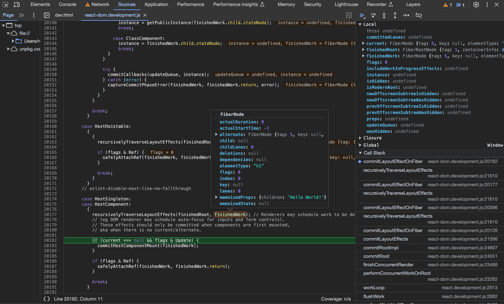

## 总结

1. 和首次挂载一样`performSyncWorkOnRoot.bind(null, root)`/`performConcurrentWorkOnRoot.bind(null, root)`还是会进入两个关键步骤，一个是**render过程**`renderRootSync`/`renderRootConcurrent`，一个是**commit过程**`commitRoot`；
2. `render`阶段和首次挂载一样，首先调用`prepareFreshStack`做准备工作，确定`workInProgress`指向的`alternate`节点，然后进入`beginWork`阶段，和初次挂载不同的是，会进行新旧节点的对比看是否能直接复用旧节点，会对比新旧节点并为节点`flags`打上`Placement`/`Deletion`标签。在遇到多个子节点新旧对比时就是我们通常所说的diff算法。不论是首次挂载还是更新，最终会生成新的子`fiber`节点并赋值给`workInProgress.child`，并且作为本次`beginWork`返回值，还会作为下次`performUnitOfWork`执行时`workInProgress`的传参直到`fiber`树底部；
3. `completeWork`阶段和首次挂载不同的是，会根据当前节点对应DOM是否存在决定要新建DOM还是仅对比`props`，对比`props`后如果有更新为这个节点标记`Update`需要更新，在`commit`阶段会进行具体的处理，在向上回溯的过程中会把子节点带有的标记往祖先节点带，所以最终在根节点上`subtreeFlags`属性能知道子节点具体到底需不要更新等；
4. `commit`过程（`commitRoot`）仍然是三个过程`commitBeforeMutationEffects`、`commitMutationEffects`、`commitLayoutEffects`，在`commitMutationEffects`过程中，主要通过判断每一个`fiber`节点的`flags`属性然后进行具体的DOM操作，`commitMutationEffects`阶段会按照删除（下一层）、新增（下一层）、更新（本层）DOM的顺序进行；

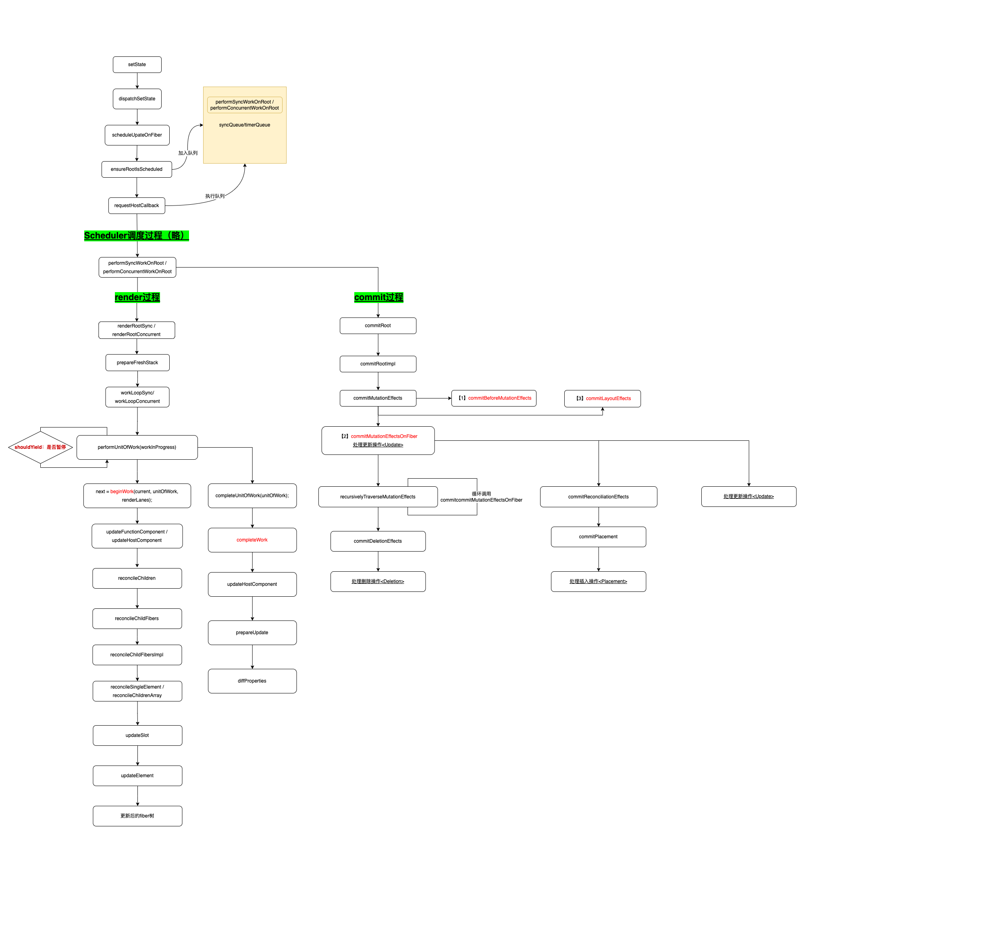
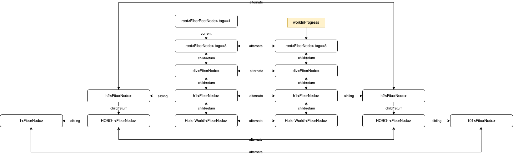
