# diff

## ReactElement

`JSX`在编译时会被`Babel`编译为`React.createElement`方法。`React.createElement`最终会返回一个包含组件数据的对象，也就是`ReactElement`对象。这是后续`React`将`JSX`转化为`fiber`的基础。

```ts
export type Source = {
  fileName: string,
  lineNumber: number,
};

export type ReactElement = {
  $$typeof: any,
  type: any,
  key: any,
  ref: any,
  props: any,
  // ReactFiber
  _owner: any,

  // __DEV__
  _store: {validated: boolean, ...},
  _self: React$Element<any>,
  _shadowChildren: any,
  _source: Source,
};
```

## fiberNode

在 `React` 中所有的节点的数据结构最终都是由 `fiberNode` 类型构成的：

```ts
function FiberNode(
  this: $FlowFixMe,
  tag: WorkTag,
  pendingProps: mixed,
  key: null | string,
  mode: TypeOfMode,
) {
  // Instance
  this.tag = tag;//【节点类型】
  this.key = key;//【节点key】
  this.elementType = null;// 【节点的元素类型】
  this.type = null;// 【对于组件，它指向构造函数；对于DOM元素，它指定HTML tag】
  this.stateNode = null;//【对应DOM】

  // Fiber
  this.return = null;//【父fiber】
  this.child = null;//【子fiber】
  this.sibling = null;//【右边第一个兄弟fiber】
  this.index = 0;//【兄弟节点中第几个】

  this.ref = null;
  this.refCleanup = null;

  this.pendingProps = pendingProps;// 【本次渲染需要使用的 props】
  this.memoizedProps = null;// 【上次渲染使用的 props】
  this.updateQueue = null;// 【用于状态更新、回调函数、DOM更新的任务队列】
  this.memoizedState = null;// 【上次渲染后的 state 状态】
  this.dependencies = null;// 【】

  this.mode = mode;

  // Effects
  this.flags = NoFlags;//【需要去如何更新当前节点，当前 fiber 的副作用(删除、更新、替换等)】
  this.subtreeFlags = NoFlags; // 【当前子树的副作用】
  this.deletions = null;// 【要删除的子 fiber】

  this.lanes = NoLanes;//【调度的优先级】
  this.childLanes = NoLanes;//【子树的调度的优先级】

  this.alternate = null;【// 【指向 workInProgress fiber/current fiber 树中对应的节点，是双向的】

  if (enableProfilerTimer) {
    // Note: The following is done to avoid a v8 performance cliff.
    //
    // Initializing the fields below to smis and later updating them with
    // double values will cause Fibers to end up having separate shapes.
    // This behavior/bug has something to do with Object.preventExtension().
    // Fortunately this only impacts DEV builds.
    // Unfortunately it makes React unusably slow for some applications.
    // To work around this, initialize the fields below with doubles.
    //
    // Learn more about this here:
    // https://github.com/facebook/react/issues/14365
    // https://bugs.chromium.org/p/v8/issues/detail?id=8538
    this.actualDuration = Number.NaN;
    this.actualStartTime = Number.NaN;
    this.selfBaseDuration = Number.NaN;
    this.treeBaseDuration = Number.NaN;

    // It's okay to replace the initial doubles with smis after initialization.
    // This won't trigger the performance cliff mentioned above,
    // and it simplifies other profiler code (including DevTools).
    this.actualDuration = 0;
    this.actualStartTime = -1;
    this.selfBaseDuration = 0;
    this.treeBaseDuration = 0;
  }

  if (__DEV__) {
    // This isn't directly used but is handy for debugging internals:

    this._debugSource = null;
    this._debugOwner = null;
    this._debugNeedsRemount = false;
    this._debugHookTypes = null;
    if (!hasBadMapPolyfill && typeof Object.preventExtensions === 'function') {
      Object.preventExtensions(this);
    }
  }
}
```

## diff过程

前文可知，React的渲染流程大致有如下三个的过程：

1. `Scheduler`：按优先级进行`Update`任务调度的过程
2. `Render`：由`React-Element`构造`fiber`树的过程
3. `Commit`：由`fiber`树到`DOM`渲染并调用各种副作用的过程

在`render`过程中，有两个重要的过程是`beginWork`和`completeWork`，会根据`tag`不同进入不同的方法。

`root` => `ƒ App()` => `div` => `h2` => `a` => `h2` => `b` => `h2` => `e` => `h2` => `f` => `h2` => `c`

`updateHostRoot` => `updateFunctionComponent` => `updateHostComponent` => `updateHostComponent` => `updateHostText` ...

我们调试diff过程的用例如下：

```html
<html>
  <body>
    <script src="../../../build/oss-experimental/react/umd/react.development.js"></script>
    <script src="../../../build/oss-experimental/react-dom/umd/react-dom.development.js"></script>
    <script src="https://unpkg.com/babel-standalone@6/babel.js"></script>
    <div id="container"></div>
    <script type="text/babel">
      function App() {
        const [list,setList] = React.useState(['a','b','c'])
        React.useEffect(()=>{
          setTimeout(() => {
            setList(list=>{
              return ['a','b','e','f','c']
            })
          }, 3000);
        },[])

        return <div>
                  {list.map((item,index) => (
                    <h2 key={item} className={item+index}>{item}</h2>
                  ))}
                </div>
      }

      const root = ReactDOM.createRoot(document.getElementById('container'))
      root.render(<App />);
    </script>
  </body>
</html>

```

```js
newChild: Array(5)
0: {$$typeof: Symbol(react.element), type: 'h2', key: 'a', ref: null, props: {…}, …}
1: {$$typeof: Symbol(react.element), type: 'h2', key: 'b', ref: null, props: {…}, …}
2: {$$typeof: Symbol(react.element), type: 'h2', key: 'e', ref: null, props: {…}, …}
3: {$$typeof: Symbol(react.element), type: 'h2', key: 'f', ref: null, props: {…}, …}
4: {$$typeof: Symbol(react.element), type: 'h2', key: 'c', ref: null, props: {…}, …}
length: 5
[[Prototype]]: Array(0)
```

`updateFunctionComponent`、`updateHostComponent`等方法都会进入`reconcileChildren`也就是diff过程的入口

`updateFunctionComponent`/`updateHostComponent` => `reconcileChildren` => `reconcileChildFibers`(`createChildReconciler`) => `reconcileChildFibersImpl` => `reconcileSingleElement`/`reconcileChildrenArray`

```ts
// 【packages/react-reconciler/src/ReactFiberBeginWork.js】
export function reconcileChildren(
  current: Fiber | null,
  workInProgress: Fiber,
  nextChildren: any,
  renderLanes: Lanes,
) {
  if (current === null) {
    // 【首次挂载】
    // If this is a fresh new component that hasn't been rendered yet, we
    // won't update its child set by applying minimal side-effects. Instead,
    // we will add them all to the child before it gets rendered. That means
    // we can optimize this reconciliation pass by not tracking side-effects.
    workInProgress.child = mountChildFibers(
      workInProgress,
      null,
      nextChildren,
      renderLanes,
    );
  } else {
    // 【更新】
    // If the current child is the same as the work in progress, it means that
    // we haven't yet started any work on these children. Therefore, we use
    // the clone algorithm to create a copy of all the current children.

    // If we had any progressed work already, that is invalid at this point so
    // let's throw it out.
    workInProgress.child = reconcileChildFibers(
      workInProgress,
      current.child,
      nextChildren,
      renderLanes,
    );
  }
}

// 【packages/react-reconciler/src/ReactChildFiber.js】
export const reconcileChildFibers: ChildReconciler =
  createChildReconciler(true);
export const mountChildFibers: ChildReconciler = createChildReconciler(false);

// This wrapper function exists because I expect to clone the code in each path
// to be able to optimize each path individually by branching early. This needs
// a compiler or we can do it manually. Helpers that don't need this branching
// live outside of this function.
function createChildReconciler(
  shouldTrackSideEffects: boolean,
): ChildReconciler {

  // 【省略代码...】
  function reconcileChildrenArray(
    returnFiber: Fiber,
    currentFirstChild: Fiber | null,
    newChildren: Array<any>,
    lanes: Lanes,
  ): Fiber | null {
    // 【省略代码...】
  }
  function reconcileSingleElement(
    returnFiber: Fiber,
    currentFirstChild: Fiber | null,
    element: ReactElement,
    lanes: Lanes,
  ): Fiber {
    // 【省略代码...】
  }
  
  // This API will tag the children with the side-effect of the reconciliation
  // itself. They will be added to the side-effect list as we pass through the
  // children and the parent.
  function reconcileChildFibersImpl(
    returnFiber: Fiber,
    currentFirstChild: Fiber | null,
    newChild: any,
    lanes: Lanes,
  ): Fiber | null {
    // This function is not recursive.
    // If the top level item is an array, we treat it as a set of children,
    // not as a fragment. Nested arrays on the other hand will be treated as
    // fragment nodes. Recursion happens at the normal flow.

    // Handle top level unkeyed fragments as if they were arrays.
    // This leads to an ambiguity between <>{[...]}</> and <>...</>.
    // We treat the ambiguous cases above the same.
    // TODO: Let's use recursion like we do for Usable nodes?
    const isUnkeyedTopLevelFragment =
      typeof newChild === 'object' &&
      newChild !== null &&
      newChild.type === REACT_FRAGMENT_TYPE &&
      newChild.key === null;
    if (isUnkeyedTopLevelFragment) {
      newChild = newChild.props.children;
    }

    // Handle object types
    if (typeof newChild === 'object' && newChild !== null) {
      switch (newChild.$$typeof) {
        case REACT_ELEMENT_TYPE:
          return placeSingleChild(
            reconcileSingleElement(
              returnFiber,
              currentFirstChild,
              newChild,
              lanes,
            ),
          );
        case REACT_PORTAL_TYPE:
          return placeSingleChild(
            reconcileSinglePortal(
              returnFiber,
              currentFirstChild,
              newChild,
              lanes,
            ),
          );
        case REACT_LAZY_TYPE:
          const payload = newChild._payload;
          const init = newChild._init;
          // TODO: This function is supposed to be non-recursive.
          return reconcileChildFibers(
            returnFiber,
            currentFirstChild,
            init(payload),
            lanes,
          );
      }

      if (isArray(newChild)) {
        return reconcileChildrenArray(
          returnFiber,
          currentFirstChild,
          newChild,
          lanes,
        );
      }

      if (getIteratorFn(newChild)) {
        return reconcileChildrenIterator(
          returnFiber,
          currentFirstChild,
          newChild,
          lanes,
        );
      }

      // Usables are a valid React node type. When React encounters a Usable in
      // a child position, it unwraps it using the same algorithm as `use`. For
      // example, for promises, React will throw an exception to unwind the
      // stack, then replay the component once the promise resolves.
      //
      // A difference from `use` is that React will keep unwrapping the value
      // until it reaches a non-Usable type.
      //
      // e.g. Usable<Usable<Usable<T>>> should resolve to T
      //
      // The structure is a bit unfortunate. Ideally, we shouldn't need to
      // replay the entire begin phase of the parent fiber in order to reconcile
      // the children again. This would require a somewhat significant refactor,
      // because reconcilation happens deep within the begin phase, and
      // depending on the type of work, not always at the end. We should
      // consider as an future improvement.
      if (typeof newChild.then === 'function') {
        const thenable: Thenable<any> = (newChild: any);
        return reconcileChildFibersImpl(
          returnFiber,
          currentFirstChild,
          unwrapThenable(thenable),
          lanes,
        );
      }

      if (
        newChild.$$typeof === REACT_CONTEXT_TYPE ||
        newChild.$$typeof === REACT_SERVER_CONTEXT_TYPE
      ) {
        const context: ReactContext<mixed> = (newChild: any);
        return reconcileChildFibersImpl(
          returnFiber,
          currentFirstChild,
          readContextDuringReconcilation(returnFiber, context, lanes),
          lanes,
        );
      }

      throwOnInvalidObjectType(returnFiber, newChild);
    }

    if (
      (typeof newChild === 'string' && newChild !== '') ||
      typeof newChild === 'number'
    ) {
      return placeSingleChild(
        reconcileSingleTextNode(
          returnFiber,
          currentFirstChild,
          '' + newChild,
          lanes,
        ),
      );
    }

    if (__DEV__) {
      if (typeof newChild === 'function') {
        warnOnFunctionType(returnFiber);
      }
    }

    // Remaining cases are all treated as empty.
    return deleteRemainingChildren(returnFiber, currentFirstChild);
  }

  function reconcileChildFibers(
    returnFiber: Fiber,
    currentFirstChild: Fiber | null,
    newChild: any,
    lanes: Lanes,
  ): Fiber | null {
    // This indirection only exists so we can reset `thenableState` at the end.
    // It should get inlined by Closure.
    thenableIndexCounter = 0;
    const firstChildFiber = reconcileChildFibersImpl(
      returnFiber,
      currentFirstChild,
      newChild,
      lanes,
    );
    thenableState = null;
    // Don't bother to reset `thenableIndexCounter` to 0 because it always gets
    // set at the beginning.
    return firstChildFiber;
  }
  return reconcileChildFibers;
}
```

### 单节点diff

```ts
// 【packages/react-reconciler/src/ReactChildFiber.js】
// 【element是单节点】
function reconcileSingleElement(
  returnFiber: Fiber,
  currentFirstChild: Fiber | null,
  element: ReactElement,
  lanes: Lanes,
): Fiber {
  const key = element.key;
  let child = currentFirstChild;
  while (child !== null) {
    // TODO: If key === null and child.key === null, then this only applies to
    // the first item in the list.
    // 【ReactElement的key和现在渲染的节点的key、type作对比】
    if (child.key === key) {
      const elementType = element.type;
      if (elementType === REACT_FRAGMENT_TYPE) {
        if (child.tag === Fragment) {
          deleteRemainingChildren(returnFiber, child.sibling);
          const existing = useFiber(child, element.props.children);
          existing.return = returnFiber;
          if (__DEV__) {
            existing._debugSource = element._source;
            existing._debugOwner = element._owner;
          }
          return existing;
        }
      } else {
        if (
          child.elementType === elementType ||
          // Keep this check inline so it only runs on the false path:
          (__DEV__
            ? isCompatibleFamilyForHotReloading(child, element)
            : false) ||
          // Lazy types should reconcile their resolved type.
          // We need to do this after the Hot Reloading check above,
          // because hot reloading has different semantics than prod because
          // it doesn't resuspend. So we can't let the call below suspend.
          (typeof elementType === 'object' &&
            elementType !== null &&
            elementType.$$typeof === REACT_LAZY_TYPE &&
            resolveLazy(elementType) === child.type)
        ) {
          deleteRemainingChildren(returnFiber, child.sibling);
          const existing = useFiber(child, element.props);
          existing.ref = coerceRef(returnFiber, child, element);
          existing.return = returnFiber;
          if (__DEV__) {
            existing._debugSource = element._source;
            existing._debugOwner = element._owner;
          }
          return existing;
        }
      }
      // Didn't match.
      deleteRemainingChildren(returnFiber, child);
      break;
    } else {
      // 【key不相同直接删除旧节点】
      deleteChild(returnFiber, child);
    }
    child = child.sibling;
  }

  if (element.type === REACT_FRAGMENT_TYPE) {
    const created = createFiberFromFragment(
      element.props.children,
      returnFiber.mode,
      lanes,
      element.key,
    );
    created.return = returnFiber;
    return created;
  } else {
    const created = createFiberFromElement(element, returnFiber.mode, lanes);
    created.ref = coerceRef(returnFiber, currentFirstChild, element);
    created.return = returnFiber;
    return created;
  }
}
```

### 多节点diff

```ts
// 【packages/react-reconciler/src/ReactChildFiber.js】
// 【newChild是多节点】
function reconcileChildrenArray(
  returnFiber: Fiber,
  currentFirstChild: Fiber | null,
  newChildren: Array<any>,
  lanes: Lanes,
): Fiber | null {
  // This algorithm can't optimize by searching from both ends since we
  // don't have backpointers on fibers. I'm trying to see how far we can get
  // with that model. If it ends up not being worth the tradeoffs, we can
  // add it later.

  // Even with a two ended optimization, we'd want to optimize for the case
  // where there are few changes and brute force the comparison instead of
  // going for the Map. It'd like to explore hitting that path first in
  // forward-only mode and only go for the Map once we notice that we need
  // lots of look ahead. This doesn't handle reversal as well as two ended
  // search but that's unusual. Besides, for the two ended optimization to
  // work on Iterables, we'd need to copy the whole set.

  // In this first iteration, we'll just live with hitting the bad case
  // (adding everything to a Map) in for every insert/move.

  // If you change this code, also update reconcileChildrenIterator() which
  // uses the same algorithm.

  if (__DEV__) {
    // First, validate keys.
    // 【遍历新节点，获取所有的key】
    let knownKeys: Set<string> | null = null;
    for (let i = 0; i < newChildren.length; i++) {
      const child = newChildren[i];
      knownKeys = warnOnInvalidKey(child, knownKeys, returnFiber);
    }
  }

  let resultingFirstChild: Fiber | null = null;//【能复用的情况下，新节点中的第一个节点】
  let previousNewFiber: Fiber | null = null;//【上一个被遍历的新节点】

  let oldFiber = currentFirstChild;//【旧节点序列的第一个节点初始化oldFiber】
  let lastPlacedIndex = 0;//【能复用的旧节点中最后一个的索引】
  let newIdx = 0;
  let nextOldFiber = null;//【用于下一个监测是否能复用的旧节点】

  // 【第一遍循环，从第一个新/旧节点开始看是否可以复用，关键方法updateSlot，此处会判断是否可复用】
  for (; oldFiber !== null && newIdx < newChildren.length; newIdx++) {
    if (oldFiber.index > newIdx) {
      nextOldFiber = oldFiber;
      oldFiber = null;
    } else {
      nextOldFiber = oldFiber.sibling;
    }
    const newFiber = updateSlot(
      returnFiber,
      oldFiber,
      newChildren[newIdx],
      lanes,
    );
    if (newFiber === null) {
      // TODO: This breaks on empty slots like null children. That's
      // unfortunate because it triggers the slow path all the time. We need
      // a better way to communicate whether this was a miss or null,
      // boolean, undefined, etc.
      if (oldFiber === null) {
        oldFiber = nextOldFiber;
      }
      break;
    }
    if (shouldTrackSideEffects) {
      if (oldFiber && newFiber.alternate === null) {
        // We matched the slot, but we didn't reuse the existing fiber, so we
        // need to delete the existing child.
        deleteChild(returnFiber, oldFiber);
      }
    }
    // 【lastPlacedIndex表示的是最后一次检查能否复用的旧节点的索引】
    // 【旧节点不存在的话标识newFiber是Placement表明是新增，旧节点存在且索引小于lastPlacedIndex标识Placement表明是移动（从前往后移动），旧节点存在且索引大于等于于lastPlacedIndex则不用动这个节点】
    lastPlacedIndex = placeChild(newFiber, lastPlacedIndex, newIdx);
    if (previousNewFiber === null) {
      // TODO: Move out of the loop. This only happens for the first run.
      resultingFirstChild = newFiber;
    } else {
      // TODO: Defer siblings if we're not at the right index for this slot.
      // I.e. if we had null values before, then we want to defer this
      // for each null value. However, we also don't want to call updateSlot
      // with the previous one.
      previousNewFiber.sibling = newFiber;
    }
    previousNewFiber = newFiber;
    oldFiber = nextOldFiber;
  }

  // 【新节点已经遍历结束，删除剩余的旧节点，并且返回第一个节点作为祖先节点的child】
  if (newIdx === newChildren.length) {
    // We've reached the end of the new children. We can delete the rest.
    deleteRemainingChildren(returnFiber, oldFiber);
    if (getIsHydrating()) {
      const numberOfForks = newIdx;
      pushTreeFork(returnFiber, numberOfForks);
    }
    return resultingFirstChild;
  }

  // 【旧节点已经遍历结束，剩下的新节点作为新创建的】
  if (oldFiber === null) {
    // If we don't have any more existing children we can choose a fast path
    // since the rest will all be insertions.
    for (; newIdx < newChildren.length; newIdx++) {
      const newFiber = createChild(returnFiber, newChildren[newIdx], lanes);
      if (newFiber === null) {
        continue;
      }
      lastPlacedIndex = placeChild(newFiber, lastPlacedIndex, newIdx);
      if (previousNewFiber === null) {
        // TODO: Move out of the loop. This only happens for the first run.
        resultingFirstChild = newFiber;
      } else {
        previousNewFiber.sibling = newFiber;
      }
      previousNewFiber = newFiber;
    }
    if (getIsHydrating()) {
      const numberOfForks = newIdx;
      pushTreeFork(returnFiber, numberOfForks);
    }
    return resultingFirstChild;
  }
  
  // 【新旧节点都没遍历完】
  // Add all children to a key map for quick lookups.
  const existingChildren = mapRemainingChildren(returnFiber, oldFiber);

  // Keep scanning and use the map to restore deleted items as moves.
  for (; newIdx < newChildren.length; newIdx++) {
    const newFiber = updateFromMap(
      existingChildren,
      returnFiber,
      newIdx,
      newChildren[newIdx],
      lanes,
    );
    if (newFiber !== null) {
      if (shouldTrackSideEffects) {
        if (newFiber.alternate !== null) {
          // The new fiber is a work in progress, but if there exists a
          // current, that means that we reused the fiber. We need to delete
          // it from the child list so that we don't add it to the deletion
          // list.
          existingChildren.delete(
            newFiber.key === null ? newIdx : newFiber.key,
          );
        }
      }
      lastPlacedIndex = placeChild(newFiber, lastPlacedIndex, newIdx);
      if (previousNewFiber === null) {
        resultingFirstChild = newFiber;
      } else {
        previousNewFiber.sibling = newFiber;
      }
      previousNewFiber = newFiber;
    }
  }

  if (shouldTrackSideEffects) {
    // Any existing children that weren't consumed above were deleted. We need
    // to add them to the deletion list.
    existingChildren.forEach(child => deleteChild(returnFiber, child));
  }

  if (getIsHydrating()) {
    const numberOfForks = newIdx;
    pushTreeFork(returnFiber, numberOfForks);
  }
  return resultingFirstChild;
}
```

- 第一遍循环，从第一个新/旧节点开始看是否可以复用，关键方法`updateSlot`，会判断旧节点是否可复用，a、b节点会走入`updateElement`方法，因为都有可复用节点会走向`useFiber`；

**`updateSlot` => `updateElement` => `useFiber` => `createWorkInProgress`**

```ts
// 【packages/react-reconciler/src/ReactChildFiber.js】
function updateSlot(
  returnFiber: Fiber,
  oldFiber: Fiber | null,
  newChild: any,
  lanes: Lanes,
): Fiber | null {
  // Update the fiber if the keys match, otherwise return null.
  // 【获取旧节点的key】
  const key = oldFiber !== null ? oldFiber.key : null;

  // 【新节点是文本】
  if (
    (typeof newChild === 'string' && newChild !== '') ||
    typeof newChild === 'number'
  ) {
    // Text nodes don't have keys. If the previous node is implicitly keyed
    // we can continue to replace it without aborting even if it is not a text
    // node.
    if (key !== null) {
      return null;
    }
    return updateTextNode(returnFiber, oldFiber, '' + newChild, lanes);
  }

  if (typeof newChild === 'object' && newChild !== null) {
    switch (newChild.$$typeof) {
      case REACT_ELEMENT_TYPE: {
        // 【新节点是React-Element对象，直接对比新旧节点key，相同的话进入updateElement方法】
        if (newChild.key === key) {
          return updateElement(returnFiber, oldFiber, newChild, lanes);
        } else {
          return null;
        }
      }
      case REACT_PORTAL_TYPE: {
        if (newChild.key === key) {
          return updatePortal(returnFiber, oldFiber, newChild, lanes);
        } else {
          return null;
        }
      }
      case REACT_LAZY_TYPE: {
        const payload = newChild._payload;
        const init = newChild._init;
        return updateSlot(returnFiber, oldFiber, init(payload), lanes);
      }
    }

    if (isArray(newChild) || getIteratorFn(newChild)) {
      if (key !== null) {
        return null;
      }

      return updateFragment(returnFiber, oldFiber, newChild, lanes, null);
    }

    // Usable node types
    //
    // Unwrap the inner value and recursively call this function again.
    if (typeof newChild.then === 'function') {
      const thenable: Thenable<any> = (newChild: any);
      return updateSlot(
        returnFiber,
        oldFiber,
        unwrapThenable(thenable),
        lanes,
      );
    }

    if (
      newChild.$$typeof === REACT_CONTEXT_TYPE ||
      newChild.$$typeof === REACT_SERVER_CONTEXT_TYPE
    ) {
      const context: ReactContext<mixed> = (newChild: any);
      return updateSlot(
        returnFiber,
        oldFiber,
        readContextDuringReconcilation(returnFiber, context, lanes),
        lanes,
      );
    }

    throwOnInvalidObjectType(returnFiber, newChild);
  }

  if (__DEV__) {
    if (typeof newChild === 'function') {
      warnOnFunctionType(returnFiber);
    }
  }

  return null;
}

function updateElement(
  returnFiber: Fiber,
  current: Fiber | null,
  element: ReactElement,
  lanes: Lanes,
): Fiber {
  const elementType = element.type;
  if (elementType === REACT_FRAGMENT_TYPE) {
    return updateFragment(
      returnFiber,
      current,
      element.props.children,
      lanes,
      element.key,
    );
  }
  if (current !== null) {
    if (
      current.elementType === elementType ||
      // Keep this check inline so it only runs on the false path:
      (__DEV__
        ? isCompatibleFamilyForHotReloading(current, element)
        : false) ||
      // Lazy types should reconcile their resolved type.
      // We need to do this after the Hot Reloading check above,
      // because hot reloading has different semantics than prod because
      // it doesn't resuspend. So we can't let the call below suspend.
      (typeof elementType === 'object' &&
        elementType !== null &&
        elementType.$$typeof === REACT_LAZY_TYPE &&
        resolveLazy(elementType) === current.type)
    ) {
      // Move based on index
      // 【由current和新节点的props构建workInProgress】
      const existing = useFiber(current, element.props);
      existing.ref = coerceRef(returnFiber, current, element);
      existing.return = returnFiber;
      if (__DEV__) {
        existing._debugSource = element._source;
        existing._debugOwner = element._owner;
      }
      return existing;
    }
  }
  // Insert
  const created = createFiberFromElement(element, returnFiber.mode, lanes);
  created.ref = coerceRef(returnFiber, current, element);
  created.return = returnFiber;
  return created;
}

function useFiber(fiber: Fiber, pendingProps: mixed): Fiber {
  // We currently set sibling to null and index to 0 here because it is easy
  // to forget to do before returning it. E.g. for the single child case.
  // 【由current和新节点的pendingProps构建workInProgress，sibling置空，因为后续的节点还不清楚是什么】
  const clone = createWorkInProgress(fiber, pendingProps);
  clone.index = 0;
  clone.sibling = null;
  return clone;
}

// 【packages/react-reconciler/src/ReactFiber.js】
// This is used to create an alternate fiber to do work on.
export function createWorkInProgress(current: Fiber, pendingProps: any): Fiber {
  let workInProgress = current.alternate;
  if (workInProgress === null) {
    // We use a double buffering pooling technique because we know that we'll
    // only ever need at most two versions of a tree. We pool the "other" unused
    // node that we're free to reuse. This is lazily created to avoid allocating
    // extra objects for things that are never updated. It also allow us to
    // reclaim the extra memory if needed.
    workInProgress = createFiber(
      current.tag,
      pendingProps,
      current.key,
      current.mode,
    );
    workInProgress.elementType = current.elementType;
    workInProgress.type = current.type;
    workInProgress.stateNode = current.stateNode;

    if (__DEV__) {
      // DEV-only fields

      workInProgress._debugSource = current._debugSource;
      workInProgress._debugOwner = current._debugOwner;
      workInProgress._debugHookTypes = current._debugHookTypes;
    }

    workInProgress.alternate = current;
    current.alternate = workInProgress;
  } else {
    workInProgress.pendingProps = pendingProps;
    // Needed because Blocks store data on type.
    workInProgress.type = current.type;

    // We already have an alternate.
    // Reset the effect tag.
    workInProgress.flags = NoFlags;

    // The effects are no longer valid.
    workInProgress.subtreeFlags = NoFlags;
    workInProgress.deletions = null;

    if (enableProfilerTimer) {
      // We intentionally reset, rather than copy, actualDuration & actualStartTime.
      // This prevents time from endlessly accumulating in new commits.
      // This has the downside of resetting values for different priority renders,
      // But works for yielding (the common case) and should support resuming.
      workInProgress.actualDuration = 0;
      workInProgress.actualStartTime = -1;
    }
  }

  // Reset all effects except static ones.
  // Static effects are not specific to a render.
  workInProgress.flags = current.flags & StaticMask;
  workInProgress.childLanes = current.childLanes;
  workInProgress.lanes = current.lanes;

  workInProgress.child = current.child;
  workInProgress.memoizedProps = current.memoizedProps;
  workInProgress.memoizedState = current.memoizedState;
  workInProgress.updateQueue = current.updateQueue;

  // Clone the dependencies object. This is mutated during the render phase, so
  // it cannot be shared with the current fiber.
  const currentDependencies = current.dependencies;
  workInProgress.dependencies =
    currentDependencies === null
      ? null
      : {
          lanes: currentDependencies.lanes,
          firstContext: currentDependencies.firstContext,
        };

  // These will be overridden during the parent's reconciliation
  workInProgress.sibling = current.sibling;
  workInProgress.index = current.index;
  workInProgress.ref = current.ref;
  workInProgress.refCleanup = current.refCleanup;

  if (enableProfilerTimer) {
    workInProgress.selfBaseDuration = current.selfBaseDuration;
    workInProgress.treeBaseDuration = current.treeBaseDuration;
  }

  if (__DEV__) {
    workInProgress._debugNeedsRemount = current._debugNeedsRemount;
    switch (workInProgress.tag) {
      case IndeterminateComponent:
      case FunctionComponent:
      case SimpleMemoComponent:
        workInProgress.type = resolveFunctionForHotReloading(current.type);
        break;
      case ClassComponent:
        workInProgress.type = resolveClassForHotReloading(current.type);
        break;
      case ForwardRef:
        workInProgress.type = resolveForwardRefForHotReloading(current.type);
        break;
      default:
        break;
    }
  }

  return workInProgress;
}
```

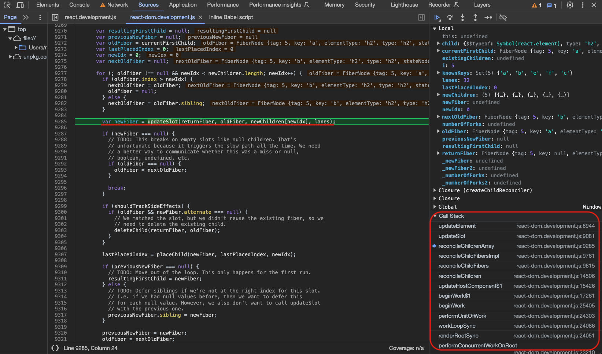
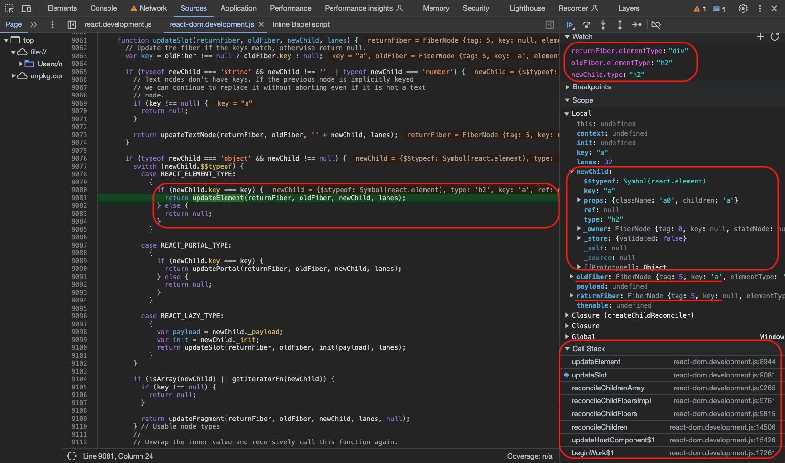
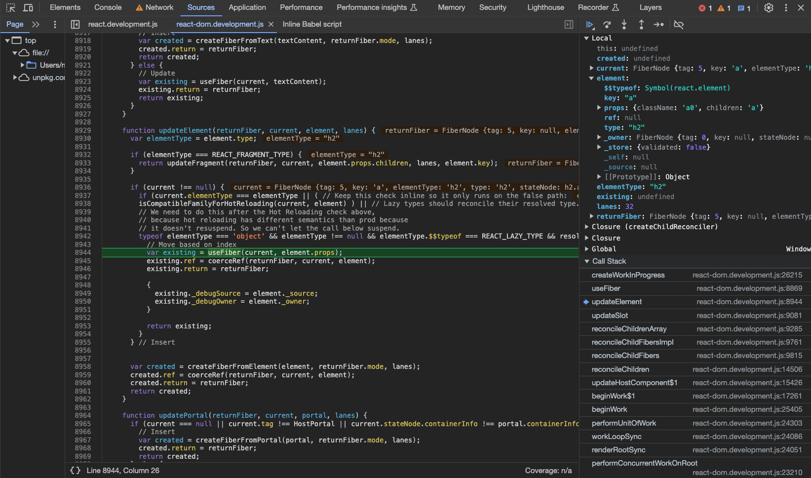
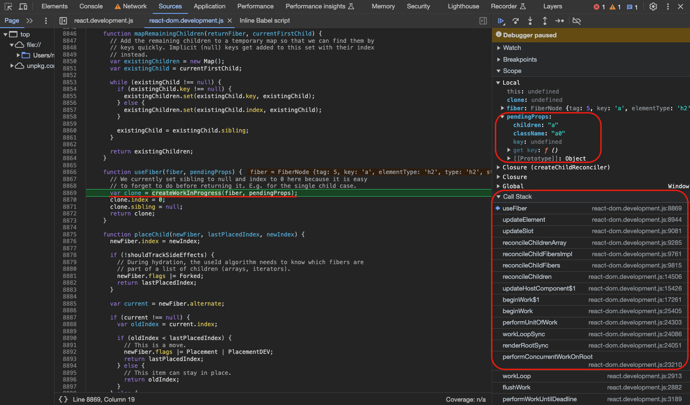
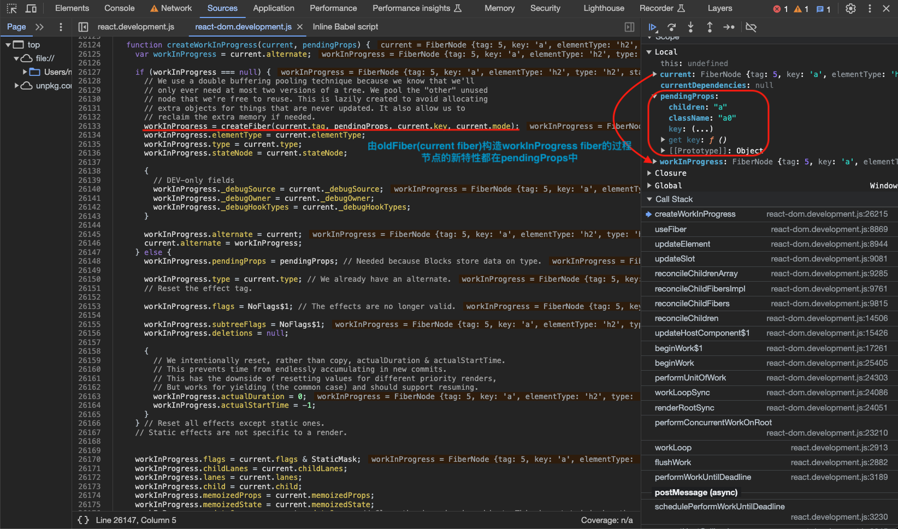

- 已经得到由`current fiber`复用来的`newFiber`，调用`placeChild`看新节点是否需要`Placement`标志表示插入或者移动；

```ts
// 【packages/react-reconciler/src/ReactChildFiber.js】
function placeChild(
  newFiber: Fiber,
  lastPlacedIndex: number,
  newIndex: number,
): number {
  newFiber.index = newIndex;
  if (!shouldTrackSideEffects) {
    // During hydration, the useId algorithm needs to know which fibers are
    // part of a list of children (arrays, iterators).
    newFiber.flags |= Forked;
    return lastPlacedIndex;
  }
  const current = newFiber.alternate;
  if (current !== null) {
    const oldIndex = current.index;
    if (oldIndex < lastPlacedIndex) {
      // 【需要移动的情况打Placement标志】
      // This is a move.
      newFiber.flags |= Placement | PlacementDEV;
      return lastPlacedIndex;
    } else {
      // 【新节点既不用移动也不用插入的情况】
      // This item can stay in place.
      return oldIndex;
    }
  } else {
    // 【插入的情况打Placement标志】
    // This is an insertion.
    newFiber.flags |= Placement | PlacementDEV;
    return lastPlacedIndex;
  }
}
```

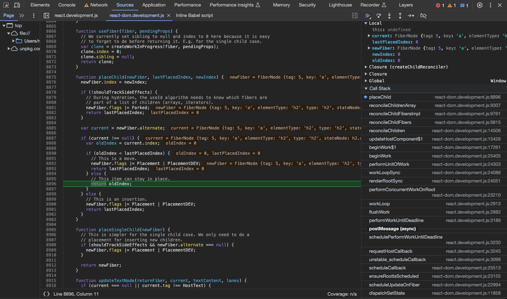

- 第一个循环继续，b节点也是可复用节点，重复上述过程复用b节点，然后下一个节点e无法复用（`updateSlot`返回的`newFiber`为`null`）跳出第一个循环；

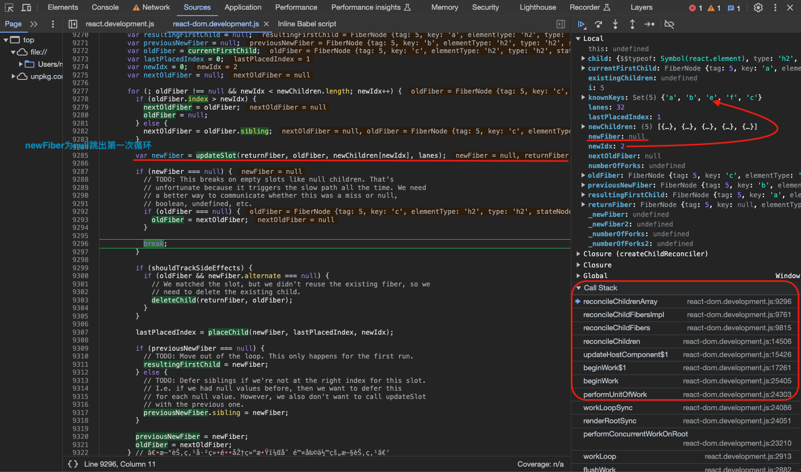

- 跳出循环后先检查此时，如果新节点已经遍历完，说明剩余的旧节点需要删除；旧节点已经遍历完而新节点还有，说明剩余的新节点要插入；
- 新旧节点都有剩余的情况下，进入第二个循环，首先将所有剩余的旧节点构造一个`map<oldFiber的key或索引index，oldFiber>`；

```ts
// 【packages/react-reconciler/src/ReactChildFiber.js】
function mapRemainingChildren(
  returnFiber: Fiber,
  currentFirstChild: Fiber,
): Map<string | number, Fiber> {
  // Add the remaining children to a temporary map so that we can find them by
  // keys quickly. Implicit (null) keys get added to this set with their index
  // instead.
  const existingChildren: Map<string | number, Fiber> = new Map();

  let existingChild: null | Fiber = currentFirstChild;
  while (existingChild !== null) {
    if (existingChild.key !== null) {
      // 【有key】
      existingChildren.set(existingChild.key, existingChild);
    } else {
      // 【无key用索引index】
      existingChildren.set(existingChild.index, existingChild);
    }
    existingChild = existingChild.sibling;
  }
  return existingChildren;
}
```

- 进入第二轮循环，遍历新节点，调用`updateFromMap`方法，先在`existingChildren`根据`key`或者`index`寻找是否有可用旧节点，然后根据类型进入不同方法，e、f节点会走入`updateElement`方法，因为都是新增节点无法复用旧节点会走向`createFiberFromElement`；

**`updateFromMap` => `updateElement` => `createFiberFromElement` => `createFiberFromTypeAndProps`**

```ts
// 【packages/react-reconciler/src/ReactChildFiber.js】
function updateFromMap(
  existingChildren: Map<string | number, Fiber>,
  returnFiber: Fiber,
  newIdx: number,
  newChild: any,
  lanes: Lanes,
): Fiber | null {
  // 【新节点是文本节点】
  if (
    (typeof newChild === 'string' && newChild !== '') ||
    typeof newChild === 'number'
  ) {
    // Text nodes don't have keys, so we neither have to check the old nor
    // new node for the key. If both are text nodes, they match.
    const matchedFiber = existingChildren.get(newIdx) || null;
    return updateTextNode(returnFiber, matchedFiber, '' + newChild, lanes);
  }

  // 【新节点非文本节点，先在existingChildren根据key或者index寻找是否有可用旧节点，然后根据类型进入不同方法】
  if (typeof newChild === 'object' && newChild !== null) {
    switch (newChild.$$typeof) {
      case REACT_ELEMENT_TYPE: {
        const matchedFiber =
          existingChildren.get(
            newChild.key === null ? newIdx : newChild.key,
          ) || null;
        return updateElement(returnFiber, matchedFiber, newChild, lanes);
      }
      case REACT_PORTAL_TYPE: {
        const matchedFiber =
          existingChildren.get(
            newChild.key === null ? newIdx : newChild.key,
          ) || null;
        return updatePortal(returnFiber, matchedFiber, newChild, lanes);
      }
      case REACT_LAZY_TYPE:
        const payload = newChild._payload;
        const init = newChild._init;
        return updateFromMap(
          existingChildren,
          returnFiber,
          newIdx,
          init(payload),
          lanes,
        );
    }

    if (isArray(newChild) || getIteratorFn(newChild)) {
      const matchedFiber = existingChildren.get(newIdx) || null;
      return updateFragment(returnFiber, matchedFiber, newChild, lanes, null);
    }

    // Usable node types
    //
    // Unwrap the inner value and recursively call this function again.
    if (typeof newChild.then === 'function') {
      const thenable: Thenable<any> = (newChild: any);
      return updateFromMap(
        existingChildren,
        returnFiber,
        newIdx,
        unwrapThenable(thenable),
        lanes,
      );
    }

    if (
      newChild.$$typeof === REACT_CONTEXT_TYPE ||
      newChild.$$typeof === REACT_SERVER_CONTEXT_TYPE
    ) {
      const context: ReactContext<mixed> = (newChild: any);
      return updateFromMap(
        existingChildren,
        returnFiber,
        newIdx,
        readContextDuringReconcilation(returnFiber, context, lanes),
        lanes,
      );
    }

    throwOnInvalidObjectType(returnFiber, newChild);
  }

  if (__DEV__) {
    if (typeof newChild === 'function') {
      warnOnFunctionType(returnFiber);
    }
  }

  return null;
}

// 【packages/react-reconciler/src/ReactFiber.js】
export function createFiberFromElement(
  element: ReactElement,
  mode: TypeOfMode,
  lanes: Lanes,
): Fiber {
  let owner = null;
  if (__DEV__) {
    owner = element._owner;
  }
  const type = element.type;
  const key = element.key;
  const pendingProps = element.props;
  const fiber = createFiberFromTypeAndProps(
    type,
    key,
    pendingProps,
    owner,
    mode,
    lanes,
  );
  if (__DEV__) {
    fiber._debugSource = element._source;
    fiber._debugOwner = element._owner;
  }
  return fiber;
}

export function createFiberFromTypeAndProps(
  type: any, // React$ElementType
  key: null | string,
  pendingProps: any,
  owner: null | Fiber,
  mode: TypeOfMode,
  lanes: Lanes,
): Fiber {
  let fiberTag = IndeterminateComponent;
  // The resolved type is set if we know what the final type will be. I.e. it's not lazy.
  let resolvedType = type;
  if (typeof type === 'function') {
    if (shouldConstruct(type)) {
      fiberTag = ClassComponent;
      if (__DEV__) {
        resolvedType = resolveClassForHotReloading(resolvedType);
      }
    } else {
      if (__DEV__) {
        resolvedType = resolveFunctionForHotReloading(resolvedType);
      }
    }
  } else if (typeof type === 'string') {
    if (
      enableFloat &&
      supportsResources &&
      enableHostSingletons &&
      supportsSingletons
    ) {
      const hostContext = getHostContext();
      fiberTag = isHostHoistableType(type, pendingProps, hostContext)
        ? HostHoistable
        : isHostSingletonType(type)
        ? HostSingleton
        : HostComponent;
    } else if (enableFloat && supportsResources) {
      const hostContext = getHostContext();
      fiberTag = isHostHoistableType(type, pendingProps, hostContext)
        ? HostHoistable
        : HostComponent;
    } else if (enableHostSingletons && supportsSingletons) {
      fiberTag = isHostSingletonType(type) ? HostSingleton : HostComponent;
    } else {
      fiberTag = HostComponent;
    }
  } else {
    getTag: switch (type) {
      case REACT_FRAGMENT_TYPE:
        return createFiberFromFragment(pendingProps.children, mode, lanes, key);
      case REACT_STRICT_MODE_TYPE:
        fiberTag = Mode;
        mode |= StrictLegacyMode;
        if ((mode & ConcurrentMode) !== NoMode) {
          // Strict effects should never run on legacy roots
          mode |= StrictEffectsMode;
        }
        break;
      case REACT_PROFILER_TYPE:
        return createFiberFromProfiler(pendingProps, mode, lanes, key);
      case REACT_SUSPENSE_TYPE:
        return createFiberFromSuspense(pendingProps, mode, lanes, key);
      case REACT_SUSPENSE_LIST_TYPE:
        return createFiberFromSuspenseList(pendingProps, mode, lanes, key);
      case REACT_OFFSCREEN_TYPE:
        return createFiberFromOffscreen(pendingProps, mode, lanes, key);
      case REACT_LEGACY_HIDDEN_TYPE:
        if (enableLegacyHidden) {
          return createFiberFromLegacyHidden(pendingProps, mode, lanes, key);
        }
      // eslint-disable-next-line no-fallthrough
      case REACT_SCOPE_TYPE:
        if (enableScopeAPI) {
          return createFiberFromScope(type, pendingProps, mode, lanes, key);
        }
      // eslint-disable-next-line no-fallthrough
      case REACT_CACHE_TYPE:
        if (enableCache) {
          return createFiberFromCache(pendingProps, mode, lanes, key);
        }
      // eslint-disable-next-line no-fallthrough
      case REACT_TRACING_MARKER_TYPE:
        if (enableTransitionTracing) {
          return createFiberFromTracingMarker(pendingProps, mode, lanes, key);
        }
      // eslint-disable-next-line no-fallthrough
      case REACT_DEBUG_TRACING_MODE_TYPE:
        if (enableDebugTracing) {
          fiberTag = Mode;
          mode |= DebugTracingMode;
          break;
        }
      // eslint-disable-next-line no-fallthrough
      default: {
        if (typeof type === 'object' && type !== null) {
          switch (type.$$typeof) {
            case REACT_PROVIDER_TYPE:
              fiberTag = ContextProvider;
              break getTag;
            case REACT_CONTEXT_TYPE:
              // This is a consumer
              fiberTag = ContextConsumer;
              break getTag;
            case REACT_FORWARD_REF_TYPE:
              fiberTag = ForwardRef;
              if (__DEV__) {
                resolvedType = resolveForwardRefForHotReloading(resolvedType);
              }
              break getTag;
            case REACT_MEMO_TYPE:
              fiberTag = MemoComponent;
              break getTag;
            case REACT_LAZY_TYPE:
              fiberTag = LazyComponent;
              resolvedType = null;
              break getTag;
          }
        }
        let info = '';
        if (__DEV__) {
          if (
            type === undefined ||
            (typeof type === 'object' &&
              type !== null &&
              Object.keys(type).length === 0)
          ) {
            info +=
              ' You likely forgot to export your component from the file ' +
              "it's defined in, or you might have mixed up default and " +
              'named imports.';
          }
          const ownerName = owner ? getComponentNameFromFiber(owner) : null;
          if (ownerName) {
            info += '\n\nCheck the render method of `' + ownerName + '`.';
          }
        }

        throw new Error(
          'Element type is invalid: expected a string (for built-in ' +
            'components) or a class/function (for composite components) ' +
            `but got: ${type == null ? type : typeof type}.${info}`,
        );
      }
    }
  }

  const fiber = createFiber(fiberTag, pendingProps, key, mode);
  fiber.elementType = type;
  fiber.type = resolvedType;
  fiber.lanes = lanes;

  if (__DEV__) {
    fiber._debugOwner = owner;
  }

  return fiber;
}
```

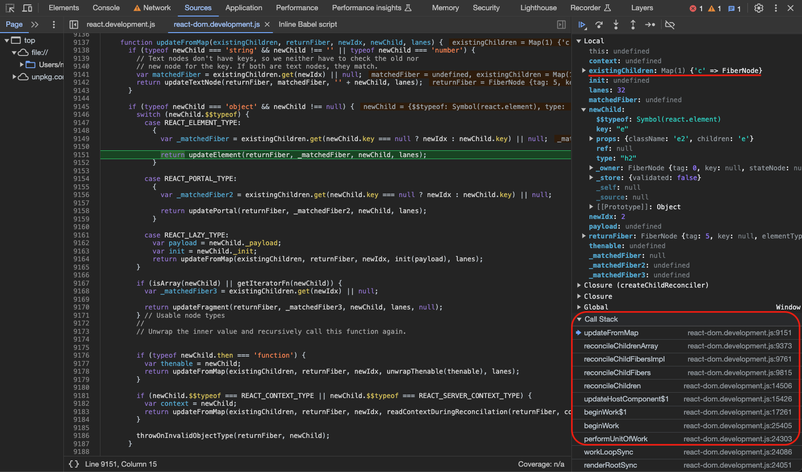
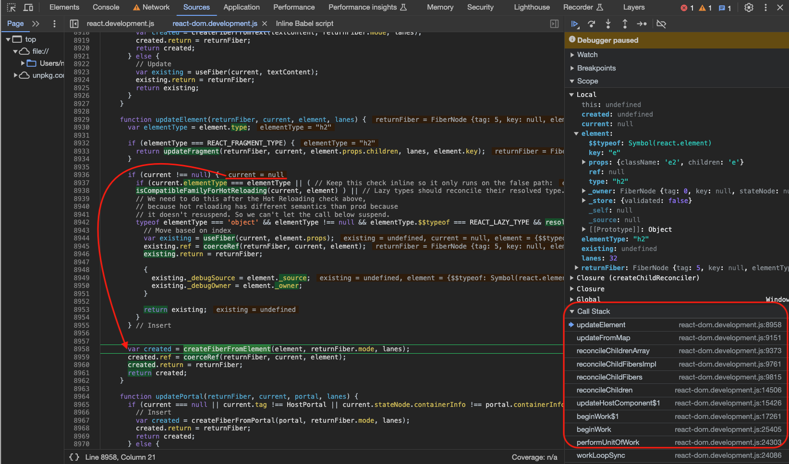

- 已经得到全新创建的`newFiber`，调用`placeChild`看新节点是否需要`Placement`标志表示插入或者移动，e、f节点因为都是新增节点所以会标志`Placement`；

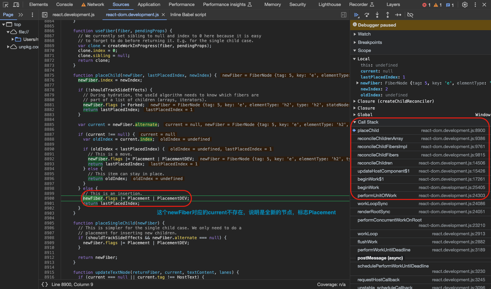

- 循环到最后一个节点c，在`updateFromMap`中首先在`existingChildren`根据`key`或者`index`找到了可用的旧节点，然后进入`updateElement`方法，因为有可复用节点会走向`useFiber`，由旧的c节点构造出来的新c节点fiber node，由于`className`的变化，会把最新的`className`放在`pendingProps`属性中用于后续处理；

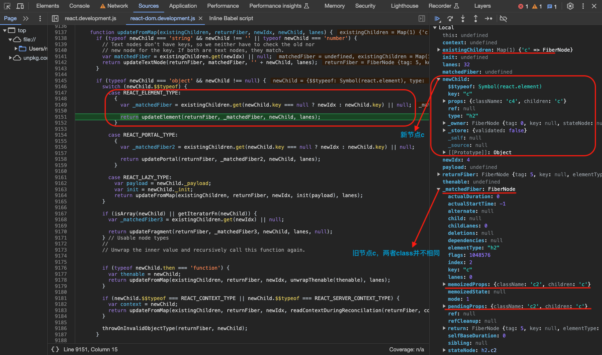
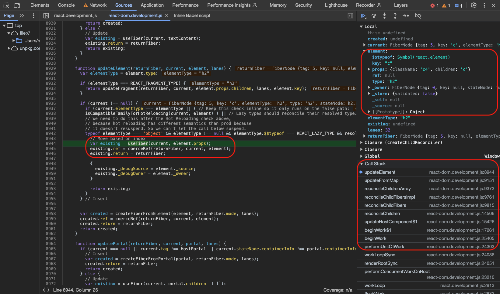
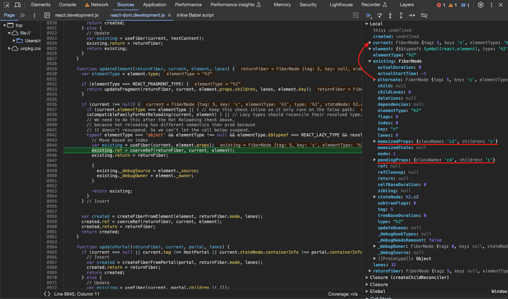

- 同样的对新c节点调用`placeChild`看新节点是否需要`Placement`标志表示插入或者移动，此处不需要插入或者移动；
- 到此处所有的新节点遍历完毕，返回第一个新的`fiber node`，其他的节点通过`sibling`属性依次链接在后面，这一层的diff过程也就完成了，新的`fiber node`结构生成；

## 总结

1. `render`流程每一个节点都会经历`beginWork`过程，而根据`tag`类型由分别进入不同的方法，例如根节点`root`进入`updateHostRoot`、函数组件`ƒ App()`进入`updateFunctionComponent`、`div`元素进入`updateHostComponent`等等；
2. `updateFunctionComponent`、`updateHostComponent`等方法如果当前节点有子节点都会进入`reconcileChildren`=>`reconcileChildFibers`=>`createChildReconciler`，在子节点是Array的情况也就是多节点的情况下进入`reconcileChildrenArray`方法；
3. `reconcileChildrenArray`方法首先进入第一次循环，从`newChildren`和`old fiber`的头开始寻找是否有可复用节点，有的话`newChildren`移动到下一个，和`old fiber`的`sibling`继续对比查看是否可复用，直到不可复用跳出第一次循环；
4. 第一次循环结束的时候可能有三种情况，第一种`newChildren`遍历完毕而`old fiber`还有剩余，说明剩下的`old fiber`是需要删除的，第二种`old fiber`遍历完毕而`newChildren`还有剩余，说明剩下的`newChildren`是需要增加的，第三种就是`newChildren`和`old fiber`都有剩余，那就要进入第二次循环；
5. 构造一个`Map<old fiber的key或index，old fiber>`把剩余的未匹配的旧节点存储起来，然后进入第二轮循环，继续遍历`newChildren`，第一步先调用`updateFromMap`方法，首先在`existingChildren`中根据`key`或者`index`寻找是否有可用旧节点，然后根据新节点的tag类型进入不同方法；
6. 如果是全新的节点通常会走如下路径`updateFromMap` => `updateElement` => `createFiberFromElement` => `createFiberFromTypeAndProps`；
7. 如果是可复用的节点通常会走如下路径`updateFromMap` => `updateElement` => `useFiber` => `createWorkInProgress`，如果是不可复用的节点则创建权限的节点如下`updateFromMap` => `updateElement` => `createFiberFromElement` => `createFiberFromTypeAndProps`；
8. 经过两次遍历，本层的新节点对应的`fiber node`结构也就构造完成了；
