# Concurrent

在 React 的`Concurrent`模式中，主要目标是提高应用程序的性能和用户体验，特别是在处理大型应用程序时。下面是一些关于 React 的`Concurrent`模式的实现原理的概要：

- 时间切片（Time Slicing）： 时间切片是 React 中`Concurrent`模式的核心概念之一。它允许 React 将渲染工作分割成小的、可中断的任务。通过这种方式，React 可以在多个渲染周期之间交错执行任务，以避免在单个周期中阻塞主线程，从而提高用户体验。

- `Suspense`组件： `Suspense`是另一个重要的概念，它使得 React 能够在等待异步数据加载时展示 fallback UI。在`Concurrent`模式中，`Suspense`不仅仅用于数据加载，还用于代码分割和其他异步操作。这使得 React 能够更加智能地管理组件树的加载和显示。

- 调度器（Scheduler）： React 的`Concurrent`模式引入了新的调度器，负责决定哪个任务应该在某一时刻执行。调度器使用时间切片和其他机制来优先级调度任务，以确保高优先级的任务在低优先级任务之前执行。

- 可中断的渲染（Interruptible Rendering）： `Concurrent`模式允许 React 在渲染过程中中断执行，以响应更高优先级的任务。这使得 React 可以更加灵活地响应用户输入和其他事件，而不会阻塞主线程。

在 React 中的`Concurrent`模式其实就是给不同的任务不同优先级和运行时间，然后安排在合适的时机去执行任务。时间切片的本质是模拟实现`requestIdleCallback`。

`window.requestIdleCallback()` 方法插入一个函数，这个函数将在浏览器空闲时期被调用。这使开发者能够在主事件循环上执行后台和低优先级工作，而不会影响延迟关键事件，如动画和输入响应。函数一般会按先进先调用的顺序执行，然而，如果回调函数指定了执行超时时间 timeout，则有可能为了在超时前执行函数而打乱执行顺序。

## 优先级 Priority 系统

在`Concurrent`模式下，不同的任务有不同的优先级，例如：

- 过期任务或者同步任务使用同步优先级
- 用户交互产生的更新（比如点击事件）使用高优先级
- 网络请求产生的更新使用一般优先级
- Suspense 使用低优先级

在 React 中的优先级系统有如下三种：

- `Lane priority` - to mark priority of work
- `Scheduler priority` - used to prioritize tasks in scheduler
- `Event priority` - to mark priority of user event

- 页面和用户交互时产生需要更新的任务时会给对应节点加上这个任务，这个**节点层级**的任务的优先级用`Lane priority`标识。
- 更新任务发生在当前应用层面的某次更新任务中，当前应用在**任务调度层级**中使用`Scheduler priority`标识。
- **事件监听**的优先级则用`Event priority`标识。

那么当一个任务产生到执行的过程大致如下：

1. get the nextLanes of the fiber tree
2. map it to scheduler priority
3. schedule the task to reconcile
4. reconciliation happens, process the work from root

### Lane priority

`Lane priority`我称之为节点层级的任务`Update`实例数据结构如下：

```ts
export const TotalLanes = 31;

export const NoLanes: Lanes = /*                        */ 0b0000000000000000000000000000000;
export const NoLane: Lane = /*                          */ 0b0000000000000000000000000000000;

export const SyncHydrationLane: Lane = /*               */ 0b0000000000000000000000000000001;
export const SyncLane: Lane = /*                        */ 0b0000000000000000000000000000010;

export const InputContinuousHydrationLane: Lane = /*    */ 0b0000000000000000000000000000100;
export const InputContinuousLane: Lane = /*             */ 0b0000000000000000000000000001000;

export const DefaultHydrationLane: Lane = /*            */ 0b0000000000000000000000000010000;
export const DefaultLane: Lane = /*                     */ 0b0000000000000000000000000100000;

export const SyncUpdateLanes: Lane = /*                */ 0b0000000000000000000000000101010;
// ...

const update: Update<S, A> = {
  lane,
  action,
  hasEagerState: false,
  eagerState: null,
  next: (null: any),
};
```

我们知道在`fiber`节点上有`hook list`，然后对于`useState hook`之类的有一个`updateQueue`会在更新阶段调用各个任务。`lane`就是用于描述节点上不同的`update`任务优先级的。

```ts
// 【packages/react-reconciler/src/ReactFiberHooks.js】
function dispatchSetState<S, A>(
  fiber: Fiber,//【currentlyRenderingFiber】
  queue: UpdateQueue<S, A>,//【queue】
  action: A,
): void {
  // 【省略代码...】

  // 【构造update任务对象】
  const lane = requestUpdateLane(fiber);
  const update: Update<S, A> = {
    lane,
    action,
    hasEagerState: false,
    eagerState: null,
    next: (null: any),
  };

  // 【省略代码...】

  // 【update任务可能走不同情况入队】
  enqueueRenderPhaseUpdate(queue, update);
  enqueueConcurrentHookUpdateAndEagerlyBailout(fiber, queue, update);
  const root = enqueueConcurrentHookUpdate(fiber, queue, update, lane);

  // 【省略代码...】

  // 【调度update任务】
  if (root !== null) {
    const eventTime = requestEventTime();
    scheduleUpdateOnFiber(root, fiber, lane, eventTime);
    entangleTransitionUpdate(root, queue, lane);
  }
}
```

React 中用用 31 位的二进制来标志`lane`优先级的高低：

```ts
export const TotalLanes = 31

export const NoLanes: Lanes = /*                        */ 0b0000000000000000000000000000000
export const NoLane: Lane = /*                          */ 0b0000000000000000000000000000000

export const SyncHydrationLane: Lane = /*               */ 0b0000000000000000000000000000001
export const SyncLane: Lane = /*                        */ 0b0000000000000000000000000000010

export const InputContinuousHydrationLane: Lane = /*    */ 0b0000000000000000000000000000100
export const InputContinuousLane: Lane = /*             */ 0b0000000000000000000000000001000

export const DefaultHydrationLane: Lane = /*            */ 0b0000000000000000000000000010000
export const DefaultLane: Lane = /*                     */ 0b0000000000000000000000000100000

export const SyncUpdateLanes: Lane = /*                */ 0b0000000000000000000000000101010
// ...

export function includesSomeLane(a: Lanes | Lane, b: Lanes | Lane) {
  return (a & b) !== NoLanes
}
export function isSubsetOfLanes(set: Lanes, subset: Lanes | Lane) {
  return (set & subset) === subset
}
export function mergeLanes(a: Lanes | Lane, b: Lanes | Lane): Lanes {
  return a | b
}
export function removeLanes(set: Lanes, subset: Lanes | Lane): Lanes {
  return set & ~subset
}
export function intersectLanes(a: Lanes | Lane, b: Lanes | Lane): Lanes {
  return a & b
}
```

接下来看，`lanes`在`update`任务具体的执行中的作用。前文已知更改`state`状态会调用`dispatchSetState`方法，构造`update`任务将`update`任务入队调度`update`任务，调度`update`任务`scheduleUpdateOnFiber` => `ensureRootIsScheduled`，可以看到`ensureRootIsScheduled`会取出`lane`字段进行判断根据是否有同步任务，没有的话从`Lane priority`映射到`Scheduler priority`优先级，从而进入`scheduleSyncCallback`或者`scheduleCallback`进一步安排`update`任务：

```ts
// 【packages/react-reconciler/src/ReactFiberWorkLoop.js】
export function scheduleUpdateOnFiber(
  root: FiberRoot,
  fiber: Fiber,
  lane: Lane
) {
  // 【省略代码...】
  // Mark that the root has a pending update.
  markRootUpdated(root, lane)

  if (
    (executionContext & RenderContext) !== NoLanes &&
    root === workInProgressRoot
  ) {
    // This update was dispatched during the render phase. This is a mistake
    // if the update originates from user space (with the exception of local
    // hook updates, which are handled differently and don't reach this
    // function), but there are some internal React features that use this as
    // an implementation detail, like selective hydration.
    // 【省略代码...】
  } else {
    // This is a normal update, scheduled from outside the render phase. For
    // example, during an input event.

    // 【省略代码...】

    ensureRootIsScheduled(root)
    // 【省略代码...】
  }
}

// Use this function to schedule a task for a root. There's only one task per
// root; if a task was already scheduled, we'll check to make sure the priority
// of the existing task is the same as the priority of the next level that the
// root has work on. This function is called on every update, and right before
// exiting a task.
function ensureRootIsScheduled(root: FiberRoot, currentTime: number) {
  const existingCallbackNode = root.callbackNode

  // Check if any lanes are being starved by other work. If so, mark them as
  // expired so we know to work on those next.
  markStarvedLanesAsExpired(root, currentTime)

  // Determine the next lanes to work on, and their priority.
  const nextLanes = getNextLanes(
    root,
    root === workInProgressRoot ? workInProgressRootRenderLanes : NoLanes
  )

  // 【省略代码...】

  // We use the highest priority lane to represent the priority of the callback.
  const newCallbackPriority = getHighestPriorityLane(nextLanes)

  // Check if there's an existing task. We may be able to reuse it.
  const existingCallbackPriority = root.callbackPriority

  // 【省略代码...】

  // Schedule a new callback.
  let newCallbackNode
  // 【有同步SyncLane的任务】
  if (includesSyncLane(newCallbackPriority)) {
    // Special case: Sync React callbacks are scheduled on a special
    // internal queue
    if (root.tag === LegacyRoot) {
      if (__DEV__ && ReactCurrentActQueue.isBatchingLegacy !== null) {
        ReactCurrentActQueue.didScheduleLegacyUpdate = true
      }
      scheduleLegacySyncCallback(performSyncWorkOnRoot.bind(null, root))
    } else {
      scheduleSyncCallback(performSyncWorkOnRoot.bind(null, root))
    }
    if (supportsMicrotasks) {
      // Flush the queue in a microtask.
      if (__DEV__ && ReactCurrentActQueue.current !== null) {
        // Inside `act`, use our internal `act` queue so that these get flushed
        // at the end of the current scope even when using the sync version
        // of `act`.
        ReactCurrentActQueue.current.push(flushSyncCallbacks)
      } else {
        scheduleMicrotask(() => {
          // In Safari, appending an iframe forces microtasks to run.
          // https://github.com/facebook/react/issues/22459
          // We don't support running callbacks in the middle of render
          // or commit so we need to check against that.
          if (
            (executionContext & (RenderContext | CommitContext)) ===
            NoContext
          ) {
            // Note that this would still prematurely flush the callbacks
            // if this happens outside render or commit phase (e.g. in an event).
            flushSyncCallbacks()
          }
        })
      }
    } else {
      // Flush the queue in an Immediate task.
      scheduleCallback(ImmediateSchedulerPriority, flushSyncCallbacks)
    }
    newCallbackNode = null
  } else {
    // 【都是异步任务，lane优先级映射到不同的Scheduler优先级，然后安排performConcurrentWorkOnRoot任务入队】
    let schedulerPriorityLevel
    switch (lanesToEventPriority(nextLanes)) {
      case DiscreteEventPriority:
        schedulerPriorityLevel = ImmediateSchedulerPriority
        break
      case ContinuousEventPriority:
        schedulerPriorityLevel = UserBlockingSchedulerPriority
        break
      case DefaultEventPriority:
        schedulerPriorityLevel = NormalSchedulerPriority
        break
      case IdleEventPriority:
        schedulerPriorityLevel = IdleSchedulerPriority
        break
      default:
        schedulerPriorityLevel = NormalSchedulerPriority
        break
    }
    newCallbackNode = scheduleCallback(
      schedulerPriorityLevel,
      performConcurrentWorkOnRoot.bind(null, root)
    )
  }

  root.callbackPriority = newCallbackPriority
  root.callbackNode = newCallbackNode
}

export function lanesToEventPriority(lanes: Lanes): EventPriority {
  const lane = getHighestPriorityLane(lanes)
  if (!isHigherEventPriority(DiscreteEventPriority, lane)) {
    return DiscreteEventPriority
  }
  if (!isHigherEventPriority(ContinuousEventPriority, lane)) {
    return ContinuousEventPriority
  }
  if (includesNonIdleWork(lane)) {
    return DefaultEventPriority
  }
  return IdleEventPriority
}
```

根据前文可知，`scheduleSyncCallback`或者`scheduleCallback`安排好任务之后在合适时机就进入任务的执行阶段，接下来看视图的更新任务`performConcurrentWorkOnRoot`，在开始正式的`render`之前，它会先做准备工作，从当前节点开始往祖先节点标记`lanes`和`childLanes`字段直到根节点，`lanes`和`childLanes`字段是后续判断是否要`bailout`的重要标志。那哪些节点是有`update`任务的节点呢，其实就是前文中提到的`concurrentQueues`数组中存储的节点：

`performConcurrentWorkOnRoot` => `renderRootSync`/`renderRootConcurrent` => `prepareFreshStack` => `finishQueueingConcurrentUpdates` => `markUpdateLaneFromFiberToRoot`

```ts
// 【packages/react-reconciler/src/ReactFiberWorkLoop.js】
function prepareFreshStack(root: FiberRoot, lanes: Lanes): Fiber {
  root.finishedWork = null
  root.finishedLanes = NoLanes

  const timeoutHandle = root.timeoutHandle
  if (timeoutHandle !== noTimeout) {
    // The root previous suspended and scheduled a timeout to commit a fallback
    // state. Now that we have additional work, cancel the timeout.
    root.timeoutHandle = noTimeout
    // $FlowFixMe Complains noTimeout is not a TimeoutID, despite the check above
    cancelTimeout(timeoutHandle)
  }

  resetWorkInProgressStack()
  workInProgressRoot = root
  const rootWorkInProgress = createWorkInProgress(root.current, null)
  workInProgress = rootWorkInProgress
  workInProgressRootRenderLanes = renderLanes = lanes
  workInProgressSuspendedReason = NotSuspended
  workInProgressThrownValue = null
  workInProgressRootDidAttachPingListener = false
  workInProgressRootExitStatus = RootInProgress
  workInProgressRootFatalError = null
  workInProgressRootSkippedLanes = NoLanes
  workInProgressRootInterleavedUpdatedLanes = NoLanes
  workInProgressRootRenderPhaseUpdatedLanes = NoLanes
  workInProgressRootPingedLanes = NoLanes
  workInProgressRootConcurrentErrors = null
  workInProgressRootRecoverableErrors = null

  finishQueueingConcurrentUpdates()

  if (__DEV__) {
    ReactStrictModeWarnings.discardPendingWarnings()
  }

  return rootWorkInProgress
}

// 【packages/react-reconciler/src/ReactFiberConcurrentUpdates.js】
export function finishQueueingConcurrentUpdates(): void {
  const endIndex = concurrentQueuesIndex
  concurrentQueuesIndex = 0

  concurrentlyUpdatedLanes = NoLanes

  let i = 0
  // 【concurrentQueues是在enqueueUpdate方法中将有Update任务的fiber节点存储起来的数组】
  while (i < endIndex) {
    const fiber: Fiber = concurrentQueues[i]
    concurrentQueues[i++] = null
    const queue: ConcurrentQueue = concurrentQueues[i]
    concurrentQueues[i++] = null
    const update: ConcurrentUpdate = concurrentQueues[i]
    concurrentQueues[i++] = null
    const lane: Lane = concurrentQueues[i]
    concurrentQueues[i++] = null

    if (queue !== null && update !== null) {
      const pending = queue.pending
      if (pending === null) {
        // This is the first update. Create a circular list.
        update.next = update
      } else {
        update.next = pending.next
        pending.next = update
      }
      queue.pending = update
    }

    if (lane !== NoLane) {
      // 【！！！从当前节点开始往祖先节点标记lanes和childLanes字段直到根节点！！！】
      markUpdateLaneFromFiberToRoot(fiber, update, lane)
    }
  }
}

function markUpdateLaneFromFiberToRoot(
  sourceFiber: Fiber,
  update: ConcurrentUpdate | null,
  lane: Lane
): void {
  // Update the source fiber's lanes
  sourceFiber.lanes = mergeLanes(sourceFiber.lanes, lane)
  let alternate = sourceFiber.alternate
  if (alternate !== null) {
    alternate.lanes = mergeLanes(alternate.lanes, lane)
  }
  // Walk the parent path to the root and update the child lanes.
  let isHidden = false
  let parent = sourceFiber.return
  let node = sourceFiber
  // 【从当前节点开始往根节点去标记，所以说从当前节点直到根节点的ChildLanes字段都是有值的，这个要用于后续的判断】
  while (parent !== null) {
    parent.childLanes = mergeLanes(parent.childLanes, lane)
    alternate = parent.alternate
    if (alternate !== null) {
      alternate.childLanes = mergeLanes(alternate.childLanes, lane)
    }

    if (parent.tag === OffscreenComponent) {
      // Check if this offscreen boundary is currently hidden.
      //
      // The instance may be null if the Offscreen parent was unmounted. Usually
      // the parent wouldn't be reachable in that case because we disconnect
      // fibers from the tree when they are deleted. However, there's a weird
      // edge case where setState is called on a fiber that was interrupted
      // before it ever mounted. Because it never mounts, it also never gets
      // deleted. Because it never gets deleted, its return pointer never gets
      // disconnected. Which means it may be attached to a deleted Offscreen
      // parent node. (This discovery suggests it may be better for memory usage
      // if we don't attach the `return` pointer until the commit phase, though
      // in order to do that we'd need some other way to track the return
      // pointer during the initial render, like on the stack.)
      //
      // This case is always accompanied by a warning, but we still need to
      // account for it. (There may be other cases that we haven't discovered,
      // too.)
      const offscreenInstance: OffscreenInstance | null = parent.stateNode
      if (
        offscreenInstance !== null &&
        !(offscreenInstance._visibility & OffscreenVisible)
      ) {
        isHidden = true
      }
    }

    node = parent
    parent = parent.return
  }

  if (isHidden && update !== null && node.tag === HostRoot) {
    const root: FiberRoot = node.stateNode
    markHiddenUpdate(root, update, lane)
  }
}
```

`prepareFreshStack`结束之后就到`beginWork`阶段，`didReceiveUpdate`变量标志了是否有`update`任务或者其他变化，`beginWork`阶段首先进行一系列判断能否复用旧节点，判断逻辑如下：

1. 如果新旧`Props`改变或者`context`改变, `didReceiveUpdate`设为`true`并继续；
2. 如果没有继续调用`checkScheduledUpdateOrContext()`方法检查节点上是否有`update`任务；
3. 如果没有调用`attemptEarlyBailoutIfNoScheduledUpdate`说明后续节点没有更新内容了，提前退出；
4. 最后需要走更新步骤根据 tag 进入不同的更新方法；

```ts
// 【packages/react-reconciler/src/ReactFiberBeginWork.js】
function beginWork(
  current: Fiber | null,
  workInProgress: Fiber,
  renderLanes: Lanes
): Fiber | null {
  // 【省略代码...】

  if (current !== null) {
    const oldProps = current.memoizedProps
    const newProps = workInProgress.pendingProps

    if (
      oldProps !== newProps ||
      hasLegacyContextChanged() ||
      // Force a re-render if the implementation changed due to hot reload:
      (__DEV__ ? workInProgress.type !== current.type : false)
    ) {
      // If props or context changed, mark the fiber as having performed work.
      // This may be unset if the props are determined to be equal later (memo).
      didReceiveUpdate = true
    } else {
      // Neither props nor legacy context changes. Check if there's a pending
      // update or context change.
      const hasScheduledUpdateOrContext = checkScheduledUpdateOrContext(
        current,
        renderLanes
      )
      if (
        !hasScheduledUpdateOrContext &&
        // If this is the second pass of an error or suspense boundary, there
        // may not be work scheduled on `current`, so we check for this flag.
        (workInProgress.flags & DidCapture) === NoFlags
      ) {
        // No pending updates or context. Bail out now.
        // 【后面的子节点没有Update任务了】
        didReceiveUpdate = false
        // 【复用current节点的内容，得到复用的节点直接返回】
        return attemptEarlyBailoutIfNoScheduledUpdate(
          current,
          workInProgress,
          renderLanes
        )
      }
      if ((current.flags & ForceUpdateForLegacySuspense) !== NoFlags) {
        // This is a special case that only exists for legacy mode.
        // See https://github.com/facebook/react/pull/19216.
        didReceiveUpdate = true
      } else {
        // An update was scheduled on this fiber, but there are no new props
        // nor legacy context. Set this to false. If an update queue or context
        // consumer produces a changed value, it will set this to true. Otherwise,
        // the component will assume the children have not changed and bail out.
        didReceiveUpdate = false
      }
    }
  } else {
    didReceiveUpdate = false

    if (getIsHydrating() && isForkedChild(workInProgress)) {
      // Check if this child belongs to a list of muliple children in
      // its parent.
      //
      // In a true multi-threaded implementation, we would render children on
      // parallel threads. This would represent the beginning of a new render
      // thread for this subtree.
      //
      // We only use this for id generation during hydration, which is why the
      // logic is located in this special branch.
      const slotIndex = workInProgress.index
      const numberOfForks = getForksAtLevel(workInProgress)
      pushTreeId(workInProgress, numberOfForks, slotIndex)
    }
  }

  // Before entering the begin phase, clear pending update priority.
  // TODO: This assumes that we're about to evaluate the component and process
  // the update queue. However, there's an exception: SimpleMemoComponent
  // sometimes bails out later in the begin phase. This indicates that we should
  // move this assignment out of the common path and into each branch.
  workInProgress.lanes = NoLanes

  switch (workInProgress.tag) {
    case FunctionComponent: {
      const Component = workInProgress.type
      const unresolvedProps = workInProgress.pendingProps
      const resolvedProps =
        workInProgress.elementType === Component
          ? unresolvedProps
          : resolveDefaultProps(Component, unresolvedProps)
      return updateFunctionComponent(
        current,
        workInProgress,
        Component,
        resolvedProps,
        renderLanes
      )
    }
    // 【省略代码...】
  }

  throw new Error(
    `Unknown unit of work tag (${workInProgress.tag}). This error is likely caused by a bug in ` +
      "React. Please file an issue."
  )
}
```

`checkScheduledUpdateOrContext`检查是否存在`update`任务其实就是通过`lanes`字段：

```ts
// 【packages/react-reconciler/src/ReactFiberBeginWork.js】
function checkScheduledUpdateOrContext(
  current: Fiber,
  renderLanes: Lanes
): boolean {
  // Before performing an early bailout, we must check if there are pending
  // updates or context.
  const updateLanes = current.lanes
  if (includesSomeLane(updateLanes, renderLanes)) {
    return true
  }
  // No pending update, but because context is propagated lazily, we need
  // to check for a context change before we bail out.
  if (enableLazyContextPropagation) {
    const dependencies = current.dependencies
    if (dependencies !== null && checkIfContextChanged(dependencies)) {
      return true
    }
  }
  return false
}
```

到此为止我们知道了在调度任务阶段会`lanes`判断是否同步任务以及将`Lane priority`映射到`Scheduler priority`优先级去进行任务的调度，在任务执行的`render`阶段`lanes`和`childLanes`字段要用于是否继续深入子节点更新的判断。

### Scheduler priority

`Scheduler priority`我称之为任务调度系统层级的任务`Task`，实例数据结构如下：

```ts
export const NoPriority = 0
export const ImmediatePriority = 1
export const UserBlockingPriority = 2
export const NormalPriority = 3
export const LowPriority = 4
export const IdlePriority = 5

var newTask: Task = {
  id: taskIdCounter++,
  callback,
  priorityLevel,
  startTime,
  expirationTime,
  sortIndex: -1,
}
```

在调度`performConcurrentWorkOnRoot`更新视图或者`flushPassiveEffects`副作用操作之类的任务之前首先需要确定这个任务的`Scheduler priority`优先级，由`Update`实例的`lanes`映射到`schedulerPriorityLevel`的五个层级如下：

```ts
// 【packages/react-reconciler/src/ReactFiberWorkLoop.js】
export type PriorityLevel = 0 | 1 | 2 | 3 | 4 | 5

// TODO: Use symbols?
export const NoPriority = 0
export const ImmediatePriority = 1
export const UserBlockingPriority = 2
export const NormalPriority = 3
export const LowPriority = 4
export const IdlePriority = 5

function ensureRootIsScheduled(root: FiberRoot, currentTime: number) {
  // Determine the next lanes to work on, and their priority.
  const nextLanes = getNextLanes(
    root,
    root === workInProgressRoot ? workInProgressRootRenderLanes : NoLanes
  )

  // We use the highest priority lane to represent the priority of the callback.
  const newCallbackPriority = getHighestPriorityLane(nextLanes)

  // Schedule a new callback.
  let newCallbackNode
  if (includesSyncLane(newCallbackPriority)) {
  } else {
    let schedulerPriorityLevel
    // 【优先级映射lanes=>schduler priority】
    switch (lanesToEventPriority(nextLanes)) {
      case DiscreteEventPriority:
        schedulerPriorityLevel = ImmediateSchedulerPriority
        break
      case ContinuousEventPriority:
        schedulerPriorityLevel = UserBlockingSchedulerPriority
        break
      case DefaultEventPriority:
        schedulerPriorityLevel = NormalSchedulerPriority
        break
      case IdleEventPriority:
        schedulerPriorityLevel = IdleSchedulerPriority
        break
      default:
        schedulerPriorityLevel = NormalSchedulerPriority
        break
    }
    // 【任务调度，第一个参数是任务优先级，第二个参数是具体任务】
    newCallbackNode = scheduleCallback(
      schedulerPriorityLevel,
      performConcurrentWorkOnRoot.bind(null, root)
    )
  }

  root.callbackPriority = newCallbackPriority
  root.callbackNode = newCallbackNode
}

// 【packages/react-reconciler/src/ReactEventPriorities.js】
export function lanesToEventPriority(lanes: Lanes): EventPriority {
  const lane = getHighestPriorityLane(lanes)
  if (!isHigherEventPriority(DiscreteEventPriority, lane)) {
    return DiscreteEventPriority
  }
  if (!isHigherEventPriority(ContinuousEventPriority, lane)) {
    return ContinuousEventPriority
  }
  if (includesNonIdleWork(lane)) {
    return DefaultEventPriority
  }
  return IdleEventPriority
}

// 【packages/react-reconciler/src/ReactFiberLane.js】
export function getHighestPriorityLane(lanes: Lanes): Lane {
  return lanes & -lanes
}
```

确定了任务优先级就安排`Task`实例任务入队如下：

```ts
// 【packages/scheduler/src/forks/Scheduler.js】
// Max 31 bit integer. The max integer size in V8 for 32-bit systems.
// Math.pow(2, 30) - 1
// 0b111111111111111111111111111111
var maxSigned31BitInt = 1073741823

// Times out immediately
var IMMEDIATE_PRIORITY_TIMEOUT = -1
// Eventually times out
var USER_BLOCKING_PRIORITY_TIMEOUT = 250
var NORMAL_PRIORITY_TIMEOUT = 5000
var LOW_PRIORITY_TIMEOUT = 10000
// Never times out
var IDLE_PRIORITY_TIMEOUT = maxSigned31BitInt

function unstable_scheduleCallback(
  priorityLevel: PriorityLevel,
  callback: Callback,
  options?: { delay: number }
): Task {
  var currentTime = getCurrentTime()
  // 【获取开始时间】
  var startTime
  if (typeof options === "object" && options !== null) {
    var delay = options.delay
    if (typeof delay === "number" && delay > 0) {
      startTime = currentTime + delay
    } else {
      startTime = currentTime
    }
  } else {
    startTime = currentTime
  }
  // 【根据不同优先级确定不同的超时时间】
  var timeout
  switch (priorityLevel) {
    case ImmediatePriority:
      timeout = IMMEDIATE_PRIORITY_TIMEOUT
      break
    case UserBlockingPriority:
      timeout = USER_BLOCKING_PRIORITY_TIMEOUT
      break
    case IdlePriority:
      timeout = IDLE_PRIORITY_TIMEOUT
      break
    case LowPriority:
      timeout = LOW_PRIORITY_TIMEOUT
      break
    case NormalPriority:
    default:
      timeout = NORMAL_PRIORITY_TIMEOUT
      break
  }

  var expirationTime = startTime + timeout
  // 【创建任务，expirationTime代表过期时间】
  var newTask: Task = {
    id: taskIdCounter++,
    callback,
    priorityLevel,
    startTime,
    expirationTime,
    sortIndex: -1,
  }
  if (enableProfiling) {
    newTask.isQueued = false
  }
  // 【未就绪任务入队timerQueue】
  if (startTime > currentTime) {
    // This is a delayed task.
    newTask.sortIndex = startTime
    push(timerQueue, newTask)
    if (peek(taskQueue) === null && newTask === peek(timerQueue)) {
      // All tasks are delayed, and this is the task with the earliest delay.
      if (isHostTimeoutScheduled) {
        // Cancel an existing timeout.
        cancelHostTimeout()
      } else {
        isHostTimeoutScheduled = true
      }
      // Schedule a timeout.
      requestHostTimeout(handleTimeout, startTime - currentTime)
    }
  } else {
    // 【已就绪任务入队taskQueue】
    newTask.sortIndex = expirationTime
    push(taskQueue, newTask)
    if (enableProfiling) {
      markTaskStart(newTask, currentTime)
      newTask.isQueued = true
    }
    // Schedule a host callback, if needed. If we're already performing work,
    // wait until the next time we yield.
    // 【如果没有正在执行的任务就安排执行现有任务】
    if (!isHostCallbackScheduled && !isPerformingWork) {
      isHostCallbackScheduled = true
      requestHostCallback(flushWork)
    }
  }

  return newTask
}
```

### Event priority

`Event priority`我称之为事件层级的任务`Task`实例数据结构如下：

```ts
// 【packages/react-reconciler/src/ReactEventPriorities.js】
export const NoEventPriority: EventPriority = NoLane
export const DiscreteEventPriority: EventPriority = SyncLane
export const ContinuousEventPriority: EventPriority = InputContinuousLane
export const DefaultEventPriority: EventPriority = DefaultLane
export const IdleEventPriority: EventPriority = IdleLane
```

`Event Priority` 指 React 根据事件类型为事件分配的优先级，这直接影响事件处理的执行顺序以及在 React 中如何协调（Scheduling）更新：

1. `Discrete Events`（离散事件）

- 高优先级
- 这些事件与用户的瞬时操作相关，例如点击、按键、鼠标按下/释放。

2. `Continuous Events`（连续事件）

- 低优先级
- 这些事件通常是连续触发的，例如滚动、鼠标移动等。

3. `Default Events`（默认事件）

- 中等优先级
- 不直接影响用户交互体验的事件，例如非用户触发的动画更新、空闲任务。

React 中的合成事件在绑定到根节点时就已经确定好优先级如下：

```ts
export function getEventPriority(domEventName: DOMEventName): EventPriority {
  switch (domEventName) {
    // Used by SimpleEventPlugin:
    case "beforetoggle":
    case "cancel":
    case "click":
    case "close":
    case "contextmenu":
    case "copy":
    case "cut":
    case "auxclick":
    case "dblclick":
    case "dragend":
    case "dragstart":
    case "drop":
    case "focusin":
    case "focusout":
    case "input":
    case "invalid":
    case "keydown":
    case "keypress":
    case "keyup":
    case "mousedown":
    case "mouseup":
    case "paste":
    case "pause":
    case "play":
    case "pointercancel":
    case "pointerdown":
    case "pointerup":
    case "ratechange":
    case "reset":
    case "resize":
    case "seeked":
    case "submit":
    case "toggle":
    case "touchcancel":
    case "touchend":
    case "touchstart":
    case "volumechange":
    // Used by polyfills: (fall through)
    case "change":
    case "selectionchange":
    case "textInput":
    case "compositionstart":
    case "compositionend":
    case "compositionupdate":
    // Only enableCreateEventHandleAPI: (fall through)
    case "beforeblur":
    case "afterblur":
    // Not used by React but could be by user code: (fall through)
    case "beforeinput":
    case "blur":
    case "fullscreenchange":
    case "focus":
    case "hashchange":
    case "popstate":
    case "select":
    case "selectstart":
      return DiscreteEventPriority
    case "drag":
    case "dragenter":
    case "dragexit":
    case "dragleave":
    case "dragover":
    case "mousemove":
    case "mouseout":
    case "mouseover":
    case "pointermove":
    case "pointerout":
    case "pointerover":
    case "scroll":
    case "touchmove":
    case "wheel":
    // Not used by React but could be by user code: (fall through)
    case "mouseenter":
    case "mouseleave":
    case "pointerenter":
    case "pointerleave":
      return ContinuousEventPriority
    case "message": {
      // We might be in the Scheduler callback.
      // Eventually this mechanism will be replaced by a check
      // of the current priority on the native scheduler.
      const schedulerPriority = getCurrentSchedulerPriorityLevel()
      switch (schedulerPriority) {
        case ImmediateSchedulerPriority:
          return DiscreteEventPriority
        case UserBlockingSchedulerPriority:
          return ContinuousEventPriority
        case NormalSchedulerPriority:
        case LowSchedulerPriority:
          // TODO: Handle LowSchedulerPriority, somehow. Maybe the same lane as hydration.
          return DefaultEventPriority
        case IdleSchedulerPriority:
          return IdleEventPriority
        default:
          return DefaultEventPriority
      }
    }
    default:
      return DefaultEventPriority
  }
}
```

根据不同事件优先级的分类，调用不同的监听函数`dispatchDiscreteEvent`、`dispatchContinuousEvent`、`dispatchEvent`，所以后续监听事件进入的是不同的函数：

```ts
// 【packages/react-dom-bindings/src/events/ReactDOMEventListener.js】
export function createEventListenerWrapperWithPriority(
  targetContainer: EventTarget,
  domEventName: DOMEventName,
  eventSystemFlags: EventSystemFlags
): Function {
  const eventPriority = getEventPriority(domEventName)
  let listenerWrapper
  switch (eventPriority) {
    case DiscreteEventPriority:
      listenerWrapper = dispatchDiscreteEvent
      break
    case ContinuousEventPriority:
      listenerWrapper = dispatchContinuousEvent
      break
    case DefaultEventPriority:
    default:
      listenerWrapper = dispatchEvent
      break
  }
  return listenerWrapper.bind(
    null,
    domEventName,
    eventSystemFlags,
    targetContainer
  )
}
```

## 任务调度 Scheduler 流程

React 中有如下方法可能触发更新，每次更新都会构造一个`update`任务，然后调用`scheduleLegacySyncCallback`或者`scheduleCallback`对任务进行调度。

- `ReactDOM.render` —— HostRoot
- `this.setState` —— ClassComponent
- `this.forceUpdate` —— ClassComponent
- `useState` —— FunctionComponent
- `useReducer` —— FunctionComponent

### 安排任务阶段

`scheduleLegacySyncCallback`/`scheduleSyncCallback`方法调度**同步任务**，将任务加入`syncQueue`任务栈。

```ts
let syncQueue: Array<SchedulerCallback> | null = null
let includesLegacySyncCallbacks: boolean = false
let isFlushingSyncQueue: boolean = false

export function scheduleSyncCallback(callback: SchedulerCallback) {
  // Push this callback into an internal queue. We'll flush these either in
  // the next tick, or earlier if something calls `flushSyncCallbackQueue`.
  if (syncQueue === null) {
    syncQueue = [callback]
  } else {
    // Push onto existing queue. Don't need to schedule a callback because
    // we already scheduled one when we created the queue.
    syncQueue.push(callback)
  }
}

export function scheduleLegacySyncCallback(callback: SchedulerCallback) {
  includesLegacySyncCallbacks = true
  scheduleSyncCallback(callback)
}
```

`scheduleCallback`方法调度**非同步任务**由`Scheduler`模块提供，实际调用了`unstable_scheduleCallback`方法，用于`Concurrent`模式下以某个优先级异步调度一个 callback 函数，将任务加入`taskQueue`或者`timerQueue`。对于每一个任务根据它的优先级分类有以下几种，不同优先级有一个超时时间，比如-1 其实相当于立马就过期了，说明这个任务需要立即执行是高优先级：

- `IMMEDIATE_PRIORITY_TIMEOUT`: -1
- `USER_BLOCKING_PRIORITY_TIMEOUT`: 250
- `IDLE_PRIORITY_TIMEOUT`: 5000
- `LOW_PRIORITY_TIMEOUT`: 10000
- `NORMAL_PRIORITY_TIMEOUT`: Math.pow(2, 30) - 1

`ensureRootIsScheduled` => `scheduleCallback` => `Scheduler.unstable_scheduleCallback` => `requestHostCallback(flushWork)`

```ts
// 【packages/react-reconciler/src/ReactFiberWorkLoop.js】
export type PriorityLevel = 0 | 1 | 2 | 3 | 4 | 5

// TODO: Use symbols?
export const NoPriority = 0
export const ImmediatePriority = 1
export const UserBlockingPriority = 2
export const NormalPriority = 3
export const LowPriority = 4
export const IdlePriority = 5

function ensureRootIsScheduled(root: FiberRoot, currentTime: number) {
  // Determine the next lanes to work on, and their priority.
  const nextLanes = getNextLanes(
    root,
    root === workInProgressRoot ? workInProgressRootRenderLanes : NoLanes
  )

  // We use the highest priority lane to represent the priority of the callback.
  const newCallbackPriority = getHighestPriorityLane(nextLanes)

  // Schedule a new callback.
  let newCallbackNode
  if (includesSyncLane(newCallbackPriority)) {
    // 【省略代码...】
  } else {
    let schedulerPriorityLevel
    // 【优先级映射lanes=>schduler priority】
    switch (lanesToEventPriority(nextLanes)) {
      case DiscreteEventPriority:
        schedulerPriorityLevel = ImmediateSchedulerPriority
        break
      case ContinuousEventPriority:
        schedulerPriorityLevel = UserBlockingSchedulerPriority
        break
      case DefaultEventPriority:
        schedulerPriorityLevel = NormalSchedulerPriority
        break
      case IdleEventPriority:
        schedulerPriorityLevel = IdleSchedulerPriority
        break
      default:
        schedulerPriorityLevel = NormalSchedulerPriority
        break
    }
    // 【任务调度，第一个参数是任务优先级，第二个参数是具体任务】
    newCallbackNode = scheduleCallback(
      schedulerPriorityLevel,
      performConcurrentWorkOnRoot.bind(null, root)
    )
  }

  root.callbackPriority = newCallbackPriority
  root.callbackNode = newCallbackNode
}

// 【packages/react-reconciler/src/Scheduler.js】
export const scheduleCallback = Scheduler.unstable_scheduleCallback
export const cancelCallback = Scheduler.unstable_cancelCallback
export const shouldYield = Scheduler.unstable_shouldYield
export const requestPaint = Scheduler.unstable_requestPaint

// 【packages/react-reconciler/src/ReactFiberWorkLoop.js】
import {
  // Aliased because `act` will override and push to an internal queue
  scheduleCallback as Scheduler_scheduleCallback,
  shouldYield,
  requestPaint,
  now,
  NormalPriority as NormalSchedulerPriority,
  IdlePriority as IdleSchedulerPriority,
} from "./Scheduler"

function scheduleCallback(priorityLevel: any, callback) {
  if (__DEV__) {
    // If we're currently inside an `act` scope, bypass Scheduler and push to
    // the `act` queue instead.
    const actQueue = ReactCurrentActQueue.current
    if (actQueue !== null) {
      actQueue.push(callback)
      return fakeActCallbackNode
    } else {
      return Scheduler_scheduleCallback(priorityLevel, callback)
    }
  } else {
    // In production, always call Scheduler. This function will be stripped out.
    return Scheduler_scheduleCallback(priorityLevel, callback)
  }
}

// 【packages/scheduler/src/forks/Scheduler.js】
// Max 31 bit integer. The max integer size in V8 for 32-bit systems.
// Math.pow(2, 30) - 1
// 0b111111111111111111111111111111
var maxSigned31BitInt = 1073741823

// Times out immediately
var IMMEDIATE_PRIORITY_TIMEOUT = -1
// Eventually times out
var USER_BLOCKING_PRIORITY_TIMEOUT = 250
var NORMAL_PRIORITY_TIMEOUT = 5000
var LOW_PRIORITY_TIMEOUT = 10000
// Never times out
var IDLE_PRIORITY_TIMEOUT = maxSigned31BitInt

function unstable_scheduleCallback(
  priorityLevel: PriorityLevel,
  callback: Callback,
  options?: { delay: number }
): Task {
  var currentTime = getCurrentTime()
  // 【获取开始时间】
  var startTime
  if (typeof options === "object" && options !== null) {
    var delay = options.delay
    if (typeof delay === "number" && delay > 0) {
      startTime = currentTime + delay
    } else {
      startTime = currentTime
    }
  } else {
    startTime = currentTime
  }
  // 【根据不同优先级确定不同的超时时间】
  var timeout
  switch (priorityLevel) {
    case ImmediatePriority:
      timeout = IMMEDIATE_PRIORITY_TIMEOUT
      break
    case UserBlockingPriority:
      timeout = USER_BLOCKING_PRIORITY_TIMEOUT
      break
    case IdlePriority:
      timeout = IDLE_PRIORITY_TIMEOUT
      break
    case LowPriority:
      timeout = LOW_PRIORITY_TIMEOUT
      break
    case NormalPriority:
    default:
      timeout = NORMAL_PRIORITY_TIMEOUT
      break
  }

  var expirationTime = startTime + timeout
  // 【创建任务，expirationTime代表过期时间】
  var newTask: Task = {
    id: taskIdCounter++,
    callback,
    priorityLevel,
    startTime,
    expirationTime,
    sortIndex: -1,
  }
  if (enableProfiling) {
    newTask.isQueued = false
  }
  // 【未就绪任务入队timerQueue】
  if (startTime > currentTime) {
    // This is a delayed task.
    newTask.sortIndex = startTime
    push(timerQueue, newTask)
    if (peek(taskQueue) === null && newTask === peek(timerQueue)) {
      // All tasks are delayed, and this is the task with the earliest delay.
      if (isHostTimeoutScheduled) {
        // Cancel an existing timeout.
        cancelHostTimeout()
      } else {
        isHostTimeoutScheduled = true
      }
      // Schedule a timeout.
      requestHostTimeout(handleTimeout, startTime - currentTime)
    }
  } else {
    // 【已就绪任务入队taskQueue】
    newTask.sortIndex = expirationTime
    push(taskQueue, newTask)
    if (enableProfiling) {
      markTaskStart(newTask, currentTime)
      newTask.isQueued = true
    }
    // Schedule a host callback, if needed. If we're already performing work,
    // wait until the next time we yield.
    // 【如果没有正在执行的任务就安排执行现有任务】
    if (!isHostCallbackScheduled && !isPerformingWork) {
      isHostCallbackScheduled = true
      requestHostCallback(flushWork)
    }
  }

  return newTask
}
```

---

### 回调执行任务阶段

接下来`requestHostCallback`进入安排执行任务`flushWork`的过程，调用`schedulePerformWorkUntilDeadline`方法，`schedulePerformWorkUntilDeadline`通过三种方式调度异步任务`setImmediate`、`MessageChannel`、`setTimeout`，然后就会异步进入`performWorkUntilDeadline`：

<!-- 【TODO：`MessageChannel`、`setTimeout`执行顺序】 -->

```ts
// 【packages/scheduler/src/forks/Scheduler.js】
function requestHostCallback(
  callback: (hasTimeRemaining: boolean, initialTime: number) => boolean
) {
  // 【flushWork赋值给scheduledHostCallback】
  scheduledHostCallback = callback
  if (!isMessageLoopRunning) {
    isMessageLoopRunning = true
    schedulePerformWorkUntilDeadline()
  }
}

let schedulePerformWorkUntilDeadline
if (typeof localSetImmediate === "function") {
  // Node.js and old IE.
  // There's a few reasons for why we prefer setImmediate.
  //
  // Unlike MessageChannel, it doesn't prevent a Node.js process from exiting.
  // (Even though this is a DOM fork of the Scheduler, you could get here
  // with a mix of Node.js 15+, which has a MessageChannel, and jsdom.)
  // https://github.com/facebook/react/issues/20756
  //
  // But also, it runs earlier which is the semantic we want.
  // If other browsers ever implement it, it's better to use it.
  // Although both of these would be inferior to native scheduling.
  schedulePerformWorkUntilDeadline = () => {
    localSetImmediate(performWorkUntilDeadline)
  }
} else if (typeof MessageChannel !== "undefined") {
  // DOM and Worker environments.
  // We prefer MessageChannel because of the 4ms setTimeout clamping.
  const channel = new MessageChannel()
  const port = channel.port2
  channel.port1.onmessage = performWorkUntilDeadline
  schedulePerformWorkUntilDeadline = () => {
    port.postMessage(null)
  }
} else {
  // We should only fallback here in non-browser environments.
  schedulePerformWorkUntilDeadline = () => {
    // $FlowFixMe[not-a-function] nullable value
    localSetTimeout(performWorkUntilDeadline, 0)
  }
}
```

`performWorkUntilDeadline`进行一些判断工作后就进入到正式调用我们先前在`requestHostCallback`方法中安排的`scheduledHostCallback`也就是回调`callback`（`flushWork`）任务：

```ts
// 【packages/scheduler/src/forks/Scheduler.js】
const performWorkUntilDeadline = () => {
  if (scheduledHostCallback !== null) {
    const currentTime = getCurrentTime()
    // Keep track of the start time so we can measure how long the main thread
    // has been blocked.
    startTime = currentTime
    const hasTimeRemaining = true

    // If a scheduler task throws, exit the current browser task so the
    // error can be observed.
    //
    // Intentionally not using a try-catch, since that makes some debugging
    // techniques harder. Instead, if `scheduledHostCallback` errors, then
    // `hasMoreWork` will remain true, and we'll continue the work loop.
    let hasMoreWork = true
    try {
      // $FlowFixMe[not-a-function] found when upgrading Flow
      // 【scheduledHostCallback就是在requestHostCallback方法中设置的callback（flushWork）】
      hasMoreWork = scheduledHostCallback(hasTimeRemaining, currentTime)
    } finally {
      if (hasMoreWork) {
        // 【如果还有任务继续异步调用】
        // If there's more work, schedule the next message event at the end
        // of the preceding one.
        schedulePerformWorkUntilDeadline()
      } else {
        isMessageLoopRunning = false
        scheduledHostCallback = null
      }
    }
  } else {
    isMessageLoopRunning = false
  }
  // Yielding to the browser will give it a chance to paint, so we can
  // reset this.
  needsPaint = false
}
```

`flushWork`会去调用已就绪`taskQueue`任务里（最小堆）任务的方法，它会调用`workLoop`去遍历`taskQueue`里的任务进行一一调用，比如组件重新渲染任务、`useEffect`的`flushPassiveEffects`任务等等。在遍历执行任务的过程中，`shouldYieldToHost`是一个很关键的方法用于判断要不要暂停当前任务执行比如把主线程交给渲染等。

```ts
// 【packages/scheduler/src/forks/Scheduler.js】
function flushWork(hasTimeRemaining: boolean, initialTime: number) {
  if (enableProfiling) {
    markSchedulerUnsuspended(initialTime)
  }

  // We'll need a host callback the next time work is scheduled.
  isHostCallbackScheduled = false
  if (isHostTimeoutScheduled) {
    // We scheduled a timeout but it's no longer needed. Cancel it.
    isHostTimeoutScheduled = false
    cancelHostTimeout()
  }

  isPerformingWork = true
  const previousPriorityLevel = currentPriorityLevel
  try {
    if (enableProfiling) {
      try {
        // 【重点方法workLoop】
        return workLoop(hasTimeRemaining, initialTime)
      } catch (error) {
        if (currentTask !== null) {
          const currentTime = getCurrentTime()
          // $FlowFixMe[incompatible-call] found when upgrading Flow
          markTaskErrored(currentTask, currentTime)
          // $FlowFixMe[incompatible-use] found when upgrading Flow
          currentTask.isQueued = false
        }
        throw error
      }
    } else {
      // No catch in prod code path.
      return workLoop(hasTimeRemaining, initialTime)
    }
  } finally {
    currentTask = null
    currentPriorityLevel = previousPriorityLevel
    isPerformingWork = false
    if (enableProfiling) {
      const currentTime = getCurrentTime()
      markSchedulerSuspended(currentTime)
    }
  }
}

// Tasks are stored on a min heap
var taskQueue: Array<Task> = []
var timerQueue: Array<Task> = []

function workLoop(hasTimeRemaining: boolean, initialTime: number) {
  // 【当前时间】
  let currentTime = initialTime
  advanceTimers(currentTime)
  // 【从taskQueue取出任务一一执行】
  currentTask = peek(taskQueue)
  while (
    currentTask !== null &&
    !(enableSchedulerDebugging && isSchedulerPaused)
  ) {
    // 【-----时间切片：关键判断点，决定了是否暂停-----】
    if (
      currentTask.expirationTime > currentTime &&
      (!hasTimeRemaining || shouldYieldToHost())
    ) {
      // This currentTask hasn't expired, and we've reached the deadline.
      break
    }
    // $FlowFixMe[incompatible-use] found when upgrading Flow
    const callback = currentTask.callback
    if (typeof callback === "function") {
      // $FlowFixMe[incompatible-use] found when upgrading Flow
      currentTask.callback = null
      // $FlowFixMe[incompatible-use] found when upgrading Flow
      currentPriorityLevel = currentTask.priorityLevel
      // $FlowFixMe[incompatible-use] found when upgrading Flow
      const didUserCallbackTimeout = currentTask.expirationTime <= currentTime
      if (enableProfiling) {
        // $FlowFixMe[incompatible-call] found when upgrading Flow
        markTaskRun(currentTask, currentTime)
      }
      // 【-----真正调用taskQueue里的任务-----】
      const continuationCallback = callback(didUserCallbackTimeout)
      currentTime = getCurrentTime()
      // 【执行任务返回的内容continuationCallback很重要，要用于判断，如果是函数说明本任务还没完成，下一次workLoop仍旧会进入当前任务，如果非函数才会把当前任务从taskQueue中pop出来】
      if (typeof continuationCallback === "function") {
        // If a continuation is returned, immediately yield to the main thread
        // regardless of how much time is left in the current time slice.
        // $FlowFixMe[incompatible-use] found when upgrading Flow
        currentTask.callback = continuationCallback
        if (enableProfiling) {
          // $FlowFixMe[incompatible-call] found when upgrading Flow
          markTaskYield(currentTask, currentTime)
        }
        advanceTimers(currentTime)
        return true
      } else {
        if (enableProfiling) {
          // $FlowFixMe[incompatible-call] found when upgrading Flow
          markTaskCompleted(currentTask, currentTime)
          // $FlowFixMe[incompatible-use] found when upgrading Flow
          currentTask.isQueued = false
        }
        if (currentTask === peek(taskQueue)) {
          pop(taskQueue)
        }
        advanceTimers(currentTime)
      }
    } else {
      pop(taskQueue)
    }
    currentTask = peek(taskQueue)
  }
  // Return whether there's additional work
  if (currentTask !== null) {
    return true
  } else {
    const firstTimer = peek(timerQueue)
    if (firstTimer !== null) {
      requestHostTimeout(handleTimeout, firstTimer.startTime - currentTime)
    }
    return false
  }
}

function shouldYieldToHost(): boolean {
  // 【当前时间-开始时间=已等待时长】
  const timeElapsed = getCurrentTime() - startTime
  // 【frameInterval是5ms这是分配给每一个任务的时长，没超过也就不需要暂停，返回false】
  if (timeElapsed < frameInterval) {
    // The main thread has only been blocked for a really short amount of time;
    // smaller than a single frame. Don't yield yet.
    return false
  }

  // The main thread has been blocked for a non-negligible amount of time. We
  // may want to yield control of the main thread, so the browser can perform
  // high priority tasks. The main ones are painting and user input. If there's
  // a pending paint or a pending input, then we should yield. But if there's
  // neither, then we can yield less often while remaining responsive. We'll
  // eventually yield regardless, since there could be a pending paint that
  // wasn't accompanied by a call to `requestPaint`, or other main thread tasks
  // like network events.
  if (enableIsInputPending) {
    // 【有渲染任务，优先级最高，所以把当前任务暂停】
    if (needsPaint) {
      // There's a pending paint (signaled by `requestPaint`). Yield now.
      return true
    }
    if (timeElapsed < continuousInputInterval) {
      // We haven't blocked the thread for that long. Only yield if there's a
      // pending discrete input (e.g. click). It's OK if there's pending
      // continuous input (e.g. mouseover).
      if (isInputPending !== null) {
        return isInputPending()
      }
    } else if (timeElapsed < maxInterval) {
      // Yield if there's either a pending discrete or continuous input.
      if (isInputPending !== null) {
        return isInputPending(continuousOptions)
      }
    } else {
      // We've blocked the thread for a long time. Even if there's no pending
      // input, there may be some other scheduled work that we don't know about,
      // like a network event. Yield now.
      return true
    }
  }

  // `isInputPending` isn't available. Yield now.
  return true
}
```

`workLoop`有一个控制任务的很关键的点在于，它调用任务时要检测任务的返回结果，如果返回的是**函数**说明当前任务还没执行完，需要在中断处继续执行，否则说明执行完了就把当前任务 pop 出来。`const continuationCallback = callback(didUserCallbackTimeout);`。例如最通常我们进行组件更新的任务`performConcurrentWorkOnRoot`，更新任务在前文中提到过会用`shouldYield`方法控制当前的解析过程是否需要继续：

```ts
// 【packages/react-reconciler/src/ReactFiberWorkLoop.js】
// 【performConcurrentWorkOnRoot】
const shouldTimeSlice =
  !includesBlockingLane(root, lanes) &&
  !includesExpiredLane(root, lanes) &&
  (disableSchedulerTimeoutInWorkLoop || !didTimeout)
let exitStatus = shouldTimeSlice
  ? renderRootConcurrent(root, lanes)
  : renderRootSync(root, lanes)

// 【！！！返回函数，performConcurrentWorkOnRoot本身，说明之前任务被打断了，需要继续执行，否则的话返回null表示任务全部结束】
if (root.callbackNode === originalCallbackNode) {
  // The task node scheduled for this root is the same one that's
  // currently executed. Need to return a continuation.
  return performConcurrentWorkOnRoot.bind(null, root)
}

// 【performConcurrentWorkOnRoot => renderRootConcurrent => workLoopConcurrent】
function workLoopConcurrent() {
  // Perform work until Scheduler asks us to yield
  // 【shouldYield判断是否要暂停】
  while (workInProgress !== null && !shouldYield()) {
    // $FlowFixMe[incompatible-call] found when upgrading Flow
    performUnitOfWork(workInProgress)
  }
}

function shouldYieldToHost(): boolean {
  // 【当前时间-开始时间=已执行时长】
  const timeElapsed = getCurrentTime() - startTime
  // 【frameInterval是5ms这是分配给每一个任务的时长，没超过也就不需要暂停，返回false】
  if (timeElapsed < frameInterval) {
    // The main thread has only been blocked for a really short amount of time;
    // smaller than a single frame. Don't yield yet.
    return false
  }

  // The main thread has been blocked for a non-negligible amount of time. We
  // may want to yield control of the main thread, so the browser can perform
  // high priority tasks. The main ones are painting and user input. If there's
  // a pending paint or a pending input, then we should yield. But if there's
  // neither, then we can yield less often while remaining responsive. We'll
  // eventually yield regardless, since there could be a pending paint that
  // wasn't accompanied by a call to `requestPaint`, or other main thread tasks
  // like network events.
  if (enableIsInputPending) {
    if (needsPaint) {
      // There's a pending paint (signaled by `requestPaint`). Yield now.
      return true
    }
    if (timeElapsed < continuousInputInterval) {
      // We haven't blocked the thread for that long. Only yield if there's a
      // pending discrete input (e.g. click). It's OK if there's pending
      // continuous input (e.g. mouseover).
      if (isInputPending !== null) {
        return isInputPending()
      }
    } else if (timeElapsed < maxInterval) {
      // Yield if there's either a pending discrete or continuous input.
      if (isInputPending !== null) {
        return isInputPending(continuousOptions)
      }
    } else {
      // We've blocked the thread for a long time. Even if there's no pending
      // input, there may be some other scheduled work that we don't know about,
      // like a network event. Yield now.
      return true
    }
  }

  // `isInputPending` isn't available. Yield now.
  return true
}
```

所以总结来说是如下的流程：

1. `scheduleCallback`安排异步任务进`taskQueue`已就绪任务（最小堆）或者`timerQueue`未就绪任务（最小堆），任务优先级决定了可执行时间，同步任务的话加入`syncQueue`；
2. `schedulePerformWorkUntilDeadline`通过`setImmediate`或者`MessageChannel`或者`setTimeout`异步调用`performWorkUntilDeadline`， `performWorkUntilDeadline`调用`flushWork`继而调用`workLoop`去遍历执行`TaskQueue`里的任务；
3. `workLoop`根据任务执行的返回结果是否是函数确定当前任务是否执行完毕，任务是可打断的；

## 总结

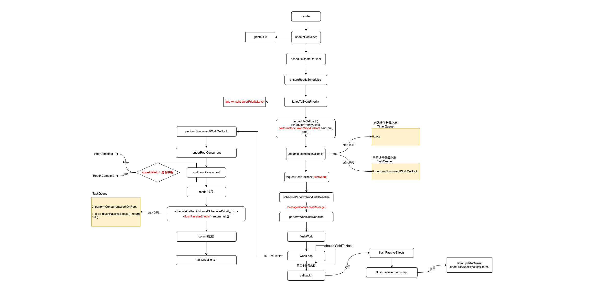

1. 当`fiber`节点上有事件触发状态改变等，就会构造对应的`update`任务，`update`任务都会有一个`lane`字段表示优先级；
2. 任务调度阶段，调度`update`任务的时候，会根据`lane`进行优先级判断，是否同步，最后如果是异步任务取最高优先级的`lane`映射到`Scheduler`优先级继续进行`task`的调度；
3. 任务执行阶段，祖先`fiber`节点除了自身`lane`字段以外还会有个`childLane`字段，这个在更新阶段很有用可以用于判断后续的节点是否需要更新还是可以到当前节点就结束；
4. 后续`render`过程遍历`fiber`树的时候，遇到`updateQueue`会将队列里的`update`任务一一执行；

```html
<html>
  <body>
    <script src="../../../build/oss-experimental/react/umd/react.development.js"></script>
    <script src="../../../build/oss-experimental/react-dom/umd/react-dom.development.js"></script>
    <script src="https://unpkg.com/babel-standalone@6/babel.js"></script>
    <div id="container"></div>
    <style>
      .component {
        border: 1px solid #ccc;
        padding: 10px;
        display: flex;
        margin: 10px;
        align-items: flex-start;
      }
      .component::before {
        content: attr(data-name);
        color: red;
      }
    </style>
    <script type="text/babel">
      function B({ children }) {
        console.log("render component B")
        return (
          <div className="component" data-name="B">
            {children}
          </div>
        )
      }
      function C({ children }) {
        console.log("render component C")
        const [count, setCount] = React.useState(0)
        const increment = React.useCallback(
          () => setCount((count) => count + 1),
          []
        )
        return (
          <div className="component" data-name="C">
            <button onClick={increment}>{count}</button>
            <D />
          </div>
        )
      }

      function D({ children }) {
        console.log("render component D")
        return (
          <div className="component" data-name="D">
            {children}
          </div>
        )
      }

      function E({ children }) {
        console.log("render component E")
        return (
          <div className="component" data-name="E">
            {children}
          </div>
        )
      }

      function F({ children }) {
        console.log("render component F")
        return (
          <div className="component" data-name="F">
            {children}
          </div>
        )
      }

      function App() {
        console.log("render component A")
        return (
          <div className="component" data-name="A">
            <B>
              <C></C>
            </B>
            <E>
              <F />
            </E>
          </div>
        )
      }

      const rootElement = document.getElementById("container")
      ReactDOM.createRoot(rootElement).render(<App />)
    </script>
  </body>
</html>
```

用一个调试用例再来完整的回顾一下整个流程

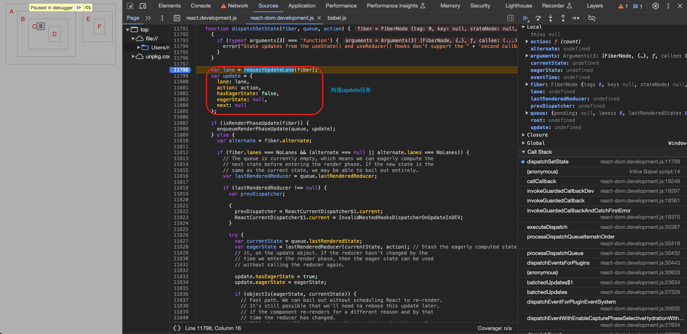
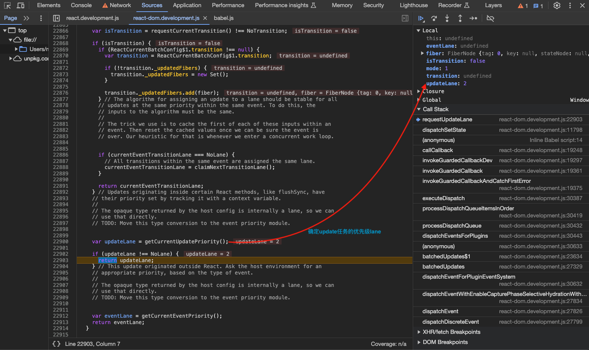
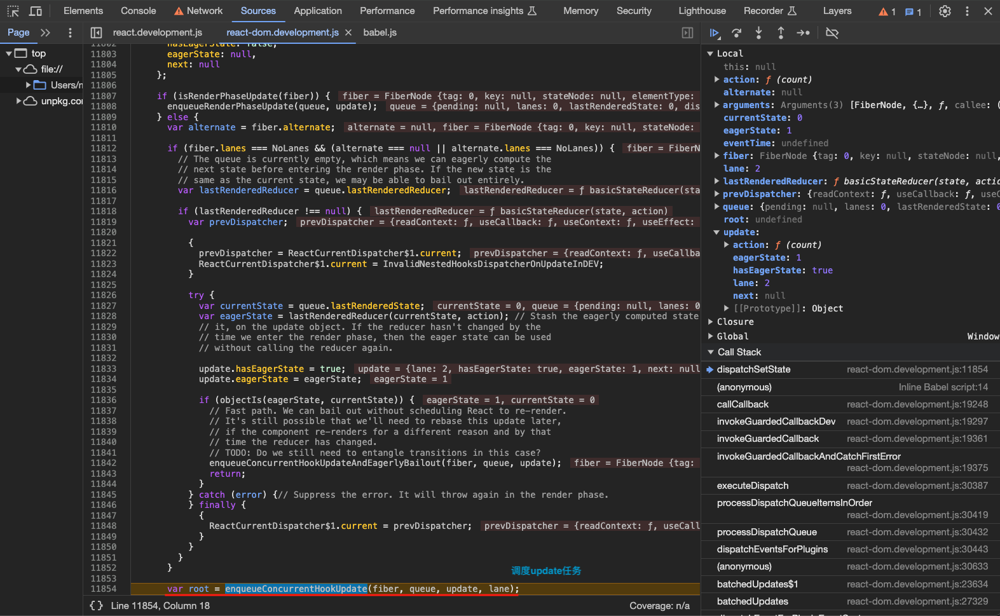
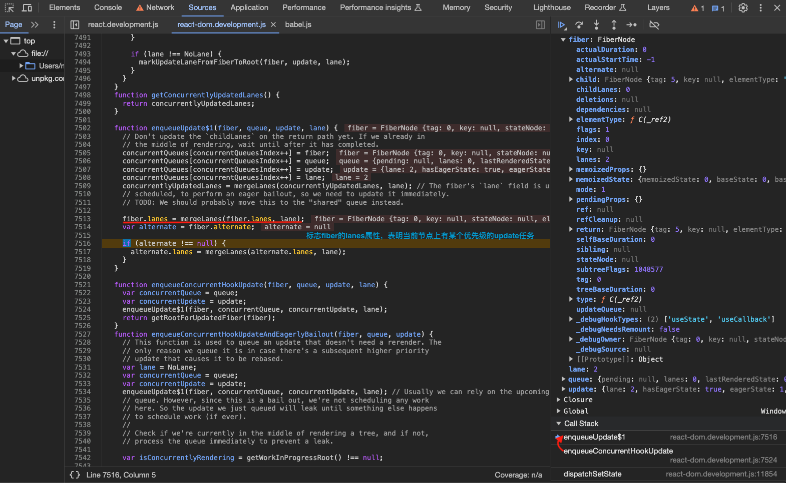
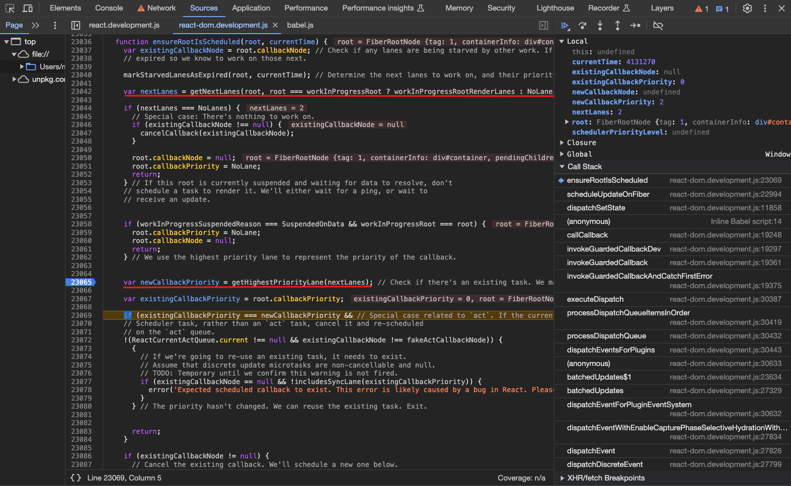
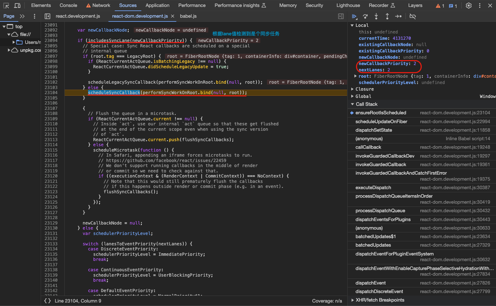
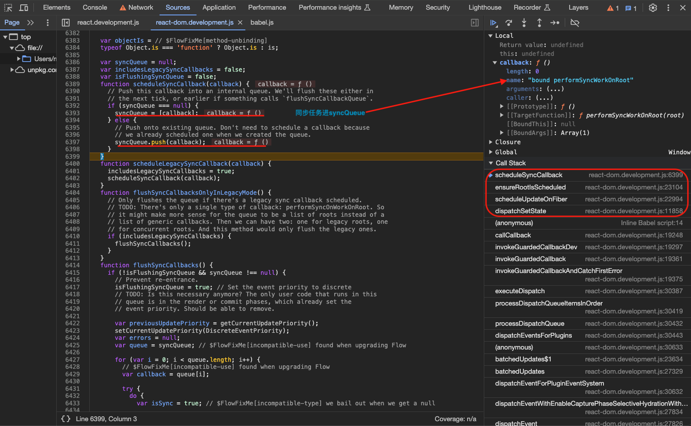
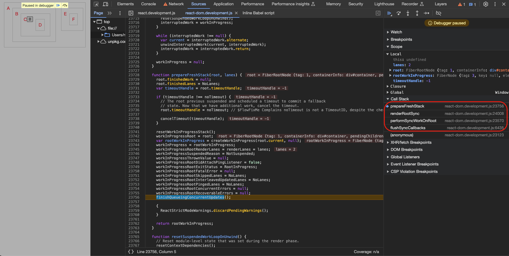
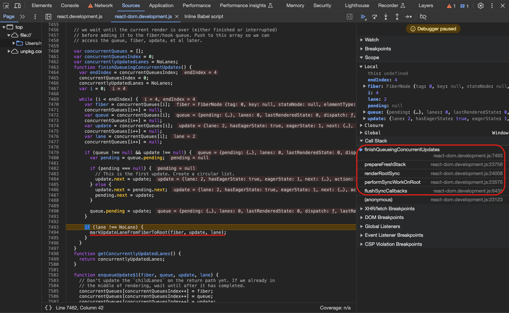
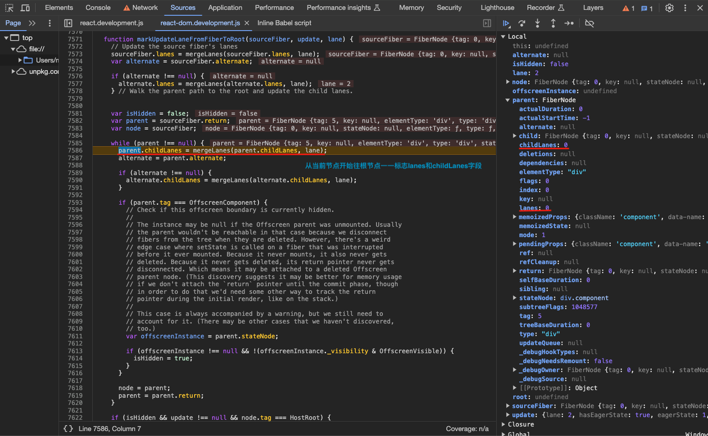
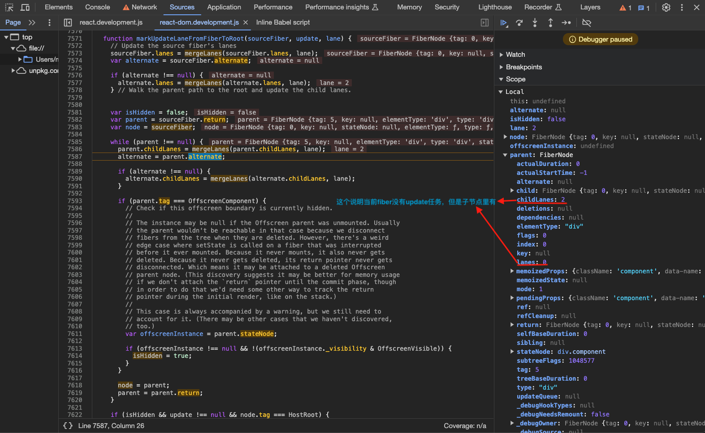
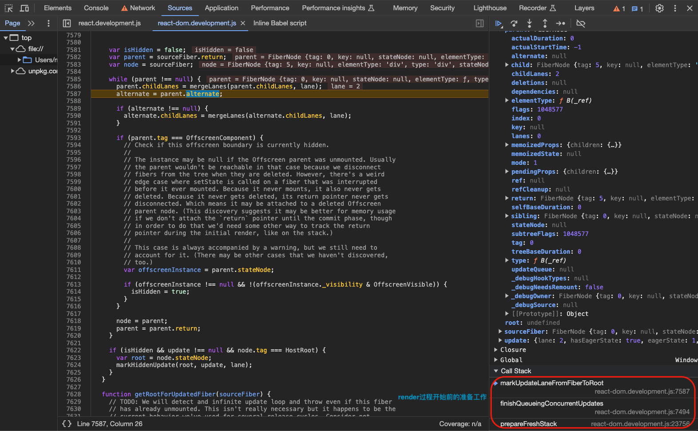
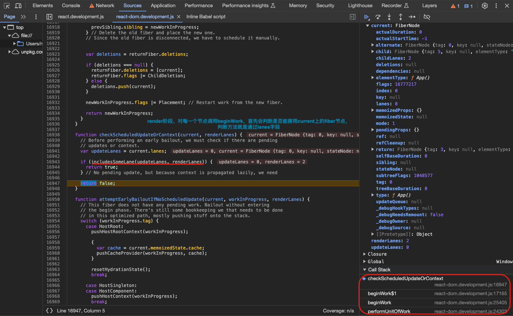
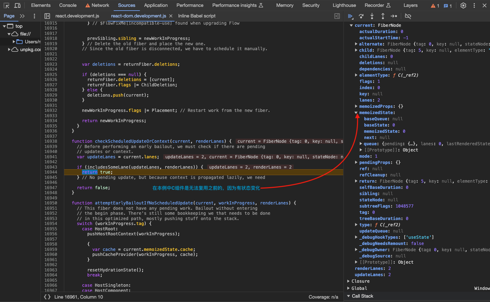
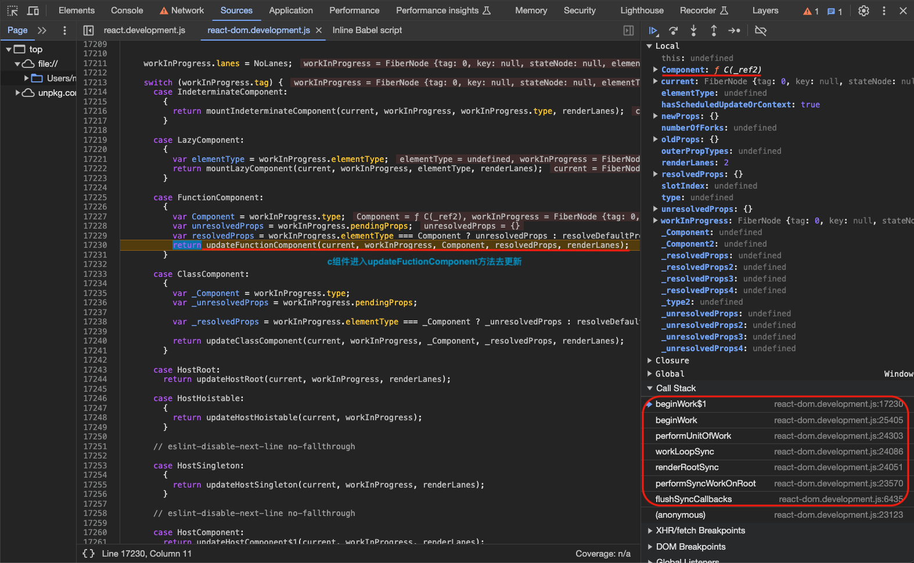

## 参考资料

[How React Scheduler works internally?](https://jser.dev/react/2022/03/16/how-react-scheduler-works/)

[What are Lanes in React source code?](https://jser.dev/react/2022/03/26/lanes-in-react)

[How React 18 Improves Application Performance](https://vercel.com/blog/how-react-18-improves-application-performance)
