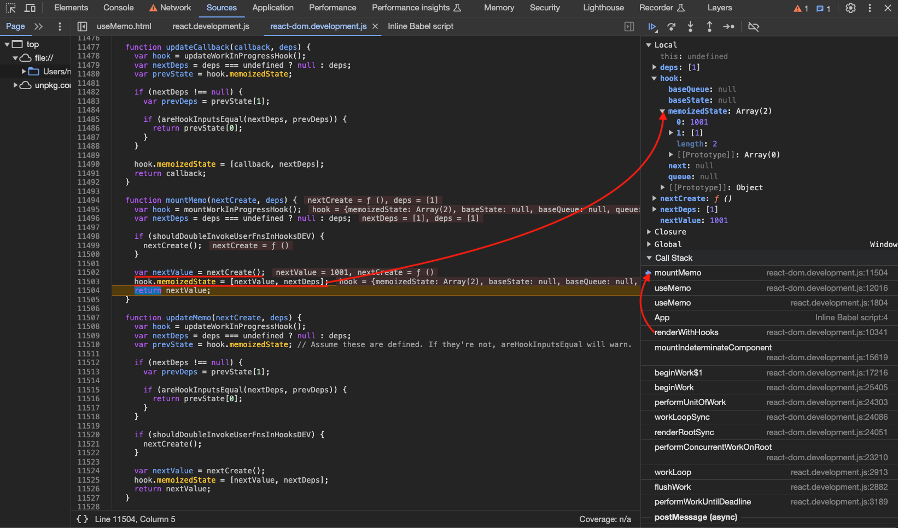
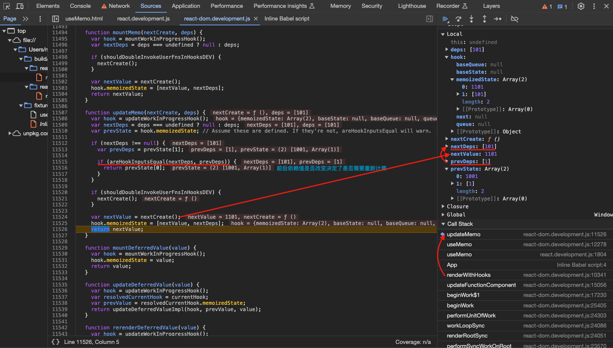
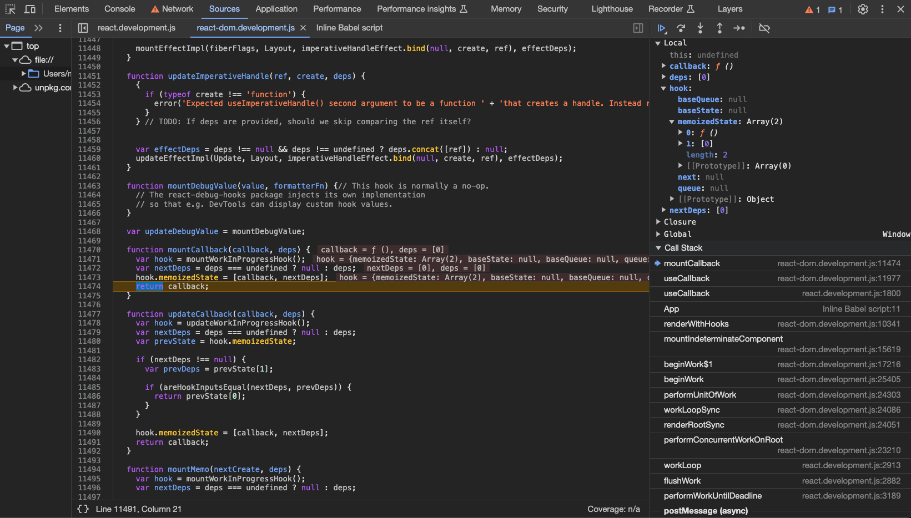
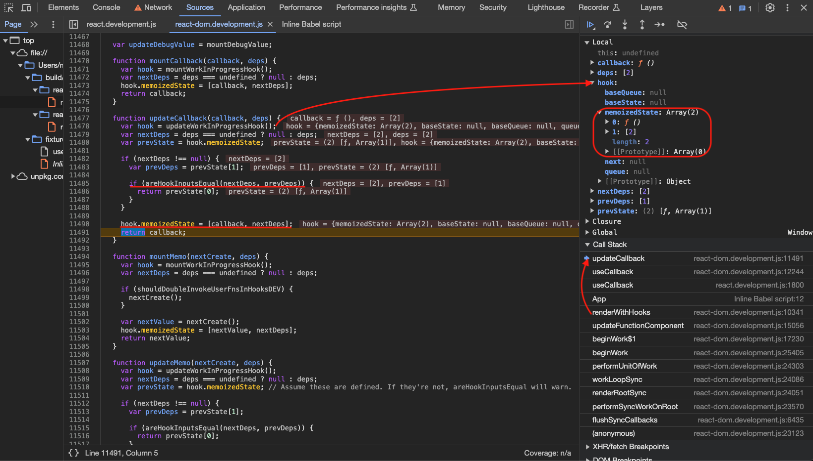
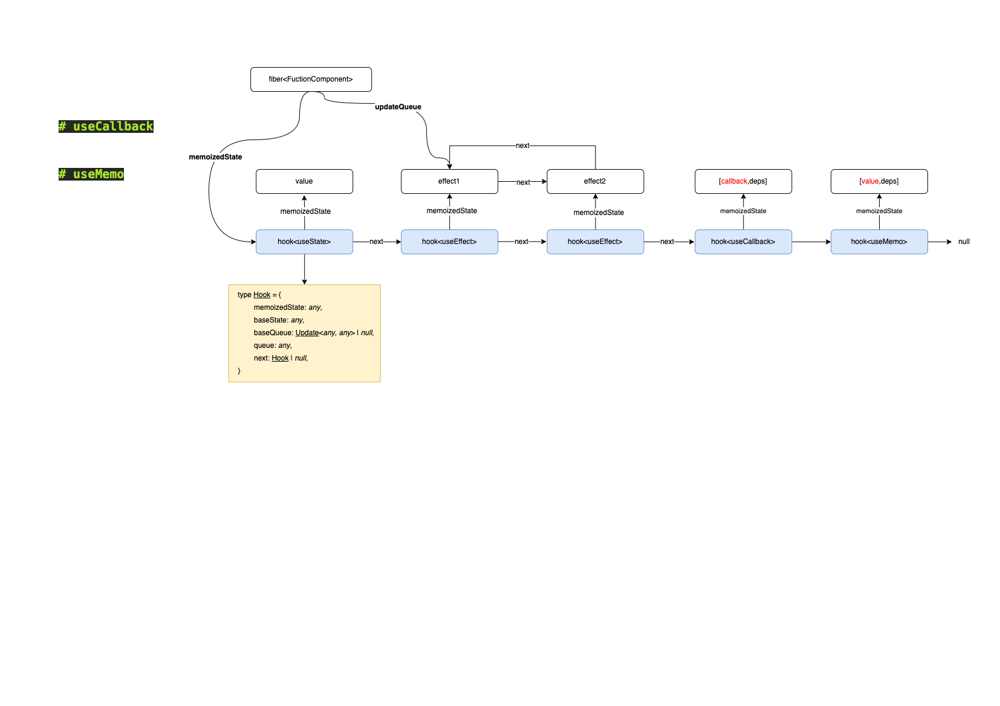

# 缓存hook

## useMemo

useMemo is a React Hook that lets you cache the result of a calculation between re-renders.

- useMemo is a Hook, so you can only call it at the top level of your component or your own Hooks. You can’t call it inside loops or conditions. If you need that, extract a new component and move the state into it.
- In Strict Mode, React will call your calculation function twice in order to help you find accidental impurities. This is development-only behavior and does not affect production. If your calculation function is pure (as it should be), this should not affect your logic. The result from one of the calls will be ignored.
- React will not throw away the cached value unless there is a specific reason to do that. For example, in development, React throws away the cache when you edit the file of your component. Both in development and in production, React will throw away the cache if your component suspends during the initial mount. In the future, React may add more features that take advantage of throwing away the cache—for example, if React adds built-in support for virtualized lists in the future, it would make sense to throw away the cache for items that scroll out of the virtualized table viewport. This should be fine if you rely on useMemo solely as a performance optimization. Otherwise, a state variable or a ref may be more appropriate.

调试用例如下：

```html
<html>
  <body>
    <script src="../../../build/oss-experimental/react/umd/react.development.js"></script>
    <script src="../../../build/oss-experimental/react-dom/umd/react-dom.development.js"></script>
    <script src="https://unpkg.com/babel-standalone@6/babel.js"></script>
    <div id="container"></div>
    <script type="text/babel">
      function App() {
        const [count,setCount] = React.useState(1)
        const number = React.useMemo(()=>{
          return count+1000
        },[count]) 

        const handleClick = ()=>{
          setCount(101)
        }

        return <div>
                  <h2>count is : {count},number is : {number}</h2>
                  <h1 onClick={handleClick}>Hello World!</h1>
                </div>
        }

      const root = ReactDOM.createRoot(document.getElementById('container'))
      root.render(<App />);
    </script>
  </body>
</html>
```

### useMemo 入口

`useMemo`方法入口，后续可能会调用方法有`mountMemo` | `updateMemo`：

```ts
// 【packages/react/src/ReactHooks.js】
export function useMemo<T>(
  create: () => T,
  deps: Array<mixed> | void | null,
): T {
  const dispatcher = resolveDispatcher();
  return dispatcher.useMemo(create, deps);
}

useMemo<T>(create: () => T, deps: Array<mixed> | void | null): T {
    currentHookNameInDev = 'useMemo';
    mountHookTypesDev();
    checkDepsAreArrayDev(deps);
    const prevDispatcher = ReactCurrentDispatcher.current;
    ReactCurrentDispatcher.current = InvalidNestedHooksDispatcherOnMountInDEV;
    try {
      // 【mountMemo】
      return mountMemo(create, deps);
    } finally {
      ReactCurrentDispatcher.current = prevDispatcher;
    }
},
useMemo<T>(create: () => T, deps: Array<mixed> | void | null): T {
    currentHookNameInDev = 'useMemo';
    updateHookTypesDev();
    const prevDispatcher = ReactCurrentDispatcher.current;
    ReactCurrentDispatcher.current =
    InvalidNestedHooksDispatcherOnUpdateInDEV;
    try {
      // 【updateMemo】
      return updateMemo(create, deps);
    } finally {
      ReactCurrentDispatcher.current = prevDispatcher;
    }
},
```

### `mountMemo`

`mountMemo` 方法首先调用 `mountWorkInProgressHook` 生成对应的 `hook` ，然后调用用户传入的方法得到缓存值 `nextValue` 并将缓存值 `nextValue` 和依赖对象`nextDeps` 以数组形式存入 `hook` 的 `memoizedState` 属性`[nextValue, nextDeps]`，最后返回缓存值 `nextValue`：

```ts
// 【packages/react-reconciler/src/ReactFiberHooks.js】
function mountMemo<T>(
  nextCreate: () => T,
  deps: Array<mixed> | void | null,
): T {
  const hook = mountWorkInProgressHook();
  const nextDeps = deps === undefined ? null : deps;
  if (shouldDoubleInvokeUserFnsInHooksDEV) {
    nextCreate();
  }
  const nextValue = nextCreate();
  // 【缓存值，缓存依赖数据构造成一个数组存在当前hook上】
  hook.memoizedState = [nextValue, nextDeps];
  return nextValue;
}
```




### `updateMemo`

`updateMemo` 方法首先调用 `updateWorkInProgressHook` 找到对应的 `hook`，然后对比依赖的 `deps` 是否相等，如果相等直接返回之前缓存的值，如果不相等就重新调用用户传入的函数计算：

```ts
// 【packages/react-reconciler/src/ReactFiberHooks.js】
function updateMemo<T>(
  nextCreate: () => T,
  deps: Array<mixed> | void | null,
): T {
  const hook = updateWorkInProgressHook();
  const nextDeps = deps === undefined ? null : deps;
  const prevState = hook.memoizedState;
  // Assume these are defined. If they're not, areHookInputsEqual will warn.
  // 【依赖值前后是否相同，相同直接返回原来存储的计算值】
  if (nextDeps !== null) {
    const prevDeps: Array<mixed> | null = prevState[1];
    if (areHookInputsEqual(nextDeps, prevDeps)) {
      return prevState[0];
    }
  }
  if (shouldDoubleInvokeUserFnsInHooksDEV) {
    nextCreate();
  }
  // 【不相同重新计算，然后返回新值】
  const nextValue = nextCreate();
  hook.memoizedState = [nextValue, nextDeps];
  return nextValue;
}

function areHookInputsEqual(
  nextDeps: Array<mixed>,
  prevDeps: Array<mixed> | null,
): boolean {
  // 【省略代码...】
  // 【循环遍历deps用Object.is对比新旧dep是否相同】
  // $FlowFixMe[incompatible-use] found when upgrading Flow
  for (let i = 0; i < prevDeps.length && i < nextDeps.length; i++) {
    // $FlowFixMe[incompatible-use] found when upgrading Flow
    if (is(nextDeps[i], prevDeps[i])) {
      continue;
    }
    return false;
  }
  return true;
}
```



---

## useCallback

useCallback is a React Hook that lets you cache a function definition between re-renders.

- useCallback is a Hook, so you can only call it at the top level of your component or your own Hooks. You can’t call it inside loops or conditions. If you need that, extract a new component and move the state into it.
- React will not throw away the cached function unless there is a specific reason to do that. For example, in development, React throws away the cache when you edit the file of your component. Both in development and in production, React will throw away the cache if your component suspends during the initial mount. In the future, React may add more features that take advantage of throwing away the cache—for example, if React adds built-in support for virtualized lists in the future, it would make sense to throw away the cache for items that scroll out of the virtualized table viewport. This should match your expectations if you rely on useCallback as a performance optimization. Otherwise, a state variable or a ref may be more appropriate.

调试用例如下：

```html
<html>
  <body>
    <script src="../../../build/oss-experimental/react/umd/react.development.js"></script>
    <script src="../../../build/oss-experimental/react-dom/umd/react-dom.development.js"></script>
    <script src="https://unpkg.com/babel-standalone@6/babel.js"></script>
    <div id="container"></div>
    <script type="text/babel">
      function App() {
        const [count,setCount] = React.useState(1)
        const getInfo  = useCallback((sonName)=>{
          console.log(sonName)
        },[id])
        return <div>
                  <h1 onClick={() => setCount(count + 100)}>Hello World!</h1>
                  <h2>HOBO~{count}</h2>
                </div>
      }

      const root = ReactDOM.createRoot(document.getElementById('container'))
      root.render(<App />);
    </script>
  </body>
</html>
```

### useCallback 入口

`useCallback`方法入口，后续可能会调用方法有`mountCallback` | `updateCallback`：

```ts
// 【packages/react/src/ReactHooks.js】
export function useCallback<T>(
  callback: T,
  deps: Array<mixed> | void | null,
): T {
  const dispatcher = resolveDispatcher();
  return dispatcher.useCallback(callback, deps);
}
useCallback<T>(callback: T, deps: Array<mixed> | void | null): T {
    currentHookNameInDev = 'useCallback';
    mountHookTypesDev();
    checkDepsAreArrayDev(deps);
    return mountCallback(callback, deps);
},
useCallback<T>(callback: T, deps: Array<mixed> | void | null): T {
    currentHookNameInDev = 'useCallback';
    updateHookTypesDev();
    return updateCallback(callback, deps);
},
```

### `mountCallback`

`mountCallback` 方法首先调用 `mountWorkInProgressHook` 生成对应的 `hook` ，然后将缓存内容 `callback` 和依赖对象 `nextDeps` 以数组形式存入 `hook` 的 `memoizedState` 属性`[callback, nextDeps]`，最后返回缓存内容 `callback`函数：

```ts
// 【packages/react-reconciler/src/ReactFiberHooks.js】
function mountCallback<T>(callback: T, deps: Array<mixed> | void | null): T {
  const hook = mountWorkInProgressHook();
  const nextDeps = deps === undefined ? null : deps;
  // 【缓存函数，缓存依赖数据构造成一个数组存在当前hook上】
  hook.memoizedState = [callback, nextDeps];
  return callback;
}
```



### `updateCallback`

`updateCallback` 方法首先调用 `updateWorkInProgressHook` 找到对应的 `hook`，然后对比依赖的 `deps` 是否相等，如果相等直接返回之前缓存的内容，如果不相等就重新缓存用户传入的 `callback` 函数：

```ts
// 【packages/react-reconciler/src/ReactFiberHooks.js】
function updateCallback<T>(callback: T, deps: Array<mixed> | void | null): T {
  const hook = updateWorkInProgressHook();
  const nextDeps = deps === undefined ? null : deps;
  const prevState = hook.memoizedState;
  if (nextDeps !== null) {
    const prevDeps: Array<mixed> | null = prevState[1];
    if (areHookInputsEqual(nextDeps, prevDeps)) {
      return prevState[0];
    }
  }
  hook.memoizedState = [callback, nextDeps];
  return callback;
}
```



## 总结

1. `useMemo`和`useCallback`方法都会在`hook`的`memoizedState`属性上存储如下形式数据`[缓存内容，[依赖值1,依赖值2...]]`，不同在于`useMemo`缓存的是函数的返回值，而`useCallback`缓存的是函数本身；
2. `useMemo`和`useCallback`方法都会都会比较依赖值是否变化，如果有变化`useMemo`会重新执行函数然后返回函数执行结果而`useCallback`是直接返回缓存的函数本身；
3. `useMemo`和`useCallback`的使用场景通常可以配合`React.memo`，一旦我们用`useCallback`缓存了函数并传入子组件，只要依赖值没有变化，那就不会引起子组件的`rerender`；



## 参考资料

[useMemo](https://react.dev/reference/react/useMemo)

[useCallback](https://react.dev/reference/react/useCallback)
