# 状态管理 Hook

## useState

useState is a React Hook that lets you add a state variable to your component.

- The set function only updates the state variable for the next render. If you read the state variable after calling the set function, you will still get the old value that was on the screen before your call.

- If the new value you provide is identical to the current state, as determined by an Object.is comparison, React will skip re-rendering the component and its children. This is an optimization. Although in some cases React may still need to call your component before skipping the children, it shouldn’t affect your code.

- React batches state updates. It updates the screen after all the event handlers have run and have called their set functions. This prevents multiple re-renders during a single event. In the rare case that you need to force React to update the screen earlier, for example to access the DOM, you can use flushSync.

- Calling the set function during rendering is only allowed from within the currently rendering component. React will discard its output and immediately attempt to render it again with the new state. This pattern is rarely needed, but you can use it to store information from the previous renders. See an example below.

- In Strict Mode, React will call your updater function twice in order to help you find accidental impurities. This is development-only behavior and does not affect production. If your updater function is pure (as it should be), this should not affect the behavior. The result from one of the calls will be ignored.

调试用例如下：

```html
<html>
  <body>
    <script src="../../../build/oss-experimental/react/umd/react.development.js"></script>
    <script src="../../../build/oss-experimental/react-dom/umd/react-dom.development.js"></script>
    <script src="https://unpkg.com/babel-standalone@6/babel.js"></script>
    <div id="container"></div>
    <script type="text/babel">
      function App() {
        const [count, setCount] = React.useState(1)

        return (
          <div>
            <h1 onClick={() => setCount(count + 100)}>Hello World!</h1>
            <h2>HOBO~{count}</h2>
          </div>
        )
      }

      const root = ReactDOM.createRoot(document.getElementById("container"))
      root.render(<App />)
    </script>
  </body>
</html>
```

### useState 入口

`render`阶段在处理函数组件时调用`renderWithHooks`方法时会调用该函数组件，从而调用`useState`，然后可能会调用方法有`mountState` | `updateState` | `rerenderState`。首次挂载进入函数组件的`beginWork`过程时会调用`renderWithHooks`方法，此时会执行`useState`，从而进入`mountState`方法如下：

```ts
// 【packages/react/src/ReactHooks.js】
export function useState<S>(
  initialState: (() => S) | S,
): [S, Dispatch<BasicStateAction<S>>] {
  const dispatcher = resolveDispatcher();
  return dispatcher.useState(initialState);
}

useState<S>(
    initialState: (() => S) | S,
): [S, Dispatch<BasicStateAction<S>>] {
    currentHookNameInDev = 'useState';
    mountHookTypesDev();
    const prevDispatcher = ReactCurrentDispatcher.current;
    ReactCurrentDispatcher.current = InvalidNestedHooksDispatcherOnMountInDEV;
    try {
        return mountState(initialState);
    } finally {
        ReactCurrentDispatcher.current = prevDispatcher;
    }
}

useState<S>(
    initialState: (() => S) | S,
): [S, Dispatch<BasicStateAction<S>>] {
    currentHookNameInDev = 'useState';
    updateHookTypesDev();
    const prevDispatcher = ReactCurrentDispatcher.current;
    ReactCurrentDispatcher.current =
    InvalidNestedHooksDispatcherOnRerenderInDEV;
    try {
        return rerenderState(initialState);
    } finally {
        ReactCurrentDispatcher.current = prevDispatcher;
    }
}

useState<S>(
    initialState: (() => S) | S,
): [S, Dispatch<BasicStateAction<S>>] {
    currentHookNameInDev = 'useState';
    warnInvalidHookAccess();
    updateHookTypesDev();
    const prevDispatcher = ReactCurrentDispatcher.current;
    ReactCurrentDispatcher.current =
    InvalidNestedHooksDispatcherOnUpdateInDEV;
    try {
        return updateState(initialState);
    } finally {
        ReactCurrentDispatcher.current = prevDispatcher;
    }
}
```

### `mountState`

创建一个对应的 `hook` 并定义 `memoizedState` 、 `baseState` 、 `queue` 等属性，返回`[hook.memoizedState, dispatch]`， `dispatch` 就是返回给用户更新状态的方法：

1. 调用`mountWorkInProgressHook`方法创建一个`hook`实例并存储或者说串联到对应`fiber`的`memoizedState`属性 `hook list` 上；
2. 初始值如果用户传的是函数就执行获取，然后将初始值`initialState`存储到`hook`实例的`memoizedState`和`baseState`属性上；
3. 构造一个`UpdateQueue`实例挂载在`hook`的`queue`属性上；
4. 构造`dispatch`方法挂载在`hook.queue.dispatch`上，实质是调用的`React`提供的`dispatchSetState`方法，这个方法里除了计算最新的`state`值与旧值比较还会根据`state`值是否改变，如果改变了会构造`update`任务并调用`scheduleUpdateOnFiber`安排`performConcurrentWorkOnRoot`进`TaskQueue`任务队列；
5. 返回`[hook.memoizedState, dispatch]`；

```ts
// 【packages/react-reconciler/src/ReactFiberHooks.js】
function mountState<S>(
  initialState: (() => S) | S,
): [S, Dispatch<BasicStateAction<S>>] {
  // 【创建hook】
  const hook = mountWorkInProgressHook();
  //【用户传入的initialState如果是函数就执行得到初始值】
  if (typeof initialState === 'function') {
    // $FlowFixMe: Flow doesn't like mixed types
    initialState = initialState();
  }
  // 【hook的memoizedState/baseState设为initialState】
  hook.memoizedState = hook.baseState = initialState;
  // 【生成一个queue并挂到hook上】
  // 【hook上更新队列用于保存未来的状态更新。在设置状态时，状态值不会立即更新，这是因为不同的状态更新可能具有不同的优先级，所以不需要立即处理。因此，我们需要将更新存储起来，然后稍后根据具体优先级处理它们。】
  const queue: UpdateQueue<S, BasicStateAction<S>> = {
    pending: null,
    lanes: NoLanes,
    dispatch: null,
    lastRenderedReducer: basicStateReducer,
    lastRenderedState: (initialState: any),
  };
  hook.queue = queue;
  // 【dispatch用于更新状态的方法，实际调用了dispatchSetState，保存在hook.queue的dispatch属性上】
  const dispatch: Dispatch<BasicStateAction<S>> = (queue.dispatch =
    (dispatchSetState.bind(null, currentlyRenderingFiber, queue): any));
  // 【返回[hook.memoizedState, dispatch]，dispatch就是返回给用户用来更新状态的方法】
  return [hook.memoizedState, dispatch];
}

function basicStateReducer<S>(state: S, action: BasicStateAction<S>): S {
  // $FlowFixMe: Flow doesn't like mixed types
  return typeof action === 'function' ? action(state) : action;
}

function mountWorkInProgressHook(): Hook {
  const hook: Hook = {
    memoizedState: null,
    baseState: null,
    baseQueue: null,
    queue: null,
    next: null,
  };

  if (workInProgressHook === null) {
    // This is the first hook in the list
    currentlyRenderingFiber.memoizedState = workInProgressHook = hook;
  } else {
    // Append to the end of the list
    workInProgressHook = workInProgressHook.next = hook;
  }
  return workInProgressHook;
}
```


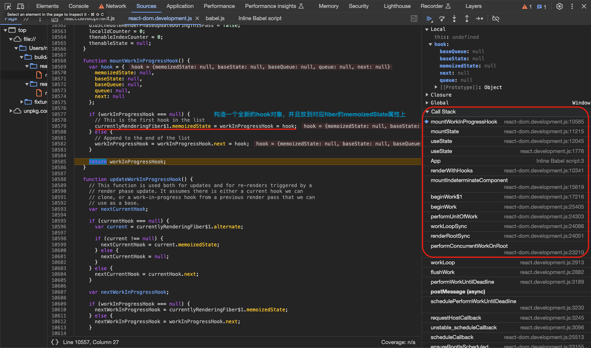

### `dispatchSetState`

```ts
const dispatch: Dispatch<BasicStateAction<S>> = (queue.dispatch =
    (dispatchSetState.bind(null, currentlyRenderingFiber, queue): any));
```

`dispatchSetState`首先会构造一个`update`任务，然后可能有两种情况，一种是在 `render` 过程中产生的 `update`，那就会把当前`update`任务加入当前`hook`的`queue`的`pending` 队列，另外一种就是非 `render` 过程，那就会先趁空隙计算出当前状态值，和之前的状态值对比，如果没有变化那也就不需要更新，如果有变化去调度更新。主要工作就是构造`update`任务并调度 `rerender`，并根据情况是否提前计算新值。

1. `render`过程中产生的进入`enqueueRenderPhaseUpdate`，`update`任务直接加入对应`hook`的`queue`的`pending`队列；
2. 非`render`过程中产生的会提前计算新值，根据新旧值是否相同会提前跳出这一轮更新或者进行接下来的步骤；
3. 非`render`过程中产生的接下来进入`enqueueConcurrentHookUpdate`，会将`fiber`、`queue`、`update`、`lane`加入`concurrentQueues`等待后续合适时机的处理，最后由`scheduleUpdateOnFiber`安排任务执行时机。根据优先级等一系列判断，本例中会进入`ScheduleSyncCallback(performSyncWorkOnRoot.bind(null, root))`，直接进行同步任务的执行；
4. 非`render`过程中产生的状态变化会提前计算新值赋给`update.eagerState`，提前算好后续直接从这个属性获取新增，新旧值如果相同就会跳过`scheduleUpdateOnFiber`也就不会引起`re-render`，如果是连续多次状态变化则仅计算第一次；
5. 每次`dispatchSetState`构造的`update`任务优先级不一定相同，所以`hook`还会有一个`baseQueue`存储着优先级较低的还未执行的`update`队列，直到下一轮`render`过程可能会和其他`update`任务串联起来再去执行；

```ts
// 【packages/react-reconciler/src/ReactFiberHooks.js】
function dispatchSetState<S, A>(
  fiber: Fiber,//【currentlyRenderingFiber】
  queue: UpdateQueue<S, A>,//【queue】
  action: A,
): void {
  // 【省略代码...】
  // 【获取优先级】
  const lane = requestUpdateLane(fiber);

  // 【创建一个update任务】
  // 【action是值的话就是确定值】
  // 【action是函数的话还未计算】
  const update: Update<S, A> = {
    lane,
    action,
    hasEagerState: false,
    eagerState: null,
    next: (null: any),
  };

  // 【将 update 链接到更新队列中】
  if (isRenderPhaseUpdate(fiber)) {
    // 【-----render过程中的update直接加入当前hook.queue-----】
    enqueueRenderPhaseUpdate(queue, update);
  } else {
    // 【非render过程中】
    const alternate = fiber.alternate;
    // 【!!!!-----fiber.lanes有值表示已有更新事件，就会跳过此步-----!!!!】
    if (
      fiber.lanes === NoLanes &&
      (alternate === null || alternate.lanes === NoLanes)
    ) {
      // 【queue为空时，先把state计算好保存到eagerState中】
      // The queue is currently empty, which means we can eagerly compute the
      // next state before entering the render phase. If the new state is the
      // same as the current state, we may be able to bail out entirely.
      // 【useState的lastRenderedReducer就是basicStateReducer】
      const lastRenderedReducer = queue.lastRenderedReducer;
      if (lastRenderedReducer !== null) {
        let prevDispatcher;
        // 【省略代码...】
        try {
          // 【旧值】
          const currentState: S = (queue.lastRenderedState: any);
          // 【提前计算的新值】
          const eagerState = lastRenderedReducer(currentState, action);
          // Stash the eagerly computed state, and the reducer used to compute
          // it, on the update object. If the reducer hasn't changed by the
          // time we enter the render phase, then the eager state can be used
          // without calling the reducer again.
          update.hasEagerState = true;
          update.eagerState = eagerState;
          //【对比新旧state，如果相同无需更新，用Object.is比较】
          if (is(eagerState, currentState)) {
            // Fast path. We can bail out without scheduling React to re-render.
            // It's still possible that we'll need to rebase this update later,
            // if the component re-renders for a different reason and by that
            // time the reducer has changed.
            // TODO: Do we still need to entangle transitions in this case?
            enqueueConcurrentHookUpdateAndEagerlyBailout(fiber, queue, update);
            return;
          }
        } catch (error) {
          // Suppress the error. It will throw again in the render phase.
        } finally {
          if (__DEV__) {
            ReactCurrentDispatcher.current = prevDispatcher;
          }
        }
      }
    }

    // 【-----非render过程中的update任务加入hook.queue循环链表，且给对应fiber标记lanes优先级-----】
    const root = enqueueConcurrentHookUpdate(fiber, queue, update, lane);
    // 【根据状态改变调用scheduleUpdateOnFiber调度update，继而走到beginWork/completeWork环节】
    if (root !== null) {
      const eventTime = requestEventTime();
      // 【安排调度更新任务】
      scheduleUpdateOnFiber(root, fiber, lane, eventTime);
      entangleTransitionUpdate(root, queue, lane);
    }
  }

  markUpdateInDevTools(fiber, lane, action);
}

function basicStateReducer<S>(state: S, action: BasicStateAction<S>): S {
  // $FlowFixMe: Flow doesn't like mixed types
  // 【是值的话直接返回值，是函数方法的话调用函数方法得到最新值】
  return typeof action === 'function' ? action(state) : action;
}

// Whether an update was scheduled at any point during the render phase. This
// does not get reset if we do another render pass; only when we're completely
// finished evaluating this component. This is an optimization so we know
// whether we need to clear render phase updates after a throw.
let didScheduleRenderPhaseUpdate: boolean = false;
// Where an update was scheduled only during the current render pass. This
// gets reset after each attempt.
// TODO: Maybe there's some way to consolidate this with
// `didScheduleRenderPhaseUpdate`. Or with `numberOfReRenders`.
let didScheduleRenderPhaseUpdateDuringThisPass: boolean = false;

// 【packages/react-reconciler/src/ReactFiberHooks.js】
// 【-----render过程中的update直接加入当前hook.queue-----】
function enqueueRenderPhaseUpdate<S, A>(
  queue: UpdateQueue<S, A>,
  update: Update<S, A>,
): void {
  // This is a render phase update. Stash it in a lazily-created map of
  // queue -> linked list of updates. After this render pass, we'll restart
  // and apply the stashed updates on top of the work-in-progress hook.
  didScheduleRenderPhaseUpdateDuringThisPass = didScheduleRenderPhaseUpdate =
    true;
  //【把当前这个update加入hook.queue的pending队列，update之间用next链接，并且是头尾衔接循环的】
  const pending = queue.pending;
  if (pending === null) {
    // This is the first update. Create a circular list.
    update.next = update;
  } else {
    update.next = pending.next;
    pending.next = update;
  }
  queue.pending = update;
}

// 【packages/react-reconciler/src/ReactFiberConcurrentUpdates.js】
// 【-----非render过程中的update加入concurrentQueues队列-----】
// 【concurrentQueues里的update任务会在prepareFreshStack/renderRootSync/renderRootConcurrent方法中取出】
export function enqueueConcurrentHookUpdate<S, A>(
  fiber: Fiber,
  queue: HookQueue<S, A>,
  update: HookUpdate<S, A>,
  lane: Lane,
): FiberRoot | null {
  const concurrentQueue: ConcurrentQueue = (queue: any);
  const concurrentUpdate: ConcurrentUpdate = (update: any);
  enqueueUpdate(fiber, concurrentQueue, concurrentUpdate, lane);
  return getRootForUpdatedFiber(fiber);
}

function enqueueUpdate(
  fiber: Fiber,
  queue: ConcurrentQueue | null,
  update: ConcurrentUpdate | null,
  lane: Lane,
) {
  // Don't update the `childLanes` on the return path yet. If we already in
  // the middle of rendering, wait until after it has completed.
  concurrentQueues[concurrentQueuesIndex++] = fiber;
  concurrentQueues[concurrentQueuesIndex++] = queue;
  concurrentQueues[concurrentQueuesIndex++] = update;
  concurrentQueues[concurrentQueuesIndex++] = lane;

  concurrentlyUpdatedLanes = mergeLanes(concurrentlyUpdatedLanes, lane);

  // The fiber's `lane` field is used in some places to check if any work is
  // scheduled, to perform an eager bailout, so we need to update it immediately.
  // TODO: We should probably move this to the "shared" queue instead.
  // 【给对应fiber标识lanes】
  fiber.lanes = mergeLanes(fiber.lanes, lane);
  const alternate = fiber.alternate;
  if (alternate !== null) {
    alternate.lanes = mergeLanes(alternate.lanes, lane);
  }
}

// 【在beginWork才会给fiber去掉lanes】
function beginWork(
  current: Fiber | null,
  workInProgress: Fiber,
  renderLanes: Lanes,
): Fiber | null {
  ...
  // Before entering the begin phase, clear pending update priority.
  // TODO: This assumes that we're about to evaluate the component and process
  // the update queue. However, there's an exception: SimpleMemoComponent
  // sometimes bails out later in the begin phase. This indicates that we should
  // move this assignment out of the common path and into each branch.
  workInProgress.lanes = NoLanes;
  ...
}
```

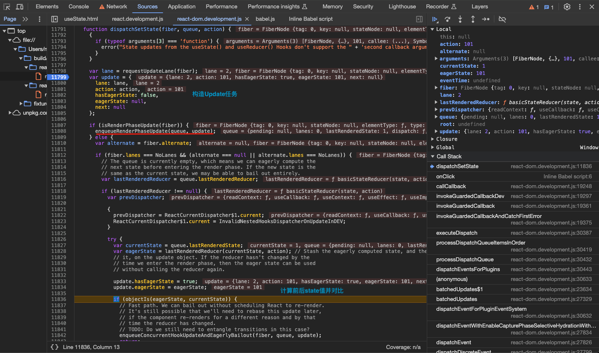


### `updateState` => `updateReducer`

`dispatchSetState`调用之后，也就是用户去改变`state`值，引起了`performSyncWorkOnRoot`更新 DOM 任务，所以会再一次进入组件的`beginWork`阶段，也就会调用`renderWithHooks`方法，从而调用`useState`方法，然后这一次是更新情况下就会调用`updateState`方法从而进入`updateReducer`方法。

`updateState` 实际调用的是 `updateReducer`，首先拿到当前对应 `hook` 和 `hook.queue`，然后把 `pending` 的 `queue` 加入到上一轮还没执行的 `update` 队列 `current.baseQueue` 中形成一个单向循环链表，然后遍历执行这个已经串起来的 `update` 队列。`update` 队列的每一项都根据其参数进行进行处理，获取最新的 `state` 然后更新到对应 `hook` 上。

1. 调用`updateWorkInProgressHook`方法更新`hook`实例，其实就是找到当前正在构造的`fiber`对应的`current fiber`上的`hook`状态去复用，调用了`dispatchSetState`之后`current fiber`上的`hook.queue.pending`会更新；
2. 处理`workInProgress hook`上的`queue`里保存的`pending`中的`update`任务，将其和`current hook`的`baseQueue`串起来形成一个单向循环链表，然后清空`workInProgress hook`上的`queue`里保存的`pending`中的`update`任务；
3. 如果有多次`setState`调用，`workInProgress hook`上的`queue`里保存的`pending`中的`update`任务里会有多个`update`任务；
4. 开始处理串起来后的两个`update`队列`baseQueue`，`update`任务链表会遍历每一个`update`任务，根据`update`任务的`lane`优先级决定本轮是否要跳过，优先级低的会留在`baseQueue`等待下一轮处理，获取`update`任务的`action`，根据是`useState`还是`useReducer`处理方式不同，最终会更新`current hook`的`baseState`属性，然后继续处理下一个`update`任务，循环终止条件是`update`为`null`或者`update`回到`first`；
5. (`update.action`为**值**)此处去提前计算新值的前提是`fiber`节点`lane`为`NoLanes`且`alternate === null || alternate.lanes === NoLanes`，表明没当前节点上没有其他更新事件会去提前计算新值，如果有更新事件就会跳过，`scheduleUpdateOnFiber`更新任务的调度如果是多次优先级相同的更新那就会合并为一次（// The priority hasn't changed. We can reuse the existing task. Exit.）。而后到 rerender 过程中执行 `updateReducer` 会遍历 `hook.queue.pending+hook.baseQueue` 上的每一个 `update` 获取最新值，有 `eagerState` 的时候就获取 `eagerState`，没有的时候就执行 `action`，如果 `action` 是值则直接赋值，这也是为什么连续执行`setState(count + 1)`几次只会得到一个`+1`的效果；
6. (`update.action`为**函数**)，同样地，`scheduleUpdateOnFiber`更新任务的调度如果是多次优先级相同的更新那就会合并为一次，但是`action`为函数时，在`hook.queue.pending`中由于每一个`update`的`action`函数并不相同，所以在后续`updateReducer`方法中遍历 `update` 时就会依次依赖上一次的结果计算每一次的值，所以连续`setAge((prevAge) => prevAge + 1)`几次值会得到几次值累加的最终计算结果；
7. 更新当前`hook`的`memoizedState`、`baseState`、`baseQueue`、`queue.lastRenderedState`到最新状态；
8. 最后返回`[hook.memoizedState, dispatch]`；

```ts
// 【packages/react-reconciler/src/ReactFiberHooks.js】
function updateState<S>(
  initialState: (() => S) | S,
): [S, Dispatch<BasicStateAction<S>>] {
  // 【实际调用updateReducer，reducer用React提供的默认方法basicStateReducer】
  return updateReducer(basicStateReducer, (initialState: any));
}

function basicStateReducer<S>(state: S, action: BasicStateAction<S>): S {
  // $FlowFixMe: Flow doesn't like mixed types
  return typeof action === 'function' ? action(state) : action;
}

function updateReducer<S, I, A>(
  reducer: (S, A) => S,
  initialArg: I,
  init?: I => S,
): [S, Dispatch<A>] {
  const hook = updateWorkInProgressHook();
  const queue = hook.queue;

  if (queue === null) {
    throw new Error(
      'Should have a queue. This is likely a bug in React. Please file an issue.',
    );
  }
  // 【如果是setState调用的，reducer就是basicStateReducer】
  queue.lastRenderedReducer = reducer;

  const current: Hook = (currentHook: any);

  // 【当前currentFiber上的update队列】
  // The last rebase update that is NOT part of the base state.
  let baseQueue = current.baseQueue;

  // The last pending update that hasn't been processed yet.
  // 【当前workInProgressFiber上还没处理的pending中的update队列】
  // 【pendingQueue串接到baseQueue中，还是形成一个单向循环链表】
  const pendingQueue = queue.pending;
  if (pendingQueue !== null) {
    // We have new updates that haven't been processed yet.
    // We'll add them to the base queue.
    // 【baseQueue上有内容就串上去】
    if (baseQueue !== null) {
      // Merge the pending queue and the base queue.
      const baseFirst = baseQueue.next;
      const pendingFirst = pendingQueue.next;
      baseQueue.next = pendingFirst;
      pendingQueue.next = baseFirst;
    }
    // 【省略代码...】
    // 【baseQueue上没有内容把pendingQueue给currentFiber上的baseQueue，然后清空当前pending】
    current.baseQueue = baseQueue = pendingQueue;
    queue.pending = null;
  }

  // 【处理baseQueue中的内容，遍历每一个update并处理】
  if (baseQueue !== null) {
    // We have a queue to process.
    const first = baseQueue.next;
    let newState = current.baseState;

    let newBaseState = null;
    let newBaseQueueFirst = null;
    let newBaseQueueLast: Update<S, A> | null = null;
    let update = first;
    // 【遍历这个update循环链表判断条件： while (update !== null && update !== first)】
    do {
      // An extra OffscreenLane bit is added to updates that were made to
      // a hidden tree, so that we can distinguish them from updates that were
      // already there when the tree was hidden.
      const updateLane = removeLanes(update.lane, OffscreenLane);
      const isHiddenUpdate = updateLane !== update.lane;

      // Check if this update was made while the tree was hidden. If so, then
      // it's not a "base" update and we should disregard the extra base lanes
      // that were added to renderLanes when we entered the Offscreen tree.
      const shouldSkipUpdate = isHiddenUpdate
        ? !isSubsetOfLanes(getWorkInProgressRootRenderLanes(), updateLane)
        : !isSubsetOfLanes(renderLanes, updateLane);

      if (shouldSkipUpdate) {
        // 【跳过更新的情况，根据优先级判断是否要跳过这个update任务，被跳过的放新的baseQueue里】
        // Priority is insufficient. Skip this update. If this is the first
        // skipped update, the previous update/state is the new base
        // update/state.
        const clone: Update<S, A> = {
          lane: updateLane,
          action: update.action,
          hasEagerState: update.hasEagerState,
          eagerState: update.eagerState,
          next: (null: any),
        };
        if (newBaseQueueLast === null) {
          newBaseQueueFirst = newBaseQueueLast = clone;
          newBaseState = newState;
        } else {
          newBaseQueueLast = newBaseQueueLast.next = clone;
        }
        // Update the remaining priority in the queue.
        // TODO: Don't need to accumulate this. Instead, we can remove
        // renderLanes from the original lanes.
        currentlyRenderingFiber.lanes = mergeLanes(
          currentlyRenderingFiber.lanes,
          updateLane,
        );
        markSkippedUpdateLanes(updateLane);
      } else {
        // 【不跳过更新的情况，处理这个update任务】
        // This update does have sufficient priority.

        if (newBaseQueueLast !== null) {
          const clone: Update<S, A> = {
            // This update is going to be committed so we never want uncommit
            // it. Using NoLane works because 0 is a subset of all bitmasks, so
            // this will never be skipped by the check above.
            lane: NoLane,
            action: update.action,
            hasEagerState: update.hasEagerState,
            eagerState: update.eagerState,
            next: (null: any),
          };
          newBaseQueueLast = newBaseQueueLast.next = clone;
        }

        // 【调用action】
        // Process this update.
        const action = update.action;
        if (shouldDoubleInvokeUserFnsInHooksDEV) {
          reducer(newState, action);
        }
        // 【如果是已经算过值的，直接用，如果还没就计算】
        if (update.hasEagerState) {
          // If this update is a state update (not a reducer) and was processed eagerly,
          // we can use the eagerly computed state
          newState = ((update.eagerState: any): S);
        } else {
          // 【action是值的话，每次set调用后的值已经计算好】
          // 【action是函数，会把上一轮的state传入后计算】
          // 【导致连续多次调用setState结果并不相同，是值的话分别计算，是函数的话依赖上一次的值计算】
          newState = reducer(newState, action);
        }
      }
      update = update.next;
    } while (update !== null && update !== first);

    if (newBaseQueueLast === null) {
      newBaseState = newState;
    } else {
      newBaseQueueLast.next = (newBaseQueueFirst: any);
    }

    // Mark that the fiber performed work, but only if the new state is
    // different from the current state.
    // 【新值旧值相同，标志节点为已更新也就是不需要更新】
    if (!is(newState, hook.memoizedState)) {
      markWorkInProgressReceivedUpdate();
    }

    // 【更新当前hook上的state和queue相关】
    hook.memoizedState = newState;
    hook.baseState = newBaseState;
    hook.baseQueue = newBaseQueueLast;

    queue.lastRenderedState = newState;
  }

  if (baseQueue === null) {
    // `queue.lanes` is used for entangling transitions. We can set it back to
    // zero once the queue is empty.
    queue.lanes = NoLanes;
  }

  const dispatch: Dispatch<A> = (queue.dispatch: any);
  return [hook.memoizedState, dispatch];
}

function updateWorkInProgressHook(): Hook {
  // This function is used both for updates and for re-renders triggered by a
  // render phase update. It assumes there is either a current hook we can
  // clone, or a work-in-progress hook from a previous render pass that we can
  // use as a base.
  let nextCurrentHook: null | Hook;
  if (currentHook === null) {
    const current = currentlyRenderingFiber.alternate;
    if (current !== null) {
      nextCurrentHook = current.memoizedState;
    } else {
      nextCurrentHook = null;
    }
  } else {
    nextCurrentHook = currentHook.next;
  }

  let nextWorkInProgressHook: null | Hook;
  if (workInProgressHook === null) {
    nextWorkInProgressHook = currentlyRenderingFiber.memoizedState;
  } else {
    nextWorkInProgressHook = workInProgressHook.next;
  }

  if (nextWorkInProgressHook !== null) {
    // There's already a work-in-progress. Reuse it.
    workInProgressHook = nextWorkInProgressHook;
    nextWorkInProgressHook = workInProgressHook.next;

    currentHook = nextCurrentHook;
  } else {
    // Clone from the current hook.

    if (nextCurrentHook === null) {
      const currentFiber = currentlyRenderingFiber.alternate;
      if (currentFiber === null) {
        // This is the initial render. This branch is reached when the component
        // suspends, resumes, then renders an additional hook.
        // Should never be reached because we should switch to the mount dispatcher first.
        throw new Error(
          'Update hook called on initial render. This is likely a bug in React. Please file an issue.',
        );
      } else {
        // This is an update. We should always have a current hook.
        throw new Error('Rendered more hooks than during the previous render.');
      }
    }

    currentHook = nextCurrentHook;

    const newHook: Hook = {
      memoizedState: currentHook.memoizedState,

      baseState: currentHook.baseState,
      baseQueue: currentHook.baseQueue,
      queue: currentHook.queue,

      next: null,
    };

    if (workInProgressHook === null) {
      // This is the first hook in the list.
      currentlyRenderingFiber.memoizedState = workInProgressHook = newHook;
    } else {
      // Append to the end of the list.
      workInProgressHook = workInProgressHook.next = newHook;
    }
  }
  return workInProgressHook;
}
```


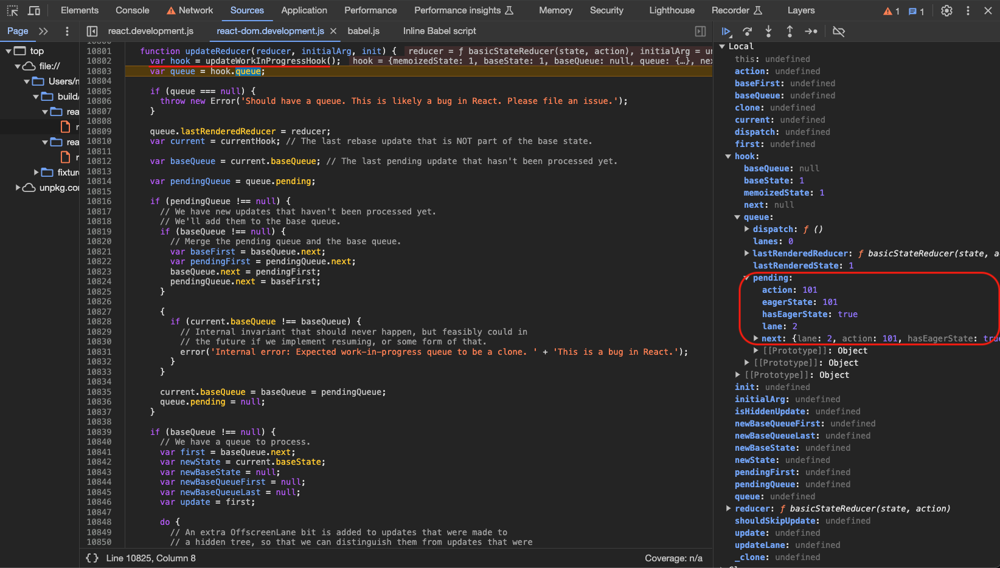

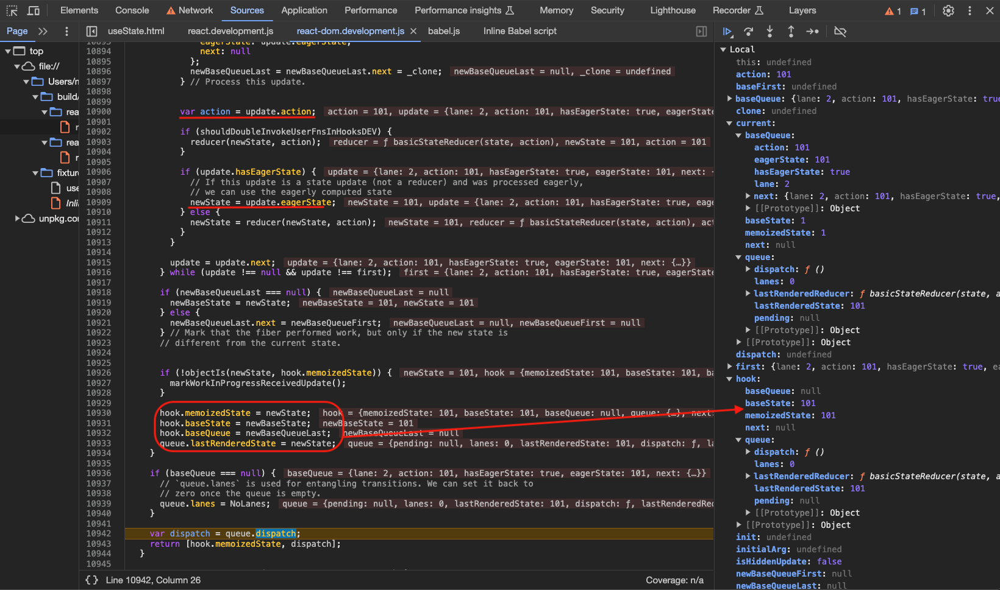

```ts
// 第一个setState因为fiber.lanes为0所以提前计算eagerState为101，然后创建update任务并将rerender任务入队，第二个setState因为fiber.lanes此时已经为1，所以rerender任务无需重复入队，这是因为两次rerender任务的优先级完全相同`existingCallbackPriority === newCallbackPriority`，所以第二次任务被直接忽略，同理第三次setState也一样。后续在updateReducer处理过程中，遍历三个update任务，由于三个action都是相同值，所以直接赋值，于是结果就是最后一个1+300=301
function handleClick() {
  setState(age + 100) // setState(1 + 100)
  setState(age + 200) // setState(1 + 200)
  setState(age + 300) // setState(1 + 300)
}
// 三次调用setState都会添加一个update任务在hook.queue.pending里（中间用interleaved过渡在enqueueConcurrentHookUpdate方法处理），然后在updateReducer方法中遍历三个update并执行action为函数，每次执行的入参都是上一次执行的结果，于是最终结果是1+100+200+300=601
function handleClick() {
  setState((a) => a + 100) // setState(1 => 101)
  setState((a) => a + 200) // setState(101 => 301)
  setState((a) => a + 300) // setState(301 => 601)
}
```

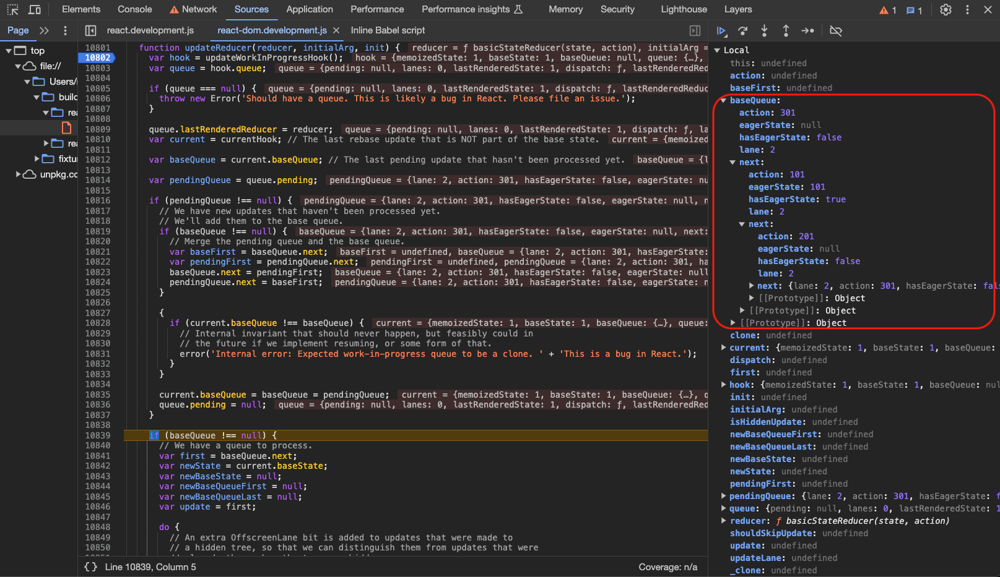
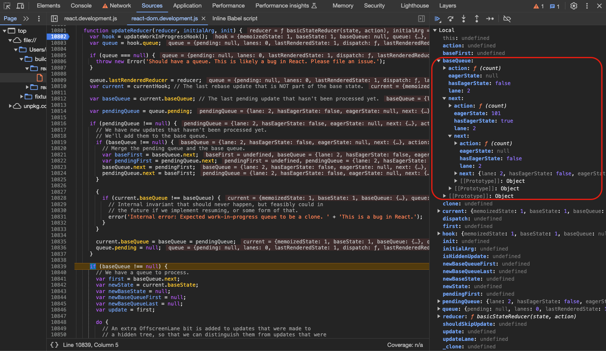

---

## useReducer

useReducer is a React Hook that lets you add a reducer to your component.

- useReducer is very similar to useState, but it lets you move the state update logic from event handlers into a single function outside of your component.

- The dispatch function only updates the state variable for the next render. If you read the state variable after calling the dispatch function, you will still get the old value that was on the screen before your call.

- If the new value you provide is identical to the current state, as determined by an Object.is comparison, React will skip re-rendering the component and its children. This is an optimization. React may still need to call your component before ignoring the result, but it shouldn’t affect your code.

- React batches state updates. It updates the screen after all the event handlers have run and have called their set functions. This prevents multiple re-renders during a single event. In the rare case that you need to force React to update the screen earlier, for example to access the DOM, you can use flushSync.

调试用例如下：

```html
<html>
  <body>
    <script src="../../../build/oss-experimental/react/umd/react.development.js"></script>
    <script src="../../../build/oss-experimental/react-dom/umd/react-dom.development.js"></script>
    <script src="https://unpkg.com/babel-standalone@6/babel.js"></script>
    <div id="container"></div>
    <script type="text/babel">
      function App() {
        const [state, dispatch] = React.useReducer(reducer, { age: 1 })

        function reducer(state, action) {
          if (action.type === "incremented_age") {
            return {
              age: state.age + 100,
            }
          }
          throw Error("Unknown action.")
        }

        return (
          <div>
            <h1
              onClick={() => {
                dispatch({ type: "incremented_age" })
              }}
            >
              Hello World!
            </h1>
            <h2>HOBO~{state.age}</h2>
          </div>
        )
      }

      const root = ReactDOM.createRoot(document.getElementById("container"))
      root.render(<App />)
    </script>
  </body>
</html>
```

### useReducer 入口

`render`阶段在处理函数组件时调用`renderWithHooks`方法时会调用该函数组件，从而调用`useReducer`，然后`useReducer`方法后续可能会调用方法有`mountReducer` | `rerenderReducer` | `updateReducer`：

```ts
// 【packages/react/src/ReactHooks.js】
export function useReducer<S, I, A>(
  reducer: (S, A) => S,
  initialArg: I,
  init?: I => S,
): [S, Dispatch<A>] {
  const dispatcher = resolveDispatcher();
  return dispatcher.useReducer(reducer, initialArg, init);
}

useReducer<S, I, A>(
  reducer: (S, A) => S,
  initialArg: I,
  init?: I => S,
): [S, Dispatch<A>] {
  currentHookNameInDev = 'useReducer';
  warnInvalidHookAccess();
  mountHookTypesDev();
  const prevDispatcher = ReactCurrentDispatcher.current;
  ReactCurrentDispatcher.current = InvalidNestedHooksDispatcherOnMountInDEV;
  try {
    return mountReducer(reducer, initialArg, init);
  } finally {
    ReactCurrentDispatcher.current = prevDispatcher;
  }
}

useReducer<S, I, A>(
  reducer: (S, A) => S,
  initialArg: I,
  init?: I => S,
): [S, Dispatch<A>] {
  currentHookNameInDev = 'useReducer';
  updateHookTypesDev();
  const prevDispatcher = ReactCurrentDispatcher.current;
  ReactCurrentDispatcher.current =
    InvalidNestedHooksDispatcherOnUpdateInDEV;
  try {
    return updateReducer(reducer, initialArg, init);
  } finally {
    ReactCurrentDispatcher.current = prevDispatcher;
  }
}

useReducer<S, I, A>(
  reducer: (S, A) => S,
  initialArg: I,
  init?: I => S,
): [S, Dispatch<A>] {
  currentHookNameInDev = 'useReducer';
  updateHookTypesDev();
  const prevDispatcher = ReactCurrentDispatcher.current;
  ReactCurrentDispatcher.current =
    InvalidNestedHooksDispatcherOnRerenderInDEV;
  try {
    return rerenderReducer(reducer, initialArg, init);
  } finally {
    ReactCurrentDispatcher.current = prevDispatcher;
  }
}
```

### `mountReducer`

创建一个对应的 `hook` 实例，如果有传 `init` 方法就调用 `init` 方法得到初始值，否者直接拿 `initialArg` 作为初始值，然后创建一个 `UpdateQueue` 挂到 `hook` 的 `queue` 属性上，最后返回 `[hook.memoizedState, dispatch]`， `dispatch` 就是返回给用户更新状态的方法，和 `useState` 非常类似。

1. 调用`mountWorkInProgressHook`方法创建一个`hook`实例并存储到对应`fiber`的`memoizedState`属性上；
2. 获取初始值`initialState`存储到`hook`的`memoizedState`和`baseState`属性上；
3. 构造一个`UpdateQueue`实例挂载在`hook`的`queue`属性上；
4. 构造`dispatch`方法挂载在`hook.queue.dispatch`上，实质是调用的`React`提供的`dispatchReducerAction`方法；
5. 返回`[hook.memoizedState, dispatch]`；

```ts
// 【packages/react-reconciler/src/ReactFiberHooks.js】
function mountReducer<S, I, A>(
  reducer: (S, A) => S,
  initialArg: I,
  init?: I => S,
): [S, Dispatch<A>] {
  // 【创建新hook】
  const hook = mountWorkInProgressHook();
  // 【获取初始值，可以是函数返回值或者用户直接传入的值，并放入hook的memoizedState和baseState属性】
  let initialState;
  if (init !== undefined) {
    initialState = init(initialArg);
  } else {
    initialState = ((initialArg: any): S);
  }
  hook.memoizedState = hook.baseState = initialState;
  // 【构造queue对象放入hook的queue属性】
  const queue: UpdateQueue<S, A> = {
    pending: null,
    lanes: NoLanes,
    dispatch: null,
    lastRenderedReducer: reducer,//【由用户传入的reducer】
    lastRenderedState: (initialState: any),
  };
  hook.queue = queue;
  // 【dispatchReducerAction绑定到当前对应fiber和hook.queue】
  const dispatch: Dispatch<A> = (queue.dispatch = (dispatchReducerAction.bind(
    null,
    currentlyRenderingFiber,
    queue,
  ): any));
  return [hook.memoizedState, dispatch];
}
```

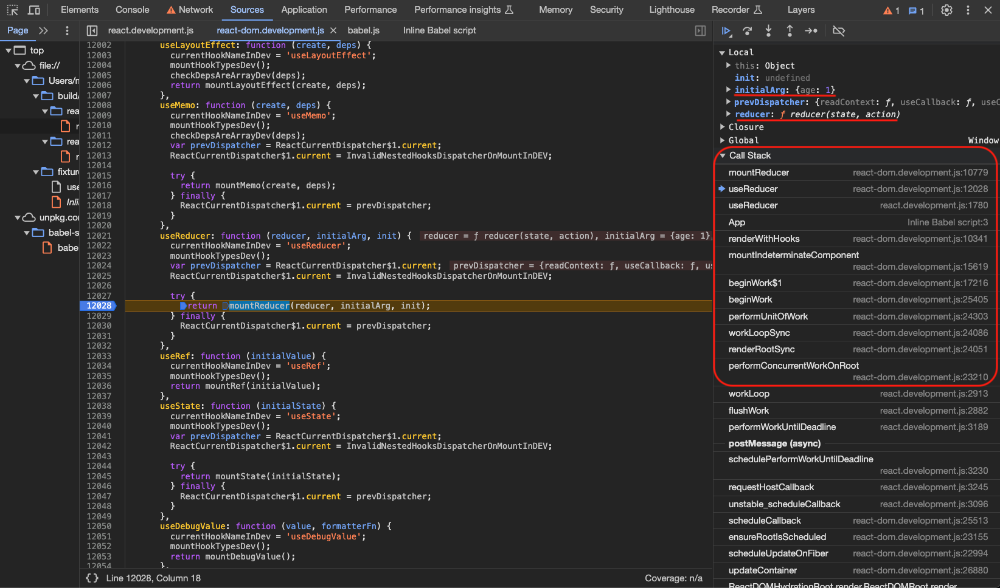
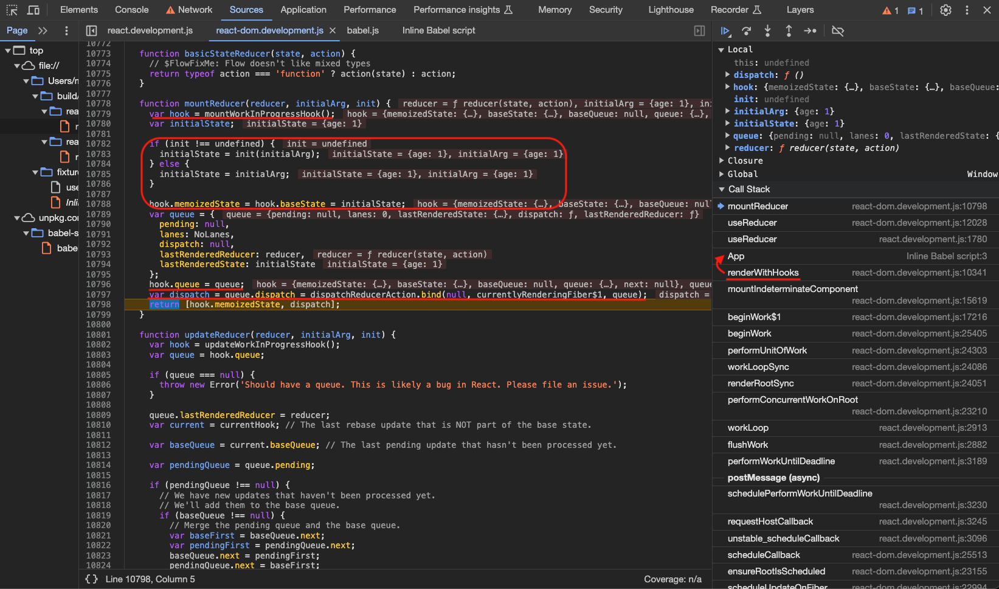

### `dispatchReducerAction`

```ts
const dispatch: Dispatch<A> = (queue.dispatch = (dispatchReducerAction.bind(
    null,
    currentlyRenderingFiber,
    queue,
  ): any));
```

`dispatchReducerAction`和`dispatchSetState`很类似，首先也会构造一个`update`任务并调度 `rerender`，然后也分为 `render` 过程中产生或者非 `render` 过程中产生的情况分别处理，不同点在于`dispatchReducerAction`不会提前计算最新状态值`eagerState`。

1. `render`过程中产生的进入`enqueueRenderPhaseUpdate`，`update`任务直接加入对应`hook`的`queue`的`pending`队列；
2. 非`render`过程中产生的进入`enqueueConcurrentHookUpdate`，会将`fiber`、`queue`、`update`、`lane`加入`concurrentQueues`等待后续合适时机的处理，最后由`scheduleUpdateOnFiber`安排`rerender`任务执行时机。根据优先级等一系列判断，本例中会进入`ScheduleSyncCallback(performSyncWorkOnRoot.bind(null, root))`，直接进行同步任务的执行；

```ts
// 【packages/react-reconciler/src/ReactFiberHooks.js】
function dispatchReducerAction<S, A>(
  fiber: Fiber,
  queue: UpdateQueue<S, A>,
  action: A,
): void {
  // 【省略代码...】

  const lane = requestUpdateLane(fiber);

  const update: Update<S, A> = {
    lane,
    action,
    hasEagerState: false,
    eagerState: null,
    next: (null: any),
  };

  if (isRenderPhaseUpdate(fiber)) {
    // 【render过程中产生】
    enqueueRenderPhaseUpdate(queue, update);
  } else {
    // 【非render过程中产生】
    const root = enqueueConcurrentHookUpdate(fiber, queue, update, lane);
    if (root !== null) {
      const eventTime = requestEventTime();
      // 【安排调度更新任务】
      scheduleUpdateOnFiber(root, fiber, lane, eventTime);
      entangleTransitionUpdate(root, queue, lane);
    }
  }

  markUpdateInDevTools(fiber, lane, action);
}
```

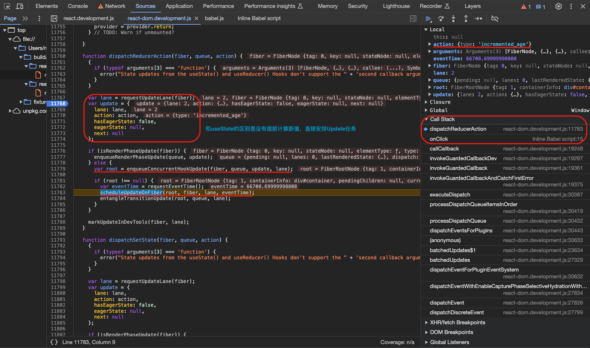


### `updateReducer`

`dispatchReducerAction`调用之后，也就是用户去改变`state`值，引起了`performSyncWorkOnRoot`更新 DOM 任务，所以会再一次进入组件的`beginWork`阶段，也就会调用`renderWithHooks`方法，从而调用`useReducer`方法，然后这一次是更新情况下就会进入`updateReducer`方法。

内容同 `useState` 原理中，用的是同样的方法 `updateReducer`。区别主要在于`updateReducer`的第一个参数`reducer`函数，在`useState`中使用的是`React`提供的默认函数`basicStateReducer`，而在`useReducer`中由用户把控传入。同样的连续多次调用`dispatch`每次都会把新值传入计算函数，所以多次计算都以上一次为基准得到最新值。

```ts
// 【packages/react-reconciler/src/ReactFiberHooks.js】
function updateReducer<S, I, A>(
  reducer: (S, A) => S,
  initialArg: I,
  init?: I => S,
): [S, Dispatch<A>] {
  const hook = updateWorkInProgressHook();
  const queue = hook.queue;

  if (queue === null) {
    throw new Error(
      'Should have a queue. This is likely a bug in React. Please file an issue.',
    );
  }
  // 【如果是useState调用的，reducer就是basicStateReducer】
  // 【如果是useReducer调用的，reducer就是用户传入的reducer】
  queue.lastRenderedReducer = reducer;

  const current: Hook = (currentHook: any);

  // 【当前currentFiber上的update队列】
  // The last rebase update that is NOT part of the base state.
  let baseQueue = current.baseQueue;

  // The last pending update that hasn't been processed yet.
  // 【当前workInProgressFiber上还没处理的pending中的update队列】
  // 【pendingQueue串接到baseQueue中，还是形成一个单向循环链表】
  const pendingQueue = queue.pending;
  if (pendingQueue !== null) {
    // We have new updates that haven't been processed yet.
    // We'll add them to the base queue.
    // 【baseQueue上有内容就串上去】
    if (baseQueue !== null) {
      // Merge the pending queue and the base queue.
      const baseFirst = baseQueue.next;
      const pendingFirst = pendingQueue.next;
      baseQueue.next = pendingFirst;
      pendingQueue.next = baseFirst;
    }
    // 【省略代码...】
    // 【baseQueue上没有内容把pendingQueue给currentFiber上的baseQueue，然后清空当前pending】
    current.baseQueue = baseQueue = pendingQueue;
    queue.pending = null;
  }

  // 【处理baseQueue中的内容，遍历每一个update并处理】
  if (baseQueue !== null) {
    // We have a queue to process.
    const first = baseQueue.next;
    let newState = current.baseState;

    let newBaseState = null;
    let newBaseQueueFirst = null;
    let newBaseQueueLast: Update<S, A> | null = null;
    let update = first;
    do {
      // An extra OffscreenLane bit is added to updates that were made to
      // a hidden tree, so that we can distinguish them from updates that were
      // already there when the tree was hidden.
      const updateLane = removeLanes(update.lane, OffscreenLane);
      const isHiddenUpdate = updateLane !== update.lane;

      // Check if this update was made while the tree was hidden. If so, then
      // it's not a "base" update and we should disregard the extra base lanes
      // that were added to renderLanes when we entered the Offscreen tree.
      const shouldSkipUpdate = isHiddenUpdate
        ? !isSubsetOfLanes(getWorkInProgressRootRenderLanes(), updateLane)
        : !isSubsetOfLanes(renderLanes, updateLane);

      if (shouldSkipUpdate) {
        // 【跳过更新的情况，根据优先级判断是否要跳过这个update任务】
        // Priority is insufficient. Skip this update. If this is the first
        // skipped update, the previous update/state is the new base
        // update/state.
        const clone: Update<S, A> = {
          lane: updateLane,
          action: update.action,
          hasEagerState: update.hasEagerState,
          eagerState: update.eagerState,
          next: (null: any),
        };
        if (newBaseQueueLast === null) {
          newBaseQueueFirst = newBaseQueueLast = clone;
          newBaseState = newState;
        } else {
          newBaseQueueLast = newBaseQueueLast.next = clone;
        }
        // Update the remaining priority in the queue.
        // TODO: Don't need to accumulate this. Instead, we can remove
        // renderLanes from the original lanes.
        currentlyRenderingFiber.lanes = mergeLanes(
          currentlyRenderingFiber.lanes,
          updateLane,
        );
        markSkippedUpdateLanes(updateLane);
      } else {
        // 【不跳过更新的情况】
        // This update does have sufficient priority.

        if (newBaseQueueLast !== null) {
          const clone: Update<S, A> = {
            // This update is going to be committed so we never want uncommit
            // it. Using NoLane works because 0 is a subset of all bitmasks, so
            // this will never be skipped by the check above.
            lane: NoLane,
            action: update.action,
            hasEagerState: update.hasEagerState,
            eagerState: update.eagerState,
            next: (null: any),
          };
          newBaseQueueLast = newBaseQueueLast.next = clone;
        }

        // 【调用action】
        // Process this update.
        const action = update.action;
        if (shouldDoubleInvokeUserFnsInHooksDEV) {
          reducer(newState, action);
        }
        // 【如果是已经算过值的，直接用，如果还没就计算】
        if (update.hasEagerState) {
          // If this update is a state update (not a reducer) and was processed eagerly,
          // we can use the eagerly computed state
          newState = ((update.eagerState: any): S);
        } else {
          // 【调用reducer计算最新值】
          newState = reducer(newState, action);
        }
      }
      update = update.next;
    } while (update !== null && update !== first);

    if (newBaseQueueLast === null) {
      newBaseState = newState;
    } else {
      newBaseQueueLast.next = (newBaseQueueFirst: any);
    }

    // Mark that the fiber performed work, but only if the new state is
    // different from the current state.
    if (!is(newState, hook.memoizedState)) {
      markWorkInProgressReceivedUpdate();
    }

    // 【更新当前hook上的state和queue相关】
    hook.memoizedState = newState;
    hook.baseState = newBaseState;
    hook.baseQueue = newBaseQueueLast;

    queue.lastRenderedState = newState;
  }

  if (baseQueue === null) {
    // `queue.lanes` is used for entangling transitions. We can set it back to
    // zero once the queue is empty.
    queue.lanes = NoLanes;
  }

  const dispatch: Dispatch<A> = (queue.dispatch: any);
  return [hook.memoizedState, dispatch];
}
```

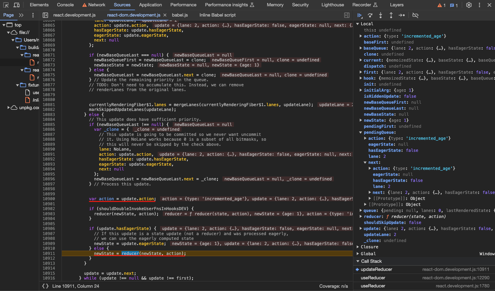
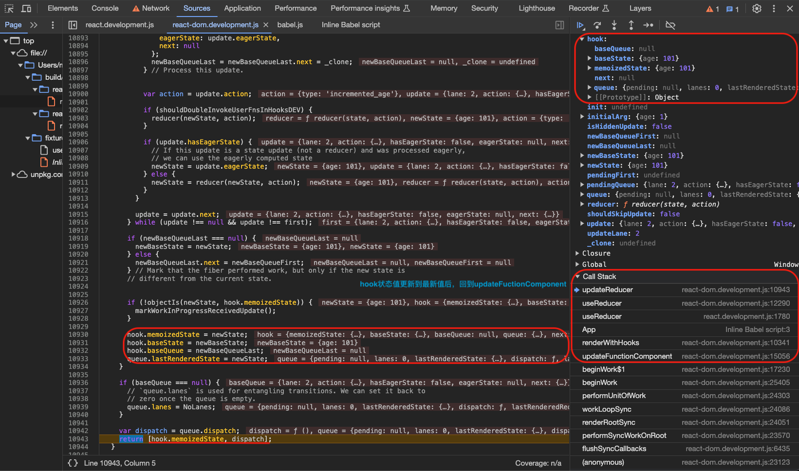

处理完当前`hook`的更新之后，最后会回到组件的`updateFuctionComponent`方法，此时`fiber`上的`memoizedState`也就是`hook`状态已经更新到最新状态并且返回了`nextChildren`（函数组件返回的 JSX 对应的`React-Element`），继而调用`reconcileChildren`继续处理子节点。可以看出来，`hook`是处理函数组件特殊的一环，为函数组件提供了更丰富的功能。


---

## useRef

useRef is a React Hook that lets you reference a value that’s not needed for rendering.

- You can mutate the ref.current property. Unlike state, it is mutable. However, if it holds an object that is used for rendering (for example, a piece of your state), then you shouldn’t mutate that object.
- When you change the ref.current property, React does not re-render your component. React is not aware of when you change it because a ref is a plain JavaScript object.
- Do not write or read ref.current during rendering, except for initialization. This makes your component’s behavior unpredictable.
- In Strict Mode, React will call your component function twice in order to help you find accidental impurities. This is development-only behavior and does not affect production. Each ref object will be created twice, but one of the versions will be discarded. If your component function is pure (as it should be), this should not affect the behavior.

调试用例如下：

```html
<html>
  <body>
    <script src="../../../build/oss-experimental/react/umd/react.development.js"></script>
    <script src="../../../build/oss-experimental/react-dom/umd/react-dom.development.js"></script>
    <script src="https://unpkg.com/babel-standalone@6/babel.js"></script>
    <div id="container"></div>
    <script type="text/babel">
      function App() {
        const ref = React.useRef(null)

        const handleClick = () => {
          ref.current = 1
          console.log("ref is:", ref.current)
        }

        return (
          <div>
            <h1 onClick={handleClick}>Hello World!</h1>
          </div>
        )
      }

      const root = ReactDOM.createRoot(document.getElementById("container"))
      root.render(<App />)
    </script>
  </body>
</html>
```

### useRef 入口

`useRef`方法入口，后续可能会调用方法有`mountRef` | `updateRef`：

```ts
// 【packages/react/src/ReactHooks.js】
export function useRef<T>(initialValue: T): {current: T} {
  const dispatcher = resolveDispatcher();
  return dispatcher.useRef(initialValue);
}
useRef<T>(initialValue: T): {current: T} {
  currentHookNameInDev = 'useRef';
  warnInvalidHookAccess();
  mountHookTypesDev();
  return mountRef(initialValue);
},
useRef<T>(initialValue: T): {current: T} {
  currentHookNameInDev = 'useRef';
  updateHookTypesDev();
  return updateRef(initialValue);
},
```

### `mountRef`

`mountRef`除了创建对应的 `hook` ，还会初始化一个对象包含一个 `current` 属性，用户传入的初始值作为这个 `current` 属性的值，然后把这个初始对象存入 `hook` 的 `memoizedState` ：

1. 创建`hook`对象存入`fiber`的`memoizedState`；
2. 创建一个对象`ref`有一个`current`属性存储初始值，将这个对象存在`hook`的`memoizedState`上；
3. 返回`ref`对象；

```ts
// 【packages/react-reconciler/src/ReactFiberHooks.js】
function mountRef<T>(initialValue: T): { current: T } {
  const hook = mountWorkInProgressHook()
  if (enableUseRefAccessWarning) {
    // 【省略代码...】
  } else {
    const ref = { current: initialValue }
    hook.memoizedState = ref
    return ref
  }
}
```

### `updateRef`

调用`updateWorkInProgressHook`更新`hook`，`useRef`通常用来存储不需要变化的内容、不会引起重新渲染的内容。

```ts
// 【packages/react-reconciler/src/ReactFiberHooks.js】
function updateRef<T>(initialValue: T): { current: T } {
  const hook = updateWorkInProgressHook()
  return hook.memoizedState
}
```

### useRef 存储 DOM 对象

使用`useRef`存储`DOM`对象是一种常见使用方法，其实在`commit`阶段`commitLayoutEffectOnFiber`方法中会调用一个叫`safelyAttachRef`的方法，实际使用`try/catch`去调用`commitAttachRef`方法里面会获取对应 DOM 元素为`ref`这个`hook`赋值。

1. `attach`在`commitLayoutEffectOnFiber`阶段，根据`flags & Ref`标识，获取到当前`fiber`节点对应的`DOM`赋值给`ref.current`；
2. `detach`在`commitMutationEffectsOnFiber`阶段，是`commitLayoutEffectOnFiber`之前的阶段，有些类似`useEffect`里先调用`effect.destory()`再调用`effect.create()`，清空再获取最新内容的意思；
3. 可以看到无论是`attach`还是`detach`，是否要进行操作的依据就是`fiber`上的`flags & Ref`判断条件，那这个 flags 在何时添加呢？有一个方法`markRef`是为`fiber`打上`ref`标识的，在`beginWork`阶段的`updateHostComponent`等方法中会被调用，根据`fiber`上是否有`ref`进行标识；

- `markRef`在`beginWork`阶段根据当前`workInProgress`节点是否存在`ref`属性等判断并标识`ref flag`

```ts
// 【packages/react-reconciler/src/ReactFiberBeginWork.js】
function markRef(current: Fiber | null, workInProgress: Fiber) {
  const ref = workInProgress.ref
  if (
    (current === null && ref !== null) ||
    (current !== null && current.ref !== ref)
  ) {
    // Schedule a Ref effect
    workInProgress.flags |= Ref
    workInProgress.flags |= RefStatic
  }
}
```

- `attach`在`commit`第三阶段`commitLayoutEffects`

```ts
// 【-----attach-----】
// 【packages/react-reconciler/src/ReactFiberCommitWork.js】
function commitLayoutEffectOnFiber(
  finishedRoot: FiberRoot,
  current: Fiber | null,
  finishedWork: Fiber,
  committedLanes: Lanes
): void {
  // When updating this function, also update reappearLayoutEffects, which does
  // most of the same things when an offscreen tree goes from hidden -> visible.
  const flags = finishedWork.flags
  switch (finishedWork.tag) {
    // 【省略代码...】
    case HostSingleton:
    case HostComponent: {
      // 【省略代码...】
      if (flags & Ref) {
        safelyAttachRef(finishedWork, finishedWork.return)
      }
      break
    }
    // 【省略代码...】
    case OffscreenComponent: {
      // 【省略代码...】
      if (flags & Ref) {
        const props: OffscreenProps = finishedWork.memoizedProps
        if (props.mode === "manual") {
          safelyAttachRef(finishedWork, finishedWork.return)
        } else {
          safelyDetachRef(finishedWork, finishedWork.return)
        }
      }
      break
    }
    default: {
      // 【省略代码...】
      break
    }
  }
}

function safelyAttachRef(current: Fiber, nearestMountedAncestor: Fiber | null) {
  try {
    commitAttachRef(current)
  } catch (error) {
    captureCommitPhaseError(current, nearestMountedAncestor, error)
  }
}

function commitAttachRef(finishedWork: Fiber) {
  const ref = finishedWork.ref
  if (ref !== null) {
    const instance = finishedWork.stateNode
    let instanceToUse
    switch (finishedWork.tag) {
      case HostHoistable:
      case HostSingleton:
      case HostComponent:
        // 【获取DOM】
        instanceToUse = getPublicInstance(instance)
        break
      default:
        instanceToUse = instance
    }
    // Moved outside to ensure DCE works with this flag
    if (enableScopeAPI && finishedWork.tag === ScopeComponent) {
      instanceToUse = instance
    }
    if (typeof ref === "function") {
      if (shouldProfile(finishedWork)) {
        try {
          startLayoutEffectTimer()
          finishedWork.refCleanup = ref(instanceToUse)
        } finally {
          recordLayoutEffectDuration(finishedWork)
        }
      } else {
        finishedWork.refCleanup = ref(instanceToUse)
      }
    } else {
      if (__DEV__) {
        if (!ref.hasOwnProperty("current")) {
          console.error(
            "Unexpected ref object provided for %s. " +
              "Use either a ref-setter function or React.createRef().",
            getComponentNameFromFiber(finishedWork)
          )
        }
      }

      // $FlowFixMe unable to narrow type to the non-function case
      // 【DOM赋值给ref这个hook】
      ref.current = instanceToUse
    }
  }
}
```

- `detach`在`commit`第二阶段`commitMutationEffects`

```ts
// 【-----detach-----】
// 【packages/react-reconciler/src/ReactFiberCommitWork.js】
// `recursivelyTraverseMutationEffects`/`commitMutationEffects` => `commitMutationEffectsOnFiber` => `safelyDetachRef`
function safelyDetachRef(current: Fiber, nearestMountedAncestor: Fiber | null) {
  const ref = current.ref
  const refCleanup = current.refCleanup

  if (ref !== null) {
    if (typeof refCleanup === "function") {
      try {
        if (shouldProfile(current)) {
          try {
            startLayoutEffectTimer()
            refCleanup()
          } finally {
            recordLayoutEffectDuration(current)
          }
        } else {
          refCleanup()
        }
      } catch (error) {
        captureCommitPhaseError(current, nearestMountedAncestor, error)
      } finally {
        // `refCleanup` has been called. Nullify all references to it to prevent double invocation.
        current.refCleanup = null
        const finishedWork = current.alternate
        if (finishedWork != null) {
          finishedWork.refCleanup = null
        }
      }
    } else if (typeof ref === "function") {
      let retVal
      try {
        if (shouldProfile(current)) {
          try {
            startLayoutEffectTimer()
            retVal = ref(null)
          } finally {
            recordLayoutEffectDuration(current)
          }
        } else {
          retVal = ref(null)
        }
      } catch (error) {
        captureCommitPhaseError(current, nearestMountedAncestor, error)
      }
      if (__DEV__) {
        if (typeof retVal === "function") {
          console.error(
            "Unexpected return value from a callback ref in %s. " +
              "A callback ref should not return a function.",
            getComponentNameFromFiber(current)
          )
        }
      }
    } else {
      // $FlowFixMe unable to narrow type to RefObject
      ref.current = null
    }
  }
}
```

## 总结

1. `fiber.memoizedState`上存储了`hook`链表，以`next`链接，每次都是按序执行；
2. `fiber.updateQueue`上存储了更新任务链表；
3. `hook.queue`上存储了状态更新链表，用于更新`hook`的状态值；
4. 用户触发状态值更改时，`useState`和`useReducer`分别会调用`dispatchSetState`/`dispatchReducerAction`，两者都会构造对应的`update`任务放入合适的任务队列，而`useState`可能会提前计算新值，`useReducer`则不会，然后都会进行更新任务的调度继而进入`render`、`commit`流程进行更新；
5. `useState`和`useReducer`在更新时都使用的`updateReducer`方法，区别在于`reducer`函数前者用的`React`提供的默认函数`basicStateReducer`后者由用户定义；
6. `useRef`如果用在获取`DOM`元素上那在`commit`第三阶段`commitLayoutEffectOnFiber`方法(`commitLayoutEffects`)中会调用一个叫`safelyAttachRef`的方法里面会获取对应 DOM 元素而后给对应节点的`ref`这个`hook`赋值。在`commit`第二阶段`commitMutationEffectsOnFiber`方法(`commitMutationEffects`)会调用`safelyDetachRef`去`detach`；

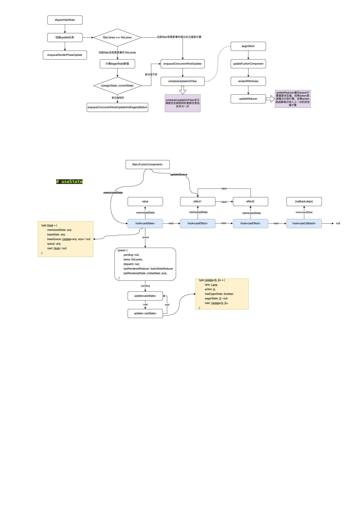

## 参考资料

[API Reference -> Hooks -> useState](https://react.dev/reference/react/useState)

[API Reference -> Hooks -> useReducer](https://react.dev/reference/react/useReducer)

[API Reference -> Hooks -> useRef](https://react.dev/reference/react/useRef)

[Comparing useState and useReducer](https://react.dev/learn/extracting-state-logic-into-a-reducer#comparing-usestate-and-usereducer)

[The React useRef Hook: Not Just for DOM Elements](https://dev.to/opensauced/the-react-useref-hook-not-just-for-html-elements-3cf3?context=digest)
