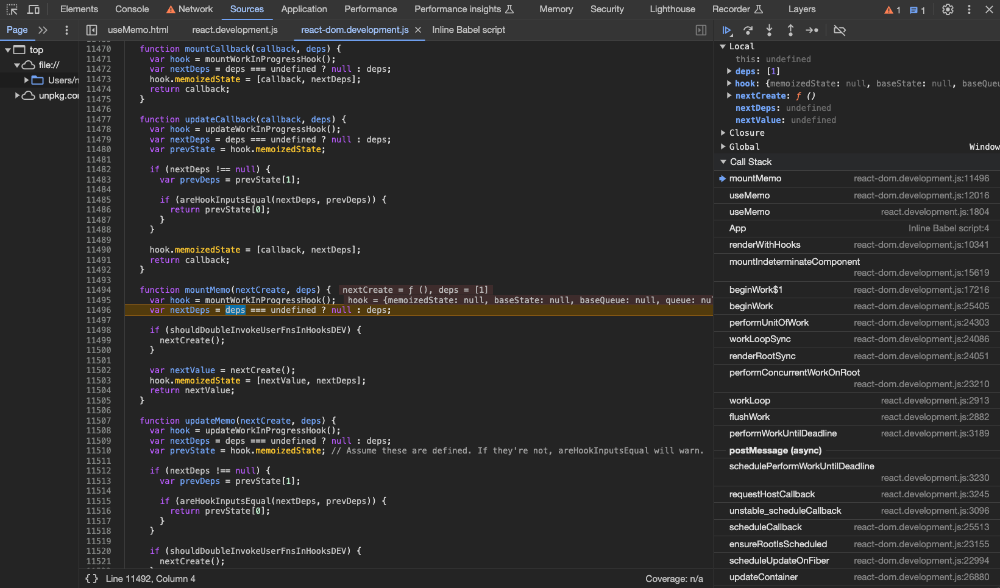
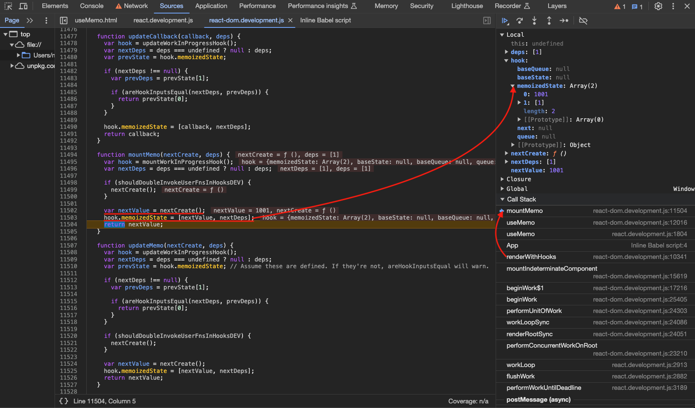
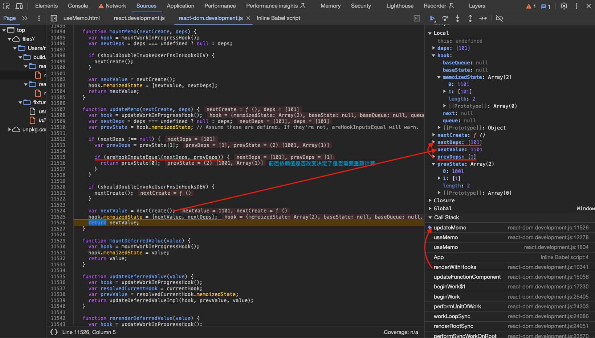
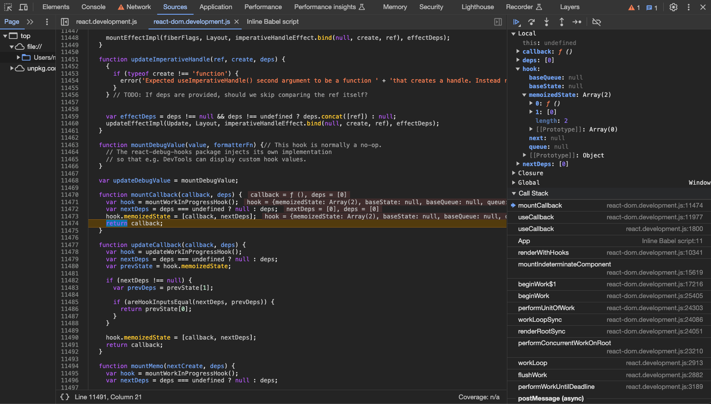
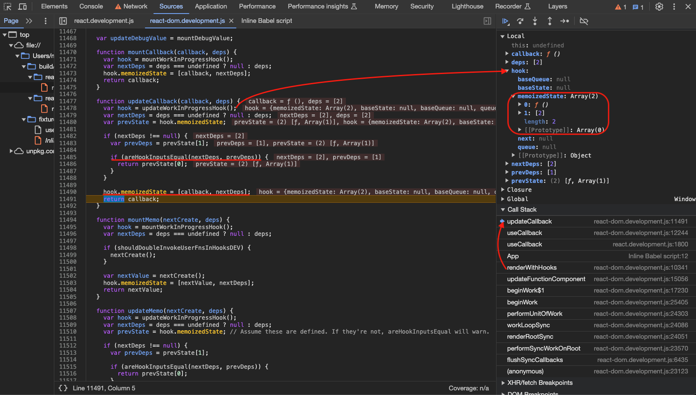
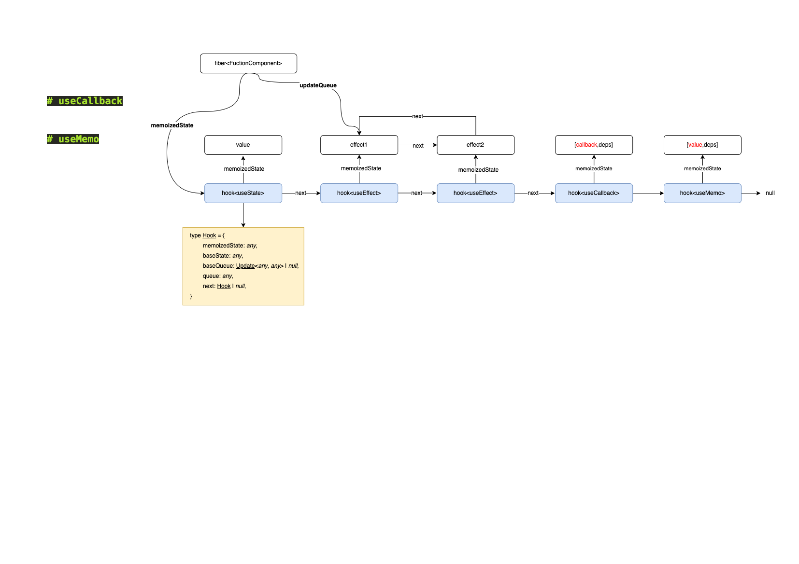

# 缓存 hook

## useMemo

`useMemo` is a React Hook that lets you cache the **result of a calculation** between re-renders.

- useMemo is a Hook, so you can only call it at the top level of your component or your own Hooks. You can’t call it inside loops or conditions. If you need that, extract a new component and move the state into it.
- In Strict Mode, React will call your calculation function twice in order to help you find accidental impurities. This is development-only behavior and does not affect production. If your calculation function is pure (as it should be), this should not affect your logic. The result from one of the calls will be ignored.
- React will not throw away the cached value unless there is a specific reason to do that. For example, in development, React throws away the cache when you edit the file of your component. Both in development and in production, React will throw away the cache if your component suspends during the initial mount. In the future, React may add more features that take advantage of throwing away the cache—for example, if React adds built-in support for virtualized lists in the future, it would make sense to throw away the cache for items that scroll out of the virtualized table viewport. This should be fine if you rely on useMemo solely as a performance optimization. Otherwise, a state variable or a ref may be more appropriate.

调试用例如下：

```html
<html>
  <body>
    <script src="../../../build/oss-experimental/react/umd/react.development.js"></script>
    <script src="../../../build/oss-experimental/react-dom/umd/react-dom.development.js"></script>
    <script src="https://unpkg.com/babel-standalone@6/babel.js"></script>
    <div id="container"></div>
    <script type="text/babel">
      function App() {
        const [count, setCount] = React.useState(1)
        const number = React.useMemo(() => {
          return count + 1000
        }, [count])

        const handleClick = () => {
          setCount(101)
        }

        return (
          <div>
            <h2>
              count is : {count},number is : {number}
            </h2>
            <h1 onClick={handleClick}>Hello World!</h1>
          </div>
        )
      }

      const root = ReactDOM.createRoot(document.getElementById("container"))
      root.render(<App />)
    </script>
  </body>
</html>
```

### useMemo 入口

`useMemo`方法入口，后续可能会调用方法有`mountMemo` | `updateMemo`：

```ts
// 【packages/react/src/ReactHooks.js】
export function useMemo<T>(
  create: () => T,
  deps: Array<mixed> | void | null,
): T {
  const dispatcher = resolveDispatcher();
  return dispatcher.useMemo(create, deps);
}

useMemo<T>(create: () => T, deps: Array<mixed> | void | null): T {
    currentHookNameInDev = 'useMemo';
    mountHookTypesDev();
    checkDepsAreArrayDev(deps);
    const prevDispatcher = ReactCurrentDispatcher.current;
    ReactCurrentDispatcher.current = InvalidNestedHooksDispatcherOnMountInDEV;
    try {
      // 【mountMemo】
      return mountMemo(create, deps);
    } finally {
      ReactCurrentDispatcher.current = prevDispatcher;
    }
},
useMemo<T>(create: () => T, deps: Array<mixed> | void | null): T {
    currentHookNameInDev = 'useMemo';
    updateHookTypesDev();
    const prevDispatcher = ReactCurrentDispatcher.current;
    ReactCurrentDispatcher.current =
    InvalidNestedHooksDispatcherOnUpdateInDEV;
    try {
      // 【updateMemo】
      return updateMemo(create, deps);
    } finally {
      ReactCurrentDispatcher.current = prevDispatcher;
    }
},
```

### `mountMemo`

`mountMemo` 方法首先调用 `mountWorkInProgressHook` 生成对应的 `hook` ，然后调用用户传入的方法得到缓存值 `nextValue` 并将缓存值 `nextValue` 和依赖对象`nextDeps` 以数组形式存入 `hook` 的 `memoizedState` 属性`[nextValue, nextDeps]`，最后返回缓存值 `nextValue`：

```ts
// 【packages/react-reconciler/src/ReactFiberHooks.js】
function mountMemo<T>(
  nextCreate: () => T,
  deps: Array<mixed> | void | null
): T {
  const hook = mountWorkInProgressHook()
  const nextDeps = deps === undefined ? null : deps
  if (shouldDoubleInvokeUserFnsInHooksDEV) {
    nextCreate()
  }
  const nextValue = nextCreate()
  // 【缓存值，缓存依赖数据构造成一个数组存在当前hook上】
  hook.memoizedState = [nextValue, nextDeps]
  return nextValue
}
```




### `updateMemo`

`updateMemo` 方法首先调用 `updateWorkInProgressHook` 找到对应的 `hook`，然后对比依赖的 `deps` 是否相等，如果相等直接返回之前缓存的值，如果不相等就重新调用用户传入的函数计算：

```ts
// 【packages/react-reconciler/src/ReactFiberHooks.js】
function updateMemo<T>(
  nextCreate: () => T,
  deps: Array<mixed> | void | null
): T {
  const hook = updateWorkInProgressHook()
  const nextDeps = deps === undefined ? null : deps
  const prevState = hook.memoizedState
  // Assume these are defined. If they're not, areHookInputsEqual will warn.
  // 【依赖值前后是否相同，相同直接返回原来存储的计算值】
  if (nextDeps !== null) {
    const prevDeps: Array<mixed> | null = prevState[1]
    if (areHookInputsEqual(nextDeps, prevDeps)) {
      return prevState[0]
    }
  }
  if (shouldDoubleInvokeUserFnsInHooksDEV) {
    nextCreate()
  }
  // 【不相同重新计算，然后返回新值】
  const nextValue = nextCreate()
  hook.memoizedState = [nextValue, nextDeps]
  return nextValue
}

function areHookInputsEqual(
  nextDeps: Array<mixed>,
  prevDeps: Array<mixed> | null
): boolean {
  // 【省略代码...】
  // 【循环遍历deps用Object.is对比新旧dep是否相同】
  // $FlowFixMe[incompatible-use] found when upgrading Flow
  for (let i = 0; i < prevDeps.length && i < nextDeps.length; i++) {
    // $FlowFixMe[incompatible-use] found when upgrading Flow
    if (is(nextDeps[i], prevDeps[i])) {
      continue
    }
    return false
  }
  return true
}
```



---

## useCallback

`useCallback` is a React Hook that lets you cache **a function definition** between re-renders.

- useCallback is a Hook, so you can only call it at the top level of your component or your own Hooks. You can’t call it inside loops or conditions. If you need that, extract a new component and move the state into it.
- React will not throw away the cached function unless there is a specific reason to do that. For example, in development, React throws away the cache when you edit the file of your component. Both in development and in production, React will throw away the cache if your component suspends during the initial mount. In the future, React may add more features that take advantage of throwing away the cache—for example, if React adds built-in support for virtualized lists in the future, it would make sense to throw away the cache for items that scroll out of the virtualized table viewport. This should match your expectations if you rely on useCallback as a performance optimization. Otherwise, a state variable or a ref may be more appropriate.

调试用例如下：

```html
<html>
  <body>
    <script src="../../../build/oss-experimental/react/umd/react.development.js"></script>
    <script src="../../../build/oss-experimental/react-dom/umd/react-dom.development.js"></script>
    <script src="https://unpkg.com/babel-standalone@6/babel.js"></script>
    <div id="container"></div>
    <script type="text/babel">
      function App() {
        const [count, setCount] = React.useState(1)
        const getInfo = useCallback(
          (sonName) => {
            console.log(sonName)
          },
          [id]
        )
        return (
          <div>
            <h1 onClick={() => setCount(count + 100)}>Hello World!</h1>
            <h2>HOBO~{count}</h2>
          </div>
        )
      }

      const root = ReactDOM.createRoot(document.getElementById("container"))
      root.render(<App />)
    </script>
  </body>
</html>
```

### useCallback 入口

`useCallback`方法入口，后续可能会调用方法有`mountCallback` | `updateCallback`：

```ts
// 【packages/react/src/ReactHooks.js】
export function useCallback<T>(
  callback: T,
  deps: Array<mixed> | void | null,
): T {
  const dispatcher = resolveDispatcher();
  return dispatcher.useCallback(callback, deps);
}
useCallback<T>(callback: T, deps: Array<mixed> | void | null): T {
    currentHookNameInDev = 'useCallback';
    mountHookTypesDev();
    checkDepsAreArrayDev(deps);
    return mountCallback(callback, deps);
},
useCallback<T>(callback: T, deps: Array<mixed> | void | null): T {
    currentHookNameInDev = 'useCallback';
    updateHookTypesDev();
    return updateCallback(callback, deps);
},
```

### `mountCallback`

`mountCallback` 方法首先调用 `mountWorkInProgressHook` 生成对应的 `hook` ，然后将缓存内容 `callback` 和依赖对象 `nextDeps` 以数组形式存入 `hook` 的 `memoizedState` 属性`[callback, nextDeps]`，最后返回缓存内容 `callback`函数：

```ts
// 【packages/react-reconciler/src/ReactFiberHooks.js】
function mountCallback<T>(callback: T, deps: Array<mixed> | void | null): T {
  const hook = mountWorkInProgressHook()
  const nextDeps = deps === undefined ? null : deps
  // 【缓存函数，缓存依赖数据构造成一个数组存在当前hook上】
  hook.memoizedState = [callback, nextDeps]
  return callback
}
```



### `updateCallback`

`updateCallback` 方法首先调用 `updateWorkInProgressHook` 找到对应的 `hook`，然后对比依赖的 `deps` 是否相等，如果相等直接返回之前缓存的内容，如果不相等就重新缓存用户传入的 `callback` 函数：

```ts
// 【packages/react-reconciler/src/ReactFiberHooks.js】
function updateCallback<T>(callback: T, deps: Array<mixed> | void | null): T {
  const hook = updateWorkInProgressHook()
  const nextDeps = deps === undefined ? null : deps
  const prevState = hook.memoizedState
  if (nextDeps !== null) {
    const prevDeps: Array<mixed> | null = prevState[1]
    if (areHookInputsEqual(nextDeps, prevDeps)) {
      return prevState[0]
    }
  }
  hook.memoizedState = [callback, nextDeps]
  return callback
}
```



## React.memo()

React normally re-renders a component whenever its parent re-renders. With memo, you can create a component that React will not re-render when its parent re-renders so long as its new props are the same as the old props. Such a component is said to be memoized.

A React component should always have pure rendering logic. This means that it must return the same output if its props, state, and context haven’t changed. By using memo, you are telling React that your component complies with this requirement, so React doesn’t need to re-render as long as its props haven’t changed. Even with memo, your component will re-render if its own state changes or if a context that it’s using changes.

### 原理

`React.memo()`入口如下，可以看到其实就是创建了一个`elementType`对象所以在 `beginWork` 和 `completeWork` 阶段会进入不同的分支进行处理：

```ts
export function memo<Props>(
  type: React$ElementType,
  compare?: (oldProps: Props, newProps: Props) => boolean
) {
  // 【省略代码...】
  const elementType = {
    $$typeof: REACT_MEMO_TYPE,
    type,
    compare: compare === undefined ? null : compare,
  }
  // 【省略代码...】
  return elementType
}
```

后续在进行`fiber`构建的`beginWork`阶段，遇到`memo`包裹的组件就会进入`updateMemoComponent` 或者 `updateSimpleMemoComponent`方法：

```ts
// 【packages/react-reconciler/src/ReactFiberBeginWork.js】
case MemoComponent: {
  const type = workInProgress.type;
  const unresolvedProps = workInProgress.pendingProps;
  // Resolve outer props first, then resolve inner props.
  let resolvedProps = disableDefaultPropsExceptForClasses
    ? unresolvedProps
    : resolveDefaultPropsOnNonClassComponent(type, unresolvedProps);
  resolvedProps = disableDefaultPropsExceptForClasses
    ? resolvedProps
    : resolveDefaultPropsOnNonClassComponent(type.type, resolvedProps);
  return updateMemoComponent(
    current,
    workInProgress,
    type,
    resolvedProps,
    renderLanes,
  );
}
case SimpleMemoComponent: {
  return updateSimpleMemoComponent(
    current,
    workInProgress,
    workInProgress.type,
    workInProgress.pendingProps,
    renderLanes,
  );
}
```

首次`beginWork`会进入`updateMemoComponent`，在`isSimpleFunctionComponent`为 true 并且`React.memo`方法没传入`compare`方法的情况下会把`fiber`的`tag`改成`SimpleMemoComponent`并进入`updateSimpleMemoComponent`方法。

```ts
// 【packages/react-reconciler/src/ReactFiberBeginWork.js】
function updateMemoComponent(
  current: Fiber | null,
  workInProgress: Fiber,
  Component: any,
  nextProps: any,
  renderLanes: Lanes,
): null | Fiber {
  if (current === null) {
    const type = Component.type;
    if (
      isSimpleFunctionComponent(type) &&
      Component.compare === null &&
      // SimpleMemoComponent codepath doesn't resolve outer props either.
      (disableDefaultPropsExceptForClasses ||
        Component.defaultProps === undefined)
    ) {
      let resolvedType = type;
      // 【省略代码...】
      // If this is a plain function component without default props,
      // and with only the default shallow comparison, we upgrade it
      // to a SimpleMemoComponent to allow fast path updates.
      workInProgress.tag = SimpleMemoComponent;
      workInProgress.type = resolvedType;
      // 【省略代码...】
      return updateSimpleMemoComponent(
        current,
        workInProgress,
        resolvedType,
        nextProps,
        renderLanes,
      );
    }

    // 【省略代码...】
    const child = createFiberFromTypeAndProps(
      Component.type,
      null,
      nextProps,
      workInProgress,
      workInProgress.mode,
      renderLanes,
    );
    child.ref = workInProgress.ref;
    child.return = workInProgress;
    workInProgress.child = child;
    return child;
  }
  const currentChild = ((current.child: any): Fiber); // This is always exactly one child
  const hasScheduledUpdateOrContext = checkScheduledUpdateOrContext(
    current,
    renderLanes,
  );
  if (!hasScheduledUpdateOrContext) {
    // This will be the props with resolved defaultProps,
    // unlike current.memoizedProps which will be the unresolved ones.
    const prevProps = currentChild.memoizedProps;
    // Default to shallow comparison
    let compare = Component.compare;
    compare = compare !== null ? compare : shallowEqual;
    if (compare(prevProps, nextProps) && current.ref === workInProgress.ref) {
      return bailoutOnAlreadyFinishedWork(current, workInProgress, renderLanes);
    }
  }
  // React DevTools reads this flag.
  workInProgress.flags |= PerformedWork;
  const newChild = createWorkInProgress(currentChild, nextProps);
  newChild.ref = workInProgress.ref;
  newChild.return = workInProgress;
  workInProgress.child = newChild;
  return newChild;
}

function shouldConstruct(Component: Function) {
  const prototype = Component.prototype;
  return !!(prototype && prototype.isReactComponent);
}

export function isSimpleFunctionComponent(type: any): boolean {
  return (
    typeof type === 'function' &&
    !shouldConstruct(type) &&
    type.defaultProps === undefined
  );
}
```

可以看到`updateSimpleMemoComponent`会简单的根据新旧`props`以及节点上是否有更新任务进行判断，如果不需要`rerender`就会进入`bailoutOnAlreadyFinishedWork`，否则还是走正常的函数组件流程。

**这个对比新旧`props`的方法`shallowEqual`不同于前文提到的`===`，如果前后两次`props`对象并非同一个对象但是所有的属性严格相同的情况下会判定为新旧`props`相同，因此就不会对组件进行`rerender`。**

```ts
// 【packages/react-reconciler/src/ReactFiberBeginWork.js】
function updateSimpleMemoComponent(
  current: Fiber | null,
  workInProgress: Fiber,
  Component: any,
  nextProps: any,
  renderLanes: Lanes
): null | Fiber {
  // TODO: current can be non-null here even if the component
  // hasn't yet mounted. This happens when the inner render suspends.
  // We'll need to figure out if this is fine or can cause issues.
  if (current !== null) {
    const prevProps = current.memoizedProps
    // 【在beginWork中是否可以提前bailout需要进行oldProps !== newProps的判断】
    // 【对比新旧props，相同的话，并且在该节点上没有更新任务，就可以跳过rerender进入bailoutOnAlreadyFinishedWork】
    if (
      shallowEqual(prevProps, nextProps) &&
      current.ref === workInProgress.ref &&
      // Prevent bailout if the implementation changed due to hot reload.
      (__DEV__ ? workInProgress.type === current.type : true)
    ) {
      didReceiveUpdate = false

      // The props are shallowly equal. Reuse the previous props object, like we
      // would during a normal fiber bailout.
      //
      // We don't have strong guarantees that the props object is referentially
      // equal during updates where we can't bail out anyway — like if the props
      // are shallowly equal, but there's a local state or context update in the
      // same batch.
      //
      // However, as a principle, we should aim to make the behavior consistent
      // across different ways of memoizing a component. For example, React.memo
      // has a different internal Fiber layout if you pass a normal function
      // component (SimpleMemoComponent) versus if you pass a different type
      // like forwardRef (MemoComponent). But this is an implementation detail.
      // Wrapping a component in forwardRef (or React.lazy, etc) shouldn't
      // affect whether the props object is reused during a bailout.
      workInProgress.pendingProps = nextProps = prevProps

      if (!checkScheduledUpdateOrContext(current, renderLanes)) {
        // The pending lanes were cleared at the beginning of beginWork. We're
        // about to bail out, but there might be other lanes that weren't
        // included in the current render. Usually, the priority level of the
        // remaining updates is accumulated during the evaluation of the
        // component (i.e. when processing the update queue). But since since
        // we're bailing out early *without* evaluating the component, we need
        // to account for it here, too. Reset to the value of the current fiber.
        // NOTE: This only applies to SimpleMemoComponent, not MemoComponent,
        // because a MemoComponent fiber does not have hooks or an update queue;
        // rather, it wraps around an inner component, which may or may not
        // contains hooks.
        // TODO: Move the reset at in beginWork out of the common path so that
        // this is no longer necessary.
        workInProgress.lanes = current.lanes
        return bailoutOnAlreadyFinishedWork(
          current,
          workInProgress,
          renderLanes
        )
      } else if ((current.flags & ForceUpdateForLegacySuspense) !== NoFlags) {
        // This is a special case that only exists for legacy mode.
        // See https://github.com/facebook/react/pull/19216.
        didReceiveUpdate = true
      }
    }
  }
  // 【否则还是走正常函数组件流程】
  return updateFunctionComponent(
    current,
    workInProgress,
    Component,
    nextProps,
    renderLanes
  )
}

/**
 * Performs equality by iterating through keys on an object and returning false
 * when any key has values which are not strictly equal between the arguments.
 * Returns true when the values of all keys are strictly equal.
 */
function shallowEqual(objA: mixed, objB: mixed): boolean {
  if (is(objA, objB)) {
    return true
  }

  if (
    typeof objA !== "object" ||
    objA === null ||
    typeof objB !== "object" ||
    objB === null
  ) {
    return false
  }

  const keysA = Object.keys(objA)
  const keysB = Object.keys(objB)

  if (keysA.length !== keysB.length) {
    return false
  }

  // Test for A's keys different from B.
  for (let i = 0; i < keysA.length; i++) {
    const currentKey = keysA[i]
    if (
      !hasOwnProperty.call(objB, currentKey) ||
      // $FlowFixMe[incompatible-use] lost refinement of `objB`
      !is(objA[currentKey], objB[currentKey])
    ) {
      return false
    }
  }

  return true
}
```

## 总结

1. `useMemo`和`useCallback`方法都会在`hook`的`memoizedState`属性上存储如下形式数据`[缓存内容，[依赖值1,依赖值2...]]`，不同在于`useMemo`缓存的是函数的返回值，而`useCallback`缓存的是函数本身；
2. `useMemo`和`useCallback`方法都会都会比较依赖值是否变化，如果有变化`useMemo`会重新执行函数然后返回函数执行结果而`useCallback`是直接返回缓存的函数本身；
3. `useMemo`和`useCallback`的使用场景通常可以配合`React.memo`，一旦我们用`useCallback`缓存了函数并传入子组件，只要依赖值没有变化，那就不会引起子组件的`rerender`；



## 参考资料

[useMemo](https://react.dev/reference/react/useMemo)

[useCallback](https://react.dev/reference/react/useCallback)

[memo](https://react.dev/reference/react/memo)

[How React Compiler Performs on Real Code](https://www.developerway.com/posts/how-react-compiler-performs-on-real-code)

[Before You memo()](https://overreacted.io/before-you-memo/)
