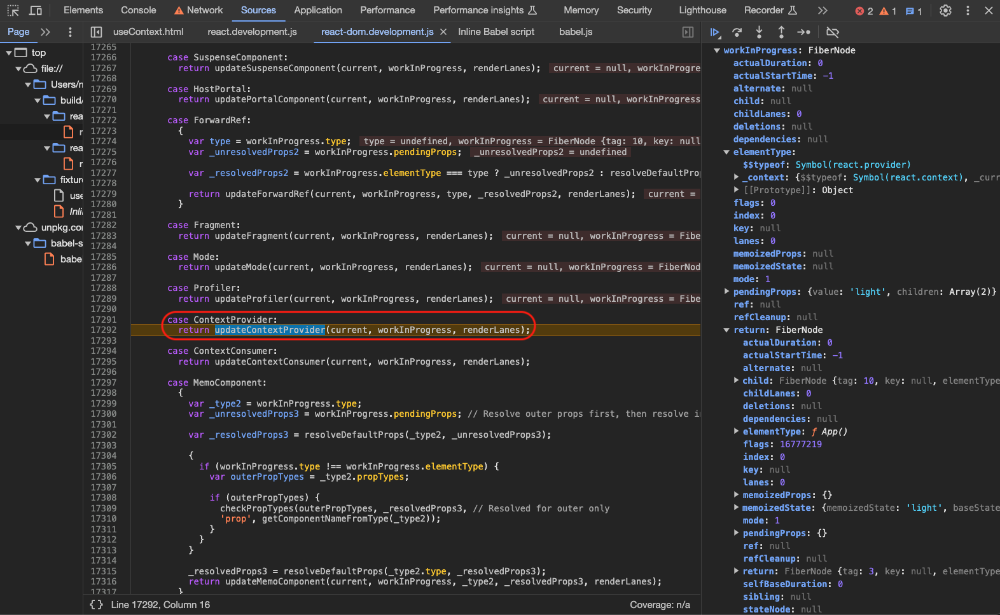
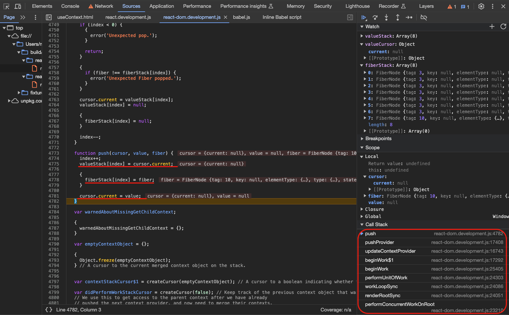
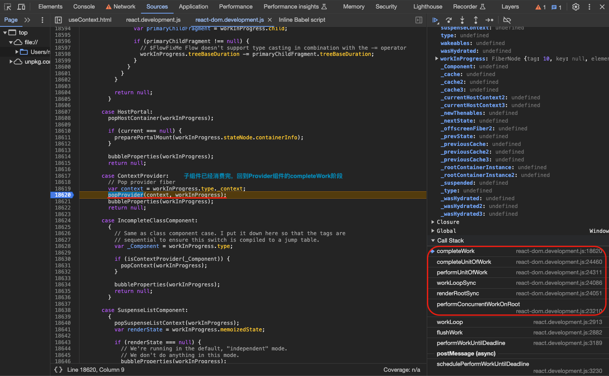
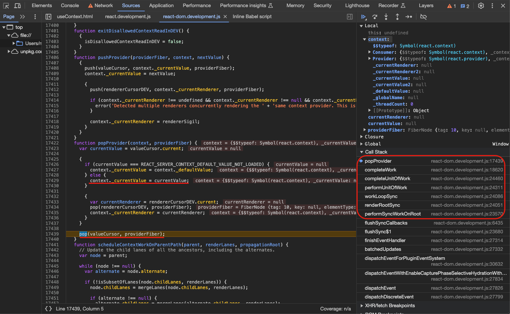
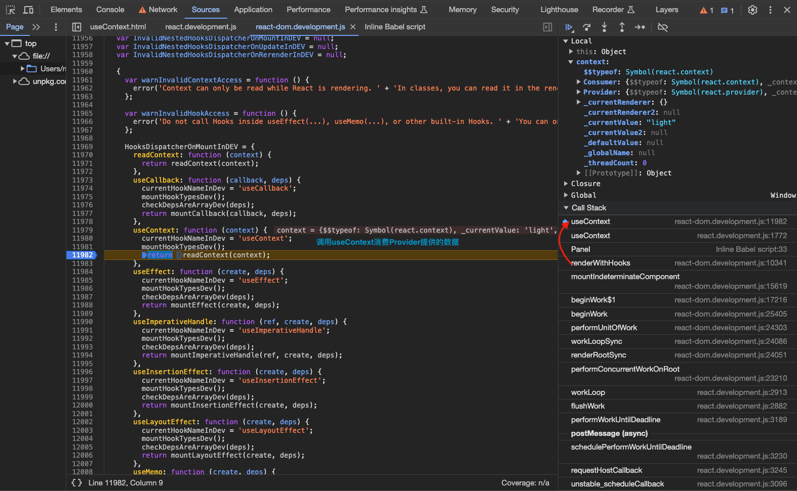
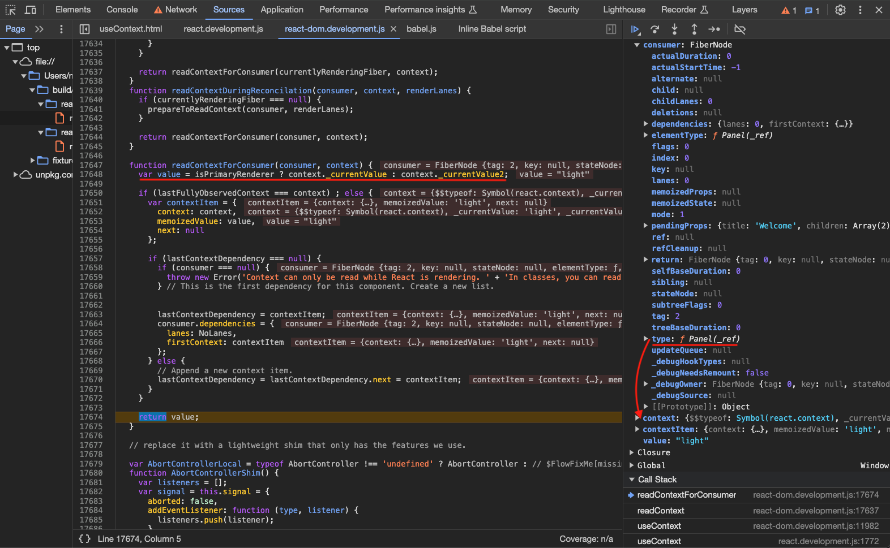
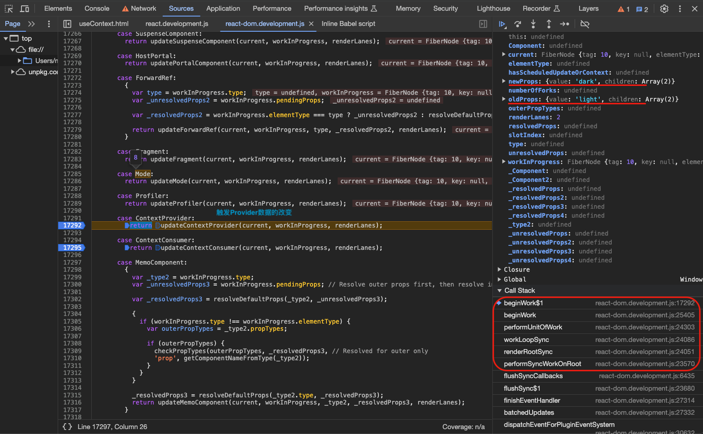
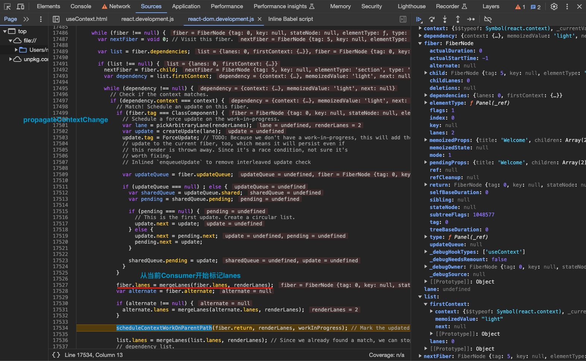
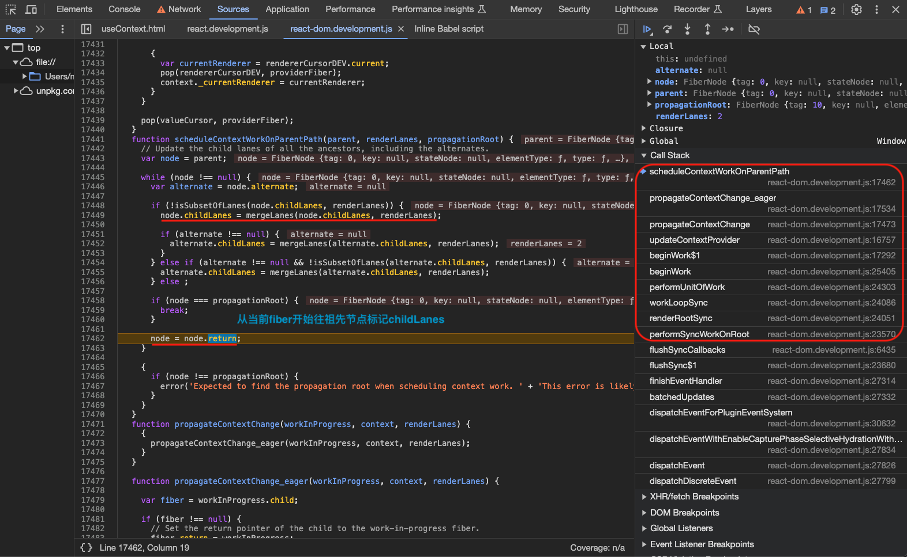
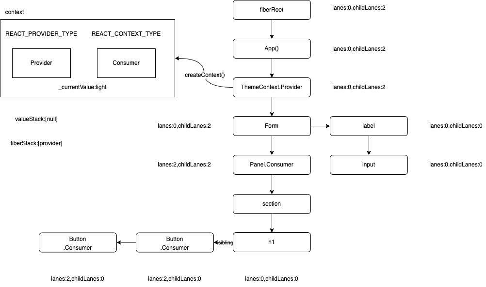

# useContext

调试用例如下：

```html
<html>
  <body>
    <script src="../../../build/oss-experimental/react/umd/react.development.js"></script>
    <script src="../../../build/oss-experimental/react-dom/umd/react-dom.development.js"></script>
    <script src="https://unpkg.com/babel-standalone@6/babel.js"></script>
    <div id="container"></div>
    <script type="text/babel">
      const ThemeContext = React.createContext(null)

      function App() {
        const [theme, setTheme] = React.useState("light")
        return (
          <ThemeContext.Provider value={theme}>
            <Form />
            <label>
              <input
                type="checkbox"
                checked={theme === "dark"}
                onChange={(e) => {
                  setTheme(e.target.checked ? "dark" : "light")
                }}
              />
              Use dark mode
            </label>
          </ThemeContext.Provider>
        )
      }

      function Form() {
        return (
          <Panel title="Welcome">
            <Button>Sign up</Button>
            <Button>Log in</Button>
          </Panel>
        )
      }

      function Panel({ title, children }) {
        const theme = React.useContext(ThemeContext)
        const className = "panel-" + theme
        return (
          <section className={className}>
            <h1>{title}</h1>
            {children}
          </section>
        )
      }

      function Button({ children }) {
        const theme = React.useContext(ThemeContext)
        const className = "button-" + theme
        return <button className={className}>{children}</button>
      }

      const root = ReactDOM.createRoot(document.getElementById("container"))
      root.render(<App />)
    </script>
  </body>
  <style>
    * {
      box-sizing: border-box;
    }

    body {
      font-family: sans-serif;
      margin: 20px;
      padding: 0;
    }

    h1 {
      margin-top: 0;
      font-size: 22px;
    }

    h2 {
      margin-top: 0;
      font-size: 20px;
    }

    h3 {
      margin-top: 0;
      font-size: 18px;
    }

    h4 {
      margin-top: 0;
      font-size: 16px;
    }

    h5 {
      margin-top: 0;
      font-size: 14px;
    }

    h6 {
      margin-top: 0;
      font-size: 12px;
    }

    code {
      font-size: 1.2em;
    }

    ul {
      padding-inline-start: 20px;
    }

    .panel-light,
    .panel-dark {
      border: 1px solid black;
      border-radius: 4px;
      padding: 20px;
      margin-bottom: 10px;
    }
    .panel-light {
      color: #222;
      background: #fff;
    }

    .panel-dark {
      color: #fff;
      background: rgb(23, 32, 42);
    }

    .button-light,
    .button-dark {
      border: 1px solid #777;
      padding: 5px;
      margin-right: 10px;
      margin-top: 10px;
    }

    .button-dark {
      background: #222;
      color: #fff;
    }

    .button-light {
      background: #fff;
      color: #222;
    }
  </style>
</html>
```

## createContext

Call createContext outside of any components to create a context.The context object itself does not hold any information. It represents which context other components read or provide. Typically, you will use SomeContext.Provider in components above to specify the context value, and call useContext(SomeContext) in components below to read it. The context object has a few properties:

- `SomeContext.Provider` lets you provide the context value to components.
- `SomeContext.Consumer` is an alternative and rarely used way to read the context value.

调用`React.createContext`就会进入`createContext`方法，这个方法构造了一个`context`对象，里面有两个重要的属性`Provider`和`Consumer`，这个`context`对象后续会挂载到`Consumer`的`fiber.dependencies`上：

```ts
// 【packages/react/src/ReactContext.js】
export function createContext<T>(defaultValue: T): ReactContext<T> {
  // TODO: Second argument used to be an optional `calculateChangedBits`
  // function. Warn to reserve for future use?
  // 【构造一个context对象，类型是REACT_CONTEXT_TYPE】
  const context: ReactContext<T> = {
    $$typeof: REACT_CONTEXT_TYPE,
    // As a workaround to support multiple concurrent renderers, we categorize
    // some renderers as primary and others as secondary. We only expect
    // there to be two concurrent renderers at most: React Native (primary) and
    // Fabric (secondary); React DOM (primary) and React ART (secondary).
    // Secondary renderers store their context values on separate fields.
    _currentValue: defaultValue,
    _currentValue2: defaultValue,
    // Used to track how many concurrent renderers this context currently
    // supports within in a single renderer. Such as parallel server rendering.
    _threadCount: 0,
    // These are circular
    Provider: (null: any),
    Consumer: (null: any),

    // Add these to use same hidden class in VM as ServerContext
    _defaultValue: (null: any),
    _globalName: (null: any),
  };

  context.Provider = {
    $$typeof: REACT_PROVIDER_TYPE,
    _context: context,
  };

  let hasWarnedAboutUsingNestedContextConsumers = false;
  let hasWarnedAboutUsingConsumerProvider = false;
  let hasWarnedAboutDisplayNameOnConsumer = false;

  if (__DEV__) {
    // A separate object, but proxies back to the original context object for
    // backwards compatibility. It has a different $$typeof, so we can properly
    // warn for the incorrect usage of Context as a Consumer.
    const Consumer = {
      $$typeof: REACT_CONTEXT_TYPE,
      _context: context,
    };
    // $FlowFixMe: Flow complains about not setting a value, which is intentional here
    Object.defineProperties(Consumer, {
      Provider: {
        get() {
          if (!hasWarnedAboutUsingConsumerProvider) {
            hasWarnedAboutUsingConsumerProvider = true;
            console.error(
              'Rendering <Context.Consumer.Provider> is not supported and will be removed in ' +
                'a future major release. Did you mean to render <Context.Provider> instead?',
            );
          }
          return context.Provider;
        },
        set(_Provider: ReactProviderType<T>) {
          context.Provider = _Provider;
        },
      },
      _currentValue: {
        get() {
          return context._currentValue;
        },
        set(_currentValue: T) {
          context._currentValue = _currentValue;
        },
      },
      _currentValue2: {
        get() {
          return context._currentValue2;
        },
        set(_currentValue2: T) {
          context._currentValue2 = _currentValue2;
        },
      },
      _threadCount: {
        get() {
          return context._threadCount;
        },
        set(_threadCount: number) {
          context._threadCount = _threadCount;
        },
      },
      Consumer: {
        get() {
          if (!hasWarnedAboutUsingNestedContextConsumers) {
            hasWarnedAboutUsingNestedContextConsumers = true;
            console.error(
              'Rendering <Context.Consumer.Consumer> is not supported and will be removed in ' +
                'a future major release. Did you mean to render <Context.Consumer> instead?',
            );
          }
          return context.Consumer;
        },
      },
      displayName: {
        get() {
          return context.displayName;
        },
        set(displayName: void | string) {
          if (!hasWarnedAboutDisplayNameOnConsumer) {
            console.warn(
              'Setting `displayName` on Context.Consumer has no effect. ' +
                "You should set it directly on the context with Context.displayName = '%s'.",
              displayName,
            );
            hasWarnedAboutDisplayNameOnConsumer = true;
          }
        },
      },
    });
    // $FlowFixMe: Flow complains about missing properties because it doesn't understand defineProperty
    context.Consumer = Consumer;
  } else {
    context.Consumer = context;
  }

  if (__DEV__) {
    context._currentRenderer = null;
    context._currentRenderer2 = null;
  }

  return context;
}
```

## useContext 原理

### Provider

#### Provider 的`beginWork`

在`render`阶段的`beginWork`过程中，针对每个节点会根据类型进入不同的方法，本例中`ThemeContext.Provider`对应的 `ReactElement` 的类型是`ContextProvider`，所以就会进入`updateContextProvider`方法：

1. 首先调用`pushProvider()`方法更新值，并将新值和`fiber`入栈`valueStack`、`fiberStack`；
2. 如果新旧值（`pendingProps.value`和`memoizedProps.value`）没有变化，提前退出，如果有变化调用`propagateContextChange()`方法去给消费的子组件`fiber`以及子组件`fiber.dependencies`打上`lanes`标记后续强制更新，并且调用`scheduleContextWorkOnParentPath`像冒泡一样将祖先节点的`childLanes`都打上标记；
3. 继续处理子节点`reconcileChildren()`；

```ts
// 【beginWork】
function beginWork() {
  switch (workInProgress.tag) {
    case ContextProvider:
      return updateContextProvider(current, workInProgress, renderLanes);
  }
}

export type ReactProvider<T> = {
  $$typeof: symbol | number,
  type: ReactProviderType<T>,
  key: null | string,
  ref: null,
  props: {
    value: T,
    children?: ReactNodeList,
    ...
  },
  ...
};

export type ReactProviderType<T> = {
  $$typeof: symbol | number,
  _context: ReactContext<T>,
  ...
};

export type ReactConsumer<T> = {
  $$typeof: symbol | number,
  type: ReactContext<T>,
  key: null | string,
  ref: null,
  props: {
    children: (value: T) => ReactNodeList,
    ...
  },
  ...
};

export type ReactContext<T> = {
  $$typeof: symbol | number,
  Consumer: ReactContext<T>,
  Provider: ReactProviderType<T>,
  _currentValue: T,
  _currentValue2: T,
  _threadCount: number,
  // DEV only
  _currentRenderer?: Object | null,
  _currentRenderer2?: Object | null,
  // This value may be added by application code
  // to improve DEV tooling display names
  displayName?: string,

  // only used by ServerContext
  _defaultValue: T,
  _globalName: string,
  ...
};

// 【packages/react-reconciler/src/ReactFiberBeginWork.js】
function updateContextProvider(
  current: Fiber | null,
  workInProgress: Fiber,
  renderLanes: Lanes,
) {

  const providerType: ReactProviderType<any> = workInProgress.type;
  const context: ReactContext<any> = providerType._context;

  const newProps = workInProgress.pendingProps;
  const oldProps = workInProgress.memoizedProps;

  const newValue = newProps.value;

  // 【省略代码...】
  // 【Consumer如何感知最近的Provider，关键就在于pushProvider方法】
  pushProvider(workInProgress, context, newValue);

  if (enableLazyContextPropagation) {
    // In the lazy propagation implementation, we don't scan for matching
    // consumers until something bails out, because until something bails out
    // we're going to visit those nodes, anyway. The trade-off is that it shifts
    // responsibility to the consumer to track whether something has changed.
  } else {
    if (oldProps !== null) {
      const oldValue = oldProps.value;
      // 【用Object.is比较新旧值是否相同】
      if (is(oldValue, newValue)) {
        // No change. Bailout early if children are the same.
        if (
          oldProps.children === newProps.children &&
          !hasLegacyContextChanged()
        ) {
          // 【Context内容无变动&子内容无变动（childLanes为0）就跳过子内容的rerender】
          return bailoutOnAlreadyFinishedWork(
            current,
            workInProgress,
            renderLanes,
          );
        }
      } else {
        // The context value changed. Search for matching consumers and schedule
        // them to update.
        // 【Provider告知Context数据更新，逐一给Consumer组件打标记】
        propagateContextChange(workInProgress, context, renderLanes);
      }
    }
  }

  const newChildren = newProps.children;
  reconcileChildren(current, workInProgress, newChildren, renderLanes);
  return workInProgress.child;
}

// 【packages/react-reconciler/src/ReactFiberNewContext.js】
export function propagateContextChange<T>(
  workInProgress: Fiber,
  context: ReactContext<T>,
  renderLanes: Lanes,
): void {
  if (enableLazyContextPropagation) {
    // TODO: This path is only used by Cache components. Update
    // lazilyPropagateParentContextChanges to look for Cache components so they
    // can take advantage of lazy propagation.
    const forcePropagateEntireTree = true;
    propagateContextChanges(
      workInProgress,
      [context],
      renderLanes,
      forcePropagateEntireTree,
    );
  } else {
    propagateContextChange_eager(workInProgress, context, renderLanes);
  }
}

function propagateContextChanges<T>(
  workInProgress: Fiber,
  contexts: Array<any>,
  renderLanes: Lanes,
  forcePropagateEntireTree: boolean,
): void {
  // Only used by lazy implementation
  if (!enableLazyContextPropagation) {
    return;
  }
  let fiber = workInProgress.child;
  if (fiber !== null) {
    // Set the return pointer of the child to the work-in-progress fiber.
    fiber.return = workInProgress;
  }
  while (fiber !== null) {
    let nextFiber;

    // Visit this fiber.
    const list = fiber.dependencies;
    if (list !== null) {
      nextFiber = fiber.child;

      let dep = list.firstContext;
      findChangedDep: while (dep !== null) {
        // Assigning these to constants to help Flow
        const dependency = dep;
        const consumer = fiber;
        findContext: for (let i = 0; i < contexts.length; i++) {
          const context: ReactContext<T> = contexts[i];
          // Check if the context matches.
          // TODO: Compare selected values to bail out early.
          if (dependency.context === context) {
            // Match! Schedule an update on this fiber.

            // In the lazy implementation, don't mark a dirty flag on the
            // dependency itself. Not all changes are propagated, so we can't
            // rely on the propagation function alone to determine whether
            // something has changed; the consumer will check. In the future, we
            // could add back a dirty flag as an optimization to avoid double
            // checking, but until we have selectors it's not really worth
            // the trouble.
            // 【在Consumer上进行lanes标识】
            consumer.lanes = mergeLanes(consumer.lanes, renderLanes);
            const alternate = consumer.alternate;
            if (alternate !== null) {
              alternate.lanes = mergeLanes(alternate.lanes, renderLanes);
            }
            scheduleContextWorkOnParentPath(
              consumer.return,
              renderLanes,
              workInProgress,
            );

            if (!forcePropagateEntireTree) {
              // During lazy propagation, when we find a match, we can defer
              // propagating changes to the children, because we're going to
              // visit them during render. We should continue propagating the
              // siblings, though
              nextFiber = null;
            }

            // Since we already found a match, we can stop traversing the
            // dependency list.
            break findChangedDep;
          }
        }
        dep = dependency.next;
      }
    } else if (fiber.tag === DehydratedFragment) {
      // If a dehydrated suspense boundary is in this subtree, we don't know
      // if it will have any context consumers in it. The best we can do is
      // mark it as having updates.
      const parentSuspense = fiber.return;

      if (parentSuspense === null) {
        throw new Error(
          'We just came from a parent so we must have had a parent. This is a bug in React.',
        );
      }

      parentSuspense.lanes = mergeLanes(parentSuspense.lanes, renderLanes);
      const alternate = parentSuspense.alternate;
      if (alternate !== null) {
        alternate.lanes = mergeLanes(alternate.lanes, renderLanes);
      }
      // This is intentionally passing this fiber as the parent
      // because we want to schedule this fiber as having work
      // on its children. We'll use the childLanes on
      // this fiber to indicate that a context has changed.
      scheduleContextWorkOnParentPath(
        parentSuspense,
        renderLanes,
        workInProgress,
      );
      nextFiber = null;
    } else {
      // Traverse down.
      nextFiber = fiber.child;
    }

    if (nextFiber !== null) {
      // Set the return pointer of the child to the work-in-progress fiber.
      nextFiber.return = fiber;
    } else {
      // No child. Traverse to next sibling.
      nextFiber = fiber;
      while (nextFiber !== null) {
        if (nextFiber === workInProgress) {
          // We're back to the root of this subtree. Exit.
          nextFiber = null;
          break;
        }
        const sibling = nextFiber.sibling;
        if (sibling !== null) {
          // Set the return pointer of the sibling to the work-in-progress fiber.
          sibling.return = nextFiber.return;
          nextFiber = sibling;
          break;
        }
        // No more siblings. Traverse up.
        nextFiber = nextFiber.return;
      }
    }
    fiber = nextFiber;
  }
}
```



`pushProvider`主要处理的是由`createContext`创建的`context`，更新`context._currentValue`到最新值，作为`provider`要提供数据供子组件使用，子组件总是会找到最近的那个`provider`获取值，因此需要`valueStack`和`fiberStack`两个栈结构来存储`context`值和对应`fiber`节点：

1. `valueCursor.current`入栈`valueStack`，当前`provider fiber`入栈`fiberStack`；
2. 更新`context._currentValue`到最新值；

```ts
// 【packages/react-reconciler/src/ReactFiberNewContext.js】
const valueCursor: StackCursor<mixed> = createCursor(null) //【一个对象，包含一个current属性】

export function pushProvider<T>(
  providerFiber: Fiber,
  context: ReactContext<T>,
  nextValue: T
): void {
  if (isPrimaryRenderer) {
    // 【valueCursor的current属性入栈valueStack，并更新为context._currentValue，providerFiber入栈fiberStack】
    push(valueCursor, context._currentValue, providerFiber)
    // 【context._currentValue更新为最新值】
    context._currentValue = nextValue

    if (__DEV__) {
      push(rendererCursorDEV, context._currentRenderer, providerFiber)

      if (
        context._currentRenderer !== undefined &&
        context._currentRenderer !== null &&
        context._currentRenderer !== rendererSigil
      ) {
        console.error(
          "Detected multiple renderers concurrently rendering the " +
            "same context provider. This is currently unsupported."
        )
      }
      context._currentRenderer = rendererSigil
    }
  } else {
    push(valueCursor, context._currentValue2, providerFiber)

    context._currentValue2 = nextValue
    if (__DEV__) {
      push(renderer2CursorDEV, context._currentRenderer2, providerFiber)

      if (
        context._currentRenderer2 !== undefined &&
        context._currentRenderer2 !== null &&
        context._currentRenderer2 !== rendererSigil
      ) {
        console.error(
          "Detected multiple renderers concurrently rendering the " +
            "same context provider. This is currently unsupported."
        )
      }
      context._currentRenderer2 = rendererSigil
    }
  }
}
```


`pushProvider`用到的辅助函数`push`如下，这里的`cursor`就是前面传入的`valueCursor`：

1. `cursor.current`入栈`valueStack`；
2. `fiber`入栈`fiberStack`；
3. `cursor.current`设置为最新值；

```ts
// 【packages/react-reconciler/src/ReactFiberStack.js】
const valueStack: Array<any> = []
let fiberStack: Array<Fiber | null>
let index = -1

function push<T>(cursor: StackCursor<T>, value: T, fiber: Fiber): void {
  index++

  valueStack[index] = cursor.current

  if (__DEV__) {
    fiberStack[index] = fiber
  }

  cursor.current = value
}
```



#### Provider 的`completeWork`

在`provider`的`completeWork`工作之前，其实会先处理子节点的`beginWork`，因此，子节点`consumer`在`beginWork`阶段就消费了`context`内容，要么通过`useContext hook`要么通过`JSX`语法。

在`render`阶段的`completeWork`过程中，针对每个节点会根据类型同样进入不同的方法，本例中`ThemeContext.Provider`对应的 `ReactElement` 的类型是`ContextProvider`，所以就会进入`ContextProvider`分支去调用`popProvider()`：

```ts
// 【completeWork】
function completeWork() {
  switch (workInProgress.tag) {
    case ContextProvider:
      // Pop provider fiber
      const context: ReactContext<any> = workInProgress.type._context
      popProvider(context, workInProgress)
      bubbleProperties(workInProgress)
      return null
  }
}
```



`popProvider`仍然处理的是由`createContext`创建的`context`，因为`render`解析过程从上至下，没有下一层的时候去找兄弟节点，然后返回上一层再去找兄弟节点，根据这个特性，当回到当前`provider`节点进行`completeWork`时说明子节点已经全部处理完了，该消费当前`context`的已经消费结束（`consumer`永远消费离自己最近的`provider`提供的数据），因此需要调用`popProvider`将当前栈顶清空，然后继续回祖先节点处理：

1. 处理`valueStack`和`fiberStack`；
2. 更新`context._currentValue`到最新值；

```ts
// 【packages/react-reconciler/src/ReactFiberNewContext.js】
const valueCursor: StackCursor<mixed> = createCursor(null) //【一个对象，包含一个current属性】

export function popProvider(
  context: ReactContext<any>,
  providerFiber: Fiber
): void {
  const currentValue = valueCursor.current

  if (isPrimaryRenderer) {
    if (
      enableServerContext &&
      currentValue === REACT_SERVER_CONTEXT_DEFAULT_VALUE_NOT_LOADED
    ) {
      context._currentValue = context._defaultValue
    } else {
      context._currentValue = currentValue
    }
    if (__DEV__) {
      const currentRenderer = rendererCursorDEV.current
      pop(rendererCursorDEV, providerFiber)
      context._currentRenderer = currentRenderer
    }
  } else {
    if (
      enableServerContext &&
      currentValue === REACT_SERVER_CONTEXT_DEFAULT_VALUE_NOT_LOADED
    ) {
      context._currentValue2 = context._defaultValue
    } else {
      context._currentValue2 = currentValue
    }
    if (__DEV__) {
      const currentRenderer2 = renderer2CursorDEV.current
      pop(renderer2CursorDEV, providerFiber)
      context._currentRenderer2 = currentRenderer2
    }
  }
  // 【调用pop方法清理栈顶】
  pop(valueCursor, providerFiber)
}
```

`popProvider`用到的辅助函数`pop`如下：

1. `cursor.current`设置为栈顶值；
2. `valueStack`栈顶设为 null；
3. `fiberStack`栈顶设为 null；

```ts
// 【packages/react-reconciler/src/ReactFiberStack.js】
const valueStack: Array<any> = []
let fiberStack: Array<Fiber | null>
let index = -1

function pop<T>(cursor: StackCursor<T>, fiber: Fiber): void {
  if (index < 0) {
    if (__DEV__) {
      console.error("Unexpected pop.")
    }
    return
  }

  if (__DEV__) {
    if (fiber !== fiberStack[index]) {
      console.error("Unexpected Fiber popped.")
    }
  }

  cursor.current = valueStack[index]

  valueStack[index] = null

  if (__DEV__) {
    fiberStack[index] = null
  }

  index--
}
```



---

### Consumer

`Consumer`组件消费`context`可以通过`MyContext.Consumer`就是 JSX 的方式也可以通过`React.useContext`就是 hook 的方式消费。

#### Consumer 通过 hook 方式消费(`beginWork`)

使用 hook 方式消费时，在组件`beginWork`阶段（`mountIndeterminateComponent`/`updateFunctionComponent`）会调用`renderWithHooks`方法，就会执行`React.useContext(ThemeContext)`其实就是`readContext`方法，本例中最终会读取`ThemeContext`这个前面创建的`context`对象所保存的值。

```ts
// 【packages/react-reconciler/src/ReactFiberBeginWork.js】
function mountIndeterminateComponent(
  _current: null | Fiber,
  workInProgress: Fiber,
  Component: $FlowFixMe,
  renderLanes: Lanes,
) {
  resetSuspendedCurrentOnMountInLegacyMode(_current, workInProgress);

  const props = workInProgress.pendingProps;
  let context;

  // 【省略代码...】

  prepareToReadContext(workInProgress, renderLanes);
  let value;
  let hasId;

  if (enableSchedulingProfiler) {
    markComponentRenderStarted(workInProgress);
  }
  if (__DEV__) {
    // 【省略代码...】
  } else {
    // 【renderWithHooks】
    value = renderWithHooks(
      null,
      workInProgress,
      Component,
      props,
      context,
      renderLanes,
    );
    hasId = checkDidRenderIdHook();
  }

    // 【省略代码...】

    // React DevTools reads this flag.
    workInProgress.flags |= PerformedWork;

    // 【省略代码...】

    // Proceed under the assumption that this is a class instance
    workInProgress.tag = ClassComponent;

    // Throw out any hooks that were used.
    workInProgress.memoizedState = null;
    workInProgress.updateQueue = null;

    // Push context providers early to prevent context stack mismatches.
    // During mounting we don't know the child context yet as the instance doesn't exist.
    // We will invalidate the child context in finishClassComponent() right after rendering.
    let hasContext = false;
    if (isLegacyContextProvider(Component)) {
      hasContext = true;
      pushLegacyContextProvider(workInProgress);
    } else {
      hasContext = false;
    }

    workInProgress.memoizedState =
      value.state !== null && value.state !== undefined ? value.state : null;

    initializeUpdateQueue(workInProgress);

    adoptClassInstance(workInProgress, value);
    mountClassInstance(workInProgress, Component, props, renderLanes);
    return finishClassComponent(
      null,
      workInProgress,
      Component,
      true,
      hasContext,
      renderLanes,
    );
  } else {
    // Proceed under the assumption that this is a function component
    workInProgress.tag = FunctionComponent;

    // 【省略代码...】

    reconcileChildren(null, workInProgress, value, renderLanes);

    // 【省略代码...】

    return workInProgress.child;
  }
}

function updateFunctionComponent(
  current: null | Fiber,
  workInProgress: Fiber,
  Component: any,
  nextProps: any,
  renderLanes: Lanes,
) {
  // 【省略代码...】

  let context;
  if (!disableLegacyContext) {
    const unmaskedContext = getUnmaskedContext(workInProgress, Component, true);
    context = getMaskedContext(workInProgress, unmaskedContext);
  }

  let nextChildren;
  let hasId;
  prepareToReadContext(workInProgress, renderLanes);
  if (enableSchedulingProfiler) {
    markComponentRenderStarted(workInProgress);
  }
  if (__DEV__) {
    // 【省略代码...】
  } else {
    // 【renderWithHooks】
    nextChildren = renderWithHooks(
      current,
      workInProgress,
      Component,
      nextProps,
      context,
      renderLanes,
    );
    hasId = checkDidRenderIdHook();
  }
  if (enableSchedulingProfiler) {
    markComponentRenderStopped();
  }

  if (current !== null && !didReceiveUpdate) {
    bailoutHooks(current, workInProgress, renderLanes);
    return bailoutOnAlreadyFinishedWork(current, workInProgress, renderLanes);
  }

  if (getIsHydrating() && hasId) {
    pushMaterializedTreeId(workInProgress);
  }

  // React DevTools reads this flag.
  workInProgress.flags |= PerformedWork;
  reconcileChildren(current, workInProgress, nextChildren, renderLanes);
  return workInProgress.child;
}
```

`readcontext`方法并不复杂，只是读取`context._currentValue`里的值，处理节点对应`dependencies`也是用 `next` 的串联关系（一个`consumer`可以使用多个`context`内容），最后返回`context`最新值：

```ts
// 【packages/react-reconciler/src/ReactFiberNewContext.js】
let currentlyRenderingFiber: Fiber | null = null;
let lastContextDependency: ContextDependency<mixed> | null = null;
let lastFullyObservedContext: ReactContext<any> | null = null;

export function readContext<T>(context: ReactContext<T>): T {
  if (__DEV__) {
    // This warning would fire if you read context inside a Hook like useMemo.
    // Unlike the class check below, it's not enforced in production for perf.
    if (isDisallowedContextReadInDEV) {
      console.error(
        'Context can only be read while React is rendering. ' +
          'In classes, you can read it in the render method or getDerivedStateFromProps. ' +
          'In function components, you can read it directly in the function body, but not ' +
          'inside Hooks like useReducer() or useMemo().',
      );
    }
  }
  return readContextForConsumer(currentlyRenderingFiber, context);
}

function readContextForConsumer<T>(
  consumer: Fiber | null,
  context: ReactContext<T>,
): T {
  // 【获取最新值】
  const value = isPrimaryRenderer
    ? context._currentValue
    : context._currentValue2;

  if (lastFullyObservedContext === context) {
    // Nothing to do. We already observe everything in this context.
  } else {
    // 【更新context对象】
    const contextItem = {
      context: ((context: any): ReactContext<mixed>),
      memoizedValue: value,
      next: null,
    };

    if (lastContextDependency === null) {
      if (consumer === null) {
        throw new Error(
          'Context can only be read while React is rendering. ' +
            'In classes, you can read it in the render method or getDerivedStateFromProps. ' +
            'In function components, you can read it directly in the function body, but not ' +
            'inside Hooks like useReducer() or useMemo().',
        );
      }

      // This is the first dependency for this component. Create a new list.
      // 【首个Context】
      lastContextDependency = contextItem;
      // 【consumer这个fiber的dependencies属性把用到的Context串上去】
      consumer.dependencies = {
        lanes: NoLanes,
        firstContext: contextItem,
      };
      if (enableLazyContextPropagation) {
        consumer.flags |= NeedsPropagation;
      }
    } else {
      // Append a new context item.
      // 【串联Context list】
      lastContextDependency = lastContextDependency.next = contextItem;
    }
  }
  return value;
}
```




#### Consumer 通过 JSX 方式消费(`beginWork`)

使用 JSX 方式消费时，在`render`阶段的`beginWork`过程中，针对每个节点会根据类型进入不同的方法，本例中`Panel`组件是一个`ContextConsumer`类型，所以就会进入`updateContextConsumer`方法，可以看到同样会调用`readContext`方法：

```ts
// 【packages/react-reconciler/src/ReactFiberBeginWork.js】
function updateContextConsumer(
  current: Fiber | null,
  workInProgress: Fiber,
  renderLanes: Lanes,
) {
  // 【获取context】
  let context: ReactContext<any> = workInProgress.type;
  // The logic below for Context differs depending on PROD or DEV mode. In
  // DEV mode, we create a separate object for Context.Consumer that acts
  // like a proxy to Context. This proxy object adds unnecessary code in PROD
  // so we use the old behaviour (Context.Consumer references Context) to
  // reduce size and overhead. The separate object references context via
  // a property called "_context", which also gives us the ability to check
  // in DEV mode if this property exists or not and warn if it does not.
  if (__DEV__) {
    if ((context: any)._context === undefined) {
      // This may be because it's a Context (rather than a Consumer).
      // Or it may be because it's older React where they're the same thing.
      // We only want to warn if we're sure it's a new React.
      if (context !== context.Consumer) {
        if (!hasWarnedAboutUsingContextAsConsumer) {
          hasWarnedAboutUsingContextAsConsumer = true;
          console.error(
            'Rendering <Context> directly is not supported and will be removed in ' +
              'a future major release. Did you mean to render <Context.Consumer> instead?',
          );
        }
      }
    } else {
      context = (context: any)._context;
    }
  }
  const newProps = workInProgress.pendingProps;
  const render = newProps.children;

  // 【省略代码...】

  prepareToReadContext(workInProgress, renderLanes);
  // 【readContext通过context获取最新值】
  const newValue = readContext(context);
  if (enableSchedulingProfiler) {
    markComponentRenderStarted(workInProgress);
  }
  let newChildren;
  if (__DEV__) {
    ReactCurrentOwner.current = workInProgress;
    setIsRendering(true);
    newChildren = render(newValue);
    setIsRendering(false);
  } else {
    // 【获取newChildren】
    newChildren = render(newValue);
  }
  if (enableSchedulingProfiler) {
    markComponentRenderStopped();
  }

  // React DevTools reads this flag.
  workInProgress.flags |= PerformedWork;
  reconcileChildren(current, workInProgress, newChildren, renderLanes);
  return workInProgress.child;
}
```

#### Consumer 通过 JSX 方式消费(`completeWork`)

`Consumer`组件在`completeWork`阶段仍然走`ContextConsumer`分支，所以只会调用`bubbleProperties(workInProgress)`将`flags`冒泡往上，其他并未操作。

```ts
// 【packages/react-reconciler/src/ReactFiberCompleteWork.js】
function completeWork(
  current: Fiber | null,
  workInProgress: Fiber,
  renderLanes: Lanes
): Fiber | null {
  const newProps = workInProgress.pendingProps
  // Note: This intentionally doesn't check if we're hydrating because comparing
  // to the current tree provider fiber is just as fast and less error-prone.
  // Ideally we would have a special version of the work loop only
  // for hydration.
  popTreeContext(workInProgress)
  switch (workInProgress.tag) {
    case IndeterminateComponent:
    case LazyComponent:
    case SimpleMemoComponent:
    case FunctionComponent:
    case ForwardRef:
    case Fragment:
    case Mode:
    case Profiler:
    case ContextConsumer:
    case MemoComponent:
      bubbleProperties(workInProgress)
      return null
    case ContextProvider:
      // 【省略代码...】
      return null
  }

  // 【省略代码...】
}
```

### 一致性保证

#### prepareToReadContext

在所有的组件处理方法中，例如`mountIndeterminateComponent`(通过 hook 消费)和`updateContextConsumer`（通过 JSX 语法消费）中都会调用`prepareToReadContext`做读取`context`之前的准备工作，获取当前`fiber`节点的`dependencies`并重置为`null`：

```ts
// 【packages/react-reconciler/src/ReactFiberNewContext.js】
export function prepareToReadContext(
  workInProgress: Fiber,
  renderLanes: Lanes
): void {
  currentlyRenderingFiber = workInProgress
  lastContextDependency = null
  lastFullyObservedContext = null
  // 【dependencies存储了使用的Context】
  const dependencies = workInProgress.dependencies
  if (dependencies !== null) {
    if (enableLazyContextPropagation) {
      // Reset the work-in-progress list
      dependencies.firstContext = null
    } else {
      const firstContext = dependencies.firstContext
      if (firstContext !== null) {
        if (includesSomeLane(dependencies.lanes, renderLanes)) {
          // Context list has a pending update. Mark that this fiber performed work.
          markWorkInProgressReceivedUpdate()
        }
        // Reset the work-in-progress list
        dependencies.firstContext = null
      }
    }
  }
}
```

#### propagateContextChange

在`Provider`的`beginWork`阶段`updateContextProvider`中有这样一个方法`propagateContextChange`，这个方法用于在`provider`提供的数据变化时去更新所有`consumer`组件：

1. 从`provider`组件开始往下寻找所有消费这个`provider`的`consumer`组件，并给这个`consumer`组件标志`lanes`属性表示需要更新；
2. 调用`scheduleContextWorkOnParentPath`方法从`consumer`组件往上给所有的组件节点标记`childLanes`属性，这个方法类似【5】文中提到的`markUpdateLaneFromFiberToRoot`方法；

```ts
// 【packages/react-reconciler/src/ReactFiberNewContext.js】
export function propagateContextChange<T>(
  workInProgress: Fiber,
  context: ReactContext<T>,
  renderLanes: Lanes,
): void {
  if (enableLazyContextPropagation) {
    // TODO: This path is only used by Cache components. Update
    // lazilyPropagateParentContextChanges to look for Cache components so they
    // can take advantage of lazy propagation.
    const forcePropagateEntireTree = true;
    propagateContextChanges(
      workInProgress,
      [context],
      renderLanes,
      forcePropagateEntireTree,
    );
  } else {
    propagateContextChange_eager(workInProgress, context, renderLanes);
  }
}

function propagateContextChange_eager<T>(
  workInProgress: Fiber,
  context: ReactContext<T>,
  renderLanes: Lanes,
): void {
  // Only used by eager implementation
  if (enableLazyContextPropagation) {
    return;
  }
  let fiber = workInProgress.child;
  if (fiber !== null) {
    // Set the return pointer of the child to the work-in-progress fiber.
    fiber.return = workInProgress;
  }
  while (fiber !== null) {
    let nextFiber;

    // Visit this fiber.
    // 【依次检查fiber.dependencies】
    const list = fiber.dependencies;
    if (list !== null) {
      nextFiber = fiber.child;

      let dependency = list.firstContext;
      while (dependency !== null) {
        // Check if the context matches.
        if (dependency.context === context) {
          // Match! Schedule an update on this fiber.
          if (fiber.tag === ClassComponent) {
            // Schedule a force update on the work-in-progress.
            const lane = pickArbitraryLane(renderLanes);
            const update = createUpdate(lane);
            update.tag = ForceUpdate;
            // TODO: Because we don't have a work-in-progress, this will add the
            // update to the current fiber, too, which means it will persist even if
            // this render is thrown away. Since it's a race condition, not sure it's
            // worth fixing.

            // Inlined `enqueueUpdate` to remove interleaved update check
            const updateQueue = fiber.updateQueue;
            if (updateQueue === null) {
              // Only occurs if the fiber has been unmounted.
            } else {
              const sharedQueue: SharedQueue<any> = (updateQueue: any).shared;
              const pending = sharedQueue.pending;
              if (pending === null) {
                // This is the first update. Create a circular list.
                update.next = update;
              } else {
                update.next = pending.next;
                pending.next = update;
              }
              sharedQueue.pending = update;
            }
          }
          // 【标记lanes】
          fiber.lanes = mergeLanes(fiber.lanes, renderLanes);
          const alternate = fiber.alternate;
          if (alternate !== null) {
            alternate.lanes = mergeLanes(alternate.lanes, renderLanes);
          }
          // 【给当前fiber上的直到Provider所在组件的祖先节点标记childLanes】
          scheduleContextWorkOnParentPath(
            fiber.return,
            renderLanes,
            workInProgress,
          );

          // Mark the updated lanes on the list, too.
          list.lanes = mergeLanes(list.lanes, renderLanes);

          // Since we already found a match, we can stop traversing the
          // dependency list.
          break;
        }
        dependency = dependency.next;
      }
    } else if (fiber.tag === ContextProvider) {
      // Don't scan deeper if this is a matching provider
      // 【到Provider就不再往下，因为是另外一套context了】
      nextFiber = fiber.type === workInProgress.type ? null : fiber.child;
    } else if (fiber.tag === DehydratedFragment) {
      // If a dehydrated suspense boundary is in this subtree, we don't know
      // if it will have any context consumers in it. The best we can do is
      // mark it as having updates.
      const parentSuspense = fiber.return;

      if (parentSuspense === null) {
        throw new Error(
          'We just came from a parent so we must have had a parent. This is a bug in React.',
        );
      }

      parentSuspense.lanes = mergeLanes(parentSuspense.lanes, renderLanes);
      const alternate = parentSuspense.alternate;
      if (alternate !== null) {
        alternate.lanes = mergeLanes(alternate.lanes, renderLanes);
      }
      // This is intentionally passing this fiber as the parent
      // because we want to schedule this fiber as having work
      // on its children. We'll use the childLanes on
      // this fiber to indicate that a context has changed.
      scheduleContextWorkOnParentPath(
        parentSuspense,
        renderLanes,
        workInProgress,
      );
      nextFiber = fiber.sibling;
    } else {
      // Traverse down.
      nextFiber = fiber.child;
    }

    if (nextFiber !== null) {
      // Set the return pointer of the child to the work-in-progress fiber.
      nextFiber.return = fiber;
    } else {
      // No child. Traverse to next sibling.
      nextFiber = fiber;
      while (nextFiber !== null) {
        if (nextFiber === workInProgress) {
          // We're back to the root of this subtree. Exit.
          nextFiber = null;
          break;
        }
        const sibling = nextFiber.sibling;
        if (sibling !== null) {
          // Set the return pointer of the sibling to the work-in-progress fiber.
          sibling.return = nextFiber.return;
          nextFiber = sibling;
          break;
        }
        // No more siblings. Traverse up.
        nextFiber = nextFiber.return;
      }
    }
    fiber = nextFiber;
  }
}

function propagateContextChanges<T>(
  workInProgress: Fiber,
  contexts: Array<any>,
  renderLanes: Lanes,
  forcePropagateEntireTree: boolean,
): void {
  // Only used by lazy implementation
  if (!enableLazyContextPropagation) {
    return;
  }
  let fiber = workInProgress.child;
  if (fiber !== null) {
    // Set the return pointer of the child to the work-in-progress fiber.
    fiber.return = workInProgress;
  }
  while (fiber !== null) {
    let nextFiber;

    // Visit this fiber.
    const list = fiber.dependencies;
    if (list !== null) {
      nextFiber = fiber.child;

      let dep = list.firstContext;
      findChangedDep: while (dep !== null) {
        // Assigning these to constants to help Flow
        const dependency = dep;
        const consumer = fiber;
        findContext: for (let i = 0; i < contexts.length; i++) {
          const context: ReactContext<T> = contexts[i];
          // Check if the context matches.
          // TODO: Compare selected values to bail out early.
          if (dependency.context === context) {
            // Match! Schedule an update on this fiber.

            // In the lazy implementation, don't mark a dirty flag on the
            // dependency itself. Not all changes are propagated, so we can't
            // rely on the propagation function alone to determine whether
            // something has changed; the consumer will check. In the future, we
            // could add back a dirty flag as an optimization to avoid double
            // checking, but until we have selectors it's not really worth
            // the trouble.
            consumer.lanes = mergeLanes(consumer.lanes, renderLanes);
            const alternate = consumer.alternate;
            if (alternate !== null) {
              alternate.lanes = mergeLanes(alternate.lanes, renderLanes);
            }
            scheduleContextWorkOnParentPath(
              consumer.return,
              renderLanes,
              workInProgress,
            );

            if (!forcePropagateEntireTree) {
              // During lazy propagation, when we find a match, we can defer
              // propagating changes to the children, because we're going to
              // visit them during render. We should continue propagating the
              // siblings, though
              nextFiber = null;
            }

            // Since we already found a match, we can stop traversing the
            // dependency list.
            break findChangedDep;
          }
        }
        dep = dependency.next;
      }
    } else if (fiber.tag === DehydratedFragment) {
      // If a dehydrated suspense boundary is in this subtree, we don't know
      // if it will have any context consumers in it. The best we can do is
      // mark it as having updates.
      const parentSuspense = fiber.return;

      if (parentSuspense === null) {
        throw new Error(
          'We just came from a parent so we must have had a parent. This is a bug in React.',
        );
      }

      parentSuspense.lanes = mergeLanes(parentSuspense.lanes, renderLanes);
      const alternate = parentSuspense.alternate;
      if (alternate !== null) {
        alternate.lanes = mergeLanes(alternate.lanes, renderLanes);
      }
      // This is intentionally passing this fiber as the parent
      // because we want to schedule this fiber as having work
      // on its children. We'll use the childLanes on
      // this fiber to indicate that a context has changed.
      scheduleContextWorkOnParentPath(
        parentSuspense,
        renderLanes,
        workInProgress,
      );
      nextFiber = null;
    } else {
      // Traverse down.
      nextFiber = fiber.child;
    }

    if (nextFiber !== null) {
      // Set the return pointer of the child to the work-in-progress fiber.
      nextFiber.return = fiber;
    } else {
      // No child. Traverse to next sibling.
      nextFiber = fiber;
      while (nextFiber !== null) {
        if (nextFiber === workInProgress) {
          // We're back to the root of this subtree. Exit.
          nextFiber = null;
          break;
        }
        const sibling = nextFiber.sibling;
        if (sibling !== null) {
          // Set the return pointer of the sibling to the work-in-progress fiber.
          sibling.return = nextFiber.return;
          nextFiber = sibling;
          break;
        }
        // No more siblings. Traverse up.
        nextFiber = nextFiber.return;
      }
    }
    fiber = nextFiber;
  }
}
```






## 总结

1. 调用`createContext`会创建一个`context`对象，里面包含`Provider`和`Consumer`信息以及数据信息`_currentValue`，`Provider`对应类型是`REACT_PROVIDER_TYPE`，`Consumer`对应类型是`REACT_CONTEXT_TYPE`；
2. `beginWork`阶段首先遇到`REACT_PROVIDER_TYPE`类型的`Provider`组件，调用`updateContextProvider`=>`pushProvider()`，将数据和当前 `fiber` 入栈；
3. `beginWork`阶段接着深入子节点遇到`REACT_CONTEXT_TYPE`类型的`Consumer`组件或者调用了`useContext`的`Consumer`组件，前者进入`updateContextConsumer`方法继而进入`readContext`方法，后者直接调用`readContext`方法，方法会读取`context._currentValue`里的值并且更新`fiber`对应的`dependencies list`，也就是我们说的`Consumer`组件消费`Provider`组件提供的数据；
4. 子组件消费完之后回到`Provider`组件的`completeWork`阶段，继而调用`popProvider`出栈，这一操作是为了保证所有的`Consumer`组件永远消费的是离自己最近的`Provider`组件提供的数据；
5. 在更新`Provider`组件提供的数据后同样进入`updateContextProvider`，然后如果新旧`context`数据有变化就会用`propagateContextChange`方法遍历子节点去给所有消费该数据的`Consumer`组件标记`lanes`和`Consumer`组件的祖先节点`childLanes`属性用于后续更新的判断；


