# `<Suspense>` & lazy & use

## Suspense 原理

### Suspense 介绍

`<Suspense>` lets you display a fallback until its children have finished loading.

- Displaying a fallback while content is loading
- Revealing content together at once
- Revealing nested content as it loads
- Showing stale content while fresh content is loading
- Preventing already revealed content from hiding
- Indicating that a Transition is happening
- Resetting Suspense boundaries on navigation
- Providing a fallback for server errors and client-only content

Only Suspense-enabled data sources will activate the `<Suspense>` component. They include:

- Data fetching with Suspense-enabled frameworks like `Relay` and `Next.js`
- Lazy-loading component code with `lazy`
- Reading the value of a cached Promise with `use`

`<Suspense>` does not detect when data is fetched inside an Effect or event handler.

`<Suspense>`测试用例：

```html
<html>
  <body>
    <script src="../../../build/oss-experimental/react/umd/react.development.js"></script>
    <script src="../../../build/oss-experimental/react-dom/umd/react-dom.development.js"></script>
    <script src="https://unpkg.com/babel-standalone@6/babel.js"></script>
    <div id="container"></div>
    <script type="text/babel">
      const getData = (data, delay = 1000) => ({
        _data: null,
        _promise: null,
        status: "pending",
        get data() {
          if (this.status === "ready") {
            return this._data
          } else {
            if (this._promise == null) {
              this._promise = new Promise((resolve) => {
                setTimeout(() => {
                  this._data = data
                  this.status = "ready"
                  resolve()
                }, delay)
              })
            }
            throw this._promise
          }
        },
      })

      function Child({ data }) {
        return data ? <h2>{data.data}</h2> : null
      }

      function Loading() {
        return <h2>🌀 Loading...</h2>
      }

      function App() {
        const [data, setData] = React.useState(null)
        return (
          <div className='app'>
            <button
              onClick={() => {
                setData(getData("Hello HOBO~"))
              }}>
              获取数据
            </button>
            <React.Suspense fallback={<Loading />}>
              <Child data={data} />
            </React.Suspense>
          </div>
        )
      }

      const root = ReactDOM.createRoot(document.getElementById("container"))
      root.render(<App />)
    </script>
  </body>
</html>
```

### Suspense 原理深入

前文已知`render`阶段要对节点进行`beginWork`和`completeWork`，然后我们来看`beginWork`是如何处理`<Suspense>`组件的，可以看到会进入`updateSuspenseComponent`方法：

```ts
// 【packages/react-reconciler/src/ReactFiberBeginWork.js】
function beginWork(current: Fiber | null, workInProgress: Fiber, renderLanes: Lanes): Fiber | null {
  if (current !== null) {
    // 【省略代码...】
  } else {
    // 【省略代码...】
  }

  // Before entering the begin phase, clear pending update priority.
  // TODO: This assumes that we're about to evaluate the component and process
  // the update queue. However, there's an exception: SimpleMemoComponent
  // sometimes bails out later in the begin phase. This indicates that we should
  // move this assignment out of the common path and into each branch.
  workInProgress.lanes = NoLanes

  switch (workInProgress.tag) {
    // 【省略代码...】
    // 【---处理suspense组件---】
    case SuspenseComponent:
      return updateSuspenseComponent(current, workInProgress, renderLanes)
    // 【省略代码...】
  }
}
```

`updateSuspenseComponent`方法内容如下：

1. 首先确定`showFallback`表示是否显示`fallback`，默认值是 false，取决于`didSuspend`这个变量，实质上取决于`fiber`是否标识有`DidCapture`这个 flag；
2. 根据`current`是否存在，走首次渲染的情况或者更新的情况；
3. 如果是**首次渲染**，根据`showFallback`是否显示`fallback`，是的话调用`mountSuspenseFallbackChildren`/`mountSuspenseOffscreenState`将`fallback fiber`和`offScreen fiber`都构造了，否则调用`mountSuspensePrimaryChildren`仅构造`primary fiber`即可；
4. 如果是**更新阶段**，根据`showFallback`是否显示`fallback`，是的话调用`updateSuspenseFallbackChildren`，否则调用`updateSuspensePrimaryChildren`；

```ts
// 【packages/react-reconciler/src/ReactFiberBeginWork.js】
function updateSuspenseComponent(
  current: null | Fiber,
  workInProgress: Fiber,
  renderLanes: Lanes,
) {
  const nextProps = workInProgress.pendingProps;

  // 【省略代码...】

  // 【showFallback控制是显示fallback内容还是正式的内容】
  let showFallback = false;
  const didSuspend = (workInProgress.flags & DidCapture) !== NoFlags;
  if (
    didSuspend ||
    shouldRemainOnFallback(current, workInProgress, renderLanes)
  ) {
    // Something in this boundary's subtree already suspended. Switch to
    // rendering the fallback children.
    // 【workInProgress标识了DidCapture，所以显示fallback】
    showFallback = true;
    // 【workInProgress去掉DidCapture标识】
    workInProgress.flags &= ~DidCapture;
  }

  // OK, the next part is confusing. We're about to reconcile the Suspense
  // boundary's children. This involves some custom reconciliation logic. Two
  // main reasons this is so complicated.
  //
  // First, Legacy Mode has different semantics for backwards compatibility. The
  // primary tree will commit in an inconsistent state, so when we do the
  // second pass to render the fallback, we do some exceedingly, uh, clever
  // hacks to make that not totally break. Like transferring effects and
  // deletions from hidden tree. In Concurrent Mode, it's much simpler,
  // because we bailout on the primary tree completely and leave it in its old
  // state, no effects. Same as what we do for Offscreen (except that
  // Offscreen doesn't have the first render pass).
  //
  // Second is hydration. During hydration, the Suspense fiber has a slightly
  // different layout, where the child points to a dehydrated fragment, which
  // contains the DOM rendered by the server.
  //
  // Third, even if you set all that aside, Suspense is like error boundaries in
  // that we first we try to render one tree, and if that fails, we render again
  // and switch to a different tree. Like a try/catch block. So we have to track
  // which branch we're currently rendering. Ideally we would model this using
  // a stack.
  // 【-----初次渲染-----】
  if (current === null) {
    // Initial mount

    // 【省略代码...】

    // 【fallback和正式内容对应的React-Element】
    const nextPrimaryChildren = nextProps.children;
    const nextFallbackChildren = nextProps.fallback;

    if (showFallback) {
      // 【-----首次渲染阶段要显示fallback调用mountSuspenseFallbackChildren/mountSuspenseOffscreenState-----】
      // 【workInProgress入栈】
      pushFallbackTreeSuspenseHandler(workInProgress);
      // 【fallback fiber构造】
      const fallbackFragment = mountSuspenseFallbackChildren(
        workInProgress,
        nextPrimaryChildren,
        nextFallbackChildren,
        renderLanes,
      );
      const primaryChildFragment: Fiber = (workInProgress.child: any);
      // 【offscreen fiber构造】
      primaryChildFragment.memoizedState =
        mountSuspenseOffscreenState(renderLanes);
      // 【memoizedState表明suspense组件节点目前显示的是fallback】
      workInProgress.memoizedState = SUSPENDED_MARKER;

      if (enableTransitionTracing) {
        const currentTransitions = getPendingTransitions();
        if (currentTransitions !== null) {
          const parentMarkerInstances = getMarkerInstances();
          const offscreenQueue: OffscreenQueue | null =
            (primaryChildFragment.updateQueue: any);
          if (offscreenQueue === null) {
            const newOffscreenQueue: OffscreenQueue = {
              transitions: currentTransitions,
              markerInstances: parentMarkerInstances,
              retryQueue: null,
            };
            primaryChildFragment.updateQueue = newOffscreenQueue;
          } else {
            offscreenQueue.transitions = currentTransitions;
            offscreenQueue.markerInstances = parentMarkerInstances;
          }
        }
      }

      return fallbackFragment;
    } else if (
      enableCPUSuspense &&
      typeof nextProps.unstable_expectedLoadTime === 'number'
    ) {
      // This is a CPU-bound tree. Skip this tree and show a placeholder to
      // unblock the surrounding content. Then immediately retry after the
      // initial commit.
      pushFallbackTreeSuspenseHandler(workInProgress);
      const fallbackFragment = mountSuspenseFallbackChildren(
        workInProgress,
        nextPrimaryChildren,
        nextFallbackChildren,
        renderLanes,
      );
      const primaryChildFragment: Fiber = (workInProgress.child: any);
      primaryChildFragment.memoizedState =
        mountSuspenseOffscreenState(renderLanes);
      workInProgress.memoizedState = SUSPENDED_MARKER;

      // TODO: Transition Tracing is not yet implemented for CPU Suspense.

      // Since nothing actually suspended, there will nothing to ping this to
      // get it started back up to attempt the next item. While in terms of
      // priority this work has the same priority as this current render, it's
      // not part of the same transition once the transition has committed. If
      // it's sync, we still want to yield so that it can be painted.
      // Conceptually, this is really the same as pinging. We can use any
      // RetryLane even if it's the one currently rendering since we're leaving
      // it behind on this node.
      workInProgress.lanes = SomeRetryLane;
      return fallbackFragment;
    } else {
      // 【-----首次渲染阶段要显示primaryChildren调用mountSuspensePrimaryChildren-----】
      pushPrimaryTreeSuspenseHandler(workInProgress);
      return mountSuspensePrimaryChildren(
        workInProgress,
        nextPrimaryChildren,
        renderLanes,
      );
    }
  } else {
    // 【-----更新阶段-----】
    // This is an update.

    // Special path for hydration
    const prevState: null | SuspenseState = current.memoizedState;
    if (prevState !== null) {
      const dehydrated = prevState.dehydrated;
      if (dehydrated !== null) {
        return updateDehydratedSuspenseComponent(
          current,
          workInProgress,
          didSuspend,
          nextProps,
          dehydrated,
          prevState,
          renderLanes,
        );
      }
    }

    if (showFallback) {
      // 【-----更新阶段要显示fallback调用updateSuspenseFallbackChildren-----】
      pushFallbackTreeSuspenseHandler(workInProgress);

      const nextFallbackChildren = nextProps.fallback;
      const nextPrimaryChildren = nextProps.children;
      // 【更新fallback fiber】
      const fallbackChildFragment = updateSuspenseFallbackChildren(
        current,
        workInProgress,
        nextPrimaryChildren,
        nextFallbackChildren,
        renderLanes,
      );
      const primaryChildFragment: Fiber = (workInProgress.child: any);
      // 【创建或更新Offscreen fiber】
      const prevOffscreenState: OffscreenState | null = (current.child: any)
        .memoizedState;
      primaryChildFragment.memoizedState =
        prevOffscreenState === null
          ? mountSuspenseOffscreenState(renderLanes)
          : updateSuspenseOffscreenState(prevOffscreenState, renderLanes);
      if (enableTransitionTracing) {
        const currentTransitions = getPendingTransitions();
        if (currentTransitions !== null) {
          const parentMarkerInstances = getMarkerInstances();
          const offscreenQueue: OffscreenQueue | null =
            (primaryChildFragment.updateQueue: any);
          const currentOffscreenQueue: OffscreenQueue | null =
            (current.updateQueue: any);
          if (offscreenQueue === null) {
            const newOffscreenQueue: OffscreenQueue = {
              transitions: currentTransitions,
              markerInstances: parentMarkerInstances,
              retryQueue: null,
            };
            primaryChildFragment.updateQueue = newOffscreenQueue;
          } else if (offscreenQueue === currentOffscreenQueue) {
            // If the work-in-progress queue is the same object as current, we
            // can't modify it without cloning it first.
            const newOffscreenQueue: OffscreenQueue = {
              transitions: currentTransitions,
              markerInstances: parentMarkerInstances,
              retryQueue:
                currentOffscreenQueue !== null
                  ? currentOffscreenQueue.retryQueue
                  : null,
            };
            primaryChildFragment.updateQueue = newOffscreenQueue;
          } else {
            offscreenQueue.transitions = currentTransitions;
            offscreenQueue.markerInstances = parentMarkerInstances;
          }
        }
      }
      primaryChildFragment.childLanes = getRemainingWorkInPrimaryTree(
        current,
        renderLanes,
      );
      workInProgress.memoizedState = SUSPENDED_MARKER;
      return fallbackChildFragment;
    } else {
      // 【-----更新阶段要显示primaryChildren调用updateSuspensePrimaryChildren-----】
      pushPrimaryTreeSuspenseHandler(workInProgress);

      const nextPrimaryChildren = nextProps.children;
      const primaryChildFragment = updateSuspensePrimaryChildren(
        current,
        workInProgress,
        nextPrimaryChildren,
        renderLanes,
      );
      workInProgress.memoizedState = null;
      return primaryChildFragment;
    }
  }
}
```

### 构造`fallback fiber`和`primaryChild fiber`(render 阶段)

React 采用了一种“乐观渲染”的策略：它总是优先尝试渲染 `primaryChild`，只有在发现子组件“挂起”（抛出 `Promise`）时，才会回退去处理 `fallback`。

在 `render` 阶段（`beginWork`），React 的逻辑如下：

1. 首选 `primaryChild`：React 默认假设你的应用是正常的，它会先尝试为 `primaryChild` 创建或更新 `Fiber` 节点，首先构造一个`offscreen fiber`然后进一步构造内部内容的fiber，此时就可能会抛出`Promise`。
2. 触发异常：如果 `primaryChild` 在执行过程中调用了 `use` 或 `lazy` 并抛出了一个 `Promise`，React 的执行流会跳出当前的 `render` 循环，进入 `handleError` 逻辑。
3. 降级 `fallback`：只有当 `primaryChild` 确定无法完成渲染（即处于 `didSuspend` 状态）时，React 才会回头去构造 `fallback` 的 `Fiber` 节点。

判断首次渲染还是更新根据`current`是否存在，判断到底显示`fallback`还是`primaryChild`主要是判断`workInProgress.flags & DidCapture`以及`shouldRemainOnFallback`方法如下：

```ts
// 【packages/react-reconciler/src/ReactFiberBeginWork.js】
// SuspenseList context
// TODO: Move to a separate module? We may change the SuspenseList
// implementation to hide/show in the commit phase, anyway.
export opaque type SuspenseContext = number;
export opaque type SubtreeSuspenseContext: SuspenseContext = number;
export opaque type ShallowSuspenseContext: SuspenseContext = number;

const DefaultSuspenseContext: SuspenseContext = 0b00;

const SubtreeSuspenseContextMask: SuspenseContext = 0b01;

// ForceSuspenseFallback can be used by SuspenseList to force newly added
// items into their fallback state during one of the render passes.
export const ForceSuspenseFallback: ShallowSuspenseContext = 0b10;
export const suspenseStackCursor: StackCursor<SuspenseContext> = createCursor(
  DefaultSuspenseContext,
);

function createCursor<T>(defaultValue: T): StackCursor<T> {
  return {
    current: defaultValue,
  };
}

// TODO: Probably should inline this back
function shouldRemainOnFallback(
  current: null | Fiber,
  workInProgress: Fiber,
  renderLanes: Lanes,
) {
  // If we're already showing a fallback, there are cases where we need to
  // remain on that fallback regardless of whether the content has resolved.
  // For example, SuspenseList coordinates when nested content appears.
  if (current !== null) {
    const suspenseState: SuspenseState = current.memoizedState;
    if (suspenseState === null) {
      // Currently showing content. Don't hide it, even if ForceSuspenseFallback
      // is true. More precise name might be "ForceRemainSuspenseFallback".
      // Note: This is a factoring smell. Can't remain on a fallback if there's
      // no fallback to remain on.
      return false;
    }
  }

  // Not currently showing content. Consult the Suspense context.
  const suspenseContext: SuspenseContext = suspenseStackCursor.current;
  return hasSuspenseListContext(
    suspenseContext,
    (ForceSuspenseFallback: SuspenseContext),
  );
}

export opaque type SuspenseContext = number;

export function hasSuspenseListContext(
  parentContext: SuspenseContext,
  flag: SuspenseContext,
): boolean {
  return (parentContext & flag) !== 0;
}
```

#### 首次渲染-先显示 fallback 再显示 primaryChild

React 总是优先尝试渲染 `primaryChild`，只有在发现子组件“挂起”（抛出 `Promise`，进入`handleError`）时，才会回退去处理 `fallback`。

```ts
// 【packages/react-reconciler/src/ReactFiberBeginWork.js】
// 【updateSuspenseComponent】
const fallbackFragment = mountSuspenseFallbackChildren(
  workInProgress,
  nextPrimaryChildren,
  nextFallbackChildren,
  renderLanes,
);
const primaryChildFragment: Fiber = (workInProgress.child: any);
primaryChildFragment.memoizedState = mountSuspenseOffscreenState(renderLanes);

return fallbackFragment;
```

关键入口：

1. **`mountSuspenseFallbackChildren`**构造包裹`fallback fiber`的壳`<Fragment>`；
2. **`mountSuspenseOffscreenState`**构造包裹`primaryChild fiber`的壳`<OffscreenComponent>`；

```ts
// 【packages/react-reconciler/src/ReactFiberBeginWork.js】
function mountSuspenseFallbackChildren(
  workInProgress: Fiber,
  primaryChildren: $FlowFixMe,
  fallbackChildren: $FlowFixMe,
  renderLanes: Lanes,
) {
  const mode = workInProgress.mode
  const progressedPrimaryFragment: Fiber | null = workInProgress.child

  const primaryChildProps: OffscreenProps = {
    mode: "hidden",
    children: primaryChildren,
  }

  let primaryChildFragment
  let fallbackChildFragment
  if ((mode & ConcurrentMode) === NoMode && progressedPrimaryFragment !== null) {
    // In legacy mode, we commit the primary tree as if it successfully
    // completed, even though it's in an inconsistent state.
    primaryChildFragment = progressedPrimaryFragment
    primaryChildFragment.childLanes = NoLanes
    primaryChildFragment.pendingProps = primaryChildProps

    if (enableProfilerTimer && workInProgress.mode & ProfileMode) {
      // Reset the durations from the first pass so they aren't included in the
      // final amounts. This seems counterintuitive, since we're intentionally
      // not measuring part of the render phase, but this makes it match what we
      // do in Concurrent Mode.
      primaryChildFragment.actualDuration = 0
      primaryChildFragment.actualStartTime = -1
      primaryChildFragment.selfBaseDuration = 0
      primaryChildFragment.treeBaseDuration = 0
    }

    fallbackChildFragment = createFiberFromFragment(fallbackChildren, mode, renderLanes, null)
  } else {
    // 【primaryChild由Offscreen fiber包裹】
    primaryChildFragment = mountWorkInProgressOffscreenFiber(primaryChildProps, mode, NoLanes)
    // 【fallback由Fragment fiber包裹】
    fallbackChildFragment = createFiberFromFragment(fallbackChildren, mode, renderLanes, null)
  }

  primaryChildFragment.return = workInProgress
  fallbackChildFragment.return = workInProgress
  primaryChildFragment.sibling = fallbackChildFragment
  workInProgress.child = primaryChildFragment
  return fallbackChildFragment
}

function mountSuspenseOffscreenState(renderLanes: Lanes): OffscreenState {
  return {
    baseLanes: renderLanes,
    cachePool: getSuspendedCache(),
  }
}
```

结束 `beginWork` 阶段后，`fallback`对应的 fiber 结构已经是连内容完整的，而`primaryChild`仅仅有`<OffscreenComponent>`这个节点。此时走到`commit`阶段，`primaryChild`会根据之前是隐藏还是显示决定是不是要翻转状态等，然后更新对应的`stateNode`节点，下一步就进入`fallback`的`commit`阶段直到渲染出`fallback`。

#### 首次渲染-直接显示 primaryChild

```ts
// 【packages/react-reconciler/src/ReactFiberBeginWork.js】
// 【updateSuspenseComponent】
pushPrimaryTreeSuspenseHandler(workInProgress)
return mountSuspensePrimaryChildren(workInProgress, nextPrimaryChildren, renderLanes)
```

关键入口：

**`mountSuspensePrimaryChildren`** 方法进入 `mountWorkInProgressOffscreenFiber` 方法直接构造`<OffscreenComponent>`

1. 改造`pendingProps`，添加了`mode`可以是`visible`或者`hidden`，相当于为`<SuspenseComponent>`组件内部内容单独构造了一种`pendingProps`叫`OffscreenProps`；
2. 调用`mountWorkInProgressOffscreenFiber`，实际上进入`createFiberFromOffscreen`方法；
3. `createFiberFromOffscreen`方法实际就是创建`<OffscreenComponent>`节点，和普通节点`fiber`不同的是`elementType`是`REACT_OFFSCREEN_TYPE`、`stateNode`并非`DOM`而是一个叫`primaryChildInstance`对象、`pendingProps`是第一步中构造的`OffscreenProps`；
4. 完成以上内容返回`updateSuspenseComponent`，此时需要显示的正式内容的“壳”对应`<OffscreenComponent>`已构造好类型是`REACT_OFFSCREEN_TYPE`，下一步`beginWork`就进入这个“壳”`<OffscreenComponent>`的`beginWork`过程；

```ts
// 【packages/react-reconciler/src/ReactFiberBeginWork.js】
function mountSuspensePrimaryChildren(
  workInProgress: Fiber,
  primaryChildren: $FlowFixMe,
  renderLanes: Lanes,
) {
  const mode = workInProgress.mode
  // 【改造常规的pendingProps，添加了mode，称之为OffscreenProps】
  const primaryChildProps: OffscreenProps = {
    mode: "visible",
    children: primaryChildren,
  }
  // 【调用mountWorkInProgressOffscreenFiber，最终返回的是以类型为Symbol(react.offscreen)的fiber节点】
  const primaryChildFragment = mountWorkInProgressOffscreenFiber(
    primaryChildProps,
    mode,
    renderLanes,
  )
  primaryChildFragment.return = workInProgress
  workInProgress.child = primaryChildFragment
  return primaryChildFragment
}

function mountWorkInProgressOffscreenFiber(
  offscreenProps: OffscreenProps,
  mode: TypeOfMode,
  renderLanes: Lanes,
) {
  // The props argument to `createFiberFromOffscreen` is `any` typed, so we use
  // this wrapper function to constrain it.
  return createFiberFromOffscreen(offscreenProps, mode, NoLanes, null)
}

export function createFiberFromOffscreen(
  pendingProps: OffscreenProps,
  mode: TypeOfMode,
  lanes: Lanes,
  key: null | string,
): Fiber {
  // 【构造fiber，pendingProps是之前经过改造的OffscreenProps】
  const fiber = createFiber(OffscreenComponent, pendingProps, key, mode)
  // 【suspense组件包裹的正式内容的类型为REACT_OFFSCREEN_TYPE】
  fiber.elementType = REACT_OFFSCREEN_TYPE
  fiber.lanes = lanes
  // 【为suspense组件包裹的正式内容fiber构造一个实例作为stateNode（前文中stateNode用来存储节点对应DOM）】
  const primaryChildInstance: OffscreenInstance = {
    _visibility: OffscreenVisible,
    _pendingVisibility: OffscreenVisible,
    _pendingMarkers: null,
    _retryCache: null,
    _transitions: null,
    _current: null,
    detach: () => detachOffscreenInstance(primaryChildInstance),
    attach: () => attachOffscreenInstance(primaryChildInstance),
  }
  fiber.stateNode = primaryChildInstance
  return fiber
}
```

1. 此时`<SuspenseComponent>`有了一个`child`是`<OffscreenComponent>`，继续进入`REACT_OFFSCREEN_TYPE`类型的`<OffscreenComponent>`的`beginWork`过程，此时会进入`updateOffscreenComponent`；
2. 提取出`pendingProps`，这一次的`nextChild`是`pendingProps.children`属性，因为这个`pendingProps`是前面改造过的，同时还要用`pendingProps`的`mode`属性判断内容到底要不要显示；
3. 最后和其他`fiber`一样进入`reconcileChildren`进行子内容的`fiber`构造；

```ts
// 【packages/react-reconciler/src/ReactFiberBeginWork.js】
function updateOffscreenComponent(
  current: Fiber | null,
  workInProgress: Fiber,
  renderLanes: Lanes,
) {
  // 【OffscreenProps的Children作为nextChildren】
  const nextProps: OffscreenProps = workInProgress.pendingProps;
  const nextChildren = nextProps.children;
  const nextIsDetached =
    (workInProgress.stateNode._pendingVisibility & OffscreenDetached) !== 0;

  const prevState: OffscreenState | null =
    current !== null ? current.memoizedState : null;

  markRef(current, workInProgress);

  // 【OffscreenProps的mode用于判断】
  if (
    nextProps.mode === 'hidden' ||
    (enableLegacyHidden &&
      nextProps.mode === 'unstable-defer-without-hiding') ||
    nextIsDetached
  ) {
    // 【Offscreen fiber需要隐藏的情况】
    // Rendering a hidden tree.

    const didSuspend = (workInProgress.flags & DidCapture) !== NoFlags;
    if (didSuspend) {
      // Something suspended inside a hidden tree

      // Include the base lanes from the last render
      const nextBaseLanes =
        prevState !== null
          ? mergeLanes(prevState.baseLanes, renderLanes)
          : renderLanes;

      if (current !== null) {
        // Reset to the current children
        let currentChild = (workInProgress.child = current.child);

        // The current render suspended, but there may be other lanes with
        // pending work. We can't read `childLanes` from the current Offscreen
        // fiber because we reset it when it was deferred; however, we can read
        // the pending lanes from the child fibers.
        let currentChildLanes = NoLanes;
        while (currentChild !== null) {
          currentChildLanes = mergeLanes(
            mergeLanes(currentChildLanes, currentChild.lanes),
            currentChild.childLanes,
          );
          currentChild = currentChild.sibling;
        }
        const lanesWeJustAttempted = nextBaseLanes;
        const remainingChildLanes = removeLanes(
          currentChildLanes,
          lanesWeJustAttempted,
        );
        workInProgress.childLanes = remainingChildLanes;
      } else {
        workInProgress.childLanes = NoLanes;
        workInProgress.child = null;
      }

      return deferHiddenOffscreenComponent(
        current,
        workInProgress,
        nextBaseLanes,
        renderLanes,
      );
    }

    if ((workInProgress.mode & ConcurrentMode) === NoMode) {
      // In legacy sync mode, don't defer the subtree. Render it now.
      // TODO: Consider how Offscreen should work with transitions in the future
      const nextState: OffscreenState = {
        baseLanes: NoLanes,
        cachePool: null,
      };
      workInProgress.memoizedState = nextState;
      if (enableCache) {
        // push the cache pool even though we're going to bail out
        // because otherwise there'd be a context mismatch
        if (current !== null) {
          pushTransition(workInProgress, null, null);
        }
      }
      reuseHiddenContextOnStack(workInProgress);
      pushOffscreenSuspenseHandler(workInProgress);
    } else if (!includesSomeLane(renderLanes, (OffscreenLane: Lane))) {
      // We're hidden, and we're not rendering at Offscreen. We will bail out
      // and resume this tree later.

      // Schedule this fiber to re-render at Offscreen priority
      workInProgress.lanes = workInProgress.childLanes =
        laneToLanes(OffscreenLane);

      // Include the base lanes from the last render
      const nextBaseLanes =
        prevState !== null
          ? mergeLanes(prevState.baseLanes, renderLanes)
          : renderLanes;

      return deferHiddenOffscreenComponent(
        current,
        workInProgress,
        nextBaseLanes,
        renderLanes,
      );
    } else {
      // This is the second render. The surrounding visible content has already
      // committed. Now we resume rendering the hidden tree.

      // Rendering at offscreen, so we can clear the base lanes.
      const nextState: OffscreenState = {
        baseLanes: NoLanes,
        cachePool: null,
      };
      workInProgress.memoizedState = nextState;
      if (enableCache && current !== null) {
        // If the render that spawned this one accessed the cache pool, resume
        // using the same cache. Unless the parent changed, since that means
        // there was a refresh.
        const prevCachePool = prevState !== null ? prevState.cachePool : null;
        // TODO: Consider if and how Offscreen pre-rendering should
        // be attributed to the transition that spawned it
        pushTransition(workInProgress, prevCachePool, null);
      }

      // Push the lanes that were skipped when we bailed out.
      if (prevState !== null) {
        pushHiddenContext(workInProgress, prevState);
      } else {
        reuseHiddenContextOnStack(workInProgress);
      }
      pushOffscreenSuspenseHandler(workInProgress);
    }
  } else {
    // 【Offscreen fiber需要显示的情况】
    // Rendering a visible tree.
    if (prevState !== null) {
      // 【之前fiber就构造好了，隐藏=》显示】
      // We're going from hidden -> visible.
      let prevCachePool = null;
      if (enableCache) {
        // If the render that spawned this one accessed the cache pool, resume
        // using the same cache. Unless the parent changed, since that means
        // there was a refresh.
        prevCachePool = prevState.cachePool;
      }

      let transitions = null;
      if (enableTransitionTracing) {
        // We have now gone from hidden to visible, so any transitions should
        // be added to the stack to get added to any Offscreen/suspense children
        const instance: OffscreenInstance | null = workInProgress.stateNode;
        if (instance !== null && instance._transitions != null) {
          transitions = Array.from(instance._transitions);
        }
      }

      pushTransition(workInProgress, prevCachePool, transitions);

      // Push the lanes that were skipped when we bailed out.
      pushHiddenContext(workInProgress, prevState);
      reuseSuspenseHandlerOnStack(workInProgress);

      // Since we're not hidden anymore, reset the state
      workInProgress.memoizedState = null;
    } else {
      // // 【之前fiber就构造好了，显示=》显示】
      // We weren't previously hidden, and we still aren't, so there's nothing
      // special to do. Need to push to the stack regardless, though, to avoid
      // a push/pop misalignment.

      if (enableCache) {
        // If the render that spawned this one accessed the cache pool, resume
        // using the same cache. Unless the parent changed, since that means
        // there was a refresh.
        if (current !== null) {
          pushTransition(workInProgress, null, null);
        }
      }

      // We're about to bail out, but we need to push this to the stack anyway
      // to avoid a push/pop misalignment.
      reuseHiddenContextOnStack(workInProgress);
      reuseSuspenseHandlerOnStack(workInProgress);
    }
  }

  // 【构造Offscreen内容的fiber】
  reconcileChildren(current, workInProgress, nextChildren, renderLanes);
  return workInProgress.child;
}
```

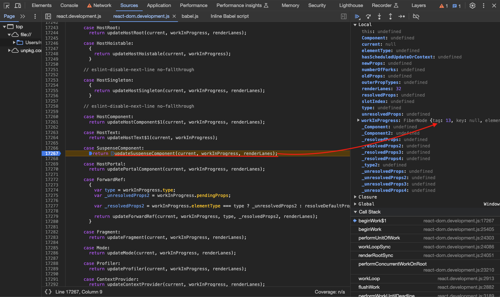
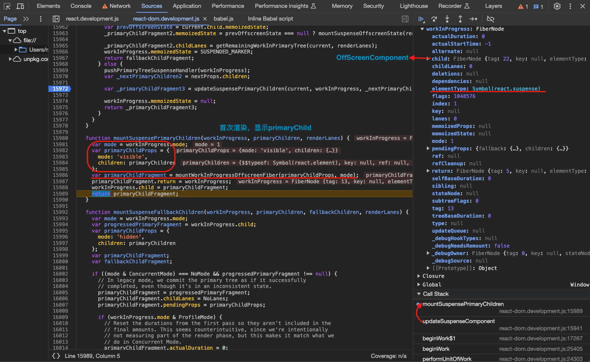
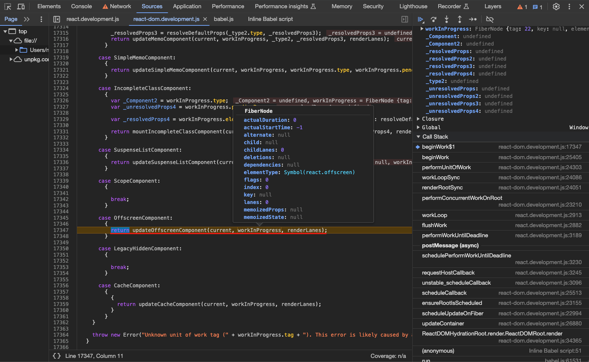
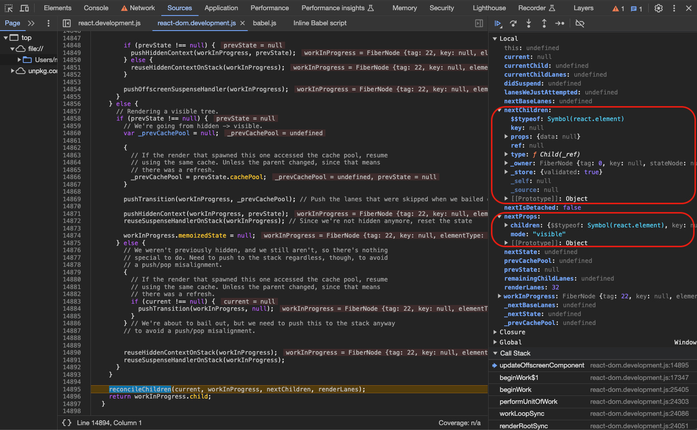
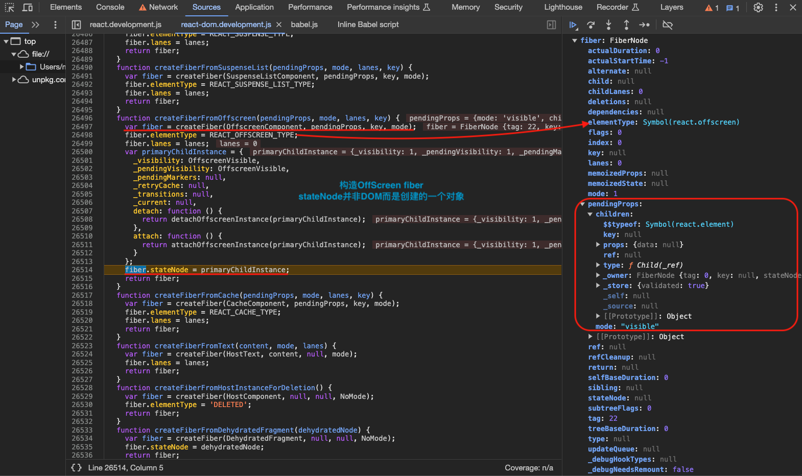
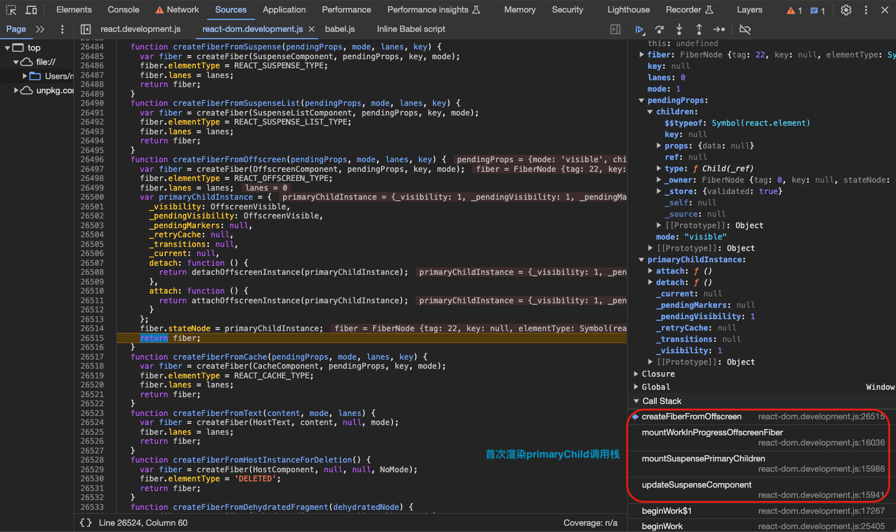

#### 更新阶段-先显示 fallback 再显示 primaryChild

```ts
// 【packages/react-reconciler/src/ReactFiberBeginWork.js】
// 【updateSuspenseComponent】
pushFallbackTreeSuspenseHandler(workInProgress);

const nextFallbackChildren = nextProps.fallback;
const nextPrimaryChildren = nextProps.children;
// 【fallback fiber更新】
const fallbackChildFragment = updateSuspenseFallbackChildren(
  current,
  workInProgress,
  nextPrimaryChildren,
  nextFallbackChildren,
  renderLanes,
);
const primaryChildFragment: Fiber = (workInProgress.child: any);
const prevOffscreenState: OffscreenState | null = (current.child: any)
  .memoizedState;
// 【primaryChild fiber创建/更新】
primaryChildFragment.memoizedState =
  prevOffscreenState === null
    ? mountSuspenseOffscreenState(renderLanes)
    : updateSuspenseOffscreenState(prevOffscreenState, renderLanes);

return fallbackChildFragment;
```

关键入口：

**`updateSuspenseFallbackChildren`** 构造`<Fragment>` + **`mountSuspenseOffscreenState`** / **`updateSuspenseOffscreenState`** 构造或更新`<OffscreenComponent>`

这一步是需要显示`fallback`的情况，不过在`updateSuspenseFallbackChildren`方法中，正式内容的`fiber`和`fallback`的`fiber`都会被创建/更新，如果`currentFallbackChildFragment`存在的话复用然后更新生成`workInProgress fallback fiber`，不存在的话就创建一个全新的`workInProgress fallback fiber`并打上`Placement`标记。最后`workInProgress`的`child`指向`<OffscreenComponent>`，`<OffscreenComponent>`的`sibling`指向`fallbackChildFragment`。可以看出，在`<SuspenseComponent>`范围这个`fiber`树是这样的，`<SuspenseComponent>`的直接子节点是`<OffscreenComponent>`,`<OffscreenComponent>`的兄弟节点是`<Fragment>`，两者在同一层级，但是会先显示`fallback fiber`再显示`primaryChild fiber`。

`<SuspenseComponent>`
||
🔽
`<OffscreenComponent>` => `<Fragment>`
`primaryChild fiber` => `fallback fiber`

```ts
// 【packages/react-reconciler/src/ReactFiberBeginWork.js】
function updateSuspenseFallbackChildren(
  current: Fiber,
  workInProgress: Fiber,
  primaryChildren: $FlowFixMe,
  fallbackChildren: $FlowFixMe,
  renderLanes: Lanes,
) {
  const mode = workInProgress.mode;
  const currentPrimaryChildFragment: Fiber = (current.child: any);
  const currentFallbackChildFragment: Fiber | null =
    currentPrimaryChildFragment.sibling;

  // 【改造常规的pendingProps，添加了mode，称之为OffscreenProps，用于后续构造Offscreen子内容的props】
  const primaryChildProps: OffscreenProps = {
    mode: 'hidden',
    children: primaryChildren,
  };

  let primaryChildFragment;
  if (
    // In legacy mode, we commit the primary tree as if it successfully
    // completed, even though it's in an inconsistent state.
    (mode & ConcurrentMode) === NoMode &&
    // Make sure we're on the second pass, i.e. the primary child fragment was
    // already cloned. In legacy mode, the only case where this isn't true is
    // when DevTools forces us to display a fallback; we skip the first render
    // pass entirely and go straight to rendering the fallback. (In Concurrent
    // Mode, SuspenseList can also trigger this scenario, but this is a legacy-
    // only codepath.)
    workInProgress.child !== currentPrimaryChildFragment
  ) {
    const progressedPrimaryFragment: Fiber = (workInProgress.child: any);
    primaryChildFragment = progressedPrimaryFragment;
    primaryChildFragment.childLanes = NoLanes;
    primaryChildFragment.pendingProps = primaryChildProps;

    if (enableProfilerTimer && workInProgress.mode & ProfileMode) {
      // Reset the durations from the first pass so they aren't included in the
      // final amounts. This seems counterintuitive, since we're intentionally
      // not measuring part of the render phase, but this makes it match what we
      // do in Concurrent Mode.
      primaryChildFragment.actualDuration = 0;
      primaryChildFragment.actualStartTime = -1;
      primaryChildFragment.selfBaseDuration =
        currentPrimaryChildFragment.selfBaseDuration;
      primaryChildFragment.treeBaseDuration =
        currentPrimaryChildFragment.treeBaseDuration;
    }

    // The fallback fiber was added as a deletion during the first pass.
    // However, since we're going to remain on the fallback, we no longer want
    // to delete it.
    workInProgress.deletions = null;
  } else {
    primaryChildFragment = updateWorkInProgressOffscreenFiber(
      currentPrimaryChildFragment,
      primaryChildProps,
    );
    // Since we're reusing a current tree, we need to reuse the flags, too.
    // (We don't do this in legacy mode, because in legacy mode we don't re-use
    // the current tree; see previous branch.)
    primaryChildFragment.subtreeFlags =
      currentPrimaryChildFragment.subtreeFlags & StaticMask;
  }

  let fallbackChildFragment;
  if (currentFallbackChildFragment !== null) {
    fallbackChildFragment = createWorkInProgress(
      currentFallbackChildFragment,
      fallbackChildren,
    );
  } else {
    fallbackChildFragment = createFiberFromFragment(
      fallbackChildren,
      mode,
      renderLanes,
      null,
    );
    // Needs a placement effect because the parent (the Suspense boundary) already
    // mounted but this is a new fiber.
    fallbackChildFragment.flags |= Placement;
  }

  fallbackChildFragment.return = workInProgress;
  primaryChildFragment.return = workInProgress;
  primaryChildFragment.sibling = fallbackChildFragment;
  workInProgress.child = primaryChildFragment;

  return fallbackChildFragment;
}
```

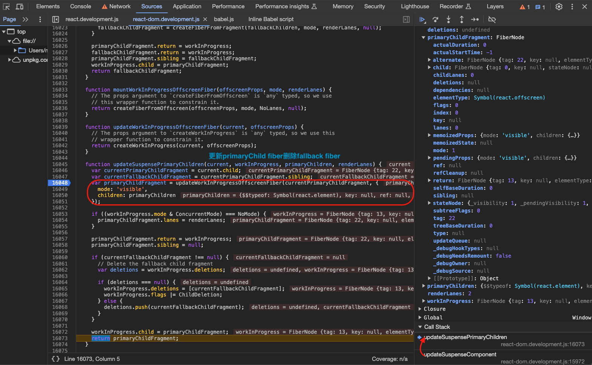
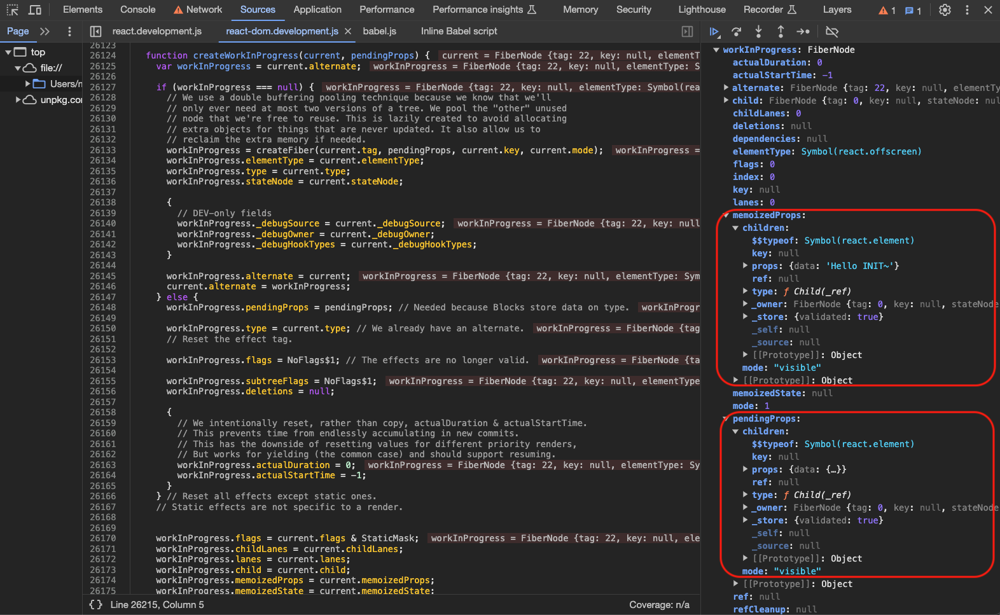
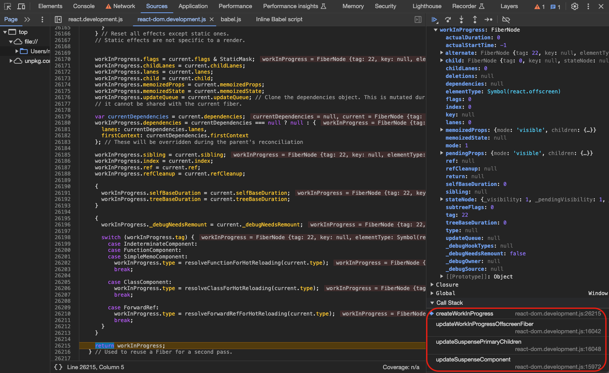

#### 更新阶段-直接显示 primaryChild

```ts
// 【packages/react-reconciler/src/ReactFiberBeginWork.js】
// 【updateSuspenseComponent】
pushPrimaryTreeSuspenseHandler(workInProgress)

const nextPrimaryChildren = nextProps.children
const primaryChildFragment = updateSuspensePrimaryChildren(
  current,
  workInProgress,
  nextPrimaryChildren,
  renderLanes,
)
workInProgress.memoizedState = null
return primaryChildFragment
```

关键入口：

**`updateSuspensePrimaryChildren`** 更新`<OffscreenComponent>`

`updateSuspensePrimaryChildren`主要是更新阶段构造`<SuspenseComponent>`正式内容的`fiber`，会在`current fiber`的基础上进行调整。完成后同样返回`updateSuspenseComponent`，此时`<SuspenseComponent>`包裹的正式内容的“壳”对应`<OffscreenComponent>`已更新，下一步`beginWork`就进入这个“壳”`<OffscreenComponent>`的`beginWork`过程也就会进入`updateOffscreenComponent`：

```ts
// 【packages/react-reconciler/src/ReactFiberBeginWork.js】
function updateSuspensePrimaryChildren(
  current: Fiber,
  workInProgress: Fiber,
  primaryChildren: $FlowFixMe,
  renderLanes: Lanes,
) {
  const currentPrimaryChildFragment: Fiber = (current.child: any);
  const currentFallbackChildFragment: Fiber | null =
    currentPrimaryChildFragment.sibling;

  // 【第二个参数仍是mode为visible的OffscreenProps】
  const primaryChildFragment = updateWorkInProgressOffscreenFiber(
    currentPrimaryChildFragment,
    {
      mode: 'visible',
      children: primaryChildren,
    },
  );
  if ((workInProgress.mode & ConcurrentMode) === NoMode) {
    primaryChildFragment.lanes = renderLanes;
  }
  primaryChildFragment.return = workInProgress;
  primaryChildFragment.sibling = null;
  // 【现在页面上的fallback内容对应fiber存在可以去除】
  if (currentFallbackChildFragment !== null) {
    // Delete the fallback child fragment
    const deletions = workInProgress.deletions;
    if (deletions === null) {
      workInProgress.deletions = [currentFallbackChildFragment];
      workInProgress.flags |= ChildDeletion;
    } else {
      deletions.push(currentFallbackChildFragment);
    }
  }

  workInProgress.child = primaryChildFragment;
  return primaryChildFragment;
}

function updateWorkInProgressOffscreenFiber(
  current: Fiber,
  offscreenProps: OffscreenProps,
) {
  // The props argument to `createWorkInProgress` is `any` typed, so we use this
  // wrapper function to constrain it.
  return createWorkInProgress(current, offscreenProps);
}

// This is used to create an alternate fiber to do work on.
export function createWorkInProgress(current: Fiber, pendingProps: any): Fiber {
  let workInProgress = current.alternate;
  if (workInProgress === null) {
    // We use a double buffering pooling technique because we know that we'll
    // only ever need at most two versions of a tree. We pool the "other" unused
    // node that we're free to reuse. This is lazily created to avoid allocating
    // extra objects for things that are never updated. It also allow us to
    // reclaim the extra memory if needed.
    workInProgress = createFiber(
      current.tag,
      pendingProps,
      current.key,
      current.mode,
    );
    workInProgress.elementType = current.elementType;
    workInProgress.type = current.type;
    workInProgress.stateNode = current.stateNode;

    if (__DEV__) {
      // DEV-only fields

      workInProgress._debugSource = current._debugSource;
      workInProgress._debugOwner = current._debugOwner;
      workInProgress._debugHookTypes = current._debugHookTypes;
    }

    workInProgress.alternate = current;
    current.alternate = workInProgress;
  } else {
    workInProgress.pendingProps = pendingProps;
    // Needed because Blocks store data on type.
    workInProgress.type = current.type;

    // We already have an alternate.
    // Reset the effect tag.
    workInProgress.flags = NoFlags;

    // The effects are no longer valid.
    workInProgress.subtreeFlags = NoFlags;
    workInProgress.deletions = null;

    if (enableProfilerTimer) {
      // We intentionally reset, rather than copy, actualDuration & actualStartTime.
      // This prevents time from endlessly accumulating in new commits.
      // This has the downside of resetting values for different priority renders,
      // But works for yielding (the common case) and should support resuming.
      workInProgress.actualDuration = 0;
      workInProgress.actualStartTime = -1;
    }
  }

  // Reset all effects except static ones.
  // Static effects are not specific to a render.
  workInProgress.flags = current.flags & StaticMask;
  workInProgress.childLanes = current.childLanes;
  workInProgress.lanes = current.lanes;

  workInProgress.child = current.child;
  workInProgress.memoizedProps = current.memoizedProps;
  workInProgress.memoizedState = current.memoizedState;
  workInProgress.updateQueue = current.updateQueue;

  // Clone the dependencies object. This is mutated during the render phase, so
  // it cannot be shared with the current fiber.
  const currentDependencies = current.dependencies;
  workInProgress.dependencies =
    currentDependencies === null
      ? null
      : {
          lanes: currentDependencies.lanes,
          firstContext: currentDependencies.firstContext,
        };

  // These will be overridden during the parent's reconciliation
  workInProgress.sibling = current.sibling;
  workInProgress.index = current.index;
  workInProgress.ref = current.ref;
  workInProgress.refCleanup = current.refCleanup;

  if (enableProfilerTimer) {
    workInProgress.selfBaseDuration = current.selfBaseDuration;
    workInProgress.treeBaseDuration = current.treeBaseDuration;
  }

  if (__DEV__) {
    workInProgress._debugNeedsRemount = current._debugNeedsRemount;
    switch (workInProgress.tag) {
      case IndeterminateComponent:
      case FunctionComponent:
      case SimpleMemoComponent:
        workInProgress.type = resolveFunctionForHotReloading(current.type);
        break;
      case ClassComponent:
        workInProgress.type = resolveClassForHotReloading(current.type);
        break;
      case ForwardRef:
        workInProgress.type = resolveForwardRefForHotReloading(current.type);
        break;
      default:
        break;
    }
  }

  return workInProgress;
}
```

### 先显示 fallback 然后切换到 primaryChild 原理

无论是在首次渲染还是更新阶段，先显示`fallback`再显示`primaryChild`的流程是何时如何进行转变的呢？我们可以先看`renderRootSync`和`renderRootConcurrent`：

```ts
// 【packages/react-reconciler/src/ReactFiberWorkLoop.js】
// When this is true, the work-in-progress fiber just suspended (or errored) and
// we've yet to unwind the stack. In some cases, we may yield to the main thread
// after this happens. If the fiber is pinged before we resume, we can retry
// immediately instead of unwinding the stack.
let workInProgressSuspendedReason: SuspendedReason = NotSuspended
let workInProgressThrownValue: mixed = null

function renderRootSync(root: FiberRoot, lanes: Lanes) {
  // 【省略代码...】

  outer: do {
    try {
      // 【workInProgressSuspendedReason判断suspense组件状态】
      if (workInProgressSuspendedReason !== NotSuspended && workInProgress !== null) {
        // The work loop is suspended. During a synchronous render, we don't
        // yield to the main thread. Immediately unwind the stack. This will
        // trigger either a fallback or an error boundary.
        // TODO: For discrete and "default" updates (anything that's not
        // flushSync), we want to wait for the microtasks the flush before
        // unwinding. Will probably implement this using renderRootConcurrent,
        // or merge renderRootSync and renderRootConcurrent into the same
        // function and fork the behavior some other way.
        const unitOfWork = workInProgress
        const thrownValue = workInProgressThrownValue
        switch (workInProgressSuspendedReason) {
          case SuspendedOnHydration: {
            // Selective hydration. An update flowed into a dehydrated tree.
            // Interrupt the current render so the work loop can switch to the
            // hydration lane.
            resetWorkInProgressStack()
            workInProgressRootExitStatus = RootDidNotComplete
            break outer
          }
          default: {
            // Continue with the normal work loop.
            workInProgressSuspendedReason = NotSuspended
            workInProgressThrownValue = null
            unwindSuspendedUnitOfWork(unitOfWork, thrownValue)
            break
          }
        }
      }

      workLoopSync()
      break
    } catch (thrownValue) {
      // 【-----suspense相关-----】
      handleThrow(root, thrownValue)
    }
  } while (true)
  // 【省略代码...】

  // It's safe to process the queue now that the render phase is complete.
  finishQueueingConcurrentUpdates()

  return workInProgressRootExitStatus
}
```

```ts
// 【packages/react-reconciler/src/ReactFiberWorkLoop.js】
// When this is true, the work-in-progress fiber just suspended (or errored) and
// we've yet to unwind the stack. In some cases, we may yield to the main thread
// after this happens. If the fiber is pinged before we resume, we can retry
// immediately instead of unwinding the stack.
let workInProgressSuspendedReason: SuspendedReason = NotSuspended;
let workInProgressThrownValue: mixed = null;

function renderRootConcurrent(root: FiberRoot, lanes: Lanes) {
  // 【省略代码...】

  outer: do {
    try {
      // 【workInProgressSuspendedReason判断suspense组件状态】
      if (
        workInProgressSuspendedReason !== NotSuspended &&
        workInProgress !== null
      ) {
        // The work loop is suspended. We need to either unwind the stack or
        // replay the suspended component.
        const unitOfWork = workInProgress;
        const thrownValue = workInProgressThrownValue;
        switch (workInProgressSuspendedReason) {
          case SuspendedOnError: {
            // Unwind then continue with the normal work loop.
            workInProgressSuspendedReason = NotSuspended;
            workInProgressThrownValue = null;
            unwindSuspendedUnitOfWork(unitOfWork, thrownValue);
            break;
          }
          case SuspendedOnData: {
            const thenable: Thenable<mixed> = (thrownValue: any);
            if (isThenableResolved(thenable)) {
              // The data resolved. Try rendering the component again.
              workInProgressSuspendedReason = NotSuspended;
              workInProgressThrownValue = null;
              replaySuspendedUnitOfWork(unitOfWork);
              break;
            }
            // The work loop is suspended on data. We should wait for it to
            // resolve before continuing to render.
            // TODO: Handle the case where the promise resolves synchronously.
            // Usually this is handled when we instrument the promise to add a
            // `status` field, but if the promise already has a status, we won't
            // have added a listener until right here.
            const onResolution = () => {
              // Check if the root is still suspended on this promise.
              if (
                workInProgressSuspendedReason === SuspendedOnData &&
                workInProgressRoot === root
              ) {
                // Mark the root as ready to continue rendering.
                workInProgressSuspendedReason = SuspendedAndReadyToContinue;
              }
              // Ensure the root is scheduled. We should do this even if we're
              // currently working on a different root, so that we resume
              // rendering later.
              ensureRootIsScheduled(root, now());
            };
            thenable.then(onResolution, onResolution);
            break outer;
          }
          case SuspendedOnImmediate: {
            // If this fiber just suspended, it's possible the data is already
            // cached. Yield to the main thread to give it a chance to ping. If
            // it does, we can retry immediately without unwinding the stack.
            workInProgressSuspendedReason = SuspendedAndReadyToContinue;
            break outer;
          }
          case SuspendedAndReadyToContinue: {
            const thenable: Thenable<mixed> = (thrownValue: any);
            if (isThenableResolved(thenable)) {
              // The data resolved. Try rendering the component again.
              workInProgressSuspendedReason = NotSuspended;
              workInProgressThrownValue = null;
              replaySuspendedUnitOfWork(unitOfWork);
            } else {
              // Otherwise, unwind then continue with the normal work loop.
              workInProgressSuspendedReason = NotSuspended;
              workInProgressThrownValue = null;
              unwindSuspendedUnitOfWork(unitOfWork, thrownValue);
            }
            break;
          }
          case SuspendedOnDeprecatedThrowPromise: {
            // Suspended by an old implementation that uses the `throw promise`
            // pattern. The newer replaying behavior can cause subtle issues
            // like infinite ping loops. So we maintain the old behavior and
            // always unwind.
            workInProgressSuspendedReason = NotSuspended;
            workInProgressThrownValue = null;
            unwindSuspendedUnitOfWork(unitOfWork, thrownValue);
            break;
          }
          case SuspendedOnHydration: {
            // Selective hydration. An update flowed into a dehydrated tree.
            // Interrupt the current render so the work loop can switch to the
            // hydration lane.
            resetWorkInProgressStack();
            workInProgressRootExitStatus = RootDidNotComplete;
            break outer;
          }
          default: {
            throw new Error(
              'Unexpected SuspendedReason. This is a bug in React.',
            );
          }
        }
      }

      if (__DEV__ && ReactCurrentActQueue.current !== null) {
        // `act` special case: If we're inside an `act` scope, don't consult
        // `shouldYield`. Always keep working until the render is complete.
        // This is not just an optimization: in a unit test environment, we
        // can't trust the result of `shouldYield`, because the host I/O is
        // likely mocked.
        workLoopSync();
      } else {
        workLoopConcurrent();
      }
      break;
    } catch (thrownValue) {
      // 【-----suspense相关-----】
      handleThrow(root, thrownValue);
    }
  } while (true);

  // 【省略代码...】
}
```

可以看到`workLoopSync`/`workLoopConcurrent`包裹在一个`try`、`catch`中，`catch`中会执行一个方法`handleError`，其实这个方法就是确定`workInProgressSuspendedReason`的方法。因为我们在`workLoopSync`/`workLoopConcurrent`过程中遇到组件有“异常”抛出可能就是遇到`Suspense`组件的正式内容抛出，但是也不排除有程序上的其他错误。用例中我们是手动写了抛出`Promise`，在`render`这个`Child`组件过程中我们就会抛出`Promise`，因此我们在`do while`循环`workLoopSync`/`workLoopConcurrent`的过程中用`catch`去捕捉这个异常，然后判断`<Suspense>`组件状态。除此之外，例如`beginWork`过程中同样也可能抛出异常如下：

```ts
// 【packages/react-reconciler/src/ReactFiberWorkLoop.js】
let beginWork
if (__DEV__ && replayFailedUnitOfWorkWithInvokeGuardedCallback) {
  const dummyFiber = null
  beginWork = (current: null | Fiber, unitOfWork: Fiber, lanes: Lanes) => {
    // If a component throws an error, we replay it again in a synchronously
    // dispatched event, so that the debugger will treat it as an uncaught
    // error See ReactErrorUtils for more information.

    // Before entering the begin phase, copy the work-in-progress onto a dummy
    // fiber. If beginWork throws, we'll use this to reset the state.
    const originalWorkInProgressCopy = assignFiberPropertiesInDEV(dummyFiber, unitOfWork)
    try {
      return originalBeginWork(current, unitOfWork, lanes)
    } catch (originalError) {
      if (
        didSuspendOrErrorWhileHydratingDEV() ||
        originalError === SuspenseException ||
        originalError === SelectiveHydrationException ||
        (originalError !== null &&
          typeof originalError === "object" &&
          typeof originalError.then === "function")
      ) {
        // Don't replay promises.
        // Don't replay errors if we are hydrating and have already suspended or handled an error
        // 【beginWork过程中也可能抛出error】
        throw originalError
      }

      // 【省略代码...】
    }
  }
} else {
  beginWork = originalBeginWork
}
```

每当前被`suspended`的组件`fiber`的`beginWork`完成之后，接下来进入到处理抛出异常的方法`handleError`：

1. `handleError`首先判断`error`类型，本例中`Promise`进入普通`error`处理分支；
2. `error.then`如果是方法（`thenable`）则`isWakeable`为`true`，`workInProgressSuspendedReason`就设置为`SuspendedOnDeprecatedThrowPromise`；
3. 然后分别调用`markComponentRenderStopped()`、`markComponentSuspended()`两个方法，表示当前组件节点 render 暂停了、当前组件节点被 suspened 了(要等 Promise 返回)的状态；
4. 然后继续回到`renderRootSync`/`renderRootConcurrent`中组件节点的 `completeUnitOfWork` 过程，因为`workInProgressSuspendedReason !== NotSuspended`所以会进入`throwAndUnwindWorkLoop(unitOfWork, thrownValue)`方法；

```ts
// 【packages/react-reconciler/src/ReactFiberWorkLoop.js】
function handleError(root, thrownValue): void {
  do {
    let erroredWork = workInProgress
    try {
      // Reset module-level state that was set during the render phase.
      resetContextDependencies()
      resetHooksAfterThrow()
      resetCurrentDebugFiberInDEV()
      // TODO: I found and added this missing line while investigating a
      // separate issue. Write a regression test using string refs.
      ReactCurrentOwner.current = null

      if (erroredWork === null || erroredWork.return === null) {
        // Expected to be working on a non-root fiber. This is a fatal error
        // because there's no ancestor that can handle it; the root is
        // supposed to capture all errors that weren't caught by an error
        // boundary.
        workInProgressRootExitStatus = RootFatalErrored
        workInProgressRootFatalError = thrownValue
        // Set `workInProgress` to null. This represents advancing to the next
        // sibling, or the parent if there are no siblings. But since the root
        // has no siblings nor a parent, we set it to null. Usually this is
        // handled by `completeUnitOfWork` or `unwindWork`, but since we're
        // intentionally not calling those, we need set it here.
        // TODO: Consider calling `unwindWork` to pop the contexts.
        workInProgress = null
        return
      }

      // 【省略代码...】
      // 【进入对抛出内容的处理逻辑】
      throwException(
        root,
        erroredWork.return,
        erroredWork,
        thrownValue,
        workInProgressRootRenderLanes,
      )
      completeUnitOfWork(erroredWork)
    } catch (yetAnotherThrownValue) {
      // Something in the return path also threw.
      thrownValue = yetAnotherThrownValue
      if (workInProgress === erroredWork && erroredWork !== null) {
        // If this boundary has already errored, then we had trouble processing
        // the error. Bubble it to the next boundary.
        erroredWork = erroredWork.return
        workInProgress = erroredWork
      } else {
        erroredWork = workInProgress
      }
      continue
    }
    // Return to the normal work loop.
    return
  } while (true)
}
```

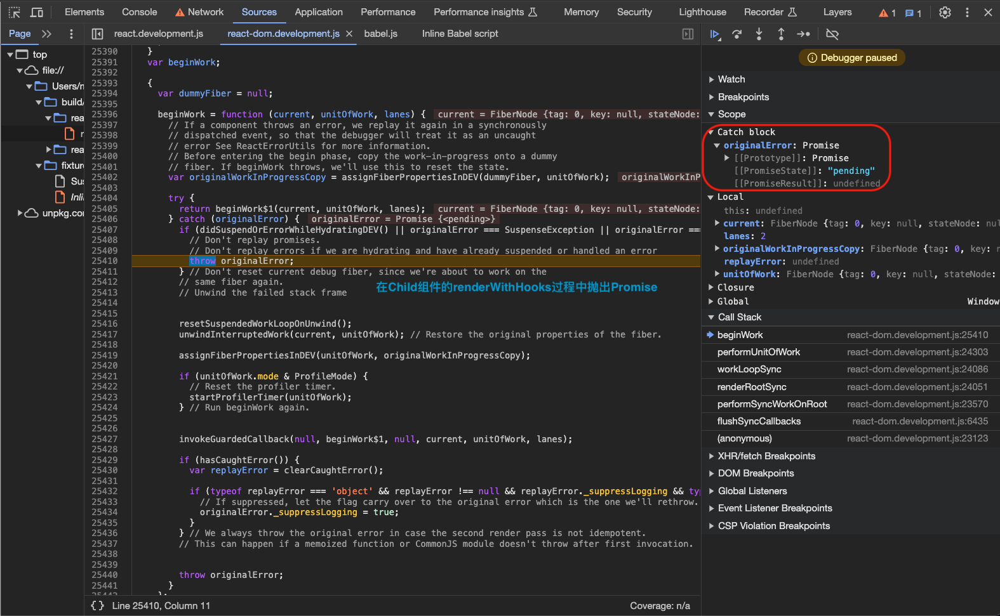
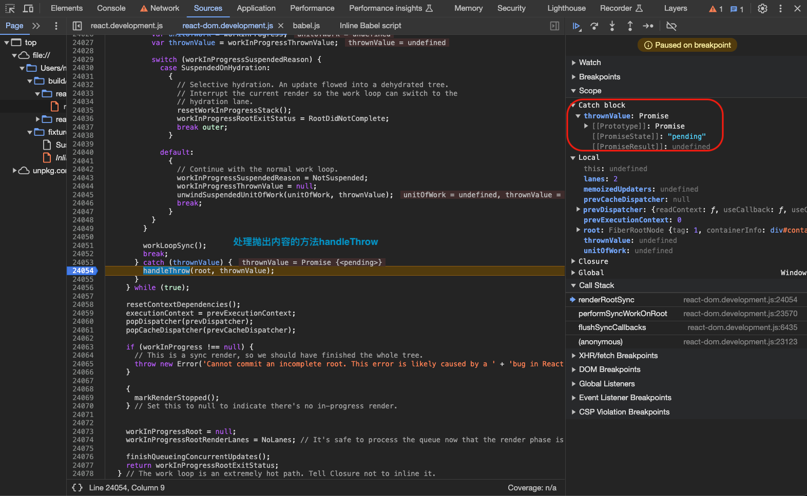

随后进入`throwException`方法：

1. 调用`throwException`方法，首先给当前被 suspended 的组件`fiber`标记`Incomplete`，然后找到离当前组件**最近**的`suspenseBoundary`也就是`<Suspense>`组件并添加 `DidCapture` 标志，是后续决定 `showFallback` 参数的重要 `flags`；
2. 将当前抛出的`Promise`加入`suspenseBoundary`的`updateQueue`队列；
3. `Concurrent`模式下`throwException`方法中还会调用`attachPingListener(root, wakeable, rootRenderLanes)`，这个方法会在`root`上添加`root.pingCache`，并且给当前这个`Promise`添加`.then(ping, ping)`也就是`ping`方法监听，这个是后面`Promise`被`resolve`之后去通知进行`fiber`切换的重要前置条件；

```ts
// 【packages/react-reconciler/src/ReactFiberWorkLoop.js】
function throwException(
  root: FiberRoot,
  returnFiber: Fiber,
  sourceFiber: Fiber,
  value: mixed,
  rootRenderLanes: Lanes,
) {
  // The source fiber did not complete.
  sourceFiber.flags |= Incomplete;

  // 【省略代码...】

  if (
    value !== null &&
    typeof value === 'object' &&
    typeof value.then === 'function'
  ) {
    // 【抛出内容是一个thenable对象，通常是一个promise】
    // This is a wakeable. The component suspended.
    const wakeable: Wakeable = (value: any);
    resetSuspendedComponent(sourceFiber, rootRenderLanes);

    // 【省略代码...】

    // Schedule the nearest Suspense to re-render the timed out view.
    // 【找到suspense边界，也就是被最近的哪个suspense组件包裹的】
    const suspenseBoundary = getNearestSuspenseBoundaryToCapture(returnFiber);
    if (suspenseBoundary !== null) {
      suspenseBoundary.flags &= ~ForceClientRender;
      markSuspenseBoundaryShouldCapture(
        suspenseBoundary,
        returnFiber,
        sourceFiber,
        root,
        rootRenderLanes,
      );
      // We only attach ping listeners in concurrent mode. Legacy Suspense always
      // commits fallbacks synchronously, so there are no pings.
      if (suspenseBoundary.mode & ConcurrentMode) {
        attachPingListener(root, wakeable, rootRenderLanes);
      }
      attachRetryListener(suspenseBoundary, root, wakeable, rootRenderLanes);
      return;
    } else {
      // No boundary was found. Unless this is a sync update, this is OK.
      // We can suspend and wait for more data to arrive.

      if (!includesSyncLane(rootRenderLanes)) {
        // This is not a sync update. Suspend. Since we're not activating a
        // Suspense boundary, this will unwind all the way to the root without
        // performing a second pass to render a fallback. (This is arguably how
        // refresh transitions should work, too, since we're not going to commit
        // the fallbacks anyway.)
        //
        // This case also applies to initial hydration.
        attachPingListener(root, wakeable, rootRenderLanes);
        renderDidSuspendDelayIfPossible();
        return;
      }

      // This is a sync/discrete update. We treat this case like an error
      // because discrete renders are expected to produce a complete tree
      // synchronously to maintain consistency with external state.
      const uncaughtSuspenseError = new Error(
        'A component suspended while responding to synchronous input. This ' +
          'will cause the UI to be replaced with a loading indicator. To ' +
          'fix, updates that suspend should be wrapped ' +
          'with startTransition.',
      );

      // If we're outside a transition, fall through to the regular error path.
      // The error will be caught by the nearest suspense boundary.
      value = uncaughtSuspenseError;
    }
  } else {
    // This is a regular error, not a Suspense wakeable.
    if (getIsHydrating() && sourceFiber.mode & ConcurrentMode) {
      markDidThrowWhileHydratingDEV();
      const suspenseBoundary = getNearestSuspenseBoundaryToCapture(returnFiber);
      // If the error was thrown during hydration, we may be able to recover by
      // discarding the dehydrated content and switching to a client render.
      // Instead of surfacing the error, find the nearest Suspense boundary
      // and render it again without hydration.
      if (suspenseBoundary !== null) {
        if ((suspenseBoundary.flags & ShouldCapture) === NoFlags) {
          // Set a flag to indicate that we should try rendering the normal
          // children again, not the fallback.
          suspenseBoundary.flags |= ForceClientRender;
        }
        markSuspenseBoundaryShouldCapture(
          suspenseBoundary,
          returnFiber,
          sourceFiber,
          root,
          rootRenderLanes,
        );

        // Even though the user may not be affected by this error, we should
        // still log it so it can be fixed.
        queueHydrationError(createCapturedValueAtFiber(value, sourceFiber));
        return;
      }
    } else {
      // Otherwise, fall through to the error path.
    }
  }

  value = createCapturedValueAtFiber(value, sourceFiber);
  renderDidError(value);

  // We didn't find a boundary that could handle this type of exception. Start
  // over and traverse parent path again, this time treating the exception
  // as an error.
  let workInProgress = returnFiber;
  do {
    switch (workInProgress.tag) {
      case HostRoot: {
        const errorInfo = value;
        workInProgress.flags |= ShouldCapture;
        const lane = pickArbitraryLane(rootRenderLanes);
        workInProgress.lanes = mergeLanes(workInProgress.lanes, lane);
        const update = createRootErrorUpdate(workInProgress, errorInfo, lane);
        enqueueCapturedUpdate(workInProgress, update);
        return;
      }
      case ClassComponent:
        // Capture and retry
        const errorInfo = value;
        const ctor = workInProgress.type;
        const instance = workInProgress.stateNode;
        if (
          (workInProgress.flags & DidCapture) === NoFlags &&
          (typeof ctor.getDerivedStateFromError === 'function' ||
            (instance !== null &&
              typeof instance.componentDidCatch === 'function' &&
              !isAlreadyFailedLegacyErrorBoundary(instance)))
        ) {
          workInProgress.flags |= ShouldCapture;
          const lane = pickArbitraryLane(rootRenderLanes);
          workInProgress.lanes = mergeLanes(workInProgress.lanes, lane);
          // Schedule the error boundary to re-render using updated state
          const update = createClassErrorUpdate(
            workInProgress,
            errorInfo,
            lane,
          );
          enqueueCapturedUpdate(workInProgress, update);
          return;
        }
        break;
      default:
        break;
    }
    workInProgress = workInProgress.return;
  } while (workInProgress !== null);
}

// 【packages/react-reconciler/src/ReactFiberThrow.js】
function attachPingListener(root: FiberRoot, wakeable: Wakeable, lanes: Lanes) {
  // Attach a ping listener
  //
  // The data might resolve before we have a chance to commit the fallback. Or,
  // in the case of a refresh, we'll never commit a fallback. So we need to
  // attach a listener now. When it resolves ("pings"), we can decide whether to
  // try rendering the tree again.
  //
  // Only attach a listener if one does not already exist for the lanes
  // we're currently rendering (which acts like a "thread ID" here).
  //
  // We only need to do this in concurrent mode. Legacy Suspense always
  // commits fallbacks synchronously, so there are no pings.
  let pingCache = root.pingCache;
  let threadIDs;
  if (pingCache === null) {
    pingCache = root.pingCache = new PossiblyWeakMap();
    threadIDs = new Set();
    pingCache.set(wakeable, threadIDs);
  } else {
    threadIDs = pingCache.get(wakeable);
    if (threadIDs === undefined) {
      threadIDs = new Set();
      pingCache.set(wakeable, threadIDs);
    }
  }
  if (!threadIDs.has(lanes)) {
    // Memoize using the thread ID to prevent redundant listeners.
    threadIDs.add(lanes);
    const ping = pingSuspendedRoot.bind(null, root, wakeable, lanes);
    if (enableUpdaterTracking) {
      if (isDevToolsPresent) {
        // If we have pending work still, restore the original updaters
        restorePendingUpdaters(root, lanes);
      }
    }
    wakeable.then(ping, ping);
  }
}

// 【packages/react-reconciler/src/ReactFiberWorkLoop.old.js】
export function pingSuspendedRoot(
  root: FiberRoot,
  wakeable: Wakeable,
  pingedLanes: Lanes,
) {
  const pingCache = root.pingCache;
  if (pingCache !== null) {
    // The wakeable resolved, so we no longer need to memoize, because it will
    // never be thrown again.
    pingCache.delete(wakeable);
  }

  const eventTime = requestEventTime();
  markRootPinged(root, pingedLanes, eventTime);

  warnIfSuspenseResolutionNotWrappedWithActDEV(root);

  if (
    workInProgressRoot === root &&
    isSubsetOfLanes(workInProgressRootRenderLanes, pingedLanes)
  ) {
    // Received a ping at the same priority level at which we're currently
    // rendering. We might want to restart this render. This should mirror
    // the logic of whether or not a root suspends once it completes.

    // TODO: If we're rendering sync either due to Sync, Batched or expired,
    // we should probably never restart.

    // If we're suspended with delay, or if it's a retry, we'll always suspend
    // so we can always restart.
    if (
      workInProgressRootExitStatus === RootSuspendedWithDelay ||
      (workInProgressRootExitStatus === RootSuspended &&
        includesOnlyRetries(workInProgressRootRenderLanes) &&
        now() - globalMostRecentFallbackTime < FALLBACK_THROTTLE_MS)
    ) {
      // Restart from the root.
      prepareFreshStack(root, NoLanes);
    } else {
      // Even though we can't restart right now, we might get an
      // opportunity later. So we mark this render as having a ping.
      workInProgressRootPingedLanes = mergeLanes(
        workInProgressRootPingedLanes,
        pingedLanes,
      );
    }
  }

  ensureRootIsScheduled(root, eventTime);
}
```

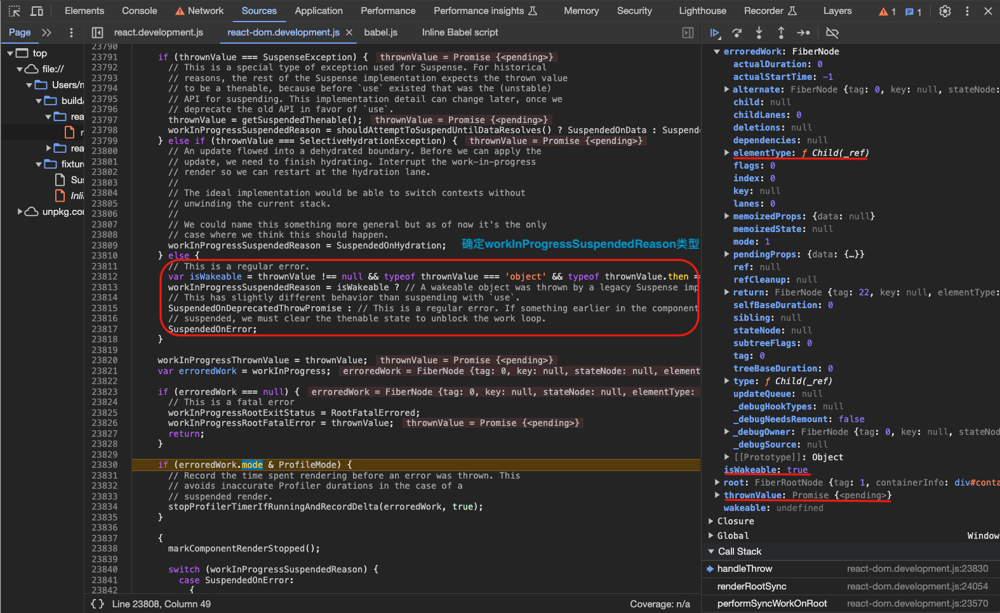
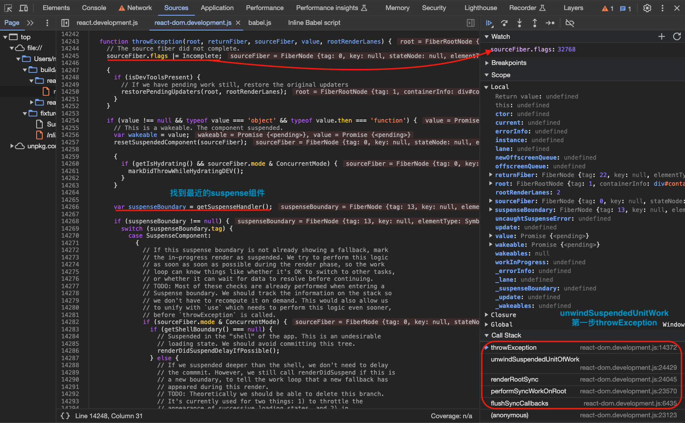
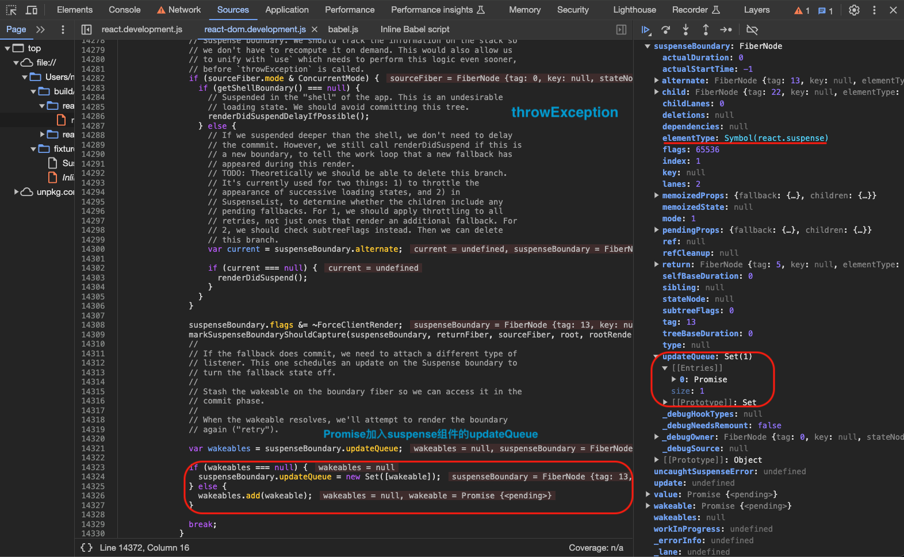
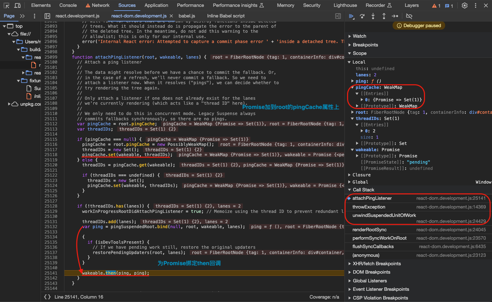

`throwException`方法，完成之后就会进入当前节点的`completeUnitOfWork()`方法：

和普通节点`completeUnitOfWork()`不同的是这一次走的是`Incomplete`这个处理路径从而进入`unwindWork`，已知前面已经给当前组件节点标记了`Incomplete`。可以看到只是处理了当前`<Child>`和`<OffscreenComponent>`的`flags`等等，`<OffscreenComponent>`的`flags`会被设置为`Incomplete`等待后续的处理，`subtreeFlags`设置为`NoFlags`，并没有进入真正的`completeWork`，因为正式内容要等`Promise`被`resolve`之后再显示。然后回到上一层`<OffscreenComponent>`节点进行`completeUnitOfWork(unitOfWork)`，同样的流程，最后，重新返回到`<suspense>`组件的`beginWork`流程中，`<OffscreenComponent>`节点的祖先节点`<Suspense>`的`flags`会被设置为`Incomplete`等待后续的处理，`subtreeFlags`设置为`NoFlags`。`showFallback`设置为`true`，`workInProgress.flags &= ~DidCapture`，这一次再往下走的话就会先显示`fallback fiber`再等`promise`被`resolve`之后显示`primary fiber`了。

在 React Fiber 架构中，当一个组件挂起（`Suspense`）或报错（`Error`）时，当前的渲染进度会被打断。`unwindWork` 的核心职责有两个：

1. 清理（Pop）：把渲染过程中压入栈的状态（如 Context、HostContainer）弹出，恢复环境。
2. 寻找捕获者（Find Catch）：寻找最近的能够处理该异常的祖先节点（如 `Suspense` 或 `ErrorBoundary`）。

`<Child>` => `<OffscreenComponent>` => `<Suspense>`

```ts
// 【packages/react-reconciler/src/ReactFiberWorkLoop.js】
function completeUnitOfWork(unitOfWork: Fiber): void {
  // Attempt to complete the current unit of work, then move to the next
  // sibling. If there are no more siblings, return to the parent fiber.
  let completedWork: Fiber = unitOfWork
  do {
    // The current, flushed, state of this fiber is the alternate. Ideally
    // nothing should rely on this, but relying on it here means that we don't
    // need an additional field on the work in progress.
    const current = completedWork.alternate
    const returnFiber = completedWork.return

    // Check if the work completed or if something threw.
    if ((completedWork.flags & Incomplete) === NoFlags) {
      // 【省略代码...】
    } else {
      // This fiber did not complete because something threw. Pop values off
      // the stack without entering the complete phase. If this is a boundary,
      // capture values if possible.
      // 【回溯到可以处理抛出“错误”的suspense组件】
      const next = unwindWork(current, completedWork, renderLanes)

      // Because this fiber did not complete, don't reset its lanes.

      if (next !== null) {
        // If completing this work spawned new work, do that next. We'll come
        // back here again.
        // Since we're restarting, remove anything that is not a host effect
        // from the effect tag.
        next.flags &= HostEffectMask
        workInProgress = next
        return
      }

      if (enableProfilerTimer && (completedWork.mode & ProfileMode) !== NoMode) {
        // Record the render duration for the fiber that errored.
        stopProfilerTimerIfRunningAndRecordDelta(completedWork, false)

        // Include the time spent working on failed children before continuing.
        let actualDuration = completedWork.actualDuration
        let child = completedWork.child
        while (child !== null) {
          // $FlowFixMe[unsafe-addition] addition with possible null/undefined value
          actualDuration += child.actualDuration
          child = child.sibling
        }
        completedWork.actualDuration = actualDuration
      }

      if (returnFiber !== null) {
        // Mark the parent fiber as incomplete and clear its subtree flags.
        returnFiber.flags |= Incomplete
        returnFiber.subtreeFlags = NoFlags
        returnFiber.deletions = null
      } else {
        // We've unwound all the way to the root.
        workInProgressRootExitStatus = RootDidNotComplete
        workInProgress = null
        return
      }
    }

    const siblingFiber = completedWork.sibling
    if (siblingFiber !== null) {
      // If there is more work to do in this returnFiber, do that next.
      workInProgress = siblingFiber
      return
    }
    // Otherwise, return to the parent
    // $FlowFixMe[incompatible-type] we bail out when we get a null
    completedWork = returnFiber
    // Update the next thing we're working on in case something throws.
    workInProgress = completedWork
  } while (completedWork !== null)

  // We've reached the root.
  if (workInProgressRootExitStatus === RootInProgress) {
    workInProgressRootExitStatus = RootCompleted
  }
}

// 【packages/react-reconciler/src/ReactFiberUnwindWork.js】
function unwindWork(
  current: Fiber | null,
  workInProgress: Fiber,
  renderLanes: Lanes,
): Fiber | null {
  // Note: This intentionally doesn't check if we're hydrating because comparing
  // to the current tree provider fiber is just as fast and less error-prone.
  // Ideally we would have a special version of the work loop only
  // for hydration.
  popTreeContext(workInProgress)
  switch (workInProgress.tag) {
    case ClassComponent: {
      const Component = workInProgress.type
      if (isLegacyContextProvider(Component)) {
        popLegacyContext(workInProgress)
      }
      const flags = workInProgress.flags
      if (flags & ShouldCapture) {
        workInProgress.flags = (flags & ~ShouldCapture) | DidCapture
        if (enableProfilerTimer && (workInProgress.mode & ProfileMode) !== NoMode) {
          transferActualDuration(workInProgress)
        }
        return workInProgress
      }
      return null
    }
    case HostRoot: {
      const root: FiberRoot = workInProgress.stateNode
      if (enableCache) {
        const cache: Cache = workInProgress.memoizedState.cache
        popCacheProvider(workInProgress, cache)
      }

      if (enableTransitionTracing) {
        popRootMarkerInstance(workInProgress)
      }

      popRootTransition(workInProgress, root, renderLanes)
      popHostContainer(workInProgress)
      popTopLevelLegacyContextObject(workInProgress)
      resetMutableSourceWorkInProgressVersions()
      const flags = workInProgress.flags
      if ((flags & ShouldCapture) !== NoFlags && (flags & DidCapture) === NoFlags) {
        // There was an error during render that wasn't captured by a suspense
        // boundary. Do a second pass on the root to unmount the children.
        workInProgress.flags = (flags & ~ShouldCapture) | DidCapture
        return workInProgress
      }
      // We unwound to the root without completing it. Exit.
      return null
    }
    case HostHoistable:
    case HostSingleton:
    case HostComponent: {
      // TODO: popHydrationState
      popHostContext(workInProgress)
      return null
    }
    case SuspenseComponent: {
      popSuspenseHandler(workInProgress)
      const suspenseState: null | SuspenseState = workInProgress.memoizedState
      if (suspenseState !== null && suspenseState.dehydrated !== null) {
        if (workInProgress.alternate === null) {
          throw new Error(
            "Threw in newly mounted dehydrated component. This is likely a bug in " +
              "React. Please file an issue.",
          )
        }

        resetHydrationState()
      }

      const flags = workInProgress.flags
      if (flags & ShouldCapture) {
        workInProgress.flags = (flags & ~ShouldCapture) | DidCapture
        // Captured a suspense effect. Re-render the boundary.
        if (enableProfilerTimer && (workInProgress.mode & ProfileMode) !== NoMode) {
          transferActualDuration(workInProgress)
        }
        return workInProgress
      }
      return null
    }
    case SuspenseListComponent: {
      popSuspenseListContext(workInProgress)
      // SuspenseList doesn't actually catch anything. It should've been
      // caught by a nested boundary. If not, it should bubble through.
      return null
    }
    case HostPortal:
      popHostContainer(workInProgress)
      return null
    case ContextProvider:
      const context: ReactContext<any> = workInProgress.type._context
      popProvider(context, workInProgress)
      return null
    case OffscreenComponent:
    case LegacyHiddenComponent: {
      popSuspenseHandler(workInProgress)
      popHiddenContext(workInProgress)
      popTransition(workInProgress, current)
      const flags = workInProgress.flags
      if (flags & ShouldCapture) {
        workInProgress.flags = (flags & ~ShouldCapture) | DidCapture
        // Captured a suspense effect. Re-render the boundary.
        if (enableProfilerTimer && (workInProgress.mode & ProfileMode) !== NoMode) {
          transferActualDuration(workInProgress)
        }
        return workInProgress
      }
      return null
    }
    case CacheComponent:
      if (enableCache) {
        const cache: Cache = workInProgress.memoizedState.cache
        popCacheProvider(workInProgress, cache)
      }
      return null
    case TracingMarkerComponent:
      if (enableTransitionTracing) {
        if (workInProgress.stateNode !== null) {
          popMarkerInstance(workInProgress)
        }
      }
      return null
    default:
      return null
  }
}
```

到目前为止，准备工作已完成，`<Suspense>`组件节点已标记`Incomplete`、`<Suspense>`组件节点的`updateQueue`已装载`Promise`且`flags`标记了`DidCapture`，`primaryChild fiber`建到组件`<Child>`这一层、`fallback fiber`已经完整建立。然后进入`commit`过程，此时`fallback`组件就会渲染在页面上面。

`commit`过程遇到`<OffscreenComponent>`流程如下：

1. 上一轮的在`commitLayoutEffectOnFiber`过程中确定`offscreenSubtreeIsHidden`/`offscreenSubtreeWasHidden`也就是`primaryChild`这次是显示还是隐藏和之前是显示还是隐藏；
2. 到这一轮的`commitMutationEffectsOnFiber`过程，调用`hideOrUnhideAllChildren`显示`fallback`的`DOM`内容；

```ts
// 【packages/react-reconciler/src/ReactFiberCommitWork.js】

// Used during the commit phase to track the state of the Offscreen component stack.
// Allows us to avoid traversing the return path to find the nearest Offscreen ancestor.
let offscreenSubtreeIsHidden: boolean = false;
let offscreenSubtreeWasHidden: boolean = false;

// 【commitLayoutEffectOnFiber】
case OffscreenComponent: {
  const isModernRoot = (finishedWork.mode & ConcurrentMode) !== NoMode;
  if (isModernRoot) {
    const isHidden = finishedWork.memoizedState !== null;
    const newOffscreenSubtreeIsHidden =
      isHidden || offscreenSubtreeIsHidden;
    if (newOffscreenSubtreeIsHidden) {
      // The Offscreen tree is hidden. Skip over its layout effects.
    } else {
      // The Offscreen tree is visible.

      const wasHidden = current !== null && current.memoizedState !== null;
      const newOffscreenSubtreeWasHidden =
        wasHidden || offscreenSubtreeWasHidden;
      const prevOffscreenSubtreeIsHidden = offscreenSubtreeIsHidden;
      const prevOffscreenSubtreeWasHidden = offscreenSubtreeWasHidden;
      offscreenSubtreeIsHidden = newOffscreenSubtreeIsHidden;
      offscreenSubtreeWasHidden = newOffscreenSubtreeWasHidden;

      if (offscreenSubtreeWasHidden && !prevOffscreenSubtreeWasHidden) {
        // This is the root of a reappearing boundary. As we continue
        // traversing the layout effects, we must also re-mount layout
        // effects that were unmounted when the Offscreen subtree was
        // hidden. So this is a superset of the normal commitLayoutEffects.
        const includeWorkInProgressEffects =
          (finishedWork.subtreeFlags & LayoutMask) !== NoFlags;
        recursivelyTraverseReappearLayoutEffects(
          finishedRoot,
          finishedWork,
          includeWorkInProgressEffects,
        );
      } else {
        recursivelyTraverseLayoutEffects(
          finishedRoot,
          finishedWork,
          committedLanes,
        );
      }
      offscreenSubtreeIsHidden = prevOffscreenSubtreeIsHidden;
      offscreenSubtreeWasHidden = prevOffscreenSubtreeWasHidden;
    }
  } else {
    recursivelyTraverseLayoutEffects(
      finishedRoot,
      finishedWork,
      committedLanes,
    );
  }
  if (flags & Ref) {
    const props: OffscreenProps = finishedWork.memoizedProps;
    if (props.mode === 'manual') {
      safelyAttachRef(finishedWork, finishedWork.return);
    } else {
      safelyDetachRef(finishedWork, finishedWork.return);
    }
  }
  break;
}


// 【commitMutationEffectsOnFiber】
const current = finishedWork.alternate;
const flags = finishedWork.flags;

case OffscreenComponent: {
  if (flags & Ref) {
    if (current !== null) {
      safelyDetachRef(current, current.return);
    }
  }

  const newState: OffscreenState | null = finishedWork.memoizedState;
  const isHidden = newState !== null;
  const wasHidden = current !== null && current.memoizedState !== null;

  if (finishedWork.mode & ConcurrentMode) {
    // Before committing the children, track on the stack whether this
    // offscreen subtree was already hidden, so that we don't unmount the
    // effects again.
    // 【获取Offscreen组件之前是显示还是隐藏的状态】
    const prevOffscreenSubtreeIsHidden = offscreenSubtreeIsHidden;
    const prevOffscreenSubtreeWasHidden = offscreenSubtreeWasHidden;
    offscreenSubtreeIsHidden = prevOffscreenSubtreeIsHidden || isHidden;
    offscreenSubtreeWasHidden = prevOffscreenSubtreeWasHidden || wasHidden;
    recursivelyTraverseMutationEffects(root, finishedWork, lanes);
    offscreenSubtreeWasHidden = prevOffscreenSubtreeWasHidden;
    offscreenSubtreeIsHidden = prevOffscreenSubtreeIsHidden;
  } else {
    recursivelyTraverseMutationEffects(root, finishedWork, lanes);
  }

  commitReconciliationEffects(finishedWork);

  const offscreenInstance: OffscreenInstance = finishedWork.stateNode;

  // TODO: Add explicit effect flag to set _current.
  offscreenInstance._current = finishedWork;

  // Offscreen stores pending changes to visibility in `_pendingVisibility`. This is
  // to support batching of `attach` and `detach` calls.
  offscreenInstance._visibility &= ~OffscreenDetached;
  offscreenInstance._visibility |=
    offscreenInstance._pendingVisibility & OffscreenDetached;

  if (flags & Visibility) {
    // Track the current state on the Offscreen instance so we can
    // read it during an event
    if (isHidden) {
      offscreenInstance._visibility &= ~OffscreenVisible;
    } else {
      offscreenInstance._visibility |= OffscreenVisible;
    }

    if (isHidden) {
      const isUpdate = current !== null;
      const wasHiddenByAncestorOffscreen =
        offscreenSubtreeIsHidden || offscreenSubtreeWasHidden;
      // Only trigger disapper layout effects if:
      //   - This is an update, not first mount.
      //   - This Offscreen was not hidden before.
      //   - Ancestor Offscreen was not hidden in previous commit.
      if (isUpdate && !wasHidden && !wasHiddenByAncestorOffscreen) {
        if ((finishedWork.mode & ConcurrentMode) !== NoMode) {
          // Disappear the layout effects of all the children
          recursivelyTraverseDisappearLayoutEffects(finishedWork);
        }
      }
    } else {
      if (wasHidden) {
        // TODO: Move re-appear call here for symmetry?
      }
    }

    // Offscreen with manual mode manages visibility manually.
    if (supportsMutation && !isOffscreenManual(finishedWork)) {
      // TODO: This needs to run whenever there's an insertion or update
      // inside a hidden Offscreen tree.
      // 【-----显示、隐藏子内容-----】
      hideOrUnhideAllChildren(finishedWork, isHidden);
    }
  }

  // TODO: Move to passive phase
  if (flags & Update) {
    const offscreenQueue: OffscreenQueue | null =
      (finishedWork.updateQueue: any);
    if (offscreenQueue !== null) {
      const wakeables = offscreenQueue.wakeables;
      if (wakeables !== null) {
        offscreenQueue.wakeables = null;
        attachSuspenseRetryListeners(finishedWork, wakeables);
      }
    }
  }
  return;
}

function hideOrUnhideAllChildren(finishedWork: Fiber, isHidden: boolean) {
  // Only hide or unhide the top-most host nodes.
  let hostSubtreeRoot = null;

  if (supportsMutation) {
    // We only have the top Fiber that was inserted but we need to recurse down its
    // children to find all the terminal nodes.
    let node: Fiber = finishedWork;
    while (true) {
      if (
        node.tag === HostComponent ||
        (enableFloat && supportsResources
          ? node.tag === HostHoistable
          : false) ||
        (enableHostSingletons && supportsSingletons
          ? node.tag === HostSingleton
          : false)
      ) {
        if (hostSubtreeRoot === null) {
          hostSubtreeRoot = node;
          try {
            const instance = node.stateNode;
            if (isHidden) {
              hideInstance(instance);
            } else {
              unhideInstance(node.stateNode, node.memoizedProps);
            }
          } catch (error) {
            captureCommitPhaseError(finishedWork, finishedWork.return, error);
          }
        }
      } else if (node.tag === HostText) {
        if (hostSubtreeRoot === null) {
          try {
            const instance = node.stateNode;
            if (isHidden) {
              hideTextInstance(instance);
            } else {
              unhideTextInstance(instance, node.memoizedProps);
            }
          } catch (error) {
            captureCommitPhaseError(finishedWork, finishedWork.return, error);
          }
        }
      } else if (
        (node.tag === OffscreenComponent ||
          node.tag === LegacyHiddenComponent) &&
        (node.memoizedState: OffscreenState) !== null &&
        node !== finishedWork
      ) {
        // Found a nested Offscreen component that is hidden.
        // Don't search any deeper. This tree should remain hidden.
      } else if (node.child !== null) {
        node.child.return = node;
        node = node.child;
        continue;
      }

      if (node === finishedWork) {
        return;
      }
      while (node.sibling === null) {
        if (node.return === null || node.return === finishedWork) {
          return;
        }

        if (hostSubtreeRoot === node) {
          hostSubtreeRoot = null;
        }

        node = node.return;
      }

      if (hostSubtreeRoot === node) {
        hostSubtreeRoot = null;
      }

      node.sibling.return = node.return;
      node = node.sibling;
    }
  }
}

export function hideInstance(instance: Instance): void {
  // TODO: Does this work for all element types? What about MathML? Should we
  // pass host context to this method?
  instance = ((instance: any): HTMLElement);
  const style = instance.style;
  // $FlowFixMe[method-unbinding]
  if (typeof style.setProperty === 'function') {
    style.setProperty('display', 'none', 'important');
  } else {
    style.display = 'none';
  }
}

export function unhideInstance(instance: Instance, props: Props): void {
  instance = ((instance: any): HTMLElement);
  const styleProp = props[STYLE];
  const display =
    styleProp !== undefined &&
    styleProp !== null &&
    styleProp.hasOwnProperty('display')
      ? styleProp.display
      : null;
  instance.style.display = dangerousStyleValue('display', display);
}
```

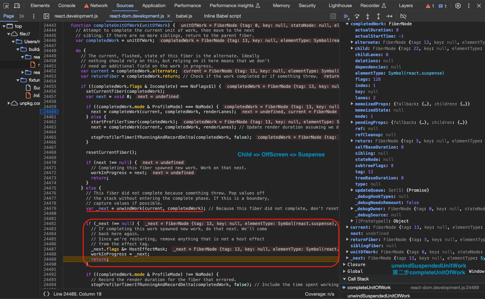
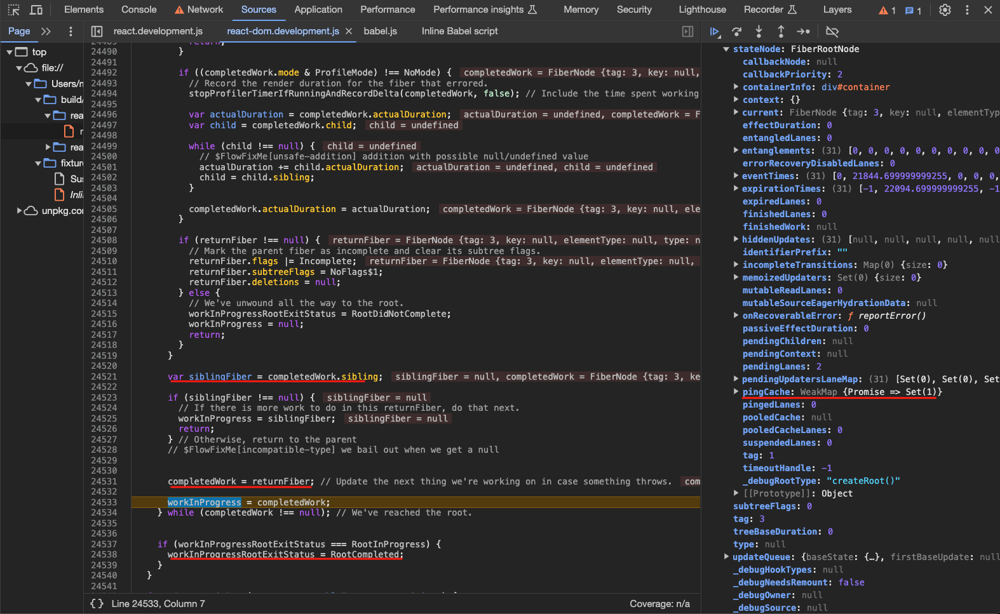

总结一下这部分内容：

1. `<Suspense>` 组件用 `DidCapture` 这个 `flag` 来判断要显示 `fallback` 还是 `primaryChild`；
2. `<Suspense>` 组件具体的内容是通过 `<OffscreenComponent>` 组件来包裹的，这样，即使显示的是 `fallback`，`<Suspense>` 组件具体的内容仍旧在整个 `fiber` 树上，状态仍然保存着；
3. 在 `render` 过程中会 `do/while` 循环执行 `workLoopSync`/`workLoopConcurrent` 的过程中尝试直接渲染`primaryChild`，一旦过程中如果有 `Promise` 抛出：
   - 先给当前组件表示 `Incomplete` 并找到最近的 `<Suspense>` 组件，然后标识最近的 `<Suspense>` 组件为 `DidCapture`，然后给 `Promise` 绑定 `ping` 回调
   - 然后从当前组件往上回溯到 `<Suspense>` 组件，统一标识为 `Incomplete`
   - 完成抛出 `Promise` 节点的 `completeUnitOfWork()` 过程并往上重新回到`<Suspense>` 组件的 `beginWork` 过程
4. `render` 过程结束之后进行 `commit` 过程，这个阶段确定之前的显示状态和即将要达成的显示状态，然后调用`hideOrUnhideAllChildren`显示内容；
5. 后面就是要讲当 `Promise` 被 `resolve` 之后如何引起 `rerender` 然后渲染 `<Suspense>` 组件具体内容的过程；

接下来就是`Promise`被`resolve`之后去将`fallback fiber`切换到`primaryChild fiber`显示正式内容的过程。

---

当 `Promise` 被 `resolve` 之后，就会调用`then`回调事件`ping`，前面已知`attachPingListener`方法除了将`wakeable（Promise）`加入根 `FiberRootNode` 节点的`pingCache`属性存储的`WeakMap`之外还会给这个`wakeable`绑定`then`回调事件`ping`，所以之前抛出的`Promise`在`resolve`之后其实会调用`ping`方法实质上是`pingSuspendedRoot`方法如下：

1. 从`root.pingCache`取出当前`wakeable（Promise）`；
2. `markRootPinged`标记`ping`成功；
3. 进入`ensureRootIsScheduled`方法进行`fallback`和`Offscreen`切换的任务调度；

```ts
// 【packages/react-reconciler/src/ReactFiberWorkLoop.js】
// 【attachPingListener】
const ping = pingSuspendedRoot.bind(null, root, wakeable, lanes)
if (enableUpdaterTracking) {
  if (isDevToolsPresent) {
    // If we have pending work still, restore the original updaters
    restorePendingUpdaters(root, lanes)
  }
}
wakeable.then(ping, ping)

function pingSuspendedRoot(root: FiberRoot, wakeable: Wakeable, pingedLanes: Lanes) {
  // 【当前异步任务完成，取出当前异步任务】
  const pingCache = root.pingCache
  if (pingCache !== null) {
    // The wakeable resolved, so we no longer need to memoize, because it will
    // never be thrown again.
    pingCache.delete(wakeable)
  }

  const eventTime = requestEventTime()
  markRootPinged(root, pingedLanes)

  warnIfSuspenseResolutionNotWrappedWithActDEV(root)

  if (workInProgressRoot === root && isSubsetOfLanes(workInProgressRootRenderLanes, pingedLanes)) {
    // Received a ping at the same priority level at which we're currently
    // rendering. We might want to restart this render. This should mirror
    // the logic of whether or not a root suspends once it completes.
    // TODO: If we're rendering sync either due to Sync, Batched or expired,
    // we should probably never restart.

    // If we're suspended with delay, or if it's a retry, we'll always suspend
    // so we can always restart.
    if (
      workInProgressRootExitStatus === RootSuspendedWithDelay ||
      (workInProgressRootExitStatus === RootSuspended &&
        includesOnlyRetries(workInProgressRootRenderLanes) &&
        now() - globalMostRecentFallbackTime < FALLBACK_THROTTLE_MS)
    ) {
      // Force a restart from the root by unwinding the stack. Unless this is
      // being called from the render phase, because that would cause a crash.
      if ((executionContext & RenderContext) === NoContext) {
        prepareFreshStack(root, NoLanes)
      } else {
        // TODO: If this does happen during the render phase, we should throw
        // the special internal exception that we use to interrupt the stack for
        // selective hydration. That was temporarily reverted but we once we add
        // it back we can use it here.
      }
    } else {
      // Even though we can't restart right now, we might get an
      // opportunity later. So we mark this render as having a ping.
      workInProgressRootPingedLanes = mergeLanes(workInProgressRootPingedLanes, pingedLanes)
    }
  }

  ensureRootIsScheduled(root, eventTime)
}
```

---

`performSyncWorkOnRoot` => ... => `commitMutationEffectsOnFiber` => `attachSuspenseRetryListeners` => `resolveRetryWakeable` => `retryTimedOutBoundary` => `ensureRootIsScheduled` => `performSyncWorkOnRoot`... => `updateSuspenseComponent` => `updateSuspensePrimaryChildren`

再次进入更新流程：

1. `commitMutationEffectsOnFiber`方法遇到`<SuspenseComponent>`、`<OffscreenComponent>`、`<SuspenseListComponent>`，若`flags`有`Update`标记就会进入`attachSuspenseRetryListeners`方法；
2. `attachSuspenseRetryListeners`方法主要是给之前的`Promise`（从`fiber.updateQueue`中取出）绑定`then`回调方法`resolveRetryWakeable`；
3. `Promise`被`resolve`之后就会进入`resolveRetryWakeable`方法，从而进入`retryTimedOutBoundary`方法，`retryTimedOutBoundary`方法会安排新的一次更新，这一次会构造和渲染`primaryChild fiber`，并移除`fallback fiber`；

```ts
// 【packages/react-reconciler/src/ReactFiberCommitWork.js】
function attachSuspenseRetryListeners(finishedWork: Fiber, wakeables: Set<Wakeable>) {
  // If this boundary just timed out, then it will have a set of wakeables.
  // For each wakeable, attach a listener so that when it resolves, React
  // attempts to re-render the boundary in the primary (pre-timeout) state.
  // 【给所有Promise绑定then回调】
  const retryCache = getRetryCache(finishedWork)
  wakeables.forEach((wakeable) => {
    // Memoize using the boundary fiber to prevent redundant listeners.
    const retry = resolveRetryWakeable.bind(null, finishedWork, wakeable)
    if (!retryCache.has(wakeable)) {
      retryCache.add(wakeable)

      if (enableUpdaterTracking) {
        if (isDevToolsPresent) {
          if (inProgressLanes !== null && inProgressRoot !== null) {
            // If we have pending work still, associate the original updaters with it.
            restorePendingUpdaters(inProgressRoot, inProgressLanes)
          } else {
            throw Error("Expected finished root and lanes to be set. This is a bug in React.")
          }
        }
      }

      wakeable.then(retry, retry)
    }
  })
}

// 【packages/react-reconciler/src/ReactFiberWorkLoop.js】
// 【Promise被resolve回调resolveRetryWakeable方法】
export function resolveRetryWakeable(boundaryFiber: Fiber, wakeable: Wakeable) {
  let retryLane = NoLane // Default
  let retryCache: WeakSet<Wakeable> | Set<Wakeable> | null
  switch (boundaryFiber.tag) {
    case SuspenseComponent:
      retryCache = boundaryFiber.stateNode
      const suspenseState: null | SuspenseState = boundaryFiber.memoizedState
      if (suspenseState !== null) {
        retryLane = suspenseState.retryLane
      }
      break
    case SuspenseListComponent:
      retryCache = boundaryFiber.stateNode
      break
    case OffscreenComponent: {
      const instance: OffscreenInstance = boundaryFiber.stateNode
      retryCache = instance._retryCache
      break
    }
    default:
      throw new Error(
        "Pinged unknown suspense boundary type. " + "This is probably a bug in React.",
      )
  }

  if (retryCache !== null) {
    // The wakeable resolved, so we no longer need to memoize, because it will
    // never be thrown again.
    retryCache.delete(wakeable)
  }

  retryTimedOutBoundary(boundaryFiber, retryLane)
}

function retryTimedOutBoundary(boundaryFiber: Fiber, retryLane: Lane) {
  // The boundary fiber (a Suspense component or SuspenseList component)
  // previously was rendered in its fallback state. One of the promises that
  // suspended it has resolved, which means at least part of the tree was
  // likely unblocked. Try rendering again, at a new lanes.
  if (retryLane === NoLane) {
    // TODO: Assign this to `suspenseState.retryLane`? to avoid
    // unnecessary entanglement?
    retryLane = requestRetryLane(boundaryFiber)
  }
  // TODO: Special case idle priority?
  const eventTime = requestEventTime()
  const root = enqueueConcurrentRenderForLane(boundaryFiber, retryLane)
  if (root !== null) {
    markRootUpdated(root, retryLane, eventTime)
    ensureRootIsScheduled(root, eventTime)
  }
}
```

## lazy 原理

### lazy 介绍

Usually, you import components with the static import declaration:

```ts
import MarkdownPreview from "./MarkdownPreview.js"
```

To defer loading this component’s code until it’s rendered for the first time, replace this import with:

```ts
import { lazy } from "react"

const MarkdownPreview = lazy(() => import("./MarkdownPreview.js"))
```

This code relies on dynamic `import()`, which might require support from your bundler or framework. Using this pattern requires that the lazy component you’re importing was exported as the default export.

Now that your component’s code loads on demand, you also need to specify what should be displayed while it is loading. You can do this by wrapping the lazy component or any of its parents into a `<Suspense>` boundary:

```JSX
<Suspense fallback={<Loading />}>
  <h2>Preview</h2>
  <MarkdownPreview />
</Suspense>
```

### lazy 原理深入

当我们在调用`React.lazy`这个 API 时构造了一个`REACT_LAZY_TYPE`类型的 `React-Element` 所以在后续进行`beginWork`和`completeWork`时进入`LazyComponent`这个分支进行处理，入口如下：

```ts
// 【packages/react/src/ReactLazy.js】
export type LazyComponent<T, P> = {
  $$typeof: symbol | number,
  _payload: P,
  _init: (payload: P) => T,
  _debugInfo?: null | ReactDebugInfo,
};

export function lazy<T>(
  ctor: () => Thenable<{default: T, ...}>,
): LazyComponent<T, Payload<T>> {
  // 【ctor是用户传入的内容，通常是个thenable对象，后续用于throw Error进而进入handleError】
  const payload: Payload<T> = {
    // We use these fields to store the result.
    _status: Uninitialized,
    _result: ctor,
  };

  const lazyType: LazyComponent<T, Payload<T>> = {
    $$typeof: REACT_LAZY_TYPE,
    _payload: payload,
    _init: lazyInitializer,
  };

  // 【省略代码...】

  return lazyType;
}

function lazyInitializer<T>(payload: Payload<T>): T {
  if (payload._status === Uninitialized) {
    const ctor = payload._result;
    const thenable = ctor();
    // Transition to the next state.
    // This might throw either because it's missing or throws. If so, we treat it
    // as still uninitialized and try again next time. Which is the same as what
    // happens if the ctor or any wrappers processing the ctor throws. This might
    // end up fixing it if the resolution was a concurrency bug.
    thenable.then(
      moduleObject => {
        if (payload._status === Pending || payload._status === Uninitialized) {
          // Transition to the next state.
          const resolved: ResolvedPayload<T> = (payload: any);
          resolved._status = Resolved;
          resolved._result = moduleObject;
        }
      },
      error => {
        if (payload._status === Pending || payload._status === Uninitialized) {
          // Transition to the next state.
          const rejected: RejectedPayload = (payload: any);
          rejected._status = Rejected;
          rejected._result = error;
        }
      },
    );
    if (payload._status === Uninitialized) {
      // In case, we're still uninitialized, then we're waiting for the thenable
      // to resolve. Set it as pending in the meantime.
      const pending: PendingPayload = (payload: any);
      pending._status = Pending;
      pending._result = thenable;
    }
  }
  if (payload._status === Resolved) {
    const moduleObject = payload._result;
    // 【省略代码...】
    return moduleObject.default;
  } else {
    throw payload._result;
  }
}
```

在`beginWork`阶段会进入`LazyComponent`分支继而进入`mountLazyComponent`方法：

```ts
// 【packages/react-reconciler/src/ReactFiberBeginWork.js】
function beginWork(current: Fiber | null, workInProgress: Fiber, renderLanes: Lanes): Fiber | null {
  if (current !== null) {
    // 【省略代码...】
  } else {
    // 【省略代码...】
  }

  // Before entering the begin phase, clear pending update priority.
  // TODO: This assumes that we're about to evaluate the component and process
  // the update queue. However, there's an exception: SimpleMemoComponent
  // sometimes bails out later in the begin phase. This indicates that we should
  // move this assignment out of the common path and into each branch.
  workInProgress.lanes = NoLanes

  switch (workInProgress.tag) {
    // 【省略代码...】
    // 【---处理LazyComponent组件---】
    case LazyComponent: {
      const elementType = workInProgress.elementType
      return mountLazyComponent(current, workInProgress, elementType, renderLanes)
    }
    // 【省略代码...】
  }
}
```

根据`LazyComponent`对应的`React-Element`上获取的`elementType`，调用`init(payload)`得到`LazyComponent`组件的构造函数`Component`：

```ts
// 【packages/react-reconciler/src/ReactFiberBeginWork.js】
function mountLazyComponent(
  _current: null | Fiber,
  workInProgress: Fiber,
  elementType: any,
  renderLanes: Lanes,
) {
  resetSuspendedCurrentOnMountInLegacyMode(_current, workInProgress)

  const props = workInProgress.pendingProps
  const lazyComponent: LazyComponentType<any, any> = elementType
  let Component
  if (__DEV__) {
    Component = callLazyInitInDEV(lazyComponent)
  } else {
    const payload = lazyComponent._payload
    const init = lazyComponent._init
    Component = init(payload)
  }
  // 【调用init(payload)获取lazy组件的构造函数】
  // Store the unwrapped component in the type.
  workInProgress.type = Component

  if (typeof Component === "function") {
    if (isFunctionClassComponent(Component)) {
      const resolvedProps = resolveClassComponentProps(Component, props, false)
      workInProgress.tag = ClassComponent
      if (__DEV__) {
        workInProgress.type = Component = resolveClassForHotReloading(Component)
      }
      return updateClassComponent(null, workInProgress, Component, resolvedProps, renderLanes)
    } else {
      const resolvedProps = disableDefaultPropsExceptForClasses
        ? props
        : resolveDefaultPropsOnNonClassComponent(Component, props)
      workInProgress.tag = FunctionComponent
      if (__DEV__) {
        validateFunctionComponentInDev(workInProgress, Component)
        workInProgress.type = Component = resolveFunctionForHotReloading(Component)
      }
      return updateFunctionComponent(null, workInProgress, Component, resolvedProps, renderLanes)
    }
  } else if (Component !== undefined && Component !== null) {
    const $$typeof = Component.$$typeof
    if ($$typeof === REACT_FORWARD_REF_TYPE) {
      const resolvedProps = disableDefaultPropsExceptForClasses
        ? props
        : resolveDefaultPropsOnNonClassComponent(Component, props)
      workInProgress.tag = ForwardRef
      if (__DEV__) {
        workInProgress.type = Component = resolveForwardRefForHotReloading(Component)
      }
      return updateForwardRef(null, workInProgress, Component, resolvedProps, renderLanes)
    } else if ($$typeof === REACT_MEMO_TYPE) {
      const resolvedProps = disableDefaultPropsExceptForClasses
        ? props
        : resolveDefaultPropsOnNonClassComponent(Component, props)
      workInProgress.tag = MemoComponent
      return updateMemoComponent(
        null,
        workInProgress,
        Component,
        disableDefaultPropsExceptForClasses
          ? resolvedProps
          : resolveDefaultPropsOnNonClassComponent(Component.type, resolvedProps), // The inner type can have defaults too
        renderLanes,
      )
    }
  }

  let hint = ""
  if (__DEV__) {
    if (
      Component !== null &&
      typeof Component === "object" &&
      Component.$$typeof === REACT_LAZY_TYPE
    ) {
      hint = " Did you wrap a component in React.lazy() more than once?"
    }
  }

  // This message intentionally doesn't mention ForwardRef or MemoComponent
  // because the fact that it's a separate type of work is an
  // implementation detail.
  throw new Error(
    `Element type is invalid. Received a promise that resolves to: ${Component}. ` +
      `Lazy element type must resolve to a class or function.${hint}`,
  )
}
```

`lazyInitializer`函数如下，它的入参是`lazyComponent._payload`由 lazy API 构造，初始`_status`是`Uninitialized`，`_result`是用户传入的`ctor`函数。因为初始`_status`是`Uninitialized`所以会去调用`ctor`函数得到一个 `Promise` 对象或者是 `thenable` 对象，并为其添加 `then` 回调。并且最后抛出`throw payload._result;`就会被`trycatch`捕捉并进入`handleError`方法。接下来的流程就如 `Suspense` 组件中讲的了。

```ts
// 【packages/react/src/ReactLazy.js】
const payload: Payload<T> = {
  // We use these fields to store the result.
  _status: Uninitialized,
  _result: ctor,
}

function lazyInitializer<T>(payload: Payload<T>): T {
  if (payload._status === Uninitialized) {
    const ctor = payload._result;
    const thenable = ctor();
    // Transition to the next state.
    // This might throw either because it's missing or throws. If so, we treat it
    // as still uninitialized and try again next time. Which is the same as what
    // happens if the ctor or any wrappers processing the ctor throws. This might
    // end up fixing it if the resolution was a concurrency bug.
    thenable.then(
      moduleObject => {
        if (
          (payload: Payload<T>)._status === Pending ||
          payload._status === Uninitialized
        ) {
          // Transition to the next state.
          const resolved: ResolvedPayload<T> = (payload: any);
          resolved._status = Resolved;
          resolved._result = moduleObject;
        }
      },
      error => {
        if (
          (payload: Payload<T>)._status === Pending ||
          payload._status === Uninitialized
        ) {
          // Transition to the next state.
          const rejected: RejectedPayload = (payload: any);
          rejected._status = Rejected;
          rejected._result = error;
        }
      },
    );
    if (payload._status === Uninitialized) {
      // In case, we're still uninitialized, then we're waiting for the thenable
      // to resolve. Set it as pending in the meantime.
      const pending: PendingPayload = (payload: any);
      pending._status = Pending;
      pending._result = thenable;
    }
  }
  if (payload._status === Resolved) {
    const moduleObject = payload._result;
    if (__DEV__) {
      if (moduleObject === undefined) {
        console.error(
          'lazy: Expected the result of a dynamic imp' +
            'ort() call. ' +
            'Instead received: %s\n\nYour code should look like: \n  ' +
            // Break up imports to avoid accidentally parsing them as dependencies.
            'const MyComponent = lazy(() => imp' +
            "ort('./MyComponent'))\n\n" +
            'Did you accidentally put curly braces around the import?',
          moduleObject,
        );
      }
    }
    if (__DEV__) {
      if (!('default' in moduleObject)) {
        console.error(
          'lazy: Expected the result of a dynamic imp' +
            'ort() call. ' +
            'Instead received: %s\n\nYour code should look like: \n  ' +
            // Break up imports to avoid accidentally parsing them as dependencies.
            'const MyComponent = lazy(() => imp' +
            "ort('./MyComponent'))",
          moduleObject,
        );
      }
    }
    return moduleObject.default;
  } else {
    throw payload._result;
  }
}
```

## use 原理

### use 介绍

use is a React API that lets you read the value of a resource like a Promise or context.

```ts
const value = use(resource)
```

Unlike React Hooks, use can be called within loops and conditional statements like if. Like React Hooks, the function that calls use must be a Component or Hook.

When called with a Promise, the use API integrates with Suspense and error boundaries. The component calling use suspends while the Promise passed to use is pending. If the component that calls use is wrapped in a Suspense boundary, the fallback will be displayed. Once the Promise is resolved, the Suspense fallback is replaced by the rendered components using the data returned by the use API. If the Promise passed to use is rejected, the fallback of the nearest Error Boundary will be displayed.

### use 原理深入

可以看到 use API 的入口如下，入参分为 `thenable` 方法或者 `context` 两种分别处理：

```ts
// 【packages/react-reconciler/src/ReactFiberHooks.js】
function use<T>(usable: Usable<T>): T {
  // 【use入参有两种可能性，一个是thenable方法，另一个是context】
  if (usable !== null && typeof usable === 'object') {
    // $FlowFixMe[method-unbinding]
    if (typeof usable.then === 'function') {
      // This is a thenable.
      // 【传入的是thenable方法】
      const thenable: Thenable<T> = (usable: any);
      return useThenable(thenable);
    } else if (usable.$$typeof === REACT_CONTEXT_TYPE) {
      // 【如果传入context，那逻辑和useContext一样】
      const context: ReactContext<T> = (usable: any);
      return readContext(context);
    }
  }

  // eslint-disable-next-line react-internal/safe-string-coercion
  throw new Error('An unsupported type was passed to use(): ' + String(usable));
}

function useThenable<T>(thenable: Thenable<T>): T {
  // Track the position of the thenable within this fiber.
  const index = thenableIndexCounter;
  thenableIndexCounter += 1;
  if (thenableState === null) {
    thenableState = createThenableState();
  }
  const result = trackUsedThenable(thenableState, thenable, index);

  // When something suspends with `use`, we replay the component with the
  // "re-render" dispatcher instead of the "mount" or "update" dispatcher.
  //
  // But if there are additional hooks that occur after the `use` invocation
  // that suspended, they wouldn't have been processed during the previous
  // attempt. So after we invoke `use` again, we may need to switch from the
  // "re-render" dispatcher back to the "mount" or "update" dispatcher. That's
  // what the following logic accounts for.
  //
  // TODO: Theoretically this logic only needs to go into the rerender
  // dispatcher. Could optimize, but probably not be worth it.

  // This is the same logic as in updateWorkInProgressHook.
  const workInProgressFiber = currentlyRenderingFiber;
  const nextWorkInProgressHook =
    workInProgressHook === null
      ? // We're at the beginning of the list, so read from the first hook from
        // the fiber.
        workInProgressFiber.memoizedState
      : workInProgressHook.next;

  if (nextWorkInProgressHook !== null) {
    // There are still hooks remaining from the previous attempt.
  } else {
    // There are no remaining hooks from the previous attempt. We're no longer
    // in "re-render" mode. Switch to the normal mount or update dispatcher.
    //
    // This is the same as the logic in renderWithHooks, except we don't bother
    // to track the hook types debug information in this case (sufficient to
    // only do that when nothing suspends).
    const currentFiber = workInProgressFiber.alternate;
    if (__DEV__) {
      if (currentFiber !== null && currentFiber.memoizedState !== null) {
        ReactSharedInternals.H = HooksDispatcherOnUpdateInDEV;
      } else {
        ReactSharedInternals.H = HooksDispatcherOnMountInDEV;
      }
    } else {
      ReactSharedInternals.H =
        currentFiber === null || currentFiber.memoizedState === null
          ? HooksDispatcherOnMount
          : HooksDispatcherOnUpdate;
    }
  }
  return result;
}

// 【packages/react-reconciler/src/ReactFiberThenable.js】
export function createThenableState(): ThenableState {
  // The ThenableState is created the first time a component suspends. If it
  // suspends again, we'll reuse the same state.
  if (__DEV__) {
    return {
      didWarnAboutUncachedPromise: false,
      thenables: [],
    };
  } else {
    return [];
  }
}
```

在处理 `thenable` 方法中的关键函数 `trackUsedThenable` 如下，最终 use API 返回的就是 `trackUsedThenable` 函数返回的内容，实质上会根据不同的情况抛出 `SuspenseException` 或者 `rejectedError` 再去结合 `<Suspense>` 组件或 `<ErrorBoundary>` 组件使用：

```ts
// 【packages/react-reconciler/src/ReactFiberThenable.js】
export function trackUsedThenable<T>(
  thenableState: ThenableState,
  thenable: Thenable<T>,
  index: number,
): T {
  // 【省略代码...】

  const trackedThenables = getThenablesFromState(thenableState);
  const previous = trackedThenables[index];
  if (previous === undefined) {
    trackedThenables.push(thenable);
  } else {
    if (previous !== thenable) {
      // Reuse the previous thenable, and drop the new one. We can assume
      // they represent the same value, because components are idempotent.

      // 【省略代码...】

      // Avoid an unhandled rejection errors for the Promises that we'll
      // intentionally ignore.
      thenable.then(noop, noop);
      thenable = previous;
    }
  }

  // We use an expando to track the status and result of a thenable so that we
  // can synchronously unwrap the value. Think of this as an extension of the
  // Promise API, or a custom interface that is a superset of Thenable.
  //
  // If the thenable doesn't have a status, set it to "pending" and attach
  // a listener that will update its status and result when it resolves.
  switch (thenable.status) {
    case 'fulfilled': {
      const fulfilledValue: T = thenable.value;
      return fulfilledValue;
    }
    case 'rejected': {
      const rejectedError = thenable.reason;
      checkIfUseWrappedInAsyncCatch(rejectedError);
      throw rejectedError;
    }
    default: {
      if (typeof thenable.status === 'string') {
        // Only instrument the thenable if the status if not defined. If
        // it's defined, but an unknown value, assume it's been instrumented by
        // some custom userspace implementation. We treat it as "pending".
        // Attach a dummy listener, to ensure that any lazy initialization can
        // happen. Flight lazily parses JSON when the value is actually awaited.
        thenable.then(noop, noop);
      } else {
        // This is an uncached thenable that we haven't seen before.

        // Detect infinite ping loops caused by uncached promises.
        const root = getWorkInProgressRoot();
        if (root !== null && root.shellSuspendCounter > 100) {
          // This root has suspended repeatedly in the shell without making any
          // progress (i.e. committing something). This is highly suggestive of
          // an infinite ping loop, often caused by an accidental Async Client
          // Component.
          //
          // During a transition, we can suspend the work loop until the promise
          // to resolve, but this is a sync render, so that's not an option. We
          // also can't show a fallback, because none was provided. So our last
          // resort is to throw an error.
          //
          // TODO: Remove this error in a future release. Other ways of handling
          // this case include forcing a concurrent render, or putting the whole
          // root into offscreen mode.
          throw new Error(
            'An unknown Component is an async Client Component. ' +
              'Only Server Components can be async at the moment. ' +
              'This error is often caused by accidentally ' +
              "adding `'use client'` to a module that was originally written " +
              'for the server.',
          );
        }

        const pendingThenable: PendingThenable<T> = (thenable: any);
        pendingThenable.status = 'pending';
        pendingThenable.then(
          fulfilledValue => {
            if (thenable.status === 'pending') {
              const fulfilledThenable: FulfilledThenable<T> = (thenable: any);
              fulfilledThenable.status = 'fulfilled';
              fulfilledThenable.value = fulfilledValue;
            }
          },
          (error: mixed) => {
            if (thenable.status === 'pending') {
              const rejectedThenable: RejectedThenable<T> = (thenable: any);
              rejectedThenable.status = 'rejected';
              rejectedThenable.reason = error;
            }
          },
        );
      }

      // Check one more time in case the thenable resolved synchronously.
      switch ((thenable: Thenable<T>).status) {
        case 'fulfilled': {
          const fulfilledThenable: FulfilledThenable<T> = (thenable: any);
          return fulfilledThenable.value;
        }
        case 'rejected': {
          const rejectedThenable: RejectedThenable<T> = (thenable: any);
          const rejectedError = rejectedThenable.reason;
          checkIfUseWrappedInAsyncCatch(rejectedError);
          throw rejectedError;
        }
      }

      // Suspend.
      //
      // Throwing here is an implementation detail that allows us to unwind the
      // call stack. But we shouldn't allow it to leak into userspace. Throw an
      // opaque placeholder value instead of the actual thenable. If it doesn't
      // get captured by the work loop, log a warning, because that means
      // something in userspace must have caught it.
      suspendedThenable = thenable;
      if (__DEV__) {
        needsToResetSuspendedThenableDEV = true;
      }
      throw SuspenseException;
    }
  }
}
```

## 总结

`<Suspense>` 组件：

1. `fallback fiber`由`<Fragment>`节点包裹，`primaryChild fiber`由`<OffscreenComponent>`节点包裹；
2. 根据`showFallback`决定是否要显示`fallback fiber`还是直接显示`primaryChild fiber`，`primaryChildProps`的`mode`是`visible`或者`hidden`用于显示或者隐藏`primaryChild fiber`；
3. React 默认假设你的应用是正常的，它会先尝试为 `primaryChild` 创建或更新 `Fiber` 节点，首先构造一个`offscreen fiber`然后进一步构造内部内容的fiber，此时就可能会抛出`Promise`。
4. 遇到`Promise`抛出，此时策略是先显示`fallback fiber`的时候，给`primaryChild fiber`构造一个`Offscreen`壳，给`fallback fiber`构造一个`Fragment`壳，并在`Fragment`壳上打上`Placement`标记，这个`Fragment`作为`Offscreen`的兄弟节点存在，`return`指向`Suspense fiber`，`Suspense fiber`会在`memoizedState`标记`SUSPENDED_MARKER`表明当前内容显示的是 `fallback fiber`；
5. 处理完`fallback fiber`的`beginWork`和`completeWork`阶段，回到`Suspense fiber`的`completeWork`阶段，此时会在`Suspense fiber`的`updateQueue`上会存储抛出的`Promise`实例，并且给`Suspense fiber`打上`Update`标记，完成一切后进入`commit`阶段；
6. `commit`的第二阶段`commitMutationEffects`过程中完成 DOM 的构建，此时会调用一个方法 `attachSuspenseRetryListeners` 给之前的 `Promise`（从`fiber.updateQueue`中取出）绑定`then`回调方法`resolveRetryWakeable`；
7. 一旦`Promise`被`resolve`之后就会进入回调`resolveRetryWakeable`方法，从而进入`retryTimedOutBoundary`方法，`retryTimedOutBoundary`方法会安排新的一次更新，这一次会构造和渲染`primaryChild fiber`，并移除`fallback fiber`，这样就完成了一次从 fallback UI 到正式内容 UI 的转换；

`lazy` API：

1. `lazy` 可以结合`<Suspense>`组件使用；
2. `lazy` 构造了`LazyComponent`，会手动进行 `throw Error`，继而进入`handleError`流程；

`use` API:

1. 接受 `thenable` 方法或者 `context` 作为参数;
2. 对 `thenable` 方法进行处理并抛出相应的 `error`，可配合 `<Suspense>` 组件或 `<ErrorBoundary>` 组件使用;


