# Suspense & Lazy

`<Suspense>` lets you display a fallback until its children have finished loading.

```html
<html>
  <body>
    <script src="../../../build/oss-experimental/react/umd/react.development.js"></script>
    <script src="../../../build/oss-experimental/react-dom/umd/react-dom.development.js"></script>
    <script src="https://unpkg.com/babel-standalone@6/babel.js"></script>
    <div id="container"></div>
    <script type="text/babel">
      const getData = (data, delay = 1000) => ({
        _data: null,
        _promise: null,
        status: "pending",
        get data() {
          if (this.status === "ready") {
            return this._data;
          } else {
            if (this._promise == null) {
              this._promise = new Promise((resolve) => {
                setTimeout(() => {
                  this._data = data;
                  this.status = "ready";
                  resolve();
                }, delay);
              });
            }
            throw this._promise;
          }
        },
      });
      
      function Child({ data }) {
        return data ? <h2>{data.data}</h2> : null;
      }

      function Loading() {
        return <h2>🌀 Loading...</h2>;
      }

      function App() {
        const [data, setData] = React.useState(null);
        return (
          <div className="app">
            <button
              onClick={() => {
                setData(getData("Hello HOBO~"));
              }}
            >
              获取数据
            </button>
            <React.Suspense fallback={<Loading />}>
              <Child data={data} />
            </React.Suspense>
          </div>
        );
      }

      const root = ReactDOM.createRoot(document.getElementById('container'))
      root.render(<App />);
    </script>
  </body>
</html>
```

## Suspense原理

前文已知`render`阶段要对节点进行`beginWork`和`completeWork`，然后我们来看`beginWork`是如何处理`suspense`组件的，可以看到会进入`updateSuspenseComponent`方法：

```ts
// 【packages/react-reconciler/src/ReactFiberBeginWork.js】
function beginWork(
  current: Fiber | null,
  workInProgress: Fiber,
  renderLanes: Lanes,
): Fiber | null {

  if (current !== null) {
    // 【省略代码...】
  } else {
    // 【省略代码...】
  }

  // Before entering the begin phase, clear pending update priority.
  // TODO: This assumes that we're about to evaluate the component and process
  // the update queue. However, there's an exception: SimpleMemoComponent
  // sometimes bails out later in the begin phase. This indicates that we should
  // move this assignment out of the common path and into each branch.
  workInProgress.lanes = NoLanes;

  switch (workInProgress.tag) {
    // 【省略代码...】
    // 【---处理suspense组件---】
    case SuspenseComponent:
      return updateSuspenseComponent(current, workInProgress, renderLanes);
    // 【省略代码...】
  }
}
```

1. 首先确定`showFallback`表示是否显示`fallback`；
2. 根据`current`是否存在，走首次渲染的情况或者更新的情况；
3. 如果是首次渲染，根据`showFallback`是否显示`fallback`，是的话调用`mountSuspenseFallbackChildren`，否则调用`mountSuspensePrimaryChildren`；
4. 根据`showFallback`是否显示`fallback`，是的话调用`updateSuspenseFallbackChildren`，否则调用`updateSuspensePrimaryChildren`；

```ts
// 【packages/react-reconciler/src/ReactFiberBeginWork.js】
function updateSuspenseComponent(
  current: null | Fiber,
  workInProgress: Fiber,
  renderLanes: Lanes,
) {
  const nextProps = workInProgress.pendingProps;

  // This is used by DevTools to force a boundary to suspend.
  if (__DEV__) {
    if (shouldSuspend(workInProgress)) {
      workInProgress.flags |= DidCapture;
    }
  }
  // 【showFallback控制是显示fallback内容还是正式的内容】
  let showFallback = false;
  const didSuspend = (workInProgress.flags & DidCapture) !== NoFlags;
  if (
    didSuspend ||
    shouldRemainOnFallback(current, workInProgress, renderLanes)
  ) {
    // Something in this boundary's subtree already suspended. Switch to
    // rendering the fallback children.
    showFallback = true;
    workInProgress.flags &= ~DidCapture;
  }

  // OK, the next part is confusing. We're about to reconcile the Suspense
  // boundary's children. This involves some custom reconciliation logic. Two
  // main reasons this is so complicated.
  //
  // First, Legacy Mode has different semantics for backwards compatibility. The
  // primary tree will commit in an inconsistent state, so when we do the
  // second pass to render the fallback, we do some exceedingly, uh, clever
  // hacks to make that not totally break. Like transferring effects and
  // deletions from hidden tree. In Concurrent Mode, it's much simpler,
  // because we bailout on the primary tree completely and leave it in its old
  // state, no effects. Same as what we do for Offscreen (except that
  // Offscreen doesn't have the first render pass).
  //
  // Second is hydration. During hydration, the Suspense fiber has a slightly
  // different layout, where the child points to a dehydrated fragment, which
  // contains the DOM rendered by the server.
  //
  // Third, even if you set all that aside, Suspense is like error boundaries in
  // that we first we try to render one tree, and if that fails, we render again
  // and switch to a different tree. Like a try/catch block. So we have to track
  // which branch we're currently rendering. Ideally we would model this using
  // a stack.
  // 【初次渲染】
  if (current === null) {
    // Initial mount

    // 【省略代码...】

    // 【fallback和正式内容对应的React-Element】
    const nextPrimaryChildren = nextProps.children;
    const nextFallbackChildren = nextProps.fallback;

    if (showFallback) {
      pushFallbackTreeSuspenseHandler(workInProgress);

      const fallbackFragment = mountSuspenseFallbackChildren(
        workInProgress,
        nextPrimaryChildren,
        nextFallbackChildren,
        renderLanes,
      );
      const primaryChildFragment: Fiber = (workInProgress.child: any);
      primaryChildFragment.memoizedState =
        mountSuspenseOffscreenState(renderLanes);
      workInProgress.memoizedState = SUSPENDED_MARKER;
      if (enableTransitionTracing) {
        const currentTransitions = getPendingTransitions();
        if (currentTransitions !== null) {
          const parentMarkerInstances = getMarkerInstances();
          const offscreenQueue: OffscreenQueue | null =
            (primaryChildFragment.updateQueue: any);
          if (offscreenQueue === null) {
            const newOffscreenQueue: OffscreenQueue = {
              transitions: currentTransitions,
              markerInstances: parentMarkerInstances,
              retryQueue: null,
            };
            primaryChildFragment.updateQueue = newOffscreenQueue;
          } else {
            offscreenQueue.transitions = currentTransitions;
            offscreenQueue.markerInstances = parentMarkerInstances;
          }
        }
      }

      return fallbackFragment;
    } else if (
      enableCPUSuspense &&
      typeof nextProps.unstable_expectedLoadTime === 'number'
    ) {
      // This is a CPU-bound tree. Skip this tree and show a placeholder to
      // unblock the surrounding content. Then immediately retry after the
      // initial commit.
      pushFallbackTreeSuspenseHandler(workInProgress);
      const fallbackFragment = mountSuspenseFallbackChildren(
        workInProgress,
        nextPrimaryChildren,
        nextFallbackChildren,
        renderLanes,
      );
      const primaryChildFragment: Fiber = (workInProgress.child: any);
      primaryChildFragment.memoizedState =
        mountSuspenseOffscreenState(renderLanes);
      workInProgress.memoizedState = SUSPENDED_MARKER;

      // TODO: Transition Tracing is not yet implemented for CPU Suspense.

      // Since nothing actually suspended, there will nothing to ping this to
      // get it started back up to attempt the next item. While in terms of
      // priority this work has the same priority as this current render, it's
      // not part of the same transition once the transition has committed. If
      // it's sync, we still want to yield so that it can be painted.
      // Conceptually, this is really the same as pinging. We can use any
      // RetryLane even if it's the one currently rendering since we're leaving
      // it behind on this node.
      workInProgress.lanes = SomeRetryLane;
      return fallbackFragment;
    } else {
      pushPrimaryTreeSuspenseHandler(workInProgress);
      return mountSuspensePrimaryChildren(
        workInProgress,
        nextPrimaryChildren,
        renderLanes,
      );
    }
  } else {
    // 【更新阶段】
    // This is an update.

    // Special path for hydration
    const prevState: null | SuspenseState = current.memoizedState;
    if (prevState !== null) {
      const dehydrated = prevState.dehydrated;
      if (dehydrated !== null) {
        return updateDehydratedSuspenseComponent(
          current,
          workInProgress,
          didSuspend,
          nextProps,
          dehydrated,
          prevState,
          renderLanes,
        );
      }
    }

    if (showFallback) {
      pushFallbackTreeSuspenseHandler(workInProgress);

      const nextFallbackChildren = nextProps.fallback;
      const nextPrimaryChildren = nextProps.children;
      const fallbackChildFragment = updateSuspenseFallbackChildren(
        current,
        workInProgress,
        nextPrimaryChildren,
        nextFallbackChildren,
        renderLanes,
      );
      const primaryChildFragment: Fiber = (workInProgress.child: any);
      const prevOffscreenState: OffscreenState | null = (current.child: any)
        .memoizedState;
      primaryChildFragment.memoizedState =
        prevOffscreenState === null
          ? mountSuspenseOffscreenState(renderLanes)
          : updateSuspenseOffscreenState(prevOffscreenState, renderLanes);
      if (enableTransitionTracing) {
        const currentTransitions = getPendingTransitions();
        if (currentTransitions !== null) {
          const parentMarkerInstances = getMarkerInstances();
          const offscreenQueue: OffscreenQueue | null =
            (primaryChildFragment.updateQueue: any);
          const currentOffscreenQueue: OffscreenQueue | null =
            (current.updateQueue: any);
          if (offscreenQueue === null) {
            const newOffscreenQueue: OffscreenQueue = {
              transitions: currentTransitions,
              markerInstances: parentMarkerInstances,
              retryQueue: null,
            };
            primaryChildFragment.updateQueue = newOffscreenQueue;
          } else if (offscreenQueue === currentOffscreenQueue) {
            // If the work-in-progress queue is the same object as current, we
            // can't modify it without cloning it first.
            const newOffscreenQueue: OffscreenQueue = {
              transitions: currentTransitions,
              markerInstances: parentMarkerInstances,
              retryQueue:
                currentOffscreenQueue !== null
                  ? currentOffscreenQueue.retryQueue
                  : null,
            };
            primaryChildFragment.updateQueue = newOffscreenQueue;
          } else {
            offscreenQueue.transitions = currentTransitions;
            offscreenQueue.markerInstances = parentMarkerInstances;
          }
        }
      }
      primaryChildFragment.childLanes = getRemainingWorkInPrimaryTree(
        current,
        renderLanes,
      );
      workInProgress.memoizedState = SUSPENDED_MARKER;
      return fallbackChildFragment;
    } else {
      pushPrimaryTreeSuspenseHandler(workInProgress);

      const nextPrimaryChildren = nextProps.children;
      const primaryChildFragment = updateSuspensePrimaryChildren(
        current,
        workInProgress,
        nextPrimaryChildren,
        renderLanes,
      );
      workInProgress.memoizedState = null;
      return primaryChildFragment;
    }
  }
}
```

### 构造`fallback fiber`和`primaryChild fiber`

判断首次渲染还是更新根据`current`是否存在，判断到底显示`fallback`还是`primaryChild`主要是`shouldRemainOnFallback`方法如下：

```ts
// 【packages/react-reconciler/src/ReactFiberBeginWork.js】
// TODO: Probably should inline this back
function shouldRemainOnFallback(
  current: null | Fiber,
  workInProgress: Fiber,
  renderLanes: Lanes,
) {
  // If we're already showing a fallback, there are cases where we need to
  // remain on that fallback regardless of whether the content has resolved.
  // For example, SuspenseList coordinates when nested content appears.
  if (current !== null) {
    const suspenseState: SuspenseState = current.memoizedState;
    if (suspenseState === null) {
      // Currently showing content. Don't hide it, even if ForceSuspenseFallback
      // is true. More precise name might be "ForceRemainSuspenseFallback".
      // Note: This is a factoring smell. Can't remain on a fallback if there's
      // no fallback to remain on.
      return false;
    }
  }

  // Not currently showing content. Consult the Suspense context.
  const suspenseContext: SuspenseContext = suspenseStackCursor.current;
  return hasSuspenseListContext(
    suspenseContext,
    (ForceSuspenseFallback: SuspenseContext),
  );
}
```

#### 首次渲染-先显示fallback再显示primaryChild

`updateSuspenseComponent` => `mountSuspenseFallbackChildren`

```ts
// 【packages/react-reconciler/src/ReactFiberBeginWork.js】
function mountSuspenseFallbackChildren(
  workInProgress: Fiber,
  primaryChildren: $FlowFixMe,
  fallbackChildren: $FlowFixMe,
  renderLanes: Lanes,
) {
  const mode = workInProgress.mode;
  const progressedPrimaryFragment: Fiber | null = workInProgress.child;

  const primaryChildProps: OffscreenProps = {
    mode: 'hidden',
    children: primaryChildren,
  };

  let primaryChildFragment;
  let fallbackChildFragment;
  if (
    (mode & ConcurrentMode) === NoMode &&
    progressedPrimaryFragment !== null
  ) {
    // In legacy mode, we commit the primary tree as if it successfully
    // completed, even though it's in an inconsistent state.
    primaryChildFragment = progressedPrimaryFragment;
    primaryChildFragment.childLanes = NoLanes;
    primaryChildFragment.pendingProps = primaryChildProps;

    if (enableProfilerTimer && workInProgress.mode & ProfileMode) {
      // Reset the durations from the first pass so they aren't included in the
      // final amounts. This seems counterintuitive, since we're intentionally
      // not measuring part of the render phase, but this makes it match what we
      // do in Concurrent Mode.
      primaryChildFragment.actualDuration = 0;
      primaryChildFragment.actualStartTime = -1;
      primaryChildFragment.selfBaseDuration = 0;
      primaryChildFragment.treeBaseDuration = 0;
    }

    fallbackChildFragment = createFiberFromFragment(
      fallbackChildren,
      mode,
      renderLanes,
      null,
    );
  } else {
    primaryChildFragment = mountWorkInProgressOffscreenFiber(
      primaryChildProps,
      mode,
      NoLanes,
    );
    fallbackChildFragment = createFiberFromFragment(
      fallbackChildren,
      mode,
      renderLanes,
      null,
    );
  }

  primaryChildFragment.return = workInProgress;
  fallbackChildFragment.return = workInProgress;
  primaryChildFragment.sibling = fallbackChildFragment;
  workInProgress.child = primaryChildFragment;
  return fallbackChildFragment;
}
```

#### 首次渲染-直接显示primaryChild

`updateSuspenseComponent` => `mountSuspensePrimaryChildren` => `mountWorkInProgressOffscreenFiber` => `createFiberFromOffscreen`

1. 改造`pendingProps`，添加了`mode`可以是`visible`或者`hidden`，相当于为`suspense`组件内部内容单独构造了一种`pendingProps`叫`OffscreenProps`；
2. 调用`mountWorkInProgressOffscreenFiber`，实际上进入`createFiberFromOffscreen`方法；
3. `createFiberFromOffscreen`方法实际就是创建`fiber`，和普通节点`fiber`不同的是`elementType`是`REACT_OFFSCREEN_TYPE`、`stateNode`并非`DOM`而是一个叫`primaryChildInstance`对象、`pendingProps`是第一步中构造的`OffscreenProps`；
4. 完成以上内容返回`updateSuspenseComponent`，此时`suspense`包裹的正式内容的“壳”对应`fiber`已构造好类型是`REACT_OFFSCREEN_TYPE`，下一步`beginWork`就进入这个“壳”`fiber`的`beginWork`过程；

```ts
// 【packages/react-reconciler/src/ReactFiberBeginWork.js】
function mountSuspensePrimaryChildren(
  workInProgress: Fiber,
  primaryChildren: $FlowFixMe,
  renderLanes: Lanes,
) {
  const mode = workInProgress.mode;
  // 【包裹改造常规的pendingProps，添加了mode，称之为OffscreenProps】
  const primaryChildProps: OffscreenProps = {
    mode: 'visible',
    children: primaryChildren,
  };
  // 【调用mountWorkInProgressOffscreenFiber，最终返回的是以Fragment包裹的fiber结构】
  const primaryChildFragment = mountWorkInProgressOffscreenFiber(
    primaryChildProps,
    mode,
    renderLanes,
  );
  primaryChildFragment.return = workInProgress;
  workInProgress.child = primaryChildFragment;
  return primaryChildFragment;
}

function mountWorkInProgressOffscreenFiber(
  offscreenProps: OffscreenProps,
  mode: TypeOfMode,
  renderLanes: Lanes,
) {
  // The props argument to `createFiberFromOffscreen` is `any` typed, so we use
  // this wrapper function to constrain it.
  return createFiberFromOffscreen(offscreenProps, mode, NoLanes, null);
}

export function createFiberFromOffscreen(
  pendingProps: OffscreenProps,
  mode: TypeOfMode,
  lanes: Lanes,
  key: null | string,
): Fiber {
  // 【构造fiber，pendingProps是之前经过改造的OffscreenProps】
  const fiber = createFiber(OffscreenComponent, pendingProps, key, mode);
  // 【suspense组件包裹的正式内容的类型为REACT_OFFSCREEN_TYPE】
  fiber.elementType = REACT_OFFSCREEN_TYPE;
  fiber.lanes = lanes;
  const primaryChildInstance: OffscreenInstance = {
    _visibility: OffscreenVisible,
    _pendingVisibility: OffscreenVisible,
    _pendingMarkers: null,
    _retryCache: null,
    _transitions: null,
    _current: null,
    detach: () => detachOffscreenInstance(primaryChildInstance),
    attach: () => attachOffscreenInstance(primaryChildInstance),
  };
  fiber.stateNode = primaryChildInstance;
  return fiber;
}
```

5. 进入`REACT_OFFSCREEN_TYPE`类型的`fiber`的`beginWork`过程，此时会进入`updateOffscreenComponent`；
6. 提取出`pendingProps`，这一次的`nextChild`是`pendingProps.children`属性，因为这个`pendingProps`是前面改造过的，同时还要用`pendingProps`的`mode`属性判断内容到底要不要显示；
7. 最后和其他`fiber`一样进入`reconcileChildren`进行子内容的`fiber`构造；

```ts
// 【packages/react-reconciler/src/ReactFiberBeginWork.js】
function updateOffscreenComponent(
  current: Fiber | null,
  workInProgress: Fiber,
  renderLanes: Lanes,
) {
  // 【OffscreenProps的Children作为nextChildren】
  const nextProps: OffscreenProps = workInProgress.pendingProps;
  const nextChildren = nextProps.children;
  const nextIsDetached =
    (workInProgress.stateNode._pendingVisibility & OffscreenDetached) !== 0;

  const prevState: OffscreenState | null =
    current !== null ? current.memoizedState : null;

  markRef(current, workInProgress);

  // 【OffscreenProps的mode用于判断】
  if (
    nextProps.mode === 'hidden' ||
    (enableLegacyHidden &&
      nextProps.mode === 'unstable-defer-without-hiding') ||
    nextIsDetached
  ) {
    // Rendering a hidden tree.

    const didSuspend = (workInProgress.flags & DidCapture) !== NoFlags;
    if (didSuspend) {
      // Something suspended inside a hidden tree

      // Include the base lanes from the last render
      const nextBaseLanes =
        prevState !== null
          ? mergeLanes(prevState.baseLanes, renderLanes)
          : renderLanes;

      if (current !== null) {
        // Reset to the current children
        let currentChild = (workInProgress.child = current.child);

        // The current render suspended, but there may be other lanes with
        // pending work. We can't read `childLanes` from the current Offscreen
        // fiber because we reset it when it was deferred; however, we can read
        // the pending lanes from the child fibers.
        let currentChildLanes = NoLanes;
        while (currentChild !== null) {
          currentChildLanes = mergeLanes(
            mergeLanes(currentChildLanes, currentChild.lanes),
            currentChild.childLanes,
          );
          currentChild = currentChild.sibling;
        }
        const lanesWeJustAttempted = nextBaseLanes;
        const remainingChildLanes = removeLanes(
          currentChildLanes,
          lanesWeJustAttempted,
        );
        workInProgress.childLanes = remainingChildLanes;
      } else {
        workInProgress.childLanes = NoLanes;
        workInProgress.child = null;
      }

      return deferHiddenOffscreenComponent(
        current,
        workInProgress,
        nextBaseLanes,
        renderLanes,
      );
    }

    if ((workInProgress.mode & ConcurrentMode) === NoMode) {
      // In legacy sync mode, don't defer the subtree. Render it now.
      // TODO: Consider how Offscreen should work with transitions in the future
      const nextState: OffscreenState = {
        baseLanes: NoLanes,
        cachePool: null,
      };
      workInProgress.memoizedState = nextState;
      if (enableCache) {
        // push the cache pool even though we're going to bail out
        // because otherwise there'd be a context mismatch
        if (current !== null) {
          pushTransition(workInProgress, null, null);
        }
      }
      reuseHiddenContextOnStack(workInProgress);
      pushOffscreenSuspenseHandler(workInProgress);
    } else if (!includesSomeLane(renderLanes, (OffscreenLane: Lane))) {
      // We're hidden, and we're not rendering at Offscreen. We will bail out
      // and resume this tree later.

      // Schedule this fiber to re-render at Offscreen priority
      workInProgress.lanes = workInProgress.childLanes =
        laneToLanes(OffscreenLane);

      // Include the base lanes from the last render
      const nextBaseLanes =
        prevState !== null
          ? mergeLanes(prevState.baseLanes, renderLanes)
          : renderLanes;

      return deferHiddenOffscreenComponent(
        current,
        workInProgress,
        nextBaseLanes,
        renderLanes,
      );
    } else {
      // This is the second render. The surrounding visible content has already
      // committed. Now we resume rendering the hidden tree.

      // Rendering at offscreen, so we can clear the base lanes.
      const nextState: OffscreenState = {
        baseLanes: NoLanes,
        cachePool: null,
      };
      workInProgress.memoizedState = nextState;
      if (enableCache && current !== null) {
        // If the render that spawned this one accessed the cache pool, resume
        // using the same cache. Unless the parent changed, since that means
        // there was a refresh.
        const prevCachePool = prevState !== null ? prevState.cachePool : null;
        // TODO: Consider if and how Offscreen pre-rendering should
        // be attributed to the transition that spawned it
        pushTransition(workInProgress, prevCachePool, null);
      }

      // Push the lanes that were skipped when we bailed out.
      if (prevState !== null) {
        pushHiddenContext(workInProgress, prevState);
      } else {
        reuseHiddenContextOnStack(workInProgress);
      }
      pushOffscreenSuspenseHandler(workInProgress);
    }
  } else {
    // Rendering a visible tree.
    if (prevState !== null) {
      // We're going from hidden -> visible.
      let prevCachePool = null;
      if (enableCache) {
        // If the render that spawned this one accessed the cache pool, resume
        // using the same cache. Unless the parent changed, since that means
        // there was a refresh.
        prevCachePool = prevState.cachePool;
      }

      let transitions = null;
      if (enableTransitionTracing) {
        // We have now gone from hidden to visible, so any transitions should
        // be added to the stack to get added to any Offscreen/suspense children
        const instance: OffscreenInstance | null = workInProgress.stateNode;
        if (instance !== null && instance._transitions != null) {
          transitions = Array.from(instance._transitions);
        }
      }

      pushTransition(workInProgress, prevCachePool, transitions);

      // Push the lanes that were skipped when we bailed out.
      pushHiddenContext(workInProgress, prevState);
      reuseSuspenseHandlerOnStack(workInProgress);

      // Since we're not hidden anymore, reset the state
      workInProgress.memoizedState = null;
    } else {
      // We weren't previously hidden, and we still aren't, so there's nothing
      // special to do. Need to push to the stack regardless, though, to avoid
      // a push/pop misalignment.

      if (enableCache) {
        // If the render that spawned this one accessed the cache pool, resume
        // using the same cache. Unless the parent changed, since that means
        // there was a refresh.
        if (current !== null) {
          pushTransition(workInProgress, null, null);
        }
      }

      // We're about to bail out, but we need to push this to the stack anyway
      // to avoid a push/pop misalignment.
      reuseHiddenContextOnStack(workInProgress);
      reuseSuspenseHandlerOnStack(workInProgress);
    }
  }

  reconcileChildren(current, workInProgress, nextChildren, renderLanes);
  return workInProgress.child;
}
```


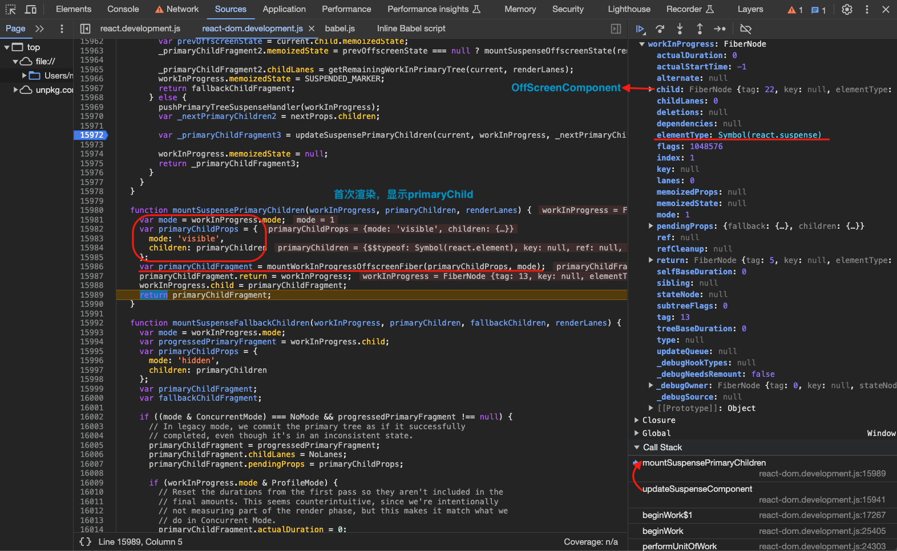


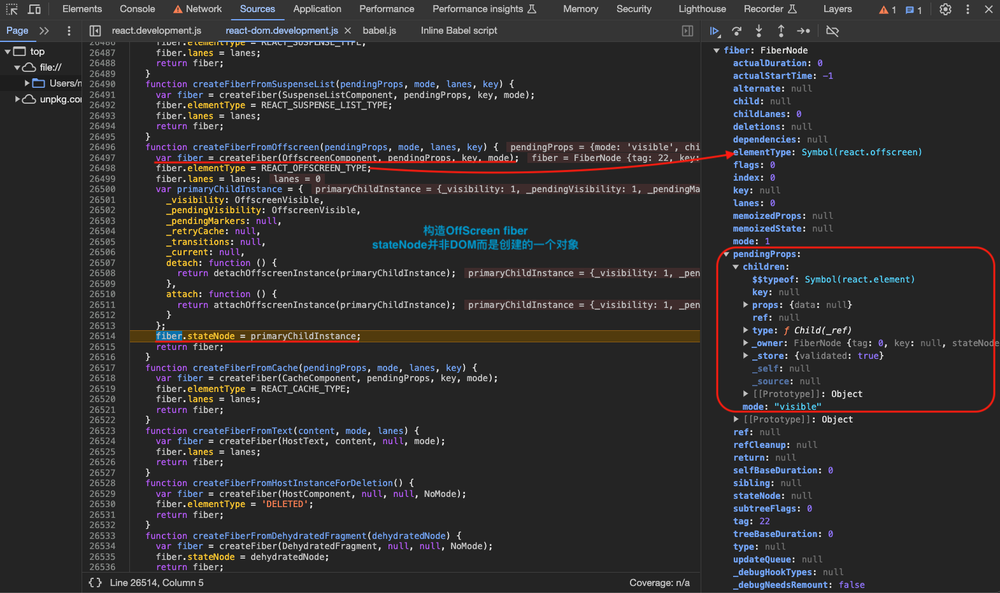
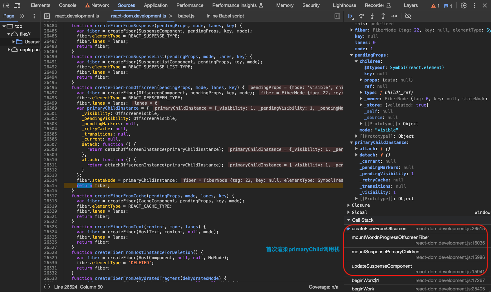

#### 更新阶段-先显示fallback再显示primaryChild

`updateSuspenseComponent` => `updateSuspenseFallbackChildren`

这一步是需要显示`fallback`的情况，不过在`updateSuspenseFallbackChildren`方法中，正式内容的`fiber`和`fallback`的`fiber`都会被创建/更新，如果`currentFallbackChildFragment`存在的话复用然后更新生成`workInProgress fallback fiber`，不存在的话就创建一个全新的`workInProgress fallback fiber`并打上`Placement`标记。最后`workInProgress`的`child`指向`primaryChildFragment`，`primaryChildFragment`的`sibling`指向`fallbackChildFragment`，`primaryChildFragment`和`fallbackChildFragment`。可以看出，在`suspense`范围这个`fiber`树是这样的，`suspense fiber`的直接子节点是`primaryChild fiber`,`primaryChild fiber`的兄弟节点是`fallback fiber`，两者在同一层级，但是会先显示`fallback fiber`再显示`primaryChild fiber`。最后会返回`fallback fiber`节点。

`suspense fiber`

      ||

      🔽

`primaryChild fiber`   =>   `fallback fiber`

```ts
// 【packages/react-reconciler/src/ReactFiberBeginWork.js】
function updateSuspenseFallbackChildren(
  current: Fiber,
  workInProgress: Fiber,
  primaryChildren: $FlowFixMe,
  fallbackChildren: $FlowFixMe,
  renderLanes: Lanes,
) {
  const mode = workInProgress.mode;
  const currentPrimaryChildFragment: Fiber = (current.child: any);
  const currentFallbackChildFragment: Fiber | null =
    currentPrimaryChildFragment.sibling;

  const primaryChildProps: OffscreenProps = {
    mode: 'hidden',
    children: primaryChildren,
  };

  let primaryChildFragment;
  if (
    // In legacy mode, we commit the primary tree as if it successfully
    // completed, even though it's in an inconsistent state.
    (mode & ConcurrentMode) === NoMode &&
    // Make sure we're on the second pass, i.e. the primary child fragment was
    // already cloned. In legacy mode, the only case where this isn't true is
    // when DevTools forces us to display a fallback; we skip the first render
    // pass entirely and go straight to rendering the fallback. (In Concurrent
    // Mode, SuspenseList can also trigger this scenario, but this is a legacy-
    // only codepath.)
    workInProgress.child !== currentPrimaryChildFragment
  ) {
    const progressedPrimaryFragment: Fiber = (workInProgress.child: any);
    primaryChildFragment = progressedPrimaryFragment;
    primaryChildFragment.childLanes = NoLanes;
    primaryChildFragment.pendingProps = primaryChildProps;

    if (enableProfilerTimer && workInProgress.mode & ProfileMode) {
      // Reset the durations from the first pass so they aren't included in the
      // final amounts. This seems counterintuitive, since we're intentionally
      // not measuring part of the render phase, but this makes it match what we
      // do in Concurrent Mode.
      primaryChildFragment.actualDuration = 0;
      primaryChildFragment.actualStartTime = -1;
      primaryChildFragment.selfBaseDuration =
        currentPrimaryChildFragment.selfBaseDuration;
      primaryChildFragment.treeBaseDuration =
        currentPrimaryChildFragment.treeBaseDuration;
    }

    // The fallback fiber was added as a deletion during the first pass.
    // However, since we're going to remain on the fallback, we no longer want
    // to delete it.
    workInProgress.deletions = null;
  } else {
    primaryChildFragment = updateWorkInProgressOffscreenFiber(
      currentPrimaryChildFragment,
      primaryChildProps,
    );
    // Since we're reusing a current tree, we need to reuse the flags, too.
    // (We don't do this in legacy mode, because in legacy mode we don't re-use
    // the current tree; see previous branch.)
    primaryChildFragment.subtreeFlags =
      currentPrimaryChildFragment.subtreeFlags & StaticMask;
  }

  let fallbackChildFragment;
  if (currentFallbackChildFragment !== null) {
    fallbackChildFragment = createWorkInProgress(
      currentFallbackChildFragment,
      fallbackChildren,
    );
  } else {
    fallbackChildFragment = createFiberFromFragment(
      fallbackChildren,
      mode,
      renderLanes,
      null,
    );
    // Needs a placement effect because the parent (the Suspense boundary) already
    // mounted but this is a new fiber.
    fallbackChildFragment.flags |= Placement;
  }

  fallbackChildFragment.return = workInProgress;
  primaryChildFragment.return = workInProgress;
  primaryChildFragment.sibling = fallbackChildFragment;
  workInProgress.child = primaryChildFragment;

  return fallbackChildFragment;
}
```

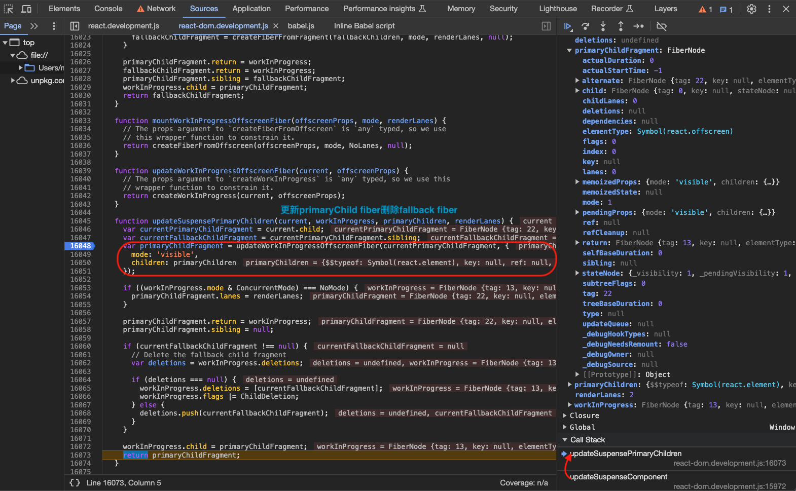

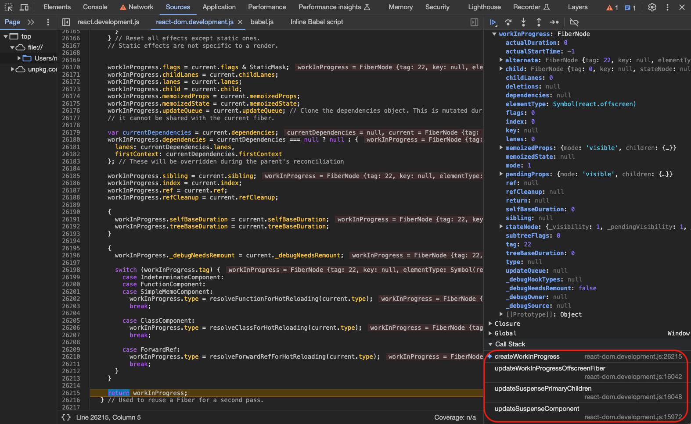

#### 更新阶段-直接显示primaryChild

`updateSuspenseComponent` => `updateSuspensePrimaryChildren` => `updateWorkInProgressOffscreenFiber` => `createWorkInProgress`

这几个方法主要是更新阶段构造`Suspense`正式内容的`fiber`，会在`current fiber`的基础上进行调整。完成后同样返回`updateSuspenseComponent`，此时`suspense`包裹的正式内容的“壳”对应`fiber`已更新，下一步`beginWork`就进入这个“壳”`fiber`的`beginWork`过程也就会进入`updateOffscreenComponent`；

```ts
// 【packages/react-reconciler/src/ReactFiberBeginWork.js】
function updateSuspensePrimaryChildren(
  current: Fiber,
  workInProgress: Fiber,
  primaryChildren: $FlowFixMe,
  renderLanes: Lanes,
) {
  const currentPrimaryChildFragment: Fiber = (current.child: any);
  const currentFallbackChildFragment: Fiber | null =
    currentPrimaryChildFragment.sibling;

  const primaryChildFragment = updateWorkInProgressOffscreenFiber(
    currentPrimaryChildFragment,
    {
      mode: 'visible',
      children: primaryChildren,
    },
  );
  if ((workInProgress.mode & ConcurrentMode) === NoMode) {
    primaryChildFragment.lanes = renderLanes;
  }
  primaryChildFragment.return = workInProgress;
  primaryChildFragment.sibling = null;
  // 【现在页面上的fallback内容对应fiber存在可以去除】
  if (currentFallbackChildFragment !== null) {
    // Delete the fallback child fragment
    const deletions = workInProgress.deletions;
    if (deletions === null) {
      workInProgress.deletions = [currentFallbackChildFragment];
      workInProgress.flags |= ChildDeletion;
    } else {
      deletions.push(currentFallbackChildFragment);
    }
  }

  workInProgress.child = primaryChildFragment;
  return primaryChildFragment;
}

function updateWorkInProgressOffscreenFiber(
  current: Fiber,
  offscreenProps: OffscreenProps,
) {
  // The props argument to `createWorkInProgress` is `any` typed, so we use this
  // wrapper function to constrain it.
  return createWorkInProgress(current, offscreenProps);
}

// This is used to create an alternate fiber to do work on.
export function createWorkInProgress(current: Fiber, pendingProps: any): Fiber {
  let workInProgress = current.alternate;
  if (workInProgress === null) {
    // We use a double buffering pooling technique because we know that we'll
    // only ever need at most two versions of a tree. We pool the "other" unused
    // node that we're free to reuse. This is lazily created to avoid allocating
    // extra objects for things that are never updated. It also allow us to
    // reclaim the extra memory if needed.
    workInProgress = createFiber(
      current.tag,
      pendingProps,
      current.key,
      current.mode,
    );
    workInProgress.elementType = current.elementType;
    workInProgress.type = current.type;
    workInProgress.stateNode = current.stateNode;

    if (__DEV__) {
      // DEV-only fields

      workInProgress._debugSource = current._debugSource;
      workInProgress._debugOwner = current._debugOwner;
      workInProgress._debugHookTypes = current._debugHookTypes;
    }

    workInProgress.alternate = current;
    current.alternate = workInProgress;
  } else {
    workInProgress.pendingProps = pendingProps;
    // Needed because Blocks store data on type.
    workInProgress.type = current.type;

    // We already have an alternate.
    // Reset the effect tag.
    workInProgress.flags = NoFlags;

    // The effects are no longer valid.
    workInProgress.subtreeFlags = NoFlags;
    workInProgress.deletions = null;

    if (enableProfilerTimer) {
      // We intentionally reset, rather than copy, actualDuration & actualStartTime.
      // This prevents time from endlessly accumulating in new commits.
      // This has the downside of resetting values for different priority renders,
      // But works for yielding (the common case) and should support resuming.
      workInProgress.actualDuration = 0;
      workInProgress.actualStartTime = -1;
    }
  }

  // Reset all effects except static ones.
  // Static effects are not specific to a render.
  workInProgress.flags = current.flags & StaticMask;
  workInProgress.childLanes = current.childLanes;
  workInProgress.lanes = current.lanes;

  workInProgress.child = current.child;
  workInProgress.memoizedProps = current.memoizedProps;
  workInProgress.memoizedState = current.memoizedState;
  workInProgress.updateQueue = current.updateQueue;

  // Clone the dependencies object. This is mutated during the render phase, so
  // it cannot be shared with the current fiber.
  const currentDependencies = current.dependencies;
  workInProgress.dependencies =
    currentDependencies === null
      ? null
      : {
          lanes: currentDependencies.lanes,
          firstContext: currentDependencies.firstContext,
        };

  // These will be overridden during the parent's reconciliation
  workInProgress.sibling = current.sibling;
  workInProgress.index = current.index;
  workInProgress.ref = current.ref;
  workInProgress.refCleanup = current.refCleanup;

  if (enableProfilerTimer) {
    workInProgress.selfBaseDuration = current.selfBaseDuration;
    workInProgress.treeBaseDuration = current.treeBaseDuration;
  }

  if (__DEV__) {
    workInProgress._debugNeedsRemount = current._debugNeedsRemount;
    switch (workInProgress.tag) {
      case IndeterminateComponent:
      case FunctionComponent:
      case SimpleMemoComponent:
        workInProgress.type = resolveFunctionForHotReloading(current.type);
        break;
      case ClassComponent:
        workInProgress.type = resolveClassForHotReloading(current.type);
        break;
      case ForwardRef:
        workInProgress.type = resolveForwardRefForHotReloading(current.type);
        break;
      default:
        break;
    }
  }

  return workInProgress;
}
```

### 先显示fallback然后切换到primaryChild原理

无论是在首次渲染还是更新阶段，先显示`fallback`再显示`primaryChild`的流程是何时如何进行转变的呢？我们可以先看`renderRootSync`/`renderRootConcurrent`：

```ts
// 【packages/react-reconciler/src/ReactFiberWorkLoop.js】
// When this is true, the work-in-progress fiber just suspended (or errored) and
// we've yet to unwind the stack. In some cases, we may yield to the main thread
// after this happens. If the fiber is pinged before we resume, we can retry
// immediately instead of unwinding the stack.
let workInProgressSuspendedReason: SuspendedReason = NotSuspended;
let workInProgressThrownValue: mixed = null;

function renderRootSync(root: FiberRoot, lanes: Lanes) {
  // 【省略代码...】

  outer: do {
    try {
      if (
        workInProgressSuspendedReason !== NotSuspended &&
        workInProgress !== null
      ) {
        // The work loop is suspended. During a synchronous render, we don't
        // yield to the main thread. Immediately unwind the stack. This will
        // trigger either a fallback or an error boundary.
        // TODO: For discrete and "default" updates (anything that's not
        // flushSync), we want to wait for the microtasks the flush before
        // unwinding. Will probably implement this using renderRootConcurrent,
        // or merge renderRootSync and renderRootConcurrent into the same
        // function and fork the behavior some other way.
        const unitOfWork = workInProgress;
        const thrownValue = workInProgressThrownValue;
        switch (workInProgressSuspendedReason) {
          case SuspendedOnHydration: {
            // Selective hydration. An update flowed into a dehydrated tree.
            // Interrupt the current render so the work loop can switch to the
            // hydration lane.
            resetWorkInProgressStack();
            workInProgressRootExitStatus = RootDidNotComplete;
            break outer;
          }
          default: {
            // Continue with the normal work loop.
            workInProgressSuspendedReason = NotSuspended;
            workInProgressThrownValue = null;
            unwindSuspendedUnitOfWork(unitOfWork, thrownValue);
            break;
          }
        }
      }
      workLoopSync();
      break;
    } catch (thrownValue) {
      handleThrow(root, thrownValue);
    }
  } while (true);
  resetContextDependencies();

  executionContext = prevExecutionContext;
  popDispatcher(prevDispatcher);
  popCacheDispatcher(prevCacheDispatcher);

  // 【省略代码...】

  // Set this to null to indicate there's no in-progress render.
  workInProgressRoot = null;
  workInProgressRootRenderLanes = NoLanes;

  // It's safe to process the queue now that the render phase is complete.
  finishQueueingConcurrentUpdates();

  return workInProgressRootExitStatus;
}
```

```ts
// 【packages/react-reconciler/src/ReactFiberWorkLoop.js】
// When this is true, the work-in-progress fiber just suspended (or errored) and
// we've yet to unwind the stack. In some cases, we may yield to the main thread
// after this happens. If the fiber is pinged before we resume, we can retry
// immediately instead of unwinding the stack.
let workInProgressSuspendedReason: SuspendedReason = NotSuspended;
let workInProgressThrownValue: mixed = null;

function renderRootConcurrent(root: FiberRoot, lanes: Lanes) {
  // 【省略代码...】

  outer: do {
    try {
      if (
        workInProgressSuspendedReason !== NotSuspended &&
        workInProgress !== null
      ) {
        // The work loop is suspended. We need to either unwind the stack or
        // replay the suspended component.
        const unitOfWork = workInProgress;
        const thrownValue = workInProgressThrownValue;
        switch (workInProgressSuspendedReason) {
          case SuspendedOnError: {
            // Unwind then continue with the normal work loop.
            workInProgressSuspendedReason = NotSuspended;
            workInProgressThrownValue = null;
            unwindSuspendedUnitOfWork(unitOfWork, thrownValue);
            break;
          }
          case SuspendedOnData: {
            const thenable: Thenable<mixed> = (thrownValue: any);
            if (isThenableResolved(thenable)) {
              // The data resolved. Try rendering the component again.
              workInProgressSuspendedReason = NotSuspended;
              workInProgressThrownValue = null;
              replaySuspendedUnitOfWork(unitOfWork);
              break;
            }
            // The work loop is suspended on data. We should wait for it to
            // resolve before continuing to render.
            // TODO: Handle the case where the promise resolves synchronously.
            // Usually this is handled when we instrument the promise to add a
            // `status` field, but if the promise already has a status, we won't
            // have added a listener until right here.
            const onResolution = () => {
              // Check if the root is still suspended on this promise.
              if (
                workInProgressSuspendedReason === SuspendedOnData &&
                workInProgressRoot === root
              ) {
                // Mark the root as ready to continue rendering.
                workInProgressSuspendedReason = SuspendedAndReadyToContinue;
              }
              // Ensure the root is scheduled. We should do this even if we're
              // currently working on a different root, so that we resume
              // rendering later.
              ensureRootIsScheduled(root, now());
            };
            thenable.then(onResolution, onResolution);
            break outer;
          }
          case SuspendedOnImmediate: {
            // If this fiber just suspended, it's possible the data is already
            // cached. Yield to the main thread to give it a chance to ping. If
            // it does, we can retry immediately without unwinding the stack.
            workInProgressSuspendedReason = SuspendedAndReadyToContinue;
            break outer;
          }
          case SuspendedAndReadyToContinue: {
            const thenable: Thenable<mixed> = (thrownValue: any);
            if (isThenableResolved(thenable)) {
              // The data resolved. Try rendering the component again.
              workInProgressSuspendedReason = NotSuspended;
              workInProgressThrownValue = null;
              replaySuspendedUnitOfWork(unitOfWork);
            } else {
              // Otherwise, unwind then continue with the normal work loop.
              workInProgressSuspendedReason = NotSuspended;
              workInProgressThrownValue = null;
              unwindSuspendedUnitOfWork(unitOfWork, thrownValue);
            }
            break;
          }
          case SuspendedOnDeprecatedThrowPromise: {
            // Suspended by an old implementation that uses the `throw promise`
            // pattern. The newer replaying behavior can cause subtle issues
            // like infinite ping loops. So we maintain the old behavior and
            // always unwind.
            workInProgressSuspendedReason = NotSuspended;
            workInProgressThrownValue = null;
            unwindSuspendedUnitOfWork(unitOfWork, thrownValue);
            break;
          }
          case SuspendedOnHydration: {
            // Selective hydration. An update flowed into a dehydrated tree.
            // Interrupt the current render so the work loop can switch to the
            // hydration lane.
            resetWorkInProgressStack();
            workInProgressRootExitStatus = RootDidNotComplete;
            break outer;
          }
          default: {
            throw new Error(
              'Unexpected SuspendedReason. This is a bug in React.',
            );
          }
        }
      }

      if (__DEV__ && ReactCurrentActQueue.current !== null) {
        // `act` special case: If we're inside an `act` scope, don't consult
        // `shouldYield`. Always keep working until the render is complete.
        // This is not just an optimization: in a unit test environment, we
        // can't trust the result of `shouldYield`, because the host I/O is
        // likely mocked.
        workLoopSync();
      } else {
        workLoopConcurrent();
      }
      break;
    } catch (thrownValue) {
      handleThrow(root, thrownValue);
    }
  } while (true);
  

  // 【省略代码...】
}
```

`workLoopSync`/`workLoopConcurrent`包裹在一个`try`、`catch`中，`catch`中会执行一个方法`handleThrow`，其实这个方法就是确定`workInProgressSuspendedReason`的方法。因为我们在`workLoopSync`/`workLoopConcurrent`过程中遇到组件有“异常”抛出通常就是遇到`Suspense`组件的正式内容抛出，但是也不排除有程序上的其他错误。用例中我们是手动写了抛出`Promise`，在`render`这个`Child`组件过程中我们就会抛出`Promise`，因此我们在`do while`循环`workLoopSync`/`workLoopConcurrent`的过程中用`catch`去捕捉这个异常，然后判断`Suspense`组件状态。

1. `handleThrow`首先判断error类型，本例中`Promise`进入普通error处理分支；
2. `error.then`如果是方法（`thenable`）则`isWakeable`为`true`，`workInProgressSuspendedReason`就设置为`SuspendedOnDeprecatedThrowPromise`；
3. 然后分别调用`markComponentRenderStopped()`、`markComponentSuspended()`两个方法，表示当前组件render暂停、当前组件被suspened了(要等Promise返回)的状态；
4. 最后继续回到`renderRootSync`/`renderRootConcurrent`，因为`workInProgressSuspendedReason !== NotSuspended`所以会调用`unwindSuspendedUnitOfWork(unitOfWork, thrownValue);`；

```ts
// 【packages/react-reconciler/src/ReactFiberWorkLoop.js】
let beginWork;
if (__DEV__ && replayFailedUnitOfWorkWithInvokeGuardedCallback) {
  const dummyFiber = null;
  beginWork = (current: null | Fiber, unitOfWork: Fiber, lanes: Lanes) => {
    // If a component throws an error, we replay it again in a synchronously
    // dispatched event, so that the debugger will treat it as an uncaught
    // error See ReactErrorUtils for more information.

    // Before entering the begin phase, copy the work-in-progress onto a dummy
    // fiber. If beginWork throws, we'll use this to reset the state.
    const originalWorkInProgressCopy = assignFiberPropertiesInDEV(
      dummyFiber,
      unitOfWork,
    );
    try {
      return originalBeginWork(current, unitOfWork, lanes);
    } catch (originalError) {
      if (
        didSuspendOrErrorWhileHydratingDEV() ||
        originalError === SuspenseException ||
        originalError === SelectiveHydrationException ||
        (originalError !== null &&
          typeof originalError === 'object' &&
          typeof originalError.then === 'function')
      ) {
        // Don't replay promises.
        // Don't replay errors if we are hydrating and have already suspended or handled an error
        // 【beginWork过程中可能抛出error】
        throw originalError;
      }

      // 【省略代码...】
    }
  };
} else {
  beginWork = originalBeginWork;
}

// 【packages/react-reconciler/src/ReactFiberWorkLoop.js】
function handleThrow(root: FiberRoot, thrownValue: any): void {
  // A component threw an exception. Usually this is because it suspended, but
  // it also includes regular program errors.
  //
  // We're either going to unwind the stack to show a Suspense or error
  // boundary, or we're going to replay the component again. Like after a
  // promise resolves.
  //
  // Until we decide whether we're going to unwind or replay, we should preserve
  // the current state of the work loop without resetting anything.
  //
  // If we do decide to unwind the stack, module-level variables will be reset
  // in resetSuspendedWorkLoopOnUnwind.

  // These should be reset immediately because they're only supposed to be set
  // when React is executing user code.
  resetHooksAfterThrow();
  resetCurrentDebugFiberInDEV();
  ReactCurrentOwner.current = null;

  if (thrownValue === SuspenseException) {
    // This is a special type of exception used for Suspense. For historical
    // reasons, the rest of the Suspense implementation expects the thrown value
    // to be a thenable, because before `use` existed that was the (unstable)
    // API for suspending. This implementation detail can change later, once we
    // deprecate the old API in favor of `use`.
    thrownValue = getSuspendedThenable();
    workInProgressSuspendedReason = shouldAttemptToSuspendUntilDataResolves()
      ? SuspendedOnData
      : SuspendedOnImmediate;
  } else if (thrownValue === SelectiveHydrationException) {
    // An update flowed into a dehydrated boundary. Before we can apply the
    // update, we need to finish hydrating. Interrupt the work-in-progress
    // render so we can restart at the hydration lane.
    //
    // The ideal implementation would be able to switch contexts without
    // unwinding the current stack.
    //
    // We could name this something more general but as of now it's the only
    // case where we think this should happen.
    workInProgressSuspendedReason = SuspendedOnHydration;
  } else {
    // This is a regular error.
    const isWakeable =
      thrownValue !== null &&
      typeof thrownValue === 'object' &&
      typeof thrownValue.then === 'function';

    workInProgressSuspendedReason = isWakeable
      ? // A wakeable object was thrown by a legacy Suspense implementation.
        // This has slightly different behavior than suspending with `use`.
        SuspendedOnDeprecatedThrowPromise
      : // This is a regular error. If something earlier in the component already
        // suspended, we must clear the thenable state to unblock the work loop.
        SuspendedOnError;
  }

  workInProgressThrownValue = thrownValue;

  const erroredWork = workInProgress;
  if (erroredWork === null) {
    // This is a fatal error
    workInProgressRootExitStatus = RootFatalErrored;
    workInProgressRootFatalError = thrownValue;
    return;
  }

  if (enableProfilerTimer && erroredWork.mode & ProfileMode) {
    // Record the time spent rendering before an error was thrown. This
    // avoids inaccurate Profiler durations in the case of a
    // suspended render.
    stopProfilerTimerIfRunningAndRecordDelta(erroredWork, true);
  }

  if (enableSchedulingProfiler) {
    markComponentRenderStopped();
    switch (workInProgressSuspendedReason) {
      case SuspendedOnError: {
        markComponentErrored(
          erroredWork,
          thrownValue,
          workInProgressRootRenderLanes,
        );
        break;
      }
      case SuspendedOnData:
      case SuspendedOnImmediate:
      case SuspendedOnDeprecatedThrowPromise:
      case SuspendedAndReadyToContinue: {
        const wakeable: Wakeable = (thrownValue: any);
        markComponentSuspended(
          erroredWork,
          wakeable,
          workInProgressRootRenderLanes,
        );
        break;
      }
      case SuspendedOnHydration: {
        // This is conceptually like a suspend, but it's not associated with
        // a particular wakeable. DevTools doesn't seem to care about this case,
        // currently. It's similar to if the component were interrupted, which
        // we don't mark with a special function.
        break;
      }
    }
  }
}

function markComponentSuspended(
    fiber: Fiber,
    wakeable: Wakeable,
    lanes: Lanes,
  ): void {
    if (isProfiling || supportsUserTimingV3) {
      const eventType = wakeableIDs.has(wakeable) ? 'resuspend' : 'suspend';
      const id = getWakeableID(wakeable);
      const componentName = getDisplayNameForFiber(fiber) || 'Unknown';
      const phase = fiber.alternate === null ? 'mount' : 'update';

      // Following the non-standard fn.displayName convention,
      // frameworks like Relay may also annotate Promises with a displayName,
      // describing what operation/data the thrown Promise is related to.
      // When this is available we should pass it along to the Timeline.
      const displayName = (wakeable: any).displayName || '';

      let suspenseEvent: SuspenseEvent | null = null;
      if (isProfiling) {
        // TODO (timeline) Record and cache component stack
        suspenseEvent = {
          componentName,
          depth: 0,
          duration: 0,
          id: `${id}`,
          phase,
          promiseName: displayName,
          resolution: 'unresolved',
          timestamp: getRelativeTime(),
          type: 'suspense',
          warning: null,
        };

        if (currentTimelineData) {
          currentTimelineData.suspenseEvents.push(suspenseEvent);
        }
      }

      if (supportsUserTimingV3) {
        markAndClear(
          `--suspense-${eventType}-${id}-${componentName}-${phase}-${lanes}-${displayName}`,
        );
      }

      wakeable.then(
        () => {
          if (suspenseEvent) {
            suspenseEvent.duration =
              getRelativeTime() - suspenseEvent.timestamp;
            suspenseEvent.resolution = 'resolved';
          }

          if (supportsUserTimingV3) {
            markAndClear(`--suspense-resolved-${id}-${componentName}`);
          }
        },
        () => {
          if (suspenseEvent) {
            suspenseEvent.duration =
              getRelativeTime() - suspenseEvent.timestamp;
            suspenseEvent.resolution = 'rejected';
          }

          if (supportsUserTimingV3) {
            markAndClear(`--suspense-rejected-${id}-${componentName}`);
          }
        },
      );
    }
  }
```

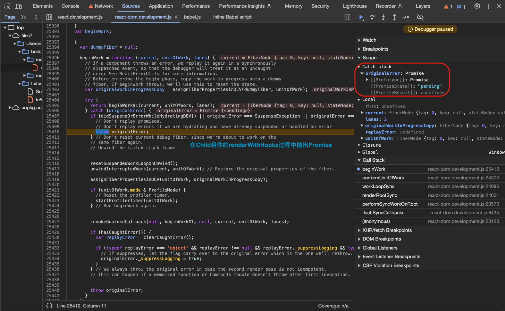
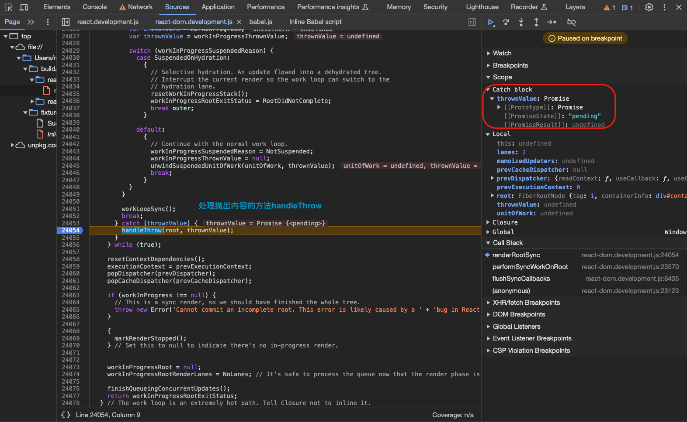

可以看到每次在进入`workLoopSync`/`workLoopConcurrent`工作之前，会对之前的`workInProgressSuspendedReason`状态进行一个判断，其实主要就是监测`Suspense`组件包裹的异步内容是否有状态改变，前面`workInProgressSuspendedReason`已经设置为`SuspendedOnDeprecatedThrowPromise`，所以进入`unwindSuspendedUnitOfWork`这个方法：

```ts
type SuspendedReason = 0 | 1 | 2 | 3 | 4 | 5 | 6;
const NotSuspended: SuspendedReason = 0;
const SuspendedOnError: SuspendedReason = 1;
const SuspendedOnData: SuspendedReason = 2;
const SuspendedOnImmediate: SuspendedReason = 3;
const SuspendedOnDeprecatedThrowPromise: SuspendedReason = 4;
const SuspendedAndReadyToContinue: SuspendedReason = 5;
const SuspendedOnHydration: SuspendedReason = 6;

// 【packages/react-reconciler/src/ReactFiberWorkLoop.js】
function unwindSuspendedUnitOfWork(unitOfWork: Fiber, thrownValue: mixed) {
  // This is a fork of performUnitOfWork specifcally for unwinding a fiber
  // that threw an exception.
  //
  // Return to the normal work loop. This will unwind the stack, and potentially
  // result in showing a fallback.
  resetSuspendedWorkLoopOnUnwind();

  const returnFiber = unitOfWork.return;
  if (returnFiber === null || workInProgressRoot === null) {
    // Expected to be working on a non-root fiber. This is a fatal error
    // because there's no ancestor that can handle it; the root is
    // supposed to capture all errors that weren't caught by an error
    // boundary.
    workInProgressRootExitStatus = RootFatalErrored;
    workInProgressRootFatalError = thrownValue;
    // Set `workInProgress` to null. This represents advancing to the next
    // sibling, or the parent if there are no siblings. But since the root
    // has no siblings nor a parent, we set it to null. Usually this is
    // handled by `completeUnitOfWork` or `unwindWork`, but since we're
    // intentionally not calling those, we need set it here.
    // TODO: Consider calling `unwindWork` to pop the contexts.
    workInProgress = null;
    return;
  }

  try {
    // Find and mark the nearest Suspense or error boundary that can handle
    // this "exception".
    throwException(
      workInProgressRoot,
      returnFiber,
      unitOfWork,
      thrownValue,
      workInProgressRootRenderLanes,
    );
  } catch (error) {
    // We had trouble processing the error. An example of this happening is
    // when accessing the `componentDidCatch` property of an error boundary
    // throws an error. A weird edge case. There's a regression test for this.
    // To prevent an infinite loop, bubble the error up to the next parent.
    workInProgress = returnFiber;
    throw error;
  }

  // Return to the normal work loop.
  completeUnitOfWork(unitOfWork);
}
```

`unwindSuspendedUnitOfWork`方法里的两个关键步骤：`throwException()` & `completeUnitOfWork()`

1. 调用`throwException`方法，首先给当前组件`fiber`标记`Incomplete`，然后找到离当前组件**最近**的`suspenseBoundary`也就是`Suspense`组件；
2. 将当前抛出的`Promise`加入`suspenseBoundary`的`updateQueue`队列；
3. `Concurrent`模式下调用`attachPingListener(root, wakeable, rootRenderLanes)`，在`root上`添加`root.pingCache`，这个是后面Promise被resolve之后去通知进行fiber切换的重要前置条件；
4. 结束`throwException`方法回到`unwindSuspendedUnitOfWork`，继续没有完成的`completeUnitOfWork(unitOfWork)`；

```ts
// 【packages/react-reconciler/src/ReactFiberThrow.js】
function throwException(
  root: FiberRoot,
  returnFiber: Fiber,
  sourceFiber: Fiber,
  value: mixed,
  rootRenderLanes: Lanes,
): void {
  // 【给当前组件fiber标记Incomplete】
  // The source fiber did not complete.
  sourceFiber.flags |= Incomplete;

  if (enableUpdaterTracking) {
    if (isDevToolsPresent) {
      // If we have pending work still, restore the original updaters
      restorePendingUpdaters(root, rootRenderLanes);
    }
  }

  if (
    value !== null &&
    typeof value === 'object' &&
    typeof value.then === 'function'
  ) {
    // This is a wakeable. The component suspended.
    const wakeable: Wakeable = (value: any);
    resetSuspendedComponent(sourceFiber, rootRenderLanes);
    
    // 【省略代码...】

    // Mark the nearest Suspense boundary to switch to rendering a fallback.
    const suspenseBoundary = getSuspenseHandler();
    if (suspenseBoundary !== null) {
      switch (suspenseBoundary.tag) {
        case SuspenseComponent: {
          // If this suspense boundary is not already showing a fallback, mark
          // the in-progress render as suspended. We try to perform this logic
          // as soon as soon as possible during the render phase, so the work
          // loop can know things like whether it's OK to switch to other tasks,
          // or whether it can wait for data to resolve before continuing.
          // TODO: Most of these checks are already performed when entering a
          // Suspense boundary. We should track the information on the stack so
          // we don't have to recompute it on demand. This would also allow us
          // to unify with `use` which needs to perform this logic even sooner,
          // before `throwException` is called.
          if (sourceFiber.mode & ConcurrentMode) {
            if (getShellBoundary() === null) {
              // Suspended in the "shell" of the app. This is an undesirable
              // loading state. We should avoid committing this tree.
              renderDidSuspendDelayIfPossible();
            } else {
              // If we suspended deeper than the shell, we don't need to delay
              // the commmit. However, we still call renderDidSuspend if this is
              // a new boundary, to tell the work loop that a new fallback has
              // appeared during this render.
              // TODO: Theoretically we should be able to delete this branch.
              // It's currently used for two things: 1) to throttle the
              // appearance of successive loading states, and 2) in
              // SuspenseList, to determine whether the children include any
              // pending fallbacks. For 1, we should apply throttling to all
              // retries, not just ones that render an additional fallback. For
              // 2, we should check subtreeFlags instead. Then we can delete
              // this branch.
              const current = suspenseBoundary.alternate;
              if (current === null) {
                renderDidSuspend();
              }
            }
          }
          // 【suspense组件添加ForceClientRender标记】
          suspenseBoundary.flags &= ~ForceClientRender;
          markSuspenseBoundaryShouldCapture(
            suspenseBoundary,
            returnFiber,
            sourceFiber,
            root,
            rootRenderLanes,
          );
          // Retry listener
          //
          // If the fallback does commit, we need to attach a different type of
          // listener. This one schedules an update on the Suspense boundary to
          // turn the fallback state off.
          //
          // Stash the wakeable on the boundary fiber so we can access it in the
          // commit phase.
          //
          // When the wakeable resolves, we'll attempt to render the boundary
          // again ("retry").
          // 【当前Promise加入suspense组件的updateQueue】
          const wakeables: Set<Wakeable> | null =
            (suspenseBoundary.updateQueue: any);
          if (wakeables === null) {
            suspenseBoundary.updateQueue = new Set([wakeable]);
          } else {
            wakeables.add(wakeable);
          }
          break;
        }
        case OffscreenComponent: {
          if (suspenseBoundary.mode & ConcurrentMode) {
            suspenseBoundary.flags |= ShouldCapture;
            const offscreenQueue: OffscreenQueue | null =
              (suspenseBoundary.updateQueue: any);
            if (offscreenQueue === null) {
              const newOffscreenQueue: OffscreenQueue = {
                transitions: null,
                markerInstances: null,
                wakeables: new Set([wakeable]),
              };
              suspenseBoundary.updateQueue = newOffscreenQueue;
            } else {
              const wakeables = offscreenQueue.wakeables;
              if (wakeables === null) {
                offscreenQueue.wakeables = new Set([wakeable]);
              } else {
                wakeables.add(wakeable);
              }
            }
            break;
          }
        }
        // eslint-disable-next-line no-fallthrough
        default: {
          throw new Error(
            `Unexpected Suspense handler tag (${suspenseBoundary.tag}). This ` +
              'is a bug in React.',
          );
        }
      }
      // We only attach ping listeners in concurrent mode. Legacy Suspense always
      // commits fallbacks synchronously, so there are no pings.
      if (suspenseBoundary.mode & ConcurrentMode) {
        attachPingListener(root, wakeable, rootRenderLanes);
      }
      return;
    } else {
      // No boundary was found. Unless this is a sync update, this is OK.
      // We can suspend and wait for more data to arrive.

      if (root.tag === ConcurrentRoot) {
        // In a concurrent root, suspending without a Suspense boundary is
        // allowed. It will suspend indefinitely without committing.
        //
        // TODO: Should we have different behavior for discrete updates? What
        // about flushSync? Maybe it should put the tree into an inert state,
        // and potentially log a warning. Revisit this for a future release.
        attachPingListener(root, wakeable, rootRenderLanes);
        renderDidSuspendDelayIfPossible();
        return;
      } else {
        // In a legacy root, suspending without a boundary is always an error.
        const uncaughtSuspenseError = new Error(
          'A component suspended while responding to synchronous input. This ' +
            'will cause the UI to be replaced with a loading indicator. To ' +
            'fix, updates that suspend should be wrapped ' +
            'with startTransition.',
        );
        value = uncaughtSuspenseError;
      }
    }
  } else {
    // This is a regular error, not a Suspense wakeable.
    if (getIsHydrating() && sourceFiber.mode & ConcurrentMode) {
      markDidThrowWhileHydratingDEV();
      const suspenseBoundary = getSuspenseHandler();
      // If the error was thrown during hydration, we may be able to recover by
      // discarding the dehydrated content and switching to a client render.
      // Instead of surfacing the error, find the nearest Suspense boundary
      // and render it again without hydration.
      if (suspenseBoundary !== null) {
        if ((suspenseBoundary.flags & ShouldCapture) === NoFlags) {
          // Set a flag to indicate that we should try rendering the normal
          // children again, not the fallback.
          suspenseBoundary.flags |= ForceClientRender;
        }
        markSuspenseBoundaryShouldCapture(
          suspenseBoundary,
          returnFiber,
          sourceFiber,
          root,
          rootRenderLanes,
        );

        // Even though the user may not be affected by this error, we should
        // still log it so it can be fixed.
        queueHydrationError(createCapturedValueAtFiber(value, sourceFiber));
        return;
      }
    } else {
      // Otherwise, fall through to the error path.
    }
  }

  value = createCapturedValueAtFiber(value, sourceFiber);
  renderDidError(value);

  // We didn't find a boundary that could handle this type of exception. Start
  // over and traverse parent path again, this time treating the exception
  // as an error.
  let workInProgress: Fiber = returnFiber;
  do {
    switch (workInProgress.tag) {
      case HostRoot: {
        const errorInfo = value;
        workInProgress.flags |= ShouldCapture;
        const lane = pickArbitraryLane(rootRenderLanes);
        workInProgress.lanes = mergeLanes(workInProgress.lanes, lane);
        const update = createRootErrorUpdate(workInProgress, errorInfo, lane);
        enqueueCapturedUpdate(workInProgress, update);
        return;
      }
      case ClassComponent:
        // Capture and retry
        const errorInfo = value;
        const ctor = workInProgress.type;
        const instance = workInProgress.stateNode;
        if (
          (workInProgress.flags & DidCapture) === NoFlags &&
          (typeof ctor.getDerivedStateFromError === 'function' ||
            (instance !== null &&
              typeof instance.componentDidCatch === 'function' &&
              !isAlreadyFailedLegacyErrorBoundary(instance)))
        ) {
          workInProgress.flags |= ShouldCapture;
          const lane = pickArbitraryLane(rootRenderLanes);
          workInProgress.lanes = mergeLanes(workInProgress.lanes, lane);
          // Schedule the error boundary to re-render using updated state
          const update = createClassErrorUpdate(
            workInProgress,
            errorInfo,
            lane,
          );
          enqueueCapturedUpdate(workInProgress, update);
          return;
        }
        break;
      default:
        break;
    }
    // $FlowFixMe[incompatible-type] we bail out when we get a null
    workInProgress = workInProgress.return;
  } while (workInProgress !== null);
}

function getSuspenseHandler() {
  return suspenseHandlerStackCursor.current;
}
```

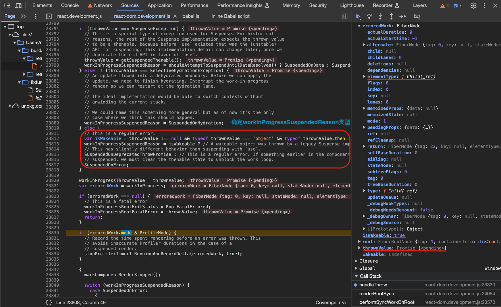

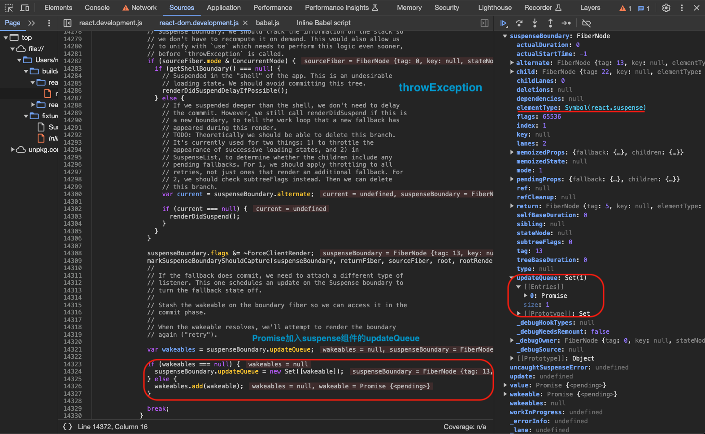
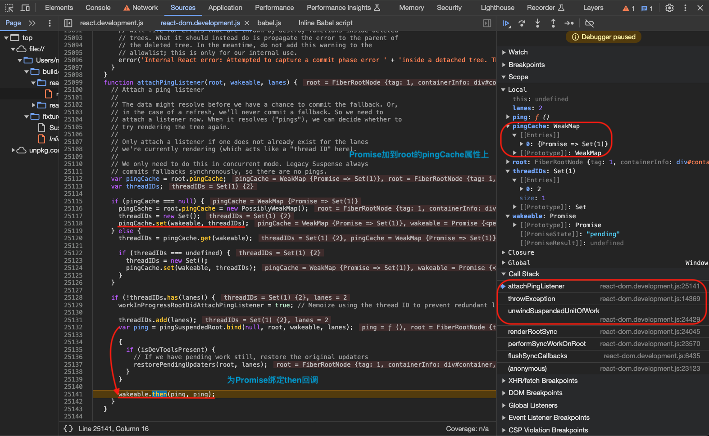

和普通节点`completeUnitOfWork()`不同的是这一次走的是`Incomplete`这个处理路径，已知前面已经给当前组件节点标记了`Incomplete`。可以看到只是处理了当前节点和`Offscreen`祖先节点的`flags`等等，`Offscreen`祖先节点`flags`会被设置为`Incomplete`等待后续的处理，`subtreeFlags`设置为`NoFlags`，并没有进入真正的`completeWork`，因为正式内容要等`Promise`被`resolve`之后再显示。然后回到上一层`Offscreen`祖先节点进行`completeUnitOfWork(unitOfWork)`，同样的流程，所以`Offscreen`节点的祖先节点`Suspense`节点`flags`会被设置为`Incomplete`等待后续的处理，`subtreeFlags`设置为`NoFlags`。最后再到`Suspense`节点`flags`设置为`Incomplete`，`subtreeFlags`设置为`NoFlags`。

`Child` => `Offscreen` => `Suspense`

```ts
// 【packages/react-reconciler/src/ReactFiberWorkLoop.js】
function completeUnitOfWork(unitOfWork: Fiber): void {
  // Attempt to complete the current unit of work, then move to the next
  // sibling. If there are no more siblings, return to the parent fiber.
  let completedWork: Fiber = unitOfWork;
  do {
    // The current, flushed, state of this fiber is the alternate. Ideally
    // nothing should rely on this, but relying on it here means that we don't
    // need an additional field on the work in progress.
    const current = completedWork.alternate;
    const returnFiber = completedWork.return;

    // Check if the work completed or if something threw.
    if ((completedWork.flags & Incomplete) === NoFlags) {
      // 【省略代码...】
    } else {
      // This fiber did not complete because something threw. Pop values off
      // the stack without entering the complete phase. If this is a boundary,
      // capture values if possible.
      const next = unwindWork(current, completedWork, renderLanes);

      // Because this fiber did not complete, don't reset its lanes.

      if (next !== null) {
        // If completing this work spawned new work, do that next. We'll come
        // back here again.
        // Since we're restarting, remove anything that is not a host effect
        // from the effect tag.
        next.flags &= HostEffectMask;
        workInProgress = next;
        return;
      }

      if (
        enableProfilerTimer &&
        (completedWork.mode & ProfileMode) !== NoMode
      ) {
        // Record the render duration for the fiber that errored.
        stopProfilerTimerIfRunningAndRecordDelta(completedWork, false);

        // Include the time spent working on failed children before continuing.
        let actualDuration = completedWork.actualDuration;
        let child = completedWork.child;
        while (child !== null) {
          // $FlowFixMe[unsafe-addition] addition with possible null/undefined value
          actualDuration += child.actualDuration;
          child = child.sibling;
        }
        completedWork.actualDuration = actualDuration;
      }

      if (returnFiber !== null) {
        // Mark the parent fiber as incomplete and clear its subtree flags.
        returnFiber.flags |= Incomplete;
        returnFiber.subtreeFlags = NoFlags;
        returnFiber.deletions = null;
      } else {
        // We've unwound all the way to the root.
        workInProgressRootExitStatus = RootDidNotComplete;
        workInProgress = null;
        return;
      }
    }

    const siblingFiber = completedWork.sibling;
    if (siblingFiber !== null) {
      // If there is more work to do in this returnFiber, do that next.
      workInProgress = siblingFiber;
      return;
    }
    // Otherwise, return to the parent
    // $FlowFixMe[incompatible-type] we bail out when we get a null
    completedWork = returnFiber;
    // Update the next thing we're working on in case something throws.
    workInProgress = completedWork;
  } while (completedWork !== null);

  // We've reached the root.
  if (workInProgressRootExitStatus === RootInProgress) {
    workInProgressRootExitStatus = RootCompleted;
  }
}
```

到目前为止，准备工作已完成，`Suspense`组件节点已标记`Incomplete`、`Suspense`组件节点的`updateQueue`已装载`Promise`、`primaryChild fiber`建到组件这一层、`fallback fiber`已经完整建立。然后经过`commit`过程，此时`fallback`组件就会渲染在页面上面。接下来就是`Promise`被`resolve`之后去将`fallback fiber`切换到`primaryChild fiber`显示正式内容的过程。


---

之前的`Promise`在`resolve`之后其实会调用`ping`方法也就是`pingSuspendedRoot`方法如下：

1. 从`root.pingCache`取出当前`Promise`；
2. `markRootPinged`标记`ping`成功；
3. 进入`ensureRootIsScheduled`方法；

```ts
// 【packages/react-reconciler/src/ReactFiberWorkLoop.js】
// 【attachPingListener】
const ping = pingSuspendedRoot.bind(null, root, wakeable, lanes);
if (enableUpdaterTracking) {
  if (isDevToolsPresent) {
    // If we have pending work still, restore the original updaters
    restorePendingUpdaters(root, lanes);
  }
}
wakeable.then(ping, ping);

function pingSuspendedRoot(
  root: FiberRoot,
  wakeable: Wakeable,
  pingedLanes: Lanes,
) {
  // 【当前异步任务完成，取出当前异步任务】
  const pingCache = root.pingCache;
  if (pingCache !== null) {
    // The wakeable resolved, so we no longer need to memoize, because it will
    // never be thrown again.
    pingCache.delete(wakeable);
  }

  const eventTime = requestEventTime();
  markRootPinged(root, pingedLanes);

  warnIfSuspenseResolutionNotWrappedWithActDEV(root);

  if (
    workInProgressRoot === root &&
    isSubsetOfLanes(workInProgressRootRenderLanes, pingedLanes)
  ) {
    // Received a ping at the same priority level at which we're currently
    // rendering. We might want to restart this render. This should mirror
    // the logic of whether or not a root suspends once it completes.
    // TODO: If we're rendering sync either due to Sync, Batched or expired,
    // we should probably never restart.

    // If we're suspended with delay, or if it's a retry, we'll always suspend
    // so we can always restart.
    if (
      workInProgressRootExitStatus === RootSuspendedWithDelay ||
      (workInProgressRootExitStatus === RootSuspended &&
        includesOnlyRetries(workInProgressRootRenderLanes) &&
        now() - globalMostRecentFallbackTime < FALLBACK_THROTTLE_MS)
    ) {
      // Force a restart from the root by unwinding the stack. Unless this is
      // being called from the render phase, because that would cause a crash.
      if ((executionContext & RenderContext) === NoContext) {
        prepareFreshStack(root, NoLanes);
      } else {
        // TODO: If this does happen during the render phase, we should throw
        // the special internal exception that we use to interrupt the stack for
        // selective hydration. That was temporarily reverted but we once we add
        // it back we can use it here.
      }
    } else {
      // Even though we can't restart right now, we might get an
      // opportunity later. So we mark this render as having a ping.
      workInProgressRootPingedLanes = mergeLanes(
        workInProgressRootPingedLanes,
        pingedLanes,
      );
    }
  }

  ensureRootIsScheduled(root, eventTime);
}
```

---

<!-- TODO：会执行两遍performSyncWorkOnRoot？ -->

`performSyncWorkOnRoot` => ... => `commitMutationEffectsOnFiber` => `attachSuspenseRetryListeners` => `resolveRetryWakeable` =>  `retryTimedOutBoundary` => `ensureRootIsScheduled` => `performSyncWorkOnRoot`... => `updateSuspenseComponent` => `updateSuspensePrimaryChildren`

再次进入更新流程：

1. `commitMutationEffectsOnFiber`方法遇到`SuspenseComponent`、`OffscreenComponent`、`SuspenseListComponent`，若`flags`有`Update`标记就会进入`attachSuspenseRetryListeners`方法；
2. `attachSuspenseRetryListeners`方法主要是给之前的`Promise`（从`fiber.updateQueue`中取出）绑定`then`回调方法`resolveRetryWakeable`；
3. `Promise`被resolve之后就会进入`resolveRetryWakeable`方法，从而进入`retryTimedOutBoundary`方法，`retryTimedOutBoundary`方法会安排新的一次更新，这一次会构造和渲染`primaryChild fiber`，并移除`fallback fiber`；

```ts
// 【packages/react-reconciler/src/ReactFiberCommitWork.js】
function attachSuspenseRetryListeners(
  finishedWork: Fiber,
  wakeables: Set<Wakeable>,
) {
  // If this boundary just timed out, then it will have a set of wakeables.
  // For each wakeable, attach a listener so that when it resolves, React
  // attempts to re-render the boundary in the primary (pre-timeout) state.
  // 【给所有Promise绑定then回调】
  const retryCache = getRetryCache(finishedWork);
  wakeables.forEach(wakeable => {
    // Memoize using the boundary fiber to prevent redundant listeners.
    const retry = resolveRetryWakeable.bind(null, finishedWork, wakeable);
    if (!retryCache.has(wakeable)) {
      retryCache.add(wakeable);

      if (enableUpdaterTracking) {
        if (isDevToolsPresent) {
          if (inProgressLanes !== null && inProgressRoot !== null) {
            // If we have pending work still, associate the original updaters with it.
            restorePendingUpdaters(inProgressRoot, inProgressLanes);
          } else {
            throw Error(
              'Expected finished root and lanes to be set. This is a bug in React.',
            );
          }
        }
      }

      wakeable.then(retry, retry);
    }
  });
}

// 【packages/react-reconciler/src/ReactFiberWorkLoop.js】
// 【Promise被resolve回调resolveRetryWakeable方法】
export function resolveRetryWakeable(boundaryFiber: Fiber, wakeable: Wakeable) {
  let retryLane = NoLane; // Default
  let retryCache: WeakSet<Wakeable> | Set<Wakeable> | null;
  switch (boundaryFiber.tag) {
    case SuspenseComponent:
      retryCache = boundaryFiber.stateNode;
      const suspenseState: null | SuspenseState = boundaryFiber.memoizedState;
      if (suspenseState !== null) {
        retryLane = suspenseState.retryLane;
      }
      break;
    case SuspenseListComponent:
      retryCache = boundaryFiber.stateNode;
      break;
    case OffscreenComponent: {
      const instance: OffscreenInstance = boundaryFiber.stateNode;
      retryCache = instance._retryCache;
      break;
    }
    default:
      throw new Error(
        'Pinged unknown suspense boundary type. ' +
          'This is probably a bug in React.',
      );
  }

  if (retryCache !== null) {
    // The wakeable resolved, so we no longer need to memoize, because it will
    // never be thrown again.
    retryCache.delete(wakeable);
  }

  retryTimedOutBoundary(boundaryFiber, retryLane);
}

function retryTimedOutBoundary(boundaryFiber: Fiber, retryLane: Lane) {
  // The boundary fiber (a Suspense component or SuspenseList component)
  // previously was rendered in its fallback state. One of the promises that
  // suspended it has resolved, which means at least part of the tree was
  // likely unblocked. Try rendering again, at a new lanes.
  if (retryLane === NoLane) {
    // TODO: Assign this to `suspenseState.retryLane`? to avoid
    // unnecessary entanglement?
    retryLane = requestRetryLane(boundaryFiber);
  }
  // TODO: Special case idle priority?
  const eventTime = requestEventTime();
  const root = enqueueConcurrentRenderForLane(boundaryFiber, retryLane);
  if (root !== null) {
    markRootUpdated(root, retryLane, eventTime);
    ensureRootIsScheduled(root, eventTime);
  }
}
```

## Lazy原理

<!-- TODO -->

## 总结

1. `fallback fiber`由`Fragment`包裹，`primaryChild fiber`由`Offscreen`包裹；
2. 首次渲染，`Suspense`组件的`beginWork`阶段会进入`updateSuspenseComponent`方法；
3. 更新阶段，

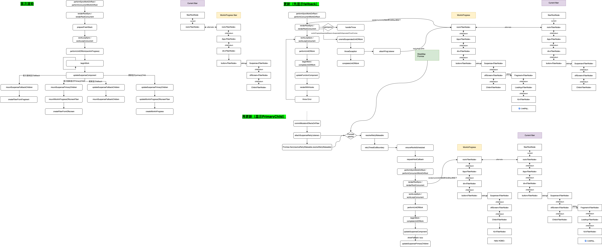

Suspense use a flag DidCapture to decide what to render fallback or contents (primary children)
Suspense wraps contents in Offscreen component, so that even when fallback is rendered, contents are not removed from fiber tree, this is to keep the state inside.
During reconciling, Suspense decides to skip Offscreen or not based the flag DidCapture, this creates the effect of “hidding some fibers”
When a promise is thrown
nearest Suspense boundary is found and flag is set with ShouldCapture, promises are chained with ping & retry listeners
since errored, start to complete work, all fibers from errored components up to Suspense will be completed as Incomplete
when try to complete nearest Suspense, ShouldCapture is marked as DidCapture and returns Suspense itself
workloop continues reconciling Suspense, this time, rendering fallback branch
When a promise is resolved
ping & retry listeners make sure rerender happens.
<!-- 【TODO：完成suspense源码理解】 -->