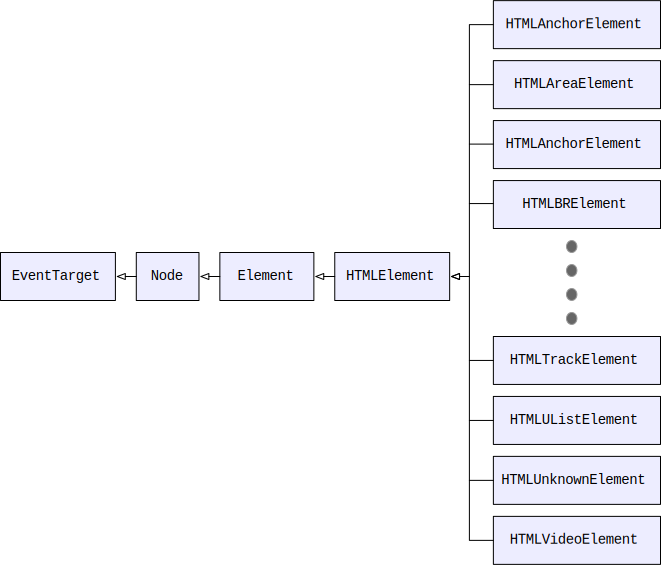
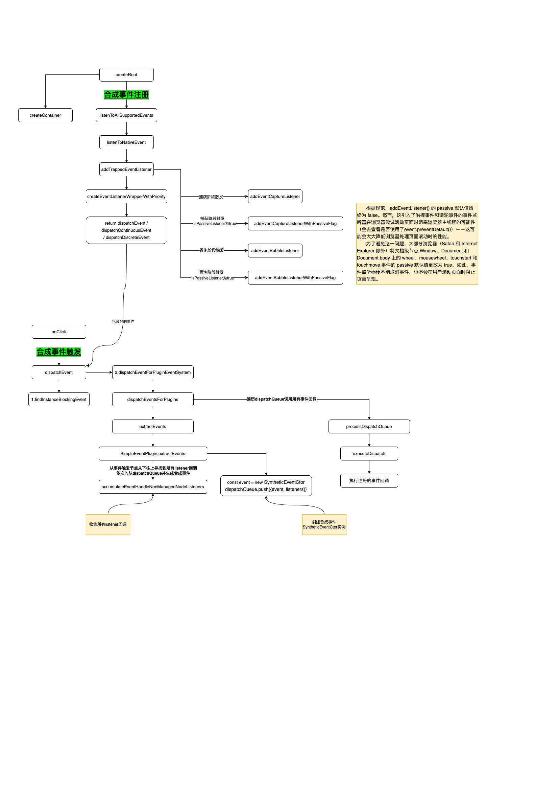

# 合成事件（SyntheticEvent）

合成事件（`SyntheticEvent`）解决的问题：

- 跨浏览器兼容性：不同浏览器对事件的实现和处理方式可能不一致，例如早期的 IE 浏览器使用自己的事件模型，而其他浏览器基于标准事件模型。因此，React 引入合成事件，将不同浏览器的事件行为标准化，避免开发者为兼容性做额外处理。
- 性能优化：原生事件在 DOM 树中逐个绑定时会造成性能问题，尤其在大型应用中可能会有大量的事件监听器挂载到各个 DOM 元素上，影响内存和性能。React 的合成事件通过事件委托机制，将事件监听器统一挂载在根节点上，减少了事件处理器的数量，并简化了事件的管理。
- 更好地管理生命周期：React 的合成事件在事件触发后会进入一个回收机制，通过自动清理和回收，避免了内存泄漏等问题。

举例来说，在原生 JavaScript 中，不同浏览器对鼠标点击事件 `onClick` 的 `event.button` 属性的值处理方式有所不同。在 左键点击 时，IE 和旧版本的浏览器可能会返回 1。现代浏览器（如 Chrome、Firefox）会返回 0。

```js
document.addEventListener("click", function (event) {
  if (event.button === 0) {
    console.log("Left button clicked (Modern browsers)");
  } else if (event.button === 1) {
    console.log("Middle button clicked");
  } else if (event.button === 2) {
    console.log("Right button clicked");
  } else {
    console.log("Unknown button");
  }
});
```

在 React 中，无论是在 Chrome、Firefox 还是 IE 中，`event.button` 的值都被标准化：

- 0 表示左键。
- 1 表示中键。
- 2 表示右键。

`React` 的事件处理机制可以分为两个阶段：

1. 初始化渲染时在`root`节点上注册事件；
2. 原生事件触发时模拟捕获、目标和冒泡阶段派发合成事件；

通过这种机制，冒泡的原生事件类型最多在 `root` 节点上注册一次，节省内存开销。且 `React` 为不同类型的事件定义了不同的处理优先级，从而让用户代码及时响应高优先级的用户交互，提升用户体验。

`React` 的事件机制中依赖合成事件这个核心概念。合成事件在符合 W3C 规范定义的前提下，抹平浏览器之间的差异化表现。并且简化事件逻辑，对关联事件进行合成。如每当表单类型组件的值发生改变时，都会触发 `onChange` 事件，而 `onChange` 事件由 `change`、`click`、`input`、`keydown`、`keyup` 等原生事件组成。合成事件与原生事件不是一一映射的关系。比如 `onMouseEnter` 合成事件映射原生 `mouseout`、`mouseover` 事件。

React 实现了一个 `SyntheticEvent` 类，如果需要访问原生事件对象，可以使用 `nativeEvent` 属性。在事件发生时，相关信息会存储在 `SyntheticEvent` 的实例对象中，对象包含 `currentTarget`、`detail`、`target`、`preventDefault()`、`stopPropagation()` 等属性和方法。`DOM` 节点可以通过 `addEventListener` 和 `removeEventListener` 来添加或移除事件监听函数。

## 合成事件的注册

根据前文中，我们知道进入`fiber`树构造之前会先创建全局唯一根实例由`createRoot`方法进入如下：

```ts
// 【packages/react-dom/src/client/ReactDOMRoot.js】
export function createRoot(
  container: Element | Document | DocumentFragment,
  options?: CreateRootOptions,
): RootType {
  if (!isValidContainer(container)) {
    throw new Error('Target container is not a DOM element.');
  }

  warnIfReactDOMContainerInDEV(container);

  let isStrictMode = false;
  let concurrentUpdatesByDefaultOverride = false;
  let identifierPrefix = '';
  let onUncaughtError = defaultOnUncaughtError;
  let onCaughtError = defaultOnCaughtError;
  let onRecoverableError = defaultOnRecoverableError;
  let transitionCallbacks = null;

  // 【省略代码...】

  const root = createContainer(
    container,
    ConcurrentRoot,
    null,
    isStrictMode,
    concurrentUpdatesByDefaultOverride,
    identifierPrefix,
    onUncaughtError,
    onCaughtError,
    onRecoverableError,
    transitionCallbacks,
  );
  markContainerAsRoot(root.current, container);

  const rootContainerElement: Document | Element | DocumentFragment =
    container.nodeType === COMMENT_NODE
      ? (container.parentNode: any)
      : container;
  // 【-----注册合成事件入口-----】
  listenToAllSupportedEvents(rootContainerElement);

  // $FlowFixMe[invalid-constructor] Flow no longer supports calling new on functions
  return new ReactDOMRoot(root);
}
```

其中一个重要步骤`listenToAllSupportedEvents`方法主要的任务就是遍历监听所有的原生事件`allNativeEvents`，在`root`节点上初始化所有原生事件的监听回调函数。

`listenToAllSupportedEvents` => `listenToNativeEvent` => `addTrappedEventListener` => `createEventListenerWrapperWithPriority` + `addEventCaptureListener`

```ts
// 【packages/react-dom-bindings/src/events/DOMPluginEventSystem.js】
export function listenToAllSupportedEvents(rootContainerElement: EventTarget) {
  if (!(rootContainerElement: any)[listeningMarker]) {
    (rootContainerElement: any)[listeningMarker] = true;
    allNativeEvents.forEach(domEventName => {
      // We handle selectionchange separately because it
      // doesn't bubble and needs to be on the document.
      if (domEventName !== 'selectionchange') {
        if (!nonDelegatedEvents.has(domEventName)) {
          listenToNativeEvent(domEventName, false, rootContainerElement);
        }
        // 【去监听事件】
        listenToNativeEvent(domEventName, true, rootContainerElement);
      }
    });
    const ownerDocument =
      (rootContainerElement: any).nodeType === DOCUMENT_NODE
        ? rootContainerElement
        : (rootContainerElement: any).ownerDocument;
    if (ownerDocument !== null) {
      // The selectionchange event also needs deduplication
      // but it is attached to the document.
      if (!(ownerDocument: any)[listeningMarker]) {
        (ownerDocument: any)[listeningMarker] = true;
        listenToNativeEvent('selectionchange', false, ownerDocument);
      }
    }
  }
}

export function listenToNativeEvent(
  domEventName: DOMEventName,
  isCapturePhaseListener: boolean,
  target: EventTarget,
): void {
  // 【省略代码...】

  let eventSystemFlags = 0;
  if (isCapturePhaseListener) {
    eventSystemFlags |= IS_CAPTURE_PHASE;
  }
  // 【addTrappedEventListener方法入参：target此处通常是container对应DOM节点，DOM事件名称，优先级flag，是否捕获阶段的事件回调】
  addTrappedEventListener(
    target,
    domEventName,
    eventSystemFlags,
    isCapturePhaseListener,
  );
}

function addTrappedEventListener(
  targetContainer: EventTarget,
  domEventName: DOMEventName,
  eventSystemFlags: EventSystemFlags,
  isCapturePhaseListener: boolean,
  isDeferredListenerForLegacyFBSupport?: boolean,
) {
  // 【创建不同优先级的事件回调dispatchEvent】
  let listener = createEventListenerWrapperWithPriority(
    targetContainer,
    domEventName,
    eventSystemFlags,
  );
  // 【根据规范，addEventListener() 的 passive 默认值始终为 false。然而，这引入了触摸事件和滚轮事件的事件监听器在浏览器尝试滚动页面时阻塞浏览器主线程的可能性——这可能会大大降低浏览器处理页面滚动时的性能。

  // 为了避免这一问题，大部分浏览器（Safari 和 Internet Explorer 除外）将文档级节点 Window、Document 和 Document.body 上的 wheel、mousewheel、touchstart 和 touchmove 事件的 passive 默认值更改为 true。如此，事件监听器便不能取消事件，也不会在用户滚动页面时阻止页面呈现。】
  // If passive option is not supported, then the event will be
  // active and not passive.
  let isPassiveListener: void | boolean = undefined;
  if (passiveBrowserEventsSupported) {
    // Browsers introduced an intervention, making these events
    // passive by default on document. React doesn't bind them
    // to document anymore, but changing this now would undo
    // the performance wins from the change. So we emulate
    // the existing behavior manually on the roots now.
    // https://github.com/facebook/react/issues/19651
    if (
      domEventName === 'touchstart' ||
      domEventName === 'touchmove' ||
      domEventName === 'wheel'
    ) {
      isPassiveListener = true;
    }
  }

  targetContainer =
    enableLegacyFBSupport && isDeferredListenerForLegacyFBSupport
      ? (targetContainer: any).ownerDocument
      : targetContainer;

  let unsubscribeListener;
  // When legacyFBSupport is enabled, it's for when we
  // want to add a one time event listener to a container.
  // This should only be used with enableLegacyFBSupport
  // due to requirement to provide compatibility with
  // internal FB www event tooling. This works by removing
  // the event listener as soon as it is invoked. We could
  // also attempt to use the {once: true} param on
  // addEventListener, but that requires support and some
  // browsers do not support this today, and given this is
  // to support legacy code patterns, it's likely they'll
  // need support for such browsers.
  if (enableLegacyFBSupport && isDeferredListenerForLegacyFBSupport) {
    const originalListener = listener;
    // $FlowFixMe[missing-this-annot]
    listener = function (...p) {
      removeEventListener(
        targetContainer,
        domEventName,
        unsubscribeListener,
        isCapturePhaseListener,
      );
      return originalListener.apply(this, p);
    };
  }
  // TODO: There are too many combinations here. Consolidate them.
  // 【捕获阶段事件】
  if (isCapturePhaseListener) {
    if (isPassiveListener !== undefined) {
      // 【passive为true，表示 listener 永远不会调用 preventDefault()】
      unsubscribeListener = addEventCaptureListenerWithPassiveFlag(
        targetContainer,
        domEventName,
        listener,
        isPassiveListener,
      );
    } else {
      unsubscribeListener = addEventCaptureListener(
        targetContainer,
        domEventName,
        listener,
      );
    }
  } else {
  // 【冒泡阶段事件】
    if (isPassiveListener !== undefined) {
      // 【passive为true，表示 listener 永远不会调用 preventDefault()】
      unsubscribeListener = addEventBubbleListenerWithPassiveFlag(
        targetContainer,
        domEventName,
        listener,
        isPassiveListener,
      );
    } else {
      unsubscribeListener = addEventBubbleListener(
        targetContainer,
        domEventName,
        listener,
      );
    }
  }
}

// 【packages/react-dom-bindings/src/events/EventListener.js】
// 【捕获阶段触发事件】
export function addEventCaptureListener(
  target: EventTarget,
  eventType: string,
  listener: Function,
): Function {
  target.addEventListener(eventType, listener, true);
  return listener;
}

export function addEventCaptureListenerWithPassiveFlag(
  target: EventTarget,
  eventType: string,
  listener: Function,
  passive: boolean,
): Function {
  target.addEventListener(eventType, listener, {
    capture: true,
    passive,
  });
  return listener;
}

// 【冒泡阶段触发事件】
export function addEventBubbleListener(
  target: EventTarget,
  eventType: string,
  listener: Function,
): Function {
  target.addEventListener(eventType, listener, false);
  return listener;
}

export function addEventBubbleListenerWithPassiveFlag(
  target: EventTarget,
  eventType: string,
  listener: Function,
  passive: boolean,
): Function {
  target.addEventListener(eventType, listener, {
    passive,
  });
  return listener;
}

// 【移除事件监听】
export function removeEventListener(
  target: EventTarget,
  eventType: string,
  listener: Function,
  capture: boolean,
): void {
  target.removeEventListener(eventType, listener, capture);
}
```

DOM添加事件监听`addEventListener`的一些参数细节如下：

```ts
// useCapture 可选
// 一个布尔值，表示在 DOM 树中注册了 listener 的元素，是否要先于它下面的 EventTarget 调用该 listener(捕获阶段去触发)。当 useCapture（设为 true）时，沿着 DOM 树向上冒泡的事件不会触发 listener(捕获阶段去触发)。当一个元素嵌套了另一个元素，并且两个元素都对同一事件注册了一个处理函数时，所发生的事件冒泡和事件捕获是两种不同的事件传播方式。事件传播模式决定了元素以哪个顺序接收事件。如果没有指定，useCapture 默认为 false。
// options 可选
// 一个指定有关 listener 属性的可选参数对象。可用的选项如下：
// {
//   capture: true,
//   once: true,
//   passive: true,
//   signal: controller.signal
// }
  // capture 可选
  // 一个布尔值，表示 listener 会在该类型的事件捕获阶段传播到该 EventTarget 时触发。
  // once 可选
  // 一个布尔值，表示 listener 在添加之后最多只调用一次。如果为 true，listener 会在其被调用之后自动移除。
  // passive 可选
  // 一个布尔值，设置为 true 时，表示 listener 永远不会调用 preventDefault()。如果 listener 仍然调用了这个函数，客户端将会忽略它并抛出一个控制台警告。查看使用 passive 改善滚屏性能以了解更多。
  // signal 可选
  // AbortSignal，该 AbortSignal 的 abort() 方法被调用时，监听器会被移除。
addEventListener(type, listener);
addEventListener(type, listener, options);
addEventListener(type, listener, useCapture);
```

在注册事件阶段调用的 `addTrappedEventListener` 方法中，会使用 `createEventListenerWrapperWithPriority` 函数来创建事件回调 `dispatchEvent`。 `createEventListenerWrapperWithPriority` 函数根据事件类型，划分出若干个不同优先级的 `dispathEvent`。因此，事件回调最终都调用 `dispatchEvent` 方法去派发。最后根据不同的`passive`、`capture`参数添加事件监听。

```ts
// 【packages/react-dom-bindings/src/events/ReactDOMEventListener.js】
export function createEventListenerWrapperWithPriority(
  targetContainer: EventTarget,
  domEventName: DOMEventName,
  eventSystemFlags: EventSystemFlags,
): Function {
  const eventPriority = getEventPriority(domEventName);
  let listenerWrapper;
  switch (eventPriority) {
    case DiscreteEventPriority:
      listenerWrapper = dispatchDiscreteEvent;
      break;
    case ContinuousEventPriority:
      listenerWrapper = dispatchContinuousEvent;
      break;
    case DefaultEventPriority:
    default:
      listenerWrapper = dispatchEvent;
      break;
  }
  return listenerWrapper.bind(
    null,
    domEventName,
    eventSystemFlags,
    targetContainer,
  );
}

export function getEventPriority(domEventName: DOMEventName): EventPriority {
  switch (domEventName) {
    // Used by SimpleEventPlugin:
    case 'beforetoggle':
    case 'cancel':
    case 'click':
    case 'close':
    case 'contextmenu':
    case 'copy':
    case 'cut':
    case 'auxclick':
    case 'dblclick':
    case 'dragend':
    case 'dragstart':
    case 'drop':
    case 'focusin':
    case 'focusout':
    case 'input':
    case 'invalid':
    case 'keydown':
    case 'keypress':
    case 'keyup':
    case 'mousedown':
    case 'mouseup':
    case 'paste':
    case 'pause':
    case 'play':
    case 'pointercancel':
    case 'pointerdown':
    case 'pointerup':
    case 'ratechange':
    case 'reset':
    case 'resize':
    case 'seeked':
    case 'submit':
    case 'toggle':
    case 'touchcancel':
    case 'touchend':
    case 'touchstart':
    case 'volumechange':
    // Used by polyfills: (fall through)
    case 'change':
    case 'selectionchange':
    case 'textInput':
    case 'compositionstart':
    case 'compositionend':
    case 'compositionupdate':
    // Only enableCreateEventHandleAPI: (fall through)
    case 'beforeblur':
    case 'afterblur':
    // Not used by React but could be by user code: (fall through)
    case 'beforeinput':
    case 'blur':
    case 'fullscreenchange':
    case 'focus':
    case 'hashchange':
    case 'popstate':
    case 'select':
    case 'selectstart':
      return DiscreteEventPriority;
    case 'drag':
    case 'dragenter':
    case 'dragexit':
    case 'dragleave':
    case 'dragover':
    case 'mousemove':
    case 'mouseout':
    case 'mouseover':
    case 'pointermove':
    case 'pointerout':
    case 'pointerover':
    case 'scroll':
    case 'touchmove':
    case 'wheel':
    // Not used by React but could be by user code: (fall through)
    case 'mouseenter':
    case 'mouseleave':
    case 'pointerenter':
    case 'pointerleave':
      return ContinuousEventPriority;
    case 'message': {
      // We might be in the Scheduler callback.
      // Eventually this mechanism will be replaced by a check
      // of the current priority on the native scheduler.
      const schedulerPriority = getCurrentSchedulerPriorityLevel();
      switch (schedulerPriority) {
        case ImmediateSchedulerPriority:
          return DiscreteEventPriority;
        case UserBlockingSchedulerPriority:
          return ContinuousEventPriority;
        case NormalSchedulerPriority:
        case LowSchedulerPriority:
          // TODO: Handle LowSchedulerPriority, somehow. Maybe the same lane as hydration.
          return DefaultEventPriority;
        case IdleSchedulerPriority:
          return IdleEventPriority;
        default:
          return DefaultEventPriority;
      }
    }
    default:
      return DefaultEventPriority;
  }
}
```

- `DiscreteEventPriority`: 优先级最高，包括`click`、`keyDown`、`input`等事件，对应的`listener`是`dispatchDiscreteEvent`
- `ContinuousEventPriority`: 优先级最低，包括`drag`、`mouseenter`等事件，对应的`listener`是`dispatchContinuousEvent`
- `DefaultEventPriority`: 优先级适中，包括`animation`、`load`等事件，对应的`listener`是`dispatchEvent`

以上这3种`listener`实际上都是对`dispatchEvent`的包装。


## 合成事件的触发

触发一个原生事件时，大致的执行流程如下：

1. 用户操作，原生事件触发后，进入 `dispatchEvent` 回调方法；
2. `findInstanceBlockingEvent` 方法根据该原生事件查找到当前原生 `DOM` 节点和对应的 `fiber` 节点；
3. 触发的具体事件和 `fiber` 等信息被派发给插件系统进行处理，插件系统（`ChangeEventPlugin`、`BeforeInputEventPlugin`、`EnterLeaveEventPlugin`等）调用各插件暴露的 `extractEvents` 方法；
4. `extractEvents` 方法中，`accumulateSinglePhaseListeners` 方法从触发事件的节点向上收集 `fiber` 树上监听该相关事件的其他回调函数，构造合成事件并加入到队列 `dispatchQueue` 中；
5. 最后调用 `processDispatchQueue` 方法，基于捕获或冒泡阶段的标识，按倒序或顺序执行 `dispatchQueue` 中所有的`listener`事件回调；

`dispatchEvent` => `findInstanceBlockingEvent` + `dispatchEventForPluginEventSystem` => `dispatchEventsForPlugins` => `extractEvents` + `processDispatchQueue`

```ts
// 【packages/react-dom-bindings/src/events/ReactDOMEventListener.js】
export function dispatchEvent(
  domEventName: DOMEventName,
  eventSystemFlags: EventSystemFlags,
  targetContainer: EventTarget,
  nativeEvent: AnyNativeEvent,
): void {
  if (!_enabled) {
    return;
  }

  // 【找到事件触发对应的DOM节点及其对应fiber节点】
  let blockedOn = findInstanceBlockingEvent(nativeEvent);
  if (blockedOn === null) {
    // 【交给事件插件系统进行处理】
    dispatchEventForPluginEventSystem(
      domEventName,
      eventSystemFlags,
      nativeEvent,
      return_targetInst,
      targetContainer,
    );
    clearIfContinuousEvent(domEventName, nativeEvent);
    return;
  }

  if (
    queueIfContinuousEvent(
      blockedOn,
      domEventName,
      eventSystemFlags,
      targetContainer,
      nativeEvent,
    )
  ) {
    nativeEvent.stopPropagation();
    return;
  }
  // We need to clear only if we didn't queue because
  // queueing is accumulative.
  clearIfContinuousEvent(domEventName, nativeEvent);

  if (
    eventSystemFlags & IS_CAPTURE_PHASE &&
    isDiscreteEventThatRequiresHydration(domEventName)
  ) {
    while (blockedOn !== null) {
      const fiber = getInstanceFromNode(blockedOn);
      if (fiber !== null) {
        attemptSynchronousHydration(fiber);
      }
      const nextBlockedOn = findInstanceBlockingEvent(nativeEvent);
      if (nextBlockedOn === null) {
        dispatchEventForPluginEventSystem(
          domEventName,
          eventSystemFlags,
          nativeEvent,
          return_targetInst,
          targetContainer,
        );
      }
      if (nextBlockedOn === blockedOn) {
        break;
      }
      blockedOn = nextBlockedOn;
    }
    if (blockedOn !== null) {
      nativeEvent.stopPropagation();
    }
    return;
  }

  // 【交给事件插件系统进行处理】
  // This is not replayable so we'll invoke it but without a target,
  // in case the event system needs to trace it.
  dispatchEventForPluginEventSystem(
    domEventName,
    eventSystemFlags,
    nativeEvent,
    null,
    targetContainer,
  );
}

export function findInstanceBlockingEvent(
  nativeEvent: AnyNativeEvent,
): null | Container | SuspenseInstance {
  const nativeEventTarget = getEventTarget(nativeEvent);
  return findInstanceBlockingTarget(nativeEventTarget);
}

export let return_targetInst: null | Fiber = null;

// Returns a SuspenseInstance or Container if it's blocked.
// The return_targetInst field above is conceptually part of the return value.
export function findInstanceBlockingTarget(
  targetNode: Node,
): null | Container | SuspenseInstance {
  // TODO: Warn if _enabled is false.

  return_targetInst = null;
  // 【找到事件触发对应fiber节点】
  let targetInst = getClosestInstanceFromNode(targetNode);

  if (targetInst !== null) {
    const nearestMounted = getNearestMountedFiber(targetInst);
    if (nearestMounted === null) {
      // This tree has been unmounted already. Dispatch without a target.
      targetInst = null;
    } else {
      const tag = nearestMounted.tag;
      if (tag === SuspenseComponent) {
        const instance = getSuspenseInstanceFromFiber(nearestMounted);
        if (instance !== null) {
          // Queue the event to be replayed later. Abort dispatching since we
          // don't want this event dispatched twice through the event system.
          // TODO: If this is the first discrete event in the queue. Schedule an increased
          // priority for this boundary.
          return instance;
        }
        // This shouldn't happen, something went wrong but to avoid blocking
        // the whole system, dispatch the event without a target.
        // TODO: Warn.
        targetInst = null;
      } else if (tag === HostRoot) {
        const root: FiberRoot = nearestMounted.stateNode;
        if (isRootDehydrated(root)) {
          // If this happens during a replay something went wrong and it might block
          // the whole system.
          return getContainerFromFiber(nearestMounted);
        }
        targetInst = null;
      } else if (nearestMounted !== targetInst) {
        // If we get an event (ex: img onload) before committing that
        // component's mount, ignore it for now (that is, treat it as if it was an
        // event on a non-React tree). We might also consider queueing events and
        // dispatching them after the mount.
        targetInst = null;
      }
    }
  }
  return_targetInst = targetInst;
  // We're not blocked on anything.
  return null;
}

export function dispatchEventForPluginEventSystem(
  domEventName: DOMEventName,
  eventSystemFlags: EventSystemFlags,
  nativeEvent: AnyNativeEvent,
  targetInst: null | Fiber,
  targetContainer: EventTarget,
): void {
  let ancestorInst = targetInst;
  if (
    (eventSystemFlags & IS_EVENT_HANDLE_NON_MANAGED_NODE) === 0 &&
    (eventSystemFlags & IS_NON_DELEGATED) === 0
  ) {
    const targetContainerNode = ((targetContainer: any): Node);

    // If we are using the legacy FB support flag, we
    // defer the event to the null with a one
    // time event listener so we can defer the event.
    if (
      enableLegacyFBSupport &&
      // If our event flags match the required flags for entering
      // FB legacy mode and we are processing the "click" event,
      // then we can defer the event to the "document", to allow
      // for legacy FB support, where the expected behavior was to
      // match React < 16 behavior of delegated clicks to the doc.
      domEventName === 'click' &&
      (eventSystemFlags & SHOULD_NOT_DEFER_CLICK_FOR_FB_SUPPORT_MODE) === 0 &&
      !isReplayingEvent(nativeEvent)
    ) {
      deferClickToDocumentForLegacyFBSupport(domEventName, targetContainer);
      return;
    }
    if (targetInst !== null) {
      // The below logic attempts to work out if we need to change
      // the target fiber to a different ancestor. We had similar logic
      // in the legacy event system, except the big difference between
      // systems is that the modern event system now has an event listener
      // attached to each React Root and React Portal Root. Together,
      // the DOM nodes representing these roots are the "rootContainer".
      // To figure out which ancestor instance we should use, we traverse
      // up the fiber tree from the target instance and attempt to find
      // root boundaries that match that of our current "rootContainer".
      // If we find that "rootContainer", we find the parent fiber
      // sub-tree for that root and make that our ancestor instance.
      let node: null | Fiber = targetInst;

      mainLoop: while (true) {
        if (node === null) {
          return;
        }
        const nodeTag = node.tag;
        if (nodeTag === HostRoot || nodeTag === HostPortal) {
          let container = node.stateNode.containerInfo;
          if (isMatchingRootContainer(container, targetContainerNode)) {
            break;
          }
          if (nodeTag === HostPortal) {
            // The target is a portal, but it's not the rootContainer we're looking for.
            // Normally portals handle their own events all the way down to the root.
            // So we should be able to stop now. However, we don't know if this portal
            // was part of *our* root.
            let grandNode = node.return;
            while (grandNode !== null) {
              const grandTag = grandNode.tag;
              if (grandTag === HostRoot || grandTag === HostPortal) {
                const grandContainer = grandNode.stateNode.containerInfo;
                if (
                  isMatchingRootContainer(grandContainer, targetContainerNode)
                ) {
                  // This is the rootContainer we're looking for and we found it as
                  // a parent of the Portal. That means we can ignore it because the
                  // Portal will bubble through to us.
                  return;
                }
              }
              grandNode = grandNode.return;
            }
          }
          // Now we need to find it's corresponding host fiber in the other
          // tree. To do this we can use getClosestInstanceFromNode, but we
          // need to validate that the fiber is a host instance, otherwise
          // we need to traverse up through the DOM till we find the correct
          // node that is from the other tree.
          while (container !== null) {
            const parentNode = getClosestInstanceFromNode(container);
            if (parentNode === null) {
              return;
            }
            const parentTag = parentNode.tag;
            if (
              parentTag === HostComponent ||
              parentTag === HostText ||
              parentTag === HostHoistable ||
              parentTag === HostSingleton
            ) {
              node = ancestorInst = parentNode;
              continue mainLoop;
            }
            container = container.parentNode;
          }
        }
        node = node.return;
      }
    }
  }

  batchedUpdates(() =>
    dispatchEventsForPlugins(
      domEventName,
      eventSystemFlags,
      nativeEvent,
      ancestorInst,
      targetContainer,
    ),
  );
}

function dispatchEventsForPlugins(
  domEventName: DOMEventName,
  eventSystemFlags: EventSystemFlags,
  nativeEvent: AnyNativeEvent,
  targetInst: null | Fiber,
  targetContainer: EventTarget,
): void {
  // 【原生事件操作的DOM对象】
  const nativeEventTarget = getEventTarget(nativeEvent);
  // 【存储事件回调的数组】
  const dispatchQueue: DispatchQueue = [];
  // 【进入合成事件的构造过程并加入dispatchQueue】
  extractEvents(
    dispatchQueue,
    domEventName,
    targetInst,
    nativeEvent,
    nativeEventTarget,
    eventSystemFlags,
    targetContainer,
  );
  // 【处理dispatchQueue里的合成事件】
  processDispatchQueue(dispatchQueue, eventSystemFlags);
}
```


可以看到在React中将DOM事件插件系统分为了几如下类，不同的事件插件实例分别去调用`extractEvents`方法，其中最常见的事件都会由`SimpleEventPlugin.extractEvents`进行处理。

然后在`extractEvents`方法中调用`accumulateEventHandleNonManagedNodeListeners`方法从当前fiber节点往上一步步寻找所有注册了事件回调的并推入`listeners`数组，如果`listeners`数组有内容那么就生成合成事件`SyntheticEventCtor`实例并入队`dispatchQueue`以供后续处理。

```ts
// 【packages/react-dom-bindings/src/events/DOMPluginEventSystem.js】
import * as BeforeInputEventPlugin from './plugins/BeforeInputEventPlugin';
import * as ChangeEventPlugin from './plugins/ChangeEventPlugin';
import * as EnterLeaveEventPlugin from './plugins/EnterLeaveEventPlugin';
import * as SelectEventPlugin from './plugins/SelectEventPlugin';
import * as SimpleEventPlugin from './plugins/SimpleEventPlugin';
import * as FormActionEventPlugin from './plugins/FormActionEventPlugin';

// 【packages/react-dom-bindings/src/events/plugins/ChangeEventPlugin.js】
// 【ChangeEventPlugin插件注册了如下事件】
function registerEvents() {
  registerTwoPhaseEvent('onChange', [
    'change',
    'click',
    'focusin',
    'focusout',
    'input',
    'keydown',
    'keyup',
    'selectionchange',
  ]);
}

function extractEvents(
  dispatchQueue: DispatchQueue,
  domEventName: DOMEventName,
  targetInst: null | Fiber,
  nativeEvent: AnyNativeEvent,
  nativeEventTarget: null | EventTarget,
  eventSystemFlags: EventSystemFlags,
  targetContainer: EventTarget,
) {
  // TODO: we should remove the concept of a "SimpleEventPlugin".
  // This is the basic functionality of the event system. All
  // the other plugins are essentially polyfills. So the plugin
  // should probably be inlined somewhere and have its logic
  // be core the to event system. This would potentially allow
  // us to ship builds of React without the polyfilled plugins below.
  SimpleEventPlugin.extractEvents(
    dispatchQueue,
    domEventName,
    targetInst,
    nativeEvent,
    nativeEventTarget,
    eventSystemFlags,
    targetContainer,
  );
  const shouldProcessPolyfillPlugins =
    (eventSystemFlags & SHOULD_NOT_PROCESS_POLYFILL_EVENT_PLUGINS) === 0;
  // We don't process these events unless we are in the
  // event's native "bubble" phase, which means that we're
  // not in the capture phase. That's because we emulate
  // the capture phase here still. This is a trade-off,
  // because in an ideal world we would not emulate and use
  // the phases properly, like we do with the SimpleEvent
  // plugin. However, the plugins below either expect
  // emulation (EnterLeave) or use state localized to that
  // plugin (BeforeInput, Change, Select). The state in
  // these modules complicates things, as you'll essentially
  // get the case where the capture phase event might change
  // state, only for the following bubble event to come in
  // later and not trigger anything as the state now
  // invalidates the heuristics of the event plugin. We
  // could alter all these plugins to work in such ways, but
  // that might cause other unknown side-effects that we
  // can't foresee right now.
  if (shouldProcessPolyfillPlugins) {
    EnterLeaveEventPlugin.extractEvents(
      dispatchQueue,
      domEventName,
      targetInst,
      nativeEvent,
      nativeEventTarget,
      eventSystemFlags,
      targetContainer,
    );
    ChangeEventPlugin.extractEvents(
      dispatchQueue,
      domEventName,
      targetInst,
      nativeEvent,
      nativeEventTarget,
      eventSystemFlags,
      targetContainer,
    );
    SelectEventPlugin.extractEvents(
      dispatchQueue,
      domEventName,
      targetInst,
      nativeEvent,
      nativeEventTarget,
      eventSystemFlags,
      targetContainer,
    );
    BeforeInputEventPlugin.extractEvents(
      dispatchQueue,
      domEventName,
      targetInst,
      nativeEvent,
      nativeEventTarget,
      eventSystemFlags,
      targetContainer,
    );
    FormActionEventPlugin.extractEvents(
      dispatchQueue,
      domEventName,
      targetInst,
      nativeEvent,
      nativeEventTarget,
      eventSystemFlags,
      targetContainer,
    );
  }
}

function extractEvents(
  dispatchQueue: DispatchQueue,
  domEventName: DOMEventName,
  targetInst: null | Fiber,
  nativeEvent: AnyNativeEvent,
  nativeEventTarget: null | EventTarget,
  eventSystemFlags: EventSystemFlags,
  targetContainer: EventTarget,
): void {
  // 【原生事件的名字映射到React中的名字，例如click映射到onClick】
  const reactName = topLevelEventsToReactNames.get(domEventName);
  if (reactName === undefined) {
    return;
  }
  let SyntheticEventCtor = SyntheticEvent;
  let reactEventType: string = domEventName;
  switch (domEventName) {
    case 'keypress':
      // Firefox creates a keypress event for function keys too. This removes
      // the unwanted keypress events. Enter is however both printable and
      // non-printable. One would expect Tab to be as well (but it isn't).
      // TODO: Fixed in https://bugzilla.mozilla.org/show_bug.cgi?id=968056. Can
      // probably remove.
      if (getEventCharCode(((nativeEvent: any): KeyboardEvent)) === 0) {
        return;
      }
    /* falls through */
    case 'keydown':
    case 'keyup':
      SyntheticEventCtor = SyntheticKeyboardEvent;
      break;
    case 'focusin':
      reactEventType = 'focus';
      SyntheticEventCtor = SyntheticFocusEvent;
      break;
    case 'focusout':
      reactEventType = 'blur';
      SyntheticEventCtor = SyntheticFocusEvent;
      break;
    case 'beforeblur':
    case 'afterblur':
      SyntheticEventCtor = SyntheticFocusEvent;
      break;
    case 'click':
      // Firefox creates a click event on right mouse clicks. This removes the
      // unwanted click events.
      // TODO: Fixed in https://phabricator.services.mozilla.com/D26793. Can
      // probably remove.
      if (nativeEvent.button === 2) {
        return;
      }
    /* falls through */
    case 'auxclick':
    case 'dblclick':
    case 'mousedown':
    case 'mousemove':
    case 'mouseup':
    // TODO: Disabled elements should not respond to mouse events
    /* falls through */
    case 'mouseout':
    case 'mouseover':
    case 'contextmenu':
      SyntheticEventCtor = SyntheticMouseEvent;
      break;
    case 'drag':
    case 'dragend':
    case 'dragenter':
    case 'dragexit':
    case 'dragleave':
    case 'dragover':
    case 'dragstart':
    case 'drop':
      SyntheticEventCtor = SyntheticDragEvent;
      break;
    case 'touchcancel':
    case 'touchend':
    case 'touchmove':
    case 'touchstart':
      SyntheticEventCtor = SyntheticTouchEvent;
      break;
    case ANIMATION_END:
    case ANIMATION_ITERATION:
    case ANIMATION_START:
      SyntheticEventCtor = SyntheticAnimationEvent;
      break;
    case TRANSITION_END:
      SyntheticEventCtor = SyntheticTransitionEvent;
      break;
    case 'scroll':
    case 'scrollend':
      SyntheticEventCtor = SyntheticUIEvent;
      break;
    case 'wheel':
      SyntheticEventCtor = SyntheticWheelEvent;
      break;
    case 'copy':
    case 'cut':
    case 'paste':
      SyntheticEventCtor = SyntheticClipboardEvent;
      break;
    case 'gotpointercapture':
    case 'lostpointercapture':
    case 'pointercancel':
    case 'pointerdown':
    case 'pointermove':
    case 'pointerout':
    case 'pointerover':
    case 'pointerup':
      SyntheticEventCtor = SyntheticPointerEvent;
      break;
    case 'toggle':
    case 'beforetoggle':
      // MDN claims <details> should not receive ToggleEvent contradicting the spec: https://html.spec.whatwg.org/multipage/indices.html#event-toggle
      SyntheticEventCtor = SyntheticToggleEvent;
      break;
    default:
      // Unknown event. This is used by createEventHandle.
      break;
  }

  const inCapturePhase = (eventSystemFlags & IS_CAPTURE_PHASE) !== 0;
  if (
    enableCreateEventHandleAPI &&
    eventSystemFlags & IS_EVENT_HANDLE_NON_MANAGED_NODE
  ) {
    // 【从当前fiber开始往上寻找节点上所有注册了的事件回调加入listeners数组】
    const listeners = accumulateEventHandleNonManagedNodeListeners(
      // TODO: this cast may not make sense for events like
      // "focus" where React listens to e.g. "focusin".
      ((reactEventType: any): DOMEventName),
      targetContainer,
      inCapturePhase,
    );
    if (listeners.length > 0) {
      // Intentionally create event lazily.
      // 【生成合成事件】
      const event: ReactSyntheticEvent = new SyntheticEventCtor(
        reactName,
        reactEventType,
        null,
        nativeEvent,
        nativeEventTarget,
      );
      dispatchQueue.push({event, listeners});
    }
  } else {
    // Some events don't bubble in the browser.
    // In the past, React has always bubbled them, but this can be surprising.
    // We're going to try aligning closer to the browser behavior by not bubbling
    // them in React either. We'll start by not bubbling onScroll, and then expand.
    const accumulateTargetOnly =
      !inCapturePhase &&
      // TODO: ideally, we'd eventually add all events from
      // nonDelegatedEvents list in DOMPluginEventSystem.
      // Then we can remove this special list.
      // This is a breaking change that can wait until React 18.
      (domEventName === 'scroll' || domEventName === 'scrollend');

    const listeners = accumulateSinglePhaseListeners(
      targetInst,
      reactName,
      nativeEvent.type,
      inCapturePhase,
      accumulateTargetOnly,
      nativeEvent,
    );
    if (listeners.length > 0) {
      // Intentionally create event lazily.
      const event: ReactSyntheticEvent = new SyntheticEventCtor(
        reactName,
        reactEventType,
        null,
        nativeEvent,
        nativeEventTarget,
      );
      dispatchQueue.push({event, listeners});
    }
  }
}

export function accumulateSinglePhaseListeners(
  targetFiber: Fiber | null,
  reactName: string | null,
  nativeEventType: string,
  inCapturePhase: boolean,
  accumulateTargetOnly: boolean,
  nativeEvent: AnyNativeEvent,
): Array<DispatchListener> {
  const captureName = reactName !== null ? reactName + 'Capture' : null;
  const reactEventName = inCapturePhase ? captureName : reactName;
  let listeners: Array<DispatchListener> = [];

  let instance = targetFiber;
  let lastHostComponent = null;

  // 【从当前fiber开始, 向上遍历, 直到 root 为止】
  // Accumulate all instances and listeners via the target -> root path.
  while (instance !== null) {
    const {stateNode, tag} = instance;
    // Handle listeners that are on HostComponents (i.e. <div>)
    if (
      (tag === HostComponent ||
        tag === HostHoistable ||
        tag === HostSingleton) &&
      stateNode !== null
    ) {
      lastHostComponent = stateNode;

      // createEventHandle listeners
      if (enableCreateEventHandleAPI) {
        const eventHandlerListeners =
          getEventHandlerListeners(lastHostComponent);
        if (eventHandlerListeners !== null) {
          eventHandlerListeners.forEach(entry => {
            if (
              entry.type === nativeEventType &&
              entry.capture === inCapturePhase
            ) {
              listeners.push(
                createDispatchListener(
                  instance,
                  entry.callback,
                  (lastHostComponent: any),
                ),
              );
            }
          });
        }
      }

      // Standard React on* listeners, i.e. onClick or onClickCapture
      if (reactEventName !== null) {
        const listener = getListener(instance, reactEventName);
        if (listener != null) {
          listeners.push(
            createDispatchListener(instance, listener, lastHostComponent),
          );
        }
      }
    } else if (
      enableCreateEventHandleAPI &&
      enableScopeAPI &&
      tag === ScopeComponent &&
      lastHostComponent !== null &&
      stateNode !== null
    ) {
      // Scopes
      const reactScopeInstance = stateNode;
      const eventHandlerListeners =
        getEventHandlerListeners(reactScopeInstance);
      if (eventHandlerListeners !== null) {
        eventHandlerListeners.forEach(entry => {
          if (
            entry.type === nativeEventType &&
            entry.capture === inCapturePhase
          ) {
            listeners.push(
              createDispatchListener(
                instance,
                entry.callback,
                (lastHostComponent: any),
              ),
            );
          }
        });
      }
    }

     // 【如果只收集目标节点, 则不用向上遍历, 直接退出】
    // If we are only accumulating events for the target, then we don't
    // continue to propagate through the React fiber tree to find other
    // listeners.
    if (accumulateTargetOnly) {
      break;
    }
    // If we are processing the onBeforeBlur event, then we need to take
    // into consideration that part of the React tree might have been hidden
    // or deleted (as we're invoking this event during commit). We can find
    // this out by checking if intercept fiber set on the event matches the
    // current instance fiber. In which case, we should clear all existing
    // listeners.
    if (enableCreateEventHandleAPI && nativeEvent.type === 'beforeblur') {
      // $FlowFixMe[prop-missing] internal field
      const detachedInterceptFiber = nativeEvent._detachedInterceptFiber;
      if (
        detachedInterceptFiber !== null &&
        (detachedInterceptFiber === instance ||
          detachedInterceptFiber === instance.alternate)
      ) {
        listeners = [];
      }
    }
    instance = instance.return;
  }
  return listeners;
}
```


`processDispatchQueue`最终会遍历`dispatchQueue`里的每一个`event`及其所有的`listener`事件回调并执行，根据是否捕获阶段或冒泡阶段来倒序或顺序执行：

- `capture`：从上至下调用fiber树中绑定的回调函数， 所以倒序遍历`dispatchQueue`
- `bubble`：从下至上调用fiber树中绑定的回调函数， 所以顺序遍历`dispatchQueue`

```ts
// 【packages/react-dom-bindings/src/events/DOMPluginEventSystem.js】
export function processDispatchQueue(
  dispatchQueue: DispatchQueue,
  eventSystemFlags: EventSystemFlags,
): void {
  const inCapturePhase = (eventSystemFlags & IS_CAPTURE_PHASE) !== 0;
  for (let i = 0; i < dispatchQueue.length; i++) {
    const {event, listeners} = dispatchQueue[i];
    processDispatchQueueItemsInOrder(event, listeners, inCapturePhase);
    //  event system doesn't use pooling.
  }
}

function processDispatchQueueItemsInOrder(
  event: ReactSyntheticEvent,
  dispatchListeners: Array<DispatchListener>,
  inCapturePhase: boolean,
): void {
  let previousInstance;
  if (inCapturePhase) {
    for (let i = dispatchListeners.length - 1; i >= 0; i--) {
      const {instance, currentTarget, listener} = dispatchListeners[i];
      if (instance !== previousInstance && event.isPropagationStopped()) {
        return;
      }
      if (__DEV__ && enableOwnerStacks && instance !== null) {
        runWithFiberInDEV(
          instance,
          executeDispatch,
          event,
          listener,
          currentTarget,
        );
      } else {
        executeDispatch(event, listener, currentTarget);
      }
      previousInstance = instance;
    }
  } else {
    for (let i = 0; i < dispatchListeners.length; i++) {
      const {instance, currentTarget, listener} = dispatchListeners[i];
      if (instance !== previousInstance && event.isPropagationStopped()) {
        return;
      }
      if (__DEV__ && enableOwnerStacks && instance !== null) {
        runWithFiberInDEV(
          instance,
          executeDispatch,
          event,
          listener,
          currentTarget,
        );
      } else {
        executeDispatch(event, listener, currentTarget);
      }
      previousInstance = instance;
    }
  }
}

function executeDispatch(
  event: ReactSyntheticEvent,
  listener: Function,
  currentTarget: EventTarget,
): void {
  event.currentTarget = currentTarget;
  try {
    // 【最终执行回调】
    listener(event);
  } catch (error) {
    reportGlobalError(error);
  }
  event.currentTarget = null;
}
```


## 总结

对合成事件的理解需要对前置知识`DOM`、`Event`、`addEventListener`等内容有一定的理解。

### `addEventListener`

一个DOM元素的原型链是这样的：

`div` => `HTMLDivElement` => `HTMLElement` => `Element` => `Node` => `EventTarget` => `Object`

HTML 元素类的总体继承关系如下：



可以知道页面上所有的DOM节点都继承自`EventTarget`，`EventTarget`上的`addEventListener`用于添加事件监听。DOM添加事件监听`addEventListener`的第三个参数可以是一个布尔值或者对象，如果是布尔值表示该事件回调在捕获或者冒泡阶段触发，如果是对象可以有四个属性分别是`capture`、`once`、`passive`、`signal`，具体属性含义如下：

```ts
// 【useCapture】 可选
// 一个布尔值，表示在 DOM 树中注册了 listener 的元素，是否要先于它下面的 EventTarget 调用该 listener(捕获阶段去触发)。当 useCapture（设为 true）时，沿着 DOM 树向上冒泡的事件不会触发 listener(捕获阶段去触发)。当一个元素嵌套了另一个元素，并且两个元素都对同一事件注册了一个处理函数时，所发生的事件冒泡和事件捕获是两种不同的事件传播方式。事件传播模式决定了元素以哪个顺序接收事件。如果没有指定，useCapture 默认为 false。

// 【options】 可选
// 一个指定有关 listener 属性的可选参数对象。可用的选项如下：
// {
//   capture: true,
//   once: true,
//   passive: true,
//   signal: controller.signal
// }
// capture 可选
// 一个布尔值，表示 listener 会在该类型的事件捕获阶段传播到该 EventTarget 时触发。
// once 可选
// 一个布尔值，表示 listener 在添加之后最多只调用一次。如果为 true，listener 会在其被调用之后自动移除。
// passive 可选
// 一个布尔值，设置为 true 时，表示 listener 永远不会调用 preventDefault()。如果 listener 仍然调用了这个函数，客户端将会忽略它并抛出一个控制台警告。查看使用 passive 改善滚屏性能以了解更多。
// signal 可选
// AbortSignal，该 AbortSignal 的 abort() 方法被调用时，监听器会被移除。
addEventListener(type, listener);
addEventListener(type, listener, options);
addEventListener(type, listener, useCapture);
```

### `Event`

`Event` 接口表示在 `EventTarget` 上出现的事件。`Event` 实例包含有以下属性和方法：

- `currentTarget`
- `target`
- `type`
- `srcElement`
- `preventDefault()`
- `stopPropagation()`

常见子类如下：

- `AnimationEvent`
- `BlobEvent`
- `ClipboardEvent`
- `CloseEvent`
- `DragEvent`
- `ErrorEvent`
- `FetchEvent`
- `FocusEvent`
- `InputEvent`
- `MouseEvent`
- `PointerEvent`
- `TouchEvent`
- `UIEvent`

下面有一个DOM操作实例，可以看到`parent`节点调用`addEventListener`监听了点击事件，我们鼠标悬浮在`child`节点上进行点击那么实际触发就是在`child`节点上。`click`事件是一个`PointerEvent`实例，继承自`Event`。事件监听的回调函数入参是这个`PointerEvent`实例`event`，它包含`target`、`currentTarget`、`type`等属性。

```html
<div id="parent">
  Click parent
  <div id="child">Click child</div>
</div>

<button id="reset">Reset</button>
<pre id="output"></pre>
```

```js
const output = document.querySelector("#output");
const parent = document.querySelector("#parent");
parent.addEventListener("click", (event) => {
  // 【此处event是一个PointerEvent实例，继承自Event】
  const currentTarget = event.currentTarget.getAttribute("id");//【此事件在哪个DOM节点上被监听的】
  const target = event.target.getAttribute("id");//【实际触发此事件的DOM节点】
  output.textContent = `Current target: ${currentTarget}\n`;
  output.textContent += `Target: ${target}`;
});

const reset = document.querySelector("#reset");
reset.addEventListener("click", () => document.location.reload());
```


### 合成事件流程

合成事件分为注册、触发事件回调调用两个流程

合成事件的注册主要是在root根容器上调用`addEventListener`添加事件监听，目前的`React`版本中包含81个原生事件，监听的事件回调根据事件的优先级分为3类`dispatch`事件，但是最终都会调用`dispatchEvent`，`dispatchEvent`是`React`对用户回调函数的包装。

合成事件触发之后就会进入回调函数`dispatchEvent`，然后进入事件插件派发系统，找到所有注册了的事件回调并有序调用。



## 参考资料

[Common components](https://react.dev/reference/react-dom/components/common)

[EventTarget: addEventListener() method MDN](https://developer.mozilla.org/en-US/docs/Web/API/EventTarget/addEventListener)

[Event MDN](https://developer.mozilla.org/en-US/docs/Web/API/Event)
