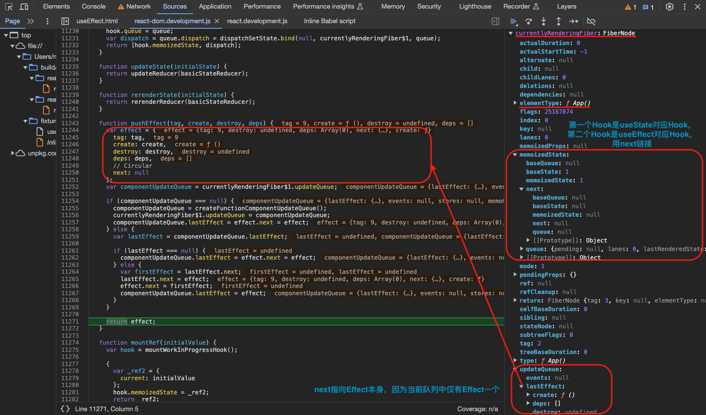
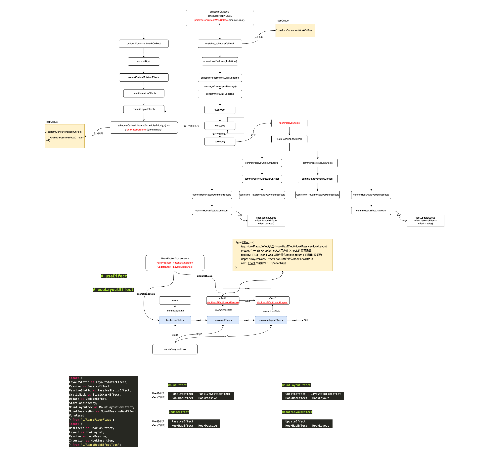

# useEffect

调试用例如下：

```html
<html>
  <body>
    <script src="../../../build/oss-experimental/react/umd/react.development.js"></script>
    <script src="../../../build/oss-experimental/react-dom/umd/react-dom.development.js"></script>
    <script src="https://unpkg.com/babel-standalone@6/babel.js"></script>
    <div id="container"></div>
    <script type="text/babel">
      function App() {
        const [count,setCount] = React.useState(1)

        React.useEffect(()=>{
          console.log("Its useEffect...")
        },[])

        return <div>
                  <h1 onClick={() => setCount(count + 100)}>Hello World!</h1>
                  <h2>HOBO~{count}</h2>
                </div>
      }

      const root = ReactDOM.createRoot(document.getElementById('container'))
      root.render(<App />);
    </script>
  </body>
</html>
```

`useEffect` 的调用可以分为两个过程：

1. 为`useEffect`构造/更新对应的`hook`对象挂载到对应的`fiber`节点上，然后对应的`update`任务后续会加入`taskQueue`；
2. 在`flushPassiveEffects`方法执行`taskQueue`里的一个个任务的时候执行`useEffect`的回调函数；

## useEffect 入口

【TODO：运行两次原因？】

```ts
// 【packages/react-reconciler/src/ReactFiberHooks.js】
export function renderWithHooks<Props, SecondArg>(
  current: Fiber | null,
  workInProgress: Fiber,
  Component: (p: Props, arg: SecondArg) => any,
  props: Props,
  secondArg: SecondArg,
  nextRenderLanes: Lanes,
): any {
  renderLanes = nextRenderLanes;
  currentlyRenderingFiber = workInProgress;

  // 【省略代码...】

  workInProgress.memoizedState = null;
  workInProgress.updateQueue = null;
  workInProgress.lanes = NoLanes;

  // The following should have already been reset
  // currentHook = null;
  // workInProgressHook = null;

  // didScheduleRenderPhaseUpdate = false;
  // localIdCounter = 0;
  // thenableIndexCounter = 0;
  // thenableState = null;

  // TODO Warn if no hooks are used at all during mount, then some are used during update.
  // Currently we will identify the update render as a mount because memoizedState === null.
  // This is tricky because it's valid for certain types of components (e.g. React.lazy)

  // Using memoizedState to differentiate between mount/update only works if at least one stateful hook is used.
  // Non-stateful hooks (e.g. context) don't get added to memoizedState,
  // so memoizedState would be null during updates and mounts.
  // 【根据是否dev环境，是否存在等情况ReactCurrentDispatcher.current用的是不同的方法套装】
  if (__DEV__) {
    if (current !== null && current.memoizedState !== null) {
      ReactCurrentDispatcher.current = HooksDispatcherOnUpdateInDEV;
    } else if (hookTypesDev !== null) {
      // This dispatcher handles an edge case where a component is updating,
      // but no stateful hooks have been used.
      // We want to match the production code behavior (which will use HooksDispatcherOnMount),
      // but with the extra DEV validation to ensure hooks ordering hasn't changed.
      // This dispatcher does that.
      ReactCurrentDispatcher.current = HooksDispatcherOnMountWithHookTypesInDEV;
    } else {
      ReactCurrentDispatcher.current = HooksDispatcherOnMountInDEV;
    }
  } else {
    ReactCurrentDispatcher.current =
      current === null || current.memoizedState === null
        ? HooksDispatcherOnMount
        : HooksDispatcherOnUpdate;
  }

  // In Strict Mode, during development, user functions are double invoked to
  // help detect side effects. The logic for how this is implemented for in
  // hook components is a bit complex so let's break it down.
  //
  // We will invoke the entire component function twice. However, during the
  // second invocation of the component, the hook state from the first
  // invocation will be reused. That means things like `useMemo` functions won't
  // run again, because the deps will match and the memoized result will
  // be reused.
  //
  // We want memoized functions to run twice, too, so account for this, user
  // functions are double invoked during the *first* invocation of the component
  // function, and are *not* double invoked during the second incovation:
  //
  // - First execution of component function: user functions are double invoked
  // - Second execution of component function (in Strict Mode, during
  //   development): user functions are not double invoked.
  //
  // This is intentional for a few reasons; most importantly, it's because of
  // how `use` works when something suspends: it reuses the promise that was
  // passed during the first attempt. This is itself a form of memoization.
  // We need to be able to memoize the reactive inputs to the `use` call using
  // a hook (i.e. `useMemo`), which means, the reactive inputs to `use` must
  // come from the same component invocation as the output.
  //
  // There are plenty of tests to ensure this behavior is correct.
  const shouldDoubleRenderDEV =
    __DEV__ &&
    debugRenderPhaseSideEffectsForStrictMode &&
    (workInProgress.mode & StrictLegacyMode) !== NoMode;

  shouldDoubleInvokeUserFnsInHooksDEV = shouldDoubleRenderDEV;
  // 【---调用Component也就是function---】
  let children = Component(props, secondArg);
  shouldDoubleInvokeUserFnsInHooksDEV = false;

  // Check if there was a render phase update
  if (didScheduleRenderPhaseUpdateDuringThisPass) {
    // Keep rendering until the component stabilizes (there are no more render
    // phase updates).
    children = renderWithHooksAgain(
      workInProgress,
      Component,
      props,
      secondArg,
    );
  }

  if (shouldDoubleRenderDEV) {
    // In development, components are invoked twice to help detect side effects.
    setIsStrictModeForDevtools(true);
    try {
      children = renderWithHooksAgain(
        workInProgress,
        Component,
        props,
        secondArg,
      );
    } finally {
      setIsStrictModeForDevtools(false);
    }
  }

  finishRenderingHooks(current, workInProgress);

  return children;
}
```

根据前文，首次挂载时会循环调用`beginWork`方法生成`fiber`，然后在`ƒ App()`节点的`beginWork`阶段会进入`mountIndeteminateComponent`或者`updateFunctionComponent`方法从而调用`renderWithHooks`方法生成`nextChildren`，其实也就是调用`ƒ App()`函数，然后就会调用我们写的`useEffect`方法：

```ts
// 【packages/react/src/ReactHooks.js】
function useEffect(create, deps) {
  var dispatcher = resolveDispatcher();
  return dispatcher.useEffect(create, deps);
}

import ReactCurrentDispatcher from './ReactCurrentDispatcher';
function resolveDispatcher() {
  const dispatcher = ReactCurrentDispatcher.current;
  if (__DEV__) {
    if (dispatcher === null) {
      console.error(
        'Invalid hook call. Hooks can only be called inside of the body of a function component. This could happen for' +
          ' one of the following reasons:\n' +
          '1. You might have mismatching versions of React and the renderer (such as React DOM)\n' +
          '2. You might be breaking the Rules of Hooks\n' +
          '3. You might have more than one copy of React in the same app\n' +
          'See https://reactjs.org/link/invalid-hook-call for tips about how to debug and fix this problem.',
      );
    }
  }
  // Will result in a null access error if accessed outside render phase. We
  // intentionally don't throw our own error because this is in a hot path.
  // Also helps ensure this is inlined.
  return ((dispatcher: any): Dispatcher);
}
```


`dispatcher`根据环境还有是首次挂载还是更新等情况有区分，可以看到`useEffect`方法实际调用了`mountEffect`或者`updateEffect`：

```ts
// 【传入两个参数，第一个是回调函数，第二个是影响的变量】
// HooksDispatcherOnMount
// HooksDispatcherOnMountInDEV
// HooksDispatcherOnMountWithHookTypesInDEV
// InvalidNestedHooksDispatcherOnMountInDEV
useEffect(
    create: () => (() => void) | void,
    deps: Array<mixed> | void | null,
): void {
    currentHookNameInDev = 'useEffect';
    warnInvalidHookAccess();
    mountHookTypesDev();
    return mountEffect(create, deps);
}
// HooksDispatcherOnUpdate
// HooksDispatcherOnUpdateInDEV
// HooksDispatcherOnRerenderInDEV
// InvalidNestedHooksDispatcherOnUpdateInDEV
// InvalidNestedHooksDispatcherOnRerenderInDEV
useEffect(
    create: () => (() => void) | void,
    deps: Array<mixed> | void | null,
): void {
    currentHookNameInDev = 'useEffect';
    updateHookTypesDev();
    return updateEffect(create, deps);
}
```


## useEffect 原理

### `mountEffect` => `mountEffectImpl` => `mountWorkInProgressHook` / `pushEffect`

`mountEffect`方法其实是调用`mountEffectImpl`：

```ts
// 【packages/react-reconciler/src/ReactFiberHooks.js】
function mountEffect(
  create: () => (() => void) | void,
  deps: Array<mixed> | void | null,
): void {
  if (
    __DEV__ &&
    (currentlyRenderingFiber.mode & StrictEffectsMode) !== NoMode
  ) {
    mountEffectImpl(
      MountPassiveDevEffect | PassiveEffect | PassiveStaticEffect,
      HookPassive,
      create,
      deps,
    );
  } else {
    mountEffectImpl(
      PassiveEffect | PassiveStaticEffect,
      HookPassive,
      create,
      deps,
    );
  }
}
```


- `currentlyRenderingFiber`：当前正在构造的这个`fiber node`
- `currentHook`：`current fiber`对应的`hook list`
- `workInProgressHook`：`workInProgress fiber`对应的`hook list`

1. 首先构造一个空`Hook`对象作为全局唯一的 `workInProgressHook`，如果已有`hook`就用`next`链接，用例中已有一个`useState`对应的`Hook`，所以用`next`链接到其后；
2. 给当前`fiber`的`flags`添加`Passive`标志；
3. 然后调用`pushEffect`方法构造一个`Effect`对象，检查当前`fiber`的`updateQueue`根据是否为空把这个`Effect`对象插入进去，`updateQueue`始终都是一个单向循环的链表，并存入`Hook`对象的`memoizedState`属性；

```ts
export type Hook = {
  memoizedState: any,//缓存值，根据不同hook不一样
  baseState: any,//
  queue: any,//UpdateQueue对象，存储一个update单向循环链表
  baseQueue: Update<any, any> | null,//由于优先级被打断尚未处理的update
  next: Hook | null,//链接的下一个hook
};


let currentlyRenderingFiber: Fiber = (null: any);
// Hooks are stored as a linked list on the fiber's memoizedState field. The
// current hook list is the list that belongs to the current fiber. The
// work-in-progress hook list is a new list that will be added to the
// work-in-progress fiber.
let currentHook: Hook | null = null;//current fiber对应的hook list
let workInProgressHook: Hook | null = null;// workInProgress fiber对应的hook list


// 【packages/react-reconciler/src/ReactFiberHooks.js】
function mountEffect(
  create: () => (() => void) | void,
  deps: Array<mixed> | void | null,
): void {
  if (
    __DEV__ &&
    (currentlyRenderingFiber.mode & StrictEffectsMode) !== NoMode
  ) {
    mountEffectImpl(
      MountPassiveDevEffect | PassiveEffect | PassiveStaticEffect,
      HookPassive,
      create,
      deps,
    );
  } else {
    mountEffectImpl(
      PassiveEffect | PassiveStaticEffect,
      HookPassive,
      create,
      deps,
    );
  }
}

function mountEffectImpl(
  fiberFlags: Flags,//【PassiveEffect】
  hookFlags: HookFlags,//【HookPassive】
  create: () => (() => void) | void,
  deps: Array<mixed> | void | null,
): void {
  //【第一步：构造一个空hook对象，与全局唯一的workInProgressHook链接起来】
  const hook = mountWorkInProgressHook();
  // 【deps是用户传入的依赖参数】
  const nextDeps = deps === undefined ? null : deps;
  // 【给当前fiber添加flags标志Passive | PassiveStatic】
  currentlyRenderingFiber.flags |= fiberFlags;
  // 【第二步：调用pushEffect构造一个effect对象并赋值给hook的memoizedState】
  hook.memoizedState = pushEffect(
    HookHasEffect | hookFlags,
    create,
    undefined,
    nextDeps,
  );
}

function mountWorkInProgressHook(): Hook {
  // memoizedState： useState中 保存 state 信息 ｜ useEffect 中 保存着 effect 对象 ｜ useMemo 中 保存的是缓存的值和 deps ｜ useRef 中保存的是 ref 对象。
  // baseQueue : usestate和useReducer中 保存最新的更新队列。
  // baseState ： usestate和useReducer中,一次更新中 ，产生的最新state值。
  // queue ： 保存待更新队列 pendingQueue ，更新函数 dispatch 等信息。
  // next: 指向下一个 hooks对象。
  const hook: Hook = {
    memoizedState: null,
    baseState: null,
    baseQueue: null,
    queue: null,
    next: null,
  };

  // 【hook用next链接起来】
  if (workInProgressHook === null) {
    // This is the first hook in the list
    currentlyRenderingFiber.memoizedState = workInProgressHook = hook;
  } else {
    // Append to the end of the list
    workInProgressHook = workInProgressHook.next = hook;
  }
  return workInProgressHook;
}


let createFunctionComponentUpdateQueue: () => FunctionComponentUpdateQueue;

function pushEffect(
  tag: HookFlags,
  create: () => (() => void) | void,
  destroy: (() => void) | void,
  deps: Array<mixed> | void | null,
): Effect {
  // 【构造一个effect对象】
  const effect: Effect = {
    tag,
    create,
    destroy,
    deps,
    // Circular
    next: (null: any),
  };

  // 【构造一个环状单向链effect的过程】
  // 【componentUpdateQueue是当前正在渲染过程中的fiber的updateQueue】
  let componentUpdateQueue: null | FunctionComponentUpdateQueue =
    (currentlyRenderingFiber.updateQueue: any);
  // 【当前updateQueue为空，创建一个，然后用构造的effect对象作为lastEffect加入updateQueue】
  if (componentUpdateQueue === null) {
    componentUpdateQueue = createFunctionComponentUpdateQueue();//【{lastEffect: null,events: null,stores: null,memoCache: null}】
    currentlyRenderingFiber.updateQueue = (componentUpdateQueue: any);
    componentUpdateQueue.lastEffect = effect.next = effect;
  } else {
    // 【从updateQueue获取lastEffect】
    const lastEffect = componentUpdateQueue.lastEffect;
    if (lastEffect === null) {
      componentUpdateQueue.lastEffect = effect.next = effect;
    } else {
      const firstEffect = lastEffect.next;
      lastEffect.next = effect;
      effect.next = firstEffect;
      componentUpdateQueue.lastEffect = effect;
    }
  }
  return effect;
}
```




### `updateEffect` => `updateEffectImpl` => `updateWorkInProgressHook` / `pushEffect`

用例中我们为`useEffect`添加第二个参数`count`，然后触发`count`的改变进入`updateEffect`方法，可以看到`updateEffect`其实是调用`updateEffectImpl`。

1. 调用`updateWorkInProgressHook`方法更新当前`hook`对象；
2. 对比新旧`deps`是否相同，决定了是否要对当前`workInProgress fiber`打上`flags`标记；
3. 调用`pushEffect`方法，构造`Effect`对象，加入`workInProgress fiber`的`updateQueue`，并且更新当前 `hook` 的 `memorizedState`；

```ts
// 【packages/react-reconciler/src/ReactFiberHooks.js】
function updateEffect(
  create: () => (() => void) | void,
  deps: Array<mixed> | void | null,
): void {
  updateEffectImpl(PassiveEffect, HookPassive, create, deps);
}

// The work-in-progress fiber. I've named it differently to distinguish it from
// the work-in-progress hook.
let currentlyRenderingFiber: Fiber = (null: any);
// Hooks are stored as a linked list on the fiber's memoizedState field. The
// current hook list is the list that belongs to the current fiber. The
// work-in-progress hook list is a new list that will be added to the
// work-in-progress fiber.
let currentHook: Hook | null = null;
let workInProgressHook: Hook | null = null;

function updateEffectImpl(
  fiberFlags: Flags,
  hookFlags: HookFlags,
  create: () => (() => void) | void,
  deps: Array<mixed> | void | null,
): void {
  const hook = updateWorkInProgressHook();
  const nextDeps = deps === undefined ? null : deps;
  let destroy = undefined;

  // currentHook is null when rerendering after a render phase state update.
  if (currentHook !== null) {
    const prevEffect = currentHook.memoizedState;
    destroy = prevEffect.destroy;
    if (nextDeps !== null) {
      const prevDeps = prevEffect.deps;
      // 【对比current fiber的依赖deps和要更新的树的依赖deps是否发生变化，没有变化就调用pushEffect更新hook.memoizedState上的Effect对象并返回】
      if (areHookInputsEqual(nextDeps, prevDeps)) {
        hook.memoizedState = pushEffect(hookFlags, create, destroy, nextDeps);
        return;
      }
    }
  }

  currentlyRenderingFiber.flags |= fiberFlags;
  // 【更新memoizedState】
  hook.memoizedState = pushEffect(
    HookHasEffect | hookFlags,
    create,
    destroy,
    nextDeps,
  );
}
```


`updateWorkInProgressHook`其实就是要确定两个内容 `nextCurrentHook` 和 `nextWorkInProgressHook`

1. 根据是否存在 `currentHook` 或者 `nextWorkInProgressHook` 来进行复用，`currentHook` 就是当前 `workInProgressFiber` 对应的 `currentFiber` 上的 `hook`；
2. `nextWorkInProgressHook`不存在的话为`workInProgress fiber`构建全新`hook`，`nextWorkInProgressHook` 存在的话其实就是如果多次调用 `FunctionComponent` 的情况下上一次调用时的 `hook`；

```ts
// Hooks are stored as a linked list on the fiber's memoizedState field. The
// current hook list is the list that belongs to the current fiber. The
// work-in-progress hook list is a new list that will be added to the
// work-in-progress fiber.
let currentHook: Hook | null = null;
let workInProgressHook: Hook | null = null;
// The work-in-progress fiber. I've named it differently to distinguish it from
// the work-in-progress hook.
let currentlyRenderingFiber: Fiber = (null: any);

function updateWorkInProgressHook(): Hook {
  // This function is used both for updates and for re-renders triggered by a
  // render phase update. It assumes there is either a current hook we can
  // clone, or a work-in-progress hook from a previous render pass that we can
  // use as a base.
  // 【current hook list】
  // 【workInProgress hook list】

  // 【确定nextCurrentHook：currentFiber上的下一个的hook】
  let nextCurrentHook: null | Hook;
  if (currentHook === null) {
    // 【第一个hook】
    // 【获取workInProgressFiber对应的currentFiber】
    const current = currentlyRenderingFiber.alternate;
    if (current !== null) {
      nextCurrentHook = current.memoizedState;
    } else {
      nextCurrentHook = null;
    }
  } else {
    nextCurrentHook = currentHook.next;
  }

  // 【确定workInProgressHook：下一个需要work的hook，其实就是按序找到此次工作的hook】
  let nextWorkInProgressHook: null | Hook;
  if (workInProgressHook === null) {
    nextWorkInProgressHook = currentlyRenderingFiber.memoizedState;
  } else {
    nextWorkInProgressHook = workInProgressHook.next;
  }

  // 【分支1：复用上一次执行函数组件的hook】
  if (nextWorkInProgressHook !== null) {
    // 【执行了多次函数组件的情况，nextWorkInProgressHook复用上一次执行的hook】
    // There's already a work-in-progress. Reuse it.
    workInProgressHook = nextWorkInProgressHook;
    nextWorkInProgressHook = workInProgressHook.next;

    currentHook = nextCurrentHook;
  } else {
  // 【分支2：复用对应currentFiber的hook】
    // Clone from the current hook.
    // 【nextCurrentHook不存在，报错】
    if (nextCurrentHook === null) {
      const currentFiber = currentlyRenderingFiber.alternate;
      if (currentFiber === null) {
        // This is the initial render. This branch is reached when the component
        // suspends, resumes, then renders an additional hook.
        // Should never be reached because we should switch to the mount dispatcher first.
        throw new Error(
          'Update hook called on initial render. This is likely a bug in React. Please file an issue.',
        );
      } else {
        // This is an update. We should always have a current hook.
        throw new Error('Rendered more hooks than during the previous render.');
      }
    }
    // 【currentHook移动到nextCurrentHook】
    currentHook = nextCurrentHook;
    // 【为workInProgress fiber构造全新的hook，内容借用currentHook】
    const newHook: Hook = {
      memoizedState: currentHook.memoizedState,
      baseState: currentHook.baseState,
      baseQueue: currentHook.baseQueue,
      queue: currentHook.queue,
      next: null,
    };

    if (workInProgressHook === null) {
      // 【当前hook就是第一个】
      // This is the first hook in the list.
      currentlyRenderingFiber.memoizedState = workInProgressHook = newHook;
    } else {
      // 【当前hook就是加到之前的hook后面】
      // Append to the end of the list.
      workInProgressHook = workInProgressHook.next = newHook;
    }
  }
  // 【返回当前需要处理的hook】
  return workInProgressHook;
}
```


### fiber.updateQueue存储的effect list触发时机

前文已知React会通过`scheduleSyncCallback`或者`scheduleCallback`去安排`update`任务，其中一种就是`performSyncWorkOnRoot`或者`performConcurrentWorkOnRoot`，这个任务是完成DOM挂载或更新的方法。而`useEffect`回调的触发在`flushPassiveEffects`任务中完成。那么`flushPassiveEffects`任务什么时候被`scheduleCallback`安排呢？其实是在`commit`过程中，`commitBeforeMutationEffects`之前：

```ts
function commitRootImpl(
  root: FiberRoot,
  recoverableErrors: null | Array<CapturedValue<mixed>>,
  transitions: Array<Transition> | null,
  renderPriorityLevel: EventPriority,
) {
  do {
    // `flushPassiveEffects` will call `flushSyncUpdateQueue` at the end, which
    // means `flushPassiveEffects` will sometimes result in additional
    // passive effects. So we need to keep flushing in a loop until there are
    // no more pending effects.
    // TODO: Might be better if `flushPassiveEffects` did not automatically
    // flush synchronous work at the end, to avoid factoring hazards like this.
    flushPassiveEffects();
  } while (rootWithPendingPassiveEffects !== null);

  // 【省略代码...】

  const finishedWork = root.finishedWork;
  const lanes = root.finishedLanes;

  // 【省略代码...】

  root.finishedWork = null;
  root.finishedLanes = NoLanes;

  if (finishedWork === root.current) {
    throw new Error(
      'Cannot commit the same tree as before. This error is likely caused by ' +
        'a bug in React. Please file an issue.',
    );
  }

  // commitRoot never returns a continuation; it always finishes synchronously.
  // So we can clear these now to allow a new callback to be scheduled.
  root.callbackNode = null;
  root.callbackPriority = NoLane;

  // Check which lanes no longer have any work scheduled on them, and mark
  // those as finished.
  let remainingLanes = mergeLanes(finishedWork.lanes, finishedWork.childLanes);

  // Make sure to account for lanes that were updated by a concurrent event
  // during the render phase; don't mark them as finished.
  const concurrentlyUpdatedLanes = getConcurrentlyUpdatedLanes();
  remainingLanes = mergeLanes(remainingLanes, concurrentlyUpdatedLanes);

  markRootFinished(root, remainingLanes);

  if (root === workInProgressRoot) {
    // We can reset these now that they are finished.
    workInProgressRoot = null;
    workInProgress = null;
    workInProgressRootRenderLanes = NoLanes;
  } else {
    // This indicates that the last root we worked on is not the same one that
    // we're committing now. This most commonly happens when a suspended root
    // times out.
  }

  // If there are pending passive effects, schedule a callback to process them.
  // Do this as early as possible, so it is queued before anything else that
  // might get scheduled in the commit phase. (See #16714.)
  // TODO: Delete all other places that schedule the passive effect callback
  // They're redundant.
  if (
    (finishedWork.subtreeFlags & PassiveMask) !== NoFlags ||
    (finishedWork.flags & PassiveMask) !== NoFlags
  ) {
    if (!rootDoesHavePassiveEffects) {
      rootDoesHavePassiveEffects = true;
      pendingPassiveEffectsRemainingLanes = remainingLanes;
      // workInProgressTransitions might be overwritten, so we want
      // to store it in pendingPassiveTransitions until they get processed
      // We need to pass this through as an argument to commitRoot
      // because workInProgressTransitions might have changed between
      // the previous render and commit if we throttle the commit
      // with setTimeout
      pendingPassiveTransitions = transitions;
      // 【-----Scheduler安排flushPassiveEffects任务-----】
      scheduleCallback(NormalSchedulerPriority, () => {
        flushPassiveEffects();
        // This render triggered passive effects: release the root cache pool
        // *after* passive effects fire to avoid freeing a cache pool that may
        // be referenced by a node in the tree (HostRoot, Cache boundary etc)
        return null;
      });
    }
  }

  // Check if there are any effects in the whole tree.
  // TODO: This is left over from the effect list implementation, where we had
  // to check for the existence of `firstEffect` to satisfy Flow. I think the
  // only other reason this optimization exists is because it affects profiling.
  // Reconsider whether this is necessary.
  const subtreeHasEffects =
    (finishedWork.subtreeFlags &
      (BeforeMutationMask | MutationMask | LayoutMask | PassiveMask)) !==
    NoFlags;
  const rootHasEffect =
    (finishedWork.flags &
      (BeforeMutationMask | MutationMask | LayoutMask | PassiveMask)) !==
    NoFlags;

  if (subtreeHasEffects || rootHasEffect) {
    const prevTransition = ReactCurrentBatchConfig.transition;
    ReactCurrentBatchConfig.transition = null;
    const previousPriority = getCurrentUpdatePriority();
    setCurrentUpdatePriority(DiscreteEventPriority);

    const prevExecutionContext = executionContext;
    executionContext |= CommitContext;

    // Reset this to null before calling lifecycles
    ReactCurrentOwner.current = null;

    // The commit phase is broken into several sub-phases. We do a separate pass
    // of the effect list for each phase: all mutation effects come before all
    // layout effects, and so on.

    // The first phase a "before mutation" phase. We use this phase to read the
    // state of the host tree right before we mutate it. This is where
    // getSnapshotBeforeUpdate is called.
    const shouldFireAfterActiveInstanceBlur = commitBeforeMutationEffects(
      root,
      finishedWork,
    );

    // 【省略代码...】

    // The next phase is the mutation phase, where we mutate the host tree.
    commitMutationEffects(root, finishedWork, lanes);

    // 【省略代码...】

    // The work-in-progress tree is now the current tree. This must come after
    // the mutation phase, so that the previous tree is still current during
    // componentWillUnmount, but before the layout phase, so that the finished
    // work is current during componentDidMount/Update.
    root.current = finishedWork;

    // The next phase is the layout phase, where we call effects that read
    // the host tree after it's been mutated. The idiomatic use case for this is
    // layout, but class component lifecycles also fire here for legacy reasons.
    // 【省略代码...】

    commitLayoutEffects(finishedWork, root, lanes);

    // 【省略代码...】

    // Tell Scheduler to yield at the end of the frame, so the browser has an
    // opportunity to paint.
    requestPaint();

    executionContext = prevExecutionContext;

    // Reset the priority to the previous non-sync value.
    setCurrentUpdatePriority(previousPriority);
    ReactCurrentBatchConfig.transition = prevTransition;
  } else {
    // No effects.
    root.current = finishedWork;
    // Measure these anyway so the flamegraph explicitly shows that there were
    // no effects.
    // TODO: Maybe there's a better way to report this.
    if (enableProfilerTimer) {
      recordCommitTime();
    }
  }

  // 【省略代码...】

  // Always call this before exiting `commitRoot`, to ensure that any
  // additional work on this root is scheduled.
  ensureRootIsScheduled(root, now());

  // 【省略代码...】

  // If layout work was scheduled, flush it now.
  flushSyncCallbacks();

  // 【省略代码...】

  return null;
}
```

此时`flushPassiveEffects`任务已经入队，什么时候被调用呢？(Concurrency模式)

如果是**首次挂载**，首先在`unstable_scheduleCallback`方法中`performConcurrentWorkOnRoot`加入`TaskQueue`队列，此时没有其他任务在执行，所以调用`requestHostCallback`从而进入`performConcurrentWorkOnRoot`。然后我们执行`performConcurrentWorkOnRoot`时`commit`过程中调用`scheduleCallback`将`flushPassiveEffects`任务加入`TaskQueue`队列。然后执行完`commit`的三个关键步骤，此时DOM挂载也已经完成，最终完成`performConcurrentWorkOnRoot`回到`workLoop`方法执行`TaskQueue`队列的下一个任务也就是`flushPassiveEffects`任务，此时就会完成首次挂载的`useEffect`回调。

- `scheduleCallback` => `unstable_scheduleCallback` => `performConcurrentWorkOnRoot`加入`TaskQueue`+`requestHostCallback(flushWork)` => `schedulePerformWorkUntilDeadline` => `messageChannel.postMessage()` => `performWorkUntilDeadline` => `flushWork` => `workLoop`  => `performConcurrentWorkOnRoot`执行
- `performConcurrentWorkOnRoot` => `commitRootImpl` => `scheduleCallback` => `unstable_scheduleCallback` => `flushPassiveEffects`加入`TaskQueue`队列
- `performConcurrentWorkOnRoot`执行结束回到`workLoop`，继续执行下一个Task也就是`flushPassiveEffects`，执行`useEffect`回调


如果是**更新阶段**，在我们的例子中点击某个元素造成`state`的改变从而引起UI的变化，此时会进入`flushSyncCallbacks`方法，第一步先执行`performSyncWorkOnRoot`方法去更新DOM，在`commit`过程中同样也先调用`scheduleCallback`将`flushPassiveEffects`任务加入`TaskQueue`队列。和首次挂载不同的是，更新阶段在`commit`的三个步骤走完之后，会直接调用`flushPassiveEffects`方法，继而执行`useEffect`的回调。


```ts
// 【commitRootImpl方法中调用scheduleCallback安排flushPassiveEffects】
scheduleCallback(NormalSchedulerPriority, () => {
  flushPassiveEffects();
  // This render triggered passive effects: release the root cache pool
  // *after* passive effects fire to avoid freeing a cache pool that may
  // be referenced by a node in the tree (HostRoot, Cache boundary etc)
  return null;
});

function scheduleCallback(priorityLevel: any, callback) {
  if (__DEV__) {
    // If we're currently inside an `act` scope, bypass Scheduler and push to
    // the `act` queue instead.
    const actQueue = ReactCurrentActQueue.current;
    if (actQueue !== null) {
      actQueue.push(callback);
      return fakeActCallbackNode;
    } else {
      return Scheduler_scheduleCallback(priorityLevel, callback);
    }
  } else {
    // In production, always call Scheduler. This function will be stripped out.
    return Scheduler_scheduleCallback(priorityLevel, callback);
  }
}

function unstable_scheduleCallback(
  priorityLevel: PriorityLevel,
  callback: Callback,
  options?: {delay: number},
): Task {
  var currentTime = getCurrentTime();

  var startTime;
  if (typeof options === 'object' && options !== null) {
    var delay = options.delay;
    if (typeof delay === 'number' && delay > 0) {
      startTime = currentTime + delay;
    } else {
      startTime = currentTime;
    }
  } else {
    startTime = currentTime;
  }

  var timeout;
  switch (priorityLevel) {
    case ImmediatePriority:
      timeout = IMMEDIATE_PRIORITY_TIMEOUT;
      break;
    case UserBlockingPriority:
      timeout = USER_BLOCKING_PRIORITY_TIMEOUT;
      break;
    case IdlePriority:
      timeout = IDLE_PRIORITY_TIMEOUT;
      break;
    case LowPriority:
      timeout = LOW_PRIORITY_TIMEOUT;
      break;
    case NormalPriority:
    default:
      timeout = NORMAL_PRIORITY_TIMEOUT;
      break;
  }

  var expirationTime = startTime + timeout;

  var newTask: Task = {
    id: taskIdCounter++,
    callback,
    priorityLevel,
    startTime,
    expirationTime,
    sortIndex: -1,
  };
  if (enableProfiling) {
    newTask.isQueued = false;
  }

  if (startTime > currentTime) {
    // This is a delayed task.
    newTask.sortIndex = startTime;
    push(timerQueue, newTask);
    if (peek(taskQueue) === null && newTask === peek(timerQueue)) {
      // All tasks are delayed, and this is the task with the earliest delay.
      if (isHostTimeoutScheduled) {
        // Cancel an existing timeout.
        cancelHostTimeout();
      } else {
        isHostTimeoutScheduled = true;
      }
      // Schedule a timeout.
      requestHostTimeout(handleTimeout, startTime - currentTime);
    }
  } else {
    newTask.sortIndex = expirationTime;
    push(taskQueue, newTask);
    if (enableProfiling) {
      markTaskStart(newTask, currentTime);
      newTask.isQueued = true;
    }
    // Schedule a host callback, if needed. If we're already performing work,
    // wait until the next time we yield.
    if (!isHostCallbackScheduled && !isPerformingWork) {
      isHostCallbackScheduled = true;
      requestHostCallback(flushWork);
    }
  }

  return newTask;
}


function requestHostCallback(
  callback: (hasTimeRemaining: boolean, initialTime: number) => boolean,
) {
  scheduledHostCallback = callback;
  if (!isMessageLoopRunning) {
    isMessageLoopRunning = true;
    schedulePerformWorkUntilDeadline();
  }
}

const localSetImmediate =
  typeof setImmediate !== 'undefined' ? setImmediate : null; // IE and Node.js + jsdom
const localSetTimeout = typeof setTimeout === 'function' ? setTimeout : null;
const localClearTimeout =
  typeof clearTimeout === 'function' ? clearTimeout : null;
let schedulePerformWorkUntilDeadline;
// 【setImmediate  MessageChannel  setTimeout三种方案顺序】
if (typeof localSetImmediate === 'function') {
  // Node.js and old IE.
  // There's a few reasons for why we prefer setImmediate.
  //
  // Unlike MessageChannel, it doesn't prevent a Node.js process from exiting.
  // (Even though this is a DOM fork of the Scheduler, you could get here
  // with a mix of Node.js 15+, which has a MessageChannel, and jsdom.)
  // https://github.com/facebook/react/issues/20756
  //
  // But also, it runs earlier which is the semantic we want.
  // If other browsers ever implement it, it's better to use it.
  // Although both of these would be inferior to native scheduling.
  schedulePerformWorkUntilDeadline = () => {
    localSetImmediate(performWorkUntilDeadline);
  };
} else if (typeof MessageChannel !== 'undefined') {
  // DOM and Worker environments.
  // We prefer MessageChannel because of the 4ms setTimeout clamping.
  const channel = new MessageChannel();
  const port = channel.port2;
  channel.port1.onmessage = performWorkUntilDeadline;
  schedulePerformWorkUntilDeadline = () => {
    port.postMessage(null);
  };
} else {
  // We should only fallback here in non-browser environments.
  schedulePerformWorkUntilDeadline = () => {
    // $FlowFixMe[not-a-function] nullable value
    localSetTimeout(performWorkUntilDeadline, 0);
  };
}

// 【scheduledHostCallback = callback;】
const performWorkUntilDeadline = () => {
  if (scheduledHostCallback !== null) {
    const currentTime = getCurrentTime();
    // Keep track of the start time so we can measure how long the main thread
    // has been blocked.
    startTime = currentTime;
    const hasTimeRemaining = true;

    // If a scheduler task throws, exit the current browser task so the
    // error can be observed.
    //
    // Intentionally not using a try-catch, since that makes some debugging
    // techniques harder. Instead, if `scheduledHostCallback` errors, then
    // `hasMoreWork` will remain true, and we'll continue the work loop.
    let hasMoreWork = true;
    try {
      // $FlowFixMe[not-a-function] found when upgrading Flow
      // 【执行回调，就是前面传入的flushWork函数】
      hasMoreWork = scheduledHostCallback(hasTimeRemaining, currentTime);
    } finally {
      if (hasMoreWork) {
        // If there's more work, schedule the next message event at the end
        // of the preceding one.
        schedulePerformWorkUntilDeadline();
      } else {
        isMessageLoopRunning = false;
        scheduledHostCallback = null;
      }
    }
  } else {
    isMessageLoopRunning = false;
  }
  // Yielding to the browser will give it a chance to paint, so we can
  // reset this.
  needsPaint = false;
};

// 【调用workLoop】
function flushWork(hasTimeRemaining: boolean, initialTime: number) {
  if (enableProfiling) {
    markSchedulerUnsuspended(initialTime);
  }

  // We'll need a host callback the next time work is scheduled.
  isHostCallbackScheduled = false;
  if (isHostTimeoutScheduled) {
    // We scheduled a timeout but it's no longer needed. Cancel it.
    isHostTimeoutScheduled = false;
    cancelHostTimeout();
  }

  isPerformingWork = true;
  const previousPriorityLevel = currentPriorityLevel;
  try {
    if (enableProfiling) {
      try {
        return workLoop(hasTimeRemaining, initialTime);
      } catch (error) {
        if (currentTask !== null) {
          const currentTime = getCurrentTime();
          // $FlowFixMe[incompatible-call] found when upgrading Flow
          markTaskErrored(currentTask, currentTime);
          // $FlowFixMe[incompatible-use] found when upgrading Flow
          currentTask.isQueued = false;
        }
        throw error;
      }
    } else {
      // No catch in prod code path.
      return workLoop(hasTimeRemaining, initialTime);
    }
  } finally {
    currentTask = null;
    currentPriorityLevel = previousPriorityLevel;
    isPerformingWork = false;
    if (enableProfiling) {
      const currentTime = getCurrentTime();
      markSchedulerSuspended(currentTime);
    }
  }
}

// 【顺序执行taskQueue里的任务】
function workLoop(hasTimeRemaining: boolean, initialTime: number) {
  let currentTime = initialTime;
  advanceTimers(currentTime);
  currentTask = peek(taskQueue);
  while (
    currentTask !== null &&
    !(enableSchedulerDebugging && isSchedulerPaused)
  ) {
    if (
      currentTask.expirationTime > currentTime &&
      (!hasTimeRemaining || shouldYieldToHost())
    ) {
      // This currentTask hasn't expired, and we've reached the deadline.
      break;
    }
    // $FlowFixMe[incompatible-use] found when upgrading Flow
    const callback = currentTask.callback;
    if (typeof callback === 'function') {
      // $FlowFixMe[incompatible-use] found when upgrading Flow
      currentTask.callback = null;
      // $FlowFixMe[incompatible-use] found when upgrading Flow
      currentPriorityLevel = currentTask.priorityLevel;
      // $FlowFixMe[incompatible-use] found when upgrading Flow
      const didUserCallbackTimeout = currentTask.expirationTime <= currentTime;
      if (enableProfiling) {
        // $FlowFixMe[incompatible-call] found when upgrading Flow
        markTaskRun(currentTask, currentTime);
      }
      const continuationCallback = callback(didUserCallbackTimeout);
      currentTime = getCurrentTime();
      if (typeof continuationCallback === 'function') {
        // If a continuation is returned, immediately yield to the main thread
        // regardless of how much time is left in the current time slice.
        // $FlowFixMe[incompatible-use] found when upgrading Flow
        currentTask.callback = continuationCallback;
        if (enableProfiling) {
          // $FlowFixMe[incompatible-call] found when upgrading Flow
          markTaskYield(currentTask, currentTime);
        }
        advanceTimers(currentTime);
        return true;
      } else {
        if (enableProfiling) {
          // $FlowFixMe[incompatible-call] found when upgrading Flow
          markTaskCompleted(currentTask, currentTime);
          // $FlowFixMe[incompatible-use] found when upgrading Flow
          currentTask.isQueued = false;
        }
        if (currentTask === peek(taskQueue)) {
          pop(taskQueue);
        }
        advanceTimers(currentTime);
      }
    } else {
      pop(taskQueue);
    }
    currentTask = peek(taskQueue);
  }
  // Return whether there's additional work
  if (currentTask !== null) {
    return true;
  } else {
    const firstTimer = peek(timerQueue);
    if (firstTimer !== null) {
      requestHostTimeout(handleTimeout, firstTimer.startTime - currentTime);
    }
    return false;
  }
}
```

### `flushPassiveEffects`

`flushPassiveEffects` => `flushPassiveEffectsImpl` => `commitPassiveMountEffects` => `recursivelyTraversePassiveMountEffects` => `commitPassiveMountOnFiber` => `commitHookPassiveMountEffects` => `commitHookEffectListMount`

```ts
// 【packages/react-reconciler/src/ReactFiberWorkLoop.js】
export function flushPassiveEffects(): boolean {
  // Returns whether passive effects were flushed.
  // TODO: Combine this check with the one in flushPassiveEFfectsImpl. We should
  // probably just combine the two functions. I believe they were only separate
  // in the first place because we used to wrap it with
  // `Scheduler.runWithPriority`, which accepts a function. But now we track the
  // priority within React itself, so we can mutate the variable directly.
  if (rootWithPendingPassiveEffects !== null) {
    // Cache the root since rootWithPendingPassiveEffects is cleared in
    // flushPassiveEffectsImpl
    const root = rootWithPendingPassiveEffects;
    // Cache and clear the remaining lanes flag; it must be reset since this
    // method can be called from various places, not always from commitRoot
    // where the remaining lanes are known
    const remainingLanes = pendingPassiveEffectsRemainingLanes;
    pendingPassiveEffectsRemainingLanes = NoLanes;

    const renderPriority = lanesToEventPriority(pendingPassiveEffectsLanes);
    const priority = lowerEventPriority(DefaultEventPriority, renderPriority);
    const prevTransition = ReactCurrentBatchConfig.transition;
    const previousPriority = getCurrentUpdatePriority();

    try {
      ReactCurrentBatchConfig.transition = null;
      setCurrentUpdatePriority(priority);
      return flushPassiveEffectsImpl();
    } finally {
      setCurrentUpdatePriority(previousPriority);
      ReactCurrentBatchConfig.transition = prevTransition;

      // Once passive effects have run for the tree - giving components a
      // chance to retain cache instances they use - release the pooled
      // cache at the root (if there is one)
      releaseRootPooledCache(root, remainingLanes);
    }
  }
  return false;
}


function commitHookEffectListMount(flags: HookFlags, finishedWork: Fiber) {
  const updateQueue: FunctionComponentUpdateQueue | null =
    (finishedWork.updateQueue: any);
  const lastEffect = updateQueue !== null ? updateQueue.lastEffect : null;
  if (lastEffect !== null) {
    const firstEffect = lastEffect.next;
    let effect = firstEffect;
    // 【遍历effect list执行用户回调】
    do {
      if ((effect.tag & flags) === flags) {
        if (enableSchedulingProfiler) {
          if ((flags & HookPassive) !== NoHookEffect) {
            markComponentPassiveEffectMountStarted(finishedWork);
          } else if ((flags & HookLayout) !== NoHookEffect) {
            markComponentLayoutEffectMountStarted(finishedWork);
          }
        }

        // Mount
        const create = effect.create;
        if (__DEV__) {
          if ((flags & HookInsertion) !== NoHookEffect) {
            setIsRunningInsertionEffect(true);
          }
        }
        effect.destroy = create();
        if (__DEV__) {
          if ((flags & HookInsertion) !== NoHookEffect) {
            setIsRunningInsertionEffect(false);
          }
        }

        if (enableSchedulingProfiler) {
          if ((flags & HookPassive) !== NoHookEffect) {
            markComponentPassiveEffectMountStopped();
          } else if ((flags & HookLayout) !== NoHookEffect) {
            markComponentLayoutEffectMountStopped();
          }
        }

        if (__DEV__) {
          const destroy = effect.destroy;
          if (destroy !== undefined && typeof destroy !== 'function') {
            let hookName;
            if ((effect.tag & HookLayout) !== NoFlags) {
              hookName = 'useLayoutEffect';
            } else if ((effect.tag & HookInsertion) !== NoFlags) {
              hookName = 'useInsertionEffect';
            } else {
              hookName = 'useEffect';
            }
            let addendum;
            if (destroy === null) {
              addendum =
                ' You returned null. If your effect does not require clean ' +
                'up, return undefined (or nothing).';
            } else if (typeof destroy.then === 'function') {
              addendum =
                '\n\nIt looks like you wrote ' +
                hookName +
                '(async () => ...) or returned a Promise. ' +
                'Instead, write the async function inside your effect ' +
                'and call it immediately:\n\n' +
                hookName +
                '(() => {\n' +
                '  async function fetchData() {\n' +
                '    // You can await here\n' +
                '    const response = await MyAPI.getData(someId);\n' +
                '    // ...\n' +
                '  }\n' +
                '  fetchData();\n' +
                `}, [someId]); // Or [] if effect doesn't need props or state\n\n` +
                'Learn more about data fetching with Hooks: https://reactjs.org/link/hooks-data-fetching';
            } else {
              addendum = ' You returned: ' + destroy;
            }
            console.error(
              '%s must not return anything besides a function, ' +
                'which is used for clean-up.%s',
              hookName,
              addendum,
            );
          }
        }
      }
      effect = effect.next;
    } while (effect !== firstEffect);
  }
}
```

## uselayoutEffect

useLayoutEffect is a version of useEffect that fires before the browser repaints the screen.

- `useEffect`是异步调度，等页面渲染完成后再去执行，不会阻塞页面渲染。
- `uselayoutEffect`是在三段`commit`过程中的第三段`commitLayoutEffects`中完成，所以肯定也就是在`useEffect`之前，在DOM更新之后。

`commitRoot` => `commitRootImpl` => `commitLayoutEffects` => `commitLayoutEffectsOnFiber` => `recursivelyTraverseLayoutEffects` => `commitLayoutEffectOnFiber` => `commitHooLayoutEffects` => `commitHookEffectListMount`

```ts
// 【packages/react-reconciler/src/ReactFiberHooks.js】
function mountLayoutEffect(
  create: () => (() => void) | void,
  deps: Array<mixed> | void | null,
): void {
  let fiberFlags: Flags = UpdateEffect | LayoutStaticEffect;
  if (
    __DEV__ &&
    (currentlyRenderingFiber.mode & StrictEffectsMode) !== NoMode
  ) {
    fiberFlags |= MountLayoutDevEffect;
  }
  return mountEffectImpl(fiberFlags, HookLayout, create, deps);
}

function mountEffectImpl(
  fiberFlags: Flags,
  hookFlags: HookFlags,
  create: () => (() => void) | void,
  deps: Array<mixed> | void | null,
): void {
  const hook = mountWorkInProgressHook();
  const nextDeps = deps === undefined ? null : deps;
  // 【flags标记】
  currentlyRenderingFiber.flags |= fiberFlags;
  hook.memoizedState = pushEffect(
    HookHasEffect | hookFlags,
    create,
    undefined,
    nextDeps,
  );
}
```

## 总结

1. `useEffect`的注册可能会调用`mountEffect`或者`updateEffect`；
2. `mountEffect`会创建一个`hook`实例，和之前的`hook`用`next`相连，然后将其存储到对应`fiber`的`memoizedState`属性上，给对应`fiber`添加`Passive`标志，最后创建`effect`对象存储到`hook`的`memoizedState`上以及`fiber`的`upQueue`属性上，`fiber`的`upQueue`属性上的`effect`用`next`链接并收尾相连是一个单向循环的链表；
3. `updateEffect`会更新当前`hook`实例，这个更新过程会找上一轮的hook状态来决定是否进行复用，接着就是对比第二项参数也就是依赖的state前后是否相同，没变化会直接返回，有变化就会给对应`fiber`打`Passive`标记，最后调用`pushEffect`方法，构造`effect`对象，加入`workInProgress fiber`的`updateQueue`，并且更新当前`hook`的`memorizedState`；
4. `useEffect`回调函数真正的调用其实取决于`flushPassiveEffects`，而在`Concurrency`模式下，任务都通过`scheduleCallback`加入任务队列根据优先级在合适的时机调用，首次挂载时`scheduleCallback`会先把DOM挂载任务加入任务队列并执行，然后挂载任务在commit阶段会将`flushPassiveEffects`任务加入队列，在完成挂载任务后就会去执行`flushPassiveEffects`任务，从而把`fiber`树上标志`Passive`的节点的`updateQueue`全部执行掉。更新阶段的话在更新任务的commit阶段会直接调用`flushPassiveEffects`。


