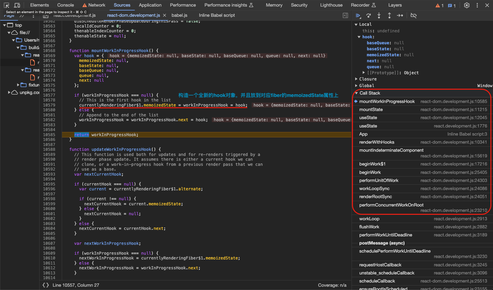

# 状态管理Hook

## useState

useState is a React Hook that lets you add a state variable to your component.

调试用例如下：

```html
<html>
  <body>
    <script src="../../../build/oss-experimental/react/umd/react.development.js"></script>
    <script src="../../../build/oss-experimental/react-dom/umd/react-dom.development.js"></script>
    <script src="https://unpkg.com/babel-standalone@6/babel.js"></script>
    <div id="container"></div>
    <script type="text/babel">
      function App() {
        const [count,setCount] = React.useState(1)

        return <div>
                  <h1 onClick={() => setCount(count + 100)}>Hello World!</h1>
                  <h2>HOBO~{count}</h2>
                </div>
      }

      const root = ReactDOM.createRoot(document.getElementById('container'))
      root.render(<App />);
    </script>
  </body>
</html>
```

### useState 入口

`render`阶段在处理函数组件时调用`renderWithHooks`方法时会调用该函数组件，从而调用`useState`，然后可能会调用方法有`mountState` | `updateState` | `rerenderState`。首次挂载进入函数组件的`beginWork`过程时会调用`renderWithHooks`方法，此时会执行本函数，从而进入`mountState`方法如下：

```ts
// 【packages/react/src/ReactHooks.js】
export function useState<S>(
  initialState: (() => S) | S,
): [S, Dispatch<BasicStateAction<S>>] {
  const dispatcher = resolveDispatcher();
  return dispatcher.useState(initialState);
}

useState<S>(
    initialState: (() => S) | S,
): [S, Dispatch<BasicStateAction<S>>] {
    currentHookNameInDev = 'useState';
    mountHookTypesDev();
    const prevDispatcher = ReactCurrentDispatcher.current;
    ReactCurrentDispatcher.current = InvalidNestedHooksDispatcherOnMountInDEV;
    try {
        return mountState(initialState);
    } finally {
        ReactCurrentDispatcher.current = prevDispatcher;
    }
}

useState<S>(
    initialState: (() => S) | S,
): [S, Dispatch<BasicStateAction<S>>] {
    currentHookNameInDev = 'useState';
    updateHookTypesDev();
    const prevDispatcher = ReactCurrentDispatcher.current;
    ReactCurrentDispatcher.current =
    InvalidNestedHooksDispatcherOnRerenderInDEV;
    try {
        return rerenderState(initialState);
    } finally {
        ReactCurrentDispatcher.current = prevDispatcher;
    }
}

useState<S>(
    initialState: (() => S) | S,
): [S, Dispatch<BasicStateAction<S>>] {
    currentHookNameInDev = 'useState';
    warnInvalidHookAccess();
    updateHookTypesDev();
    const prevDispatcher = ReactCurrentDispatcher.current;
    ReactCurrentDispatcher.current =
    InvalidNestedHooksDispatcherOnUpdateInDEV;
    try {
        return updateState(initialState);
    } finally {
        ReactCurrentDispatcher.current = prevDispatcher;
    }
},
```

### useState 原理

#### `mountState`

创建一个对应的 `hook` 并定义 `memoizedState` 、 `baseState` 、 `queue` 等属性，返回`[hook.memoizedState, dispatch]`， `dispatch` 就是返回给用户更新状态的方法：

1. 调用`mountWorkInProgressHook`方法创建一个`hook`实例并存储到对应`fiber`的`memoizedState`属性上；
2. 初始值如果用户传的是函数就执行获取，然后将初始值`initialState`存储到`hook`的`memoizedState`和`baseState`属性上；
3. 构造一个`UpdateQueue`实例挂载在`hook`的`queue`属性上；
4. 构造`dispatch`方法挂载在`hook.queue.dispatch`上，实质是调用的`React`提供的`dispatchSetState`方法，这个方法里除了计算最新的`state`值与旧值比较还会根据`state`值是否改变，如果改变了会构造`update`任务并调用`scheduleUpdateOnFiber`安排`performConcurrentWorkOnRoot`进`TaskQueue`任务队列；
5. 返回`[hook.memoizedState, dispatch]`；

```ts
// 【packages/react-reconciler/src/ReactFiberHooks.js】
function mountState<S>(
  initialState: (() => S) | S,
): [S, Dispatch<BasicStateAction<S>>] {
  // 【创建hook】
  const hook = mountWorkInProgressHook();
  //【用户传入的initialState如果是函数就执行】
  if (typeof initialState === 'function') {
    // $FlowFixMe: Flow doesn't like mixed types
    initialState = initialState();
  }
  // 【hook的memoizedState设为initialState】
  hook.memoizedState = hook.baseState = initialState;
  // 【生成一个queue并挂到hook上】
  const queue: UpdateQueue<S, BasicStateAction<S>> = {
    pending: null,
    lanes: NoLanes,
    dispatch: null,
    lastRenderedReducer: basicStateReducer,
    lastRenderedState: (initialState: any),
  };
  hook.queue = queue;
  // 【dispatch用于更新状态的方法，实际调用了dispatchSetState，保存在queue的dispatch属性上】
  const dispatch: Dispatch<BasicStateAction<S>> = (queue.dispatch =
    (dispatchSetState.bind(null, currentlyRenderingFiber, queue): any));
  // 【返回[hook.memoizedState, dispatch]，dispatch就是返回给用户用来更新状态的方法】
  return [hook.memoizedState, dispatch];
}

function basicStateReducer<S>(state: S, action: BasicStateAction<S>): S {
  // $FlowFixMe: Flow doesn't like mixed types
  return typeof action === 'function' ? action(state) : action;
}

function mountWorkInProgressHook(): Hook {
  const hook: Hook = {
    memoizedState: null,
    baseState: null,
    baseQueue: null,
    queue: null,
    next: null,
  };

  if (workInProgressHook === null) {
    // This is the first hook in the list
    currentlyRenderingFiber.memoizedState = workInProgressHook = hook;
  } else {
    // Append to the end of the list
    workInProgressHook = workInProgressHook.next = hook;
  }
  return workInProgressHook;
}
```




#### `dispatchSetState`

`dispatchSetState`可能有两种情况，一种是在 `render` 过程中产生的 `update`，那就会把当前`Update`任务加入当前`hook`的`queue`的`pending` 队列，另外就是非 `render` 过程，那就会先趁空隙计算出当前状态值，和之前的状态值对比，如果没有变化那也就不需要更新，如果有变化去调度更新。

```ts
dispatchSetState.bind(null, currentlyRenderingFiber, queue)
```

1. render过程中产生的进入`enqueueRenderPhaseUpdate`，`Update`任务直接加入对应`hook`的`queue`的`pending`队列；
2. 非render过程中产生的进入`enqueueConcurrentHookUpdate`，会将`fiber`、`queue`、`update`、`lane`加入`concurrentQueues`等待后续合适时机的处理，最后由`scheduleUpdateOnFiber`安排任务执行时机。根据优先级等一系列判断，本例中会进入`ScheduleSyncCallback(performSyncWorkOnRoot.bind(null, root))`，直接进行同步任务的执行；

```ts
// 【packages/react-reconciler/src/ReactFiberHooks.js】
function dispatchSetState<S, A>(
  fiber: Fiber,//【currentlyRenderingFiber】
  queue: UpdateQueue<S, A>,//【queue】
  action: A,
): void {
  // 【省略代码...】
  // 【获取优先级】
  const lane = requestUpdateLane(fiber);

  // 【创建一个update】
  const update: Update<S, A> = {
    lane,
    action,
    hasEagerState: false,
    eagerState: null,
    next: (null: any),
  };

  // 【将 update 链接到更新队列中】
  if (isRenderPhaseUpdate(fiber)) {
    // 【在render过程中，会触发re-render】
    enqueueRenderPhaseUpdate(queue, update);
  } else {
    // 【非render过程中】
    const alternate = fiber.alternate;
    // 【fiber.lanes有值表示已有更新事件，就会跳过此步，因此调用两次setState只有第一次有效】
    if (
      fiber.lanes === NoLanes &&
      (alternate === null || alternate.lanes === NoLanes)
    ) {
      // 【queue为空时，先把state计算好保存到eagerState中】
      // The queue is currently empty, which means we can eagerly compute the
      // next state before entering the render phase. If the new state is the
      // same as the current state, we may be able to bail out entirely.
      const lastRenderedReducer = queue.lastRenderedReducer;
      if (lastRenderedReducer !== null) {
        let prevDispatcher;
        // 【省略代码...】
        try {
          const currentState: S = (queue.lastRenderedState: any);
          const eagerState = lastRenderedReducer(currentState, action);
          // Stash the eagerly computed state, and the reducer used to compute
          // it, on the update object. If the reducer hasn't changed by the
          // time we enter the render phase, then the eager state can be used
          // without calling the reducer again.
          update.hasEagerState = true;
          update.eagerState = eagerState;
          //【对比新旧state，如果相同无需更新，用Object.is比较】
          if (is(eagerState, currentState)) {
            // Fast path. We can bail out without scheduling React to re-render.
            // It's still possible that we'll need to rebase this update later,
            // if the component re-renders for a different reason and by that
            // time the reducer has changed.
            // TODO: Do we still need to entangle transitions in this case?
            enqueueConcurrentHookUpdateAndEagerlyBailout(fiber, queue, update);
            return;
          }
        } catch (error) {
          // Suppress the error. It will throw again in the render phase.
        } finally {
          if (__DEV__) {
            ReactCurrentDispatcher.current = prevDispatcher;
          }
        }
      }
    }
    // 【根据状态改变调用scheduleUpdateOnFiber调度update，继而走到beginWork/completeWork环节】
    const root = enqueueConcurrentHookUpdate(fiber, queue, update, lane);
    if (root !== null) {
      const eventTime = requestEventTime();
      scheduleUpdateOnFiber(root, fiber, lane, eventTime);
      entangleTransitionUpdate(root, queue, lane);
    }
  }

  markUpdateInDevTools(fiber, lane, action);
}

// Whether an update was scheduled at any point during the render phase. This
// does not get reset if we do another render pass; only when we're completely
// finished evaluating this component. This is an optimization so we know
// whether we need to clear render phase updates after a throw.
let didScheduleRenderPhaseUpdate: boolean = false;
// Where an update was scheduled only during the current render pass. This
// gets reset after each attempt.
// TODO: Maybe there's some way to consolidate this with
// `didScheduleRenderPhaseUpdate`. Or with `numberOfReRenders`.
let didScheduleRenderPhaseUpdateDuringThisPass: boolean = false;

function enqueueRenderPhaseUpdate<S, A>(
  queue: UpdateQueue<S, A>,
  update: Update<S, A>,
): void {
  // 【这是一个render过程中的update】
  // This is a render phase update. Stash it in a lazily-created map of
  // queue -> linked list of updates. After this render pass, we'll restart
  // and apply the stashed updates on top of the work-in-progress hook.
  didScheduleRenderPhaseUpdateDuringThisPass = didScheduleRenderPhaseUpdate =
    true;
  //【把当前这个update加入hook.queue的pending队列，update之间用next链接，并且是头尾衔接循环的】
  const pending = queue.pending;
  if (pending === null) {
    // This is the first update. Create a circular list.
    update.next = update;
  } else {
    update.next = pending.next;
    pending.next = update;
  }
  queue.pending = update;
}

export function enqueueConcurrentHookUpdate<S, A>(
  fiber: Fiber,
  queue: HookQueue<S, A>,
  update: HookUpdate<S, A>,
  lane: Lane,
): FiberRoot | null {
  const concurrentQueue: ConcurrentQueue = (queue: any);
  const concurrentUpdate: ConcurrentUpdate = (update: any);
  enqueueUpdate(fiber, concurrentQueue, concurrentUpdate, lane);
  return getRootForUpdatedFiber(fiber);
}
```


#### `updateState`

`dispatchSetState`调用之后，也就是用户去改变state值，引起了`performSyncWorkOnRoot`更新DOM任务，所以会再一次进入组件的`beginWork`阶段，也就会调用`renderWithHooks`方法，从而调用`useState`方法，然后这一次是更新情况下就会进入`updateState`方法。

`updateState` 实际调用的是 `updateReducer`，首先拿到当前对应 `hook` 和 `hook.queue`，然后把 `pending` 的 `queue` 加入到上一轮还没执行的 `update` 队列 `current.baseQueue` 中，然后遍历执行这个已经串起来的 `update` 队列。`update` 队列的每一项都根据其参数进行进行处理，获取最新的 `state` 然后更新到对应 `hook` 上。

```ts
export type Hook = {
  memoizedState: any,
  baseState: any,
  baseQueue: Update<any, any> | null,
  queue: any,
  next: Hook | null,
};

export type Update<S, A> = {
  lane: Lane,
  action: A,
  hasEagerState: boolean,
  eagerState: S | null,
  next: Update<S, A>,
};

export type UpdateQueue<S, A> = {
  pending: Update<S, A> | null,
  lanes: Lanes,
  dispatch: (A => mixed) | null,
  lastRenderedReducer: ((S, A) => S) | null,
  lastRenderedState: S | null,
};

const queue: UpdateQueue<S, BasicStateAction<S>> = {
  pending: null,
  lanes: NoLanes,
  dispatch: null,
  lastRenderedReducer: basicStateReducer,
  lastRenderedState: (initialState: any),
};

// The work-in-progress fiber. I've named it differently to distinguish it from
// the work-in-progress hook.
let currentlyRenderingFiber: Fiber = (null: any);

// Hooks are stored as a linked list on the fiber's memoizedState field. The
// current hook list is the list that belongs to the current fiber. The
// work-in-progress hook list is a new list that will be added to the
// work-in-progress fiber.
let currentHook: Hook | null = null;
let workInProgressHook: Hook | null = null;
```

1. 调用`updateWorkInProgressHook`方法更新`hook`实例，其实就是找到当前正在构造的`fiber`对应的`current fiber`上的`hook`状态去复用，调用了`dispatchSetState`之后`current fiber`上的`hook.queue.pending`会更新；
2. 处理`workInProgress hook`上的`queue`里保存的`pending`中的`update`任务，将其和`current hook`的`baseQueue`串起来，然后清空`workInProgress hook`上的`queue`里保存的`pending`中的`update`任务；
3. 然后开始处理`current hook`的`baseQueue`，`baseQueue`是一个`update`任务链表（`UpdateQueue`）会遍历每一个`update`任务，根据`update`任务的`lane`优先级决定本轮是否要跳过，优先级低的会留在`baseQueue`等待下一轮处理，获取`update`任务的`action`，根据是`useState`还是`useReducer`处理方式不同，最终会更新`current hook`的`baseState`属性，然后继续处理下一个`update`任务，循环终止条件是`update`为`null`或者`update`回到`first`；
4. 更新`hook`的`memoizedState`、`baseState`、`baseQueue`、`queue.lastRenderedState`到最新状态；
5. 最后返回`[hook.memoizedState, dispatch]`；

```ts
// 【packages/react-reconciler/src/ReactFiberHooks.js】
function updateState<S>(
  initialState: (() => S) | S,
): [S, Dispatch<BasicStateAction<S>>] {
  return updateReducer(basicStateReducer, (initialState: any));
}

function basicStateReducer<S>(state: S, action: BasicStateAction<S>): S {
  // $FlowFixMe: Flow doesn't like mixed types
  return typeof action === 'function' ? action(state) : action;
}

function updateReducer<S, I, A>(
  reducer: (S, A) => S,
  initialArg: I,
  init?: I => S,
): [S, Dispatch<A>] {
  const hook = updateWorkInProgressHook();
  const queue = hook.queue;

  if (queue === null) {
    throw new Error(
      'Should have a queue. This is likely a bug in React. Please file an issue.',
    );
  }
  // 【如果是setState调用的，reducer就是basicStateReducer】
  queue.lastRenderedReducer = reducer;

  const current: Hook = (currentHook: any);

  // 【当前currentFiber上未完成的update】
  // The last rebase update that is NOT part of the base state.
  let baseQueue = current.baseQueue;

  // The last pending update that hasn't been processed yet.
  // 【当前workInProgressFiber上还没处理的pending中的update加入到baseQueue中，还是形成一个单向循环链表】
  const pendingQueue = queue.pending;
  if (pendingQueue !== null) {
    // We have new updates that haven't been processed yet.
    // We'll add them to the base queue.
    // 【baseQueue上有内容就串上去】
    if (baseQueue !== null) {
      // Merge the pending queue and the base queue.
      const baseFirst = baseQueue.next;
      const pendingFirst = pendingQueue.next;
      baseQueue.next = pendingFirst;
      pendingQueue.next = baseFirst;
    }
    // 【省略代码...】
    // 【baseQueue上没有内容把pendingQueue给currentFiber上的baseQueue，然后清空当前pending】
    current.baseQueue = baseQueue = pendingQueue;
    queue.pending = null;
  }

  // 【baseQueue中有内容，遍历每一个update并处理】
  if (baseQueue !== null) {
    // We have a queue to process.
    const first = baseQueue.next;
    let newState = current.baseState;

    let newBaseState = null;
    let newBaseQueueFirst = null;
    let newBaseQueueLast: Update<S, A> | null = null;
    let update = first;
    do {
      // An extra OffscreenLane bit is added to updates that were made to
      // a hidden tree, so that we can distinguish them from updates that were
      // already there when the tree was hidden.
      const updateLane = removeLanes(update.lane, OffscreenLane);
      const isHiddenUpdate = updateLane !== update.lane;

      // Check if this update was made while the tree was hidden. If so, then
      // it's not a "base" update and we should disregard the extra base lanes
      // that were added to renderLanes when we entered the Offscreen tree.
      const shouldSkipUpdate = isHiddenUpdate
        ? !isSubsetOfLanes(getWorkInProgressRootRenderLanes(), updateLane)
        : !isSubsetOfLanes(renderLanes, updateLane);

      // 【根据优先级判断是否要跳过这个update任务】
      if (shouldSkipUpdate) {
        // Priority is insufficient. Skip this update. If this is the first
        // skipped update, the previous update/state is the new base
        // update/state.
        const clone: Update<S, A> = {
          lane: updateLane,
          action: update.action,
          hasEagerState: update.hasEagerState,
          eagerState: update.eagerState,
          next: (null: any),
        };
        if (newBaseQueueLast === null) {
          newBaseQueueFirst = newBaseQueueLast = clone;
          newBaseState = newState;
        } else {
          newBaseQueueLast = newBaseQueueLast.next = clone;
        }
        // Update the remaining priority in the queue.
        // TODO: Don't need to accumulate this. Instead, we can remove
        // renderLanes from the original lanes.
        currentlyRenderingFiber.lanes = mergeLanes(
          currentlyRenderingFiber.lanes,
          updateLane,
        );
        markSkippedUpdateLanes(updateLane);
      } else {
        // This update does have sufficient priority.

        if (newBaseQueueLast !== null) {
          const clone: Update<S, A> = {
            // This update is going to be committed so we never want uncommit
            // it. Using NoLane works because 0 is a subset of all bitmasks, so
            // this will never be skipped by the check above.
            lane: NoLane,
            action: update.action,
            hasEagerState: update.hasEagerState,
            eagerState: update.eagerState,
            next: (null: any),
          };
          newBaseQueueLast = newBaseQueueLast.next = clone;
        }

        // 【调用action】
        // Process this update.
        const action = update.action;
        if (shouldDoubleInvokeUserFnsInHooksDEV) {
          reducer(newState, action);
        }
        // 【如果是已经算过值的，直接用，如果还没就计算】
        if (update.hasEagerState) {
          // If this update is a state update (not a reducer) and was processed eagerly,
          // we can use the eagerly computed state
          newState = ((update.eagerState: any): S);
        } else {
          newState = reducer(newState, action);
        }
      }
      update = update.next;
    } while (update !== null && update !== first);

    if (newBaseQueueLast === null) {
      newBaseState = newState;
    } else {
      newBaseQueueLast.next = (newBaseQueueFirst: any);
    }

    // Mark that the fiber performed work, but only if the new state is
    // different from the current state.
    if (!is(newState, hook.memoizedState)) {
      markWorkInProgressReceivedUpdate();
    }

    // 【更新hook上的state和queue相关】
    hook.memoizedState = newState;
    hook.baseState = newBaseState;
    hook.baseQueue = newBaseQueueLast;

    queue.lastRenderedState = newState;
  }

  // 【处理完优先级也设为NoLanes】
  if (baseQueue === null) {
    // `queue.lanes` is used for entangling transitions. We can set it back to
    // zero once the queue is empty.
    queue.lanes = NoLanes;
  }

  const dispatch: Dispatch<A> = (queue.dispatch: any);
  return [hook.memoizedState, dispatch];
}

function updateWorkInProgressHook(): Hook {
  // This function is used both for updates and for re-renders triggered by a
  // render phase update. It assumes there is either a current hook we can
  // clone, or a work-in-progress hook from a previous render pass that we can
  // use as a base.
  let nextCurrentHook: null | Hook;
  if (currentHook === null) {
    const current = currentlyRenderingFiber.alternate;
    if (current !== null) {
      nextCurrentHook = current.memoizedState;
    } else {
      nextCurrentHook = null;
    }
  } else {
    nextCurrentHook = currentHook.next;
  }

  let nextWorkInProgressHook: null | Hook;
  if (workInProgressHook === null) {
    nextWorkInProgressHook = currentlyRenderingFiber.memoizedState;
  } else {
    nextWorkInProgressHook = workInProgressHook.next;
  }

  if (nextWorkInProgressHook !== null) {
    // There's already a work-in-progress. Reuse it.
    workInProgressHook = nextWorkInProgressHook;
    nextWorkInProgressHook = workInProgressHook.next;

    currentHook = nextCurrentHook;
  } else {
    // Clone from the current hook.

    if (nextCurrentHook === null) {
      const currentFiber = currentlyRenderingFiber.alternate;
      if (currentFiber === null) {
        // This is the initial render. This branch is reached when the component
        // suspends, resumes, then renders an additional hook.
        // Should never be reached because we should switch to the mount dispatcher first.
        throw new Error(
          'Update hook called on initial render. This is likely a bug in React. Please file an issue.',
        );
      } else {
        // This is an update. We should always have a current hook.
        throw new Error('Rendered more hooks than during the previous render.');
      }
    }

    currentHook = nextCurrentHook;

    const newHook: Hook = {
      memoizedState: currentHook.memoizedState,

      baseState: currentHook.baseState,
      baseQueue: currentHook.baseQueue,
      queue: currentHook.queue,

      next: null,
    };

    if (workInProgressHook === null) {
      // This is the first hook in the list.
      currentlyRenderingFiber.memoizedState = workInProgressHook = newHook;
    } else {
      // Append to the end of the list.
      workInProgressHook = workInProgressHook.next = newHook;
    }
  }
  return workInProgressHook;
}
```


---

## useReducer

useReducer is a React Hook that lets you add a reducer to your component.

调试用例如下：

```html
<html>
  <body>
    <script src="../../../build/oss-experimental/react/umd/react.development.js"></script>
    <script src="../../../build/oss-experimental/react-dom/umd/react-dom.development.js"></script>
    <script src="https://unpkg.com/babel-standalone@6/babel.js"></script>
    <div id="container"></div>
    <script type="text/babel">
      function App() {
        const [state, dispatch] = React.useReducer(reducer, { age: 1 });

        function reducer(state, action) {
          if (action.type === 'incremented_age') {
            return {
              age: state.age + 100
            };
          }
          throw Error('Unknown action.');
        }

        return <div>
                  <h1 onClick={() => { dispatch({ type: 'incremented_age' })}}>Hello World!</h1>
                  <h2>HOBO~{state.age}</h2>
                </div>
        }

      const root = ReactDOM.createRoot(document.getElementById('container'))
      root.render(<App />);
    </script>
  </body>
</html>
```

### useReducer 入口

`render`阶段在处理函数组件时调用`renderWithHooks`方法时会调用该函数组件，从而调用`useReducer`，然后`useReducer`方法后续可能会调用方法有`mountReducer` | `rerenderReducer` | `updateReducer`：

```ts
// 【packages/react/src/ReactHooks.js】
export function useReducer<S, I, A>(
  reducer: (S, A) => S,
  initialArg: I,
  init?: I => S,
): [S, Dispatch<A>] {
  const dispatcher = resolveDispatcher();
  return dispatcher.useReducer(reducer, initialArg, init);
}

useReducer<S, I, A>(
  reducer: (S, A) => S,
  initialArg: I,
  init?: I => S,
): [S, Dispatch<A>] {
  currentHookNameInDev = 'useReducer';
  warnInvalidHookAccess();
  mountHookTypesDev();
  const prevDispatcher = ReactCurrentDispatcher.current;
  ReactCurrentDispatcher.current = InvalidNestedHooksDispatcherOnMountInDEV;
  try {
    return mountReducer(reducer, initialArg, init);
  } finally {
    ReactCurrentDispatcher.current = prevDispatcher;
  }
}

useReducer<S, I, A>(
  reducer: (S, A) => S,
  initialArg: I,
  init?: I => S,
): [S, Dispatch<A>] {
  currentHookNameInDev = 'useReducer';
  updateHookTypesDev();
  const prevDispatcher = ReactCurrentDispatcher.current;
  ReactCurrentDispatcher.current =
    InvalidNestedHooksDispatcherOnUpdateInDEV;
  try {
    return updateReducer(reducer, initialArg, init);
  } finally {
    ReactCurrentDispatcher.current = prevDispatcher;
  }
}

useReducer<S, I, A>(
  reducer: (S, A) => S,
  initialArg: I,
  init?: I => S,
): [S, Dispatch<A>] {
  currentHookNameInDev = 'useReducer';
  updateHookTypesDev();
  const prevDispatcher = ReactCurrentDispatcher.current;
  ReactCurrentDispatcher.current =
    InvalidNestedHooksDispatcherOnRerenderInDEV;
  try {
    return rerenderReducer(reducer, initialArg, init);
  } finally {
    ReactCurrentDispatcher.current = prevDispatcher;
  }
}
```

### useReducer 原理

#### `mountReducer`

创建一个对应的 `hook` ，如果有传 `init` 方法就调用 `init` 方法得到初始值，否者直接拿 `initialArg` 作为初始值，然后创建一个 `UpdateQueue` 挂到 `hook` 的 `queue` 属性上，最后返回 `[hook.memoizedState, dispatch]`， `dispatch` 就是返回给用户更新状态的方法，和 `useState` 非常类似。

1. 调用`mountWorkInProgressHook`方法创建一个`hook`实例并存储到对应`fiber`的`memoizedState`属性上；
2. 获取初始值`initialState`存储到`hook`的`memoizedState`和`baseState`属性上；
3. 构造一个`UpdateQueue`实例挂载在`hook`的`queue`属性上；
4. 构造`dispatch`方法挂载在`hook.queue.dispatch`上，实质是调用的`React`提供的`dispatchReducerAction`方法，这个方法
5. 返回`[hook.memoizedState, dispatch]`；

```ts
// 【packages/react-reconciler/src/ReactFiberHooks.js】
function mountReducer<S, I, A>(
  reducer: (S, A) => S,
  initialArg: I,
  init?: I => S,
): [S, Dispatch<A>] {
  // 【创建新hook】
  const hook = mountWorkInProgressHook();
  // 【获取初始值，可以是函数返回值或者用户直接传入的值，并放入hook的memoizedState和baseState属性】
  let initialState;
  if (init !== undefined) {
    initialState = init(initialArg);
  } else {
    initialState = ((initialArg: any): S);
  }
  hook.memoizedState = hook.baseState = initialState;
  // 【构造queue对象放入hook的queue属性】
  const queue: UpdateQueue<S, A> = {
    pending: null,
    lanes: NoLanes,
    dispatch: null,
    lastRenderedReducer: reducer,//【由用户传入的reducer】
    lastRenderedState: (initialState: any),
  };
  hook.queue = queue;
  // 【dispatchReducerAction绑定到当前对应fiber和hook.queue】
  const dispatch: Dispatch<A> = (queue.dispatch = (dispatchReducerAction.bind(
    null,
    currentlyRenderingFiber,
    queue,
  ): any));
  return [hook.memoizedState, dispatch];
}
```


#### `dispatchReducerAction`

1. render过程中产生的进入`enqueueRenderPhaseUpdate`，`Update`任务直接加入对应`hook`的`queue`的`pending`队列；
2. 非render过程中产生的进入`enqueueConcurrentHookUpdate`，会将`fiber`、`queue`、`update`、`lane`加入`concurrentQueues`等待后续合适时机的处理，最后由`scheduleUpdateOnFiber`安排任务执行时机。根据优先级等一系列判断，本例中会进入`ScheduleSyncCallback(performSyncWorkOnRoot.bind(null, root))`，直接进行同步任务的执行；

```ts
// 【packages/react-reconciler/src/ReactFiberHooks.js】
function dispatchReducerAction<S, A>(
  fiber: Fiber,
  queue: UpdateQueue<S, A>,
  action: A,
): void {
  // 【省略代码...】

  const lane = requestUpdateLane(fiber);

  const update: Update<S, A> = {
    lane,
    action,
    hasEagerState: false,
    eagerState: null,
    next: (null: any),
  };

  if (isRenderPhaseUpdate(fiber)) {
    // 【render过程中产生】
    enqueueRenderPhaseUpdate(queue, update);
  } else {
    // 【非render过程中产生】
    const root = enqueueConcurrentHookUpdate(fiber, queue, update, lane);
    if (root !== null) {
      const eventTime = requestEventTime();
      scheduleUpdateOnFiber(root, fiber, lane, eventTime);
      entangleTransitionUpdate(root, queue, lane);
    }
  }

  markUpdateInDevTools(fiber, lane, action);
}
```


#### `updateReducer`

内容在上面的 `useState` 原理中，用的是同样的方法 `updateReducer`。

1. 调用`updateWorkInProgressHook`方法更新`hook`实例，其实就是找到当前正在构造的`fiber`对应的`current fiber`上的`hook`状态去复用，调用了`dispatchReducerAction`之后`current fiber`上的`hook.queue.pending`会更新；
2. 处理`workInProgress hook`上的`queue`里保存的`pending`中的`update`任务，将其和`current hook`的`baseQueue`串起来，然后清空`workInProgress hook`上的`queue`里保存的`pending`中的`update`任务；
3. 然后开始处理`current hook`的`baseQueue`，`baseQueue`是一个`update`任务链表（`UpdateQueue`）会遍历每一个`update`任务，获取`update`任务的`action`，根据是`useState`还是`useReducer`处理方式不同，最终会更新`current hook`的`baseState`属性，然后继续处理下一个`update`任务；
4. 更新`hook`的`memoizedState`、`baseState`、`baseQueue`、`queue.lastRenderedState`到最新状态；
5. 最后返回`[hook.memoizedState, dispatch]`；


处理完当前`hook`的更新之后，最后会回到组件的`updateFuctionComponent`方法，此时`fiber`上的`memoizedState`也就是`hook`状态已经更新到最新状态并且返回了`nextChildren`（函数组件返回的JSX对应的`React-Element`），继而调用`reconcileChildren`继续处理子节点。可以看出来，`hook`是处理函数组件特殊的一环，为函数组件提供了更丰富的功能。


---

## useRef

useRef is a React Hook that lets you reference a value that’s not needed for rendering.

调试用例如下：

```html
<html>
  <body>
    <script src="../../../build/oss-experimental/react/umd/react.development.js"></script>
    <script src="../../../build/oss-experimental/react-dom/umd/react-dom.development.js"></script>
    <script src="https://unpkg.com/babel-standalone@6/babel.js"></script>
    <div id="container"></div>
    <script type="text/babel">
      function App() {
        const ref = React.useRef(null);

        const handleClick = () => {
          ref.current = 1;
          console.log('ref is:',ref.current);
        };

        return <div>
                  <h1 onClick={handleClick}>Hello World!</h1>
                </div>
        }

      const root = ReactDOM.createRoot(document.getElementById('container'))
      root.render(<App />);
    </script>
  </body>
</html>
```

### useRef 入口

`useRef`方法入口，后续可能会调用方法有`mountRef` & `updateRef`：

```ts
// 【packages/react/src/ReactHooks.js】
export function useRef<T>(initialValue: T): {current: T} {
  const dispatcher = resolveDispatcher();
  return dispatcher.useRef(initialValue);
}
useRef<T>(initialValue: T): {current: T} {
  currentHookNameInDev = 'useRef';
  warnInvalidHookAccess();
  mountHookTypesDev();
  return mountRef(initialValue);
},
useRef<T>(initialValue: T): {current: T} {
  currentHookNameInDev = 'useRef';
  updateHookTypesDev();
  return updateRef(initialValue);
},
```

### useRef 原理

#### `mountRef`

`mountRef`除了创建对应的 `hook` ，还会初始化一个对象包含一个 `current` 属性，用户传入的初始值作为这个 `current` 属性的值，然后把这个初始对象存入 `hook` 的 `memoizedState` ：

1. 创建`hook`对象存入`fiber`的`memoizedState`；
2. 创建一个对象`ref`有一个`current`属性存储初始值，将这个对象存在`hook`的`memoizedState`上；
3. 返回`ref`对象；

```ts
// 【packages/react-reconciler/src/ReactFiberHooks.js】
function mountRef<T>(initialValue: T): {current: T} {
  const hook = mountWorkInProgressHook();
  if (enableUseRefAccessWarning) {
    // 【省略代码...】
  } else {
    const ref = {current: initialValue};
    hook.memoizedState = ref;
    return ref;
  }
}
```

#### `updateRef`

调用`updateWorkInProgressHook`更新`hook`，`useRef`通常用来存储不需要变化的内容、不会引起重新渲染的内容。

```ts
// 【packages/react-reconciler/src/ReactFiberHooks.js】
function updateRef<T>(initialValue: T): {current: T} {
  const hook = updateWorkInProgressHook();
  return hook.memoizedState;
}
```

## 总结
