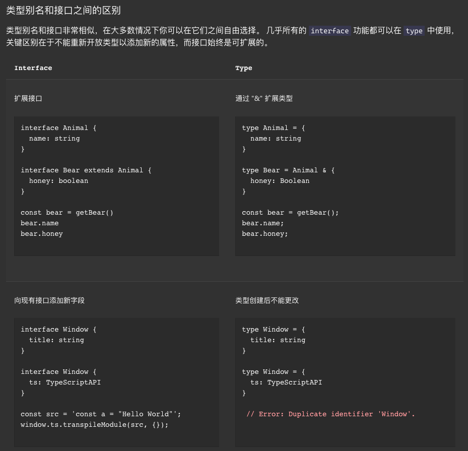

# Interface 和 Type

`TypeScript`的核心原则之一是对值所具有的结构进行类型检查。 它有时被称做“鸭式辨型法”或“结构性子类型化”。 在`TypeScript`里，接口的作用就是为这些类型命名和为你的代码或第三方代码定义契约。

## Interface (接口)

一个接口所描述的是一个对象相关的属性和方法，但并不提供具体创建此对象实例的方法。

### Interface描述对象

接口能够描述`JavaScript`中对象拥有的各种各样的外形。

```ts
export interface VNode<
  HostNode = RendererNode,
  HostElement = RendererElement,
  ExtraProps = { [key: string]: any }
> {
  /**
   * @internal
   */
  __v_isVNode: true

  /**
   * @internal
   */
  [ReactiveFlags.SKIP]: true

  type: VNodeTypes
  props: (VNodeProps & ExtraProps) | null
  key: string | number | symbol | null
  ref: VNodeNormalizedRef | null
  /**
   * SFC only. This is assigned on vnode creation using currentScopeId
   * which is set alongside currentRenderingInstance.
   */
  scopeId: string | null
  /**
   * SFC only. This is assigned to:
   * - Slot fragment vnodes with :slotted SFC styles.
   * - Component vnodes (during patch/hydration) so that its root node can
   *   inherit the component's slotScopeIds
   * @internal
   */
  slotScopeIds: string[] | null
  children: VNodeNormalizedChildren
  component: ComponentInternalInstance | null
  dirs: DirectiveBinding[] | null
  transition: TransitionHooks<HostElement> | null

  // DOM
  el: HostNode | null
  anchor: HostNode | null // fragment anchor
  target: HostElement | null // teleport target
  targetAnchor: HostNode | null // teleport target anchor
  /**
   * number of elements contained in a static vnode
   * @internal
   */
  staticCount: number

  // suspense
  suspense: SuspenseBoundary | null
  /**
   * @internal
   */
  ssContent: VNode | null
  /**
   * @internal
   */
  ssFallback: VNode | null

  // optimization only
  shapeFlag: number
  patchFlag: number
  /**
   * @internal
   */
  dynamicProps: string[] | null
  /**
   * @internal
   */
  dynamicChildren: VNode[] | null

  // application root node only
  appContext: AppContext | null

  /**
   * @internal attached by v-memo
   */
  memo?: any[]
  /**
   * @internal __COMPAT__ only
   */
  isCompatRoot?: true
  /**
   * @internal custom element interception hook
   */
  ce?: (instance: ComponentInternalInstance) => void
}
```

- 可选属性

```ts
interface Obj {
    memo?: any[];
    [propName: string]: any;
}

```

- 额外属性

```js
interface SquareConfig {
    color?: string;
    width?: number;
    [propName: string]: any;
}
```

### Interface描述函数

除了描述带有属性的普通对象外，接口也可以描述函数类型。

```ts
interface SearchFunc {
  (source: string, subString: string): boolean;
}
let mySearch: SearchFunc;
mySearch = function(source: string, subString: string) {
  let result = source.search(subString);
  return result > -1;
}
```

换个方式：

```ts
let mySearch: SearchFunc;
mySearch = function(src: string, sub: string): boolean {
  let result = src.search(sub);
  return result > -1;
}
```

### Interface可拓展性

和类一样，接口也可以相互继承。 这让我们能够从一个接口里复制成员到另一个接口里，可以更灵活地将接口分割到可重用的模块里。一个接口可以继承多个接口，创建出多个接口的合成接口。

看一个Vue中的例子如下：

`WatchOptions`继承自`WatchOptionsBase`，`WatchOptionsBase`继承自`DebuggerOptions`，所以在`doWatch`方法里解析第三个参数能解析到`{ immediate, deep, flush, onTrack, onTrigger }`：

```ts
export interface DebuggerOptions {
  onTrack?: (event: DebuggerEvent) => void
  onTrigger?: (event: DebuggerEvent) => void
}
export interface WatchOptionsBase extends DebuggerOptions {
  flush?: 'pre' | 'post' | 'sync'
}
export interface WatchOptions<Immediate = boolean> extends WatchOptionsBase {
  immediate?: Immediate
  deep?: boolean
}
function doWatch(
  source: WatchSource | WatchSource[] | WatchEffect | object,
  cb: WatchCallback | null,
  { immediate, deep, flush, onTrack, onTrigger }: WatchOptions = EMPTY_OBJ
)
```

### 混合类型

先前我们提过，接口能够描述`JavaScript`里丰富的类型。 因为`JavaScript`其动态灵活的特点，有时你会希望一个对象可以同时具有上面提到的多种类型。

一个例子就是，一个对象可以同时做为函数和对象使用，并带有额外的属性。

```ts
interface Counter {
    (start: number): string;
    interval: number;
    reset(): void;
}

function getCounter(): Counter {
    let counter = <Counter>function (start: number) { };
    counter.interval = 123;
    counter.reset = function () { };
    return counter;
}

let c = getCounter();
c(10);
c.reset();
c.interval = 5.0;
```

## Type (类型别名)

类型别名 `type`，其作用就是给类型起一个新名字，可以作用于原始值（基本类型）、联合类型、元组以及其它任何你需要手写的类型

二者均可被用来声明对象和方法的签名，但语法不同。类型别名和接口非常相似，在大多数情况下你可以在它们之间自由选择。 几乎所有的 `interface` 功能都可以在 `type` 中使用，关键区别在于不能重新开放类型以添加新的属性，而接口始终是可扩展的。

与接口不同，类型别名除了用于对象和函数还可以被用于其他类型，如基本类型、联合类型和元组。



## Interface / Type 异同

### Type 可以表示基本类型别名、联合类型、元组，而 Interface 不行

由于 `Type` 定义的实际是一个别名，所以 `Type` 可以描述一些基本类型、联合类型和元组的别名。

```ts
// 基本类型
type HZFEMember = number;

// 联合类型
type HZFEMemberTechStack = string | string[];

// 元组
type HZFEMember = [number, string];
```

### `Type` 可以支持动态属性，而 `Interface` 不行

`Type` 可以使用 `in` 关键字动态生成属性，而 `Interface` 的索引值必须是 `string` 或 `number` 类型，所以 `Interface` 并不支持动态生成属性。

```ts
type ReferLanguage = "JavaScript" | "Go";
type SpecialProject = {
  [key in ReferLanguage]?: string[];
};

const project: SpecialProject = {
  JavaScript: ["xx", "xx"],
};
```

## 参考资料

[Typesrcipt类](https://www.tslang.cn/docs/handbook/interfaces.html)
[Typescript常见类型](https://www.typescriptlang.org/zh/docs/handbook/2/everyday-types.html)
