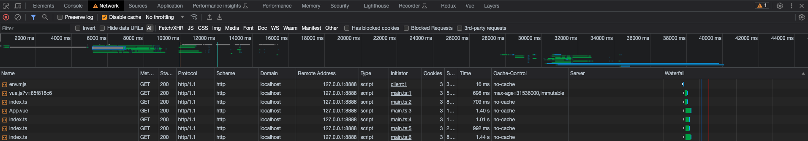
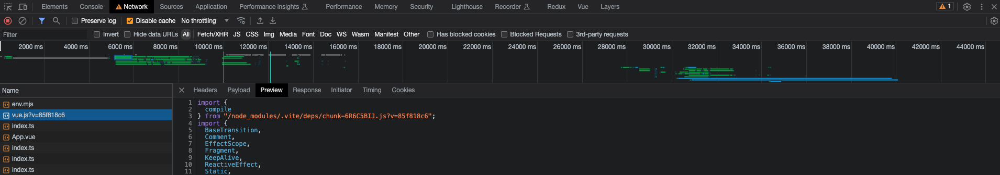

# Vite

`Vite`（法语意为 "快速的"，发音 /vit/，发音同 "veet"）是一种新型前端构建工具，能够显著提升前端开发体验。它主要由两部分组成：

一个开发服务器，它基于 原生 `ES` 模块 提供了 丰富的内建功能，如速度快到惊人的 模块热更新（`HMR`）。

一套构建指令，它使用 `Rollup` 打包你的代码，并且它是预配置的，可输出用于生产环境的高度优化过的静态资源。

## 预构建

原生 `ES` 导入不支持下面这样的裸模块导入：

```js
import { someMethod } from 'my-dep'
```

上面的代码会在浏览器中抛出一个错误。`Vite` 将会检测到所有被加载的源文件中的此类裸模块导入，并执行以下操作:

  1. 预构建 它们可以提高页面加载速度，并将 `CommonJS` / `UMD` 转换为 `ESM` 格式。预构建这一步由 `esbuild` 执行，这使得 `Vite` 的冷启动时间比任何基于 `JavaScript` 的打包器都要快得多。

  2. 重写导入为合法的 `URL`，例如 `/node_modules/.vite/deps/my-dep.js?v=f3sf2ebd` 以便浏览器能够正确导入它们。

**依赖是强缓存的**，`Vite` 通过 `HTTP` 头来缓存请求得到的依赖。

以上两点在实际项目中印证如下：




可以看到`vue.js`是被强制缓存的，设置为`max-age=31536000,immutable`，并且引入路径都已经编译成了相对路径。

## 模块热替换

`Vite` 提供了一套原生 `ESM` 的 `HMR API`。 具有 `HMR` 功能的框架可以利用该 `API` 提供即时、准确的更新，而无需重新加载页面或清除应用程序状态。`Vite` 内置了 `HMR` 到 `Vue` 单文件组件（`SFC`） 和 `React Fast Refresh` 中。也通过` @prefresh/vite` 对 `Preact` 实现了官方集成。

可以观察项目中的热替换如下：


修改了某个vue文件中的文本，可以看到仅重新编译了对应的vue文件然后从本地dev-server进行获取和替换。

## 浏览器兼容性

用于生产环境的构建包会假设目标浏览器支持现代 `JavaScript` 语法。默认情况下，`Vite` 的目标是能够 支持原生 `ESM script` 标签、支持原生 `ESM` 动态导入 和 `import.meta` 的浏览器：

- Chrome >=87
- Firefox >=78
- Safari >=14
- Edge >=88

也可以通过 `build.target` 配置项 指定构建目标，最低支持 `es2015`。

## Vite特性

作为现代前端开发构建工具，`Vite` 提供了与传统打包工具有所不同的几个关键特性。以下是一些特性：

- 高速开发服务器：`Vite` 引入了一个高度优化的开发服务器，利用现代浏览器中的原生`ES`模块导入。它采用按需编译方法，实现了几乎即时的热模块替换（`HMR`）和快速页面重载。这极大加快了开发工作流程，提供更快的反馈循环，增强了开发者的生产力。

- 原生`ES`模块支持：`Vite` 完全支持原生ES模块，在现代浏览器中得到了原生支持。在开发过程中，Vite.js利用浏览器加载ES模块作为单独文件的能力，无需进行打包。这种方法消除了开发过程中打包的开销，从而实现更快的启动时间和更好的缓存性能。它还允许浏览器并行加载模块，从而提高了整体性能。

- 极速生产构建：`Vite` 在生产构建过程中使用了"`esbuild`"打包工具，该工具因其出色的速度而闻名。"`esbuild`"生成优化和缩小的代码包，与传统打包工具相比，大大减少了构建时间。这个快速的打包过程增强了开发者的效率，并允许更快的部署周期。

- 零配置：`Vite` 秉承零配置理念，提供了无缝的开箱即用体验。通过最小化对手动配置的需求，开发者可以快速设置新项目，无需花时间进行复杂的配置设置。然而，`Vite` 还提供了一个灵活的配置文件（`vite.config.js`），以便在需要时进行高级定制。

- 开发工具集成：`Vite` 与流行的浏览器开发工具无缝集成。它通过将原始源代码映射到浏览器，提供了增强的调试体验，使开发者可以在没有任何额外设置或工具的情况下直接调试他们的代码。

- 插件生态系统：`Vite` 拥有一个不断壮大的插件生态系统，扩展了其功能，并与流行的前端框架（如`Vue`、`React`和`Preact`）集成。这些插件增强了开发体验，并提供了额外的功能、优化以及与工具和库的集成。

## Vite 与 Webpack 对比

`Vite`与`Webpack`的主要区别在于，Vite使用原生的ES模块开发服务器，而`Webpack`使用基于`bundle`的开发服务器。

下图展示了`Vite`的大致工作原理：


通过这种模式，在开发过程中避免了不必要的`bundle`生成过程，大大减少了构建时间，使其显著加快。

下图展示了`Webpack`的大致工作原理：


`Vite` 采用了更为简单的配置。配置文件很小，使得设置变得更容易，能够快速入门。`Vite` 拥有与流行的前端框架（如Vue.js、React和Preact）无缝集成的日益增长的插件生态系统，而`Webpack`则以其广泛的配置选项而闻名，允许开发人员微调打包过程的各个方面。其广泛的生态系统提供了各种插件，使其在不同的项目需求下具有高度的适应性和灵活性。

下面是`Webpack`和`Vite`的用时比较测试展示：


## 参考资料

[Vite 官方中文文档](https://cn.vitejs.dev/guide/)

[Rollup 中文文档](https://cn.rollupjs.org/)

[What is Vite? & Vite vs Webpack](https://refine.dev/blog/what-is-vite-vs-webpack/#vite-vs-webpack)