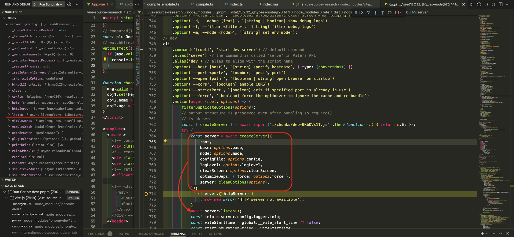
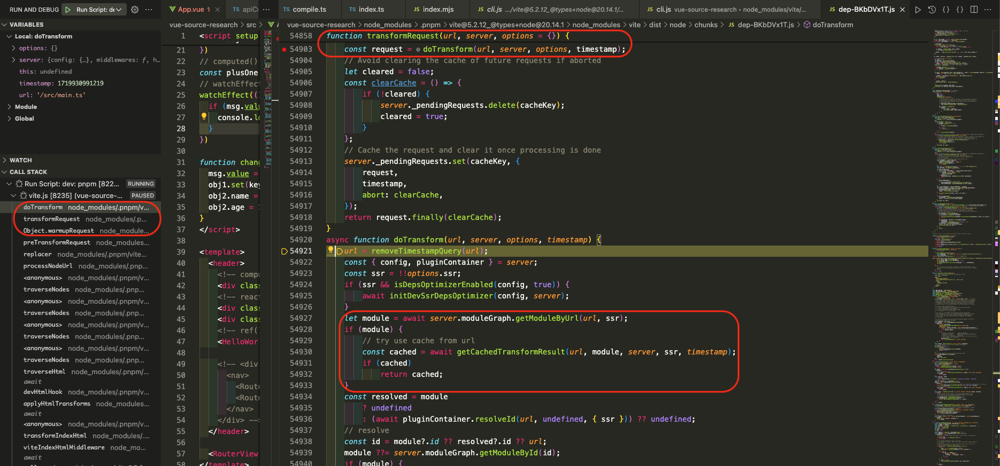

# Vite

## 构建入口

我们在用`vite`启动项目时会运行`pnpm dev`实际执行的就是`vite`命令，找到`node_modules/.bin`下的`vite`指令可以看到构建入口如下：

```ts
// 【node_modules/.bin/vite】
exec node  "$basedir/../vite/bin/vite.js" "$@"

// 【node_modules/vite/bin/vite.js】
function start() {
  return import('../dist/node/cli.js')
}

// 【node_modules/vite/dist/node/cli.js】
// dev
cli
    .command('[root]', 'start dev server') // default command
    .alias('serve') // the command is called 'serve' in Vite's API
    .alias('dev') // alias to align with the script name
    .option('--host [host]', `[string] specify hostname`, { type: [convertHost] })
    .option('--port <port>', `[number] specify port`)
    .option('--open [path]', `[boolean | string] open browser on startup`)
    .option('--cors', `[boolean] enable CORS`)
    .option('--strictPort', `[boolean] exit if specified port is already in use`)
    .option('--force', `[boolean] force the optimizer to ignore the cache and re-bundle`)
    .action(async (root, options) => {
        filterDuplicateOptions(options);
        // output structure is preserved even after bundling so require()
        // is ok here
        const { createServer } = await import('./chunks/dep-BKbDVx1T.js').then(function (n) { return n.E; });
        try {
            // 【创建本地服务器】
            const server = await createServer({
                root,
                base: options.base,
                mode: options.mode,
                configFile: options.config,
                logLevel: options.logLevel,
                clearScreen: options.clearScreen,
                optimizeDeps: { force: options.force },
                server: cleanOptions(options),
            });
            if (!server.httpServer) {
                throw new Error('HTTP server not available');
            }
            await server.listen();
            const info = server.config.logger.info;
            const viteStartTime = global.__vite_start_time ?? false;
            const startupDurationString = viteStartTime
                ? colors.dim(`ready in ${colors.reset(colors.bold(Math.ceil(performance.now() - viteStartTime)))} ms`)
                : '';
            const hasExistingLogs = process.stdout.bytesWritten > 0 || process.stderr.bytesWritten > 0;
            info(`\n  ${colors.green(`${colors.bold('VITE')} v${VERSION}`)}  ${startupDurationString}\n`, {
                clear: !hasExistingLogs,
            });
            server.printUrls();
            const customShortcuts = [];
            if (profileSession) {
                customShortcuts.push({
                    key: 'p',
                    description: 'start/stop the profiler',
                    async action(server) {
                        if (profileSession) {
                            await stopProfiler(server.config.logger.info);
                        }
                        else {
                            const inspector = await import('node:inspector').then((r) => r.default);
                            await new Promise((res) => {
                                profileSession = new inspector.Session();
                                profileSession.connect();
                                profileSession.post('Profiler.enable', () => {
                                    profileSession.post('Profiler.start', () => {
                                        server.config.logger.info('Profiler started');
                                        res();
                                    });
                                });
                            });
                        }
                    },
                });
            }
            server.bindCLIShortcuts({ print: true, customShortcuts });
        }
        catch (e) {
            const logger = createLogger(options.logLevel);
            logger.error(colors.red(`error when starting dev server:\n${e.stack}`), {
                error: e,
            });
            stopProfiler(logger.info);
            process.exit(1);
        }
    });
```

## 创建本地服务器

`createServer` => `_createServer` => 生成`server`实例

`createServer`创建本地服务器`server`实例，`server`实例包含了`warmupRequest`方法，`warmupRequest`方法会调用`transformRequest`方法处理每次`import`的文件对其调用`doTransform`进行处理。

```ts
// 【node_modules/.pnpm/vite@5.2.12_@types+node@20.14.1/node_modules/vite/dist/node/chunks/dep-BKbDVx1T.js】
function createServer(inlineConfig = {}) {
    return _createServer(inlineConfig, { hotListen: true });
}
async function _createServer(inlineConfig = {}, options) {
    const config = await resolveConfig(inlineConfig, 'serve');
    const initPublicFilesPromise = initPublicFiles(config);
    const { root, server: serverConfig } = config;
    const httpsOptions = await resolveHttpsConfig(config.server.https);
    const { middlewareMode } = serverConfig;
    const resolvedOutDirs = getResolvedOutDirs(config.root, config.build.outDir, config.build.rollupOptions?.output);
    const emptyOutDir = resolveEmptyOutDir(config.build.emptyOutDir, config.root, resolvedOutDirs);
    const resolvedWatchOptions = resolveChokidarOptions(config, {
        disableGlobbing: true,
        ...serverConfig.watch,
    }, resolvedOutDirs, emptyOutDir);
    const middlewares = connect$1();
    const httpServer = middlewareMode
        ? null
        : await resolveHttpServer(serverConfig, middlewares, httpsOptions);
    const ws = createWebSocketServer(httpServer, config, httpsOptions);
    const hot = createHMRBroadcaster()
        .addChannel(ws)
        .addChannel(createServerHMRChannel());
    if (typeof config.server.hmr === 'object' && config.server.hmr.channels) {
        config.server.hmr.channels.forEach((channel) => hot.addChannel(channel));
    }
    const publicFiles = await initPublicFilesPromise;
    const { publicDir } = config;
    if (httpServer) {
        setClientErrorHandler(httpServer, config.logger);
    }
    // eslint-disable-next-line eqeqeq
    const watchEnabled = serverConfig.watch !== null;
    const watcher = watchEnabled
        ? chokidar.watch(
        // config file dependencies and env file might be outside of root
        [
            root,
            ...config.configFileDependencies,
            ...getEnvFilesForMode(config.mode, config.envDir),
            // Watch the public directory explicitly because it might be outside
            // of the root directory.
            ...(publicDir && publicFiles ? [publicDir] : []),
        ], resolvedWatchOptions)
        : createNoopWatcher(resolvedWatchOptions);
    const moduleGraph = new ModuleGraph((url, ssr) => container.resolveId(url, undefined, { ssr }));
    const container = await createPluginContainer(config, moduleGraph, watcher);
    const closeHttpServer = createServerCloseFn(httpServer);
    let exitProcess;
    const devHtmlTransformFn = createDevHtmlTransformFn(config);
    const onCrawlEndCallbacks = [];
    const crawlEndFinder = setupOnCrawlEnd(() => {
        onCrawlEndCallbacks.forEach((cb) => cb());
    });
    function waitForRequestsIdle(ignoredId) {
        return crawlEndFinder.waitForRequestsIdle(ignoredId);
    }
    function _registerRequestProcessing(id, done) {
        crawlEndFinder.registerRequestProcessing(id, done);
    }
    function _onCrawlEnd(cb) {
        onCrawlEndCallbacks.push(cb);
    }
    // 【创建server实例】
    let server = {
        config,
        middlewares,
        httpServer,
        watcher,
        pluginContainer: container,
        ws,
        hot,
        moduleGraph,
        resolvedUrls: null,
        ssrTransform(code, inMap, url, originalCode = code) {
            return ssrTransform(code, inMap, url, originalCode, server.config);
        },
        transformRequest(url, options) {
            return transformRequest(url, server, options);
        },
        // 【处理Import】
        async warmupRequest(url, options) {
            try {
                await transformRequest(url, server, options);
            }
            catch (e) {
                if (e?.code === ERR_OUTDATED_OPTIMIZED_DEP ||
                    e?.code === ERR_CLOSED_SERVER) {
                    // these are expected errors
                    return;
                }
                // Unexpected error, log the issue but avoid an unhandled exception
                server.config.logger.error(`Pre-transform error: ${e.message}`, {
                    error: e,
                    timestamp: true,
                });
            }
        },
        transformIndexHtml(url, html, originalUrl) {
            return devHtmlTransformFn(server, url, html, originalUrl);
        },
        async ssrLoadModule(url, opts) {
            return ssrLoadModule(url, server, undefined, undefined, opts?.fixStacktrace);
        },
        async ssrFetchModule(url, importer) {
            return ssrFetchModule(server, url, importer);
        },
        ssrFixStacktrace(e) {
            ssrFixStacktrace(e, moduleGraph);
        },
        ssrRewriteStacktrace(stack) {
            return ssrRewriteStacktrace(stack, moduleGraph);
        },
        async reloadModule(module) {
            if (serverConfig.hmr !== false && module.file) {
                updateModules(module.file, [module], Date.now(), server);
            }
        },
        async listen(port, isRestart) {
            await startServer(server, port);
            if (httpServer) {
                server.resolvedUrls = await resolveServerUrls(httpServer, config.server, config);
                if (!isRestart && config.server.open)
                    server.openBrowser();
            }
            return server;
        },
        openBrowser() {
            const options = server.config.server;
            const url = server.resolvedUrls?.local[0] ?? server.resolvedUrls?.network[0];
            if (url) {
                const path = typeof options.open === 'string'
                    ? new URL(options.open, url).href
                    : url;
                // We know the url that the browser would be opened to, so we can
                // start the request while we are awaiting the browser. This will
                // start the crawling of static imports ~500ms before.
                // preTransformRequests needs to be enabled for this optimization.
                if (server.config.server.preTransformRequests) {
                    setTimeout(() => {
                        const getMethod = path.startsWith('https:') ? get$1 : get$2;
                        getMethod(path, {
                            headers: {
                                // Allow the history middleware to redirect to /index.html
                                Accept: 'text/html',
                            },
                        }, (res) => {
                            res.on('end', () => {
                                // Ignore response, scripts discovered while processing the entry
                                // will be preprocessed (server.config.server.preTransformRequests)
                            });
                        })
                            .on('error', () => {
                            // Ignore errors
                        })
                            .end();
                    }, 0);
                }
                openBrowser(path, true, server.config.logger);
            }
            else {
                server.config.logger.warn('No URL available to open in browser');
            }
        },
        async close() {
            if (!middlewareMode) {
                process.off('SIGTERM', exitProcess);
                if (process.env.CI !== 'true') {
                    process.stdin.off('end', exitProcess);
                }
            }
            await Promise.allSettled([
                watcher.close(),
                hot.close(),
                container.close(),
                crawlEndFinder?.cancel(),
                getDepsOptimizer(server.config)?.close(),
                getDepsOptimizer(server.config, true)?.close(),
                closeHttpServer(),
            ]);
            // Await pending requests. We throw early in transformRequest
            // and in hooks if the server is closing for non-ssr requests,
            // so the import analysis plugin stops pre-transforming static
            // imports and this block is resolved sooner.
            // During SSR, we let pending requests finish to avoid exposing
            // the server closed error to the users.
            while (server._pendingRequests.size > 0) {
                await Promise.allSettled([...server._pendingRequests.values()].map((pending) => pending.request));
            }
            server.resolvedUrls = null;
        },
        printUrls() {
            if (server.resolvedUrls) {
                printServerUrls(server.resolvedUrls, serverConfig.host, config.logger.info);
            }
            else if (middlewareMode) {
                throw new Error('cannot print server URLs in middleware mode.');
            }
            else {
                throw new Error('cannot print server URLs before server.listen is called.');
            }
        },
        bindCLIShortcuts(options) {
            bindCLIShortcuts(server, options);
        },
        async restart(forceOptimize) {
            if (!server._restartPromise) {
                server._forceOptimizeOnRestart = !!forceOptimize;
                server._restartPromise = restartServer(server).finally(() => {
                    server._restartPromise = null;
                    server._forceOptimizeOnRestart = false;
                });
            }
            return server._restartPromise;
        },
        waitForRequestsIdle,
        _registerRequestProcessing,
        _onCrawlEnd,
        _setInternalServer(_server) {
            // Rebind internal the server variable so functions reference the user
            // server instance after a restart
            server = _server;
        },
        _restartPromise: null,
        _importGlobMap: new Map(),
        _forceOptimizeOnRestart: false,
        _pendingRequests: new Map(),
        _fsDenyGlob: picomatch$4(
        // matchBase: true does not work as it's documented
        // https://github.com/micromatch/picomatch/issues/89
        // convert patterns without `/` on our side for now
        config.server.fs.deny.map((pattern) => pattern.includes('/') ? pattern : `**/${pattern}`), {
            matchBase: false,
            nocase: true,
            dot: true,
        }),
        _shortcutsOptions: undefined,
    };
    // maintain consistency with the server instance after restarting.
    const reflexServer = new Proxy(server, {
        get: (_, property) => {
            return server[property];
        },
        set: (_, property, value) => {
            server[property] = value;
            return true;
        },
    });
    if (!middlewareMode) {
        exitProcess = async () => {
            try {
                await server.close();
            }
            finally {
                process.exit();
            }
        };
        process.once('SIGTERM', exitProcess);
        if (process.env.CI !== 'true') {
            process.stdin.on('end', exitProcess);
        }
    }
    const onHMRUpdate = async (type, file) => {
        if (serverConfig.hmr !== false) {
            try {
                await handleHMRUpdate(type, file, server);
            }
            catch (err) {
                hot.send({
                    type: 'error',
                    err: prepareError(err),
                });
            }
        }
    };
    const onFileAddUnlink = async (file, isUnlink) => {
        file = normalizePath$3(file);
        await container.watchChange(file, { event: isUnlink ? 'delete' : 'create' });
        if (publicDir && publicFiles) {
            if (file.startsWith(publicDir)) {
                const path = file.slice(publicDir.length);
                publicFiles[isUnlink ? 'delete' : 'add'](path);
                if (!isUnlink) {
                    const moduleWithSamePath = await moduleGraph.getModuleByUrl(path);
                    const etag = moduleWithSamePath?.transformResult?.etag;
                    if (etag) {
                        // The public file should win on the next request over a module with the
                        // same path. Prevent the transform etag fast path from serving the module
                        moduleGraph.etagToModuleMap.delete(etag);
                    }
                }
            }
        }
        if (isUnlink)
            moduleGraph.onFileDelete(file);
        await onHMRUpdate(isUnlink ? 'delete' : 'create', file);
    };
    watcher.on('change', async (file) => {
        file = normalizePath$3(file);
        await container.watchChange(file, { event: 'update' });
        // invalidate module graph cache on file change
        moduleGraph.onFileChange(file);
        await onHMRUpdate('update', file);
    });
    getFsUtils(config).initWatcher?.(watcher);
    watcher.on('add', (file) => {
        onFileAddUnlink(file, false);
    });
    watcher.on('unlink', (file) => {
        onFileAddUnlink(file, true);
    });
    hot.on('vite:invalidate', async ({ path, message }) => {
        const mod = moduleGraph.urlToModuleMap.get(path);
        if (mod &&
            mod.isSelfAccepting &&
            mod.lastHMRTimestamp > 0 &&
            !mod.lastHMRInvalidationReceived) {
            mod.lastHMRInvalidationReceived = true;
            config.logger.info(colors$1.yellow(`hmr invalidate `) +
                colors$1.dim(path) +
                (message ? ` ${message}` : ''), { timestamp: true });
            const file = getShortName(mod.file, config.root);
            updateModules(file, [...mod.importers], mod.lastHMRTimestamp, server, true);
        }
    });
    if (!middlewareMode && httpServer) {
        httpServer.once('listening', () => {
            // update actual port since this may be different from initial value
            serverConfig.port = httpServer.address().port;
        });
    }
    // apply server configuration hooks from plugins
    const postHooks = [];
    for (const hook of config.getSortedPluginHooks('configureServer')) {
        postHooks.push(await hook(reflexServer));
    }
    // Internal middlewares ------------------------------------------------------
    // request timer
    if (process.env.DEBUG) {
        middlewares.use(timeMiddleware(root));
    }
    // cors (enabled by default)
    const { cors } = serverConfig;
    if (cors !== false) {
        middlewares.use(corsMiddleware(typeof cors === 'boolean' ? {} : cors));
    }
    middlewares.use(cachedTransformMiddleware(server));
    // proxy
    const { proxy } = serverConfig;
    if (proxy) {
        const middlewareServer = (isObject$2(middlewareMode) ? middlewareMode.server : null) || httpServer;
        middlewares.use(proxyMiddleware(middlewareServer, proxy, config));
    }
    // base
    if (config.base !== '/') {
        middlewares.use(baseMiddleware(config.rawBase, !!middlewareMode));
    }
    // open in editor support
    middlewares.use('/__open-in-editor', launchEditorMiddleware$1());
    // ping request handler
    // Keep the named function. The name is visible in debug logs via `DEBUG=connect:dispatcher ...`
    middlewares.use(function viteHMRPingMiddleware(req, res, next) {
        if (req.headers['accept'] === 'text/x-vite-ping') {
            res.writeHead(204).end();
        }
        else {
            next();
        }
    });
    // serve static files under /public
    // this applies before the transform middleware so that these files are served
    // as-is without transforms.
    if (publicDir) {
        middlewares.use(servePublicMiddleware(server, publicFiles));
    }
    // main transform middleware
    middlewares.use(transformMiddleware(server));
    // serve static files
    middlewares.use(serveRawFsMiddleware(server));
    middlewares.use(serveStaticMiddleware(server));
    // html fallback
    if (config.appType === 'spa' || config.appType === 'mpa') {
        middlewares.use(htmlFallbackMiddleware(root, config.appType === 'spa', getFsUtils(config)));
    }
    // run post config hooks
    // This is applied before the html middleware so that user middleware can
    // serve custom content instead of index.html.
    postHooks.forEach((fn) => fn && fn());
    if (config.appType === 'spa' || config.appType === 'mpa') {
        // transform index.html
        middlewares.use(indexHtmlMiddleware(root, server));
        // handle 404s
        middlewares.use(notFoundMiddleware());
    }
    // error handler
    middlewares.use(errorMiddleware(server, !!middlewareMode));
    // httpServer.listen can be called multiple times
    // when port when using next port number
    // this code is to avoid calling buildStart multiple times
    let initingServer;
    let serverInited = false;
    const initServer = async () => {
        if (serverInited)
            return;
        if (initingServer)
            return initingServer;
        initingServer = (async function () {
            await container.buildStart({});
            // start deps optimizer after all container plugins are ready
            if (isDepsOptimizerEnabled(config, false)) {
                await initDepsOptimizer(config, server);
            }
            warmupFiles(server);
            initingServer = undefined;
            serverInited = true;
        })();
        return initingServer;
    };
    if (!middlewareMode && httpServer) {
        // overwrite listen to init optimizer before server start
        const listen = httpServer.listen.bind(httpServer);
        httpServer.listen = (async (port, ...args) => {
            try {
                // ensure ws server started
                hot.listen();
                await initServer();
            }
            catch (e) {
                httpServer.emit('error', e);
                return;
            }
            return listen(port, ...args);
        });
    }
    else {
        if (options.hotListen) {
            hot.listen();
        }
        await initServer();
    }
    return server;
}
```



## import导入文件进行transform处理

`warmupRequest` => `transformRequest` => `doTransform` => 有缓存`getCachedTransformResult` / 无缓存`loadAndTransform` => `pluginContainer.transform` => `cssPlugin`/`esbuildPlugin`/`jsonPlugin`/`webWorkerPlugin`/`assetImportMetaUrlPlugin`/`vuePlugin`等的`transform`方法

每次浏览器遇到`import`引入文件会调用`server`实例的`warmupRequest`方法进而进入`transformRequest`方法：

```ts
// 【node_modules/.pnpm/vite@5.2.12_@types+node@20.14.1/node_modules/vite/dist/node/chunks/dep-BKbDVx1T.js】
function importAnalysisPlugin(config) {
    const { root, base } = config;
    const fsUtils = getFsUtils(config);
    const clientPublicPath = path$o.posix.join(base, CLIENT_PUBLIC_PATH);
    const enablePartialAccept = config.experimental?.hmrPartialAccept;
    const matchAlias = getAliasPatternMatcher(config.resolve.alias);
    let server;
    let _env;
    let _ssrEnv;
    function getEnv(ssr) {
        if (!_ssrEnv || !_env) {
            const importMetaEnvKeys = {};
            const userDefineEnv = {};
            for (const key in config.env) {
                importMetaEnvKeys[key] = JSON.stringify(config.env[key]);
            }
            for (const key in config.define) {
                // non-import.meta.env.* is handled in `clientInjection` plugin
                if (key.startsWith('import.meta.env.')) {
                    userDefineEnv[key.slice(16)] = config.define[key];
                }
            }
            const env = `import.meta.env = ${serializeDefine({
                ...importMetaEnvKeys,
                SSR: '__vite_ssr__',
                ...userDefineEnv,
            })};`;
            _ssrEnv = env.replace('__vite_ssr__', 'true');
            _env = env.replace('__vite_ssr__', 'false');
        }
        return ssr ? _ssrEnv : _env;
    }
    return {
        name: 'vite:import-analysis',
        configureServer(_server) {
            server = _server;
        },
        async transform(source, importer, options) {
            // In a real app `server` is always defined, but it is undefined when
            // running src/node/server/__tests__/pluginContainer.spec.ts
            if (!server) {
                return null;
            }
            const ssr = options?.ssr === true;
            if (canSkipImportAnalysis(importer)) {
                debug$1?.(colors$1.dim(`[skipped] ${prettifyUrl(importer, root)}`));
                return null;
            }
            const msAtStart = debug$1 ? performance.now() : 0;
            await init;
            let imports;
            let exports;
            source = stripBomTag(source);
            try {
                [imports, exports] = parse$g(source);
            }
            catch (_e) {
                const e = _e;
                const { message, showCodeFrame } = createParseErrorInfo(importer, source);
                this.error(message, showCodeFrame ? e.idx : undefined);
            }
            const depsOptimizer = getDepsOptimizer(config, ssr);
            const { moduleGraph } = server;
            // since we are already in the transform phase of the importer, it must
            // have been loaded so its entry is guaranteed in the module graph.
            const importerModule = moduleGraph.getModuleById(importer);
            if (!importerModule) {
                // This request is no longer valid. It could happen for optimized deps
                // requests. A full reload is going to request this id again.
                // Throwing an outdated error so we properly finish the request with a
                // 504 sent to the browser.
                throwOutdatedRequest(importer);
            }
            if (!imports.length && !this._addedImports) {
                importerModule.isSelfAccepting = false;
                debug$1?.(`${timeFrom(msAtStart)} ${colors$1.dim(`[no imports] ${prettifyUrl(importer, root)}`)}`);
                return source;
            }
            let hasHMR = false;
            let isSelfAccepting = false;
            let hasEnv = false;
            let needQueryInjectHelper = false;
            let s;
            const str = () => s || (s = new MagicString(source));
            let isPartiallySelfAccepting = false;
            const importedBindings = enablePartialAccept
                ? new Map()
                : null;
            const toAbsoluteUrl = (url) => path$o.posix.resolve(path$o.posix.dirname(importerModule.url), url);
            const normalizeUrl = async (url, pos, forceSkipImportAnalysis = false) => {
                url = stripBase(url, base);
                let importerFile = importer;
                const optimizeDeps = getDepOptimizationConfig(config, ssr);
                if (moduleListContains(optimizeDeps?.exclude, url)) {
                    if (depsOptimizer) {
                        await depsOptimizer.scanProcessing;
                        // if the dependency encountered in the optimized file was excluded from the optimization
                        // the dependency needs to be resolved starting from the original source location of the optimized file
                        // because starting from node_modules/.vite will not find the dependency if it was not hoisted
                        // (that is, if it is under node_modules directory in the package source of the optimized file)
                        for (const optimizedModule of depsOptimizer.metadata.depInfoList) {
                            if (!optimizedModule.src)
                                continue; // Ignore chunks
                            if (optimizedModule.file === importerModule.file) {
                                importerFile = optimizedModule.src;
                            }
                        }
                    }
                }
                const resolved = await this.resolve(url, importerFile);
                if (!resolved || resolved.meta?.['vite:alias']?.noResolved) {
                    // in ssr, we should let node handle the missing modules
                    if (ssr) {
                        return [url, url];
                    }
                    // fix#9534, prevent the importerModuleNode being stopped from propagating updates
                    importerModule.isSelfAccepting = false;
                    moduleGraph._hasResolveFailedErrorModules.add(importerModule);
                    return this.error(`Failed to resolve import "${url}" from "${normalizePath$3(path$o.relative(process.cwd(), importerFile))}". Does the file exist?`, pos);
                }
                if (isExternalUrl(resolved.id)) {
                    return [resolved.id, resolved.id];
                }
                const isRelative = url[0] === '.';
                const isSelfImport = !isRelative && cleanUrl(url) === cleanUrl(importer);
                // normalize all imports into resolved URLs
                // e.g. `import 'foo'` -> `import '/@fs/.../node_modules/foo/index.js'`
                if (resolved.id.startsWith(withTrailingSlash(root))) {
                    // in root: infer short absolute path from root
                    url = resolved.id.slice(root.length);
                }
                else if (depsOptimizer?.isOptimizedDepFile(resolved.id) ||
                    // vite-plugin-react isn't following the leading \0 virtual module convention.
                    // This is a temporary hack to avoid expensive fs checks for React apps.
                    // We'll remove this as soon we're able to fix the react plugins.
                    (resolved.id !== '/@react-refresh' &&
                        path$o.isAbsolute(resolved.id) &&
                        fsUtils.existsSync(cleanUrl(resolved.id)))) {
                    // an optimized deps may not yet exists in the filesystem, or
                    // a regular file exists but is out of root: rewrite to absolute /@fs/ paths
                    url = path$o.posix.join(FS_PREFIX, resolved.id);
                }
                else {
                    url = resolved.id;
                }
                // if the resolved id is not a valid browser import specifier,
                // prefix it to make it valid. We will strip this before feeding it
                // back into the transform pipeline
                if (url[0] !== '.' && url[0] !== '/') {
                    url = wrapId$1(resolved.id);
                }
                // make the URL browser-valid if not SSR
                if (!ssr) {
                    // mark non-js/css imports with `?import`
                    if (isExplicitImportRequired(url)) {
                        url = injectQuery(url, 'import');
                    }
                    else if ((isRelative || isSelfImport) &&
                        !DEP_VERSION_RE.test(url)) {
                        // If the url isn't a request for a pre-bundled common chunk,
                        // for relative js/css imports, or self-module virtual imports
                        // (e.g. vue blocks), inherit importer's version query
                        // do not do this for unknown type imports, otherwise the appended
                        // query can break 3rd party plugin's extension checks.
                        const versionMatch = importer.match(DEP_VERSION_RE);
                        if (versionMatch) {
                            url = injectQuery(url, versionMatch[1]);
                        }
                    }
                    // check if the dep has been hmr updated. If yes, we need to attach
                    // its last updated timestamp to force the browser to fetch the most
                    // up-to-date version of this module.
                    try {
                        // delay setting `isSelfAccepting` until the file is actually used (#7870)
                        // We use an internal function to avoid resolving the url again
                        const depModule = await moduleGraph._ensureEntryFromUrl(unwrapId$1(url), ssr, canSkipImportAnalysis(url) || forceSkipImportAnalysis, resolved);
                        if (depModule.lastHMRTimestamp > 0) {
                            url = injectQuery(url, `t=${depModule.lastHMRTimestamp}`);
                        }
                    }
                    catch (e) {
                        // it's possible that the dep fails to resolve (non-existent import)
                        // attach location to the missing import
                        e.pos = pos;
                        throw e;
                    }
                    // prepend base
                    url = joinUrlSegments(base, url);
                }
                return [url, resolved.id];
            };
            const orderedImportedUrls = new Array(imports.length);
            const orderedAcceptedUrls = new Array(imports.length);
            const orderedAcceptedExports = new Array(imports.length);
            // 【-----import处理入口-----】
            await Promise.all(imports.map(async (importSpecifier, index) => {
                const { s: start, e: end, ss: expStart, se: expEnd, d: dynamicIndex, a: attributeIndex, } = importSpecifier;
                // #2083 User may use escape path,
                // so use imports[index].n to get the unescaped string
                let specifier = importSpecifier.n;
                const rawUrl = source.slice(start, end);
                // check import.meta usage
                if (rawUrl === 'import.meta') {
                    const prop = source.slice(end, end + 4);
                    if (prop === '.hot') {
                        hasHMR = true;
                        const endHot = end + 4 + (source[end + 4] === '?' ? 1 : 0);
                        if (source.slice(endHot, endHot + 7) === '.accept') {
                            // further analyze accepted modules
                            if (source.slice(endHot, endHot + 14) === '.acceptExports') {
                                const importAcceptedExports = (orderedAcceptedExports[index] =
                                    new Set());
                                lexAcceptedHmrExports(source, source.indexOf('(', endHot + 14) + 1, importAcceptedExports);
                                isPartiallySelfAccepting = true;
                            }
                            else {
                                const importAcceptedUrls = (orderedAcceptedUrls[index] =
                                    new Set());
                                if (lexAcceptedHmrDeps(source, source.indexOf('(', endHot + 7) + 1, importAcceptedUrls)) {
                                    isSelfAccepting = true;
                                }
                            }
                        }
                    }
                    else if (prop === '.env') {
                        hasEnv = true;
                    }
                    return;
                }
                else if (templateLiteralRE.test(rawUrl)) {
                    // If the import has backticks but isn't transformed as a glob import
                    // (as there's nothing to glob), check if it's simply a plain string.
                    // If so, we can replace the specifier as a plain string to prevent
                    // an incorrect "cannot be analyzed" warning.
                    if (!(rawUrl.includes('${') && rawUrl.includes('}'))) {
                        specifier = rawUrl.replace(templateLiteralRE, '$1');
                    }
                }
                const isDynamicImport = dynamicIndex > -1;
                // strip import attributes as we can process them ourselves
                if (!isDynamicImport && attributeIndex > -1) {
                    str().remove(end + 1, expEnd);
                }
                // static import or valid string in dynamic import
                // If resolvable, let's resolve it
                if (specifier !== undefined) {
                    // skip external / data uri
                    if (isExternalUrl(specifier) || isDataUrl(specifier)) {
                        return;
                    }
                    // skip ssr external
                    if (ssr && !matchAlias(specifier)) {
                        if (shouldExternalizeForSSR(specifier, importer, config)) {
                            return;
                        }
                        if (isBuiltin(specifier)) {
                            return;
                        }
                    }
                    // skip client
                    if (specifier === clientPublicPath) {
                        return;
                    }
                    // warn imports to non-asset /public files
                    if (specifier[0] === '/' &&
                        !(config.assetsInclude(cleanUrl(specifier)) ||
                            urlRE.test(specifier)) &&
                        checkPublicFile(specifier, config)) {
                        throw new Error(`Cannot import non-asset file ${specifier} which is inside /public. ` +
                            `JS/CSS files inside /public are copied as-is on build and ` +
                            `can only be referenced via <script src> or <link href> in html. ` +
                            `If you want to get the URL of that file, use ${injectQuery(specifier, 'url')} instead.`);
                    }
                    // normalize
                    const [url, resolvedId] = await normalizeUrl(specifier, start);
                    // record as safe modules
                    // safeModulesPath should not include the base prefix.
                    // See https://github.com/vitejs/vite/issues/9438#issuecomment-1465270409
                    server?.moduleGraph.safeModulesPath.add(fsPathFromUrl(stripBase(url, base)));
                    if (url !== specifier) {
                        let rewriteDone = false;
                        if (depsOptimizer?.isOptimizedDepFile(resolvedId) &&
                            !optimizedDepChunkRE.test(resolvedId)) {
                            // for optimized cjs deps, support named imports by rewriting named imports to const assignments.
                            // internal optimized chunks don't need es interop and are excluded
                            // The browserHash in resolvedId could be stale in which case there will be a full
                            // page reload. We could return a 404 in that case but it is safe to return the request
                            const file = cleanUrl(resolvedId); // Remove ?v={hash}
                            const needsInterop = await optimizedDepNeedsInterop(depsOptimizer.metadata, file, config, ssr);
                            if (needsInterop === undefined) {
                                // Non-entry dynamic imports from dependencies will reach here as there isn't
                                // optimize info for them, but they don't need es interop. If the request isn't
                                // a dynamic import, then it is an internal Vite error
                                if (!optimizedDepDynamicRE.test(file)) {
                                    config.logger.error(colors$1.red(`Vite Error, ${url} optimized info should be defined`));
                                }
                            }
                            else if (needsInterop) {
                                debug$1?.(`${url} needs interop`);
                                interopNamedImports(str(), importSpecifier, url, index, importer, config);
                                rewriteDone = true;
                            }
                        }
                        // If source code imports builtin modules via named imports, the stub proxy export
                        // would fail as it's `export default` only. Apply interop for builtin modules to
                        // correctly throw the error message.
                        else if (url.includes(browserExternalId) &&
                            source.slice(expStart, start).includes('{')) {
                            interopNamedImports(str(), importSpecifier, url, index, importer, config);
                            rewriteDone = true;
                        }
                        if (!rewriteDone) {
                            const rewrittenUrl = JSON.stringify(url);
                            const s = isDynamicImport ? start : start - 1;
                            const e = isDynamicImport ? end : end + 1;
                            str().overwrite(s, e, rewrittenUrl, {
                                contentOnly: true,
                            });
                        }
                    }
                    // record for HMR import chain analysis
                    // make sure to unwrap and normalize away base
                    const hmrUrl = unwrapId$1(stripBase(url, base));
                    const isLocalImport = !isExternalUrl(hmrUrl) && !isDataUrl(hmrUrl);
                    if (isLocalImport) {
                        orderedImportedUrls[index] = hmrUrl;
                    }
                    if (enablePartialAccept && importedBindings) {
                        extractImportedBindings(resolvedId, source, importSpecifier, importedBindings);
                    }
                    if (!isDynamicImport &&
                        isLocalImport &&
                        config.server.preTransformRequests) {
                        // pre-transform known direct imports
                        // These requests will also be registered in transformRequest to be awaited
                        // by the deps optimizer
                        const url = removeImportQuery(hmrUrl);
                        // 【调用server实例的warmupRequest方法】
                        server.warmupRequest(url, { ssr });
                    }
                }
                else if (!importer.startsWith(withTrailingSlash(clientDir))) {
                    if (!isInNodeModules$1(importer)) {
                        // check @vite-ignore which suppresses dynamic import warning
                        const hasViteIgnore = hasViteIgnoreRE.test(
                        // complete expression inside parens
                        source.slice(dynamicIndex + 1, end));
                        if (!hasViteIgnore) {
                            this.warn(`\n` +
                                colors$1.cyan(importerModule.file) +
                                `\n` +
                                colors$1.reset(generateCodeFrame(source, start, end)) +
                                colors$1.yellow(`\nThe above dynamic import cannot be analyzed by Vite.\n` +
                                    `See ${colors$1.blue(`https://github.com/rollup/plugins/tree/master/packages/dynamic-import-vars#limitations`)} ` +
                                    `for supported dynamic import formats. ` +
                                    `If this is intended to be left as-is, you can use the ` +
                                    `/* @vite-ignore */ comment inside the import() call to suppress this warning.\n`));
                        }
                    }
                    if (!ssr) {
                        if (!urlIsStringRE.test(rawUrl) ||
                            isExplicitImportRequired(rawUrl.slice(1, -1))) {
                            needQueryInjectHelper = true;
                            str().overwrite(start, end, `__vite__injectQuery(${rawUrl}, 'import')`, { contentOnly: true });
                        }
                    }
                }
            }));
            const _orderedImportedUrls = orderedImportedUrls.filter(isDefined);
            const importedUrls = new Set(_orderedImportedUrls);
            // `importedUrls` will be mixed with watched files for the module graph,
            // `staticImportedUrls` will only contain the static top-level imports and
            // dynamic imports
            const staticImportedUrls = new Set(_orderedImportedUrls.map((url) => removeTimestampQuery(url)));
            const acceptedUrls = mergeAcceptedUrls(orderedAcceptedUrls);
            const acceptedExports = mergeAcceptedUrls(orderedAcceptedExports);
            // While we always expect to work with ESM, a classic worker is the only
            // case where it's not ESM and we need to avoid injecting ESM-specific code
            const isClassicWorker = importer.includes(WORKER_FILE_ID) && importer.includes('type=classic');
            if (hasEnv && !isClassicWorker) {
                // inject import.meta.env
                str().prepend(getEnv(ssr));
            }
            if (hasHMR && !ssr && !isClassicWorker) {
                debugHmr?.(`${isSelfAccepting
                    ? `[self-accepts]`
                    : isPartiallySelfAccepting
                        ? `[accepts-exports]`
                        : acceptedUrls.size
                            ? `[accepts-deps]`
                            : `[detected api usage]`} ${prettifyUrl(importer, root)}`);
                // inject hot context
                str().prepend(`import { createHotContext as __vite__createHotContext } from "${clientPublicPath}";` +
                    `import.meta.hot = __vite__createHotContext(${JSON.stringify(normalizeHmrUrl(importerModule.url))});`);
            }
            if (needQueryInjectHelper) {
                if (isClassicWorker) {
                    str().append('\n' + __vite__injectQuery.toString());
                }
                else {
                    str().prepend(`import { injectQuery as __vite__injectQuery } from "${clientPublicPath}";`);
                }
            }
            // normalize and rewrite accepted urls
            const normalizedAcceptedUrls = new Set();
            for (const { url, start, end } of acceptedUrls) {
                const [normalized] = await moduleGraph.resolveUrl(toAbsoluteUrl(url), ssr);
                normalizedAcceptedUrls.add(normalized);
                str().overwrite(start, end, JSON.stringify(normalized), {
                    contentOnly: true,
                });
            }
            // update the module graph for HMR analysis.
            // node CSS imports does its own graph update in the css-analysis plugin so we
            // only handle js graph updates here.
            // note that we want to handle .css?raw and .css?url here
            if (!isCSSRequest(importer) || SPECIAL_QUERY_RE.test(importer)) {
                // attached by pluginContainer.addWatchFile
                const pluginImports = this._addedImports;
                if (pluginImports) {
                    (await Promise.all([...pluginImports].map((id) => normalizeUrl(id, 0, true)))).forEach(([url]) => importedUrls.add(url));
                }
                // HMR transforms are no-ops in SSR, so an `accept` call will
                // never be injected. Avoid updating the `isSelfAccepting`
                // property for our module node in that case.
                if (ssr && importerModule.isSelfAccepting) {
                    isSelfAccepting = true;
                }
                // a partially accepted module that accepts all its exports
                // behaves like a self-accepted module in practice
                if (!isSelfAccepting &&
                    isPartiallySelfAccepting &&
                    acceptedExports.size >= exports.length &&
                    exports.every((e) => acceptedExports.has(e.n))) {
                    isSelfAccepting = true;
                }
                const prunedImports = await moduleGraph.updateModuleInfo(importerModule, importedUrls, importedBindings, normalizedAcceptedUrls, isPartiallySelfAccepting ? acceptedExports : null, isSelfAccepting, ssr, staticImportedUrls);
                if (hasHMR && prunedImports) {
                    handlePrunedModules(prunedImports, server);
                }
            }
            debug$1?.(`${timeFrom(msAtStart)} ${colors$1.dim(`[${importedUrls.size} imports rewritten] ${prettifyUrl(importer, root)}`)}`);
            if (s) {
                return transformStableResult(s, importer, config);
            }
            else {
                return source;
            }
        },
    };
}
```

`transformRequest`方法最终会进入`doTransform`，`doTransform`会根据是否缓存了编译好的内容进入`getCachedTransformResult`或者`loadAndTransform`

```ts
// 【node_modules/.pnpm/vite@5.2.12_@types+node@20.14.1/node_modules/vite/dist/node/chunks/dep-BKbDVx1T.js】
function transformRequest(url, server, options = {}) {
    if (server._restartPromise && !options.ssr)
        throwClosedServerError();
    const cacheKey = (options.ssr ? 'ssr:' : options.html ? 'html:' : '') + url;
    // This module may get invalidated while we are processing it. For example
    // when a full page reload is needed after the re-processing of pre-bundled
    // dependencies when a missing dep is discovered. We save the current time
    // to compare it to the last invalidation performed to know if we should
    // cache the result of the transformation or we should discard it as stale.
    //
    // A module can be invalidated due to:
    // 1. A full reload because of pre-bundling newly discovered deps
    // 2. A full reload after a config change
    // 3. The file that generated the module changed
    // 4. Invalidation for a virtual module
    //
    // For 1 and 2, a new request for this module will be issued after
    // the invalidation as part of the browser reloading the page. For 3 and 4
    // there may not be a new request right away because of HMR handling.
    // In all cases, the next time this module is requested, it should be
    // re-processed.
    //
    // We save the timestamp when we start processing and compare it with the
    // last time this module is invalidated
    const timestamp = Date.now();
    const pending = server._pendingRequests.get(cacheKey);
    if (pending) {
        return server.moduleGraph
            .getModuleByUrl(removeTimestampQuery(url), options.ssr)
            .then((module) => {
            if (!module || pending.timestamp > module.lastInvalidationTimestamp) {
                // The pending request is still valid, we can safely reuse its result
                return pending.request;
            }
            else {
                // Request 1 for module A     (pending.timestamp)
                // Invalidate module A        (module.lastInvalidationTimestamp)
                // Request 2 for module A     (timestamp)
                // First request has been invalidated, abort it to clear the cache,
                // then perform a new doTransform.
                pending.abort();
                return transformRequest(url, server, options);
            }
        });
    }
    const request = doTransform(url, server, options, timestamp);
    // Avoid clearing the cache of future requests if aborted
    let cleared = false;
    const clearCache = () => {
        if (!cleared) {
            server._pendingRequests.delete(cacheKey);
            cleared = true;
        }
    };
    // Cache the request and clear it once processing is done
    server._pendingRequests.set(cacheKey, {
        request,
        timestamp,
        abort: clearCache,
    });
    return request.finally(clearCache);
}

async function doTransform(url, server, options, timestamp) {
    url = removeTimestampQuery(url);
    const { config, pluginContainer } = server;
    const ssr = !!options.ssr;
    if (ssr && isDepsOptimizerEnabled(config, true)) {
        await initDevSsrDepsOptimizer(config, server);
    }
    let module = await server.moduleGraph.getModuleByUrl(url, ssr);
    if (module) {
        // try use cache from url
        const cached = await getCachedTransformResult(url, module, server, ssr, timestamp);
        if (cached)
            return cached;
    }
    const resolved = module
        ? undefined
        : (await pluginContainer.resolveId(url, undefined, { ssr })) ?? undefined;
    // resolve
    const id = module?.id ?? resolved?.id ?? url;
    module ??= server.moduleGraph.getModuleById(id);
    if (module) {
        // if a different url maps to an existing loaded id,  make sure we relate this url to the id
        await server.moduleGraph._ensureEntryFromUrl(url, ssr, undefined, resolved);
        // try use cache from id
        const cached = await getCachedTransformResult(url, module, server, ssr, timestamp);
        if (cached)
            return cached;
    }
    const result = loadAndTransform(id, url, server, options, timestamp, module, resolved);
    if (!ssr) {
        // Only register client requests, server.waitForRequestsIdle should
        // have been called server.waitForClientRequestsIdle. We can rename
        // it as part of the environment API work
        const depsOptimizer = getDepsOptimizer(config, ssr);
        if (!depsOptimizer?.isOptimizedDepFile(id)) {
            server._registerRequestProcessing(id, () => result);
        }
    }
    return result;
}

async function getCachedTransformResult(url, module, server, ssr, timestamp) {
    const prettyUrl = debugCache$1 ? prettifyUrl(url, server.config.root) : '';
    // tries to handle soft invalidation of the module if available,
    // returns a boolean true is successful, or false if no handling is needed
    const softInvalidatedTransformResult = module &&
        (await handleModuleSoftInvalidation(module, ssr, timestamp, server));
    if (softInvalidatedTransformResult) {
        debugCache$1?.(`[memory-hmr] ${prettyUrl}`);
        return softInvalidatedTransformResult;
    }
    // check if we have a fresh cache
    const cached = module && (ssr ? module.ssrTransformResult : module.transformResult);
    if (cached) {
        debugCache$1?.(`[memory] ${prettyUrl}`);
        return cached;
    }
}
```



`loadAndTransform`对不同类型的文件用不同`plugin`的`transform`方法进行编译处理：

```ts
// 【node_modules/.pnpm/vite@5.2.12_@types+node@20.14.1/node_modules/vite/dist/node/chunks/dep-BKbDVx1T.js】
async function loadAndTransform(id, url, server, options, timestamp, mod, resolved) {
    const { config, pluginContainer, moduleGraph } = server;
    const { logger } = config;
    const prettyUrl = debugLoad || debugTransform ? prettifyUrl(url, config.root) : '';
    const ssr = !!options.ssr;
    const file = cleanUrl(id);
    let code = null;
    let map = null;
    // load
    const loadStart = debugLoad ? performance.now() : 0;
    const loadResult = await pluginContainer.load(id, { ssr });
    if (loadResult == null) {
        // if this is an html request and there is no load result, skip ahead to
        // SPA fallback.
        if (options.html && !id.endsWith('.html')) {
            return null;
        }
        // try fallback loading it from fs as string
        // if the file is a binary, there should be a plugin that already loaded it
        // as string
        // only try the fallback if access is allowed, skip for out of root url
        // like /service-worker.js or /api/users
        if (options.ssr || isFileServingAllowed(file, server)) {
            try {
                code = await fsp.readFile(file, 'utf-8');
                debugLoad?.(`${timeFrom(loadStart)} [fs] ${prettyUrl}`);
            }
            catch (e) {
                if (e.code !== 'ENOENT') {
                    if (e.code === 'EISDIR') {
                        e.message = `${e.message} ${file}`;
                    }
                    throw e;
                }
            }
            if (code != null) {
                ensureWatchedFile(server.watcher, file, config.root);
            }
        }
        if (code) {
            try {
                const extracted = await extractSourcemapFromFile(code, file);
                if (extracted) {
                    code = extracted.code;
                    map = extracted.map;
                }
            }
            catch (e) {
                logger.warn(`Failed to load source map for ${file}.\n${e}`, {
                    timestamp: true,
                });
            }
        }
    }
    else {
        debugLoad?.(`${timeFrom(loadStart)} [plugin] ${prettyUrl}`);
        if (isObject$2(loadResult)) {
            code = loadResult.code;
            map = loadResult.map;
        }
        else {
            code = loadResult;
        }
    }
    if (code == null) {
        const isPublicFile = checkPublicFile(url, config);
        let publicDirName = path$o.relative(config.root, config.publicDir);
        if (publicDirName[0] !== '.')
            publicDirName = '/' + publicDirName;
        const msg = isPublicFile
            ? `This file is in ${publicDirName} and will be copied as-is during ` +
                `build without going through the plugin transforms, and therefore ` +
                `should not be imported from source code. It can only be referenced ` +
                `via HTML tags.`
            : `Does the file exist?`;
        const importerMod = server.moduleGraph.idToModuleMap
            .get(id)
            ?.importers.values()
            .next().value;
        const importer = importerMod?.file || importerMod?.url;
        const err = new Error(`Failed to load url ${url} (resolved id: ${id})${importer ? ` in ${importer}` : ''}. ${msg}`);
        err.code = isPublicFile ? ERR_LOAD_PUBLIC_URL : ERR_LOAD_URL;
        throw err;
    }
    if (server._restartPromise && !ssr)
        throwClosedServerError();
    // ensure module in graph after successful load
    mod ??= await moduleGraph._ensureEntryFromUrl(url, ssr, undefined, resolved);
    // transform
    const transformStart = debugTransform ? performance.now() : 0;
    // 【-----调用不同Plugin的transform方法对不同类型的文件进行transform-----】
    const transformResult = await pluginContainer.transform(code, id, {
        inMap: map,
        ssr,
    });
    const originalCode = code;
    if (transformResult == null ||
        (isObject$2(transformResult) && transformResult.code == null)) {
        // no transform applied, keep code as-is
        debugTransform?.(timeFrom(transformStart) + colors$1.dim(` [skipped] ${prettyUrl}`));
    }
    else {
        debugTransform?.(`${timeFrom(transformStart)} ${prettyUrl}`);
        code = transformResult.code;
        map = transformResult.map;
    }
    let normalizedMap;
    if (typeof map === 'string') {
        normalizedMap = JSON.parse(map);
    }
    else if (map) {
        normalizedMap = map;
    }
    else {
        normalizedMap = null;
    }
    if (normalizedMap && 'version' in normalizedMap && mod.file) {
        if (normalizedMap.mappings) {
            await injectSourcesContent(normalizedMap, mod.file, logger);
        }
        const sourcemapPath = `${mod.file}.map`;
        applySourcemapIgnoreList(normalizedMap, sourcemapPath, config.server.sourcemapIgnoreList, logger);
        if (path$o.isAbsolute(mod.file)) {
            let modDirname;
            for (let sourcesIndex = 0; sourcesIndex < normalizedMap.sources.length; ++sourcesIndex) {
                const sourcePath = normalizedMap.sources[sourcesIndex];
                if (sourcePath) {
                    // Rewrite sources to relative paths to give debuggers the chance
                    // to resolve and display them in a meaningful way (rather than
                    // with absolute paths).
                    if (path$o.isAbsolute(sourcePath)) {
                        modDirname ??= path$o.dirname(mod.file);
                        normalizedMap.sources[sourcesIndex] = path$o.relative(modDirname, sourcePath);
                    }
                }
            }
        }
    }
    if (server._restartPromise && !ssr)
        throwClosedServerError();
    const result = ssr && !server.config.experimental.skipSsrTransform
        ? await server.ssrTransform(code, normalizedMap, url, originalCode)
        : ({
            code,
            map: normalizedMap,
            etag: getEtag(code, { weak: true }),
        });
    // Only cache the result if the module wasn't invalidated while it was
    // being processed, so it is re-processed next time if it is stale
    if (timestamp > mod.lastInvalidationTimestamp)
        moduleGraph.updateModuleTransformResult(mod, result, ssr);
    return result;
}


async function createPluginContainer(config, moduleGraph, watcher) {
    const { plugins, logger, root, build: { rollupOptions }, } = config;
    const { getSortedPluginHooks, getSortedPlugins } = createPluginHookUtils(plugins);
    const seenResolves = {};
    const debugResolve = createDebugger('vite:resolve');
    const debugPluginResolve = createDebugger('vite:plugin-resolve', {
        onlyWhenFocused: 'vite:plugin',
    });
    const debugPluginTransform = createDebugger('vite:plugin-transform', {
        onlyWhenFocused: 'vite:plugin',
    });
    const debugSourcemapCombineFilter = process.env.DEBUG_VITE_SOURCEMAP_COMBINE_FILTER;
    const debugSourcemapCombine = createDebugger('vite:sourcemap-combine', {
        onlyWhenFocused: true,
    });
    // ---------------------------------------------------------------------------
    const watchFiles = new Set();
    // _addedFiles from the `load()` hook gets saved here so it can be reused in the `transform()` hook
    const moduleNodeToLoadAddedImports = new WeakMap();
    const minimalContext = {
        meta: {
            rollupVersion,
            watchMode: true,
        },
        debug: noop$2,
        info: noop$2,
        warn: noop$2,
        // @ts-expect-error noop
        error: noop$2,
    };
    function warnIncompatibleMethod(method, plugin) {
        logger.warn(colors$1.cyan(`[plugin:${plugin}] `) +
            colors$1.yellow(`context method ${colors$1.bold(`${method}()`)} is not supported in serve mode. This plugin is likely not vite-compatible.`));
    }
    // parallel, ignores returns
    async function hookParallel(hookName, context, args) {
        const parallelPromises = [];
        for (const plugin of getSortedPlugins(hookName)) {
            // Don't throw here if closed, so buildEnd and closeBundle hooks can finish running
            const hook = plugin[hookName];
            if (!hook)
                continue;
            const handler = getHookHandler(hook);
            if (hook.sequential) {
                await Promise.all(parallelPromises);
                parallelPromises.length = 0;
                await handler.apply(context(plugin), args(plugin));
            }
            else {
                parallelPromises.push(handler.apply(context(plugin), args(plugin)));
            }
        }
        await Promise.all(parallelPromises);
    }
    // throw when an unsupported ModuleInfo property is accessed,
    // so that incompatible plugins fail in a non-cryptic way.
    const ModuleInfoProxy = {
        get(info, key) {
            if (key in info) {
                return info[key];
            }
            // Don't throw an error when returning from an async function
            if (key === 'then') {
                return undefined;
            }
            throw Error(`[vite] The "${key}" property of ModuleInfo is not supported.`);
        },
    };
    // same default value of "moduleInfo.meta" as in Rollup
    const EMPTY_OBJECT = Object.freeze({});
    function getModuleInfo(id) {
        const module = moduleGraph?.getModuleById(id);
        if (!module) {
            return null;
        }
        if (!module.info) {
            module.info = new Proxy({ id, meta: module.meta || EMPTY_OBJECT }, ModuleInfoProxy);
        }
        return module.info;
    }
    function updateModuleInfo(id, { meta }) {
        if (meta) {
            const moduleInfo = getModuleInfo(id);
            if (moduleInfo) {
                moduleInfo.meta = { ...moduleInfo.meta, ...meta };
            }
        }
    }
    function updateModuleLoadAddedImports(id, ctx) {
        const module = moduleGraph?.getModuleById(id);
        if (module) {
            moduleNodeToLoadAddedImports.set(module, ctx._addedImports);
        }
    }
    // we should create a new context for each async hook pipeline so that the
    // active plugin in that pipeline can be tracked in a concurrency-safe manner.
    // using a class to make creating new contexts more efficient
    class Context {
        meta = minimalContext.meta;
        ssr = false;
        _scan = false;
        _activePlugin;
        _activeId = null;
        _activeCode = null;
        _resolveSkips;
        _addedImports = null;
        constructor(initialPlugin) {
            this._activePlugin = initialPlugin || null;
        }
        parse(code, opts) {
            return parseAst(code, opts);
        }
        async resolve(id, importer, options) {
            let skip;
            if (options?.skipSelf !== false && this._activePlugin) {
                skip = new Set(this._resolveSkips);
                skip.add(this._activePlugin);
            }
            let out = await container.resolveId(id, importer, {
                attributes: options?.attributes,
                custom: options?.custom,
                isEntry: !!options?.isEntry,
                skip,
                ssr: this.ssr,
                scan: this._scan,
            });
            if (typeof out === 'string')
                out = { id: out };
            return out;
        }
        async load(options) {
            // We may not have added this to our module graph yet, so ensure it exists
            await moduleGraph?.ensureEntryFromUrl(unwrapId$1(options.id), this.ssr);
            // Not all options passed to this function make sense in the context of loading individual files,
            // but we can at least update the module info properties we support
            updateModuleInfo(options.id, options);
            const loadResult = await container.load(options.id, { ssr: this.ssr });
            const code = typeof loadResult === 'object' ? loadResult?.code : loadResult;
            if (code != null) {
                await container.transform(code, options.id, { ssr: this.ssr });
            }
            const moduleInfo = this.getModuleInfo(options.id);
            // This shouldn't happen due to calling ensureEntryFromUrl, but 1) our types can't ensure that
            // and 2) moduleGraph may not have been provided (though in the situations where that happens,
            // we should never have plugins calling this.load)
            if (!moduleInfo)
                throw Error(`Failed to load module with id ${options.id}`);
            return moduleInfo;
        }
        getModuleInfo(id) {
            return getModuleInfo(id);
        }
        getModuleIds() {
            return moduleGraph
                ? moduleGraph.idToModuleMap.keys()
                : Array.prototype[Symbol.iterator]();
        }
        addWatchFile(id) {
            watchFiles.add(id);
            (this._addedImports || (this._addedImports = new Set())).add(id);
            if (watcher)
                ensureWatchedFile(watcher, id, root);
        }
        getWatchFiles() {
            return [...watchFiles];
        }
        emitFile(assetOrFile) {
            warnIncompatibleMethod(`emitFile`, this._activePlugin.name);
            return '';
        }
        setAssetSource() {
            warnIncompatibleMethod(`setAssetSource`, this._activePlugin.name);
        }
        getFileName() {
            warnIncompatibleMethod(`getFileName`, this._activePlugin.name);
            return '';
        }
        warn(e, position) {
            const err = formatError(typeof e === 'function' ? e() : e, position, this);
            const msg = buildErrorMessage(err, [colors$1.yellow(`warning: ${err.message}`)], false);
            logger.warn(msg, {
                clear: true,
                timestamp: true,
            });
        }
        error(e, position) {
            // error thrown here is caught by the transform middleware and passed on
            // the the error middleware.
            throw formatError(e, position, this);
        }
        debug = noop$2;
        info = noop$2;
    }
    function formatError(e, position, ctx) {
        const err = (typeof e === 'string' ? new Error(e) : e);
        if (err.pluginCode) {
            return err; // The plugin likely called `this.error`
        }
        if (ctx._activePlugin)
            err.plugin = ctx._activePlugin.name;
        if (ctx._activeId && !err.id)
            err.id = ctx._activeId;
        if (ctx._activeCode) {
            err.pluginCode = ctx._activeCode;
            // some rollup plugins, e.g. json, sets err.position instead of err.pos
            const pos = position ?? err.pos ?? err.position;
            if (pos != null) {
                let errLocation;
                try {
                    errLocation = numberToPos(ctx._activeCode, pos);
                }
                catch (err2) {
                    logger.error(colors$1.red(`Error in error handler:\n${err2.stack || err2.message}\n`), 
                    // print extra newline to separate the two errors
                    { error: err2 });
                    throw err;
                }
                err.loc = err.loc || {
                    file: err.id,
                    ...errLocation,
                };
                err.frame = err.frame || generateCodeFrame(ctx._activeCode, pos);
            }
            else if (err.loc) {
                // css preprocessors may report errors in an included file
                if (!err.frame) {
                    let code = ctx._activeCode;
                    if (err.loc.file) {
                        err.id = normalizePath$3(err.loc.file);
                        try {
                            code = fs$l.readFileSync(err.loc.file, 'utf-8');
                        }
                        catch { }
                    }
                    err.frame = generateCodeFrame(code, err.loc);
                }
            }
            else if (err.line && err.column) {
                err.loc = {
                    file: err.id,
                    line: err.line,
                    column: err.column,
                };
                err.frame = err.frame || generateCodeFrame(ctx._activeCode, err.loc);
            }
            if (ctx instanceof TransformContext &&
                typeof err.loc?.line === 'number' &&
                typeof err.loc?.column === 'number') {
                const rawSourceMap = ctx._getCombinedSourcemap();
                if (rawSourceMap && 'version' in rawSourceMap) {
                    const traced = new TraceMap(rawSourceMap);
                    const { source, line, column } = originalPositionFor$1(traced, {
                        line: Number(err.loc.line),
                        column: Number(err.loc.column),
                    });
                    if (source && line != null && column != null) {
                        err.loc = { file: source, line, column };
                    }
                }
            }
        }
        else if (err.loc) {
            if (!err.frame) {
                let code = err.pluginCode;
                if (err.loc.file) {
                    err.id = normalizePath$3(err.loc.file);
                    if (!code) {
                        try {
                            code = fs$l.readFileSync(err.loc.file, 'utf-8');
                        }
                        catch { }
                    }
                }
                if (code) {
                    err.frame = generateCodeFrame(`${code}`, err.loc);
                }
            }
        }
        if (typeof err.loc?.column !== 'number' &&
            typeof err.loc?.line !== 'number' &&
            !err.loc?.file) {
            delete err.loc;
        }
        return err;
    }
    class TransformContext extends Context {
        filename;
        originalCode;
        originalSourcemap = null;
        sourcemapChain = [];
        combinedMap = null;
        constructor(id, code, inMap) {
            super();
            this.filename = id;
            this.originalCode = code;
            if (inMap) {
                if (debugSourcemapCombine) {
                    // @ts-expect-error inject name for debug purpose
                    inMap.name = '$inMap';
                }
                this.sourcemapChain.push(inMap);
            }
            // Inherit `_addedImports` from the `load()` hook
            const node = moduleGraph?.getModuleById(id);
            if (node) {
                this._addedImports = moduleNodeToLoadAddedImports.get(node) ?? null;
            }
        }
        _getCombinedSourcemap() {
            if (debugSourcemapCombine &&
                debugSourcemapCombineFilter &&
                this.filename.includes(debugSourcemapCombineFilter)) {
                debugSourcemapCombine('----------', this.filename);
                debugSourcemapCombine(this.combinedMap);
                debugSourcemapCombine(this.sourcemapChain);
                debugSourcemapCombine('----------');
            }
            let combinedMap = this.combinedMap;
            // { mappings: '' }
            if (combinedMap &&
                !('version' in combinedMap) &&
                combinedMap.mappings === '') {
                this.sourcemapChain.length = 0;
                return combinedMap;
            }
            for (let m of this.sourcemapChain) {
                if (typeof m === 'string')
                    m = JSON.parse(m);
                if (!('version' in m)) {
                    // { mappings: '' }
                    if (m.mappings === '') {
                        combinedMap = { mappings: '' };
                        break;
                    }
                    // empty, nullified source map
                    combinedMap = null;
                    break;
                }
                if (!combinedMap) {
                    const sm = m;
                    // sourcemap should not include `sources: [null]` (because `sources` should be string) nor
                    // `sources: ['']` (because `''` means the path of sourcemap)
                    // but MagicString generates this when `filename` option is not set.
                    // Rollup supports these and therefore we support this as well
                    if (sm.sources.length === 1 && !sm.sources[0]) {
                        combinedMap = {
                            ...sm,
                            sources: [this.filename],
                            sourcesContent: [this.originalCode],
                        };
                    }
                    else {
                        combinedMap = sm;
                    }
                }
                else {
                    combinedMap = combineSourcemaps(cleanUrl(this.filename), [
                        m,
                        combinedMap,
                    ]);
                }
            }
            if (combinedMap !== this.combinedMap) {
                this.combinedMap = combinedMap;
                this.sourcemapChain.length = 0;
            }
            return this.combinedMap;
        }
        getCombinedSourcemap() {
            const map = this._getCombinedSourcemap();
            if (!map || (!('version' in map) && map.mappings === '')) {
                return new MagicString(this.originalCode).generateMap({
                    includeContent: true,
                    hires: 'boundary',
                    source: cleanUrl(this.filename),
                });
            }
            return map;
        }
    }
    let closed = false;
    const processesing = new Set();
    // keeps track of hook promises so that we can wait for them all to finish upon closing the server
    function handleHookPromise(maybePromise) {
        if (!maybePromise?.then) {
            return maybePromise;
        }
        const promise = maybePromise;
        processesing.add(promise);
        return promise.finally(() => processesing.delete(promise));
    }
    const container = {
        options: await (async () => {
            let options = rollupOptions;
            for (const optionsHook of getSortedPluginHooks('options')) {
                if (closed)
                    throwClosedServerError();
                options =
                    (await handleHookPromise(optionsHook.call(minimalContext, options))) || options;
            }
            return options;
        })(),
        getModuleInfo,
        async buildStart() {
            await handleHookPromise(hookParallel('buildStart', (plugin) => new Context(plugin), () => [container.options]));
        },
        async resolveId(rawId, importer = join$2(root, 'index.html'), options) {
            const skip = options?.skip;
            const ssr = options?.ssr;
            const scan = !!options?.scan;
            const ctx = new Context();
            ctx.ssr = !!ssr;
            ctx._scan = scan;
            ctx._resolveSkips = skip;
            const resolveStart = debugResolve ? performance.now() : 0;
            let id = null;
            const partial = {};
            for (const plugin of getSortedPlugins('resolveId')) {
                if (closed && !ssr)
                    throwClosedServerError();
                if (!plugin.resolveId)
                    continue;
                if (skip?.has(plugin))
                    continue;
                ctx._activePlugin = plugin;
                const pluginResolveStart = debugPluginResolve ? performance.now() : 0;
                const handler = getHookHandler(plugin.resolveId);
                const result = await handleHookPromise(handler.call(ctx, rawId, importer, {
                    attributes: options?.attributes ?? {},
                    custom: options?.custom,
                    isEntry: !!options?.isEntry,
                    ssr,
                    scan,
                }));
                if (!result)
                    continue;
                if (typeof result === 'string') {
                    id = result;
                }
                else {
                    id = result.id;
                    Object.assign(partial, result);
                }
                debugPluginResolve?.(timeFrom(pluginResolveStart), plugin.name, prettifyUrl(id, root));
                // resolveId() is hookFirst - first non-null result is returned.
                break;
            }
            if (debugResolve && rawId !== id && !rawId.startsWith(FS_PREFIX)) {
                const key = rawId + id;
                // avoid spamming
                if (!seenResolves[key]) {
                    seenResolves[key] = true;
                    debugResolve(`${timeFrom(resolveStart)} ${colors$1.cyan(rawId)} -> ${colors$1.dim(id)}`);
                }
            }
            if (id) {
                partial.id = isExternalUrl(id) ? id : normalizePath$3(id);
                return partial;
            }
            else {
                return null;
            }
        },
        async load(id, options) {
            const ssr = options?.ssr;
            const ctx = new Context();
            ctx.ssr = !!ssr;
            for (const plugin of getSortedPlugins('load')) {
                if (closed && !ssr)
                    throwClosedServerError();
                if (!plugin.load)
                    continue;
                ctx._activePlugin = plugin;
                const handler = getHookHandler(plugin.load);
                const result = await handleHookPromise(handler.call(ctx, id, { ssr }));
                if (result != null) {
                    if (isObject$2(result)) {
                        updateModuleInfo(id, result);
                    }
                    updateModuleLoadAddedImports(id, ctx);
                    return result;
                }
            }
            updateModuleLoadAddedImports(id, ctx);
            return null;
        },
        // 【-----进入具体的针对不同类型文件的transform----】
        async transform(code, id, options) {
            const inMap = options?.inMap;
            const ssr = options?.ssr;
            const ctx = new TransformContext(id, code, inMap);
            ctx.ssr = !!ssr;
            for (const plugin of getSortedPlugins('transform')) {
                if (closed && !ssr)
                    throwClosedServerError();
                if (!plugin.transform)
                    continue;
                ctx._activePlugin = plugin;
                ctx._activeId = id;
                ctx._activeCode = code;
                const start = debugPluginTransform ? performance.now() : 0;
                let result;
                // 【不同类型文件的handler不一样，例如vuePlugin的handler由vuePlugin提供】
                const handler = getHookHandler(plugin.transform);
                try {
                    result = await handleHookPromise(handler.call(ctx, code, id, { ssr }));
                }
                catch (e) {
                    ctx.error(e);
                }
                if (!result)
                    continue;
                debugPluginTransform?.(timeFrom(start), plugin.name, prettifyUrl(id, root));
                if (isObject$2(result)) {
                    if (result.code !== undefined) {
                        code = result.code;
                        if (result.map) {
                            if (debugSourcemapCombine) {
                                // @ts-expect-error inject plugin name for debug purpose
                                result.map.name = plugin.name;
                            }
                            ctx.sourcemapChain.push(result.map);
                        }
                    }
                    updateModuleInfo(id, result);
                }
                else {
                    code = result;
                }
            }
            return {
                code,
                map: ctx._getCombinedSourcemap(),
            };
        },
        async watchChange(id, change) {
            const ctx = new Context();
            await hookParallel('watchChange', () => ctx, () => [id, change]);
        },
        async close() {
            if (closed)
                return;
            closed = true;
            await Promise.allSettled(Array.from(processesing));
            const ctx = new Context();
            await hookParallel('buildEnd', () => ctx, () => []);
            await hookParallel('closeBundle', () => ctx, () => []);
        },
    };
    // 【-----返回不同的Plugin-----】
    return container;
}
```


对于`.vue`单文件组件，`vuePlugin`的`transform`处理方法如下：

```ts
// 【node_modules/@vitejs/plugin-vue/dist/index.mjs】
function vuePlugin(rawOptions = {}) {
  const options = shallowRef({
    isProduction: process.env.NODE_ENV === "production",
    compiler: null,
    // to be set in buildStart
    include: /\.vue$/,
    customElement: /\.ce\.vue$/,
    ...rawOptions,
    root: process.cwd(),
    sourceMap: true,
    cssDevSourcemap: false,
    devToolsEnabled: process.env.NODE_ENV !== "production"
  });
  const filter = computed(
    () => createFilter(options.value.include, options.value.exclude)
  );
  const customElementFilter = computed(
    () => typeof options.value.customElement === "boolean" ? () => options.value.customElement : createFilter(options.value.customElement)
  );
  return {
    name: "vite:vue",
    api: {
      get options() {
        return options.value;
      },
      set options(value) {
        options.value = value;
      },
      version
    },
    handleHotUpdate(ctx) {
      if (options.value.compiler.invalidateTypeCache) {
        options.value.compiler.invalidateTypeCache(ctx.file);
      }
      if (typeDepToSFCMap.has(ctx.file)) {
        return handleTypeDepChange(typeDepToSFCMap.get(ctx.file), ctx);
      }
      if (filter.value(ctx.file)) {
        return handleHotUpdate(
          ctx,
          options.value,
          customElementFilter.value(ctx.file)
        );
      }
    },
    config(config) {
      return {
        resolve: {
          dedupe: config.build?.ssr ? [] : ["vue"]
        },
        define: {
          __VUE_OPTIONS_API__: config.define?.__VUE_OPTIONS_API__ ?? true,
          __VUE_PROD_DEVTOOLS__: config.define?.__VUE_PROD_DEVTOOLS__ ?? false,
          __VUE_PROD_HYDRATION_MISMATCH_DETAILS__: config.define?.__VUE_PROD_HYDRATION_MISMATCH_DETAILS__ ?? false
        },
        ssr: {
          // @ts-ignore -- config.legacy.buildSsrCjsExternalHeuristics will be removed in Vite 5
          external: config.legacy?.buildSsrCjsExternalHeuristics ? ["vue", "@vue/server-renderer"] : []
        }
      };
    },
    configResolved(config) {
      options.value = {
        ...options.value,
        root: config.root,
        sourceMap: config.command === "build" ? !!config.build.sourcemap : true,
        cssDevSourcemap: config.css?.devSourcemap ?? false,
        isProduction: config.isProduction,
        devToolsEnabled: !!config.define.__VUE_PROD_DEVTOOLS__ || !config.isProduction
      };
    },
    configureServer(server) {
      options.value.devServer = server;
    },
    buildStart() {
      const compiler = options.value.compiler = options.value.compiler || resolveCompiler(options.value.root);
      if (compiler.invalidateTypeCache) {
        options.value.devServer?.watcher.on("unlink", (file) => {
          compiler.invalidateTypeCache(file);
        });
      }
    },
    async resolveId(id) {
      if (id === EXPORT_HELPER_ID) {
        return id;
      }
      if (parseVueRequest(id).query.vue) {
        return id;
      }
    },
    load(id, opt) {
      const ssr = opt?.ssr === true;
      if (id === EXPORT_HELPER_ID) {
        return helperCode;
      }
      const { filename, query } = parseVueRequest(id);
      if (query.vue) {
        if (query.src) {
          return fs.readFileSync(filename, "utf-8");
        }
        const descriptor = getDescriptor(filename, options.value);
        let block;
        if (query.type === "script") {
          block = getResolvedScript(descriptor, ssr);
        } else if (query.type === "template") {
          block = descriptor.template;
        } else if (query.type === "style") {
          block = descriptor.styles[query.index];
        } else if (query.index != null) {
          block = descriptor.customBlocks[query.index];
        }
        if (block) {
          return {
            code: block.content,
            map: block.map
          };
        }
      }
    },
    transform(code, id, opt) {
      const ssr = opt?.ssr === true;
      const { filename, query } = parseVueRequest(id);
      if (query.raw || query.url) {
        return;
      }
      if (!filter.value(filename) && !query.vue) {
        return;
      }
      if (!query.vue) {
        return transformMain(
          code,
          filename,
          options.value,
          this,
          ssr,
          customElementFilter.value(filename)
        );
      } else {
        const descriptor = query.src ? getSrcDescriptor(filename, query) || getTempSrcDescriptor(filename, query) : getDescriptor(filename, options.value);
        if (query.type === "template") {
          return transformTemplateAsModule(
            code,
            descriptor,
            options.value,
            this,
            ssr,
            customElementFilter.value(filename)
          );
        } else if (query.type === "style") {
          return transformStyle(
            code,
            descriptor,
            Number(query.index || 0),
            options.value,
            this,
            filename
          );
        }
      }
    }
  };
}
```
