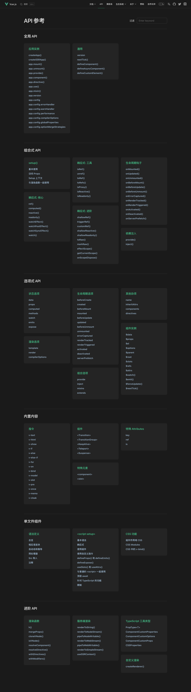

## Vue 概览
该系列文章都基于Vue的3.2.41版本。
### Vue项目结构
```
core-main
├──packages
    ├── compiler-core          # 平台无关的编译核心
    ├── compiler-dom           # 浏览器环境编译dom相关
    ├── compiler-sfc           # 编译单文件Vue相关
    ├── compiler-ssr           # 服务器端编译ssr相关
    ├── reactivity             # 响应式核心
    ├── reactivity-transform   # 实验模块
    ├── runtime-core           # 平台无关的运行时render相关核心
    ├── runtime-dom            # 浏览器环境运行时dom render相关
    ├── runtime-test           # Vue内部测试用
    ├── server-renderer        # 用于 SSR 服务端渲染的逻辑
    ├── sfc-playground         # playground
    ├── shared                 # 公用方法等
    ├── size-check             # 用于观测tree-shaking后的大小
    ├── template-explorer      # 用于检查模板编译后的输出，主要用于开发调试
    ├── vue                    # vue实际用例 & vue3 的主要入口，包括运行时和编译器，包括几个不同的入口（开发版本、runtime 版本、full 版本） 
```
- **`compiler`** 模块负责 Vue 模板的解析、生成 render 方法
- **`runtime`** 模块负责调用 render 方法生成虚拟 DOM 并渲染，同时处理用户交互、更新应用状态等等
- **`vue`** 作为入口，分别依赖 compiler 和 runtime 2 个大模块。这两个大模块内部又将核心剥离出去，然后将浏览器环境相关的部分再放到一个单独的包中
  
`Vue3` 整个源码是通过 `monorepo` 的项目架构去维护的，根据功能将不同的模块拆分到 `packages` 目录下面不同的子目录中。这样使得模块拆分更细化，职责划分更明确，模块之间的依赖关系也更加明确，开发人员也更容易阅读、理解和更改所有模块源码，提高代码的可维护性。

另外一些 package（比如 `reactivity` 响应式库）是可以独立于 `Vue` 使用的，这样用户如果只想使用 `Vue3` 的响应式能力，可以单独依赖这个响应式库而不用去依赖整个 `Vue`。

另外从语法方面，`Vue3`支持了Typescript还有ES6中很多重要的API等。

### Vue API一览



- 全局API
列出了 `createApp()` 方法会返回的实例，此实例上所有的方法。以及 `version` 、 `nextTick()` 等全局方法。

- 组合式API
列出了响应式相关的API包括 `ref()`、 `reactive()`、 `computed()`、 `watchEffect()` 等。生命周期相关API。以及`setup`使用方法。

- 选项式API
列出了状态 `data`、 `props`、`computed`、`watch`、`methods`、`emits`、`expose` 等选项。渲染选项有 `template`、 `render`、 `compileOptions`。生命周期相关选项。组件实例上的带$符号的属性和方法。以及注册组件、注册指令、`provide`、`inject`等等。这块主要是兼容Vue2的写法。

- 内置内容
列出了v-if等等一系列指令。内置组件`<Transition>`、`<TransitionGroup>`、`<KeepAlive>`，Vue3新增了`<Teleport>`、`<Fragment>`组件。以及`key`、 `ref`、 `is`三个特殊属性。

- 单文件组件
列出了语法指导以及`setup`的用法和css相关的一些内容。

- 进阶API
列出了`h`、 `cloneVnodes`、 `isVnode`等渲染虚拟Node相关的高阶API。服务端渲染相关的API。`Typescript`工具箱。以及自定义渲染方法 `createRenderer()`。

[vue3 源码解析](https://zhuanlan.zhihu.com/p/362700214)