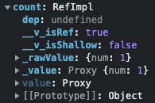
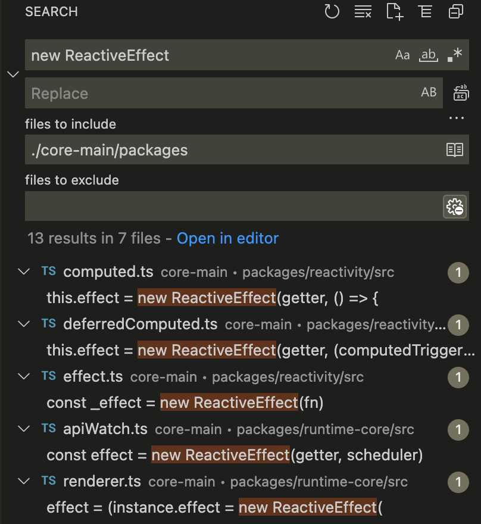

## Vue3的响应式原理

在分析Vue2的响应式的时候我们经常接触的几个概念：`render watcher`、 `user watcher`、 `computed watcher`等，在Vue3中使用副作用`effect`的概念同样监测响应式对象并进行相应的操作或更新。
- 在Vue2中的响应式关键：Observer、Dep、Watcher。
- 在Vue3中的响应式关键：Dep、ReactiveEffect。

响应式核心的API有：
- ref()
- reactive()
- readonly()
- computed()
- watchEffect()
- watchPostEffect()
- watchSyncEffect()
- watch()

### ref()
**new RefImpl() -> new Dep() ->trackRefValue()/triggerRefValue() -> trackEffects()/triggerEffects()**
- 关键词`<RefImpl>`、`<Dep>`、`<ReactiveEffect>`

官方文档提供的关于响应式API包含`ref()`函数，定义如下：接受一个**内部值**，返回一个响应式的、可更改的 `ref` 对象，此对象只有一个指向其内部值的属性 `.value`。

可以先来看一下`ref`函数的实现，首先调用`createRef`传入两个参数，第一个是值，第二个根据是`ref`还是`shallowRef`传入boolean值，然后实例化一个`RefImpl`对象，文件在`reactivity/src/ref.ts`，`<RefImpl>`类的实现如下：

```ts
// 深度响应式
export function ref(value?: unknown) {
  return createRef(value, false)
}
// 浅响应式
export function shallowRef(value?: unknown) {
  return createRef(value, true)
}

//【入参：原始值，是否浅作用】
function createRef(rawValue: unknown, shallow: boolean) {
  // 已经是ref响应式值直接返回
  if (isRef(rawValue)) {
    return rawValue
  }
  // 实例化一个RefImpl对象
  return new RefImpl(rawValue, shallow)
}

class RefImpl<T> {
  private _value: T
  private _rawValue: T

  public dep?: Dep = undefined
  public readonly __v_isRef = true

  constructor(value: T, public readonly __v_isShallow: boolean) {
    this._rawValue = __v_isShallow ? value : toRaw(value)
    this._value = __v_isShallow ? value : toReactive(value)
  }

  get value() {
    // 【依赖收集trackRefValue】
    trackRefValue(this)
    return this._value
  }

  set value(newVal) {
    const useDirectValue =
      this.__v_isShallow || isShallow(newVal) || isReadonly(newVal)
    newVal = useDirectValue ? newVal : toRaw(newVal)
    //【Object.is判断断两个值是否为同一个值】
    if (hasChanged(newVal, this._rawValue)) {
      this._rawValue = newVal
      this._value = useDirectValue ? newVal : toReactive(newVal)
      // 【派发更新triggerRefValue】
      triggerRefValue(this, newVal)
    }
  }
}
// 【根据一个 Vue 创建的代理返回其原始对象。】
export function toRaw<T>(observed: T): T {
  const raw = observed && (observed as Target)[ReactiveFlags.RAW]
  return raw ? toRaw(raw) : observed
}
// 【如果是对象改造进行proxy代理】
export const toReactive = <T extends unknown>(value: T): T =>
  isObject(value) ? reactive(value) : value
```

一个`ref`操作过的响应式对象如下，可以看到如果是原始值，那么`_rawValue`和`_value`的值是一样的，如果是一个对象，那么`_value`则是通过`proxy`改造后的值(调用reactive)，`_rawValue`是原始值：



然后继续看改写`value`属性的`get`和`set`部分的逻辑，在“类”的内部可以使用`get`和`set`关键字，对某个属性设置存值函数和取值函数，拦截该属性的存取行为。这部分就涉及到**依赖收集**和**派发更新**的内容了，在`get`中调用了`trackRefValue`函数继而调用`trackEffects`，在`set`中调用了`triggerRefValue`函数继而调用`triggerEffects`。

### reactive()
**new Proxy() ->track(target, TrackOpTypes.GET, key)/trigger(target, TriggerOpTypes.ADD, key, value) -> trackEffects()/triggerEffects()**
- 关键词`Proxy()`、`<Dep>`、`<ReactiveEffect>`

官方文档提供的关于响应式API包含`reactive()`函数定义如下，返回一个**对象**的响应式代理。

`reactive`方法返回`createReactiveObject`方法，文件在`reactivity/src/reactive.ts`，可以看到经过一系列判断，最终会用ES6特性`Proxy`包裹target对象，对target进行代理，最终返回一个响应式对象，并且用一个名为`reactiveMap`的`WeakMap`来存储`target`和对应的`proxy`用于后续的判断（代理过了也就无需再次处理了）：
```ts
export const reactiveMap = new WeakMap<Target, any>()
export const shallowReactiveMap = new WeakMap<Target, any>()
export const readonlyMap = new WeakMap<Target, any>()
export const shallowReadonlyMap = new WeakMap<Target, any>()

export function reactive(target: object) {
  // if trying to observe a readonly proxy, return the readonly version.
  if (isReadonly(target)) {
    return target
  }
  return createReactiveObject(
    target,
    false,
    mutableHandlers,
    mutableCollectionHandlers,
    reactiveMap
  )
}

function createReactiveObject(
  target: Target,
  isReadonly: boolean,
  baseHandlers: ProxyHandler<any>,
  collectionHandlers: ProxyHandler<any>,
  proxyMap: WeakMap<Target, any>
) {
  //【非对象，warn提示】
  if (!isObject(target)) {
    if (__DEV__) {
      console.warn(`value cannot be made reactive: ${String(target)}`)
    }
    return target
  }
  //【对象已经是Proxy直接返回】
  // target is already a Proxy, return it.
  // exception: calling readonly() on a reactive object
  if (
    target[ReactiveFlags.RAW] &&
    !(isReadonly && target[ReactiveFlags.IS_REACTIVE])
  ) {
    return target
  }
  //【reactiveMap已经有此Proxy对象直接返回】
  // target already has corresponding Proxy
  const existingProxy = proxyMap.get(target)
  if (existingProxy) {
    return existingProxy
  }
  //【不符合转换的对象不予处理】
  // only specific value types can be observed.
  const targetType = getTargetType(target)
  if (targetType === TargetType.INVALID) {
    return target
  }
  //【实例化Proxy对象，'Map'、'Set'、'WeakMap'、'WeakSet'类型使用collectionHandlers代理，'Object'、'Array'类型使用baseHandlers代理】
  const proxy = new Proxy(
    target,
    targetType === TargetType.COLLECTION ? collectionHandlers : baseHandlers
  )
  //【将当前Proxy对象加入reactiveMap中】
  proxyMap.set(target, proxy)
  return proxy
}
```

通常`reactive`处理的都是引用类型对象，所以针对不同类型的引用类型也会有不同的处理方式，所以需要进行判断，对target的`targetType`的判断内容如下，除列出的几个类型数据可以reactive处理外其余数据均划为INVALID类不予处理：
```ts
//【判断target类型】
export interface Target {
  [ReactiveFlags.SKIP]?: boolean
  [ReactiveFlags.IS_REACTIVE]?: boolean
  [ReactiveFlags.IS_READONLY]?: boolean
  [ReactiveFlags.IS_SHALLOW]?: boolean
  [ReactiveFlags.RAW]?: any
}
//【分为三类】
const enum TargetType {
  INVALID = 0,
  COMMON = 1,
  COLLECTION = 2
}
// 【Object、Array是COMMON】
// 【Map、Set、WeakMap、WeakSet是COLLECTION】
// 【其余是INVALID】不予处理响应式
function targetTypeMap(rawType: string) {
  switch (rawType) {
    case 'Object':
    case 'Array':
      return TargetType.COMMON
    case 'Map':
    case 'Set':
    case 'WeakMap':
    case 'WeakSet':
      return TargetType.COLLECTION
    default:
      return TargetType.INVALID
  }
}
function getTargetType(value: Target) {
  return value[ReactiveFlags.SKIP] || !Object.isExtensible(value)
    ? TargetType.INVALID
    : targetTypeMap(toRawType(value))
}
```

对target对象拦截的操作分别在`reactivity/src/baseHandlers.ts`和`reactivity/src/collectionHandlers.ts`中，我们先来研究最常规的处理`Object`和`Array`的`baseHandlers`中的`mutableHandlers`，代理了五个方法`get`,`set`,`deleteProperty`,`has`,`ownKeys`具体如下：
```ts
//【不同API的代理handler不同】
import {
  mutableHandlers,
  readonlyHandlers,
  shallowReactiveHandlers,
  shallowReadonlyHandlers
} from './baseHandlers'
import {
  mutableCollectionHandlers,
  readonlyCollectionHandlers,
  shallowCollectionHandlers,
  shallowReadonlyCollectionHandlers
} from './collectionHandlers'

// 【数据不同的响应式标志】
export const enum ReactiveFlags {
  SKIP = '__v_skip',
  IS_REACTIVE = '__v_isReactive',
  IS_READONLY = '__v_isReadonly',
  IS_SHALLOW = '__v_isShallow',
  RAW = '__v_raw'
}

export const mutableHandlers: ProxyHandler<object> = {
  get,
  set,
  deleteProperty,
  has,
  ownKeys
}
const get = /*#__PURE__*/ createGetter()
const set = /*#__PURE__*/ createSetter()

//【代理对象getter的方法，依赖收集操作类型是TrackOpTypes.GET】
function createGetter(isReadonly = false, shallow = false) {
  return function get(target: Target, key: string | symbol, receiver: object) {
    if (key === ReactiveFlags.IS_REACTIVE) {
      return !isReadonly
    } else if (key === ReactiveFlags.IS_READONLY) {
      return isReadonly
    } else if (key === ReactiveFlags.IS_SHALLOW) {
      return shallow
    } else if (
      key === ReactiveFlags.RAW &&
      receiver ===
        (isReadonly
          ? shallow
            ? shallowReadonlyMap
            : readonlyMap
          : shallow
          ? shallowReactiveMap
          : reactiveMap
        ).get(target)
    ) {
      return target
    }
    //【数组单独处理】
    const targetIsArray = isArray(target)

    if (!isReadonly && targetIsArray && hasOwn(arrayInstrumentations, key)) {
      return Reflect.get(arrayInstrumentations, key, receiver)
    }

    const res = Reflect.get(target, key, receiver)

    if (isSymbol(key) ? builtInSymbols.has(key) : isNonTrackableKeys(key)) {
      return res
    }
    //【非只读情况就进行依赖收集，操作类型为TrackOpTypes.GET】
    //【track(target, TrackOpTypes.GET, key)】
    if (!isReadonly) {
      track(target, TrackOpTypes.GET, key)
    }

    if (shallow) {
      return res
    }

    if (isRef(res)) {
      // ref unwrapping - skip unwrap for Array + integer key.
      return targetIsArray && isIntegerKey(key) ? res : res.value
    }

    if (isObject(res)) {
      // Convert returned value into a proxy as well. we do the isObject check
      // here to avoid invalid value warning. Also need to lazy access readonly
      // and reactive here to avoid circular dependency.
      return isReadonly ? readonly(res) : reactive(res)
    }

    return res
  }
}

//【代理对象setter的方法，派发更新操作类型是TriggerOpTypes.ADD或TriggerOpTypes.SET】
function createSetter(shallow = false) {
  return function set(
    target: object,
    key: string | symbol,
    value: unknown,
    receiver: object
  ): boolean {
    let oldValue = (target as any)[key]
    if (isReadonly(oldValue) && isRef(oldValue) && !isRef(value)) {
      return false
    }
    if (!shallow) {
      if (!isShallow(value) && !isReadonly(value)) {
        oldValue = toRaw(oldValue)
        value = toRaw(value)
      }
      if (!isArray(target) && isRef(oldValue) && !isRef(value)) {
        oldValue.value = value
        return true
      }
    } else {
      // in shallow mode, objects are set as-is regardless of reactive or not
    }

    //【数组的情况：修改target[key]，若key<target.length，操作类型是TriggerOpTypes.SET；修改target[key]，若key>target.length，操作类型是TriggerOpTypes.ADD】
    //【非数组的情况：判断target是否hasOwnProperty(key)，含有的话操作类型是TriggerOpTypes.SET，不含的话操作类型是TriggerOpTypes.ADD】
    const hadKey =
      isArray(target) && isIntegerKey(key)
        ? Number(key) < target.length
        : hasOwn(target, key)
    const result = Reflect.set(target, key, value, receiver)
    // don't trigger if target is something up in the prototype chain of original
    //【仅在此target上的key才会触发派发更新，原型链上的不会】
    if (target === toRaw(receiver)) {
      if (!hadKey) {
        //【target无此key，操作类型是TriggerOpTypes.ADD】
        //【trigger(target, TriggerOpTypes.ADD, key, value)】
        trigger(target, TriggerOpTypes.ADD, key, value)
      } else if (hasChanged(value, oldValue)) {
        //【target有key，操作类型是TriggerOpTypes.SET】
        //【trigger(target, TriggerOpTypes.SET, key, value, oldValue)】
        trigger(target, TriggerOpTypes.SET, key, value, oldValue)
      }
    }
    return result
  }
}

//【代理对象delete属性的方法，派发更新操作类型是TriggerOpTypes.DELETE】
function deleteProperty(target: object, key: string | symbol): boolean {
  const hadKey = hasOwn(target, key)
  const oldValue = (target as any)[key]
  const result = Reflect.deleteProperty(target, key)
  if (result && hadKey) {
    trigger(target, TriggerOpTypes.DELETE, key, undefined, oldValue)
  }
  return result
}

//【代理对象的in操作符，依赖收集操作类型是TrackOpTypes.HAS】
function has(target: object, key: string | symbol): boolean {
  const result = Reflect.has(target, key)
  if (!isSymbol(key) || !builtInSymbols.has(key)) {
    track(target, TrackOpTypes.HAS, key)
  }
  return result
}

//【代理对象遍历key的方法，依赖收集操作类型是TrackOpTypes.ITERATE】
function ownKeys(target: object): (string | symbol)[] {
  track(target, TrackOpTypes.ITERATE, isArray(target) ? 'length' : ITERATE_KEY)
  return Reflect.ownKeys(target)
}
```

可以看到在代理的`get`、`set`方法中分别调用了`track(target, TrackOpTypes.GET, key)`、`trigger(target, TriggerOpTypes.SET, key, value, oldValue)`进入到**依赖收集**`trackEffects`、**派发更新**`triggerEffects`的过程。

### ref、reactive实践

通过上面的研究，可以看出，`ref`通过实例化一个`RefImpl`对象，改写`value`属性的`get`和`set`去进行响应式改造，而`reactive`通过`Proxy`拦截对象属性的`get`和`set`等方法进行响应式改造，可以看出,`ref`更适合单个的、基本数据类型的，而`reactive`定义引用类型的对象。

### dep/effect

- `Dep`
然后我们再来看`createDep`函数看一下`dep`的结构，可以看到`dep`是`Set`类型，收集的是`<ReactiveEffect>`类型的`effects`，`<Dep>`类的实现如下，dep实例其实就是一个ReactiveEffect元素组成的Set，还有w、n两个属性：
```ts
export const createDep = (effects?: ReactiveEffect[]): Dep => {
  const dep = new Set<ReactiveEffect>(effects) as Dep
  dep.w = 0
  dep.n = 0
  return dep
}
```

- `ReactiveEffect`
`<ReactiveEffect>`类的实现如下，`run()`方法根据`effectTrackDepth <= maxMarkerBits`判断执行`initDepMarkers(this)`和`finalizeDepMarkers(this)`或`cleanupEffect(this)`，最后会执行`fn`回调进行具体的更新或者其他作用：
```ts
// 【全局的activeEffect，存储当前创建/运行的组件renderEffect实例】
export let activeEffect: ReactiveEffect | undefined
// 【默认需要收集】
export let shouldTrack = true

export class ReactiveEffect<T = any> {
  active = true
  deps: Dep[] = []
  parent: ReactiveEffect | undefined = undefined

  /**
   * Can be attached after creation
   * @internal
   */
  computed?: ComputedRefImpl<T>
  /**
   * @internal
   */
  allowRecurse?: boolean
  /**
   * @internal
   */
  private deferStop?: boolean

  onStop?: () => void
  // dev only
  onTrack?: (event: DebuggerEvent) => void
  // dev only
  onTrigger?: (event: DebuggerEvent) => void

  constructor(
    public fn: () => T,
    public scheduler: EffectScheduler | null = null,
    scope?: EffectScope
  ) {
    recordEffectScope(this, scope)
  }

  run() {
    if (!this.active) {
      return this.fn()
    }
    let parent: ReactiveEffect | undefined = activeEffect
    let lastShouldTrack = shouldTrack
    while (parent) {
      if (parent === this) {
        return
      }
      parent = parent.parent
    }
    try {
      this.parent = activeEffect
      activeEffect = this
      shouldTrack = true

      trackOpBit = 1 << ++effectTrackDepth

      //【如果依赖收集嵌套深度比最大限制30还大，就清除所有effect】
      if (effectTrackDepth <= maxMarkerBits) {
        initDepMarkers(this)
      } else {
        cleanupEffect(this)
      }
      return this.fn()
    } finally {
      if (effectTrackDepth <= maxMarkerBits) {
        finalizeDepMarkers(this)
      }

      trackOpBit = 1 << --effectTrackDepth

      activeEffect = this.parent
      shouldTrack = lastShouldTrack
      this.parent = undefined

      if (this.deferStop) {
        this.stop()
      }
    }
  }

  stop() {
    // stopped while running itself - defer the cleanup
    if (activeEffect === this) {
      this.deferStop = true
    } else if (this.active) {
      cleanupEffect(this)
      if (this.onStop) {
        this.onStop()
      }
      this.active = false
    }
  }
}
// 【遍历当前ReactiveEffect实例的deps的w属性进行计算，表示是否收集过】
export const initDepMarkers = ({ deps }: ReactiveEffect) => {
  if (deps.length) {
    for (let i = 0; i < deps.length; i++) {
      deps[i].w |= trackOpBit // set was tracked
    }
  }
}
// 【遍历当前ReactiveEffect实例的deps根据是否收集过以及是否重新收集的，如果收集过或者不是重新收集的则从dep中删除本ReactiveEffect实例，否则当前ReactiveEffect实例的deps推入此dep】
export const finalizeDepMarkers = (effect: ReactiveEffect) => {
  const { deps } = effect
  if (deps.length) {
    let ptr = 0
    for (let i = 0; i < deps.length; i++) {
      const dep = deps[i]
      if (wasTracked(dep) && !newTracked(dep)) {
        dep.delete(effect)
      } else {
        deps[ptr++] = dep
      }
      // clear bits
      dep.w &= ~trackOpBit
      dep.n &= ~trackOpBit
    }
    deps.length = ptr
  }
}
//【超限的时候需要清空所有依赖】
function cleanupEffect(effect: ReactiveEffect) {
  const { deps } = effect
  if (deps.length) {
    for (let i = 0; i < deps.length; i++) {
      deps[i].delete(effect)
    }
    deps.length = 0
  }
}
```

那么`<ReactiveEffect>`类型的`effects`会在何时实例化呢，可以看到如下，在`effect`、`watch`、`computed`、`render`等api的实现中会实例化`ReactiveEffect`用于依赖收集和派发更新：



### `trackRefValue`/`triggerRefValue`
- 依赖收集`trackRefValue`/派发更新`triggerRefValue`
- 在`ref()`实例化`RefImpl`然后改写`value`属性的`getter`/`setter`中使用
- 最终会调用`trackEffects`/`triggerEffects`
```ts
//【基础ref包含dep（可选）和value属性】
type RefBase<T> = {
  dep?: Dep
  value: T
}

//【依赖收集的操作类型】
export const enum TrackOpTypes {
  GET = 'get',
  HAS = 'has',
  ITERATE = 'iterate'
}

export function trackRefValue(ref: RefBase<any>) {
  if (shouldTrack && activeEffect) {
    ref = toRaw(ref)
    //【ref.dep若不存在，调用createDep()生成对应dep】
    if (__DEV__) {
      trackEffects(ref.dep || (ref.dep = createDep()), {
        target: ref,
        type: TrackOpTypes.GET,
        key: 'value'
      })
    } else {
      trackEffects(ref.dep || (ref.dep = createDep()))
    }
  }
}

//【派发更新的操作类型】
export const enum TriggerOpTypes {
  SET = 'set',
  ADD = 'add',
  DELETE = 'delete',
  CLEAR = 'clear'
}
export function triggerRefValue(ref: RefBase<any>, newVal?: any) {
  ref = toRaw(ref)
  if (ref.dep) {
    if (__DEV__) {
      triggerEffects(ref.dep, {
        target: ref,
        type: TriggerOpTypes.SET,
        key: 'value',
        newValue: newVal
      })
    } else {
      triggerEffects(ref.dep)
    }
  }
}
```

### `track`/`trigger`
- 依赖收集`track`/派发更新`trigger`
- 在`reactive()`用`Proxy`代理的`get`/`set`/`deleteProperty`/`has`/`ownKeys`方法中使用
- 最终会调用`trackEffects`/`triggerEffects`
```ts
//【依赖收集的操作类型】
export const enum TrackOpTypes {
  GET = 'get',
  HAS = 'has',
  ITERATE = 'iterate'
}
export let activeEffect: ReactiveEffect | undefined
// The main WeakMap that stores {target -> key -> dep} connections.
// Conceptually, it's easier to think of a dependency as a Dep class
// which maintains a Set of subscribers, but we simply store them as
// raw Sets to reduce memory overhead.
type KeyToDepMap = Map<any, Dep>
const targetMap = new WeakMap<any, KeyToDepMap>()//【用来存储<reactive对象，该对象的dep Map>，dep Map存储了此reactive对象所有key的dep Set】

//【依赖收集-reactive是对象，要对对象里每一个属性进行操作】
export function track(target: object, type: TrackOpTypes, key: unknown) {
  if (shouldTrack && activeEffect) {
    // 【targetMap：{target -> key -> dep} 查找reactive对象某个key的dep Set，没有就新建，然后进入trackEffects依赖收集过程】
    let depsMap = targetMap.get(target)
    if (!depsMap) {
      targetMap.set(target, (depsMap = new Map()))
    }
    let dep = depsMap.get(key)
    if (!dep) {
      depsMap.set(key, (dep = createDep()))
    }

    const eventInfo = __DEV__
      ? { effect: activeEffect, target, type, key }
      : undefined

    trackEffects(dep, eventInfo)
  }
}


//【派发更新的操作类型】
export const enum TriggerOpTypes {
  SET = 'set',
  ADD = 'add',
  DELETE = 'delete',
  CLEAR = 'clear'
}
export const ITERATE_KEY = Symbol(__DEV__ ? 'iterate' : '')
export const MAP_KEY_ITERATE_KEY = Symbol(__DEV__ ? 'Map key iterate' : '')

// 派发更新
export function trigger(
  target: object,
  type: TriggerOpTypes,
  key?: unknown,
  newValue?: unknown,
  oldValue?: unknown,
  oldTarget?: Map<unknown, unknown> | Set<unknown>
) {
  //【targetMap：{target -> key -> dep} 查找reactive对象某个key的dep Set】
  const depsMap = targetMap.get(target)
  if (!depsMap) {
    // never been tracked
    return
  }

  //【寻找target的某个key属性的deps数组，存储的是effects】
  let deps: (Dep | undefined)[] = []
  if (type === TriggerOpTypes.CLEAR) {
    //【Map/Set的clear方法】
    // collection being cleared
    // trigger all effects for target
    deps = [...depsMap.values()]
  } else if (key === 'length' && isArray(target)) {
    //【减少数组的length】
    depsMap.forEach((dep, key) => {
      if (key === 'length' || key >= toNumber(newValue)) {
        deps.push(dep)
      }
    })
  } else {
    // schedule runs for SET | ADD | DELETE
    if (key !== void 0) {
      deps.push(depsMap.get(key))
    }

    // also run for iteration key on ADD | DELETE | Map.SET
    switch (type) {
      //【TriggerOpTypes.ADD】
      case TriggerOpTypes.ADD:
        if (!isArray(target)) {
          //【SET使用了add方法的情况】-新增了内容
          deps.push(depsMap.get(ITERATE_KEY))
          if (isMap(target)) {
            deps.push(depsMap.get(MAP_KEY_ITERATE_KEY))
          }
        } else if (isIntegerKey(key)) {
          //【数组通过索引新增元素的情况：会触发length属性的变化】
          // new index added to array -> length changes
          deps.push(depsMap.get('length'))
        }
        break
      //【TriggerOpTypes.DELETE】
      case TriggerOpTypes.DELETE:
        //【SET使用了delete方法的情况】-减少了内容
        //【MAP使用了delete方法的情况】-减少了内容
        if (!isArray(target)) {
          deps.push(depsMap.get(ITERATE_KEY))
          if (isMap(target)) {
            deps.push(depsMap.get(MAP_KEY_ITERATE_KEY))
          }
        }
        break
      //【TriggerOpTypes.SET】
      case TriggerOpTypes.SET:
        //【MAP使用了set方法的情况】-新增了内容
        if (isMap(target)) {
          deps.push(depsMap.get(ITERATE_KEY))
        }
        break
    }
  }

  const eventInfo = __DEV__
    ? { target, type, key, newValue, oldValue, oldTarget }
    : undefined

  //【循环遍历deps并调用triggerEffects】
  if (deps.length === 1) {
    if (deps[0]) {
      if (__DEV__) {
        triggerEffects(deps[0], eventInfo)
      } else {
        triggerEffects(deps[0])
      }
    }
  } else {
    const effects: ReactiveEffect[] = []
    for (const dep of deps) {
      if (dep) {
        effects.push(...dep)
      }
    }
    if (__DEV__) {
      triggerEffects(createDep(effects), eventInfo)
    } else {
      triggerEffects(createDep(effects))
    }
  }
}
```

### `trackEffects`/`triggerEffects`
- 依赖收集`trackEffects`/派发更新`triggerEffects`
我们来分析一下**依赖收集**和**派发更新**的具体过程，`activeEffect`用于收集全局唯一的当前正在收集的这个`effect`，`dep`实例有两个属性`w`和`n`用于判断是否需要将当前`effect`加入`dep Set`进行收集，`w`用来表示以前是否被收集过，`n`表示是否是重新收集，这两标记用二进制表示，用于与`trackOpBit`做位运算，先看`trackEffects`函数经过一系列判断，最关键的是在`dep.add(activeEffect!);activeEffect!.deps.push(dep);`语句就是完成依赖收集的过程，再看`triggerEffects`函数，将`dep`转化为数组并且遍历调用`triggerEffect`函数，然后调用每一个`effect`实例的`scheduler`或`run`方法，进行派发更新。
```ts 
//【依赖收集嵌套深度】
// The number of effects currently being tracked recursively.
let effectTrackDepth = 0
export let trackOpBit = 1
/**
 * The bitwise track markers support at most 30 levels of recursion.
 * This value is chosen to enable modern JS engines to use a SMI on all platforms.
 * When recursion depth is greater, fall back to using a full cleanup.
 */
//【依赖收集的最大数量】
const maxMarkerBits = 30
export let activeEffect: ReactiveEffect | undefined

export function trackEffects(
  dep: Dep,
  debuggerEventExtraInfo?: DebuggerEventExtraInfo
) {
  let shouldTrack = false
  //【判断是否需要track】
  if (effectTrackDepth <= maxMarkerBits) {
    if (!newTracked(dep)) {
      dep.n |= trackOpBit // set newly tracked
      shouldTrack = !wasTracked(dep)
    }
  } else {
    // Full cleanup mode.
    shouldTrack = !dep.has(activeEffect!)
  }

  if (shouldTrack) {
    //【dep收集当前副作用activeEffect，当前副作用activeEffect的deps收集当前dep】
    dep.add(activeEffect!)
    activeEffect!.deps.push(dep)
    if (__DEV__ && activeEffect!.onTrack) {
      activeEffect!.onTrack({
        effect: activeEffect!,
        ...debuggerEventExtraInfo!
      })
    }
  }
}

export function triggerEffects(
  dep: Dep | ReactiveEffect[],
  debuggerEventExtraInfo?: DebuggerEventExtraInfo
) {
  //【TODO：这块为什么循环两遍】
  // spread into array for stabilization
  const effects = isArray(dep) ? dep : [...dep]
  for (const effect of effects) {
    if (effect.computed) {
      triggerEffect(effect, debuggerEventExtraInfo)
    }
  }
  for (const effect of effects) {
    if (!effect.computed) {
      triggerEffect(effect, debuggerEventExtraInfo)
    }
  }
}

function triggerEffect(
  effect: ReactiveEffect,
  debuggerEventExtraInfo?: DebuggerEventExtraInfo
) {
  if (effect !== activeEffect || effect.allowRecurse) {
    if (__DEV__ && effect.onTrigger) {
      effect.onTrigger(extend({ effect }, debuggerEventExtraInfo))
    }
    //【执行scheduler或run方法】
    if (effect.scheduler) {
      effect.scheduler()
    } else {
      effect.run()
    }
  }
}

export const wasTracked = (dep: Dep): boolean => (dep.w & trackOpBit) > 0

export const newTracked = (dep: Dep): boolean => (dep.n & trackOpBit) > 0
```

### 响应式的辅助方法
响应式除了`ref()`/`reactive()`以外，还暴露了一些辅助的API如下：
```ts
// 【检查某个值是否为 ref】
export function isRef(r: any): r is Ref {
  return !!(r && r.__v_isRef === true)
}
// 【如果参数是 ref，则返回内部值，否则返回参数本身。这是 val = isRef(val) ? val.value : val 计算的一个语法糖。】
export function unref<T>(ref: T | Ref<T>): T {
  return isRef(ref) ? (ref.value as any) : ref
}
// 【基于响应式对象上的一个属性，创建一个对应的 ref。这样创建的 ref 与其源属性保持同步：改变源属性的值将更新 ref 的值，反之亦然。】
export function toRef<T extends object, K extends keyof T>(
  object: T,
  key: K,
  defaultValue?: T[K]
): ToRef<T[K]> {
  const val = object[key]
  return isRef(val)
    ? val
    : (new ObjectRefImpl(object, key, defaultValue) as any)
}
// 【将一个响应式对象转换为一个普通对象，这个普通对象的每个属性都是指向源对象相应属性的 ref。每个单独的 ref 都是使用 toRef() 创建的。】
export function toRefs<T extends object>(object: T): ToRefs<T> {
  if (__DEV__ && !isProxy(object)) {
    console.warn(`toRefs() expects a reactive object but received a plain one.`)
  }
  const ret: any = isArray(object) ? new Array(object.length) : {}
  for (const key in object) {
    ret[key] = toRef(object, key)
  }
  return ret
}
// 【检查一个对象是否是由 reactive()、readonly()、shallowReactive() 或 shallowReadonly() 创建的代理。】
export function isProxy(value: unknown): boolean {
  return isReactive(value) || isReadonly(value)
}
// 【检查一个对象是否是由 reactive() 或 shallowReactive() 创建的代理。】
export function isReactive(value: unknown): boolean {
  if (isReadonly(value)) {
    return isReactive((value as Target)[ReactiveFlags.RAW])
  }
  return !!(value && (value as Target)[ReactiveFlags.IS_REACTIVE])
}
// 【检查传入的值是否为只读对象。只读对象的属性可以更改，但他们不能通过传入的对象直接赋值。通过 readonly() 和 shallowReadonly() 创建的代理都是只读的，因为他们是没有 set 函数的 computed() ref。】
export function isReadonly(value: unknown): boolean {
  return !!(value && (value as Target)[ReactiveFlags.IS_READONLY])
}
// 【ref() 的浅层作用形式。】
export function shallowRef(value?: unknown) {
  return createRef(value, true)
}
// 【强制触发依赖于一个浅层 ref 的副作用，这通常在对浅引用的内部值进行深度变更后使用。】
export function triggerRef(ref: Ref) {
  triggerRefValue(ref, __DEV__ ? ref.value : void 0)
}
// 【创建一个自定义的 ref，显式声明对其依赖追踪和更新触发的控制方式。】
export function customRef<T>(factory: CustomRefFactory<T>): Ref<T> {
  return new CustomRefImpl(factory) as any
}
// 【reactive() 的浅层作用形式。】
export function shallowReactive<T extends object>(
  target: T
): ShallowReactive<T> {
  return createReactiveObject(
    target,
    false,
    shallowReactiveHandlers,
    shallowCollectionHandlers,
    shallowReactiveMap
  )
}
// 【readonly() 的浅层作用形式】
export function shallowReadonly<T extends object>(target: T): Readonly<T> {
  return createReactiveObject(
    target,
    true,
    shallowReadonlyHandlers,
    shallowReadonlyCollectionHandlers,
    shallowReadonlyMap
  )
}
// 【根据一个 Vue 创建的代理返回其原始对象。】
export function toRaw<T>(observed: T): T {
  const raw = observed && (observed as Target)[ReactiveFlags.RAW]
  return raw ? toRaw(raw) : observed
}
// 【将一个对象标记为不可被转为代理。返回该对象本身。】
export function markRaw<T extends object>(
  value: T
): T & { [RawSymbol]?: true } {
  def(value, ReactiveFlags.SKIP, true)
  return value
}
// 【创建一个 effect 作用域，可以捕获其中所创建的响应式副作用 (即计算属性和侦听器)，这样捕获到的副作用可以一起处理。】
export function effectScope(detached?: boolean) {
  return new EffectScope(detached)
}
// 【如果有的话，返回当前活跃的 effect 作用域。】
export function getCurrentScope() {
  return activeEffectScope
}
// 【在当前活跃的 effect 作用域上注册一个处理回调函数。当相关的 effect 作用域停止时会调用这个回调函数。这个方法可以作为可复用的组合式函数中 onUnmounted 的替代品，它并不与组件耦合，因为每一个 Vue 组件的 setup() 函数也是在一个 effect 作用域中调用的。】
export function onScopeDispose(fn: () => void) {
  if (activeEffectScope) {
    activeEffectScope.cleanups.push(fn)
  } else if (__DEV__) {
    warn(
      `onScopeDispose() is called when there is no active effect scope` +
        ` to be associated with.`
    )
  }
}


export function isShallow(value: unknown): boolean {
  return !!(value && (value as Target)[ReactiveFlags.IS_SHALLOW])
}

export const toReactive = <T extends unknown>(value: T): T =>
  isObject(value) ? reactive(value) : value

export const toReadonly = <T extends unknown>(value: T): T =>
  isObject(value) ? readonly(value as Record<any, any>) : value
```

### 总结