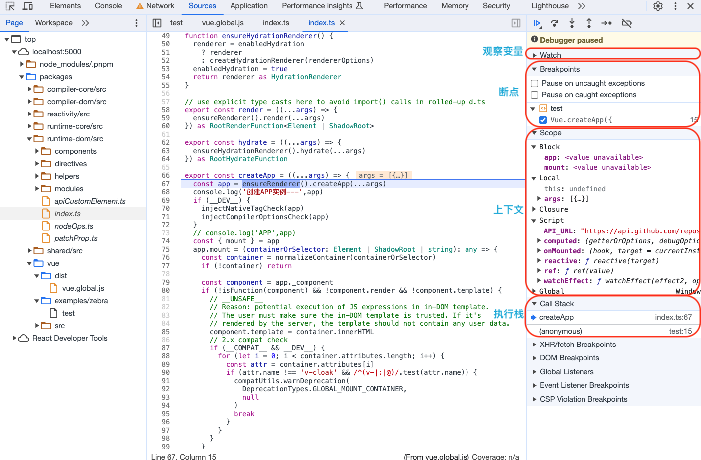

# Vue3源代码调试

## 源码编译-开发环境

vue3 源码的`package.json`中两个运行脚本如下，可以看到运行的是`script`文件夹下的两个js文件，那么我们就来看看这两个文件做了一些什么事。

```json
"dev": "node scripts/dev.js",
"build": "node scripts/build.js",
```

`dev.js`内容如下，可以看到dev模式下代码是用`esbuild`进行打包，入口文件是`../packages/vue/src/index.ts`，后续探索vue3源码的入口就在此：

```js
// Using esbuild for faster dev builds.
// We are still using Rollup for production builds because it generates
// smaller files w/ better tree-shaking.

// @ts-check
const { build } = require('esbuild')
const nodePolyfills = require('@esbuild-plugins/node-modules-polyfill')
const { resolve, relative } = require('path')
const args = require('minimist')(process.argv.slice(2))

// target读取命令行参数寻找打包入口文件，没有的话默认就是../packages/vue/src/index.ts
const target = args._[0] || 'vue'
const format = args.f || 'global'
const inlineDeps = args.i || args.inline
const pkg = require(resolve(__dirname, `../packages/${target}/package.json`))

// resolve output
const outputFormat = format.startsWith('global')
  ? 'iife'
  : format === 'cjs'
  ? 'cjs'
  : 'esm'

const postfix = format.endsWith('-runtime')
  ? `runtime.${format.replace(/-runtime$/, '')}`
  : format

const outfile = resolve(
  __dirname,
  `../packages/${target}/dist/${
    target === 'vue-compat' ? `vue` : target
  }.${postfix}.js`
)
const relativeOutfile = relative(process.cwd(), outfile)

// resolve externals
// TODO this logic is largely duplicated from rollup.config.js
let external = []
if (!inlineDeps) {
  // cjs & esm-bundler: external all deps
  if (format === 'cjs' || format.includes('esm-bundler')) {
    external = [
      ...external,
      ...Object.keys(pkg.dependencies || {}),
      ...Object.keys(pkg.peerDependencies || {}),
      // for @vue/compiler-sfc / server-renderer
      'path',
      'url',
      'stream'
    ]
  }

  if (target === 'compiler-sfc') {
    const consolidateDeps = require.resolve('@vue/consolidate/package.json', {
      paths: [resolve(__dirname, `../packages/${target}/`)]
    })
    external = [
      ...external,
      ...Object.keys(require(consolidateDeps).devDependencies),
      'fs',
      'vm',
      'crypto',
      'react-dom/server',
      'teacup/lib/express',
      'arc-templates/dist/es5',
      'then-pug',
      'then-jade'
    ]
  }
}

// 【使用esbuild打包】
build({
  entryPoints: [resolve(__dirname, `../packages/${target}/src/index.ts`)],
  outfile,
  bundle: true,
  external,
  sourcemap: true,
  format: outputFormat,
  globalName: pkg.buildOptions?.name,
  platform: format === 'cjs' ? 'node' : 'browser',
  plugins:
    format === 'cjs' || pkg.buildOptions?.enableNonBrowserBranches
      ? [nodePolyfills.default()]
      : undefined,
  // 提供了一种用常量表达式替换全局标识符的方法。 它可以在不改变代码本身的情况下改变某些构建之间代码的行为
  define: {
    __COMMIT__: `"dev"`,
    __VERSION__: `"${pkg.version}"`,
    __DEV__: `true`,
    __TEST__: `false`,
    __BROWSER__: String(
      format !== 'cjs' && !pkg.buildOptions?.enableNonBrowserBranches
    ),
    __GLOBAL__: String(format === 'global'),
    __ESM_BUNDLER__: String(format.includes('esm-bundler')),
    __ESM_BROWSER__: String(format.includes('esm-browser')),
    __NODE_JS__: String(format === 'cjs'),
    __SSR__: String(format === 'cjs' || format.includes('esm-bundler')),
    __COMPAT__: String(target === 'vue-compat'),
    __FEATURE_SUSPENSE__: `true`,
    __FEATURE_OPTIONS_API__: `true`,
    __FEATURE_PROD_DEVTOOLS__: `false`
  },
  watch: {
    onRebuild(error) {
      if (!error) console.log(`rebuilt: ${relativeOutfile}`)
    }
  }
}).then(() => {
  console.log(`watching: ${relativeOutfile}`)
})
```

## 源码编译-生产环境

`build.js`内容如下，可以看到生产打包用的是`rollup`，并且`packages`文件夹下有多个独立的代码仓库，会逐个对每个仓库进行打包：

```js
/*
Produces production builds and stitches together d.ts files.

To specify the package to build, simply pass its name and the desired build
formats to output (defaults to `buildOptions.formats` specified in that package,
or "esm,cjs"):


# name supports fuzzy match. will build all packages with name containing "dom":
nr build dom

# specify the format to output
nr build core --formats cjs

*/

const fs = require('fs-extra')
const path = require('path')
const chalk = require('chalk')
const execa = require('execa')
const { gzipSync } = require('zlib')
const { compress } = require('brotli')
const { targets: allTargets, fuzzyMatchTarget } = require('./utils')

const args = require('minimist')(process.argv.slice(2))
const targets = args._
const formats = args.formats || args.f
const devOnly = args.devOnly || args.d
const prodOnly = !devOnly && (args.prodOnly || args.p)
const sourceMap = args.sourcemap || args.s
const isRelease = args.release
const buildTypes = args.t || args.types || isRelease
const buildAllMatching = args.all || args.a
const commit = execa.sync('git', ['rev-parse', 'HEAD']).stdout.slice(0, 7)

run()

async function run() {
  if (isRelease) {
    // remove build cache for release builds to avoid outdated enum values
    await fs.remove(path.resolve(__dirname, '../node_modules/.rts2_cache'))
  }
  // 【进入buildAll方法】
  if (!targets.length) {
    await buildAll(allTargets)
    checkAllSizes(allTargets)
  } else {
    await buildAll(fuzzyMatchTarget(targets, buildAllMatching))
    checkAllSizes(fuzzyMatchTarget(targets, buildAllMatching))
  }
}

// 【进入runParallel方法，入参有：系统cpu数，目标资源，build方法】
async function buildAll(targets) {
  await runParallel(require('os').cpus().length, targets, build)
}

async function runParallel(maxConcurrency, source, iteratorFn) {
  console.log('🥒 ~ file: build.js:57 ~ runParallel ~ iteratorFn:', iteratorFn)
  console.log('🥒 ~ file: build.js:57 ~ runParallel ~ source:', source)
  console.log(
    '🥒 ~ file: build.js:57 ~ runParallel ~ maxConcurrency:',
    maxConcurrency
  )
  const ret = []//【所有任务】
  const executing = []//【正在并发执行中的任务，装载的是每个仓库打包这个异步任务完成后“删除”的任务】
  for (const item of source) {
    // 【遍历所有需要打包的仓库，每一个仓库都构造一个promise任务并push到ret数组中】
    const p = Promise.resolve().then(() => iteratorFn(item, source))
    ret.push(p)

    // 【如果最大并发任务数比仓库数小，那就要“竞争上岗”】
    if (maxConcurrency <= source.length) {
      // 【当前这个异步任务一旦执行完就从executing队列里删掉】
      const e = p.then(() => executing.splice(executing.indexOf(e), 1))
      executing.push(e)

      if (executing.length >= maxConcurrency) {
        // 【正在并发执行中的任务数大于等于最大并发数，那就用Promise.race方法剔除掉最先执行完的异步任务，这就是如何始终控制不超过最大并发数】
        await Promise.race(executing)
      }
    }
  }
  // 【最大任务并发数比仓库数量大，直接用Promise.all执行掉所有异步任务】
  return Promise.all(ret)
}

async function build(target) {
  // 【打包方法核心内容，用rollup打包】
  const pkgDir = path.resolve(`packages/${target}`)
  const pkg = require(`${pkgDir}/package.json`)

  // if this is a full build (no specific targets), ignore private packages
  if ((isRelease || !targets.length) && pkg.private) {
    return
  }

  // if building a specific format, do not remove dist.
  if (!formats) {
    await fs.remove(`${pkgDir}/dist`)
  }

  const env =
    (pkg.buildOptions && pkg.buildOptions.env) ||
    (devOnly ? 'development' : 'production')
  await execa(
    'rollup',
    [
      '-c',
      '--environment',
      [
        `COMMIT:${commit}`,
        `NODE_ENV:${env}`,
        `TARGET:${target}`,
        formats ? `FORMATS:${formats}` : ``,
        buildTypes ? `TYPES:true` : ``,
        prodOnly ? `PROD_ONLY:true` : ``,
        sourceMap ? `SOURCE_MAP:true` : ``
      ]
        .filter(Boolean)
        .join(',')
    ],
    { stdio: 'inherit' }
  )

  if (buildTypes && pkg.types) {
    console.log()
    console.log(
      chalk.bold(chalk.yellow(`Rolling up type definitions for ${target}...`))
    )

    // build types
    const { Extractor, ExtractorConfig } = require('@microsoft/api-extractor')

    const extractorConfigPath = path.resolve(pkgDir, `api-extractor.json`)
    const extractorConfig =
      ExtractorConfig.loadFileAndPrepare(extractorConfigPath)
    const extractorResult = Extractor.invoke(extractorConfig, {
      localBuild: true,
      showVerboseMessages: true
    })

    if (extractorResult.succeeded) {
      // concat additional d.ts to rolled-up dts
      const typesDir = path.resolve(pkgDir, 'types')
      if (await fs.exists(typesDir)) {
        const dtsPath = path.resolve(pkgDir, pkg.types)
        const existing = await fs.readFile(dtsPath, 'utf-8')
        const typeFiles = await fs.readdir(typesDir)
        const toAdd = await Promise.all(
          typeFiles.map(file => {
            return fs.readFile(path.resolve(typesDir, file), 'utf-8')
          })
        )
        await fs.writeFile(dtsPath, existing + '\n' + toAdd.join('\n'))
      }
      console.log(
        chalk.bold(chalk.green(`API Extractor completed successfully.`))
      )
    } else {
      console.error(
        `API Extractor completed with ${extractorResult.errorCount} errors` +
          ` and ${extractorResult.warningCount} warnings`
      )
      process.exitCode = 1
    }

    await fs.remove(`${pkgDir}/dist/packages`)
  }
}

function checkAllSizes(targets) {
  if (devOnly || (formats && !formats.includes('global'))) {
    return
  }
  console.log()
  for (const target of targets) {
    checkSize(target)
  }
  console.log()
}

function checkSize(target) {
  const pkgDir = path.resolve(`packages/${target}`)
  checkFileSize(`${pkgDir}/dist/${target}.global.prod.js`)
  if (!formats || formats.includes('global-runtime')) {
    checkFileSize(`${pkgDir}/dist/${target}.runtime.global.prod.js`)
  }
}

function checkFileSize(filePath) {
  if (!fs.existsSync(filePath)) {
    return
  }
  const file = fs.readFileSync(filePath)
  const minSize = (file.length / 1024).toFixed(2) + 'kb'
  const gzipped = gzipSync(file)
  const gzippedSize = (gzipped.length / 1024).toFixed(2) + 'kb'
  const compressed = compress(file)
  const compressedSize = (compressed.length / 1024).toFixed(2) + 'kb'
  console.log(
    `${chalk.gray(
      chalk.bold(path.basename(filePath))
    )} min:${minSize} / gzip:${gzippedSize} / brotli:${compressedSize}`
  )
}
```

其中最关键的内容是执行了一个异步任务`runParallel`方法，打印的内容如下，可以看到`runParallel`方法其实就是遍历`source`并调用`build`方法进行打包，最大并发任务数量是系统的cpu数(TODO:线程数？)。

1. 遍历`source`，包装`const p = Promise.resolve().then(() => iteratorFn(item, source))`并push到ret数组中
2. 如果`maxConcurrency`小于等于`source.length`也就是总任务数，包装`const e = p.then(() => executing.splice(executing.indexOf(e), 1))`并push到`executing`数组，这个Promise其实代表每个任务的完成并从`executing`删除当前任务
3. 一旦`executing`大于等于最大并发数`maxConcurrency`，就用`Promise.race(executing)`等待一个任务的完成（完成后会从executing数组中删掉自身），这样就能控制`executing`数量始终不超过最大并发数`maxConcurrency`

```js
🥒 ~ file: build.js:57 ~ runParallel ~ iteratorFn: [AsyncFunction: build]
🥒 ~ file: build.js:57 ~ runParallel ~ source: [
  'compiler-core',
  'compiler-dom',
  'compiler-sfc',
  'compiler-ssr',
  'reactivity',
  'reactivity-transform',
  'runtime-core',
  'runtime-dom',
  'server-renderer',
  'shared',
  'template-explorer',
  'vue',
  'vue-compat'
]
🥒 ~ file: build.js:57 ~ runParallel ~ maxConcurrency: 4

run()

async function run() {
  if (isRelease) {
    // remove build cache for release builds to avoid outdated enum values
    await fs.remove(path.resolve(__dirname, '../node_modules/.rts2_cache'))
  }
  if (!targets.length) {
    await buildAll(allTargets)
    checkAllSizes(allTargets)
  } else {
    await buildAll(fuzzyMatchTarget(targets, buildAllMatching))
    checkAllSizes(fuzzyMatchTarget(targets, buildAllMatching))
  }
}

async function buildAll(targets) {
  await runParallel(require('os').cpus().length, targets, build)
}

async function runParallel(maxConcurrency, source, iteratorFn) {
  console.log('🥒 ~ file: build.js:57 ~ runParallel ~ iteratorFn:', iteratorFn)
  console.log('🥒 ~ file: build.js:57 ~ runParallel ~ source:', source)
  console.log(
    '🥒 ~ file: build.js:57 ~ runParallel ~ maxConcurrency:',
    maxConcurrency
  )
  const ret = []//【所有任务】
  const executing = []//【正在并发执行中的任务，装载的是每个仓库打包这个异步任务完成后“删除”的任务】
  for (const item of source) {
    // 【遍历所有需要打包的仓库，每一个仓库都构造一个promise任务并push到ret数组中】
    const p = Promise.resolve().then(() => iteratorFn(item, source))
    ret.push(p)

    // 【如果最大并发任务数比仓库数小，那就要“竞争上岗”】
    if (maxConcurrency <= source.length) {
      // 【当前这个异步任务一旦执行完就从executing队列里删掉】
      const e = p.then(() => executing.splice(executing.indexOf(e), 1))
      executing.push(e)

      if (executing.length >= maxConcurrency) {
        // 【正在并发执行中的任务数大于等于最大并发数，那就用Promise.race方法剔除掉最先执行完的异步任务，这就是如何始终控制不超过最大并发数】
        await Promise.race(executing)
      }
    }
  }
  // 【最大任务并发数比仓库数量大，直接用Promise.all执行掉所有异步任务】
  return Promise.all(ret)
}
```

## 源码调试

1. 第一步打开`sourcemap`

```json
"dev": "node scripts/dev.js --sourcemap"
```

2. 运行`npm run serve`
3. 在浏览器中打开项目中`vue`文件夹下的`examples`里的示例代码或者自己写一个用例都可以
4. 添加断点进行调试，如果要进行一些代码修改或者打印，每次修改之后需要执行`npm run dev`重新打包代码



## Vue项目中调试Vue源码

要调试通过 `create-vue` 创建的 `Vue` 项目的 `Vue` 源码，可以按照以下步骤进行：

### 1. 安装和设置 Vue 项目

首先，通过 `create-vue` 创建一个新的 `Vue` 项目：

```bash
npm init vue@latest
```

按照提示配置项目，然后进入项目目录并安装依赖：

```bash
cd your-project-name
pnpm install
```

### 2. 克隆 Vue 源码

在你希望调试的地方克隆 `Vue` 仓库：

```bash
git clone https://github.com/vuejs/vue-next.git
```

进入克隆的仓库并安装依赖：

```bash
cd vue-next
pnpm install
```

### 3. 构建 Vue 源码

构建 `Vue` 的源码，以便你可以在你的项目中使用它：

```bash
pnpm run build
```

### 4. 在 Vue 项目中使用本地构建的 Vue 源码

你需要将项目的 `Vue` 依赖指向本地构建的 `Vue` 源码。首先，在你的 `Vue` 项目中删除现有的 `Vue` 依赖：

```bash
cd your-project-name
pnpm remove vue
```

然后使用 `pnpm link` 来连接本地构建的 `Vue`：

```bash
cd path/to/vue-next/packages/vue
pnpm link --global

cd path/to/your-project-name
pnpm link --global vue 
```

这样你的项目就会使用本地构建的 `Vue` 源码了。

## 参考资料

[esbuild 中文文档](https://esbuild.bootcss.com/)
